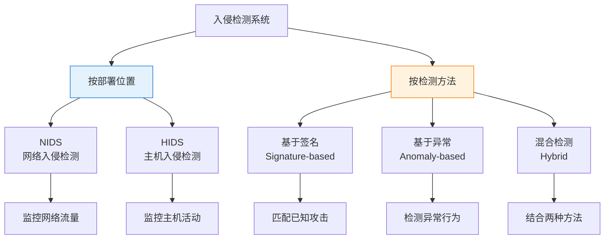
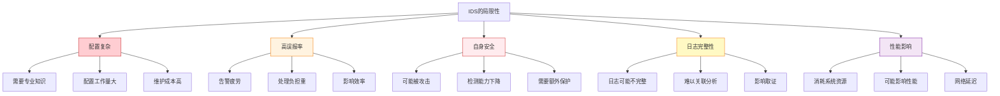
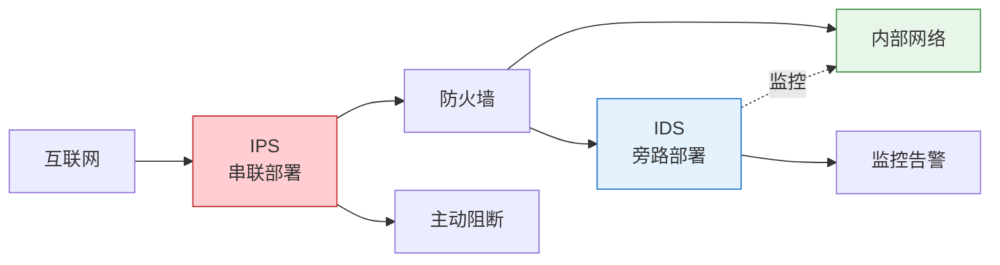
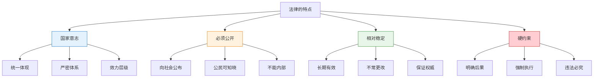
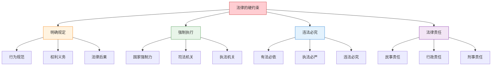

---
title: "CISP学习指南：入侵检测系统与法律基础"
date: 2025-10-21
categories:
  - Cybersecurity
tags:
  - CISP
excerpt: "深入解析CISP认证中的入侵检测系统局限性和信息安全法律基础知识点。"
lang: zh-CN
available_langs: []
permalink: /zh-CN/2025/10/CISP-IDS-Law/
thumbnail: /assets/cisp/thumbnail.png
thumbnail_80: /assets/cisp/thumbnail_80.png
series: cisp
canonical_lang: zh-CN
comments: true
---

入侵检测系统是网络安全的重要组成部分，而法律法规则为信息安全提供制度保障。

## 一、入侵检测系统（IDS）

### 1.1 IDS概述

**入侵检测系统的定义：**

!!!anote "🔍 入侵检测系统（IDS）"
    **Intrusion Detection System**
    
    一种监控网络或系统活动，检测恶意行为或策略违规的安全技术。
    
    **核心功能：**
    
    👁️ **监控**
    - 实时监控网络流量
    - 监控系统活动
    - 收集安全事件
    
    🔍 **检测**
    - 识别攻击行为
    - 发现异常活动
    - 检测策略违规
    
    📢 **告警**
    - 生成安全告警
    - 通知管理员
    - 记录事件日志

**IDS的分类：**



### 1.2 IDS的优势

**IDS的技术优越性：**

| 优势 | 说明 | 价值 |
|------|------|------|
| 实时监控 | 7×24小时持续监控 | 及时发现威胁 |
| 全面覆盖 | 监控多个层面 | 提高检测率 |
| 证据收集 | 记录攻击详情 | 支持事件分析 |
| 合规支持 | 满足审计要求 | 符合法规要求 |
| 威胁情报 | 积累攻击数据 | 改进防御策略 |

### 1.3 IDS的局限性

!!!anote "💡 入侵检测系统的局限性"
    入侵检测系统有其技术优越性，但也存在一些局限性。
    
    **常见的误解：**
    
    ❌ **配置简单论**
    - 错误说法：对用户知识要求高，但配置、操作和管理使用过于简单
    - 这是自相矛盾的说法
    - 正确理解：IDS对用户知识要求高，配置、操作和管理使用**复杂**
    - IDS配置复杂，需要专业知识
    - 配置不当容易产生误报或漏报
    - 管理和维护需要专业技能
    
    **真实的局限性：**
    
    ✅ **高误报率**
    - 入侵检测系统会产生大量的警告信息和可疑的入侵行为记录
    - 这是IDS的典型局限性
    - 误报率高导致告警疲劳，用户处理负担很重
    - 需要人工分析和判断，增加运维负担
    
    ✅ **自身安全问题**
    - 入侵检测系统在应对自身攻击时，对其他数据的检测可能会被控制或者受到影响
    - IDS本身可能成为攻击目标
    - 攻击者可能试图绕过或禁用IDS
    - IDS被攻击时检测能力下降，需要保护IDS自身安全
    
    ✅ **日志完整性问题**
    - 警告消息记录如果不完整，可能无法与入侵行为关联
    - 日志不完整影响分析，难以还原攻击过程
    - 影响事件响应，需要完整的日志记录

**IDS局限性详解：**



### 1.4 IDS的主要局限性

**详细分析各项局限性：**

```
IDS的局限性：
├── 1. 配置和管理复杂
│   ├── 问题：
│   │   ├── 对用户知识要求高
│   │   ├── 配置参数众多
│   │   ├── 规则编写复杂
│   │   └── 需要持续调优
│   ├── 影响：
│   │   ├── 部署周期长
│   │   ├── 人力成本高
│   │   ├── 配置错误风险
│   │   └── 维护难度大
│   └── 对策：
│       ├── 加强培训
│       ├── 使用模板
│       ├── 自动化工具
│       └── 专业服务
├── 2. 高误报率
│   ├── 问题：
│   │   ├── 产生大量告警
│   │   ├── 真实攻击淹没
│   │   ├── 告警疲劳
│   │   └── 处理负担重
│   ├── 影响：
│   │   ├── 降低响应效率
│   │   ├── 浪费人力资源
│   │   ├── 可能忽略真实威胁
│   │   └── 影响系统可信度
│   └── 对策：
│       ├── 规则优化
│       ├── 白名单机制
│       ├── 关联分析
│       └── 机器学习
├── 3. 自身安全问题
│   ├── 问题：
│   │   ├── IDS可能被攻击
│   │   ├── 检测能力被削弱
│   │   ├── 日志可能被篡改
│   │   └── 配置可能被修改
│   ├── 影响：
│   │   ├── 检测失效
│   │   ├── 产生盲区
│   │   ├── 证据丢失
│   │   └── 安全风险增加
│   └── 对策：
│       ├── 加固IDS系统
│       ├── 隔离部署
│       ├── 访问控制
│       └── 日志保护
├── 4. 日志完整性问题
│   ├── 问题：
│   │   ├── 日志可能不完整
│   │   ├── 存储空间限制
│   │   ├── 日志轮转丢失
│   │   └── 网络中断影响
│   ├── 影响：
│   │   ├── 无法完整还原攻击
│   │   ├── 难以关联分析
│   │   ├── 影响取证
│   │   └── 降低分析价值
│   └── 对策：
│       ├── 充足存储空间
│       ├── 集中日志管理
│       ├── 日志备份
│       └── 完整性校验
└── 5. 性能影响
    ├── 问题：
    │   ├── 消耗系统资源
    │   ├── 可能影响网络性能
    │   ├── 高流量时延迟
    │   └── 处理能力限制
    ├── 影响：
    │   ├── 业务性能下降
    │   ├── 用户体验变差
    │   ├── 可能丢包
    │   └── 检测不及时
    └── 对策：
        ├── 硬件加速
        ├── 分布式部署
        ├── 流量采样
        └── 性能优化
```

### 1.5 IDS与IPS的对比

**IDS vs IPS：**

| 特性 | IDS（检测） | IPS（防御） |
|------|-----------|-----------|
| 部署方式 | 旁路部署 | 串联部署 |
| 主要功能 | 检测和告警 | 检测和阻断 |
| 对流量影响 | 不影响 | 可能影响 |
| 误报影响 | 产生告警 | 可能阻断正常流量 |
| 响应方式 | 被动响应 | 主动防御 |
| 性能要求 | 相对较低 | 要求较高 |
| 适用场景 | 监控分析 | 实时防护 |

**IDS和IPS的结合使用：**



### 1.6 IDS的最佳实践

**有效使用IDS的建议：**

!!!tip "🎯 IDS最佳实践"
    **部署阶段：**
    - 合理规划部署位置
    - 选择合适的检测引擎
    - 配置基线规则
    - 进行充分测试
    
    **运营阶段：**
    - 持续优化规则
    - 降低误报率
    - 定期审查告警
    - 关联分析事件
    
    **维护阶段：**
    - 定期更新规则库
    - 监控系统性能
    - 备份配置和日志
    - 定期安全评估
    
    **人员培养：**
    - 加强专业培训
    - 建立知识库
    - 分享经验教训
    - 提升分析能力

## 二、信息安全法律基础

### 2.1 法律的概念

**法律的定义：**

!!!anote "⚖️ 什么是法律"
    法律是由国家制定或认可，并由国家强制力保证实施的，反映统治阶级意志的行为规范体系。
    
    **法律的特征：**
    
    🏛️ **国家意志**
    - 由国家制定或认可
    - 代表国家意志
    - 具有权威性
    
    ⚡ **强制性**
    - 由国家强制力保证实施
    - 违反有明确后果
    - 具有约束力
    
    📋 **规范性**
    - 规定行为准则
    - 明确权利义务
    - 具有普遍适用性

### 2.2 法律的特点

!!!anote "💡 法律的特点"
    关于法律的特点，需要正确理解其基本属性。
    
    **法律的正确特点：**
    
    ✅ **国家意志的统一体现**
    - 法律代表国家意志
    - 具有严密的逻辑体系
    - 不同法律之间有效力层级
    - 形成完整的法律体系
    
    ✅ **相对稳定性**
    - 一旦制定，就比较稳定，长期有效
    - 不允许经常更改，不能朝令夕改
    - 保证法律的权威性
    - 但可以根据需要修订
    
    ✅ **硬约束特征**
    - 法律对违法犯罪的后果有明确规定
    - 是一种"硬约束"
    - 法律规定明确的法律责任，违法必究
    - 具有强制执行力，是最严格的行为规范
    
    **常见误解：**
    
    ❌ **法律可以是"内部"的**
    - 这是错误的说法
    - 法律必须公开，这是基本原则
    - 不公开的规范不能称为法律
    - "内部"规定不具有法律效力
    - 法律的公开性保证公民知法守法

**法律的基本特点：**



### 2.3 法律的公开性

**为什么法律必须公开：**

```
法律公开的重要性：
├── 1. 保障公民权利
│   ├── 公民有权知道法律规定
│   ├── 了解自己的权利和义务
│   ├── 依法维护自身权益
│   └── 监督法律实施
├── 2. 确保法律实施
│   ├── 公开才能遵守
│   ├── 不知法难以守法
│   ├── 提高法律意识
│   └── 促进依法行政
├── 3. 维护法律权威
│   ├── 公开透明增强信任
│   ├── 防止暗箱操作
│   ├── 接受社会监督
│   └── 保证公平正义
└── 4. 法治原则要求
    ├── 法治的基本要求
    ├── 法律面前人人平等
    ├── 不能有秘密法律
    └── 保障司法公正
```

**法律公开的方式：**

| 公开方式 | 说明 | 示例 |
|---------|------|------|
| 官方公报 | 政府公报、法律公报 | 全国人大公报 |
| 官方网站 | 政府和立法机关网站 | 中国人大网 |
| 新闻媒体 | 报纸、电视、网络 | 新闻联播 |
| 法律汇编 | 法律法规汇编出版物 | 法律出版社 |
| 公共图书馆 | 法律资料查阅 | 各级图书馆 |

**"内部"规定的性质：**

!!!warning "⚠️ 内部规定不是法律"
    **内部规定的特点：**
    - 不对外公开
    - 仅在组织内部适用
    - 不具有法律效力
    - 不能作为执法依据
    
    **内部规定的作用：**
    - 组织内部管理
    - 工作流程规范
    - 纪律要求
    - 但不能违反法律
    
    **与法律的区别：**
    - 法律必须公开，内部规定不公开
    - 法律具有普遍约束力，内部规定仅限内部
    - 法律由国家强制力保证，内部规定靠组织纪律
    - 法律是"硬约束"，内部规定是"软约束"

### 2.4 法律的稳定性

**法律稳定性的意义：**

| 意义 | 说明 | 重要性 |
|------|------|--------|
| 保证可预期性 | 公民可以预期行为后果 | 维护法律秩序 |
| 维护权威性 | 法律不能朝令夕改 | 增强法律信任 |
| 保障权利 | 稳定的法律保护权利 | 保护公民权益 |
| 促进发展 | 稳定的法律环境 | 经济社会发展 |

**法律的修改和废止：**

- 📋 法律可以修改，但需要法定程序
- ⏱️ 修改不能过于频繁
- 🔄 重大修改需要充分论证
- 📢 修改后需要重新公布
- ⚖️ 保持法律体系的协调

### 2.5 法律的强制性

**法律的"硬约束"特征：**



**法律责任的类型：**

```
法律责任：
├── 民事责任
│   ├── 赔偿损失
│   ├── 恢复原状
│   ├── 停止侵害
│   └── 赔礼道歉
├── 行政责任
│   ├── 警告
│   ├── 罚款
│   ├── 没收违法所得
│   ├── 责令停产停业
│   └── 行政拘留
└── 刑事责任
    ├── 管制
    ├── 拘役
    ├── 有期徒刑
    ├── 无期徒刑
    └── 死刑
```

### 2.6 信息安全相关法律

**主要信息安全法律法规：**

| 法律法规 | 颁布时间 | 主要内容 |
|---------|---------|---------|
| 网络安全法 | 2017年 | 网络安全基本法 |
| 数据安全法 | 2021年 | 数据安全保护 |
| 个人信息保护法 | 2021年 | 个人信息保护 |
| 密码法 | 2020年 | 密码管理和应用 |
| 刑法（相关条款） | 多次修订 | 网络犯罪处罚 |

**信息安全法律的特点：**

- 📋 公开发布，全社会知晓
- ⚖️ 具有强制约束力
- 🔒 保护网络和数据安全
- 👥 保护个人信息权益
- ⚡ 明确法律责任

## 三、总结

入侵检测系统与法律基础的核心要点：

1. **IDS局限性**：配置复杂、高误报率、自身安全、日志完整性
2. **法律特点**：国家意志、必须公开、相对稳定、硬约束

!!!success "🎯 关键要点"
    - IDS对用户知识要求高，配置和管理复杂（不是简单）
    - IDS会产生大量告警，误报率高
    - IDS自身可能被攻击，影响检测能力
    - 日志不完整影响入侵行为关联分析
    - 法律是国家意志的统一体现
    - 法律必须公开，不能是"内部"的
    - 法律相对稳定，不允许经常更改
    - 法律是"硬约束"，有明确的法律后果

!!!tip "💡 实践建议"
    - 部署IDS需要专业人员
    - 持续优化规则降低误报
    - 保护IDS自身安全
    - 确保日志完整性
    - 结合IDS和IPS使用
    - 学习和遵守信息安全法律
    - 关注法律法规更新
    - 建立合规管理体系
