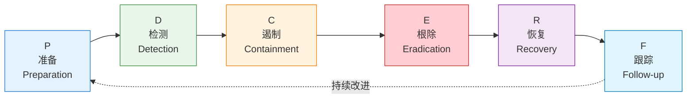
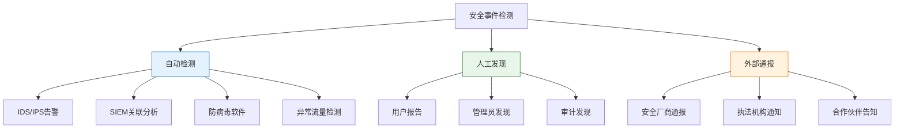
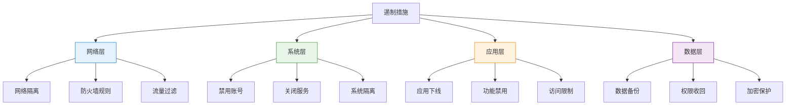
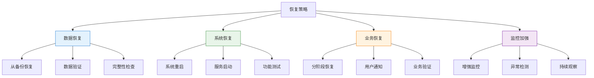
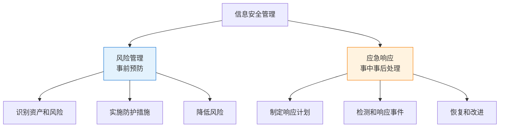

---
title: "CISP学习指南：安全事件应急响应与PDCERF方法论"
date: 2025-10-19
categories:
  - Cybersecurity
tags:
  - CISP
excerpt: "深入解析CISP认证中的安全事件应急响应，重点讲解PDCERF六阶段方法论和事件处理最佳实践。"
lang: zh-CN
available_langs: []
permalink: /zh-CN/2025/10/CISP-Incident-Response-PDCERF/
thumbnail: /assets/cisp/thumbnail.png
thumbnail_80: /assets/cisp/thumbnail_80.png
series: cisp
canonical_lang: zh-CN
---

安全事件应急响应是组织安全管理的重要组成部分，PDCERF方法论提供了系统化的事件处理框架，帮助组织有效应对安全事件。

## 一、安全事件应急响应概述

### 1.1 什么是安全事件应急响应

!!!anote "🚨 应急响应定义"
    **安全事件应急响应（Incident Response）**是指组织在安全事件发生时，采取的一系列有组织、有计划的活动，以快速检测、分析、遏制、消除和恢复安全事件。
    
    **核心目标：**
    - 快速检测和响应安全事件
    - 最小化损失和负面影响
    - 恢复正常业务运营
    - 防止类似事件再次发生
    - 收集证据用于后续分析

### 1.2 应急响应的重要性

**为什么需要应急响应：**

- ⏱️ 减少事件响应时间
- 💰 降低经济损失
- 🛡️ 保护组织声誉
- 📋 满足合规要求
- 📚 积累安全经验
- 🔄 持续改进安全能力

**没有应急响应计划的后果：**

| 问题 | 影响 |
|------|------|
| 响应混乱 | 延误处理时机 |
| 职责不清 | 相互推诿 |
| 流程缺失 | 处理不当 |
| 证据丢失 | 无法追溯 |
| 损失扩大 | 影响业务 |

## 二、PDCERF方法论

### 2.1 PDCERF六阶段模型

!!!anote "📊 PDCERF方法论"
    **PDCERF**是一种广泛使用的安全事件应急响应方法论，将应急响应分成**六个阶段**：
    
    1. **P - Preparation（准备阶段）**
    2. **D - Detection（检测阶段）**
    3. **C - Containment（遏制阶段）**
    4. **E - Eradication（根除阶段）**
    5. **R - Recovery（恢复阶段）**
    6. **F - Follow-up（跟踪阶段）**



### 2.2 准备阶段（Preparation）

!!!anote "🎯 准备阶段"
    **目标：**在事件发生前做好充分准备，建立应急响应能力。
    
    **核心活动：**
    - 制定应急响应计划
    - 组建应急响应团队
    - 部署监控和检测工具
    - 进行培训和演练
    - 准备应急资源

**准备阶段的关键工作：**

| 工作内容 | 说明 | 产出 |
|---------|------|------|
| 制定计划 | 编写应急响应计划和流程 | 应急响应手册 |
| 组建团队 | 明确角色和职责 | 应急响应团队 |
| 工具部署 | 部署监控、分析工具 | 安全监控平台 |
| 培训演练 | 定期培训和桌面推演 | 培训记录、演练报告 |
| 资源准备 | 准备备份、备件等 | 应急资源清单 |

**应急响应团队角色：**

```
应急响应团队：
├── 事件响应经理
│   └── 统筹协调、决策指挥
├── 安全分析师
│   └── 事件分析、威胁研判
├── 系统管理员
│   └── 系统操作、配置变更
├── 网络工程师
│   └── 网络隔离、流量分析
├── 法务顾问
│   └── 法律咨询、合规指导
└── 公关人员
    └── 对外沟通、声明发布
```

**准备阶段的最佳实践：**

- ✅ 定期更新应急响应计划
- ✅ 每季度进行一次演练
- ✅ 建立事件分类和优先级标准
- ✅ 准备应急联系人清单
- ✅ 建立与外部机构的联系渠道

### 2.3 检测阶段（Detection）

!!!anote "🔍 检测阶段"
    **目标：**及时发现安全事件的发生。
    
    **核心活动：**
    - 监控安全告警
    - 分析异常行为
    - 识别安全事件
    - 初步评估影响
    - 启动应急响应

**检测的来源：**



**事件分类和优先级：**

| 优先级 | 事件类型 | 响应时间 | 示例 |
|--------|---------|---------|------|
| P1 - 紧急 | 严重影响业务 | 15分钟内 | 勒索软件、数据泄露 |
| P2 - 高 | 重大安全威胁 | 1小时内 | APT攻击、系统入侵 |
| P3 - 中 | 一般安全事件 | 4小时内 | 病毒感染、钓鱼邮件 |
| P4 - 低 | 轻微安全问题 | 24小时内 | 策略违规、弱密码 |

**检测阶段的关键指标：**

- ⏱️ **平均检测时间（MTTD）**：从事件发生到被检测的时间
- 🎯 **检测准确率**：真实事件占告警总数的比例
- 📊 **误报率**：误报占告警总数的比例

!!!warning "⚠️ 常见问题"
    **检测阶段的挑战：**
    
    - 告警过多，难以处理
    - 误报率高，影响效率
    - 缺乏关联分析能力
    - 检测能力覆盖不足
    - 响应时间过长

### 2.4 遏制阶段（Containment）

!!!anote "🛑 遏制阶段"
    **目标：**阻止事件扩散，防止损失进一步扩大。
    
    **核心活动：**
    - 隔离受影响系统
    - 阻断攻击路径
    - 保护关键资产
    - 收集证据
    - 评估影响范围

**遏制策略：**

| 策略类型 | 说明 | 适用场景 | 示例 |
|---------|------|---------|------|
| 短期遏制 | 快速阻止扩散 | 紧急情况 | 断网、关机 |
| 长期遏制 | 维持业务运行 | 需要持续运营 | 网络隔离、访问限制 |
| 完全隔离 | 彻底切断连接 | 严重感染 | 物理隔离 |
| 部分隔离 | 限制特定通信 | 需要保留部分功能 | 防火墙规则 |

**遏制措施：**



**证据收集：**

- 💾 系统日志和审计记录
- 🖼️ 系统快照和内存镜像
- 📁 可疑文件和恶意代码
- 🌐 网络流量数据
- 📧 相关邮件和通信记录

### 2.5 根除阶段（Eradication）

!!!anote "🔨 根除阶段"
    **目标：**彻底清除威胁，消除安全隐患。
    
    **核心活动：**
    - 消除或阻断攻击源
    - 找到并消除系统的脆弱性/漏洞
    - 修改安全策略
    - 加强防范措施
    - 格式化被感染恶意程序的介质
    - 清除恶意代码
    - 修复漏洞
    - 删除后门
    - 重置凭证
    - 加固系统

!!!anote "💡 根除阶段的典型工作"
    在信息安全应急响应过程中，根除阶段的核心工作是彻底清除威胁。
    
    **根除阶段的典型措施：**
    
    ✅ **消除或阻断攻击源**
    ✅ **找到并消除系统的脆弱性/漏洞**
    ✅ **修改安全策略**
    ✅ **加强防范措施**
    ✅ **格式化被感染恶意程序的介质**
    
    **与其他阶段的区别：**
    
    ❌ **准备阶段（Preparation）**
    - 事前准备工作
    - 包括制定计划、组建团队、部署工具
    - 不包括实际的威胁清除工作
    
    ❌ **检测阶段（Detection）**
    - 发现和识别安全事件
    - 包括监控告警、分析异常、确认事件
    - 不包括清除威胁的工作
    
    ❌ **遏制阶段（Containment）**
    - 阻止事件扩散
    - 包括隔离系统、阻断攻击路径
    - 主要目标是防止损失扩大，而非彻底清除

**根除阶段与遏制阶段的区别：**

| 特征 | 遏制阶段（Containment） | 根除阶段（Eradication） |
|------|------------------------|------------------------|
| 目标 | 阻止事件扩散 | 彻底清除威胁 |
| 时机 | 事件发生后立即进行 | 遏制之后进行 |
| 措施 | 隔离、断网、限制访问 | 清除恶意代码、修复漏洞、加固系统 |
| 重点 | 快速响应、防止扩散 | 彻底清除、消除隐患 |
| 持续时间 | 短期 | 可能较长 |
| 业务影响 | 可能影响业务 | 尽量减少业务影响 |

**根除阶段的详细工作：**

```
根除阶段工作清单：
├── 1. 消除攻击源
│   ├── 阻断攻击者的访问
│   ├── 删除攻击者账号
│   ├── 清除后门程序
│   └── 撤销被盗凭证
├── 2. 清除恶意代码
│   ├── 使用杀毒软件清除
│   ├── 手工删除恶意文件
│   ├── 清理注册表项
│   └── 格式化被感染介质
├── 3. 修复漏洞
│   ├── 安装安全补丁
│   ├── 修复配置错误
│   ├── 更新软件版本
│   └── 加固系统配置
├── 4. 修改安全策略
│   ├── 更新访问控制策略
│   ├── 加强密码策略
│   ├── 调整防火墙规则
│   └── 更新安全基线
└── 5. 加强防范措施
    ├── 部署额外安全控制
    ├── 增强监控能力
    ├── 改进检测规则
    └── 加强安全培训
```

**根除措施：**

| 措施 | 说明 | 工具/方法 |
|------|------|----------|
| 恶意代码清除 | 删除病毒、木马等 | 杀毒软件、手工清除 |
| 漏洞修复 | 安装补丁、修复配置 | 补丁管理、配置加固 |
| 后门清除 | 删除攻击者植入的后门 | 系统扫描、文件对比 |
| 凭证重置 | 修改密码、撤销证书 | 密码策略、PKI管理 |
| 系统重建 | 重装系统和应用 | 镜像恢复、自动化部署 |

**根除验证：**

```
验证清单：
□ 恶意代码已完全清除
□ 所有漏洞已修复
□ 后门和持久化机制已删除
□ 所有凭证已重置
□ 系统配置已加固
□ 安全扫描无异常
□ 系统功能正常
```

### 2.6 恢复阶段（Recovery）

!!!anote "🔄 恢复阶段"
    **目标：**恢复系统正常运行，确保业务连续性。
    
    **核心活动：**
    - 恢复系统和数据
    - 验证系统功能
    - 监控异常行为
    - 逐步恢复业务
    - 加强监控

**恢复策略：**



**恢复步骤：**

1. **准备恢复**
   - 确认威胁已根除
   - 准备恢复资源
   - 制定恢复计划

2. **执行恢复**
   - 恢复数据和系统
   - 验证系统功能
   - 测试业务流程

3. **监控观察**
   - 加强安全监控
   - 观察异常行为
   - 确保无复发

4. **逐步开放**
   - 先内部后外部
   - 先核心后边缘
   - 逐步恢复访问

**恢复验证：**

- ✅ 系统功能正常
- ✅ 数据完整准确
- ✅ 性能符合要求
- ✅ 安全控制有效
- ✅ 无异常行为

### 2.7 跟踪阶段（Follow-up）

!!!anote "📝 跟踪阶段"
    **目标：**总结经验教训，持续改进安全能力。
    
    **核心活动：**
    - 编写事件报告
    - 总结经验教训
    - 改进安全措施
    - 更新应急计划
    - 开展培训

**事件报告内容：**

```
事件报告结构：
├── 执行摘要
│   ├── 事件概述
│   ├── 影响评估
│   └── 关键发现
├── 事件详情
│   ├── 时间线
│   ├── 攻击手法
│   ├── 影响范围
│   └── 响应过程
├── 根因分析
│   ├── 技术原因
│   ├── 管理原因
│   └── 人员原因
├── 经验教训
│   ├── 做得好的
│   ├── 需改进的
│   └── 最佳实践
└── 改进建议
    ├── 短期措施
    ├── 中期措施
    └── 长期措施
```

**经验教训总结：**

| 方面 | 问题 | 改进措施 |
|------|------|---------|
| 检测 | 检测时间过长 | 部署更多监控点 |
| 响应 | 流程不清晰 | 更新应急手册 |
| 遏制 | 隔离不及时 | 自动化隔离 |
| 根除 | 清除不彻底 | 加强验证流程 |
| 恢复 | 恢复时间长 | 优化备份策略 |

**持续改进：**

- 🔄 更新应急响应计划
- 📚 完善知识库和手册
- 🛠️ 改进工具和流程
- 👥 加强团队培训
- 🔍 优化监控和检测
- 🤝 加强外部协作

## 三、应急响应最佳实践

### 3.1 建立应急响应能力

**能力建设要素：**

| 要素 | 说明 | 关键点 |
|------|------|--------|
| 组织 | 建立应急响应团队 | 明确角色、职责、权限 |
| 流程 | 制定标准化流程 | 可操作、可度量、可改进 |
| 技术 | 部署必要工具 | 监控、分析、响应工具 |
| 人员 | 培养专业人才 | 技能培训、经验积累 |
| 演练 | 定期演练测试 | 桌面推演、实战演练 |

### 3.2 事件分类和处理

**常见安全事件类型：**

```
安全事件分类：
├── 恶意代码事件
│   ├── 病毒感染
│   ├── 木马植入
│   ├── 勒索软件
│   └── 蠕虫传播
├── 网络攻击事件
│   ├── DDoS攻击
│   ├── 入侵渗透
│   ├── SQL注入
│   └── XSS攻击
├── 信息泄露事件
│   ├── 数据泄露
│   ├── 账号泄露
│   ├── 内部泄密
│   └── 配置泄露
└── 违规操作事件
    ├── 权限滥用
    ├── 违规访问
    ├── 策略违反
    └── 误操作
```

### 3.3 沟通和协调

**内部沟通：**

- 📢 及时通报事件进展
- 👥 协调各部门配合
- 📋 记录沟通内容
- 🔒 控制信息范围

**外部沟通：**

- 🏛️ 向监管机构报告
- 👮 配合执法机构调查
- 📰 媒体和公众沟通
- 🤝 与安全社区协作

### 3.4 法律和合规

**法律考虑：**

- ⚖️ 遵守数据保护法规
- 📋 满足报告义务
- 🔍 保全证据链
- 📝 记录处理过程
- 🤝 配合调查取证

**合规要求：**

| 法规 | 要求 | 时限 |
|------|------|------|
| 网络安全法 | 重大事件报告 | 立即 |
| 数据安全法 | 数据泄露通知 | 72小时内 |
| 个人信息保护法 | 个人信息泄露通知 | 及时 |
| 等级保护 | 安全事件报告 | 按等级要求 |

## 四、应急响应工具和技术

### 4.1 监控和检测工具

**常用工具：**

- 🔍 **SIEM**：安全信息和事件管理
- 🛡️ **IDS/IPS**：入侵检测/防御系统
- 🌐 **NDR**：网络检测和响应
- 💻 **EDR**：端点检测和响应
- 📊 **日志分析**：集中日志管理

### 4.2 分析和取证工具

**取证工具：**

- 💾 **内存取证**：Volatility、Rekall
- 🖥️ **磁盘取证**：FTK、EnCase
- 🌐 **网络取证**：Wireshark、NetworkMiner
- 📱 **移动取证**：Cellebrite、Oxygen
- ☁️ **云取证**：云平台原生工具

### 4.3 自动化和编排

**SOAR平台：**

- 🤖 自动化响应流程
- 🔗 集成多种工具
- 📊 统一管理界面
- 📈 提高响应效率
- 📝 标准化操作

## 五、应急响应常见误区

### 5.1 准备阶段的误区

!!!anote "💡 应急响应管理过程的关键要点"
    应急响应是信息安全事件管理的重要内容。事先制定出事件应急响应方法和过程，有助于组织在事件发生时迅速恢复控制，将损失和负面影响降到最低。
    
    **常见误解：**
    
    ❌ **应急响应规划的最关键步骤**
    - 错误说法：确定重要资产和风险，实施针对风险的防护措施是最关键的步骤
    - 这不是应急响应规划的最关键步骤
    - 确定资产和风险是风险管理的内容
    - 应急响应规划的最关键步骤是：制定应急响应计划和流程
    - 应急响应关注的是事件发生后如何响应，而非事前的风险防护
    
    **各阶段的正确理解：**
    
    ✅ **检测阶段**
    - 首先要进行监测、报告及信息收集
    - 这是检测阶段的核心工作
    - 通过监测发现安全事件，收集相关信息进行分析
    - 确认事件并启动响应
    
    ✅ **遏制阶段**
    - 遏制措施可能会因为事件的类别和级别不同而完全不同
    - 常见的遏制措施有完全关闭所有系统、拔掉网线等
    - 遏制措施需要根据具体情况选择
    - 不同事件需要不同的遏制策略
    
    ✅ **恢复阶段**
    - 应按照应急响应计划中事先制定的业务恢复优先顺序和恢复步骤，顺次恢复相关的系统
    - 恢复阶段要有计划和顺序
    - 按照业务重要性确定优先级，先恢复核心业务系统，逐步恢复其他系统

**应急响应 vs 风险管理：**



**应急响应规划的关键步骤：**

| 步骤 | 内容 | 重要性 |
|------|------|--------|
| 制定应急响应计划 | 定义流程、角色、职责 | ⭐⭐⭐⭐⭐ 最关键 |
| 组建应急响应团队 | 明确人员和分工 | ⭐⭐⭐⭐⭐ |
| 建立沟通机制 | 内外部沟通渠道 | ⭐⭐⭐⭐ |
| 准备应急资源 | 工具、备份、备件 | ⭐⭐⭐⭐ |
| 培训和演练 | 提升响应能力 | ⭐⭐⭐⭐ |
| 确定资产和风险 | 了解保护对象 | ⭐⭐⭐ 重要但非最关键 |

**为什么确定资产和风险不是最关键步骤：**

!!!tip "🎯 正确理解"
    **风险管理的工作：**
    - 识别重要资产
    - 评估风险
    - 实施防护措施
    - 目标：预防事件发生
    
    **应急响应的工作：**
    - 制定响应计划和流程
    - 组建响应团队
    - 准备响应工具
    - 目标：事件发生后快速有效响应
    
    **关系：**
    - 风险管理是事前预防
    - 应急响应是事中事后处理
    - 两者互补，但关注点不同
    - 应急响应假设事件已经发生或即将发生

## 六、总结

PDCERF应急响应方法论的核心要点：

1. **六个阶段**：准备、检测、遏制、根除、恢复、跟踪
2. **准备是基础**：事前准备决定响应效果
3. **检测要及时**：快速发现是关键
4. **遏制要果断**：防止损失扩大
5. **根除要彻底**：消除所有威胁
6. **恢复要谨慎**：确保安全后再恢复
7. **跟踪要认真**：总结经验持续改进

!!!success "🎯 关键要点"
    - PDCERF包含**六个阶段**：P-D-C-E-R-F
    - **检测（Detection）**是发现事件的阶段
    - 每个阶段都有明确的目标和活动
    - 应急响应是一个循环改进的过程
    - 准备阶段的工作决定响应的效果

!!!tip "💡 考试提示"
    - 记住PDCERF六个阶段的顺序和英文缩写
    - 理解每个阶段的核心目标和主要活动
    - 检测阶段不是"培训"、"文档"或"报告"
    - 跟踪阶段的重点是总结和改进
    - 应急响应是持续循环的过程

---

**相关资源：**
- [NIST SP 800-61 - 计算机安全事件处理指南](https://nvlpubs.nist.gov/nistpubs/SpecialPublications/NIST.SP.800-61r2.pdf)
- [ISO/IEC 27035 - 信息安全事件管理](https://www.iso.org/standard/78973.html)
