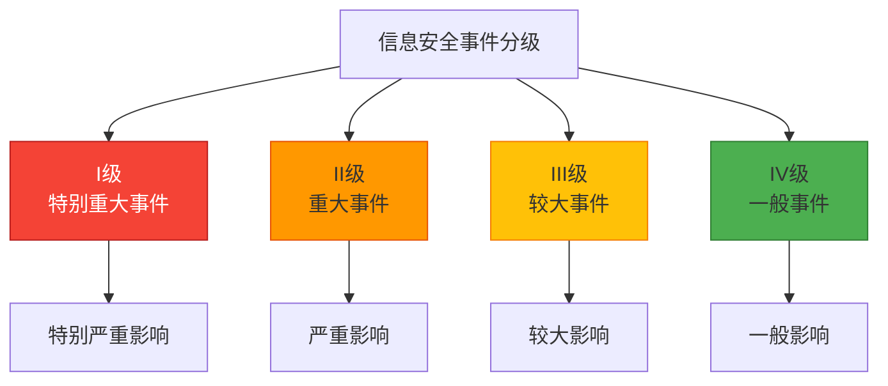
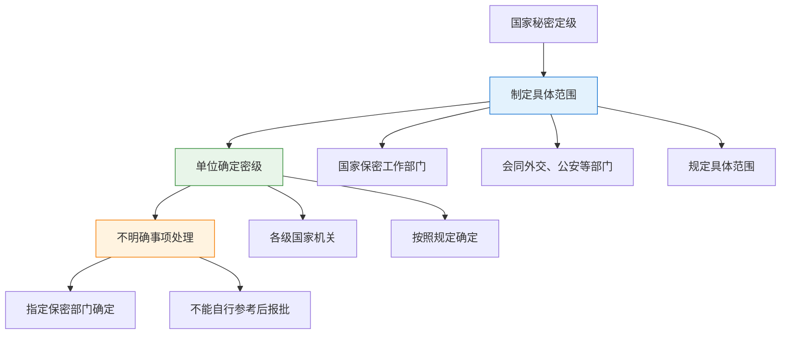
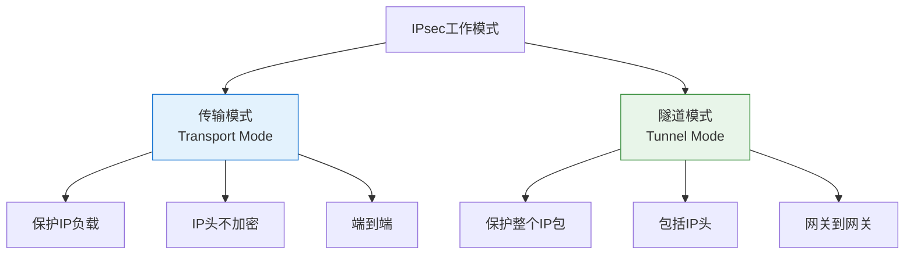
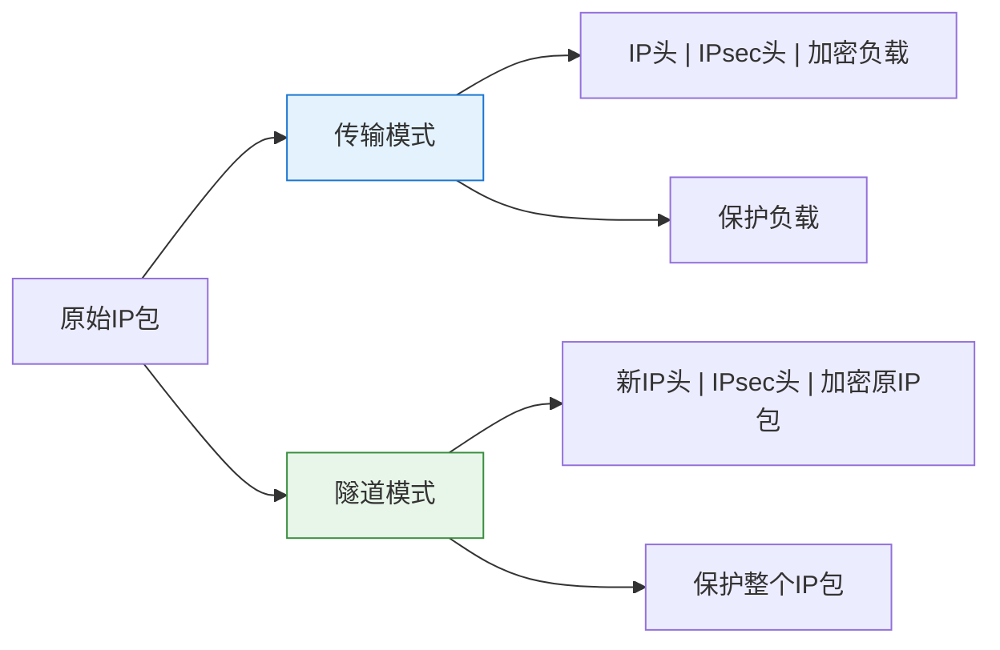
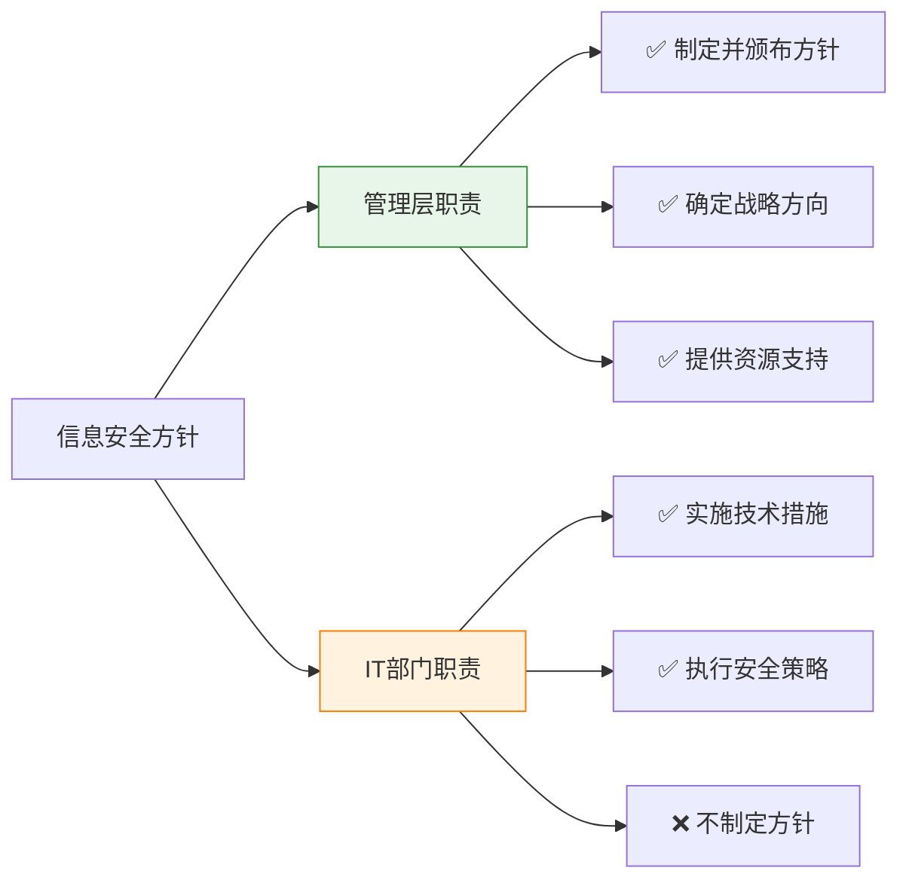
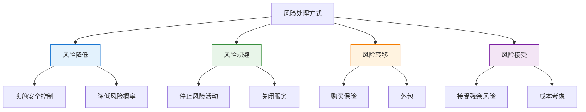

---
title: "CISP学习指南：信息安全事件与风险管理"
date: 2025-10-13
categories:
  - Cybersecurity
tags:
  - CISP
excerpt: "深入解析信息安全事件分级、国家秘密定级、IPsec协议、密钥管理和风险处理方式。"
lang: zh-CN
available_langs: []
permalink: /zh-CN/2025/10/CISP-Incident-and-Risk-Management/
thumbnail: /assets/cisp/thumbnail.png
thumbnail_80: /assets/cisp/thumbnail_80.png
series: cisp
canonical_lang: zh-CN
---

## 一、信息安全事件分级

### 1.1 GB/Z 20986-2007事件分级

GB/Z 20986-2007《信息安全事件分级分类指南》将信息安全事件分为四级：



### 1.2 事件分类

**信息安全事件主要分类：**

| 事件类型 | 说明 | 示例 |
|---------|------|------|
| 有害程序事件 | 病毒、木马、蠕虫等恶意程序 | 木马感染、病毒传播 |
| 网络攻击事件 | 拒绝服务、入侵等攻击行为 | DDoS攻击、网络入侵 |
| 信息破坏事件 | 信息被篡改、删除、泄露 | 数据删除、信息泄露 |
| 设备设施故障 | 硬件、软件、网络故障 | 服务器故障、网络中断 |
| 灾害性事件 | 自然灾害、事故灾难 | 火灾、地震 |
| 其他事件 | 其他影响信息安全的事件 | 人为破坏 |

### 1.3 事件定级判断

!!!anote "💡 事件定级方法"
    **事件类型判断原则：**
    - 根据事件的主要后果确定类型
    - 数据删除、篡改、泄露属于信息破坏事件
    - 即使涉及木马病毒，若主要后果是数据破坏，仍定性为信息破坏事件
    
    **事件等级判断要素：**
    - 影响范围：受影响的系统、用户和业务范围
    - 影响时间：系统中断时长和数据丢失时间跨度
    - 影响程度：对组织运营和业务的实际影响
    - 社会影响：对公共利益、社会秩序的影响

**事件定级考虑因素：**

```
事件定级因素：
├── 影响范围
│   ├── 影响的系统数量
│   ├── 影响的用户数量
│   └── 影响的业务范围
├── 影响程度
│   ├── 数据丢失量
│   ├── 系统中断时间
│   └── 经济损失
└── 社会影响
    ├── 公共利益影响
    ├── 社会秩序影响
    └── 国家安全影响
```

**四级事件对比：**

| 等级 | 名称 | 影响程度 | 示例 |
|------|------|---------|------|
| I级 | 特别重大事件 | 特别严重影响国家安全、社会秩序 | 国家关键基础设施瘫痪 |
| II级 | 重大事件 | 严重影响社会秩序和公共利益 | 重要信息系统大规模瘫痪 |
| III级 | 较大事件 | 较大影响社会秩序和公共利益 | 重要系统部分功能受损 |
| IV级 | 一般事件 | 一般影响，损害组织利益 | 企业内部系统短期中断 |

## 二、国家秘密定级与范围

### 2.1 国家秘密定级权限

根据《保守国家秘密法》规定，国家秘密的定级有严格的权限要求。

!!!anote "💡 国家秘密定级流程"
    **定级流程：**
    1. 国家保密工作部门会同相关部门规定具体范围
    2. 各级国家机关、单位按照规定确定密级
    3. 不明确事项由指定的保密工作部门确定
    4. 不能由单位自行参考后报批



### 2.2 国家秘密定级流程

**国家秘密定级流程要点：**

| 步骤 | 正确做法 | 说明 |
|------|---------|------|
| 制定范围 | 国家保密工作部门会同相关部门规定 | 顶层设计 |
| 确定密级 | 各级国家机关按照规定确定 | 按规定执行 |
| 不明确事项 | 由指定保密部门确定 | 专业判断 |

!!!warning "⚠️ 关键要点"
    **不明确事项的处理规范：**
    - 必须由指定的保密工作部门直接确定
    - 单位不得自行定级后再报批
    - 这是法律规定的强制性要求

### 2.3 指定的保密工作部门

**有权确定不明确事项的部门：**

```
指定保密工作部门：
├── 国家保密工作部门
├── 省、自治区、直辖市的保密工作部门
├── 省、自治区政府所在地的市的保密工作部门
├── 经国务院批准的较大的市的保密工作部门
└── 国家保密工作部门审定的机关
```

## 三、IPsec协议安全

### 3.1 IPsec模式

IPsec（Internet Protocol Security）提供两种工作模式：传输模式和隧道模式。



### 3.2 IPsec协议组成

**IPsec主要协议：**

| 协议 | 全称 | 功能 | 支持模式 |
|------|------|------|----------|
| AH | Authentication Header | 认证、完整性 | 传输模式、隧道模式 |
| ESP | Encapsulating Security Payload | 认证、完整性、加密 | 传输模式、隧道模式 |

!!!anote "💡 IPsec安全服务"
    **IPsec提供的全面安全保护：**
    - ✅ 可认证性：验证数据来源
    - ✅ 保密性：加密数据内容
    - ✅ 完整性：防止数据篡改
    - ✅ 防重放：防止重放攻击
    
    **IPsec是一个全面的网络层安全协议，提供端到端或网关到网关的安全通信保护。**

### 3.3 IPsec工作模式对比

**传输模式 vs 隧道模式：**



## 四、ISMS管理层职责

### 4.1 信息安全方针的制定与颁布

在组织中，信息安全方针的制定和颁布有明确的职责划分。

!!!anote "💡 方针制定职责"
    **管理层职责：**
    - 制定并颁布信息安全方针
    - 为组织的ISMS建设指明战略方向
    - 提供总体纲领，明确总体要求
    
    **职责划分：**
    - 管理层：制定方针、确定战略、提供资源
    - IT部门：实施技术措施、执行安全策略



### 4.2 管理层的ISMS职责

**管理层在ISMS中的关键职责：**

| 职责 | 说明 | 重要性 |
|------|------|----------|
| 制定方针 | 制定并颁布信息安全方针 | 战略层面 |
| 确保目标 | 确保ISMS目标和计划得以制定 | 明确、可度量 |
| 传达要求 | 将安全目标、方针传达全组织 | 全员覆盖 |
| 风险管理 | 了解风险，决定可接受级别 | 风险决策 |

## 五、保密法三同步原则

### 5.1 涉密信息系统三同步

《保密法》第二十条规定了涉密信息系统的三同步原则。

!!!anote "💡 三同步原则"
    **涉密信息系统保密设施、设备应当：**
    - 与涉密信息系统同步规划
    - 与涉密信息系统同步建设
    - 与涉密信息系统同步运行

**涉密信息系统管理要点：**

| 要点 | 内容 | 说明 |
|------|------|------|
| 分级保护 | 按照涉密程度实行分级保护 | 根据秘密等级 |
| 保密设施 | 按照国家保密标准配备 | 必须符合标准 |
| 三同步 | 规划、建设、运行同步 | 不能事后补救 |
| 检查合格 | 经检查合格后方可投入使用 | 强制要求 |

## 六、密钥管理

### 6.1 密钥管理原则

密钥管理是密码系统安全的核心，需要遵循科克霍夫原则。

!!!warning "⚠️ 会话密钥管理原则"
    **会话密钥使用规范：**
    - 每次会话使用新的会话密钥
    - 会话密钥用完即销毁
    - 严禁重复使用会话密钥
    
    **密钥重用的安全风险：**
    - 严重降低通信安全性
    - 为密码分析提供更多样本
    - 增加系统被破解的风险

### 6.2 密钥生命周期管理

**密钥管理需要考虑的环节：**

```
密钥生命周期：
├── 密钥产生
│   ├── 随机数生成
│   └── 密钥生成算法
├── 密钥存储
│   ├── 安全存储介质
│   └── 加密保护
├── 密钥备份
│   ├── 备份策略
│   └── 恢复机制
├── 密钥分配
│   ├── 安全传输
│   └── 密钥协商（如Diffie-Hellman）
├── 密钥更新
│   ├── 定期更换
│   └── 按需更新
└── 密钥撤销
    ├── 撤销机制
    └── 密钥销毁
```

## 七、风险处理方式

### 7.1 四种风险处理方式

风险处理有四种基本方式，需要根据具体情况选择。



### 7.2 风险处理方式的选择

!!!anote "💡 风险规避与风险降低的区别"
    **风险规避：**
    - 定义：停止或避免风险活动
    - 示例：关闭存在漏洞的FTP服务
    - 特点：彻底消除风险源
    
    **风险降低：**
    - 定义：实施控制措施降低风险
    - 示例：为FTP服务打补丁、加固配置
    - 特点：保留服务但降低风险水平

**风险处理方式对比：**

| 方式 | 定义 | 示例 | 适用场景 |
|------|------|------|----------|
| 风险降低 | 实施控制措施降低风险 | 打补丁、加固配置 | 需要保留服务 |
| 风险规避 | 停止或避免风险活动 | 关闭服务、停止业务 | 风险过高且可停止 |
| 风险转移 | 将风险转移给第三方 | 购买保险、外包 | 有转移渠道 |
| 风险接受 | 接受残余风险 | 成本过高时接受 | 风险可接受 |

## 八、总结

!!!success "🎯 关键要点"
    **信息安全事件：**
    - 事件分四级：I级（特别重大）、II级（重大）、III级（较大）、IV级（一般）
    - 事件分类看主要后果：数据删除属于信息破坏事件
    - 定级综合考虑影响范围、程度和社会影响
    
    **国家秘密定级：**
    - 国家秘密定级由指定部门确定，不能自行参考后报批
    - 定级流程：制定范围→单位确定→不明确事项由指定部门确定
    - 指定保密工作部门有明确的层级和权限
    
    **IPsec协议安全：**
    - 传输模式保护IP负载，隧道模式保护整个IP包
    - AH和ESP都能以传输模式工作
    - IPsec提供认证、保密、完整性和防重放保护
    
    **ISMS管理层职责：**
    - 信息安全方针由管理层制定并颁布，不是IT部门
    - 管理层确保ISMS目标和计划得以制定
    - 管理层全面了解风险，决定可接受级别
    
    **保密法三同步：**
    - 涉密信息系统实行三同步：同步规划、同步建设、同步运行
    - 涉密系统按涉密程度实行分级保护
    - 经检查合格后方可投入使用
    
    **密钥管理：**
    - 安全性基于密钥，不是算法（科克霍夫原则）
    - 不能重用会话密钥，会影响通信安全
    - 密钥管理涉及产生、存储、备份、分配、更新、撤销
    
    **风险处理方式：**
    - 四种方式：降低、规避、转移、接受
    - 关闭服务属于风险规避，不是风险降低
    - 风险降低是实施控制措施

!!!tip "💡 实践建议"
    - 建立完善的事件分级响应机制
    - 严格遵守国家秘密定级流程
    - 正确配置IPsec保护网络通信
    - 实施科学的密钥管理策略
    - 根据实际情况选择合适的风险处理方式
