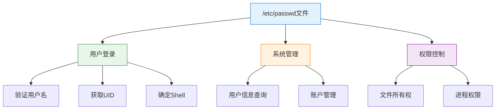
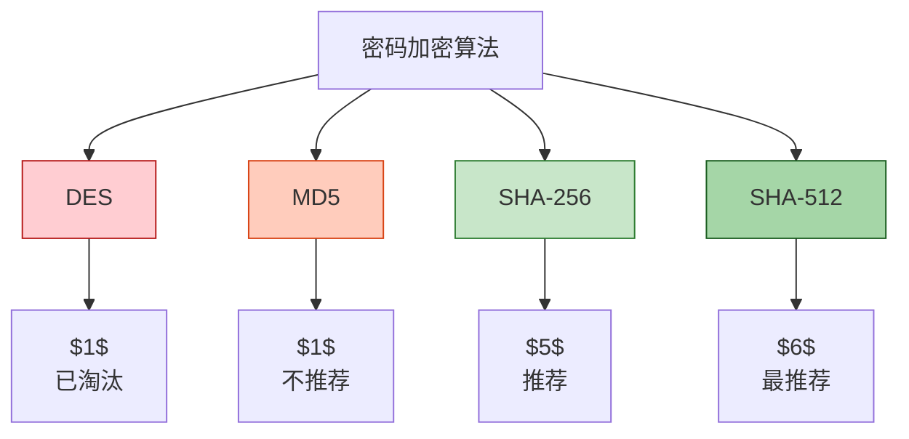
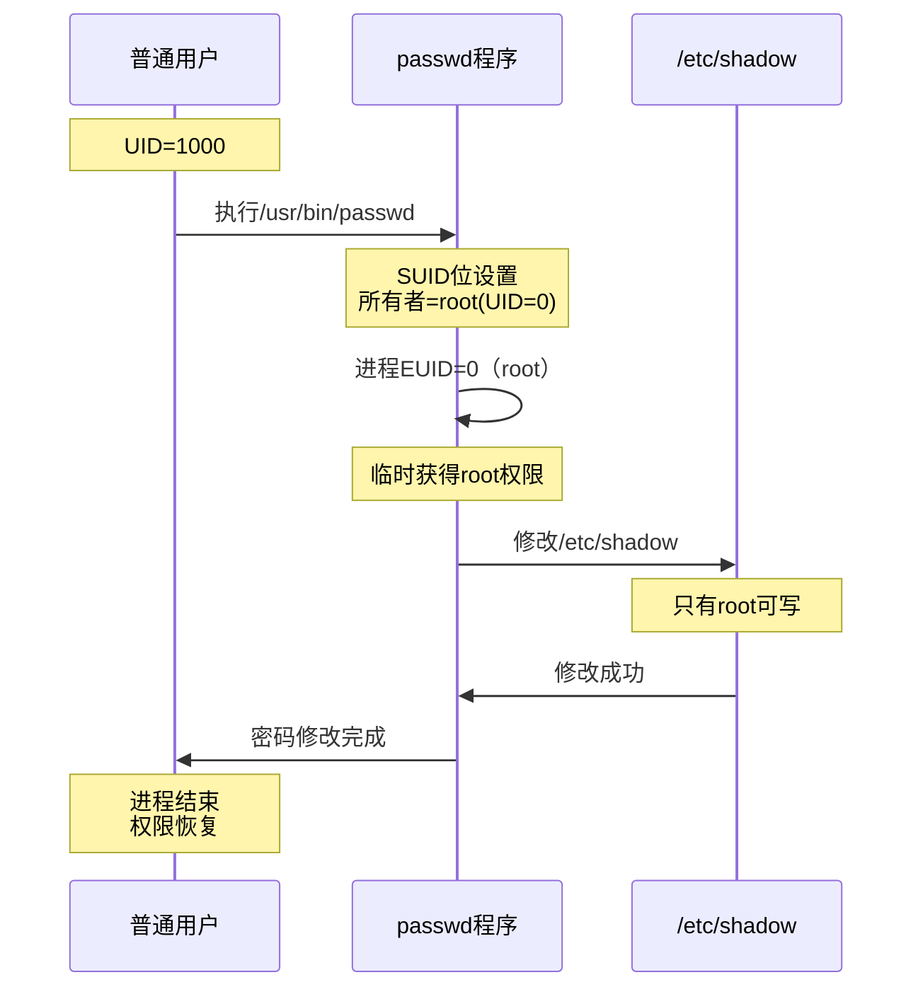
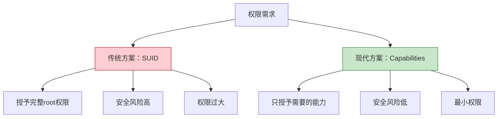
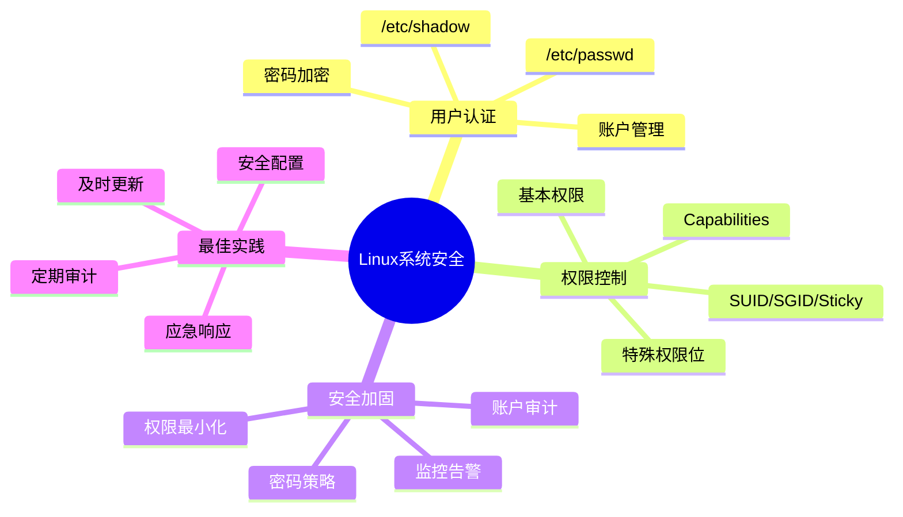

---
title: "CISP学习指南：Linux系统安全"
date: 2025-10-16
categories:
  - Cybersecurity
tags:
  - CISP
excerpt: "深入解析CISP认证中的Linux系统安全知识点，涵盖用户认证、密码管理和系统安全配置。"
lang: zh-CN
available_langs: []
permalink: /zh-CN/2025/10/CISP-Linux-System-Security/
thumbnail: /assets/cisp/thumbnail.png
thumbnail_80: /assets/cisp/thumbnail_80.png
series: cisp
canonical_lang: zh-CN
---

Linux系统安全是信息安全的重要组成部分，理解Linux的安全机制对于保护系统和数据至关重要。

## 一、Linux用户认证机制

### 1.1 /etc/passwd文件

/etc/passwd文件是Unix/Linux系统中最重要的安全文件之一，用于存储用户账户信息。

**passwd文件的作用：**



### 1.2 passwd文件格式

**passwd文件的字段结构：**

```
username:password:UID:GID:comment:home:shell
```

**各字段说明：**

| 字段 | 说明 | 示例 |
|------|------|------|
| username | 登录名 | root, user1 |
| password | 加密口令或占位符 | x, *, ! |
| UID | 用户ID | 0（root）, 1000（普通用户） |
| GID | 默认组ID | 0, 1000 |
| comment | 用户信息（GECOS） | Root User, John Doe |
| home | 用户主目录 | /root, /home/user1 |
| shell | 登录Shell | /bin/bash, /bin/sh |

**passwd文件示例：**

```bash
root:x:0:0:root:/root:/bin/bash
daemon:x:1:1:daemon:/usr/sbin:/usr/sbin/nologin
user1:x:1000:1000:User One:/home/user1:/bin/bash
mysql:x:999:999:MySQL Server:/var/lib/mysql:/bin/false
```

### 1.3 密码字段的演变

**传统passwd文件（不安全）：**

```
root:$1$abc123...:0:0:root:/root:/bin/bash
```

- 密码直接存储在passwd文件中
- passwd文件所有用户可读
- 容易被暴力破解

**现代passwd文件（安全）：**

```
root:x:0:0:root:/root:/bin/bash
```

- 密码字段显示为"x"
- 实际密码存储在/etc/shadow文件中
- shadow文件只有root可读

## 二、/etc/shadow文件

### 2.1 shadow文件的作用

!!!anote "💡 为什么passwd文件中密码显示为'x'"
    passwd文件中密码字段显示为"x"的原因是：**加密口令被转移到了另一个文件里**。
    
    **原因分析：**
    
    🔐 **安全性考虑**
    - /etc/passwd文件所有用户可读（需要查询用户信息）
    - 如果密码存储在passwd中，容易被窃取
    - 政击者可以离线暴力破解密码
    
    🛡️ **shadow文件机制**
    - 密码被转移到/etc/shadow文件
    - shadow文件只有root用户可读
    - 普通用户无法访问加密密码
    - 大大提高了安全性
    
    ✅ **"x"的含义**
    - "x"表示密码存储在shadow文件中
    - 不是密码的加密结果
    - 只是一个占位符
    - 告诉系统去shadow文件查找密码

**常见误解：**

| 误解 | 为什么错误 |
|------|----------|
| passwd文件是假的 | passwd文件是真实的，只是密码被转移了 |
| "x"是加密结果 | "x"不是加密结果，是占位符 |
| 账户被禁用 | "x"不表示禁用，禁用通常用"!"或"*" |

### 2.2 shadow文件格式

**shadow文件的字段结构：**

```
username:encrypted_password:lastchg:min:max:warn:inactive:expire:reserved
```

**各字段说明：**

| 字段 | 说明 | 示例 |
|------|------|------|
| username | 用户名 | root |
| encrypted_password | 加密密码 | $6$salt$hash... |
| lastchg | 最后修改日期 | 19000（距1970-01-01的天数） |
| min | 最小修改间隔 | 0（天） |
| max | 最大有效期 | 99999（天） |
| warn | 警告期 | 7（天） |
| inactive | 非活动期 | 30（天） |
| expire | 账户过期日期 | 空或日期 |
| reserved | 保留字段 | 空 |

**shadow文件示例：**

```bash
root:$6$rounds=5000$salt$hash...:19000:0:99999:7:::
user1:$6$rounds=5000$salt$hash...:19000:0:90:7:30::
user2:!:19000:0:99999:7:::
user3:*:19000:0:99999:7:::
```

### 2.3 密码字段的特殊值

**密码字段的不同状态：**

| 值 | 含义 | 说明 |
|----|------|------|
| $6$... | 正常加密密码 | 用户可以正常登录 |
| ! | 账户锁定 | 密码前加"!"，账户被锁定 |
| * | 账户禁用 | 不能通过密码登录 |
| !! | 密码未设置 | 新创建的账户，未设置密码 |
| 空 | 无密码 | 不安全，不推荐 |

**账户状态示例：**

```bash
# 正常账户
user1:$6$salt$hash...:19000:0:99999:7:::

# 锁定账户（密码前加!）
user2:!$6$salt$hash...:19000:0:99999:7:::

# 禁用账户
user3:*:19000:0:99999:7:::

# 未设置密码
user4:!!:19000:0:99999:7:::
```

## 三、密码加密机制

### 3.1 密码加密算法

**Linux支持的密码加密算法：**



**密码格式说明：**

```
$id$salt$encrypted

$id$: 算法标识
  $1$ = MD5
  $2a$ = Blowfish
  $5$ = SHA-256
  $6$ = SHA-512

$salt$: 盐值（随机字符串）
$encrypted: 加密后的密码哈希
```

**密码示例：**

```bash
# SHA-512加密（推荐）
$6$rounds=5000$saltstring$hash...

# SHA-256加密
$5$rounds=5000$saltstring$hash...

# MD5加密（不推荐）
$1$saltstring$hash...
```

### 3.2 密码安全机制

**密码安全的关键要素：**

!!!anote "💡 密码安全机制"
    **🧂 盐值（Salt）**
    - 每个密码使用不同的随机盐值
    - 防止彩虹表攻击
    - 相同密码产生不同哈希
    
    🔄 **迭代次数（Rounds）**
    - 多次哈希运算
    - 增加破解难度
    - 默认5000次
    - 可以配置更高
    
    🔐 **单向加密**
    - 不可逆的哈希算法
    - 无法从哈希还原密码
    - 只能通过比对验证
    
    ⏱️ **密码策略**
    - 最小长度要求
    - 复杂度要求
    - 定期更换
    - 历史密码检查

**密码验证流程：**

```mermaid
sequenceDiagram
    participant U as 用户
    participant S as 系统
    participant P as /etc/passwd
    participant SH as /etc/shadow
    
    U->>S: 输入用户名和密码
    S->>P: 查询用户名
    P->>S: 返回UID和"x"
    S->>SH: 读取shadow文件
    SH->>S: 返回加密密码和盐值
    S->>S: 使用相同盐值加密输入密码
    S->>S: 比对哈希值
    alt 哈希匹配
        S->>U: 登录成功
    else 哈希不匹配
        S->>U: 登录失败
    end
    
    style S fill:#e3f2fd,stroke:#1976d2
    style SH fill:#ffebee,stroke:#c62828
```

## 四、用户账户管理

### 4.1 账户类型

**Linux系统中的账户类型：**

| 账户类型 | UID范围 | 用途 | 示例 |
|---------|---------|------|------|
| root账户 | 0 | 超级用户 | root |
| 系统账户 | 1-999 | 系统服务 | daemon, bin, sys |
| 普通用户 | 1000+ | 普通用户 | user1, user2 |
| 服务账户 | 自定义 | 应用服务 | mysql, apache, nginx |

### 4.2 账户管理命令

**常用账户管理命令：**

```bash
# 创建用户
useradd username
useradd -m -s /bin/bash username

# 设置密码
passwd username

# 修改用户
usermod -l newname oldname
usermod -L username  # 锁定账户
usermod -U username  # 解锁账户

# 删除用户
userdel username
userdel -r username  # 同时删除主目录

# 查看用户信息
id username
finger username
getent passwd username
```

### 4.3 密码策略配置

**密码策略配置文件：**

```bash
# /etc/login.defs
PASS_MAX_DAYS   90      # 密码最大有效期
PASS_MIN_DAYS   0       # 密码最小修改间隔
PASS_MIN_LEN    8       # 密码最小长度
PASS_WARN_AGE   7       # 密码过期警告期

# /etc/security/pwquality.conf
minlen = 12             # 最小长度
dcredit = -1            # 至少1个数字
ucredit = -1            # 至少1个大写字母
lcredit = -1            # 至少1个小写字母
ocredit = -1            # 至少1个特殊字符
```

## 五、系统安全最佳实践

### 5.1 passwd和shadow文件保护

**文件权限设置：**

```bash
# 检查文件权限
ls -l /etc/passwd /etc/shadow

# 正确的权限设置
-rw-r--r-- 1 root root /etc/passwd   # 644
-rw------- 1 root root /etc/shadow   # 600

# 修复权限（如果需要）
chmod 644 /etc/passwd
chmod 600 /etc/shadow
chown root:root /etc/passwd /etc/shadow
```

**文件完整性检查：**

```bash
# 使用pwck检查passwd文件
pwck

# 使用grpck检查group文件
grpck

# 备份重要文件
cp /etc/passwd /etc/passwd.bak
cp /etc/shadow /etc/shadow.bak
```

### 5.2 账户安全加固

**安全加固措施：**

```
账户安全加固清单：
├── 密码策略
│   ├── 强制复杂密码
│   ├── 定期更换密码
│   ├── 密码历史检查
│   └── 账户锁定策略
├── 账户管理
│   ├── 禁用不必要的账户
│   ├── 删除默认账户
│   ├── 限制root登录
│   └── 使用sudo代替root
├── 登录控制
│   ├── 限制登录时间
│   ├── 限制登录地点
│   ├── 登录失败锁定
│   └── 会话超时
└── 审计监控
    ├── 登录日志监控
    ├── 密码修改记录
    ├── 账户变更审计
    └── 异常行为检测
```

### 5.3 常见安全问题

**需要注意的安全问题：**

| 问题 | 风险 | 解决方案 |
|------|------|---------|
| 弱密码 | 容易被破解 | 强制密码策略 |
| 共享账户 | 无法追溯 | 每人独立账户 |
| 默认密码 | 已知密码 | 首次登录强制修改 |
| 无密码账户 | 直接登录 | 设置强密码或禁用 |
| 过期账户 | 安全隐患 | 定期清理 |
| root直接登录 | 风险高 | 使用sudo |

## 六、Linux特殊权限位

### 6.1 SUID权限位

!!!anote "🔐 SUID权限位详解"
    **SUID（Set User ID）**是Linux系统中的一种特殊权限位，当设置在可执行文件上时，允许用户以文件所有者的权限执行该文件。
    
    **核心概念：**
    - SUID位设置在文件所有者的执行权限位上
    - 用"s"表示，替代原来的"x"
    - 文件执行时，进程具有文件所有者的权限
    - 常用于需要提权的系统命令

**SUID权限位示例：**

```bash
# /usr/bin/passwd文件的权限
-rwsr-xr-x 1 root root 59640 Mar 22  2019 /usr/bin/passwd
```

**权限位解析：**

```
-rwsr-xr-x
│││││││││└─ 其他用户可执行
││││││││└── 其他用户可读
│││││││└─── 其他用户无写权限
││││││└──── 所属组可执行
│││││└───── 所属组可读
││││└────── 所属组无写权限
│││└─────── 所有者可执行（s表示SUID）
││└──────── 所有者可读
│└───────── 所有者可写
└────────── 普通文件
```

### 6.2 SUID权限位的含义

!!!anote "💡 Linux文件权限中的's'位"
    Linux系统文件的访问权限属性通过9个字符来表示，分别表示文件属主、文件所属组用户的读（r）、写（w）及执行（x）的权限。
    
    **以/usr/bin/passwd文件为例：**
    
    ```
    -rwsr-xr-x 1 root root 59640 Mar 22  2019 /usr/bin/passwd
    ```
    
    **关键理解：**
    
    ✅ **s表示SUID位**
    - s在user的x位，表示SUID
    - 文件在执行阶段具有文件所有者的权限
    - 执行时具有文件所有者（root）的权限
    
    **常见误解：**
    
    ❌ **误解：文件权限出现了错误**
    - s是合法的权限位，不是错误
    
    ❌ **误解：s表示sticky位**
    - sticky位用"t"表示，不是"s"
    - sticky位设置在目录的其他用户执行位上
    
    ❌ **误解：s表示SGID位**
    - SGID位设置在所属组的执行位上
    - 本例中s在所有者的执行位上

**SUID的工作原理：**



### 6.3 为什么passwd命令需要SUID

**passwd命令的特殊需求：**

!!!example "📝 passwd命令案例"
    **场景：**
    普通用户需要修改自己的密码
    
    **问题：**
    - 密码存储在/etc/shadow文件中
    - /etc/shadow文件只有root可以写入
    - 普通用户无法直接修改shadow文件
    
    **解决方案：**
    - passwd命令设置SUID位
    - 执行时临时获得root权限
    - 可以修改shadow文件
    - 执行完成后权限恢复
    
    **权限对比：**
    
    | 文件 | 权限 | 说明 |
    |------|------|------|
    | /etc/shadow | -rw------- | 只有root可写 |
    | /usr/bin/passwd | -rwsr-xr-x | 设置SUID位 |
    | 执行时进程 | EUID=0 | 临时root权限 |

### 6.4 SUID权限设置

**设置和取消SUID：**

```bash
# 设置SUID位
chmod u+s filename
chmod 4755 filename

# 取消SUID位
chmod u-s filename
chmod 0755 filename

# 查找系统中所有SUID文件
find / -perm -4000 -type f 2>/dev/null

# 查找SUID和SGID文件
find / -perm -6000 -type f 2>/dev/null
```

**SUID权限表示：**

| 数字表示 | 符号表示 | 说明 |
|---------|---------|------|
| 4755 | rwsr-xr-x | SUID + 755 |
| 4750 | rwsr-x--- | SUID + 750 |
| 4700 | rwsr----- | SUID + 700 |

### 6.5 SUID安全风险

!!!warning "⚠️ SUID安全风险"
    **潜在风险：**
    
    🔴 **权限提升攻击**
    - 恶意程序设置SUID位
    - 普通用户获得root权限
    - 系统被完全控制
    
    🔴 **漏洞利用**
    - SUID程序存在漏洞
    - 攻击者利用漏洞提权
    - 执行任意命令
    
    🔴 **误用风险**
    - 不必要的文件设置SUID
    - 扩大攻击面
    - 增加安全风险
    
    **安全建议：**
    - 定期审计SUID文件
    - 移除不必要的SUID位
    - 监控SUID文件变化
    - 使用capabilities替代SUID

**常见SUID程序：**

```bash
# 系统必需的SUID程序
/usr/bin/passwd          # 修改密码
/usr/bin/sudo            # 权限提升
/usr/bin/su              # 切换用户
/bin/ping                # 网络诊断
/usr/bin/mount           # 挂载文件系统
/usr/bin/umount          # 卸载文件系统
```

### 6.6 SGID和Sticky位

**其他特殊权限位：**

| 权限位 | 数字 | 符号 | 作用 |
|-------|------|------|------|
| SUID | 4000 | s（所有者x位） | 以文件所有者权限执行 |
| SGID | 2000 | s（所属组x位） | 以文件所属组权限执行 |
| Sticky | 1000 | t（其他用户x位） | 只有所有者可删除 |

**SGID示例：**

```bash
# 目录设置SGID
drwxrwsr-x 2 root staff 4096 Jan 1 12:00 /shared

# 在该目录创建的文件自动继承组
# 新文件所属组为staff，而不是创建者的默认组
```

**Sticky位示例：**

```bash
# /tmp目录的sticky位
drwxrwxrwt 10 root root 4096 Jan 1 12:00 /tmp

# 任何用户可以在/tmp创建文件
# 但只能删除自己的文件
# 不能删除其他用户的文件
```

## 七、Linux Capabilities机制

### 7.1 Capabilities概述

!!!anote "💡 什么是Linux Capabilities"
    **传统权限模型的问题：**
    - 只有root和非root两种权限
    - root拥有所有权限（全能）
    - 非root用户权限受限
    - 需要提权时只能使用SUID
    
    **Capabilities机制：**
    - 将root权限细分为多个独立能力
    - 可以单独授予特定能力
    - 不需要完整root权限
    - 更精细的权限控制
    - 减少SUID程序的使用
    
    **优势：**
    - 最小权限原则
    - 降低安全风险
    - 更灵活的权限管理
    - 更好的安全隔离

**Capabilities vs SUID：**



### 7.2 常用Capabilities列表

**重要的Capabilities：**

| Capability | 说明 | 用途示例 |
|-----------|------|----------|
| CAP_CHOWN | 修改文件所有者 | 文件管理工具 |
| CAP_DAC_OVERRIDE | 绕过文件权限检查 | 备份程序 |
| CAP_FOWNER | 绕过文件所有者检查 | 系统管理工具 |
| CAP_KILL | 发送信号给任意进程 | 进程管理器 |
| CAP_NET_ADMIN | 网络管理操作 | 网络配置工具 |
| CAP_NET_BIND_SERVICE | 绑定特权端口（<1024） | Web服务器 |
| CAP_NET_RAW | 使用RAW和PACKET套接字 | ping, tcpdump |
| CAP_SETUID | 设置进程UID | sudo, su |
| CAP_SETGID | 设置进程GID | sudo, su |
| CAP_SYS_ADMIN | 系统管理操作 | mount, swapon |
| CAP_SYS_TIME | 修改系统时间 | date, ntpd |

### 7.3 Capabilities管理

**查看和设置Capabilities：**

```bash
# 查看文件的capabilities
getcap /usr/bin/ping
# 输出：/usr/bin/ping = cap_net_raw+ep

# 设置capabilities
sudo setcap cap_net_raw+ep /usr/bin/ping

# 移除capabilities
sudo setcap -r /usr/bin/ping

# 查看进程的capabilities
getpcaps <PID>
cat /proc/<PID>/status | grep Cap

# 查找所有具有capabilities的文件
sudo find / -type f -exec getcap {} \; 2>/dev/null
```

**Capabilities标志：**

| 标志 | 说明 |
|------|------|
| e (Effective) | 当前生效的能力 |
| p (Permitted) | 允许的能力 |
| i (Inheritable) | 可继承的能力 |

### 7.4 Capabilities实战案例

**案例1：ping命令不使用SUID**

!!!example "📝 ping命令优化"
    **传统方案（SUID）：**
    ```bash
    # ping需要root权限发送ICMP包
    -rwsr-xr-x 1 root root /bin/ping
    # 问题：授予了完整root权限
    ```
    
    **现代方案（Capabilities）：**
    ```bash
    # 只授予网络原始套接字能力
    sudo setcap cap_net_raw+ep /usr/bin/ping
    
    # 移除SUID位
    sudo chmod u-s /usr/bin/ping
    
    # 验证
    getcap /usr/bin/ping
    # 输出：cap_net_raw+ep
    
    # 测试
    ping google.com
    # 正常工作，但没有root权限
    ```
    
    **优势：**
    - 只有发送ICMP包的能力
    - 没有其他root权限
    - 安全性大幅提升

**案例2：Web服务器绑定80端口**

```bash
# 传统方案：以root运行
sudo /usr/sbin/nginx
# 问题：整个进程以root运行

# 现代方案：使用capabilities
sudo setcap cap_net_bind_service+ep /usr/sbin/nginx

# 以普通用户运行
/usr/sbin/nginx
# 可以绑定80端口，但没有root权限
```

### 7.5 Capabilities安全最佳实践

**安全建议：**

```
Capabilities安全清单：
├── 最小权限原则
│   ├── 只授予必需的能力
│   ├── 避免授予CAP_SYS_ADMIN
│   ├── 定期审计capabilities
│   └── 移除不必要的能力
├── 替代SUID
│   ├── 优先使用capabilities
│   ├── 减少SUID程序数量
│   ├── 降低攻击面
│   └── 提高系统安全性
├── 监控和审计
│   ├── 记录capabilities变更
│   ├── 监控异常授权
│   ├── 定期扫描文件
│   └── 审计日志分析
└── 容器安全
    ├── 限制容器capabilities
    ├── 使用--cap-drop
    ├── 只添加必需能力
    └── 避免--privileged
```

**危险的Capabilities：**

!!!warning "⚠️ 高风险Capabilities"
    以下capabilities授予时需要特别谨慎：
    
    🔴 **CAP_SYS_ADMIN**
    - 几乎等同于root权限
    - 可以执行大量管理操作
    - 应该避免使用
    
    🔴 **CAP_DAC_OVERRIDE**
    - 绕过所有文件权限检查
    - 可以读写任意文件
    - 风险极高
    
    🔴 **CAP_SETUID / CAP_SETGID**
    - 可以切换到任意用户
    - 可能导致权限提升
    - 需要严格控制
    
    🔴 **CAP_SYS_MODULE**
    - 可以加载内核模块
    - 可以完全控制系统
    - 极度危险

## 八、总结

### 8.1 核心知识点回顾

**Linux系统安全关键要素：**



### 8.2 重要考点总结

**CISP考试重点：**

!!!tip "📚 考试重点"
    **1. passwd和shadow文件**
    - passwd文件格式和字段含义
    - 为什么密码字段显示为"x"
    - shadow文件的作用和权限
    - 密码加密算法识别
    
    **2. 特殊权限位**
    - SUID位的含义和作用
    - 如何识别SUID文件（s标志）
    - SUID的安全风险
    - SGID和Sticky位的区别
    
    **3. Capabilities机制**
    - Capabilities的优势
    - 常用capabilities的作用
    - 如何替代SUID
    - 安全最佳实践
    
    **4. 安全加固**
    - 密码策略配置
    - 账户安全检查
    - 权限审计方法
    - 日志监控要点

### 8.3 实战技能清单

**必须掌握的命令：**

```bash
# 用户管理
useradd, usermod, userdel, passwd
id, finger, getent

# 权限管理
chmod, chown, chgrp
ls -l, stat

# 特殊权限
find / -perm -4000  # 查找SUID
find / -perm -2000  # 查找SGID
find / -perm -1000  # 查找Sticky

# Capabilities
getcap, setcap, getpcaps

# 安全审计
pwck, grpck
last, lastlog
who, w
```

### 8.4 安全检查清单

**日常安全检查项目：**

| 检查项 | 命令 | 频率 |
|-------|------|------|
| 检查SUID文件 | find / -perm -4000 | 每周 |
| 审计用户账户 | cat /etc/passwd | 每周 |
| 检查密码策略 | cat /etc/login.defs | 每月 |
| 查看登录日志 | last, lastlog | 每天 |
| 检查文件权限 | ls -l /etc/passwd /etc/shadow | 每周 |
| 审计capabilities | find / -exec getcap {} \; | 每月 |

### 8.5 延伸学习资源

**推荐学习方向：**

```
深入学习路径：
├── Linux安全基础
│   ├── 用户和组管理
│   ├── 文件权限系统
│   ├── PAM认证机制
│   └── SELinux/AppArmor
├── 系统加固
│   ├── 安全基线配置
│   ├── 服务最小化
│   ├── 防火墙配置
│   └── 入侵检测
├── 审计和监控
│   ├── 日志管理
│   ├── 审计系统（auditd）
│   ├── 安全监控工具
│   └── 应急响应
└── 高级主题
    ├── 容器安全
    ├── 内核安全
    ├── 安全编程
    └── 渗透测试
```

## 九、参考资料

**官方文档：**
- Linux man pages: passwd(5), shadow(5), capabilities(7)
- Red Hat Enterprise Linux Security Guide
- Ubuntu Security Documentation

**安全标准：**
- CIS Linux Benchmark
- NIST Security Configuration Checklist
- PCI DSS Linux Security Requirements

**工具和资源：**
- Lynis - Linux安全审计工具
- AIDE - 文件完整性检查
- fail2ban - 登录保护
- auditd - Linux审计系统

---

### 6.4 三种特殊权限位对比

**Linux三种特殊权限位：**

| 权限位 | 符号 | 位置 | 数字表示 | 作用 | 示例 |
|--------|------|------|---------|------|------|
| SUID | s | 所有者执行位 | 4000 | 以所有者权限执行 | /usr/bin/passwd |
| SGID | s | 所属组执行位 | 2000 | 以所属组权限执行 | /usr/bin/wall |
| Sticky | t | 其他用户执行位 | 1000 | 只有所有者可删除 | /tmp |

**权限位示例：**

```bash
# SUID示例
-rwsr-xr-x 1 root root /usr/bin/passwd
      ↑ SUID位

# SGID示例
-rwxr-sr-x 1 root tty /usr/bin/wall
         ↑ SGID位

# Sticky示例
drwxrwxrwt 10 root root /tmp
         ↑ Sticky位
```

### 6.5 设置和管理SUID

**设置SUID权限：**

```bash
# 使用符号模式设置SUID
chmod u+s filename

# 使用数字模式设置SUID
chmod 4755 filename

# 移除SUID
chmod u-s filename

# 查找系统中所有SUID文件
find / -perm -4000 -type f 2>/dev/null

# 查找SUID和SGID文件
find / -perm /6000 -type f 2>/dev/null
```

**SUID权限的安全风险：**

!!!warning "⚠️ SUID安全风险"
    **潜在风险：**
    
    🔓 **权限提升**
    - SUID程序如果有漏洞，可能被利用提权
    - 攻击者可以获得root权限
    
    🐛 **程序漏洞**
    - 缓冲区溢出
    - 命令注入
    - 路径遍历
    
    🔍 **安全审计**
    - 定期检查SUID文件
    - 移除不必要的SUID权限
    - 监控SUID文件变化
    
    **最佳实践：**
    - 最小化SUID文件数量
    - 定期审计SUID程序
    - 使用sudo代替SUID
    - 监控SUID文件的创建和修改

**常见的SUID程序：**

```bash
# 系统中常见的SUID程序
/usr/bin/passwd      # 修改密码
/usr/bin/su          # 切换用户
/usr/bin/sudo        # 以其他用户身份执行命令
/usr/bin/mount       # 挂载文件系统
/usr/bin/umount      # 卸载文件系统
/usr/bin/ping        # 发送ICMP包（需要raw socket）
/usr/bin/chsh        # 修改登录Shell
/usr/bin/chfn        # 修改用户信息
```

## 七、总结

Linux系统安全的核心要点：

1. **/etc/passwd文件**：存储用户基本信息，所有用户可读
2. **/etc/shadow文件**：存储加密密码，只有root可读
3. **密码字段"x"**：表示密码存储在shadow文件中，不是加密结果
4. **密码加密**：使用盐值和多次哈希，推荐SHA-512
5. **账户管理**：合理分配UID，使用强密码策略
6. **安全加固**：正确设置文件权限，定期审计账户
7. **SUID权限位**：允许用户以文件所有者权限执行，需谨慎使用

!!!success "🎯 关键要点"
    - /etc/passwd文件用于用户登录时校验用户信息
    - 密码字段显示为"x"表示密码存储在/etc/shadow文件中
    - "x"不是密码的加密结果，只是占位符
    - shadow文件只有root可读，大大提高了安全性
    - 密码使用单向加密算法，无法还原
    - 应该使用强密码策略和定期更换密码
    - 定期检查和审计用户账户
    - SUID位设置在所有者执行位，用"s"表示
    - SUID文件执行时具有文件所有者的权限
    - passwd命令需要SUID才能修改shadow文件
    - 应最小化SUID文件数量，定期审计

!!!tip "💡 实践建议"
    - 定期审计passwd和shadow文件
    - 使用pwck和grpck检查文件完整性
    - 实施强密码策略
    - 禁用或删除不必要的账户
    - 使用sudo代替直接root登录
    - 监控登录日志和账户变更
    - 定期备份重要配置文件
