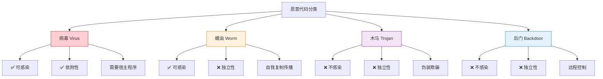
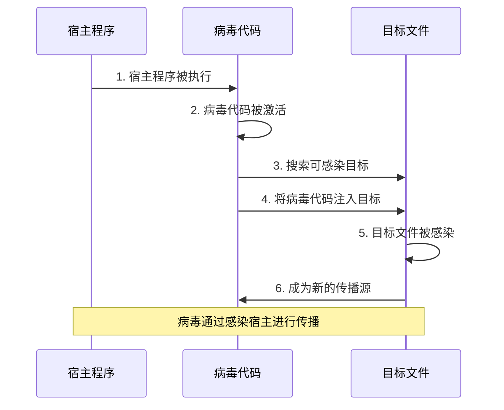
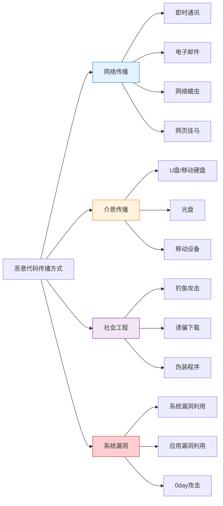
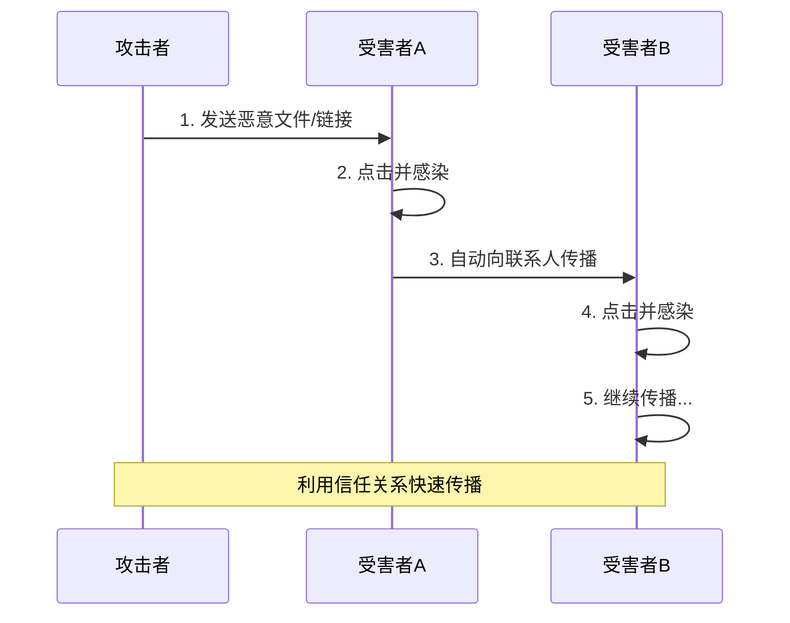
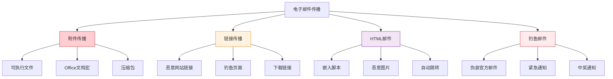
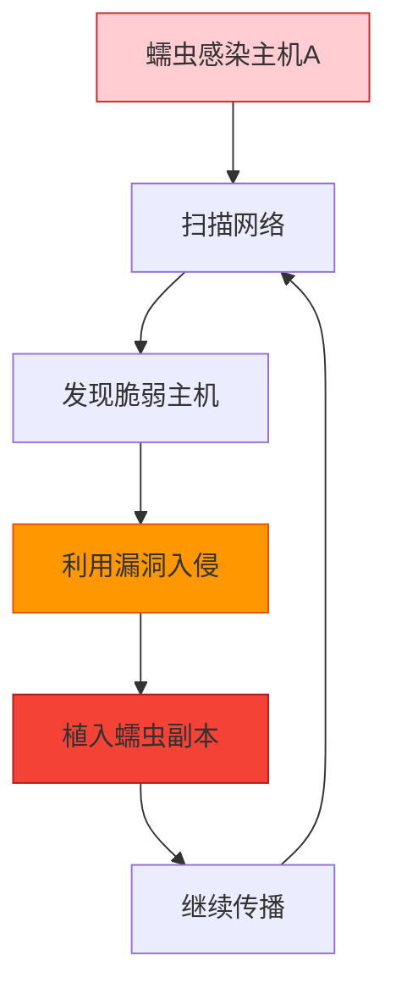
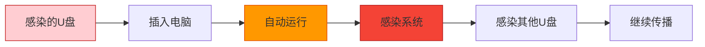
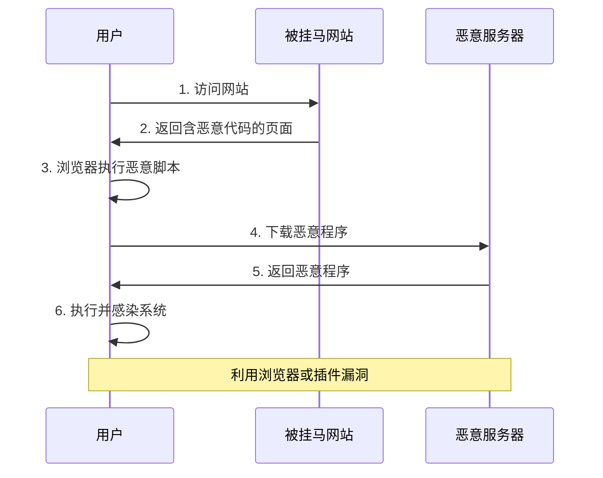
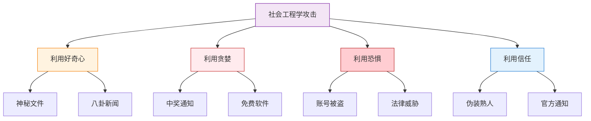

---
title: "CISP学习指南：恶意代码与病毒"
date: 2025-10-18
categories:
  - Cybersecurity
tags:
  - CISP
excerpt: "深入解析CISP认证中的恶意代码与病毒特性，包括病毒的感染性和依附性特征，以及各种传播方式和防护措施。"
lang: zh-CN
available_langs: []
permalink: /zh-CN/2025/10/CISP-Malware-Propagation-Methods/
thumbnail: /assets/cisp/thumbnail.png
thumbnail_80: /assets/cisp/thumbnail_80.png
series: cisp
canonical_lang: zh-CN
---

恶意代码与病毒是信息安全领域的核心威胁，理解病毒的本质特性和传播方式是制定有效防护策略的基础。

## 一、病毒的基本特性

### 1.1 病毒的核心特征

!!!anote "💡 病毒的两大核心特性"
    **病毒的定义特征：**
    
    **可感染性（Infectious）**
    - 病毒的首要特征
    - 能够将自身代码复制到其他程序或文件中
    - 通过感染宿主进行传播
    - 类似生物病毒的传染性
    
    **依附性（Parasitic）**
    - 病毒的本质特征
    - 必须依附于宿主程序或文件才能存在
    - 无法独立运行
    - 需要宿主程序被执行时才能激活
    
    **恶意代码特性对比：**
    - **病毒**：可感染 + 依附性（必须依附宿主）
    - **蠕虫**：可感染 + 独立性（不需要依附宿主）
    - **木马**：不感染 + 独立性（伪装成正常程序）

**病毒与其他恶意代码的对比：**



### 1.2 病毒的感染机制

**病毒感染过程：**



**病毒的依附方式：**

| 依附类型 | 说明 | 示例 |
|---------|------|------|
| 文件型病毒 | 感染可执行文件 | .exe, .com, .dll |
| 宏病毒 | 感染文档宏 | Word, Excel宏 |
| 引导型病毒 | 感染引导扇区 | MBR病毒 |
| 脚本病毒 | 感染脚本文件 | .vbs, .js |

### 1.3 病毒特性详解

**可感染性的表现：**

```
病毒的感染能力：
├── 自我复制
│   ├── 将自身代码复制到其他文件
│   ├── 保持病毒代码的完整性
│   └── 可能产生变种
├── 传播扩散
│   ├── 感染同一系统的其他文件
│   ├── 通过网络传播到其他系统
│   └── 通过移动介质传播
├── 感染目标
│   ├── 可执行文件
│   ├── 文档文件
│   ├── 系统文件
│   └── 引导扇区
└── 感染策略
    ├── 覆盖式感染
    ├── 附加式感染
    ├── 插入式感染
    └── 伴随式感染
```

**依附性的表现：**

```
病毒的依附特征：
├── 必须依附宿主
│   ├── 无法独立存在
│   ├── 需要宿主程序载体
│   └── 宿主被删除则病毒消失
├── 依赖宿主执行
│   ├── 宿主程序运行时激活
│   ├── 无法自行启动
│   └── 执行时机受宿主控制
├── 隐藏在宿主中
│   ├── 不易被发现
│   ├── 伪装成正常代码
│   └── 与宿主代码混合
└── 影响宿主行为
    ├── 修改宿主功能
    ├── 可能破坏宿主
    └── 利用宿主权限
```

!!!warning "⚠️ 病毒与蠕虫的关键区别"
    **病毒（Virus）：**
    - ✅ 可感染
    - ✅ 依附性
    - 需要宿主程序
    - 需要用户执行宿主才能传播
    
    **蠕虫（Worm）：**
    - ✅ 可感染
    - ❌ 独立性
    - 不需要宿主程序
    - 可以自动传播，无需用户交互
    
    **木马（Trojan）：**
    - ❌ 不感染
    - ❌ 独立性
    - 伪装成正常程序
    - 不会自我复制

## 二、恶意代码传播方式概述

### 2.1 传播方式分类

**主要传播途径：**



## 三、即时通讯传播

### 3.1 即时通讯传播特点

!!!anote "💡 即时通讯传播的三种主要方式"
    **1. 发送恶意文件**
    - 最常见的传播方式
    - 利用用户对好友的信任
    - 伪装成图片、文档、压缩包等
    - 诱导用户点击下载
    
    **2. 发送恶意链接**
    - 链接指向恶意网站或钓鱼页面
    - 利用短链接隐藏真实地址
    - 诱导用户点击访问
    - 可能触发自动下载
    
    **3. 利用软件漏洞自动传播**
    - 技术性传播方式
    - 无需用户交互
    - 利用即时通讯软件的安全漏洞
    - 自动感染联系人列表
    
    这三种方式可能单独使用，也可能组合使用，需要综合防护措施。

**即时通讯传播流程：**



### 3.2 即时通讯传播案例

**典型传播场景：**

| 传播方式 | 伪装形式 | 诱导话术 | 危害 |
|---------|---------|---------|------|
| 文件传播 | 照片.jpg.exe | "看看这张照片" | 木马植入 |
| 链接传播 | 短链接 | "这个视频太搞笑了" | 钓鱼网站 |
| 自动传播 | 无需伪装 | 无需话术 | 蠕虫扩散 |
| 二维码传播 | 二维码图片 | "扫码领红包" | 恶意应用 |

**常见即时通讯平台：**

```
即时通讯传播目标：
├── 个人通讯工具
│   ├── 微信/WeChat
│   ├── QQ
│   ├── WhatsApp
│   └── Telegram
├── 企业通讯工具
│   ├── 钉钉
│   ├── 企业微信
│   ├── Slack
│   └── Microsoft Teams
└── 传播特点
    ├── 用户基数大
    ├── 信任度高
    ├── 传播速度快
    └── 影响范围广
```

### 3.3 即时通讯传播防护

**防护措施：**

!!!tip "🛡️ 即时通讯安全防护"
    **用户层面：**
    
    ✅ **提高警惕**
    - 不随意点击陌生链接
    - 不下载可疑文件
    - 验证发送者身份
    - 注意异常行为
    
    ✅ **安全设置**
    - 关闭自动下载功能
    - 禁用不必要的权限
    - 启用安全验证
    - 定期更新软件
    
    **企业层面：**
    
    🏢 **技术防护**
    - 部署即时通讯网关
    - 文件类型过滤
    - 链接安全检测
    - 行为异常监控
    
    🏢 **管理措施**
    - 制定使用规范
    - 安全意识培训
    - 定期安全检查
    - 应急响应机制

## 四、电子邮件传播

### 4.1 电子邮件传播方式

**邮件传播的主要形式：**



**邮件传播特点：**

| 特点 | 说明 | 示例 |
|------|------|------|
| 伪装性强 | 模仿正规邮件 | 银行通知、快递单 |
| 针对性强 | 定向攻击 | 鱼叉式钓鱼 |
| 传播广泛 | 群发邮件 | 垃圾邮件 |
| 隐蔽性好 | 难以识别 | 社会工程学 |

### 4.2 电子邮件防护

**防护策略：**

```
邮件安全防护体系：
├── 网关层防护
│   ├── 反垃圾邮件网关
│   ├── 邮件过滤规则
│   ├── 附件类型限制
│   └── 病毒扫描
├── 服务器层防护
│   ├── SPF验证
│   ├── DKIM签名
│   ├── DMARC策略
│   └── 邮件加密
├── 客户端防护
│   ├── 禁用HTML邮件
│   ├── 禁用宏自动执行
│   ├── 防病毒软件
│   └── 安全插件
└── 用户层防护
    ├── 识别钓鱼邮件
    ├── 不点击可疑链接
    ├── 不下载可疑附件
    └── 验证发件人身份
```

## 五、网络蠕虫传播

### 5.1 蠕虫传播机制

**蠕虫的自我复制和传播：**



**蠕虫传播特点：**

!!!danger "🚨 网络蠕虫的危害"
    **传播特点：**
    
    ⚡ **自动传播**
    - 无需用户交互
    - 自动扫描目标
    - 自动利用漏洞
    - 自我复制传播
    
    🌐 **传播迅速**
    - 指数级增长
    - 短时间内大规模感染
    - 难以控制
    
    💥 **破坏性强**
    - 消耗网络带宽
    - 占用系统资源
    - 可能携带其他恶意代码
    - 造成大规模瘫痪

**著名蠕虫案例：**

| 蠕虫名称 | 时间 | 传播方式 | 影响 |
|---------|------|---------|------|
| 冲击波(Blaster) | 2003 | RPC漏洞 | 全球数百万台电脑 |
| 震荡波(Sasser) | 2004 | LSASS漏洞 | 导致系统重启 |
| 熊猫烧香 | 2006 | 多种方式 | 中国数百万台电脑 |
| WannaCry | 2017 | EternalBlue漏洞 | 全球30万台电脑 |

### 5.2 蠕虫防护措施

**综合防护策略：**

| 防护层面 | 措施 | 说明 |
|---------|------|------|
| 系统层 | 及时打补丁 | 修复已知漏洞 |
| 网络层 | 防火墙规则 | 限制不必要的端口 |
| 监控层 | 异常流量检测 | 发现扫描行为 |
| 隔离层 | 网络分段 | 限制传播范围 |

## 六、移动存储介质传播

### 6.1 U盘传播方式

**U盘传播机制：**



**常见U盘病毒：**

```
U盘病毒类型：
├── 自动运行病毒
│   ├── 利用autorun.inf
│   ├── 自动执行恶意程序
│   └── 感染所有驱动器
├── 快捷方式病毒
│   ├── 隐藏真实文件
│   ├── 创建恶意快捷方式
│   └── 诱导用户点击
├── 文件夹病毒
│   ├── 伪装成文件夹
│   ├── 隐藏真实文件夹
│   └── 双击即感染
└── 蠕虫病毒
    ├── 自我复制
    ├── 感染可执行文件
    └── 通过U盘传播
```

### 6.2 移动介质防护

**防护措施：**

!!!tip "🛡️ U盘安全使用"
    **技术防护：**
    
    ✅ **禁用自动运行**
    - 关闭autorun功能
    - 手动浏览U盘内容
    - 避免自动执行
    
    ✅ **使用防病毒软件**
    - 插入前先扫描
    - 实时监控
    - 定期更新病毒库
    
    ✅ **权限控制**
    - 限制U盘使用
    - 白名单管理
    - 审计日志记录
    
    **管理措施：**
    
    🏢 **企业管理**
    - 制定U盘使用规范
    - 发放专用U盘
    - 定期安全检查
    - 数据加密要求

## 七、网页挂马传播

### 7.1 网页挂马原理

**挂马攻击流程：**



**挂马方式：**

| 方式 | 说明 | 特点 |
|------|------|------|
| iframe挂马 | 嵌入隐藏框架 | 用户无感知 |
| JavaScript挂马 | 恶意脚本 | 自动执行 |
| Flash挂马 | 利用Flash漏洞 | 针对性强 |
| 0day挂马 | 利用未知漏洞 | 难以防御 |

### 7.2 网页挂马防护

**防护策略：**

```
网页挂马防护：
├── 浏览器安全
│   ├── 使用最新版本浏览器
│   ├── 及时更新插件
│   ├── 禁用不必要的插件
│   └── 启用安全警告
├── 系统防护
│   ├── 安装防病毒软件
│   ├── 启用防火墙
│   ├── 及时打补丁
│   └── 使用标准用户权限
├── 网络防护
│   ├── 部署Web过滤
│   ├── 使用安全DNS
│   ├── 启用HTTPS
│   └── 内容安全策略
└── 用户习惯
    ├── 不访问可疑网站
    ├── 注意浏览器警告
    ├── 定期清理缓存
    └── 使用安全搜索
```

## 八、社会工程学传播

### 8.1 社会工程学手法

**常见诱骗手法：**



### 8.2 社会工程学防护

**防护要点：**

!!!warning "⚠️ 识别社会工程学攻击"
    **警惕信号：**
    
    🚨 **过于诱人的承诺**
    - 免费获得高价值物品
    - 中奖、返利等
    - 天上不会掉馅饼
    
    🚨 **制造紧迫感**
    - 限时优惠
    - 账号即将被封
    - 立即行动
    
    🚨 **要求提供敏感信息**
    - 密码、验证码
    - 银行卡信息
    - 身份证号码
    
    🚨 **来源可疑**
    - 陌生人发送
    - 邮件地址异常
    - 链接地址可疑

## 九、综合防护策略

### 9.1 多层防护体系

**纵深防御架构：**

```
恶意代码防护体系：
├── 边界防护
│   ├── 防火墙
│   ├── IPS/IDS
│   ├── 邮件网关
│   └── Web过滤
├── 网络防护
│   ├── 网络分段
│   ├── 访问控制
│   ├── 流量监控
│   └── 异常检测
├── 终端防护
│   ├── 防病毒软件
│   ├── 主机防火墙
│   ├── 应用白名单
│   └── 补丁管理
├── 数据防护
│   ├── 数据加密
│   ├── 备份恢复
│   ├── 权限控制
│   └── DLP防护
└── 人员防护
    ├── 安全意识培训
    ├── 安全操作规范
    ├── 定期安全提醒
    └── 模拟演练
```

### 9.2 应急响应

**恶意代码感染应急处理：**

| 阶段 | 措施 | 说明 |
|------|------|------|
| 发现 | 识别感染迹象 | 异常行为、告警 |
| 隔离 | 断网隔离 | 防止扩散 |
| 分析 | 确定恶意代码类型 | 了解危害 |
| 清除 | 使用专杀工具 | 彻底清除 |
| 恢复 | 恢复系统和数据 | 验证安全性 |
| 总结 | 分析原因改进 | 防止再次发生 |

## 十、总结

恶意代码与病毒的核心要点：

1. **病毒特性**：可感染性和依附性是病毒的两大核心特征
2. **病毒与蠕虫的区别**：病毒依附宿主，蠕虫独立存在
3. **即时通讯传播**：利用信任关系，通过文件、链接、漏洞传播
4. **电子邮件传播**：附件、链接、钓鱼邮件是主要方式
5. **网络蠕虫传播**：自动扫描、利用漏洞、快速扩散
6. **移动介质传播**：U盘、移动硬盘等物理介质
7. **网页挂马传播**：利用浏览器和插件漏洞
8. **社会工程学传播**：利用人性弱点诱骗用户

!!!success "🎯 关键要点"
    **病毒特性：**
    - 病毒具有可感染性和依附性两大核心特征
    - 病毒必须依附于宿主程序才能存在和运行
    - 病毒通过感染其他文件进行传播
    - 区分病毒、蠕虫、木马的关键在于感染性和依附性
    
    **传播方式：**
    - 即时通讯传播包括文件、链接、漏洞利用三种方式
    - 电子邮件是最传统但仍然有效的传播途径
    - 网络蠕虫具有自动传播、速度快的特点
    - U盘等移动介质仍是重要传播途径
    - 社会工程学利用人性弱点，难以技术防范
    - 需要技术防护和安全意识培训相结合
    - 多层防护体系是有效防御的关键

!!!tip "💡 防护建议"
    **个人用户：**
    - 提高安全意识，不轻信陌生信息
    - 安装并更新防病毒软件
    - 及时安装系统和软件补丁
    - 谨慎使用U盘等移动介质
    - 不访问可疑网站，不点击可疑链接
    
    **企业用户：**
    - 建立多层防护体系
    - 部署专业安全设备
    - 制定安全管理制度
    - 定期开展安全培训
    - 建立应急响应机制

!!!tip "🔗 相关内容"
    **更多相关知识点：**
    - 电子邮件安全、DNS协议、安全设备 → [电子邮件安全与网络协议](/zh-CN/2025/10/CISP-Email-Security/)
