---
title: "CISP学习指南：网络攻击与安全运营"
date: 2025-10-20
categories:
  - Cybersecurity
tags:
  - CISP
excerpt: "深入解析CISP认证中的网络攻击类型、中间人攻击、信息收集工具、SDL开发、安全控制措施等核心知识点。"
lang: zh-CN
available_langs: []
permalink: /zh-CN/2025/10/CISP-Network-Attacks-Security-Operations/
thumbnail: /assets/cisp/thumbnail.png
thumbnail_80: /assets/cisp/thumbnail_80.png
series: cisp
canonical_lang: zh-CN
---

本指南涵盖CISP认证中的网络攻击类型、攻击防护、信息收集、安全开发生命周期、安全控制措施等关键领域的核心知识点。

## 一、拒绝服务攻击（DoS/DDoS）

### 1.1 拒绝服务攻击概述

!!!anote "🎯 什么是拒绝服务攻击"
    **拒绝服务攻击（Denial of Service, DoS）**是一种网络攻击方式，目的是使目标系统无法为合法用户提供正常服务。
    
    **核心目标：**
    - 消耗系统资源（CPU、内存、带宽）
    - 使服务不可用
    - 影响业务连续性
    
    **DDoS（分布式拒绝服务）：**
    - 使用多个攻击源
    - 攻击流量更大
    - 更难防御

### 1.2 DoS攻击分类

**按攻击方式分类：**

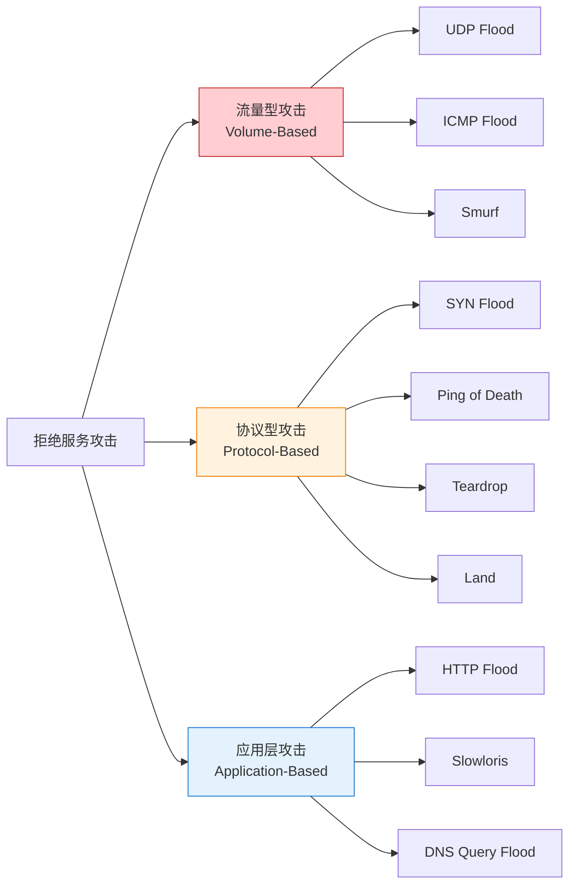

**三类攻击对比：**

| 攻击类型 | 原理 | 特点 | 防御难度 |
|---------|------|------|---------|
| 流量型 | 消耗带宽 | 流量巨大，易检测 | 中 |
| 协议型 | 利用协议缺陷 | 消耗系统资源 | 高 |
| 应用层 | 针对应用程序 | 流量小，难检测 | 最高 |


### 1.3 流量型DoS攻击

**流量型攻击的特点：**

!!!anote "💡 流量型攻击"
    流量型攻击通过发送大量数据包消耗目标的网络带宽，使合法用户无法访问服务。
    
    **常见流量型攻击：**
    
    🌊 **UDP Flood**
    - 发送大量UDP数据包
    - 消耗带宽和处理能力
    - 目标需要检查每个数据包
    
    📡 **ICMP Flood**
    - 发送大量ICMP回应请求
    - 也称为Ping Flood
    - 消耗带宽和系统资源
    
    🔊 **Smurf攻击**
    - 利用ICMP和IP广播
    - 放大攻击流量
    - 使用伪造的源IP地址

**UDP Flood攻击示意图：**

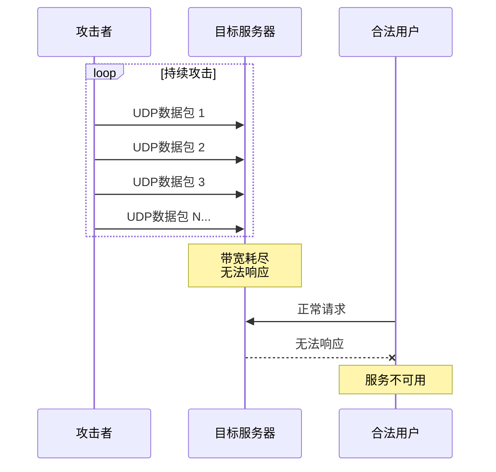

**流量型攻击对比：**

| 攻击类型 | 协议 | 流量特征 | 检测难度 | 防御方法 |
|---------|------|---------|---------|---------|
| UDP Flood | UDP | 大量UDP包 | 低 | 流量清洗、限速 |
| ICMP Flood | ICMP | 大量ICMP包 | 低 | 限制ICMP、流量清洗 |
| Smurf | ICMP+广播 | 放大流量 | 中 | 禁用IP广播 |

### 1.4 协议型DoS攻击

**协议型攻击利用网络协议的设计缺陷或实现漏洞：**

!!!warning "⚠️ 协议型攻击"
    协议型攻击不依赖大流量，而是利用协议特性消耗系统资源。
    
    **常见协议型攻击：**
    
    🔄 **Land攻击**
    - 发送源地址和目标地址相同的数据包
    - 导致系统进入死循环
    - 消耗CPU资源
    - **不是流量型攻击**
    
    💥 **Teardrop攻击**
    - 发送重叠的IP分片
    - 利用IP分片重组漏洞
    - 导致系统崩溃
    - **不是流量型攻击**
    
    ⚡ **Ping of Death**
    - 发送超大ICMP数据包
    - 超过IP协议最大长度
    - 导致缓冲区溢出

**Land攻击原理：**

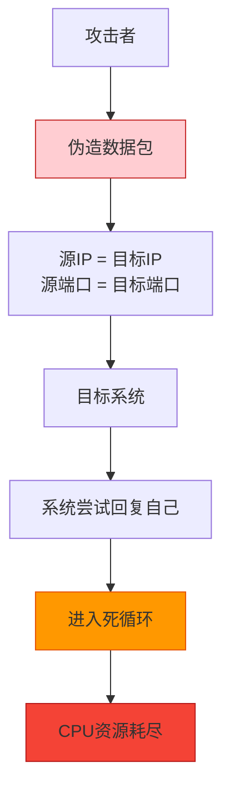

**Teardrop攻击原理：**

```
正常IP分片：
┌─────────┬─────────┬─────────┐
│ 分片1   │ 分片2   │ 分片3   │
│ 0-1000  │1000-2000│2000-3000│
└─────────┴─────────┴─────────┘

Teardrop攻击（重叠分片）：
┌─────────┬─────────┬─────────┐
│ 分片1   │ 分片2   │ 分片3   │
│ 0-1000  │ 500-1500│1000-2000│
└─────────┴─────────┴─────────┘
         ↑重叠区域↑
         
系统尝试重组时崩溃
```

!!!anote "💡 协议型vs流量型攻击"
    在拒绝服务攻击中，**Teardrop和Land都不是流量型攻击**，而是协议型攻击。Teardrop利用IP分片重组漏洞，发送重叠的IP分片导致系统崩溃，不依赖大流量。Land攻击则通过发送源地址和目标地址相同的数据包，使系统进入死循环。相比之下，UDP Flood和Smurf都是典型的流量型攻击，通过消耗带宽使服务不可用。

**协议型攻击对比：**

| 攻击类型 | 攻击原理 | 流量需求 | 影响 |
|---------|---------|---------|------|
| Land | 源地址=目标地址 | 低 | CPU耗尽 |
| Teardrop | IP分片重叠 | 低 | 系统崩溃 |
| SYN Flood | TCP三次握手 | 中 | 连接耗尽 |
| Ping of Death | 超大ICMP包 | 低 | 缓冲区溢出 |

### 1.5 DoS攻击防护

**防护策略：**

```
DoS攻击防护体系：
├── 网络层防护
│   ├── 流量清洗
│   ├── 黑洞路由
│   ├── 限速（Rate Limiting）
│   └── 流量分析
├── 协议层防护
│   ├── SYN Cookie
│   ├── 禁用IP directed-broadcast
│   ├── 过滤异常数据包
│   └── 连接限制
├── 应用层防护
│   ├── Web应用防火墙（WAF）
│   ├── 请求频率限制
│   ├── 验证码
│   └── 行为分析
└── 基础设施
    ├── CDN分发
    ├── 负载均衡
    ├── 冗余架构
    └── 弹性扩展
```

**Smurf攻击防护：**

!!!tip "💡 防护Smurf攻击"
    网络管理员使用**"no ip directed-broadcast"命令**可以有效防御Smurf攻击。该命令禁用IP定向广播，防止路由器将广播包转发到子网，从而阻止网络被用作放大攻击的中继。
    
    🎯 **Smurf攻击原理**
    1. 攻击者伪造受害者IP地址
    2. 向网络广播地址发送ICMP请求
    3. 网络中所有主机回复受害者
    4. 流量被放大，淹没受害者
    
    这是防御Smurf攻击的关键措施，因为它从源头切断了攻击的放大机制。

**Smurf攻击示意图：**

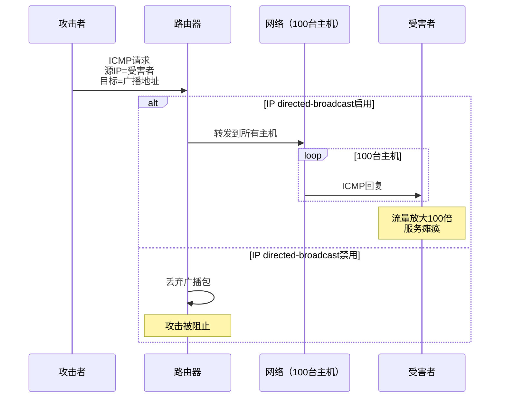

**防护配置示例：**

```cisco
! Cisco路由器配置
interface GigabitEthernet0/0
  no ip directed-broadcast  ! 禁用IP定向广播
  ip verify unicast source reachable-via rx  ! 启用反向路径转发
  
! 限制ICMP流量
access-list 100 permit icmp any any echo-reply
access-list 100 deny icmp any any echo
access-list 100 permit ip any any
interface GigabitEthernet0/0
  ip access-group 100 in
```

## 二、中间人攻击（MITM）

### 2.1 中间人攻击概述

!!!danger "🚨 中间人攻击"
    **中间人攻击（Man-in-the-Middle Attack, MITM）**是攻击者在通信双方之间秘密中继和可能篡改通信内容的攻击方式。
    
    **攻击特点：**
    - 攻击者位于通信路径中间
    - 可以窃听通信内容
    - 可以篡改通信数据
    - 通信双方不知道存在中间人

### 2.2 公钥替换攻击

!!!danger "🚨 公钥替换攻击"
    当攻击者截获通信双方交换的公钥，并将其替换为自己的公钥后发送给接收者，这种攻击方式属于**中间人攻击（MITM）**。攻击者通过这种方式可以解密、查看甚至篡改通信双方的所有消息，而通信双方却毫不知情。这与重放攻击（重复发送截获的数据）、Smurf攻击（DDoS攻击）和字典攻击（密码破解）有本质区别。

**公钥替换攻击流程：**

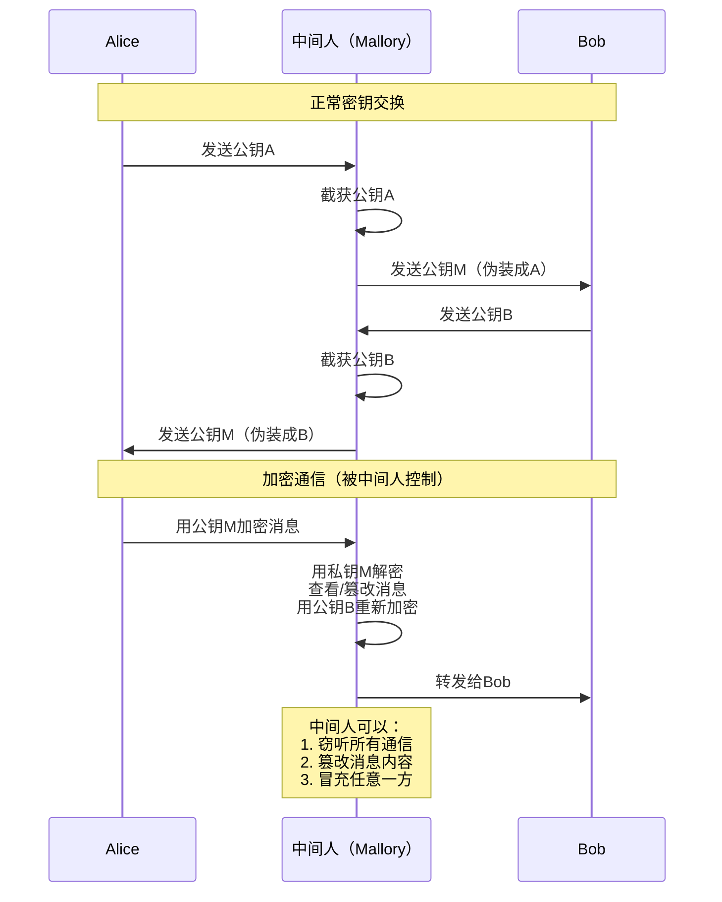

**攻击类型对比：**

| 攻击类型 | 原理 | 目标 | 防御方法 |
|---------|------|------|---------|
| 中间人攻击 | 截获并替换公钥 | 窃听和篡改通信 | 数字证书、PKI |
| 重放攻击 | 重放截获的数据 | 重复执行操作 | 时间戳、序列号 |
| Smurf攻击 | ICMP广播放大 | 拒绝服务 | 禁用IP广播 |
| 字典攻击 | 尝试常见密码 | 破解密码 | 强密码策略 |

### 2.3 中间人攻击场景

**常见MITM攻击场景：**

```
中间人攻击场景：
├── ARP欺骗
│   ├── 伪造ARP响应
│   ├── 劫持局域网流量
│   └── 窃听网络通信
├── DNS劫持
│   ├── 篡改DNS响应
│   ├── 重定向到恶意网站
│   └── 钓鱼攻击
├── SSL剥离
│   ├── 降级HTTPS到HTTP
│   ├── 窃听明文通信
│   └── 绕过加密保护
├── Wi-Fi窃听
│   ├── 伪造热点
│   ├── 截获无线流量
│   └── 窃取敏感信息
└── 路由劫持
    ├── 篡改路由表
    ├── 重定向流量
    └── 中间人位置
```

**ARP欺骗示例：**

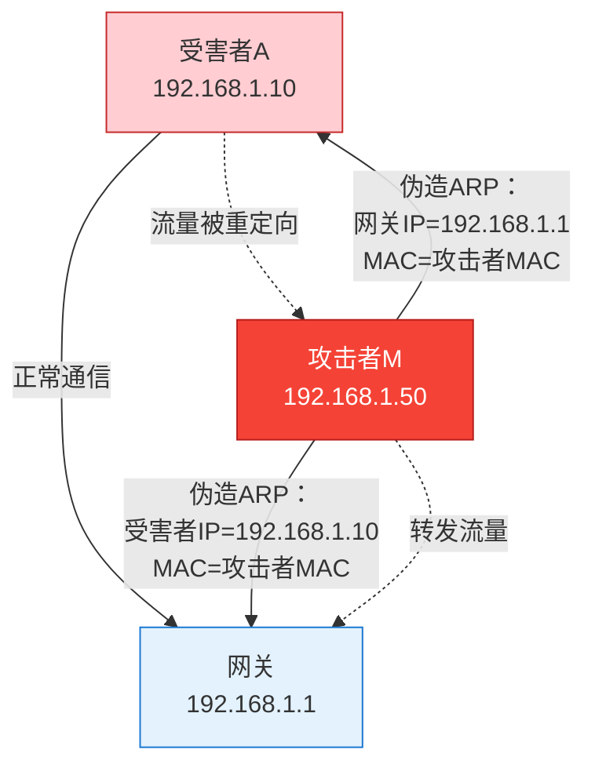

### 2.4 MITM防护措施

**防护策略：**

!!!tip "💡 防御中间人攻击"
    **技术防护：**
    
    🔐 **使用PKI和数字证书**
    - 验证通信方身份
    - 防止公钥被替换
    - 建立信任链
    
    🔒 **端到端加密**
    - 使用TLS/SSL
    - 验证证书有效性
    - 使用证书固定（Certificate Pinning）
    
    🛡️ **网络安全**
    - 使用VPN
    - 避免公共Wi-Fi
    - 启用HTTPS Everywhere
    
    ✅ **验证机制**
    - 双因素认证
    - 带外验证
    - 密钥指纹验证

**防护措施对比：**

| 防护措施 | 有效性 | 实施难度 | 适用场景 |
|---------|--------|---------|---------|
| 数字证书 | ⭐⭐⭐⭐⭐ | 中 | 所有场景 |
| VPN | ⭐⭐⭐⭐ | 低 | 远程访问 |
| 证书固定 | ⭐⭐⭐⭐⭐ | 高 | 移动应用 |
| HTTPS | ⭐⭐⭐⭐ | 低 | Web应用 |
| ARP防护 | ⭐⭐⭐ | 中 | 局域网 |


## 三、信息收集与侦察

### 3.1 信息收集概述

!!!anote "🔍 信息收集阶段"
    **信息收集**是攻击者在实施攻击前的准备阶段，目的是了解目标系统的信息，为后续攻击做准备。
    
    **收集的信息包括：**
    - 网络拓扑结构
    - 开放的端口和服务
    - 操作系统和应用版本
    - 域名和IP地址信息
    - 组织架构和人员信息

### 3.2 信息收集工具

!!!anote "🔍 信息收集工具识别"
    在信息收集阶段，**LC不是常用的黑客工具**。相比之下，Nmap是最流行的网络扫描工具，用于端口扫描和服务识别；Nslookup是DNS查询工具，用于域名解析和DNS信息收集；Xscan是综合扫描工具，用于漏洞扫描和安全评估。这三个工具都是攻击者在侦察阶段常用的合法工具。

**信息收集工具分类：**

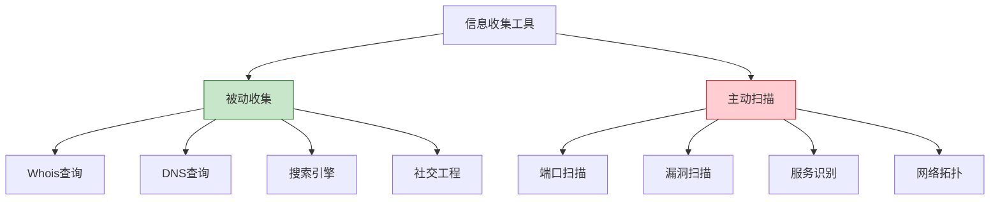

**常用信息收集工具：**

| 工具 | 类型 | 功能 | 使用场景 |
|------|------|------|---------|
| Nmap | 主动扫描 | 端口扫描、服务识别、OS检测 | 网络侦察 |
| Nslookup | 被动收集 | DNS查询、域名解析 | 域名信息 |
| Whois | 被动收集 | 域名注册信息查询 | 组织信息 |
| Xscan | 主动扫描 | 综合漏洞扫描 | 漏洞发现 |
| Netcat | 主动扫描 | 端口扫描、Banner抓取 | 服务识别 |
| Shodan | 被动收集 | 互联网设备搜索 | 资产发现 |

### 3.3 Nmap扫描工具

**Nmap功能详解：**

```
Nmap主要功能：
├── 主机发现
│   ├── Ping扫描
│   ├── ARP扫描
│   └── TCP/UDP扫描
├── 端口扫描
│   ├── TCP SYN扫描（半开扫描）
│   ├── TCP Connect扫描（全连接）
│   ├── UDP扫描
│   └── 隐蔽扫描
├── 服务识别
│   ├── 版本检测
│   ├── Banner抓取
│   └── 服务指纹识别
├── 操作系统检测
│   ├── TCP/IP指纹识别
│   ├── 协议栈分析
│   └── OS版本推断
└── 脚本引擎（NSE）
    ├── 漏洞检测
    ├── 服务枚举
    └── 安全审计
```

**Nmap常用命令：**

```bash
# 基本扫描
nmap 192.168.1.1

# 扫描端口范围
nmap -p 1-1000 192.168.1.1

# 服务版本检测
nmap -sV 192.168.1.1

# 操作系统检测
nmap -O 192.168.1.1

# 综合扫描
nmap -A 192.168.1.1

# 扫描整个网段
nmap 192.168.1.0/24

# 隐蔽扫描（SYN扫描）
nmap -sS 192.168.1.1

# 使用脚本扫描漏洞
nmap --script vuln 192.168.1.1
```

### 3.4 DNS信息收集

**Nslookup工具：**

!!!anote "💡 Nslookup用途"
    **Nslookup**是DNS查询工具，用于：
    - 查询域名对应的IP地址
    - 查询IP地址对应的域名（反向查询）
    - 查询DNS记录（A、MX、NS等）
    - 诊断DNS问题

**Nslookup使用示例：**

```bash
# 查询域名的IP地址
nslookup example.com

# 查询邮件服务器
nslookup -type=MX example.com

# 查询名称服务器
nslookup -type=NS example.com

# 查询所有DNS记录
nslookup -type=ANY example.com

# 使用指定DNS服务器查询
nslookup example.com 8.8.8.8
```

### 3.5 Whois信息查询

!!!anote "🌐 域名信息查询"
    域名注册信息存储在**Whois数据库**中，包括注册人、联系方式、注册日期、过期日期等详细信息。DNS记录只包含域名解析信息（如IP地址、邮件服务器），不包含注册信息。路由表用于网络路由，MIBs库用于SNMP设备管理，它们都与域名注册信息无关。

**Whois数据库信息：**

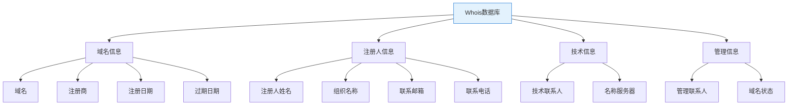

**信息来源对比：**

| 信息来源 | 类型 | 包含的信息 | 用途 |
|---------|------|-----------|------|
| Whois数据库 | 域名注册信息 | 注册人、联系方式、注册日期 | 域名所有权查询 |
| DNS记录 | 域名解析信息 | IP地址、邮件服务器 | 域名到IP映射 |
| 路由表 | 网络路由信息 | IP地址、网关、接口 | 数据包转发 |
| MIBs库 | SNMP管理信息库 | 设备管理信息 | 网络设备管理 |

**Whois查询示例：**

```bash
# 查询域名注册信息
whois example.com

# 查询IP地址归属
whois 8.8.8.8

# 在线Whois查询
# https://whois.icann.org/
# https://www.whois.com/
```

**Whois查询结果示例：**

```
Domain Name: EXAMPLE.COM
Registry Domain ID: 2336799_DOMAIN_COM-VRSN
Registrar WHOIS Server: whois.iana.org
Registrar URL: http://res-dom.iana.org
Updated Date: 2023-08-14T07:01:31Z
Creation Date: 1995-08-14T04:00:00Z
Registrar Registration Expiration Date: 2024-08-13T04:00:00Z
Registrar: RESERVED-Internet Assigned Numbers Authority

Registrant Organization: Internet Assigned Numbers Authority
Registrant State/Province: CA
Registrant Country: US

Admin Organization: Internet Assigned Numbers Authority
Tech Organization: Internet Assigned Numbers Authority

Name Server: A.IANA-SERVERS.NET
Name Server: B.IANA-SERVERS.NET
```

### 3.6 信息收集防护

**防护措施：**

```
信息收集防护策略：
├── 减少信息暴露
│   ├── 隐藏服务器版本信息
│   ├── 使用隐私保护服务
│   ├── 限制DNS区域传输
│   └── 最小化错误信息
├── 检测和监控
│   ├── 入侵检测系统（IDS）
│   ├── 日志监控
│   ├── 异常流量检测
│   └── 扫描行为识别
├── 访问控制
│   ├── 防火墙规则
│   ├── 端口过滤
│   ├── IP白名单
│   └── 速率限制
└── 主动防御
    ├── 蜜罐部署
    ├── 欺骗技术
    ├── 动态防御
    └── 威胁情报
```

## 四、ICMP Flood攻击

### 5.1 ICMP Flood攻击原理

!!!danger "🚨 ICMP Flood攻击"
    **ICMP Flood攻击**通过向被攻击者发送大量的ICMP回应请求（Echo Request），消耗被攻击者的资源来进行响应，直至被攻击者再也无法处理有效的网络信息流。

!!!danger "🚨 ICMP Flood攻击识别"
    通过向目标发送大量ICMP回应请求（Echo Request），消耗目标的CPU和带宽资源，直至无法处理正常网络流量的攻击方式称为**ICMP Flood攻击**。这与Land攻击（源地址等于目标地址）、Smurf攻击（利用广播放大）、Ping of Death（超大ICMP包）有明显区别。ICMP Flood是典型的流量型拒绝服务攻击。

**ICMP Flood攻击流程：**

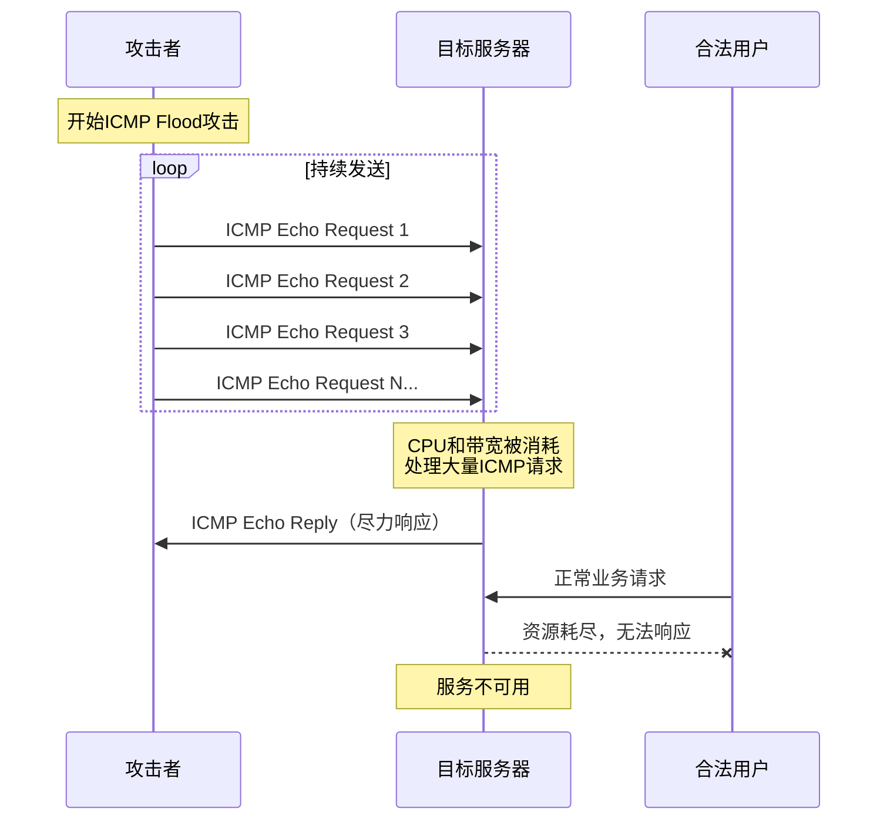

### 5.2 ICMP攻击类型对比

**常见ICMP攻击对比：**

| 攻击类型 | 攻击方式 | 流量特征 | 影响 |
|---------|---------|---------|------|
| ICMP Flood | 大量ICMP请求 | 高流量 | 资源耗尽 |
| Ping of Death | 超大ICMP包 | 低流量 | 缓冲区溢出 |
| Smurf | ICMP广播放大 | 放大流量 | 带宽耗尽 |
| Land | 源地址=目标地址 | 低流量 | CPU死循环 |

**详细对比：**

```
ICMP攻击类型详解：
├── ICMP Flood
│   ├── 原理：发送大量ICMP Echo Request
│   ├── 特点：消耗CPU和带宽资源
│   ├── 流量：高流量攻击
│   └── 防御：限制ICMP流量、流量清洗
├── Ping of Death
│   ├── 原理：发送超过65535字节的ICMP包
│   ├── 特点：利用IP分片重组漏洞
│   ├── 流量：低流量攻击
│   └── 防御：过滤超大数据包、系统补丁
├── Smurf
│   ├── 原理：伪造源IP，向广播地址发ICMP
│   ├── 特点：流量放大攻击
│   ├── 流量：放大后的高流量
│   └── 防御：禁用IP directed-broadcast
└── Land
    ├── 原理：源地址和目标地址相同
    ├── 特点：导致系统死循环
    ├── 流量：极低流量
    └── 防御：过滤异常数据包
```

### 5.3 ICMP Flood防护

**防护策略：**

!!!tip "💡 ICMP Flood防护措施"
    **网络层防护：**
    
    🔒 **限制ICMP流量**
    - 限制ICMP请求速率
    - 设置ICMP流量阈值
    - 超过阈值时丢弃或延迟
    
    🛡️ **防火墙规则**
    - 限制外部ICMP请求
    - 只允许必要的ICMP类型
    - 阻止来自可疑源的ICMP
    
    🌐 **流量清洗**
    - 使用DDoS防护服务
    - 清洗异常ICMP流量
    - 保留正常流量

**防火墙配置示例：**

```bash
# iptables配置（Linux）
# 限制ICMP Echo Request速率
iptables -A INPUT -p icmp --icmp-type echo-request -m limit --limit 1/s --limit-burst 5 -j ACCEPT
iptables -A INPUT -p icmp --icmp-type echo-request -j DROP

# 只允许特定ICMP类型
iptables -A INPUT -p icmp --icmp-type echo-reply -j ACCEPT
iptables -A INPUT -p icmp --icmp-type destination-unreachable -j ACCEPT
iptables -A INPUT -p icmp --icmp-type time-exceeded -j ACCEPT
iptables -A INPUT -p icmp -j DROP
```

```cisco
! Cisco ACL配置
! 限制ICMP流量
access-list 100 permit icmp any any echo-reply
access-list 100 permit icmp any any unreachable
access-list 100 permit icmp any any time-exceeded
access-list 100 deny icmp any any echo
access-list 100 permit ip any any

interface GigabitEthernet0/0
  ip access-group 100 in
  
! 使用rate-limit限制ICMP
interface GigabitEthernet0/0
  rate-limit input access-group 101 1000000 250000 500000 conform-action transmit exceed-action drop
  
access-list 101 permit icmp any any
```

**监控和检测：**


{
  "title": {
    "text": "ICMP流量监控示例"
  },
  "tooltip": {
    "trigger": "axis"
  },
  "legend": {
    "data": ["正常流量", "攻击流量", "阈值"]
  },
  "xAxis": {
    "type": "category",
    "data": ["00:00", "00:05", "00:10", "00:15", "00:20", "00:25", "00:30"]
  },
  "yAxis": {
    "type": "value",
    "name": "ICMP包数/秒"
  },
  "series": [
    {
      "name": "正常流量",
      "type": "line",
      "data": [50, 45, 55, 48, 52, 50, 53],
      "itemStyle": {"color": "#4caf50"}
    },
    {
      "name": "攻击流量",
      "type": "line",
      "data": [50, 45, 55, 5000, 8000, 10000, 12000],
      "itemStyle": {"color": "#f44336"}
    },
    {
      "name": "阈值",
      "type": "line",
      "data": [1000, 1000, 1000, 1000, 1000, 1000, 1000],
      "itemStyle": {"color": "#ff9800"},
      "lineStyle": {"type": "dashed"}
    }
  ]
}


## 五、WLAN安全

### 6.1 WLAN安全概述

!!!anote "📡 WLAN安全"
    **无线局域网（WLAN）**由于其开放性和便利性，面临着比有线网络更多的安全威胁。
    
    **主要威胁：**
    - 未授权访问
    - 数据窃听
    - 中间人攻击
    - 恶意AP（Evil Twin）
    - 拒绝服务攻击

### 6.2 WLAN安全措施

!!!warning "⚠️ WLAN安全误区"
    **启用无线AP的开放认证模式完全无法提高WLAN安全性**，反而会带来严重的安全风险。开放认证模式允许任何人无需密码即可连接，导致数据明文传输、易受中间人攻击、无法识别用户身份。相比之下，修改默认SSID可防止攻击者识别设备型号，禁止SSID广播能增加发现难度，启用双向认证则能确保终端和AP的身份可信。

**WLAN安全措施对比：**

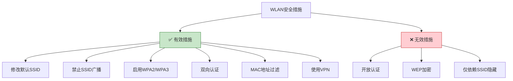

**安全措施详解：**

| 措施 | 有效性 | 说明 | 推荐度 |
|------|--------|------|--------|
| 修改默认SSID | ⭐⭐⭐ | 防止识别设备型号 | ✅ 推荐 |
| 禁止SSID广播 | ⭐⭐ | 增加发现难度，但可被探测 | 🟡 可选 |
| 启用WPA2/WPA3 | ⭐⭐⭐⭐⭐ | 强加密保护 | ✅ 必须 |
| 双向认证 | ⭐⭐⭐⭐⭐ | 防止恶意AP | ✅ 推荐 |
| MAC地址过滤 | ⭐⭐ | MAC可被伪造 | 🟡 辅助 |
| 使用VPN | ⭐⭐⭐⭐ | 端到端加密 | ✅ 推荐 |
| 开放认证 | ❌ | 完全不安全 | ❌ 禁止 |

### 6.3 WLAN认证模式

**认证模式对比：**

```
WLAN认证模式：
├── 开放认证（Open Authentication）
│   ├── 无需密码
│   ├── 任何人可连接
│   ├── ❌ 完全不安全
│   └── 适用场景：公共热点（配合Portal认证）
├── 共享密钥认证（Shared Key）
│   ├── 使用预共享密钥（PSK）
│   ├── WPA/WPA2-Personal
│   ├── ✅ 适合家庭和小型办公室
│   └── 安全性：中到高（取决于密码强度）
├── 802.1X认证（Enterprise）
│   ├── 基于RADIUS服务器
│   ├── WPA/WPA2/WPA3-Enterprise
│   ├── 支持多种EAP方法
│   ├── ✅ 适合企业环境
│   └── 安全性：高
└── WPA3-SAE
    ├── 同时认证等价（SAE）
    ├── 防止离线字典攻击
    ├── 前向保密
    ├── ✅ 最新标准
    └── 安全性：最高
```

**为什么开放认证不安全：**

!!!danger "🚨 开放认证的风险"
    **开放认证模式的问题：**
    
    🔓 **无身份验证**
    - 任何人都可以连接
    - 无法识别用户身份
    - 无法控制访问权限
    
    👁️ **数据明文传输**
    - 没有加密保护
    - 流量可被窃听
    - 敏感信息泄露
    
    🎭 **易受攻击**
    - 中间人攻击
    - 会话劫持
    - ARP欺骗
    
    ⚠️ **合规问题**
    - 不符合安全标准
    - 违反数据保护法规
    - 法律责任风险

### 6.4 WLAN安全最佳实践

**安全配置清单：**

```
WLAN安全配置清单：
├── 基本配置
│   ├── ✅ 修改默认管理员密码
│   ├── ✅ 修改默认SSID
│   ├── ✅ 禁用WPS（Wi-Fi Protected Setup）
│   ├── ✅ 启用防火墙
│   └── ✅ 定期更新固件
├── 加密和认证
│   ├── ✅ 使用WPA2或WPA3
│   ├── ✅ 使用强密码（至少12位）
│   ├── ✅ 启用802.1X认证（企业）
│   ├── ❌ 禁用WEP
│   └── ❌ 禁用开放认证
├── 访问控制
│   ├── ✅ MAC地址过滤（辅助）
│   ├── ✅ 限制连接设备数量
│   ├── ✅ 隔离客户端
│   └── ✅ 访客网络隔离
├── 监控和审计
│   ├── ✅ 启用日志记录
│   ├── ✅ 监控异常连接
│   ├── ✅ 定期安全审计
│   └── ✅ 入侵检测
└── 物理安全
    ├── ✅ AP放置在安全位置
    ├── ✅ 控制信号覆盖范围
    ├── ✅ 防止未授权AP
    └── ✅ 定期巡检
```

## 六、ARP欺骗防护

### 7.1 ARP欺骗原理

!!!anote "🎭 ARP欺骗"
    **ARP欺骗（ARP Spoofing）**是攻击者发送伪造的ARP消息到局域网，将攻击者的MAC地址与合法主机的IP地址关联，从而截获、修改或阻止网络流量。

**ARP欺骗攻击流程：**

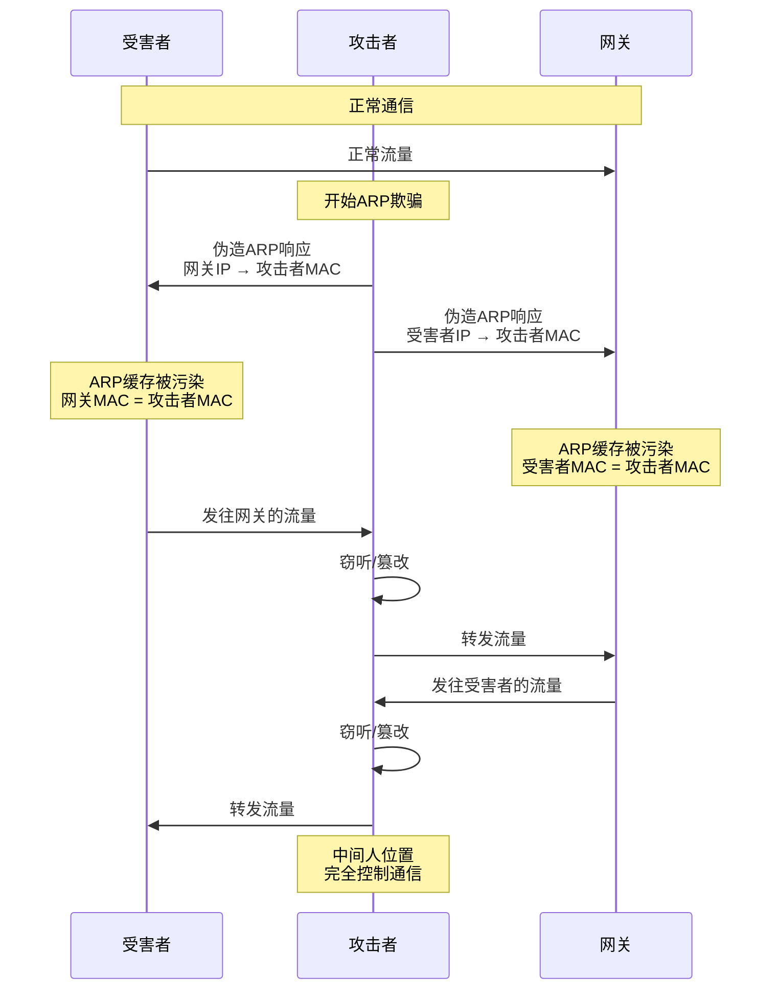

### 7.2 ARP欺骗防护措施

!!!tip "🛡️ ARP欺骗防护"
    对抗ARP欺骗最有效的手段是**使用静态ARP缓存**，通过手动绑定IP地址和MAC地址的对应关系，防止ARP缓存被伪造的ARP响应污染。阻止所有ARP报文会导致网络无法正常工作，杀毒软件虽然可以检测ARP攻击但无法完全防御，使用Linux系统也不能从根本上解决ARP欺骗问题，因为ARP协议的漏洞与操作系统类型无关。

**ARP防护方案比较：**

| 防护方案 | 有效性 | 优点 | 缺点 |
|---------|--------|------|------|
| 静态ARP缓存 | ✅ 高 | 完全防止ARP欺骗 | 管理复杂，不适合大型网络 |
| 动态ARP检测 | ✅ 高 | 自动检测和阻止 | 需要交换机支持 |
| ARP防火墙 | 🟡 中 | 实时监控和防护 | 需要安装软件 |
| 阻止所有ARP | ❌ 无 | 无 | 会导致网络无法工作 |
| 更换操作系统 | ❌ 无 | 无 | ARP协议漏洞与系统无关 |

**静态ARP缓存配置：**

```bash
# Windows系统
# 查看ARP缓存
arp -a

# 添加静态ARP条目
arp -s 192.168.1.1 00-11-22-33-44-55

# 删除ARP条目
arp -d 192.168.1.1

# Linux系统
# 查看ARP缓存
arp -n

# 添加静态ARP条目
arp -s 192.168.1.1 00:11:22:33:44:55

# 删除ARP条目
arp -d 192.168.1.1

# 永久静态ARP（添加到启动脚本）
echo "192.168.1.1 00:11:22:33:44:55" >> /etc/ethers
```

### 7.3 ARP防护方案对比

**多种防护方案：**

```
ARP欺骗防护方案：
├── 静态ARP绑定
│   ├── 优点：完全防止ARP欺骗
│   ├── 缺点：管理复杂，不适合大型网络
│   └── 适用：小型网络、关键主机
├── 动态ARP检测（DAI）
│   ├── 优点：自动检测和阻止ARP欺骗
│   ├── 缺点：需要交换机支持
│   └── 适用：企业网络
├── ARP防火墙
│   ├── 优点：实时监控和防护
│   ├── 缺点：需要安装软件
│   └── 适用：终端防护
├── 端口安全
│   ├── 优点：限制MAC地址数量
│   ├── 缺点：配置复杂
│   └── 适用：交换机端口
└── 网络隔离
    ├── 优点：限制攻击范围
    ├── 缺点：需要网络重新规划
    └── 适用：VLAN划分
```

**动态ARP检测（DAI）配置示例：**

```cisco
! Cisco交换机DAI配置
! 启用DHCP Snooping（DAI依赖）
ip dhcp snooping
ip dhcp snooping vlan 10

! 配置信任端口
interface GigabitEthernet0/1
  ip dhcp snooping trust
  
! 启用DAI
ip arp inspection vlan 10

! 配置DAI信任端口
interface GigabitEthernet0/1
  ip arp inspection trust
  
! 限制ARP速率
ip arp inspection vlan 10 rate 15

! 验证选项
ip arp inspection validate src-mac dst-mac ip
```

**ARP防护效果对比：**


{
  "title": {
    "text": "ARP防护方案效果对比"
  },
  "tooltip": {
    "trigger": "axis",
    "axisPointer": {
      "type": "shadow"
    }
  },
  "legend": {
    "data": ["防护效果", "管理复杂度", "性能影响"]
  },
  "radar": {
    "indicator": [
      {"name": "静态ARP", "max": 100},
      {"name": "DAI", "max": 100},
      {"name": "ARP防火墙", "max": 100},
      {"name": "端口安全", "max": 100},
      {"name": "网络隔离", "max": 100}
    ]
  },
  "series": [{
    "type": "radar",
    "data": [
      {
        "value": [100, 90, 80, 70, 85],
        "name": "防护效果"
      },
      {
        "value": [80, 40, 30, 50, 70],
        "name": "管理复杂度"
      },
      {
        "value": [10, 20, 30, 15, 25],
        "name": "性能影响"
      }
    ]
  }]
}



## 七、安全控制措施分类

### 8.1 安全控制措施概述

!!!anote "🛡️ 安全控制措施"
    安全控制措施可以按照功能分为三类：
    - **预防性控制（Preventive）**：防止安全事件发生
    - **检测性控制（Detective）**：发现安全事件
    - **纠正性控制（Corrective）**：响应和恢复安全事件

### 8.2 控制措施分类题目

!!!anote "🛡️ 安全控制措施分类"
    正确的安全控制措施分类是：**网络防火墙（P-预防性）、RAID级别3（C-纠正性）、银行账单监督复审（D-检测性）、分配用户标识（P-预防性）、交易日志（D-检测性）**。防火墙和用户标识在事前阻止未授权访问，属于预防性控制；RAID通过数据冗余在故障后恢复数据，属于纠正性控制；账单复审和交易日志用于发现异常和提供审计证据，属于检测性控制。

**详细分析：**

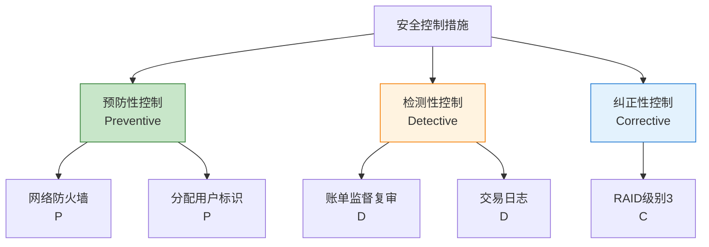

**逐项分析：**

| 序号 | 控制措施 | 分类 | 理由 |
|------|---------|------|------|
| 1 | 网络防火墙 | P（预防性） | 阻止未授权访问，防止攻击发生 |
| 2 | RAID级别3 | C（纠正性） | 数据冗余，故障后恢复数据 |
| 3 | 银行账单监督复审 | D（检测性） | 发现异常交易和错误 |
| 4 | 分配计算机用户标识 | P（预防性） | 身份识别，防止未授权访问 |
| 5 | 交易日志 | D（检测性） | 记录活动，用于审计和检测 |

### 8.3 三类控制措施详解

**预防性控制（Preventive Controls）：**

!!!anote "🛡️ 预防性控制"
    **目的：**防止安全事件发生
    
    **特点：**
    - 主动防御
    - 事前控制
    - 降低风险发生概率
    
    **常见示例：**
    - 🔥 防火墙
    - 🔐 访问控制
    - 🔑 身份认证
    - 🚪 物理门禁
    - 📝 安全策略
    - 🎓 安全培训
    - 💉 补丁管理
    - 🔒 数据加密

**检测性控制（Detective Controls）：**

!!!anote "🔍 检测性控制"
    **目的：**发现已发生或正在发生的安全事件
    
    **特点：**
    - 被动监控
    - 事中/事后发现
    - 提供证据和告警
    
    **常见示例：**
    - 📊 日志记录
    - 🚨 入侵检测系统（IDS）
    - 📹 监控摄像头
    - 🔍 审计
    - 📈 异常检测
    - 🔔 告警系统
    - 📝 账单复审
    - 🕵️ 安全审查

**纠正性控制（Corrective Controls）：**

!!!anote "🔧 纠正性控制"
    **目的：**响应安全事件，恢复正常状态
    
    **特点：**
    - 事后响应
    - 减少损失
    - 恢复服务
    
    **常见示例：**
    - 💾 数据备份和恢复
    - 🔄 RAID
    - 🆘 应急响应
    - 🔧 系统修复
    - 🔄 故障切换
    - 📋 灾难恢复计划
    - 🔐 密码重置
    - 🚫 账户锁定

### 8.4 控制措施实例分析

**1. 网络防火墙 - 预防性控制（P）**

```
网络防火墙：
├── 功能：阻止未授权访问
├── 时机：事前防御
├── 作用：
│   ├── 过滤恶意流量
│   ├── 阻止攻击尝试
│   ├── 控制网络访问
│   └── 防止数据泄露
└── 分类：预防性控制（P）
```

**2. RAID级别3 - 纠正性控制（C）**

```
RAID级别3：
├── 功能：数据冗余和恢复
├── 时机：故障发生后
├── 作用：
│   ├── 数据条带化
│   ├── 奇偶校验
│   ├── 单盘故障可恢复
│   └── 保证数据可用性
└── 分类：纠正性控制（C）
```

**3. 银行账单监督复审 - 检测性控制（D）**

```
账单监督复审：
├── 功能：发现异常交易
├── 时机：事后检查
├── 作用：
│   ├── 检测欺诈行为
│   ├── 发现错误交易
│   ├── 识别异常模式
│   └── 提供审计证据
└── 分类：检测性控制（D）
```

**4. 分配计算机用户标识 - 预防性控制（P）**

```
用户标识分配：
├── 功能：身份识别和认证
├── 时机：访问前验证
├── 作用：
│   ├── 唯一标识用户
│   ├── 控制访问权限
│   ├── 防止未授权访问
│   └── 支持审计追踪
└── 分类：预防性控制（P）
```

**5. 交易日志 - 检测性控制（D）**

```
交易日志：
├── 功能：记录系统活动
├── 时机：实时记录
├── 作用：
│   ├── 记录所有交易
│   ├── 支持审计分析
│   ├── 发现异常行为
│   └── 提供证据链
└── 分类：检测性控制（D）
```

### 8.5 控制措施组合策略

**纵深防御策略：**

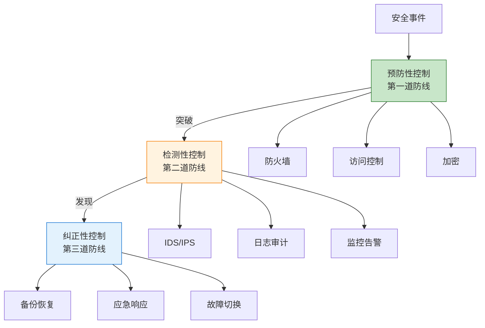

**完整的安全控制体系：**

```
安全控制体系：
├── 预防层（Preventive）
│   ├── 网络防火墙
│   ├── 访问控制列表
│   ├── 身份认证系统
│   ├── 数据加密
│   ├── 安全策略
│   └── 安全培训
├── 检测层（Detective）
│   ├── 入侵检测系统
│   ├── 日志管理系统
│   ├── 安全信息和事件管理（SIEM）
│   ├── 文件完整性监控
│   ├── 异常行为检测
│   └── 定期审计
└── 纠正层（Corrective）
    ├── 数据备份系统
    ├── RAID阵列
    ├── 应急响应计划
    ├── 灾难恢复方案
    ├── 故障切换机制
    └── 补丁管理流程
```

## 八、访问审计系统

### 9.1 建筑物访问审计

!!!anote "🏢 物理访问审计"
    **建筑物自动化访问审计系统**记录人员进出建筑物的信息，用于安全管理和事件调查。

!!!anote "🏢 访问审计系统记录"
    建筑物自动化访问审计系统**无法自动记录出入的原因**，因为这涉及人员的主观意图，需要人工登记。系统能够自动记录的信息包括：出入时间（精确到秒的时间戳）、出入口位置（门禁点编号和位置）、是否成功进入（授权成功或失败）、用户身份（卡号、工号、姓名）以及访问方式（刷卡、指纹、人脸等）。

### 9.2 访问审计系统记录内容

**访问审计系统记录的信息：**

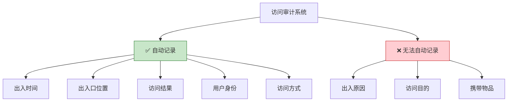

**详细记录内容：**

| 记录项 | 是否自动记录 | 说明 |
|--------|------------|------|
| 出入时间 | ✅ 是 | 精确到秒的时间戳 |
| 出入口位置 | ✅ 是 | 门禁点编号和位置 |
| 是否成功进入 | ✅ 是 | 授权成功/失败 |
| 用户身份 | ✅ 是 | 卡号、工号、姓名 |
| 访问方式 | ✅ 是 | 刷卡、指纹、人脸等 |
| 出入原因 | ❌ 否 | 需要人工登记 |
| 访问目的 | ❌ 否 | 需要人工登记 |
| 携带物品 | ❌ 否 | 需要人工检查 |

### 9.3 访问审计日志示例

**典型的访问审计日志：**

```
访问审计日志示例：
┌──────────────────────────────────────────────────────────┐
│ 时间戳          │ 2025-01-15 09:23:45                    │
│ 用户ID          │ EMP001234                              │
│ 用户姓名        │ 张三                                    │
│ 部门            │ IT部门                                  │
│ 出入口          │ 主楼1层东门                             │
│ 门禁点编号      │ DOOR-001                               │
│ 访问方式        │ 刷卡 + 指纹                             │
│ 访问结果        │ 成功                                    │
│ 方向            │ 进入                                    │
│ 授权级别        │ 员工                                    │
└──────────────────────────────────────────────────────────┘

┌──────────────────────────────────────────────────────────┐
│ 时间戳          │ 2025-01-15 09:25:12                    │
│ 用户ID          │ VISITOR-5678                           │
│ 用户姓名        │ 李四                                    │
│ 访客类型        │ 外部访客                                │
│ 出入口          │ 主楼1层访客通道                         │
│ 门禁点编号      │ DOOR-VISITOR                           │
│ 访问方式        │ 访客卡                                  │
│ 访问结果        │ 成功                                    │
│ 方向            │ 进入                                    │
│ 授权级别        │ 访客                                    │
│ 接待人          │ 张三（EMP001234）                       │
│ 有效期          │ 2025-01-15 09:00 - 18:00               │
└──────────────────────────────────────────────────────────┘

┌──────────────────────────────────────────────────────────┐
│ 时间戳          │ 2025-01-15 02:15:33                    │
│ 用户ID          │ UNKNOWN                                │
│ 卡号            │ 9999-8888-7777                         │
│ 出入口          │ 主楼3层机房门                           │
│ 门禁点编号      │ DOOR-SERVER                            │
│ 访问方式        │ 刷卡                                    │
│ 访问结果        │ ❌ 失败 - 未授权                        │
│ 方向            │ 尝试进入                                │
│ 告警            │ 是 - 非工作时间未授权访问尝试            │
└──────────────────────────────────────────────────────────┘
```

### 9.4 访问审计系统的价值

**审计系统的作用：**

```
访问审计系统价值：
├── 安全管理
│   ├── 实时监控人员进出
│   ├── 识别未授权访问
│   ├── 异常行为告警
│   └── 访问权限验证
├── 事件调查
│   ├── 提供历史记录
│   ├── 追溯人员行踪
│   ├── 确定事件时间线
│   └── 提供证据支持
├── 合规要求
│   ├── 满足安全标准
│   ├── 审计追踪
│   ├── 数据保护
│   └── 法规遵从
└── 运营管理
    ├── 考勤统计
    ├── 访客管理
    ├── 区域管理
    └── 报表分析
```

**访问审计报表示例：**


{
  "title": {
    "text": "每日访问统计"
  },
  "tooltip": {
    "trigger": "axis"
  },
  "legend": {
    "data": ["成功访问", "失败访问", "访客访问"]
  },
  "xAxis": {
    "type": "category",
    "data": ["00:00", "04:00", "08:00", "12:00", "16:00", "20:00"]
  },
  "yAxis": {
    "type": "value",
    "name": "访问次数"
  },
  "series": [
    {
      "name": "成功访问",
      "type": "line",
      "data": [5, 3, 150, 200, 180, 20],
      "itemStyle": {"color": "#4caf50"}
    },
    {
      "name": "失败访问",
      "type": "line",
      "data": [2, 5, 3, 2, 1, 8],
      "itemStyle": {"color": "#f44336"}
    },
    {
      "name": "访客访问",
      "type": "line",
      "data": [0, 0, 15, 25, 20, 2],
      "itemStyle": {"color": "#ff9800"}
    }
  ]
}


## 九、检测未授权信息处理活动

### 10.1 安全控制措施分类

!!!anote "🔍 检测措施辨析"
    在检测未授权信息处理活动的措施中，**系统错误日志主要用于诊断系统问题，而非专门检测未授权活动**。相比之下，用户和管理员操作日志能直接记录所有操作并发现未授权行为；网络连接时限可以限制异常长时间连接，间接检测可疑会话；时钟同步虽然不直接检测，但能确保日志时间准确，支持跨系统的审计分析和事件关联。

### 10.2 检测未授权活动的措施

**检测措施分类：**

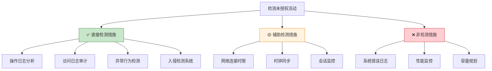

**详细分析：**

| 措施 | 类型 | 检测能力 | 说明 |
|------|------|---------|------|
| 操作日志分析 | ✅ 直接检测 | 高 | 记录所有操作，发现未授权行为 |
| 网络连接时限 | 🟡 辅助检测 | 中 | 限制异常长连接，间接检测 |
| 时钟同步 | 🟡 辅助检测 | 低 | 支持准确的时间关联分析 |
| 系统错误日志 | ❌ 非检测 | 低 | 主要用于系统诊断，非安全检测 |

### 10.3 各项措施详解

**A. 设置网络连接时限**

```
网络连接时限：
├── 功能：限制会话持续时间
├── 检测能力：
│   ├── 发现异常长时间连接
│   ├── 检测可能的会话劫持
│   ├── 识别僵尸连接
│   └── 防止资源占用
├── 实现方式：
│   ├── 空闲超时
│   ├── 绝对超时
│   ├── 强制断开
│   └── 重新认证
└── 分类：辅助检测措施
```

**B. 记录并分析系统错误日志**

```
系统错误日志：
├── 主要用途：
│   ├── 系统故障诊断
│   ├── 性能问题分析
│   ├── 软件bug追踪
│   └── 系统优化
├── 安全价值：
│   ├── 有限的安全信息
│   ├── 可能包含攻击痕迹
│   ├── 但不是主要检测手段
│   └── 需要结合其他日志
└── 分类：非专门检测措施
```

**C. 记录并分析用户和管理员操作日志**

```
操作日志分析：
├── 功能：记录所有用户操作
├── 检测能力：
│   ├── 发现未授权访问
│   ├── 识别权限滥用
│   ├── 检测异常操作
│   ├── 追踪操作轨迹
│   └── 提供审计证据
├── 记录内容：
│   ├── 用户身份
│   ├── 操作时间
│   ├── 操作类型
│   ├── 操作对象
│   ├── 操作结果
│   └── 源IP地址
└── 分类：直接检测措施
```

**D. 启用时钟同步**

```
时钟同步（NTP）：
├── 功能：确保系统时间准确
├── 检测支持：
│   ├── 准确的时间戳
│   ├── 事件关联分析
│   ├── 跨系统审计
│   └── 时间线重建
├── 重要性：
│   ├── 审计的基础
│   ├── 法律证据要求
│   ├── 事件调查必需
│   └── 合规要求
└── 分类：辅助检测措施
```

### 10.4 完整的检测体系

**未授权活动检测体系：**

```
未授权活动检测体系：
├── 日志收集
│   ├── 操作日志
│   ├── 访问日志
│   ├── 安全日志
│   ├── 应用日志
│   └── 网络日志
├── 实时监控
│   ├── 入侵检测系统（IDS）
│   ├── 入侵防御系统（IPS）
│   ├── 安全信息和事件管理（SIEM）
│   ├── 用户行为分析（UBA）
│   └── 网络流量分析
├── 分析检测
│   ├── 规则匹配
│   ├── 异常检测
│   ├── 行为分析
│   ├── 威胁情报
│   └── 机器学习
├── 辅助措施
│   ├── 时钟同步
│   ├── 连接时限
│   ├── 会话管理
│   └── 访问控制
└── 响应处置
    ├── 告警通知
    ├── 自动阻断
    ├── 事件调查
    └── 证据保全
```

## 十、总结

### 11.1 核心知识点回顾

**网络攻击类型：**

!!!success "🎯 关键要点"
    **拒绝服务攻击：**
    - Teardrop和Land是协议型攻击，不是流量型
    - UDP Flood和Smurf是流量型攻击
    - 防御Smurf攻击：使用`no ip directed-broadcast`
    - ICMP Flood通过大量ICMP请求消耗资源
    
    **中间人攻击：**
    - 截获并替换公钥属于中间人攻击
    - 防御：使用PKI和数字证书
    - 常见场景：ARP欺骗、DNS劫持、SSL剥离
    
    **信息收集：**
    - Nmap、Nslookup、Xscan是常用工具
    - LC不是信息收集工具
    - Whois数据库包含域名注册信息
    - DNS记录只包含解析信息
    
    **SDL开发：**
    - SDL强调持续改进和安全文化
    - SDL是对传统开发的补充
    - "可度量性"不是SDL的核心思想
    
    **WLAN安全：**
    - 开放认证模式完全不安全
    - 应使用WPA2/WPA3加密
    - 修改默认SSID、禁止广播、双向认证都有效
    
    **ARP防护：**
    - 静态ARP缓存是有效防护手段
    - 阻止所有ARP报文会导致网络无法工作
    - 杀毒软件和操作系统类型效果有限
    
    **安全控制：**
    - 防火墙和用户标识是预防性控制（P）
    - RAID是纠正性控制（C）
    - 账单复审和交易日志是检测性控制（D）
    
    **访问审计：**
    - 自动记录：时间、位置、结果、身份
    - 无法自动记录：出入原因、访问目的
    
    **检测措施：**
    - 操作日志分析是直接检测措施
    - 系统错误日志主要用于系统诊断
    - 时钟同步和连接时限是辅助措施

### 11.2 考试要点

!!!tip "💡 考试提示"
    **攻击类型识别：**
    - 区分流量型和协议型DoS攻击
    - 理解各种攻击的原理和特征
    - 掌握相应的防护措施
    
    **工具和技术：**
    - 熟悉常用信息收集工具
    - 了解Whois、DNS、路由表的区别
    - 掌握SDL的核心思想
    
    **安全措施：**
    - 理解预防、检测、纠正三类控制
    - 掌握WLAN安全配置
    - 了解ARP欺骗防护方法
    
    **审计和监控：**
    - 了解访问审计系统的功能
    - 区分不同类型的日志用途
    - 理解检测措施的分类

---

**相关资源：**
- OWASP Top 10
- NIST Cybersecurity Framework
- ISO/IEC 27001
- Microsoft SDL
- IEEE 802.11 Wireless Standards
