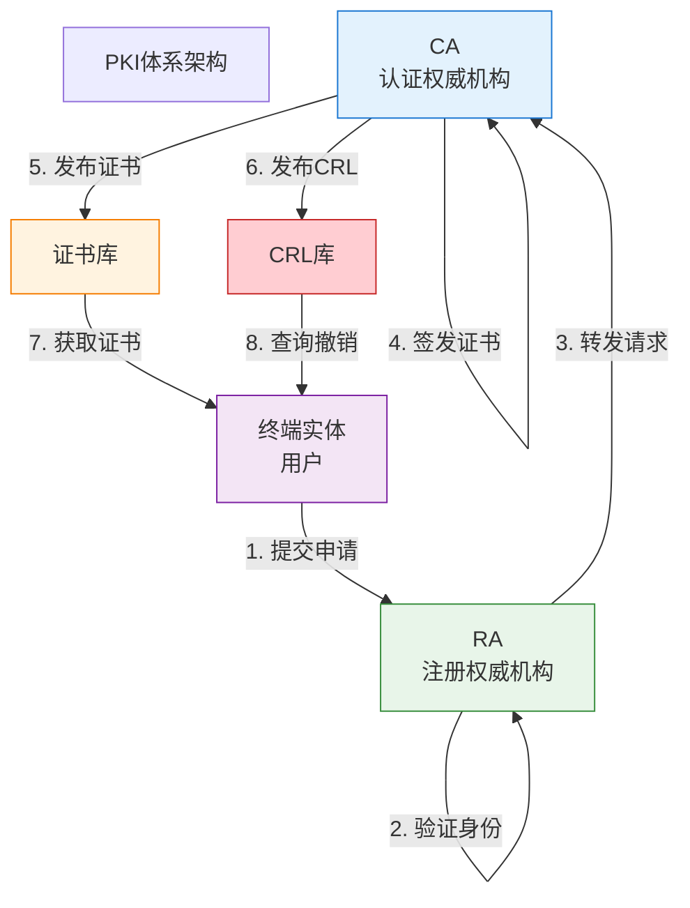
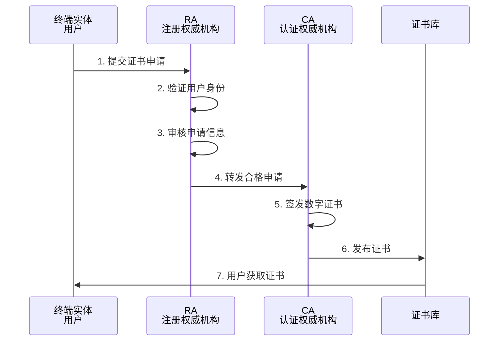
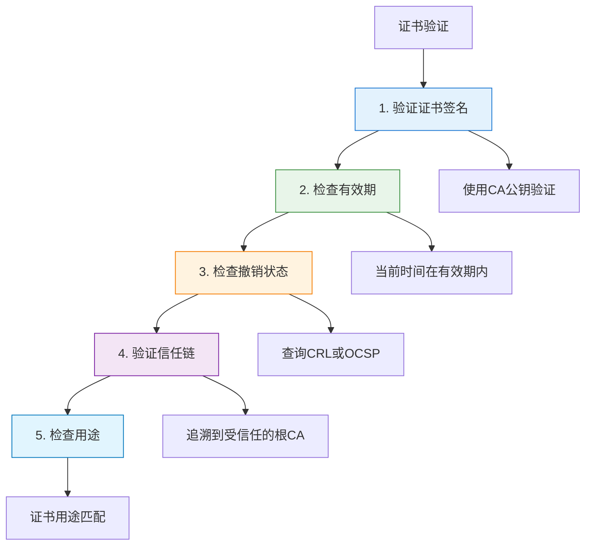
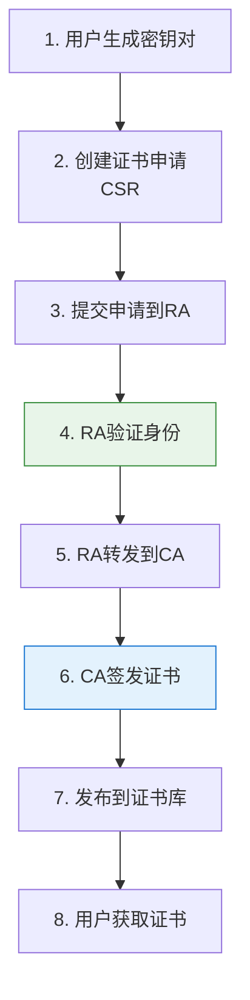
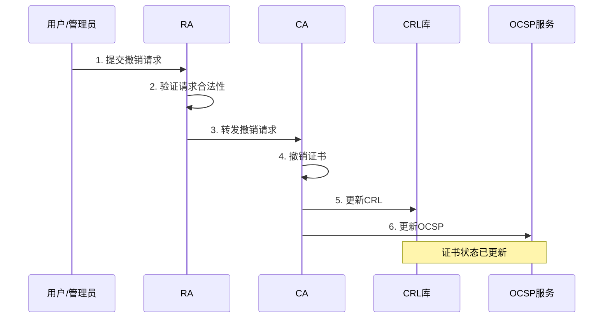

---
title: "CISP学习指南：PKI与数字证书"
date: 2025-10-18
categories:
  - Cybersecurity
tags:
  - CISP
excerpt: "深入解析CISP认证中的公钥基础设施（PKI）和数字证书体系，涵盖CA、RA、证书生命周期管理等核心概念。"
lang: zh-CN
available_langs: []
permalink: /zh-CN/2025/10/CISP-PKI-Digital-Certificates/
thumbnail: /assets/cisp/thumbnail.png
thumbnail_80: /assets/cisp/thumbnail_80.png
series: cisp
canonical_lang: zh-CN
---

公钥基础设施（Public Key Infrastructure, PKI）是支撑网络安全的重要基础设施，通过数字证书实现身份认证、数据加密和完整性保护。

## 一、PKI概述

### 1.1 什么是PKI

!!!anote "🔐 PKI定义"
    **公钥基础设施（PKI）**是一套用于创建、管理、分发、使用、存储和撤销数字证书的策略、流程、服务器平台、软件和工作站的集合。
    
    **核心功能：**
    - 身份认证
    - 数据加密
    - 数字签名
    - 完整性保护
    - 不可否认性

### 1.2 PKI的重要性

**为什么需要PKI：**

- 🔒 解决公钥分发和验证问题
- 🆔 提供可信的身份认证
- 📝 支持数字签名和加密
- 🛡️ 保护网络通信安全
- ⚖️ 提供法律效力支持

## 二、PKI核心组件

### 2.1 PKI体系架构



### 2.2 认证权威机构（CA）

!!!anote "🏛️ CA - 认证权威机构"
    **Certificate Authority (CA)**是PKI的核心，负责签发和管理数字证书。
    
    **主要职责：**
    - 签发数字证书
    - 撤销证书
    - 发布证书撤销列表（CRL）
    - 管理证书生命周期
    - 维护证书库

**CA的类型：**

| CA类型 | 说明 | 示例 |
|--------|------|------|
| 根CA | 信任链的顶端 | DigiCert Root CA |
| 中间CA | 由根CA签发 | DigiCert Intermediate CA |
| 签发CA | 直接签发用户证书 | 企业内部CA |

**CA的信任模型：**

```
根CA（自签名）
  ├── 中间CA 1
  │   ├── 签发CA 1-1
  │   │   ├── 用户证书
  │   │   └── 服务器证书
  │   └── 签发CA 1-2
  └── 中间CA 2
      └── 签发CA 2-1
```

### 2.3 注册权威机构（RA）

!!!anote "📝 RA - 注册权威机构"
    **Registration Authority (RA)**是CA的代理机构，负责处理证书申请和用户身份验证。
    
    **主要职责：**
    - 接收证书申请
    - 验证用户身份
    - 审核申请信息
    - 转发请求给CA
    - 处理证书撤销请求

**RA在证书申请流程中的关键作用：**



**RA与CA的区别：**

| 特征 | RA | CA |
|------|----|----|
| 主要职责 | 身份验证和申请处理 | 证书签发和管理 |
| 权限 | 不能签发证书 | 可以签发证书 |
| 位置 | 可以分布式部署 | 通常集中管理 |
| 安全要求 | 较高 | 极高 |
| 私钥 | 不持有CA私钥 | 持有签名私钥 |

!!!warning "⚠️ 关键区别"
    **RA不能签发证书！**
    
    - RA只负责身份验证和申请处理
    - 证书的签发必须由CA完成
    - RA是CA的"前台"，CA是"后台"
    - 这种分离提高了安全性和可扩展性

### 2.4 证书库

!!!anote "📚 证书库"
    **证书库（Certificate Repository）**存储已签发的数字证书，供用户查询和下载。
    
    **主要功能：**
    - 存储有效证书
    - 提供证书查询服务
    - 支持证书下载
    - 维护证书索引

**证书库的访问方式：**

- 🌐 LDAP（轻量级目录访问协议）
- 🔍 HTTP/HTTPS查询接口
- 📡 OCSP（在线证书状态协议）

### 2.5 CRL库

!!!anote "🚫 CRL库"
    **证书撤销列表库（CRL Repository）**存储已撤销证书的列表。
    
    **主要功能：**
    - 发布证书撤销列表
    - 提供撤销状态查询
    - 定期更新CRL
    - 支持增量CRL

**CRL的内容：**

| 字段 | 说明 |
|------|------|
| 证书序列号 | 被撤销证书的唯一标识 |
| 撤销时间 | 证书被撤销的时间 |
| 撤销原因 | 撤销的原因代码 |
| 签发者 | CRL的签发者 |
| 下次更新时间 | 下一个CRL的发布时间 |

### 2.6 OCSP服务

!!!anote "🔍 OCSP - 在线证书状态协议"
    **Online Certificate Status Protocol (OCSP)**提供实时的证书状态查询服务。
    
    **优势：**
    - 实时查询证书状态
    - 响应速度快
    - 减少带宽消耗
    - 避免CRL过期问题

**OCSP vs CRL：**

| 特征 | OCSP | CRL |
|------|------|-----|
| 查询方式 | 实时在线查询 | 下载完整列表 |
| 响应速度 | 快 | 较慢 |
| 带宽消耗 | 小 | 大 |
| 隐私性 | 较低（暴露查询目标） | 较高 |
| 可用性要求 | 高（需要在线服务） | 低（可离线使用） |

## 三、数字证书

### 3.1 数字证书的结构

**X.509数字证书的主要字段：**

```
数字证书结构：
├── 版本号
├── 序列号
├── 签名算法
├── 签发者（CA）
├── 有效期
│   ├── 生效时间
│   └── 失效时间
├── 主体（证书持有者）
├── 主体公钥信息
│   ├── 公钥算法
│   └── 公钥值
├── 扩展字段
│   ├── 密钥用途
│   ├── 主体备用名称
│   └── CRL分发点
└── CA的数字签名
```

### 3.2 证书类型

**常见的数字证书类型：**

| 证书类型 | 用途 | 示例 |
|---------|------|------|
| 服务器证书 | 网站HTTPS | SSL/TLS证书 |
| 客户端证书 | 用户身份认证 | 个人数字证书 |
| 代码签名证书 | 软件签名 | 软件发布商证书 |
| 邮件证书 | 邮件加密和签名 | S/MIME证书 |
| 设备证书 | IoT设备认证 | 设备身份证书 |

### 3.3 证书验证

**证书验证的步骤：**



## 四、证书生命周期管理

### 4.1 证书申请流程

**完整的证书申请流程：**



**证书申请（CSR）包含的信息：**

- 📝 主体信息（姓名、组织、国家等）
- 🔑 公钥
- 📧 联系信息
- 🔐 申请者的数字签名

### 4.2 证书更新

**证书更新的场景：**

- ⏰ 证书即将过期
- 🔄 密钥需要更换
- 📝 证书信息需要变更
- 🔒 加密算法升级

**更新流程：**

1. 在证书过期前提交更新申请
2. RA验证身份（可能简化）
3. CA签发新证书
4. 用户安装新证书
5. 旧证书到期后自动失效

### 4.3 证书撤销

!!!anote "🚫 证书撤销"
    **证书撤销**是在证书有效期内使其失效的过程。
    
    **撤销原因：**
    - 私钥泄露或丢失
    - 证书信息不准确
    - 用户离职或权限变更
    - CA被攻破
    - 证书不再需要

**证书撤销流程：**



**撤销后的处理：**

- 📋 证书序列号加入CRL
- 🔄 OCSP服务更新状态
- 🚫 证书不再被信任
- ⚠️ 依赖方需要检查撤销状态

## 五、PKI应用场景

### 5.1 HTTPS/SSL/TLS

**Web安全通信：**

- 🌐 网站身份认证
- 🔒 数据传输加密
- 🛡️ 防止中间人攻击
- ✅ 数据完整性保护

### 5.2 电子邮件安全

**S/MIME应用：**

- 📧 邮件加密
- ✍️ 数字签名
- 🔐 发件人身份认证
- 📝 邮件完整性保护

### 5.3 代码签名

**软件安全：**

- 💻 验证软件来源
- ✅ 确保代码未被篡改
- 🛡️ 防止恶意软件
- 📦 应用商店分发

### 5.4 VPN和网络接入

**网络安全：**

- 🔐 用户身份认证
- 🌐 VPN连接建立
- 📡 无线网络认证（802.1X）
- 🔒 设备接入控制

## 六、PKI安全考虑

### 6.1 CA安全

**保护CA的关键措施：**

- 🔐 私钥离线存储（HSM）
- 🏢 物理安全控制
- 👥 多人授权机制
- 📋 严格的审计日志
- 🔄 定期安全评估

### 6.2 证书管理最佳实践

**证书管理建议：**

| 实践 | 说明 |
|------|------|
| 密钥长度 | 至少2048位RSA或256位ECC |
| 有效期 | 不超过2年（公共证书） |
| 撤销检查 | 始终验证证书撤销状态 |
| 私钥保护 | 使用HSM或安全存储 |
| 证书监控 | 监控证书过期和异常 |

### 6.3 常见安全威胁

**PKI面临的威胁：**

| 威胁 | 描述 | 防护措施 |
|------|------|---------|
| CA被攻破 | 攻击者获取CA私钥 | 离线存储、HSM保护 |
| 中间人攻击 | 伪造证书 | 证书固定、CT日志 |
| 私钥泄露 | 用户私钥被窃取 | 及时撤销、密钥保护 |
| 证书滥用 | 证书被用于非法用途 | 限制证书用途、监控 |

## 七、总结

PKI体系的核心要点：

1. **核心组件**：CA、RA、证书库、CRL库、OCSP
2. **RA的作用**：在用户和CA之间，负责身份验证和申请处理
3. **RA不能签发证书**：只有CA才能签发证书
4. **证书生命周期**：申请、签发、使用、更新、撤销
5. **撤销机制**：CRL和OCSP两种方式

!!!success "🎯 关键要点"
    - PKI包含CA、RA、证书库、CRL库等核心组件
    - **RA是CA的代理**，负责身份验证，但不能签发证书
    - 证书申请流程：用户→RA→CA→证书库→用户
    - 证书撤销通过CRL或OCSP实现
    - 证书验证包括签名、有效期、撤销状态、信任链等检查

!!!tip "💡 考试提示"
    - 记住RA在证书申请流程中的位置和作用
    - RA不能签发证书，只能验证身份和转发请求
    - 理解证书库和CRL库的区别
    - 掌握OCSP相对于CRL的优势
    - 了解证书生命周期的各个阶段

---

**相关资源：**
- [RFC 5280 - X.509证书标准](https://tools.ietf.org/html/rfc5280)
- [RFC 6960 - OCSP协议](https://tools.ietf.org/html/rfc6960)
