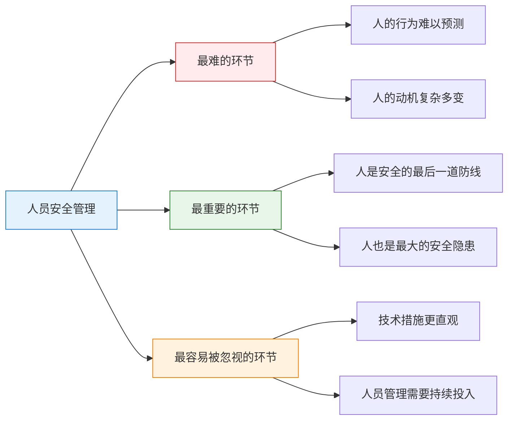
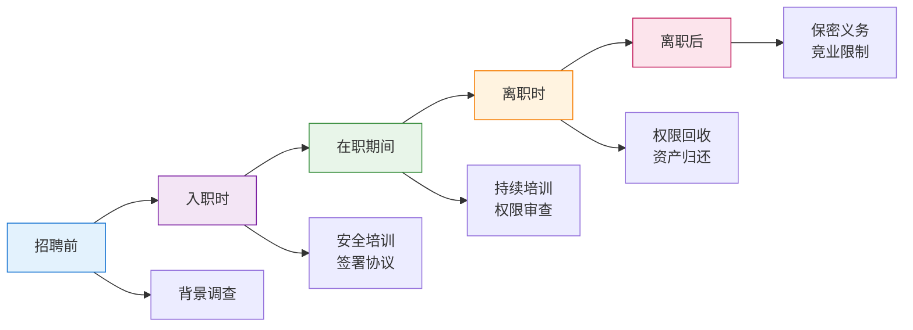
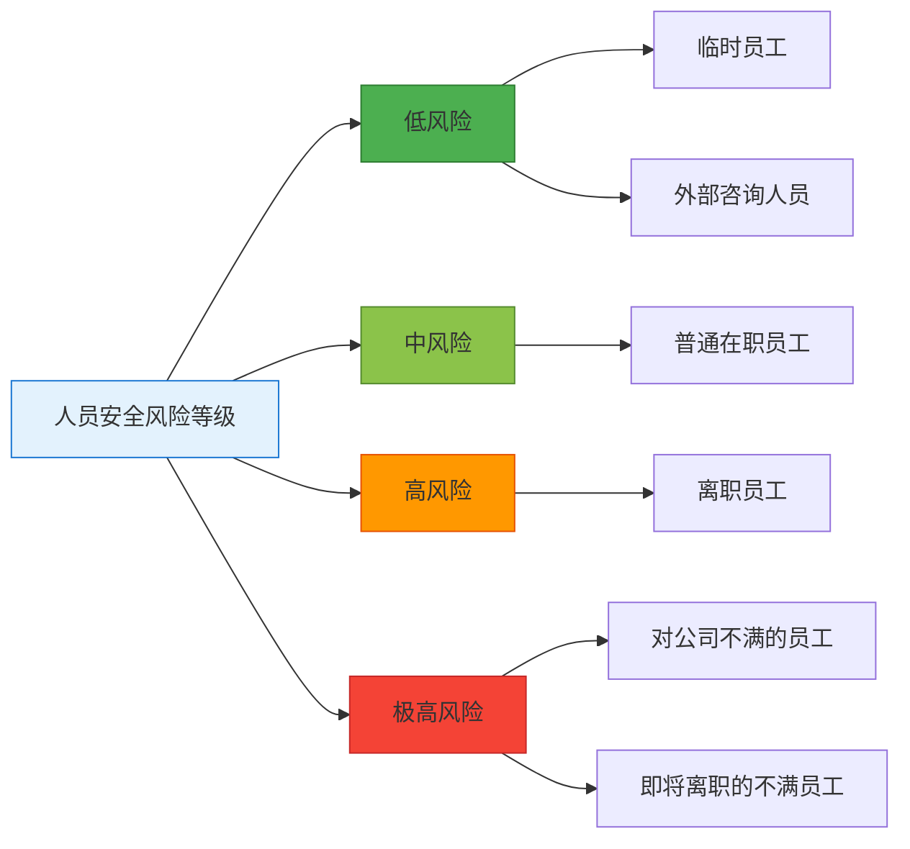
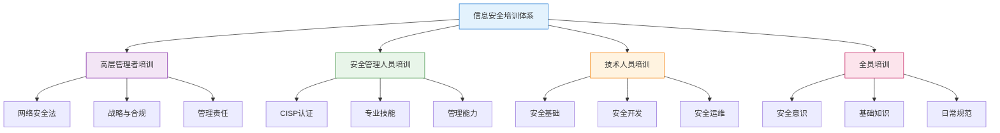
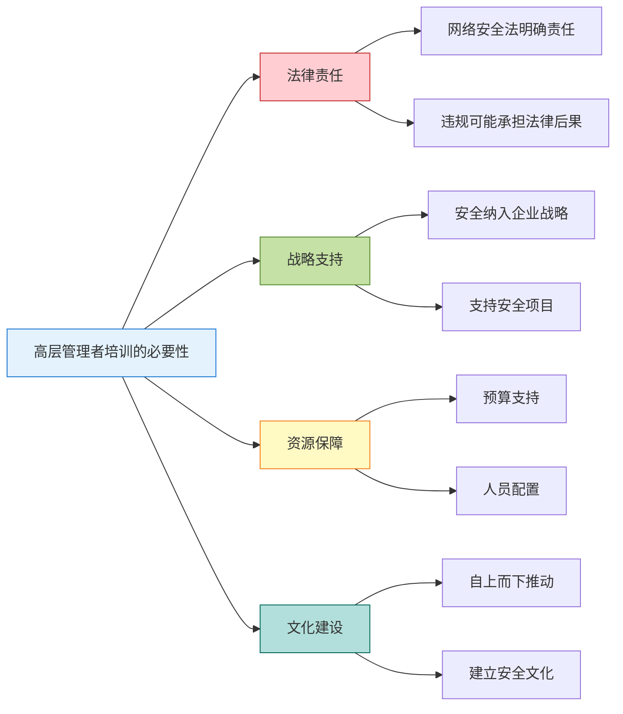

---
title: "CISP学习指南：人员安全管理"
date: 2025-10-06
categories:
  - Cybersecurity
tags:
  - CISP
excerpt: "深入解析CISP认证中的人员安全管理知识点，涵盖人员生命周期管理、离职控制和补偿性控制措施。"
lang: zh-CN
available_langs: []
permalink: /zh-CN/2025/10/CISP-Personnel-Security-Management/
thumbnail: /assets/cisp/thumbnail.png
thumbnail_80: /assets/cisp/thumbnail_80.png
series: cisp
canonical_lang: zh-CN
comments: true
---

人员安全管理是信息安全管理中最难也是最重要的环节，人既是安全的最后一道防线，也是最大的安全隐患。

## 一、人员安全管理的重要性



## 二、人员安全管理的关键环节

**完整的人员安全管理生命周期：**



**关键控制措施：**

| 阶段 | 控制措施 | 目的 |
|------|---------|------|
| 招聘前 | 背景调查（重要/敏感岗位） | 识别潜在风险 |
| 入职时 | 签署保密协议、安全培训 | 建立安全意识 |
| 在职期间 | 定期培训、权限审查 | 维持安全水平 |
| 离职时 | 清除所有逻辑访问账号 | 防止未授权访问 |
| 离职后 | 保密义务持续有效 | 保护敏感信息 |

### 2.1 招聘前：背景调查

**关键岗位识别：**

需要进行背景调查的关键岗位包括：
- 💰 财务总监、财务经理等财务关键岗位
- 🔐 信息安全管理人员
- 👨‍💻 系统管理员、数据库管理员
- 🔑 拥有特权访问权限的岗位
- 📊 接触敏感数据的岗位

**背景调查内容：**

- 📋 教育背景验证
- 💼 工作经历核实
- 🔍 犯罪记录查询
- 📞 推荐人访谈
- 💳 信用记录检查（特定岗位）

**背景调查结果处理：**

✅ **通过调查**：继续招聘流程  
❌ **发现问题**：停止招聘流程，取消应聘人员资格  
⚠️ **需要澄清**：与应聘人员沟通，必要时进行补充调查

!!!warning "⚠️ 背景调查原则"
    如果应聘者在背景调查中不符合企业要求，应立即停止招聘流程，取消应聘人员资格。不应因为其他因素而降低标准。

### 2.2 入职时：建立安全意识

**职责定义的关键因素：**

在进行人员的职责定义时，信息安全方面应重点考虑：

🎯 **人员需要履行的信息安全职责**
- 在岗位职责描述或任用条款中明确说明
- 包括日常安全操作要求
- 明确安全事件响应职责
- 规定保密义务和范围

**必须完成的工作：**

✅ 签署劳动合同及保密协议  
✅ 进行信息安全意识培训  
✅ 明确岗位安全职责  
✅ 分配工作需要的最低权限  
✅ 建立个人安全档案

!!!warning "⚠️ 入职权限分配原则"
    **正确做法：**
    - 分配工作需要的最低权限
    - 根据岗位职责授予必要访问权限
    - 遵循最小权限原则
    
    **错误做法：**
    - ❌ 允许访问企业所有的信息资产
    - ❌ 授予超出工作需要的权限
    - ❌ 未经审批直接开放全部权限

### 2.3 在职期间：持续管理

**定期工作：**

- 🎓 定期安全培训和考核
- 🔐 定期权限审查和调整
- 📊 安全意识评估
- 🔄 岗位变动时的权限更新
- 📝 安全事件记录和处理

**高风险人员识别：**

在单位中，以下人员的安全风险需要特别关注：



!!!danger "🚨 最高风险：对公司不满的员工"
    **为什么风险最大：**
    - 拥有合法的系统访问权限
    - 了解公司内部运作和安全措施
    - 有明确的动机进行恶意行为
    - 可能在离职前采取报复行动
    - 难以提前识别和防范
    
    **应对措施：**
    - 建立员工满意度监测机制
    - 及时处理员工投诉和不满
    - 对异常行为进行监控
    - 关键岗位人员离职时立即回收权限
    - 加强离职过程管理

### 2.4 离职时：关键控制点

!!!warning "⚠️ 离职管理的关键要求"
    **必须执行的操作：**
    - 🔒 清除所有逻辑访问账号
    - 🔑 回收所有物理访问凭证
    - 💾 归还所有公司资产
    - 📝 签署离职保密承诺
    - 🔍 进行离职面谈

!!!anote "💡 最佳离职管理流程"
    **保护企业知识产权和资产的最佳方法：**
    
    1️⃣ **进行离职谈话**
    - 了解离职原因
    - 强调保密义务
    - 明确离职后的责任
    
    2️⃣ **签署保密协议**
    - 明确保密范围
    - 规定违约责任
    - 法律约束力
    
    3️⃣ **禁止员工账号**
    - 立即禁用所有系统账号
    - 包括邮箱、VPN、应用系统
    - 防止未授权访问
    
    4️⃣ **更改密码**
    - 更改共享账号密码
    - 更改系统管理员密码
    - 更改敏感系统密码
    
    ⚠️ **不充分的做法：**
    - ❌ 仅进行离职谈话，不签署保密协议
    - ❌ 仅签署协议，不禁止账号
    - ❌ 仅禁止账号，不更改密码

**离职流程：**

```
离职申请
    ↓
权限清单确认
    ↓
逐项回收和清除
    ├── 系统账号
    ├── 门禁卡
    ├── 电脑设备
    ├── 移动设备
    └── 其他资产
    ↓
签署离职文件
    ↓
离职面谈
    ↓
完成离职
```

### 2.5 离职后：持续义务

**保密义务：**
- 📜 保密协议持续有效
- 🚫 竞业限制条款（如适用）
- ⚖️ 违约责任明确
- 📞 保持联系方式更新

## 三、职责分离难以实施时的应对

!!!anote "💡 补偿性控制"
    当职责分离难以实施时，企业不是无能为力，而应该考虑实施补偿性的控制措施。

**补偿性控制措施示例：**

```
场景：小型企业中，同一人员需要兼任开发和维护职责

补偿措施：
├── 加强审计：所有操作必须记录日志
├── 双人复核：关键操作需要第二人审批
├── 定期审查：定期检查操作日志和变更记录
├── 技术控制：使用自动化工具限制权限范围
└── 外部审计：定期进行独立的安全审计
```

**补偿控制的原则：**

1. **识别风险**：明确职责未分离带来的具体风险
2. **评估影响**：评估风险可能造成的影响程度
3. **设计控制**：设计针对性的补偿控制措施
4. **实施监控**：持续监控补偿措施的有效性
5. **定期评估**：定期评估是否可以实现真正的职责分离

**常见补偿控制措施：**

| 风险场景 | 补偿控制措施 |
|---------|-------------|
| 开发人员维护生产系统 | 所有变更需要审批；详细日志记录；定期审计 |
| 一人负责财务全流程 | 关键操作双人复核；银行对账；外部审计 |
| 系统管理员权限过大 | 特权账号管理；操作录屏；实时监控告警 |
| 小团队职责重叠 | 轮岗制度；交叉审查；外部独立审计 |

## 四、信息安全培训体系

### 4.1 培训体系概述

信息安全培训是人员安全管理的重要组成部分，应该建立分层次、全覆盖的培训体系。



### 4.2 分层培训计划

**完整的培训体系应包含四个层次：**

| 培训对象 | 培训内容 | 培训目标 | 培训方式 | 频率 |
|---------|---------|---------|---------|------|
| 高层管理者（一把手） | 网络安全法、战略规划、管理责任 | 提升安全意识，明确法律责任 | 专题讲座、高管研讨 | 年度 |
| 安全管理人员 | CISP认证、专业技能、管理能力 | 确保专业能力达标 | 专业培训、认证考试 | 持续 |
| 技术人员 | 安全基础、安全开发、安全运维 | 掌握安全技术和规范 | 技术培训、实操演练 | 季度 |
| 全体员工 | 安全意识、基础知识、日常规范 | 全员安全意识教育 | 在线学习、集中培训 | 年度 |

!!!anote "💡 培训体系的四大任务"
    **1. 高层管理者培训（一把手）**
    - **对象**：集团公司下属单位的总经理（一把手）
    - **内容**：网络安全法培训
    - **原因**：网络安全上升到国家安全的高度，必须得到足够重视
    - **目标**：明确法律责任，提供战略支持
    
    **2. 安全管理岗人员培训**
    - **对象**：下级单位的网络安全管理岗人员
    - **内容**：全面安全培训，建议通过CISP认证
    - **原因**：确保人员能力得到保障
    - **目标**：建立专业的安全管理团队
    
    **3. 信息化相关人员培训**
    - **对象**：网络管理员、软件开发人员
    - **内容**：安全基础培训
    - **原因**：使相关人员对网络安全有所了解
    - **目标**：在日常工作中融入安全考虑
    
    **4. 全员培训**
    - **对象**：全体员工
    - **内容**：信息安全意识及基础安全知识
    - **原因**：实现全员信息安全意识教育
    - **目标**：建立安全文化，人人参与安全

### 4.3 高层管理者培训的重要性

**为什么要培训高层管理者（一把手）：**



!!!warning "⚠️ 网络安全法的要求"
    **《中华人民共和国网络安全法》明确规定：**
    - 网络运营者应当履行网络安全保护义务
    - 关键信息基础设施运营者承担更高的安全责任
    - 违反规定可能面临行政处罚甚至刑事责任
    - 主要负责人（一把手）对网络安全负有管理责任
    
    **因此：**
    - 高层管理者必须了解网络安全法
    - 明确自身的法律责任和义务
    - 为安全工作提供必要的支持

### 4.4 CISP认证的价值

**为什么建议安全管理人员通过CISP认证：**

✅ **专业能力认证**
- 系统的知识体系
- 行业认可的资质
- 专业能力的证明

✅ **知识体系完整**
- 信息安全保障
- 信息安全技术
- 信息安全管理
- 信息安全工程
- 信息安全标准法规

✅ **实践能力提升**
- 理论与实践结合
- 案例分析能力
- 问题解决能力

### 4.5 培训效果评估

**培训效果评估方法：**

```
培训效果评估
├── 即时评估
│   ├── 培训满意度调查
│   ├── 课堂测验
│   └── 现场反馈
│
├── 短期评估
│   ├── 知识掌握测试
│   ├── 技能操作考核
│   └── 行为观察
│
└── 长期评估
    ├── 安全事件减少率
    ├── 安全意识提升度
    └── 合规性改善情况
```

**培训记录管理：**

- 📋 培训计划和大纲
- 📝 培训签到记录
- 📊 培训考核成绩
- 📄 培训证书管理
- 📈 培训效果评估报告

## 五、人员安全管理最佳实践

**建立安全文化：**

🎯 **意识培养**
- 定期安全培训
- 安全意识宣传
- 安全事件分享
- 奖惩机制

🔐 **技术支持**
- 最小权限原则
- 权限自动化管理
- 行为监控和审计
- 异常检测告警

📋 **制度保障**
- 完善的管理制度
- 清晰的流程规范
- 明确的责任划分
- 有效的监督机制

## 总结

人员安全管理的核心在于：

1. **全生命周期管理**：从招聘到离职后的完整管理
2. **重点控制离职**：离职时必须清除所有访问权限
3. **补偿性控制**：职责分离难以实施时采取补偿措施
4. **分层培训体系**：建立覆盖全员的培训计划
5. **持续性管理**：安全管理是持续的过程，不是一次性工作

!!!success "🎯 关键要点"
    - 人员安全管理是最难也是最重要的环节
    - 重要岗位入职前需要背景调查
    - 离职时必须清除所有逻辑访问账号
    - 职责分离难以实施时应采取补偿性控制措施
    - 保密义务在离职后持续有效
    - 建立分层培训体系，从高层到全员
    - 高层管理者需要接受网络安全法培训
    - 安全管理人员建议通过CISP认证

!!!tip "💡 实践建议"
    - 建立标准化的入职和离职流程
    - 使用自动化工具管理权限生命周期
    - 定期进行权限审查和清理
    - 建立离职人员权限清除检查清单
    - 保持离职人员联系方式以便必要时联系
