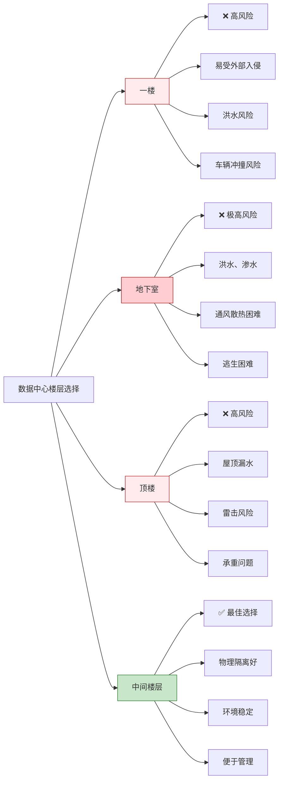
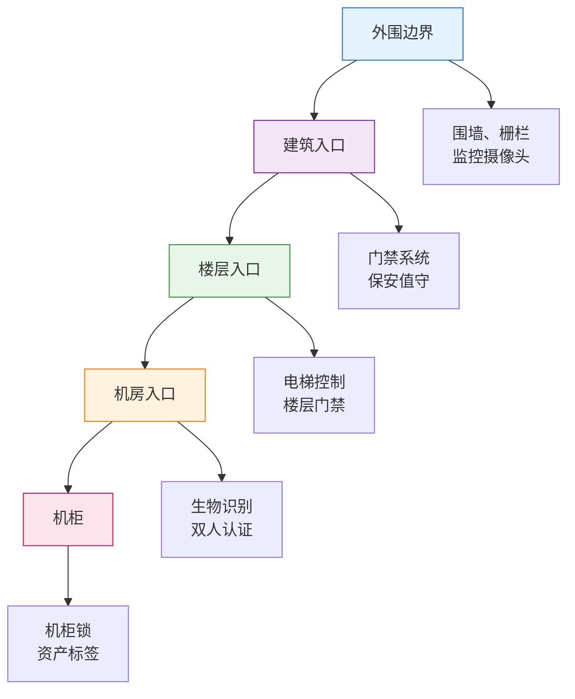
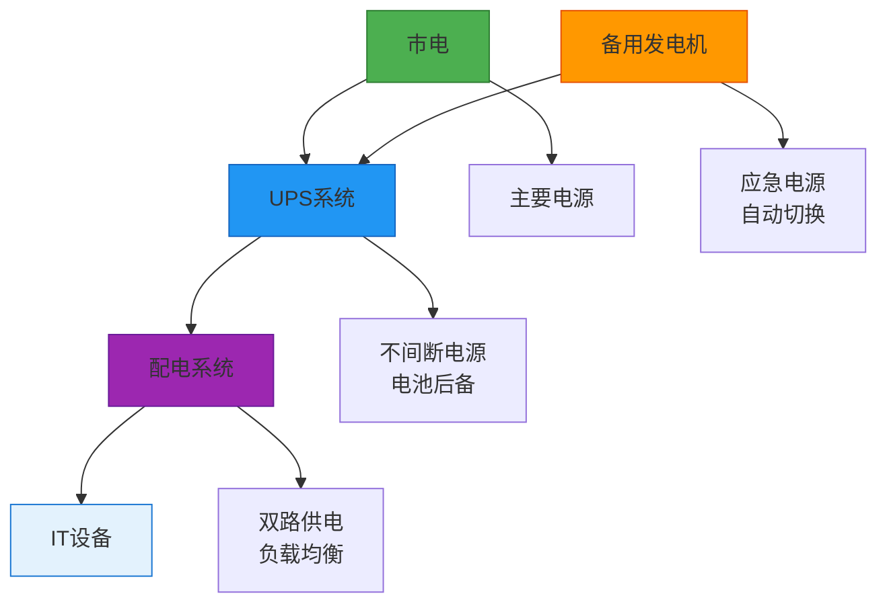
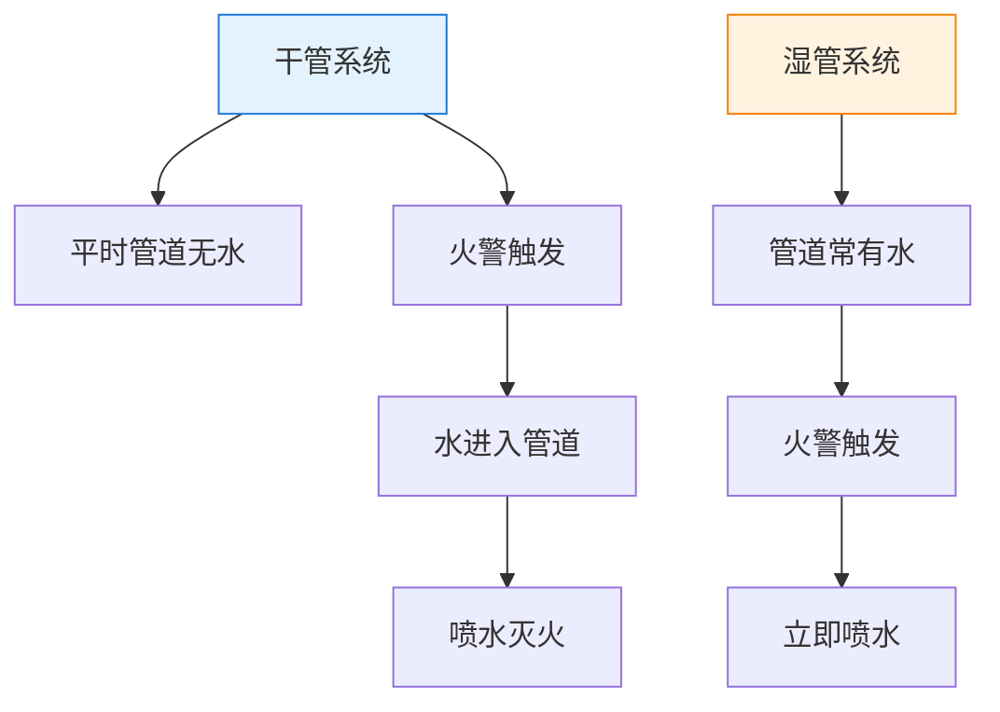

---
title: "CISP学习指南：物理与环境安全"
date: 2025-10-08
categories:
  - Cybersecurity
tags:
  - CISP
excerpt: "深入解析CISP认证中的物理与环境安全知识点，涵盖数据中心选址、物理访问控制和环境安全管理。"
lang: zh-CN
available_langs: []
permalink: /zh-CN/2025/10/CISP-Physical-Environmental-Security/
thumbnail: /assets/cisp/thumbnail.png
thumbnail_80: /assets/cisp/thumbnail_80.png
series: cisp
canonical_lang: zh-CN
---

物理与环境安全是信息安全的基础，再强大的逻辑安全措施也无法抵御物理层面的威胁。合理的物理安全设计是保护信息资产的第一道防线。

## 一、数据中心选址

### 1.1 楼层选择原则

在多层楼房中选择数据中心位置时，需要综合考虑多种安全因素。

**各楼层风险分析：**



**楼层风险对比：**

| 楼层位置 | 主要风险 | 风险等级 | 是否推荐 |
|---------|---------|---------|---------|
| 地下室 | 洪水、渗水、通风、逃生 | ⭐⭐⭐⭐⭐ 极高 | ❌ 不推荐 |
| 一楼 | 外部入侵、洪水、车辆冲撞 | ⭐⭐⭐⭐ 高 | ❌ 不推荐 |
| 顶楼 | 屋顶漏水、雷击、承重 | ⭐⭐⭐⭐ 高 | ❌ 不推荐 |
| 中间楼层 | 相对较少 | ⭐⭐ 低 | ✅ 推荐 |

!!!anote "💡 最佳选择：中间楼层"
    **为什么中间楼层最适合：**
    
    🏢 **物理隔离**
    - 上下都有楼层作为缓冲
    - 不易受外部直接攻击
    - 减少环境因素影响
    
    💧 **水患防护**
    - 避免地面洪水
    - 避免屋顶漏水
    - 减少管道渗漏影响
    
    ⚡ **环境稳定**
    - 温度相对稳定
    - 避免雷击风险
    - 承重压力适中
    
    🚪 **访问控制**
    - 便于设置多层访问控制
    - 不易被外部直接观察
    - 逃生路线充足

### 1.2 数据中心选址的其他考虑因素

**地理位置因素：**

```
选址考虑清单：
├── 自然灾害风险
│   ├── 地震带
│   ├── 洪水区
│   ├── 台风路径
│   └── 地质稳定性
├── 基础设施
│   ├── 电力供应稳定性
│   ├── 网络连接质量
│   ├── 交通便利性
│   └── 应急服务可达性
├── 周边环境
│   ├── 远离化工厂
│   ├── 远离机场（电磁干扰）
│   ├── 远离军事设施
│   └── 避开高犯罪率区域
└── 法律法规
    ├── 数据主权要求
    ├── 隐私保护法规
    └── 行业合规要求
```

## 二、物理访问控制

### 2.1 分层防护模型

数据中心应采用多层物理访问控制，形成纵深防御。



**各层控制措施：**

| 防护层 | 控制措施 | 目的 |
|--------|---------|------|
| 外围边界 | 围墙、监控、巡逻 | 阻止未授权进入园区 |
| 建筑入口 | 门禁、保安、访客登记 | 控制进入建筑物 |
| 楼层入口 | 电梯控制、楼层门禁 | 限制楼层访问 |
| 机房入口 | 生物识别、双人认证 | 严格控制机房访问 |
| 机柜 | 机柜锁、资产管理 | 保护具体设备 |

### 2.2 访问控制技术

**常用技术对比：**

| 技术类型 | 安全性 | 便利性 | 成本 | 适用场景 |
|---------|--------|--------|------|---------|
| 钥匙 | ⭐⭐ | ⭐⭐⭐ | 低 | 低安全区域 |
| 门禁卡 | ⭐⭐⭐ | ⭐⭐⭐⭐ | 中 | 一般办公区域 |
| PIN码 | ⭐⭐⭐ | ⭐⭐⭐⭐ | 低 | 辅助认证 |
| 生物识别 | ⭐⭐⭐⭐⭐ | ⭐⭐⭐⭐ | 高 | 高安全区域 |
| 双因素认证 | ⭐⭐⭐⭐⭐ | ⭐⭐⭐ | 高 | 核心机房 |

## 三、环境安全管理

### 3.1 温湿度控制

**数据中心环境要求：**


{
  "title": {
    "text": "数据中心温湿度标准范围"
  },
  "tooltip": {
    "trigger": "axis"
  },
  "legend": {
    "data": ["温度范围", "湿度范围"]
  },
  "xAxis": {
    "type": "category",
    "data": ["最低值", "推荐下限", "理想值", "推荐上限", "最高值"]
  },
  "yAxis": [
    {
      "type": "value",
      "name": "温度 (°C)",
      "min": 15,
      "max": 30
    },
    {
      "type": "value",
      "name": "湿度 (%)",
      "min": 30,
      "max": 70
    }
  ],
  "series": [
    {
      "name": "温度范围",
      "type": "line",
      "data": [18, 20, 22, 25, 27],
      "itemStyle": {"color": "#f44336"}
    },
    {
      "name": "湿度范围",
      "type": "line",
      "yAxisIndex": 1,
      "data": [40, 45, 50, 55, 60],
      "itemStyle": {"color": "#2196f3"}
    }
  ]
}


**环境参数标准：**

| 参数 | 理想值 | 可接受范围 | 超出影响 |
|------|--------|-----------|---------|
| 温度 | 22°C | 18-27°C | 设备过热或结露 |
| 湿度 | 50% | 40-60% | 静电或腐蚀 |
| 洁净度 | ISO 8级 | - | 设备故障 |
| 噪音 | <65dB | <75dB | 人员健康 |

### 3.2 电力保障

**电力系统架构：**



**电力保障措施：**

✅ **多路市电接入**：避免单点故障  
✅ **UPS系统**：提供短期电力保障  
✅ **备用发电机**：长时间停电应对  
✅ **定期测试**：确保应急系统可用  
✅ **电力监控**：实时监测电力质量

### 3.3 消防安全

**数据中心消防系统：**

| 系统类型 | 特点 | 适用场景 |
|---------|------|---------|
| 气体灭火 | 不损坏设备，环保 | 机房核心区域 |
| 水喷淋 | 成本低，效果好 | 办公区域 |
| 烟雾探测 | 早期预警 | 所有区域 |
| 温度探测 | 火灾确认 | 所有区域 |

!!!warning "⚠️ 数据中心消防特殊要求"
    **不能使用水基灭火系统的原因：**
    - 💧 水会损坏电子设备
    - ⚡ 导电，造成短路
    - 💾 破坏数据存储介质
    
    **推荐使用：**
    - ✅ 气体灭火系统（如FM-200、七氟丙烷）
    - ✅ 惰性气体系统（如IG-541）
    - ✅ 早期烟雾探测系统

## 四、物理安全监控

### 4.1 监控系统

**综合监控内容：**

```
物理安全监控系统：
├── 视频监控
│   ├── 出入口监控
│   ├── 机房内部监控
│   ├── 周界监控
│   └── 录像存储（至少90天）
├── 入侵检测
│   ├── 门磁传感器
│   ├── 红外探测器
│   ├── 玻璃破碎探测器
│   └── 震动传感器
├── 环境监控
│   ├── 温湿度监测
│   ├── 漏水检测
│   ├── 烟雾探测
│   └── 电力监测
└── 访问记录
    ├── 门禁日志
    ├── 访客记录
    ├── 异常告警
    └── 审计报告
```

### 4.2 监控数据管理

**监控数据保留要求：**

| 数据类型 | 保留期限 | 用途 |
|---------|---------|------|
| 视频录像 | 90天以上 | 事件调查、审计 |
| 门禁日志 | 1年以上 | 访问审计、合规 |
| 环境数据 | 1年以上 | 趋势分析、故障排查 |
| 告警记录 | 永久保存 | 安全分析、改进 |

## 五、物理访问控制增强

### 5.1 访问授权要求

所有进入物理安全区域的人员都需经过**授权**。

!!!anote "💡 授权是进入物理安全区域的前提"
    **关键概念：**
    
    所有进入物理安全区域的人员都需经过**授权（Authorization）**。
    
    **与其他概念的区别：**
    - ✅ **授权（Authorization）** - 正确，赋予访问权限
    - ❌ **考核** - 不准确，是能力评估
    - ❌ **批准（Approval）** - 接近但不够准确，更多指流程审批
    - ❌ **认可** - 不够正式和准确

**授权流程：**


**授权的重要性：**
- 🔐 确保只有合法人员进入
- 📊 提供完整的审计跟踪
- ⚠️ 防止未授权访问
- 🛡️ 支持事件调查

### 5.2 数据中心灭火系统选择

**最佳灭火方法：**

在数据中心灭火，**哈龙气体（Halon）** 是最有效并且环保的方法。

!!!anote "💡 哈龙气体是数据中心最佳选择"
    **为什么哈龙气体最适合数据中心：**
    
    ✅ **不损坏设备**
    - 气体灭火，不导电
    - 不会损坏电子设备
    - 灭火后无残留
    
    ✅ **灭火效果好**
    - 快速抑制火焰
    - 适用于电气火灾
    - 覆盖范围广
    
    ⚠️ **环保考虑**
    - 传统哈龙对臭氧层有影响
    - 现代替代品（如FM-200、七氟丙烷）更环保
    - 但哈龙仍是数据中心的经典选择

**灭火系统对比：**

| 灭火方式 | 对设备影响 | 灭火效果 | 环保性 | 适用性 |
|---------|-----------|---------|--------|--------|
| 哈龙气体 | ⭐⭐⭐⭐⭐ 无损 | ⭐⭐⭐⭐⭐ 优秀 | ⭐⭐⭐ 一般 | ✅ 最佳 |
| 湿管系统 | ⭐ 严重损坏 | ⭐⭐⭐⭐ 好 | ⭐⭐⭐⭐⭐ 好 | ❌ 不适用 |
| 干管系统 | ⭐⭐ 可能损坏 | ⭐⭐⭐ 一般 | ⭐⭐⭐⭐⭐ 好 | ⚠️ 次选 |
| 二氧化碳 | ⭐⭐⭐⭐ 较小 | ⭐⭐⭐⭐ 好 | ⭐⭐⭐⭐ 好 | ⚠️ 可用 |

### 5.3 干管灭火系统

**干管系统特点：**

干管灭火器系统使用水，但是只有在发现火警以后水才进入管道。



**消防系统对比：**

| 系统类型 | 管道状态 | 响应速度 | 适用场景 | 优势 |
|---------|---------|---------|---------|------|
| 干管系统 | 平时无水 | 较慢 | 数据中心 | 防止误喷、管道破裂不漏水 |
| 湿管系统 | 常有水 | 最快 | 一般建筑 | 响应迅速 |
| 气体灭火 | 无水 | 快 | 机房核心区 | 不损坏设备 |

!!!anote "💡 干管系统最适合数据中心"
    **为什么数据中心使用干管系统：**
    
    💧 **防止误喷**
    - 平时管道无水
    - 避免误触发造成损失
    - 管道破裂不会漏水
    
    ⚡ **电气安全**
    - 只在确认火警后才有水
    - 减少电气设备受损风险
    - 给予人员撤离时间
    
    🛡️ **可控性强**
    - 可以手动控制
    - 分区域控制
    - 便于维护检查

### 5.4 电源保护

**稳压电源的作用：**

在数据中心使用稳压电源，以保证硬件免受电源浪涌。

**电源问题类型：**


{
  "title": {
    "text": "电源问题对设备的影响"
  },
  "tooltip": {
    "trigger": "axis",
    "axisPointer": {
      "type": "shadow"
    }
  },
  "xAxis": {
    "type": "category",
    "data": ["浪涌", "电压波动", "断电", "谐波干扰"]
  },
  "yAxis": {
    "type": "value",
    "name": "危害程度"
  },
  "series": [{
    "type": "bar",
    "data": [
      {"value": 95, "itemStyle": {"color": "#f44336"}},
      {"value": 70, "itemStyle": {"color": "#ff9800"}},
      {"value": 100, "itemStyle": {"color": "#c62828"}},
      {"value": 60, "itemStyle": {"color": "#ffc107"}}
    ],
    "label": {
      "show": true,
      "position": "top"
    }
  }]
}


**电源保护措施：**

| 问题类型 | 保护措施 | 作用 |
|---------|---------|------|
| 浪涌 | 稳压电源、浪涌保护器 | 保护硬件免受损坏 |
| 电压波动 | 稳压电源、UPS | 提供稳定电压 |
| 断电 | UPS、发电机 | 持续供电 |
| 谐波干扰 | 滤波器、隔离变压器 | 提供纯净电源 |

### 5.5 生物识别访问控制

**物理访问控制方法对比：**

| 方法 | 安全级别 | 便利性 | 成本 | 适用场景 |
|------|---------|--------|------|----------|
| 指纹扫描器 | ⭐⭐⭐⭐⭐ 最高 | ⭐⭐⭐⭐ | 高 | 高安全区域 |
| 电子门锁 | ⭐⭐⭐⭐ | ⭐⭐⭐⭐⭐ | 中 | 一般安全区域 |
| Cipher密码锁 | ⭐⭐⭐ | ⭐⭐⭐ | 低 | 低安全区域 |
| 门锁bolting | ⭐⭐ | ⭐⭐ | 低 | 基础防护 |

!!!anote "💡 指纹扫描器提供最高安全级别"
    **为什么指纹扫描器最安全：**
    - 🔐 生物特征唯一性
    - 👤 无法转让或复制
    - 🚫 不会遗忘或丢失
    - 📊 可记录详细审计日志

### 5.6 无线安全测试

**测试办公部门无线安全的方法：**

测试无线安全最有效的方法是使用**战争驱车（War Driving）** 技术。

**无线安全测试方法：**

| 方法 | 有效性 | 说明 |
|------|--------|------|
| 战争驱车 | ⭐⭐⭐⭐⭐ | 模拟外部攻击，发现无线网络漏洞 |
| 无线扫描工具 | ⭐⭐⭐⭐ | 发现未授权接入点 |
| 渗透测试 | ⭐⭐⭐⭐⭐ | 全面评估无线安全 |
| 策略审查 | ⭐⭐⭐ | 检查配置和策略 |

!!!anote "💡 战争驱车（War Driving）"
    **什么是战争驱车：**
    - 🚗 驾车在办公区域周围
    - 📡 使用无线扫描设备
    - 🔍 发现可访问的无线网络
    - 🛡️ 评估无线信号覆盖范围
    - ⚠️ 识别安全配置问题

### 5.7 电磁泄露风险

**电磁泄露的危害：**

来自终端的电磁泄露风险存在，因为它们可以被捕获并还原。

**电磁泄露防护：**
- 🛡️ 使用电磁屏蔽设备
- 📏 保持安全距离
- 🔒 使用TEMPEST认证设备
- 📡 实施电磁干扰

### 5.8 RFID安全

**射频识别（RFID）标签风险：**

RFID标签容易受到**窃听**风险。

**原因：**
- 📡 无线电是广播式传播方式
- 🔓 信号可被远程截获
- 📶 难以控制传播范围

**防护措施：**
- 🔐 使用加密RFID标签
- 🛡️ 实施信号屏蔽
- 📏 限制读取距离
- 🔑 双因素认证

### 5.9 访客管理

**数据中心访客控制：**

对于参观者访问数据中心的最有效控制是**陪同参观**。

**访客管理措施对比：**

| 措施 | 有效性 | 说明 |
|------|--------|------|
| 陪同参观 | ⭐⭐⭐⭐⭐ 最有效 | 全程监控，实时干预 |
| 参观者佩戴证件 | ⭐⭐⭐ | 便于识别但无法防止违规 |
| 参观者签字 | ⭐⭐ | 仅有记录作用 |
| 工作人员抽样检查 | ⭐⭐ | 无法全程监控 |

!!!anote "💡 陪同参观最有效"
    **为什么陪同参观最有效：**
    
    👁️ **全程监控**
    - 实时观察访客行为
    - 及时发现异常情况
    - 防止未授权操作
    
    🚫 **即时干预**
    - 可以立即制止违规行为
    - 回答访客疑问
    - 引导访客路线
    
    📋 **责任明确**
    - 陪同人员承担监督责任
    - 便于事后追溯
    - 提供完整的访问记录

## 六、总结

物理与环境安全的核心要点：

1. **选址合理**：数据中心应选择中间楼层，避免地下室、一楼和顶楼
2. **分层防护**：实施多层物理访问控制，形成纵深防御
3. **授权管理**：所有进入物理安全区域的人员都需经过授权
4. **消防安全**：数据中心应使用哈龙气体或干管系统
5. **电源保护**：使用稳压电源保护硬件免受浪涌
6. **生物识别**：指纹扫描器提供最高级别的物理访问控制
7. **电磁防护**：防范电磁泄露风险
8. **无线安全**：定期进行无线安全测试
9. **RFID安全**：防范RFID标签窃听风险
10. **访客管理**：陪同参观是最有效的访客控制措施

!!!success "🎯 关键要点"
    - 数据中心应选择中间楼层
    - 所有人员进入物理安全区域需经过授权
    - 哈龙气体是数据中心最有效的灭火方法
    - 干管系统平时管道无水，火警后才进水
    - 稳压电源保护硬件免受电源浪涌
    - 指纹扫描器提供最高级别的访问控制
    - 电磁泄露可被捕获并还原
    - 战争驱车可测试无线安全
    - RFID标签容易受到窃听
    - 陪同参观是最有效的访客控制
  
    🚫 **主动防护**
    - 可以立即制止违规行为
    - 控制访问范围
    - 解答疑问避免误操作
    
    📋 **灵活应对**
    - 根据情况调整路线
    - 避开敏感区域
    - 处理突发情况

## 六、总结

物理与环境安全的核心在于：

1. **选址合理**：中间楼层最适合数据中心
2. **分层防护**：建立多层物理访问控制
3. **授权管理**：所有人员进入需经过授权
4. **环境控制**：维持适宜的温湿度环境
5. **电力保障**：使用稳压电源保护硬件
6. **消防安全**：干管系统最适合数据中心
7. **访问控制**：指纹扫描器提供最高安全级别
8. **访客管理**：陪同参观是最有效的控制
9. **持续监控**：实施全面的物理安全监控

!!!success "🎯 关键要点"
    - 数据中心应选择中间楼层，避开一楼、地下室和顶楼
    - 所有进入物理安全区域的人员都需经过授权
    - 干管灭火系统最适合数据中心（火警后水才进入管道）
    - 稳压电源保证硬件免受电源浪涌
    - 指纹扫描器对非授权访问提供最高级别安全
    - 电磁泄露可以被捕获并还原
    - RFID标签容易受到窃听风险
    - 陪同参观是访客访问数据中心的最有效控制
    - 采用多层物理访问控制，形成纵深防御
    - 维持适宜的温湿度环境（温度18-27°C，湿度40-60%）

!!!tip "💡 实践建议"
    - 定期进行物理安全评估
    - 测试应急系统（UPS、发电机、消防）
    - 审查访问日志，识别异常模式
    - 培训员工物理安全意识
    - 制定并演练应急预案
