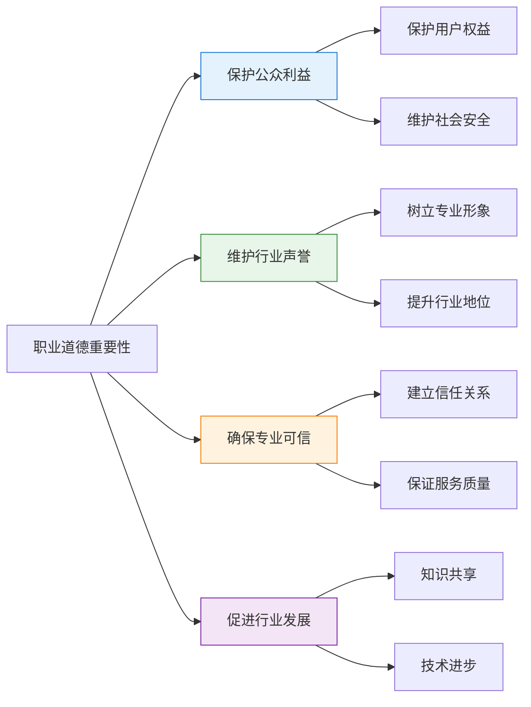
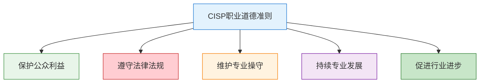
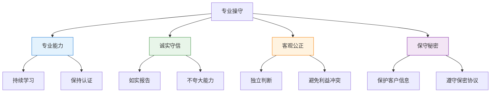

---
title: "CISP学习指南：职业道德准则"
date: 2025-10-17
categories:
  - Cybersecurity
tags:
  - CISP
excerpt: "深入解析CISP职业道德准则，涵盖信息安全从业人员的职业规范和行为准则。"
lang: zh-CN
available_langs: []
permalink: /zh-CN/2025/10/CISP-Professional-Ethics/
thumbnail: /assets/cisp/thumbnail.png
thumbnail_80: /assets/cisp/thumbnail_80.png
series: cisp
canonical_lang: zh-CN
comments: true
---

作为信息安全从业人员，遵守职业道德准则是基本要求。CISP职业道德准则规范了信息安全专业人员的行为标准和职业操守。

## 一、CISP职业道德准则概述

### 1.1 职业道德的重要性

信息安全从业人员掌握着组织的核心信息资产和安全防护能力，职业道德直接关系到信息安全的有效性和可信度。



### 1.2 职业道德准则框架

**CISP职业道德准则的核心内容：**



## 二、职业道德准则详解

### 2.1 保护公众利益

!!!anote "🛡️ 保护公众利益"
    **核心要求：**
    - 抵制通过网络系统侵犯公众合法权益
    - 保护用户隐私和数据安全
    - 维护网络空间安全
    - 促进信息安全意识

**具体行为规范：**

✅ **应该做的：**
- 🛡️ 抵制通过网络系统侵犯公众合法权益
- 🔐 保护用户个人信息和隐私
- 📢 提高公众信息安全意识
- 🚨 及时报告发现的安全威胁
- 💡 推广安全最佳实践

❌ **不应该做的：**
- 🚫 侵犯用户隐私
- 🚫 泄露用户数据
- 🚫 利用职务便利谋取私利
- 🚫 参与或协助网络攻击
- 🚫 传播虚假信息

### 2.2 遵守法律法规

!!!anote "⚖️ 遵守法律法规"
    **核心要求：**
    - 遵守国家法律法规
    - 遵守行业规范标准
    - 不从事违法活动
    - 维护网络秩序

**法律法规要求：**

| 法律法规 | 主要要求 | 违反后果 |
|---------|---------|---------|
| 网络安全法 | 保护网络安全，维护网络空间主权 | 行政处罚、刑事责任 |
| 数据安全法 | 保护数据安全，促进数据开发利用 | 行政处罚、刑事责任 |
| 个人信息保护法 | 保护个人信息权益 | 行政处罚、民事赔偿 |
| 刑法 | 禁止网络犯罪 | 刑事责任 |

**具体行为规范：**

✅ **应该做的：**
- 📋 了解和遵守相关法律法规
- 🔍 在法律框架内开展工作
- 📢 不在计算机网络系统中进行造谣、欺诈、诽谤等活动
- 🚨 发现违法行为及时报告
- 📚 持续学习法律法规更新

❌ **不应该做的：**
- 🚫 从事网络犯罪活动
- 🚫 传播非法内容
- 🚫 侵犯知识产权
- 🚫 破坏网络系统
- 🚫 窃取商业秘密

!!!warning "⚠️ 违反职业道德的行为"
    **通过公众网络传播非法软件是违反CISP职业道德准则的行为。**
    
    ❌ **为什么这是违反职业道德：**
    
    1. **违反法律法规**
       - 侵犯知识产权
       - 可能传播恶意软件
       - 违反网络安全法
    
    2. **损害公众利益**
       - 可能危害用户安全
       - 传播安全风险
       - 破坏网络秩序
    
    3. **违背专业操守**
       - 不符合专业标准
       - 损害行业声誉
       - 破坏信任关系

### 2.3 维护专业操守

!!!anote "👔 维护专业操守"
    **核心要求：**
    - 保持专业能力
    - 诚实守信
    - 客观公正
    - 保守秘密

**专业操守要求：**



**具体行为规范：**

✅ **应该做的：**
- 📚 持续学习和提升专业能力
- 🎓 保持专业认证有效性
- 📊 如实报告安全状况
- 🔐 保护客户和雇主的机密信息
- ⚖️ 客观公正地提供专业意见
- 🤝 避免利益冲突

❌ **不应该做的：**
- 🚫 夸大自己的能力和资质
- 🚫 隐瞒或歪曲安全问题
- 🚫 泄露客户机密信息
- 🚫 接受不当利益
- 🚫 在利益冲突情况下提供服务

### 2.4 持续专业发展

!!!anote "📈 持续专业发展"
    **核心要求：**
    - 持续学习新知识
    - 跟踪技术发展
    - 参与专业活动
    - 分享经验知识

**专业发展途径：**

```
专业发展途径：
├── 正式教育
│   ├── 学历教育
│   ├── 专业培训
│   └── 认证考试
├── 自主学习
│   ├── 阅读专业书籍
│   ├── 在线课程
│   └── 技术文档
├── 实践经验
│   ├── 项目实践
│   ├── 安全测试
│   └── 事件响应
└── 交流分享
    ├── 技术会议
    ├── 专业论坛
    └── 知识分享
```

**具体行为规范：**

✅ **应该做的：**
- 📚 定期参加专业培训
- 🎓 保持和更新专业认证
- 📖 阅读最新技术文献
- 🤝 参与专业社区活动
- 💡 分享经验和知识
- 🔍 关注安全威胁动态

### 2.5 促进行业进步

!!!anote "🚀 促进行业进步"
    **核心要求：**
    - 帮助和指导同行
    - 推动技术创新
    - 参与标准制定
    - 提升行业水平

**具体行为规范：**

✅ **应该做的：**
- 🤝 帮助和指导信息安全同行提升信息安全保障知识和能力
- 💡 分享安全最佳实践
- 📢 参与安全意识宣传
- 📋 参与标准和规范制定
- 🔬 推动安全技术创新
- 🌐 促进国际交流合作

❌ **不应该做的：**
- 🚫 恶意竞争
- 🚫 诋毁同行
- 🚫 垄断技术知识
- 🚫 阻碍行业发展

## 三、职业道德准则对比分析

### 3.1 符合职业道德的行为

**正确的职业行为：**

| 行为 | 说明 | 符合准则 |
|------|------|---------|
| 抵制侵犯公众权益 | 保护公众利益 | ✅ 保护公众利益 |
| 不进行造谣欺诈 | 遵守法律法规 | ✅ 遵守法律法规 |
| 帮助指导同行 | 促进行业进步 | ✅ 促进行业进步 |
| 保护用户隐私 | 维护专业操守 | ✅ 维护专业操守 |
| 持续学习提升 | 专业发展 | ✅ 持续专业发展 |

### 3.2 违反职业道德的行为

**错误的职业行为：**

| 行为 | 违反准则 | 后果 |
|------|---------|------|
| 传播非法软件 | 违反法律法规 | 法律责任、吊销认证 |
| 侵犯用户隐私 | 损害公众利益 | 法律责任、失去信任 |
| 泄露客户机密 | 违背专业操守 | 法律责任、职业禁入 |
| 参与网络攻击 | 违反法律法规 | 刑事责任 |
| 传播虚假信息 | 违反法律法规 | 行政处罚 |

!!!danger "🚨 严重违反职业道德的行为"
    **以下行为严重违反CISP职业道德准则：**
    
    1. **通过公众网络传播非法软件**
       - 违反知识产权法
       - 可能传播恶意软件
       - 危害网络安全
    
    2. **利用职务便利进行网络攻击**
       - 违反网络安全法
       - 滥用专业知识
       - 严重损害公众利益
    
    3. **泄露客户或雇主的机密信息**
       - 违反保密义务
       - 损害客户利益
       - 破坏信任关系
    
    4. **参与或协助网络犯罪活动**
       - 违反刑法
       - 危害社会安全
       - 损害行业声誉

## 四、职业道德案例分析

### 4.1 案例一：软件传播

**场景：**
某CISP持证人员在公众网络上分享破解版安全工具。

**分析：**
- ❌ 违反知识产权法
- ❌ 传播非法软件
- ❌ 违反职业道德准则
- ❌ 可能传播恶意软件

**正确做法：**
- ✅ 使用和推荐合法软件
- ✅ 尊重知识产权
- ✅ 引导用户使用正版软件

### 4.2 案例二：漏洞披露

**场景：**
发现某系统存在严重安全漏洞。

**正确做法：**
- ✅ 负责任地披露漏洞
- ✅ 先通知厂商
- ✅ 给予合理修复时间
- ✅ 保护用户安全

**错误做法：**
- ❌ 公开披露未修复的漏洞
- ❌ 利用漏洞谋取私利
- ❌ 出售漏洞信息

### 4.3 案例三：客户信息

**场景：**
在为客户提供安全服务时获取了敏感信息。

**正确做法：**
- ✅ 严格保密客户信息
- ✅ 仅在授权范围内使用
- ✅ 遵守保密协议
- ✅ 安全处理和销毁信息

**错误做法：**
- ❌ 泄露客户信息
- ❌ 用于其他目的
- ❌ 与他人分享

## 五、职业道德的执行和监督

### 5.1 自律机制

**个人自律：**
- 📋 定期自我审查
- 🎓 持续学习职业道德
- 🤝 接受同行监督
- 📢 主动报告违规行为

### 5.2 行业监督

**监督机制：**
- 🏢 认证机构监督
- 👥 同行评议
- 📋 投诉处理
- ⚖️ 纪律处分

### 5.3 违规处理

**处理措施：**

| 违规程度 | 处理措施 | 示例 |
|---------|---------|------|
| 轻微违规 | 警告、教育 | 未及时更新知识 |
| 一般违规 | 暂停认证 | 夸大能力 |
| 严重违规 | 吊销认证 | 泄露机密 |
| 违法犯罪 | 法律追究 | 网络攻击 |

## 六、总结

CISP职业道德准则的核心要点：

1. **保护公众利益**：抵制侵犯公众权益的行为
2. **遵守法律法规**：不从事违法活动
3. **维护专业操守**：诚实守信、客观公正
4. **持续专业发展**：不断学习提升
5. **促进行业进步**：帮助指导同行

!!!success "🎯 关键要点"
    - 职业道德是信息安全从业人员的基本要求
    - 抵制侵犯公众权益的行为
    - 不在网络中进行造谣、欺诈、诽谤等活动
    - 通过公众网络传播非法软件违反职业道德
    - 帮助和指导同行提升能力
    - 保护客户和雇主的机密信息
    - 持续学习和专业发展

!!!tip "💡 实践建议"
    - 定期学习职业道德准则
    - 在工作中严格遵守职业规范
    - 保护客户和用户的合法权益
    - 使用和推广合法软件
    - 负责任地披露安全漏洞
    - 积极参与行业交流和知识分享
    - 接受同行监督和自我审查
