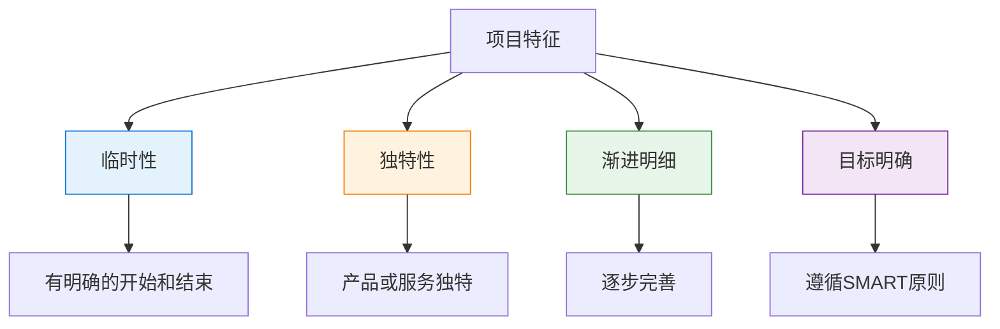

---
title: "CISP学习指南：项目管理基础"
date: 2025-10-21
categories:
  - Cybersecurity
tags:
  - CISP
excerpt: "深入解析CISP认证中的项目管理基础知识，包括项目定义、特征和SMART原则。"
lang: zh-CN
available_langs: []
permalink: /zh-CN/2025/10/CISP-Project-Management-Basics/
thumbnail: /assets/cisp/thumbnail.png
thumbnail_80: /assets/cisp/thumbnail_80.png
series: cisp
canonical_lang: zh-CN
comments: true
---

项目管理是信息安全项目实施的重要基础，理解项目的基本概念和管理原则对于成功实施安全项目至关重要。

## 一、项目的定义

### 1.1 项目的含义

!!!anote "📋 项目的定义"
    **项目是：**
    - 为达到特定目的
    - 使用一定资源
    - 在确定的期间内
    - 为特定发起人
    - 提供独特的产品、服务或成果
    - 进行的一次性努力

**项目的关键要素：**

```
项目的关键要素：
├── 目的性
│   └── 有明确的目标和预期成果
├── 资源约束
│   └── 人力、资金、物资等资源有限
├── 时间约束
│   └── 有明确的开始和结束时间
├── 独特性
│   └── 产品或服务具有独特性
└── 一次性
    └── 不是重复性的日常运营
```

## 二、项目的特征

### 2.1 项目的四大特征

**项目的关键特征：**



**特征详解：**

| 特征 | 说明 | 示例 |
|------|------|------|
| 临时性 | 有明确的开始和结束日期 | 信息安全系统建设项目：2024年1月-6月 |
| 独特性 | 产品或服务具有独特性 | 为特定企业定制的安全解决方案 |
| 渐进明细 | 随着项目推进逐步完善 | 需求分析→设计→开发→测试→部署 |
| 目标明确 | 遵循SMART原则 | 3个月内实施多因素认证系统 |

## 三、项目理解的常见错误

### 3.1 关于项目的理解分析

**关于项目的理解：**

| 说法 | 正确性 | 说明 |
|------|--------|------|
| A. 项目是一次性努力 | ✅ 正确 | 项目有明确的开始和结束 |
| B. 结束日期随机确定 | ❌ 错误 | 结束日期应在规划时确定 |
| C. 项目资源指人财物 | ✅ 正确 | 包括人力、资金、物资等 |
| D. 目标遵守SMART原则 | ✅ 正确 | 具体、可测量、一致同意、现实、有时限 |

### 3.2 项目时间管理的关键原则

!!!warning "⚠️ 项目结束日期的确定"
    **项目时间管理的核心原则：**
    - 项目有明确的开始日期和结束日期
    - 结束日期应在项目规划阶段确定
    - 结束日期不是随机决定的
    - 项目管理强调计划性和可预测性
    
    **时间调整的正确方式：**
    - 可能根据实际情况进行调整
    - 调整应基于科学的评估
    - 需要变更管理流程
    - 需要相关方批准

## 四、SMART原则

### 4.1 SMART原则概述

**项目目标的SMART原则：**

```
SMART原则：
├── S - Specific（具体的）
│   └── 目标要明确具体，不能模糊
├── M - Measurable（可测量的）
│   └── 目标要可以量化和评估
├── A - Agree to（一致同意的）
│   └── 相关方对目标达成一致
├── R - Realistic（现实的）
│   └── 目标要切实可行
└── T - Time-oriented（有时限的）
    └── 目标要有明确的时间期限
```

### 4.2 SMART原则详解

**SMART各要素说明：**

| 原则 | 英文 | 含义 | 关键问题 |
|------|------|------|---------|
| S | Specific | 具体的 | 目标是否明确具体？ |
| M | Measurable | 可测量的 | 如何衡量目标达成？ |
| A | Agree to | 一致同意的 | 相关方是否同意？ |
| R | Realistic | 现实的 | 目标是否可实现？ |
| T | Time-oriented | 有时限的 | 何时完成目标？ |

### 4.3 SMART原则应用示例

**SMART原则示例：**

| 原则 | 不好的目标 | 好的目标 |
|------|-----------|---------|
| Specific | 提高系统安全性 | 实施多因素认证系统 |
| Measurable | 减少安全事件 | 将安全事件减少30% |
| Agree to | 单方面决定 | 与相关部门协商一致 |
| Realistic | 100%防止所有攻击 | 防止90%的已知攻击 |
| Time-oriented | 尽快完成 | 3个月内完成 |

**信息安全项目目标示例：**

```
不符合SMART的目标：
"提高公司的信息安全水平"

符合SMART的目标：
"在2024年6月30日前，为公司所有员工（500人）部署多因素认证系统，
使账户被盗用事件减少80%，项目预算不超过50万元，
经IT部门、安全部门和人力资源部门共同评审通过。"

分析：
├── S - Specific：部署多因素认证系统
├── M - Measurable：账户被盗用事件减少80%
├── A - Agree to：经三个部门共同评审通过
├── R - Realistic：预算50万元，技术可行
└── T - Time-oriented：2024年6月30日前完成
```

## 五、项目管理在信息安全中的应用

### 5.1 信息安全项目特点

**信息安全项目的特殊性：**

```
信息安全项目特点：
├── 技术复杂性高
│   └── 涉及多种安全技术和产品
├── 风险管理要求高
│   └── 需要识别和控制安全风险
├── 合规性要求
│   └── 需符合法律法规和标准
├── 持续性要求
│   └── 安全是持续的过程
└── 跨部门协作
    └── 需要多部门配合
```

### 5.2 信息安全项目管理要点

**关键管理要点：**

| 管理领域 | 要点 | 说明 |
|---------|------|------|
| 范围管理 | 明确项目边界 | 定义清晰的项目范围 |
| 时间管理 | 制定合理进度 | 考虑安全测试时间 |
| 成本管理 | 控制项目预算 | 包括软硬件和人力成本 |
| 质量管理 | 确保安全质量 | 进行安全测试和验收 |
| 风险管理 | 识别和控制风险 | 制定风险应对措施 |
| 沟通管理 | 保持有效沟通 | 定期汇报项目进展 |

## 六、总结

项目管理基础的核心要点：

!!!success "🎯 关键要点"
    **项目基本概念：**
    - 项目是为达到特定目的进行的一次性努力
    - 项目具有临时性、独特性、渐进明细和目标明确四大特征
    - 项目资源包括人力、资金、物资等
    
    **项目时间管理：**
    - 项目有明确的开始和结束日期
    - 结束日期应在规划时确定，不是随机决定
    - 时间调整需要科学评估和变更管理
    
    **项目目标管理：**
    - 项目目标应遵循SMART原则
    - 具体、可测量、一致同意、现实、有时限

!!!tip "💡 实践建议"
    - 项目启动前明确项目目标和范围
    - 制定符合SMART原则的项目目标
    - 在规划阶段确定项目时间表
    - 识别和管理项目风险
    - 保持与相关方的有效沟通
    - 定期监控项目进度和质量
    - 根据实际情况科学调整计划
