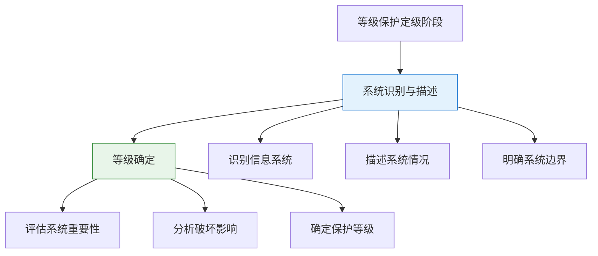
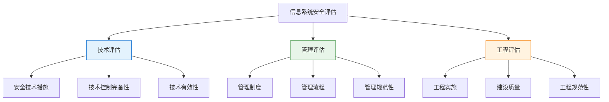
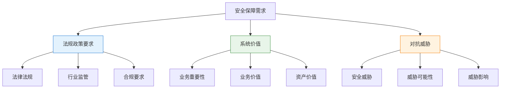
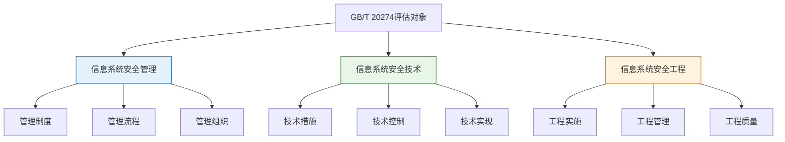
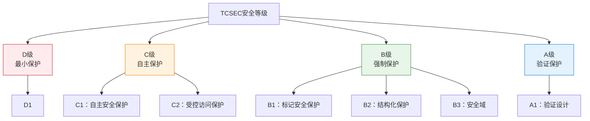
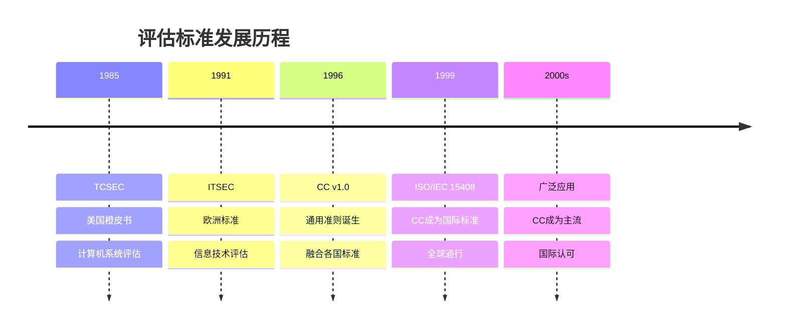
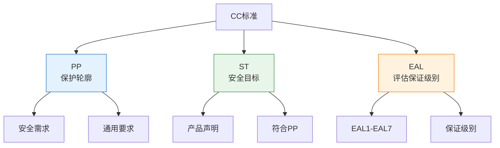

---
title: "CISP学习指南：安全评估与审计"
date: 2025-10-14
categories:
  - Cybersecurity
tags:
  - CISP
excerpt: "深入解析等级保护定级、信息系统安全评估框架、国际评估标准TCSEC和CC标准。"
lang: zh-CN
available_langs: []
permalink: /zh-CN/2025/10/CISP-Security-Assessment-Audit/
thumbnail: /assets/cisp/thumbnail.png
thumbnail_80: /assets/cisp/thumbnail_80.png
series: cisp
canonical_lang: zh-CN
---

## 一、等级保护定级

### 1.1 等级保护定级步骤

等级保护定级是信息系统安全保护的基础工作，需要按照规范的步骤进行。

!!!anote "💡 定级阶段的两个核心步骤"
    等级保护定级阶段主要包括：
    
    1. **系统识别与描述**
       - 识别需要定级的信息系统
       - 描述系统的基本情况
       - 明确系统边界和范围
    
    2. **等级确定**
       - 根据系统重要性确定安全等级
       - 考虑系统遭到破坏后的影响
       - 确定最终的保护等级



### 1.2 定级步骤详解

**系统识别与描述阶段：**

| 活动 | 内容 | 输出 |
|------|------|------|
| 系统识别 | 识别组织内需要定级的信息系统 | 系统清单 |
| 系统描述 | 描述系统功能、业务、数据等 | 系统描述文档 |
| 边界确定 | 明确系统的物理和逻辑边界 | 系统边界说明 |

**等级确定阶段：**

| 活动 | 内容 | 依据 |
|------|------|------|
| 重要性评估 | 评估系统对组织的重要程度 | 业务重要性 |
| 影响分析 | 分析系统遭破坏后的影响范围 | 损害程度 |
| 等级确定 | 根据评估结果确定保护等级 | 定级指南 |

!!!tip "💡 定级步骤的完整性"
    **定级阶段必须包含的两个步骤：**
    
    ✅ **完整的定级步骤：**
    - 系统识别与描述
    - 等级确定
    
    **不完整的步骤组合：**
    - "系统描述、等级确定" - 缺少"系统识别"
    - "系统识别、系统描述" - 缺少"等级确定"
    - "系统识别与描述、等级分级" - "等级分级"表述不准确


## 二、信息系统安全评估

### 2.1 安全评估的三个方面

根据信息系统安全保障评估框架，信息系统安全评估主要从三个方面进行。

!!!anote "💡 安全评估的三个维度"
    信息系统安全评估主要从以下三个方面进行：
    
    1. **技术**
       - 安全技术措施的有效性
       - 技术控制的完备性
    
    2. **管理**
       - 安全管理制度的完善性
       - 管理流程的规范性
    
    3. **工程**
       - 安全工程实施的规范性
       - 工程建设的质量



### 2.2 三个方面的评估内容

**技术评估：**

| 评估项 | 内容 | 示例 |
|--------|------|------|
| 访问控制 | 身份认证、权限管理 | 密码策略、访问控制列表 |
| 安全审计 | 日志记录、审计分析 | 审计日志、安全事件记录 |
| 通信安全 | 数据加密、传输保护 | SSL/TLS、VPN |
| 边界防护 | 防火墙、入侵检测 | 防火墙规则、IDS/IPS |

**管理评估：**

| 评估项 | 内容 | 示例 |
|--------|------|------|
| 安全策略 | 安全方针、管理制度 | 信息安全政策文件 |
| 组织管理 | 安全组织、岗位职责 | 安全管理部门设置 |
| 人员管理 | 人员安全、培训教育 | 安全意识培训记录 |
| 运维管理 | 日常运维、变更管理 | 运维操作规程 |

**工程评估：**

| 评估项 | 内容 | 示例 |
|--------|------|------|
| 工程实施 | 安全工程建设过程 | 工程实施方案 |
| 测试验收 | 安全测试、验收标准 | 测试报告、验收文档 |
| 系统交付 | 交付文档、培训 | 系统文档、用户手册 |
| 应急响应 | 应急预案、演练 | 应急响应计划 |

!!!tip "💡 评估方面的完整性"
    **信息系统安全评估的三个方面：**
    
    ✅ **完整的评估体系：**
    - 技术
    - 管理
    - 工程
    
    **不完整或不准确的组合：**
    - "1个（技术）" - 过于片面
    - "2个（技术、管理）" - 缺少工程方面
    - "4个（技术、管理、工程、应用）" - 应用不是独立评估方面


## 三、安全保障需求因素

### 3.1 GB/T 20274评估框架

根据信息系统安全保障评估框架（GB/T 20274），确定安全保障需求时需要考虑多个因素。

!!!anote "💡 安全保障需求考虑因素"
    确定安全保障需求需要考虑：
    
    1. **法规政策的要求**
       - 国家法律法规
       - 行业监管要求
       - 合规性要求
    
    2. **系统的价值**
       - 系统对组织的重要性
       - 系统承载的业务价值
       - 数据资产价值
    
    3. **系统要对抗的威胁**
       - 面临的安全威胁
       - 威胁发生的可能性
       - 威胁造成的影响



### 3.2 需求因素详解

**法规政策要求：**

| 类型 | 内容 | 示例 |
|------|------|------|
| 法律法规 | 国家法律、行政法规 | 网络安全法、数据安全法 |
| 行业标准 | 行业监管要求 | 金融行业安全标准 |
| 等级保护 | 等级保护要求 | 等级保护基本要求 |

**系统价值评估：**

| 维度 | 评估内容 | 影响 |
|------|---------|------|
| 业务重要性 | 系统对业务的支撑程度 | 决定保护级别 |
| 数据价值 | 数据的敏感性和重要性 | 决定保护强度 |
| 影响范围 | 系统故障的影响范围 | 决定保护措施 |

**威胁对抗分析：**

| 威胁类型 | 描述 | 对抗措施 |
|---------|------|---------|
| 外部攻击 | 黑客攻击、恶意代码 | 边界防护、入侵检测 |
| 内部威胁 | 内部人员违规操作 | 访问控制、审计监控 |
| 自然灾害 | 火灾、地震等 | 物理防护、备份恢复 |

!!!tip "💡 需求因素的范围"
    **确定安全保障需求时考虑的因素：**
    
    ✅ **应考虑的因素：**
    - 法规政策的要求
    - 系统的价值
    - 系统要对抗的威胁
    
    **不属于主要考虑因素：**
    - 系统的技术构成（如使用何种技术、架构等）

### 3.3 GB/T 20274评估对象

根据国家标准GB/T 20274《信息系统安全保障评估框架》，在信息系统安全目标中，评估对象包括特定的内容。

!!!anote "💡 评估对象的三个方面"
    评估对象包括：
    
    1. **信息系统安全管理**
       - 安全管理制度
       - 安全管理流程
       - 安全管理组织
    
    2. **信息系统安全技术**
       - 技术措施
       - 技术控制
       - 技术实现
    
    3. **信息系统安全工程**
       - 工程实施
       - 工程管理
       - 工程质量



**评估对象的准确理解：**

| 描述 | 准确性 | 说明 |
|------|--------|------|
| 信息系统安全管理、信息系统安全技术和信息系统安全工程 | ✅ 准确 | GB/T 20274标准的评估对象 |
| 信息系统管理体系、技术体系、业务体系 | 不准确 | 业务体系不是评估对象 |
| 信息系统整体、信息系统安全管理、信息系统安全技术和信息系统安全工程 | 不准确 | "信息系统整体"过于宽泛 |
| 信息系统组织机构、管理制度、资产 | 不准确 | 这些是管理方面的具体内容，不是评估对象分类 |

!!!tip "💡 记忆要点"
    GB/T 20274评估对象：**管理、技术、工程**三个方面
    - 不包括"信息系统整体"
    - 不包括"业务体系"
    - 不是具体的管理内容（如组织机构、制度、资产）


## 四、TCSEC安全等级

### 4.1 TCSEC简介

TCSEC（Trusted Computer System Evaluation Criteria，可信计算机系统评估准则）是美国国防部于1985年公布的计算机系统安全评估标准，也被称为"橙皮书"。

!!!anote "💡 TCSEC的四个安全等级"
    TCSEC把计算机系统的安全分为**4个大的等级**：
    
    1. **D级：最小保护级**
       - 最低级别的安全保护
    
    2. **C级：自主保护级**
       - C1：自主安全保护
       - C2：受控的访问保护
    
    3. **B级：强制保护级**
       - B1：标记安全保护
       - B2：结构化保护
       - B3：安全域
    
    4. **A级：验证保护级**
       - A1：验证设计
       - 最高级别的安全保护



### 4.2 TCSEC等级详解

**四个大等级的特点：**

| 等级 | 名称 | 子级 | 主要特征 | 安全机制 |
|------|------|------|---------|---------|
| D | 最小保护 | D1 | 最低安全级别 | 无安全保护 |
| C | 自主保护 | C1, C2 | 自主访问控制 | DAC（自主访问控制） |
| B | 强制保护 | B1, B2, B3 | 强制访问控制 | MAC（强制访问控制） |
| A | 验证保护 | A1 | 形式化验证 | 形式化方法验证 |

**等级递进关系：**

```
安全性从低到高：
D → C1 → C2 → B1 → B2 → B3 → A1

D级：最低安全
C级：引入自主访问控制（DAC）
B级：引入强制访问控制（MAC）
A级：形式化验证，最高安全
```

### 4.3 各等级的安全要求

**D级（最小保护）：**
- 不满足更高级别要求的系统
- 基本无安全保护措施

**C级（自主保护）：**
- C1：用户与数据分离，自主访问控制
- C2：更细粒度的访问控制，审计功能

**B级（强制保护）：**
- B1：引入安全标记，强制访问控制
- B2：结构化设计，形式化安全策略模型
- B3：安全域划分，可信路径

**A级（验证保护）：**
- A1：形式化设计规范和验证
- 最高级别的安全保证

!!!tip "💡 TCSEC等级数量"
    **TCSEC安全等级的正确理解：**
    
    ✅ **4个大等级：D、C、B、A**
    
    **等级数量的常见误解：**
    - 3个 - 不正确
    - 5个 - 不正确
    - 6个 - 不正确

!!!tip "💡 记忆技巧"
    **TCSEC四大等级：D-C-B-A**
    - D：Discretionary（最小）
    - C：Controlled（自主）
    - B：Mandatory（强制）
    - A：Verified（验证）


## 五、国际通行评估标准

### 5.1 主要评估标准对比

信息技术产品安全性评估经历了多个标准的发展，目前国际通行的标准是CC（Common Criteria）。

!!!anote "💡 主要评估标准"
    **四大评估标准：**
    
    1. **TCSEC**（美国）
       - Trusted Computer System Evaluation Criteria
       - 可信计算机系统评估准则
       - 1985年发布，"橙皮书"
    
    2. **ITSEC**（欧洲）
       - Information Technology Security Evaluation Criteria
       - 信息技术安全评估准则
       - 1991年发布
    
    3. **CC**（国际）
       - Common Criteria
       - 通用准则
       - 1999年成为ISO/IEC 15408国际标准
       - **目前国际通行标准**
    
    4. **IATF**（美国）
       - Information Assurance Technical Framework
       - 信息保障技术框架
       - 用于信息保障体系建设



### 5.2 各标准特点对比

**标准对比表：**

| 标准 | 发布时间 | 发布方 | 主要特点 | 当前状态 |
|------|---------|--------|---------|---------|
| TCSEC | 1985 | 美国国防部 | 面向计算机系统，等级制 | 历史标准 |
| ITSEC | 1991 | 欧洲四国 | 功能与保证分离 | 已被CC取代 |
| CC | 1996/1999 | 国际组织 | 灵活、通用、国际化 | **当前通行标准** |
| IATF | 1998 | 美国NSA | 信息保障框架 | 特定领域使用 |

### 5.3 CC标准详解

**CC标准的核心概念：**

!!!anote "💡 CC标准三要素"
    1. **PP（Protection Profile）**
       - 保护轮廓
       - 描述安全需求
    
    2. **ST（Security Target）**
       - 安全目标
       - 具体产品的安全声明
    
    3. **EAL（Evaluation Assurance Level）**
       - 评估保证级别
       - 从EAL1到EAL7，共7个级别



**CC标准的EAL级别：**

| 级别 | 名称 | 描述 | 适用场景 |
|------|------|------|---------|
| EAL1 | 功能测试 | 基本测试 | 低风险环境 |
| EAL2 | 结构测试 | 结构化测试 | 一般商业应用 |
| EAL3 | 方法测试和检查 | 系统化测试 | 中等安全需求 |
| EAL4 | 方法设计、测试和评审 | 详细设计评审 | 商业安全产品 |
| EAL5 | 半形式化设计和测试 | 半形式化方法 | 高安全需求 |
| EAL6 | 半形式化验证设计和测试 | 半形式化验证 | 高风险环境 |
| EAL7 | 形式化验证设计和测试 | 完全形式化 | 极高安全需求 |

### 5.4 为什么CC是国际通行标准

!!!success "🎯 CC标准的优势"
    **CC成为国际通行标准的原因：**
    
    1. **国际化**
       - 融合了TCSEC、ITSEC等标准的优点
       - 得到国际广泛认可
    
    2. **灵活性**
       - 不限定特定的安全功能
       - 可适应不同类型的产品
    
    3. **通用性**
       - 适用于各类IT产品和系统
       - 不局限于特定领域
    
    4. **标准化**
       - ISO/IEC 15408国际标准
       - 全球统一的评估准则
    
    5. **互认机制**
       - CCRA（CC Recognition Arrangement）
       - 各国评估结果互认

**CC标准的应用范围：**

| 产品类型 | 应用示例 | 评估级别 |
|---------|---------|---------|
| 操作系统 | Windows, Linux | EAL4+ |
| 数据库 | Oracle, SQL Server | EAL4 |
| 防火墙 | 网络防火墙产品 | EAL4 |
| 智能卡 | 银行卡、身份卡 | EAL5+ |
| 加密设备 | 加密机、密码卡 | EAL4+ |

!!!tip "💡 国际通行评估标准"
    **信息技术产品安全性评估标准的现状：**
    
    ✅ **CC（Common Criteria）**
    - 目前国际通行标准
    - ISO/IEC 15408国际标准
    - 全球广泛认可和使用
    
    **其他标准的状态：**
    - TCSEC - 历史标准，主要用于美国
    - ITSEC - 已被CC取代
    - IATF - 信息保障框架，不是产品评估标准


## 六、总结

### 6.1 关键知识点回顾

!!!success "🎯 核心要点总结"
    **等级保护定级：**
    - 定级阶段包括两个步骤：系统识别与描述、等级确定
    - 先识别和描述系统，再确定保护等级
    - 不能跳过任何一个步骤
    
    **信息系统安全评估：**
    - 从三个方面进行评估：技术、管理、工程
    - 三个方面缺一不可，构成完整的评估体系
    - 不是单纯的技术评估，也不包括"应用"作为独立方面
    
    **安全保障需求：**
    - 考虑三个因素：法规政策要求、系统价值、对抗威胁
    - 不考虑系统的技术构成
    - GB/T 20274评估对象：安全管理、安全技术、安全工程
    
    **TCSEC标准：**
    - 美国橙皮书，1985年发布
    - 分为4个大等级：D、C、B、A
    - 从低到高：最小保护→自主保护→强制保护→验证保护
    
    **国际评估标准：**
    - CC（Common Criteria）是目前国际通行标准
    - 1999年成为ISO/IEC 15408国际标准
    - 取代了TCSEC和ITSEC
    - 具有灵活性、通用性、国际化特点

### 6.2 知识点对比表

**评估标准演进：**

| 时期 | 标准 | 特点 | 状态 |
|------|------|------|------|
| 1985-1990 | TCSEC | 美国橙皮书，计算机系统评估 | 历史标准 |
| 1991-1999 | ITSEC | 欧洲标准，功能与保证分离 | 已被取代 |
| 1999-至今 | CC | 国际标准，灵活通用 | **当前通行** |

**评估维度对比：**

| 评估框架 | 评估维度 | 数量 | 说明 |
|---------|---------|------|------|
| 信息系统安全评估 | 技术、管理、工程 | 3个 | 全面评估 |
| GB/T 20274评估对象 | 安全管理、安全技术、安全工程 | 3个 | 评估对象 |
| 安全保障需求因素 | 法规政策、系统价值、对抗威胁 | 3个 | 需求分析 |

### 6.3 考试要点

!!!tip "💡 考试重点"
    **必须记住的数字：**
    - 等级保护定级：**2个步骤**（系统识别与描述、等级确定）
    - 安全评估方面：**3个**（技术、管理、工程）
    - 安全保障需求因素：**3个**（法规政策、系统价值、对抗威胁）
    - TCSEC安全等级：**4个大等级**（D、C、B、A）
    - CC标准EAL级别：**7个级别**（EAL1-EAL7）
    
    **必须记住的标准：**
    - 国际通行评估标准：**CC（Common Criteria）**
    - 不是TCSEC、不是ITSEC、不是IATF
    
    **必须记住的框架：**
    - GB/T 20274评估对象：安全管理、安全技术、安全工程
    - 不包括"信息系统整体"、"业务体系"
    
    **必须记住的排除项：**
    - 安全保障需求**不考虑**：系统的技术构成
    - 评估对象**不包括**：业务体系、信息系统整体

### 6.4 实践应用

!!!example "📋 实际应用场景"
    **场景1：信息系统定级**
    ```
    步骤1：系统识别与描述
    - 识别需要定级的系统
    - 描述系统功能、业务、数据
    - 明确系统边界
    
    步骤2：等级确定
    - 评估系统重要性
    - 分析破坏后的影响
    - 确定保护等级（1-5级）
    ```
    
    **场景2：安全评估实施**
    ```
    技术评估：
    - 访问控制、加密、审计等技术措施
    
    管理评估：
    - 安全策略、组织管理、人员管理
    
    工程评估：
    - 工程实施、测试验收、应急响应
    ```
    
    **场景3：产品安全认证**
    ```
    选择CC标准进行评估：
    1. 编写PP（保护轮廓）
    2. 编写ST（安全目标）
    3. 选择EAL级别（如EAL4）
    4. 进行评估测试
    5. 获得CC认证
    ```

### 6.5 学习建议

!!!anote "📚 学习方法"
    **记忆技巧：**
    1. **数字记忆法**
       - 2个定级步骤
       - 3个评估方面
       - 4个TCSEC等级
       - 7个EAL级别
    
    2. **对比记忆法**
       - TCSEC vs ITSEC vs CC
       - 技术 vs 管理 vs 工程
       - 系统识别 vs 等级确定
    
    3. **排除记忆法**
       - 记住"不包括"的内容
       - 记住"不考虑"的因素
    
    **理解要点：**
    - 理解为什么CC是国际通行标准
    - 理解为什么要从技术、管理、工程三方面评估
    - 理解定级步骤的逻辑顺序
    
    **实践建议：**
    - 结合实际工作理解评估框架
    - 参考真实的等级保护定级案例
    - 了解CC认证的实际产品

!!!warning "⚠️ 易错点提醒"
    1. **等级保护定级步骤**
       - ✅ 系统识别与描述、等级确定
       - ❌ 不是"系统描述、等级确定"（缺少"识别"）
       - ❌ 不是"等级分级"（应为"等级确定"）
    
    2. **安全评估方面**
       - ✅ 技术、管理、工程（3个）
       - ❌ 不是只有技术（1个）
       - ❌ 不是技术、管理（2个）
       - ❌ 不包括"应用"（4个）
    
    3. **安全保障需求因素**
       - ✅ 法规政策、系统价值、对抗威胁
       - ❌ 不包括"系统的技术构成"
    
    4. **GB/T 20274评估对象**
       - ✅ 安全管理、安全技术、安全工程
       - ❌ 不包括"信息系统整体"
       - ❌ 不包括"业务体系"
    
    5. **TCSEC等级**
       - ✅ 4个大等级（D、C、B、A）
       - ❌ 不是3个、5个或6个
    
    6. **国际通行标准**
       - ✅ CC（Common Criteria）
       - ❌ 不是TCSEC（历史标准）
       - ❌ 不是ITSEC（已被取代）
       - ❌ 不是IATF（不是产品评估标准）

## 七、参考资料

!!!info "📖 相关标准和文档"
    **国家标准：**
    - GB/T 20274《信息系统安全保障评估框架》
    - GB/T 22239《信息安全技术 网络安全等级保护基本要求》
    - GB 17859《计算机信息系统安全保护等级划分准则》
    
    **国际标准：**
    - ISO/IEC 15408《信息技术 安全技术 IT安全评估准则》（CC标准）
    - ISO/IEC 27001《信息安全管理体系 要求》
    
    **历史标准：**
    - TCSEC（Trusted Computer System Evaluation Criteria）
    - ITSEC（Information Technology Security Evaluation Criteria）
    
    **相关法规：**
    - 《中华人民共和国网络安全法》
    - 《信息安全等级保护管理办法》

---

**本文涵盖的CISP考试题目：**
- 等级保护定级步骤（题133）
- 信息系统安全评估方面（题139）
- 安全保障需求因素（题142）
- GB/T 20274评估对象（题143）
- TCSEC安全等级（题208）
- 国际通行评估标准（题212）
