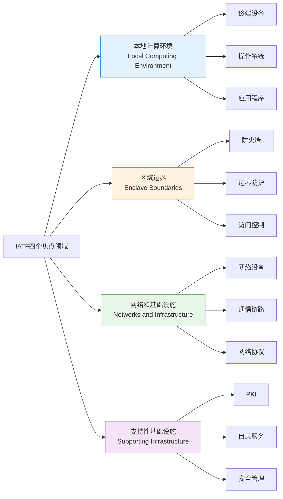
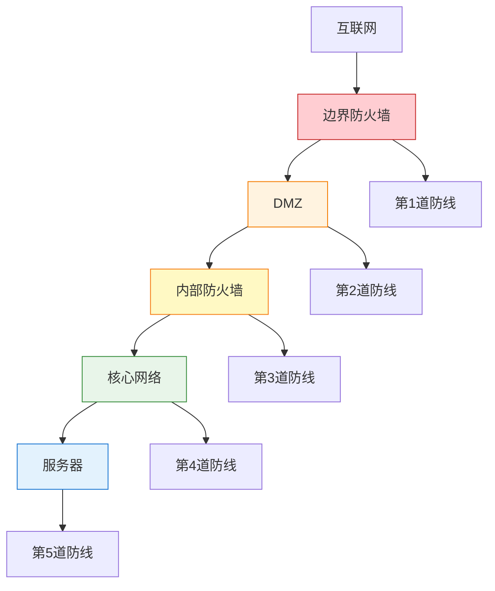
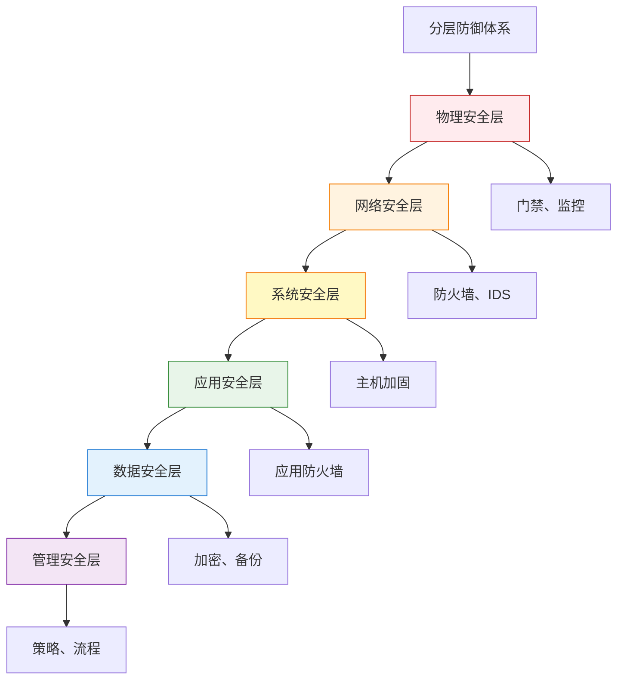
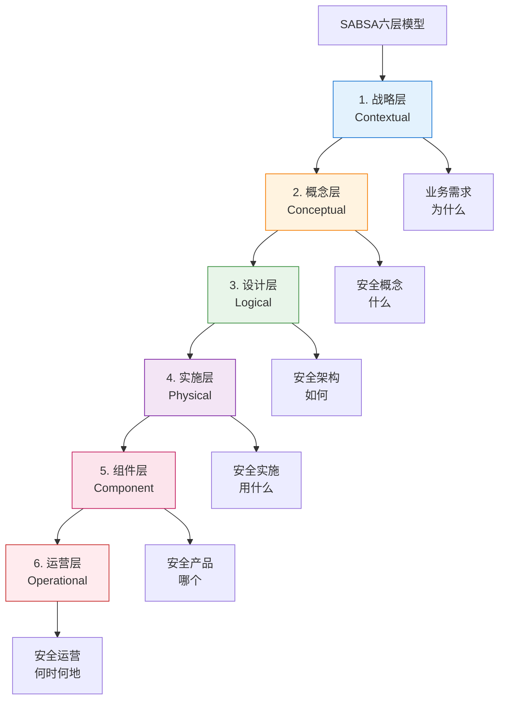

---
title: "CISP学习指南：信息安全保障框架（IATF与SABSA）"
date: 2025-10-18
categories:
  - Cybersecurity
tags:
  - CISP
excerpt: "深入解析CISP认证中的IATF和SABSA两大信息安全保障框架，理解深度防御和分层架构设计。"
lang: zh-CN
available_langs: []
permalink: /zh-CN/2025/10/CISP-Security-Frameworks-IATF-SABSA/
thumbnail: /assets/cisp/thumbnail.png
thumbnail_80: /assets/cisp/thumbnail_80.png
series: cisp
canonical_lang: zh-CN
---

信息安全保障框架为构建安全体系提供了系统化的方法论和指导原则。

## 一、IATF框架

### 1.1 IATF概述

**IATF的定义：**

!!!anote "🏛️ 什么是IATF"
    **IATF（Information Assurance Technical Framework）信息保障技术框架**
    
    由美国国家安全局（NSA）提出，是一个用于指导信息系统安全保障的综合性技术框架。
    
    **核心目标：**
    
    🎯 **提供通用框架**
    - 对信息系统进行解构和描述
    - 建立统一的安全保障视角
    - 指导安全体系建设
    
    🔒 **讨论安全保障问题**
    - 基于框架讨论安全问题
    - 识别安全需求
    - 制定安全策略

### 1.2 IATF的四个焦点领域

!!!anote "💡 IATF框架的焦点领域"
    由于信息系统的复杂性，因此需要一个通用的框架对其进行解构和描述，然后再基于此框架讨论信息系统的**安全保护问题**。
    
    在IATF中，将信息系统的信息安全保障技术层面分为以下四个焦点领域：
    
    1. **本地的计算机环境**
    2. **区域边界**（即本地计算环境的外缘）
    3. **网络和基础设施**
    4. **支持性基础设施**
    
    在深度防御技术方案中推荐**多点防御**原则和**分层防御**原则。

**IATF的四个焦点领域：**



**四个焦点领域详解：**

```
IATF四个焦点领域：
├── 1. 本地计算环境（Local Computing Environment）
│   ├── 定义：用户直接使用的计算资源
│   ├── 包括：
│   │   ├── 工作站和服务器
│   │   ├── 操作系统
│   │   ├── 应用程序
│   │   └── 本地数据
│   └── 安全措施：
│       ├── 主机加固
│       ├── 访问控制
│       ├── 病毒防护
│       └── 补丁管理
├── 2. 区域边界（Enclave Boundaries）
│   ├── 定义：本地计算环境的外缘
│   ├── 作用：隔离和保护内部环境
│   ├── 包括：
│   │   ├── 防火墙
│   │   ├── 网关
│   │   ├── 代理服务器
│   │   └── VPN设备
│   └── 安全措施：
│       ├── 边界防护
│       ├── 入侵检测
│       ├── 流量过滤
│       └── 访问控制
├── 3. 网络和基础设施（Networks and Infrastructure）
│   ├── 定义：连接各个计算环境的网络
│   ├── 包括：
│   │   ├── 路由器和交换机
│   │   ├── 通信链路
│   │   ├── 网络协议
│   │   └── 传输介质
│   └── 安全措施：
│       ├── 网络分段
│       ├── 加密传输
│       ├── 流量监控
│       └── 冗余设计
└── 4. 支持性基础设施（Supporting Infrastructure）
    ├── 定义：支持安全运行的基础服务
    ├── 包括：
    │   ├── PKI（公钥基础设施）
    │   ├── 目录服务
    │   ├── 安全管理平台
    │   ├── 认证服务
    │   └── 审计系统
    └── 安全措施：
        ├── 密钥管理
        ├── 证书管理
        ├── 集中认证
        └── 统一审计
```

### 1.3 深度防御原则

**IATF推荐的两大防御原则：**

!!!anote "🛡️ 深度防御原则"
    **1️⃣ 多点防御（Defense in Multiple Places）**
    
    在多个位置部署安全控制措施，形成多道防线。
    
    **特点：**
    - 在不同位置设置防御点
    - 攻击者需要突破多个防御点
    - 提高攻击难度和成本
    - 增加检测和响应时间
    
    **2️⃣ 分层防御（Defense in Depth）**
    
    在不同层次部署安全控制措施，形成纵深防御。
    
    **特点：**
    - 在不同安全层次设置防御
    - 层层防护，逐级深入
    - 即使一层被突破，还有其他层保护
    - 综合技术、管理、物理等多个维度

**多点防御示意图：**



**分层防御示意图：**



**多点防御 vs 分层防御：**

| 特性 | 多点防御 | 分层防御 |
|------|---------|---------|
| 维度 | 水平/空间维度 | 垂直/层次维度 |
| 关注点 | 在多个位置设防 | 在多个层次设防 |
| 防御方式 | 多道防线 | 纵深防御 |
| 示例 | 边界防火墙、内部防火墙、主机防火墙 | 物理层、网络层、系统层、应用层 |
| 目标 | 增加攻击路径难度 | 增加攻击深度难度 |
| 效果 | 攻击者需要突破多个点 | 攻击者需要突破多个层 |

### 1.4 IATF的应用

**基于IATF构建安全体系：**

```
IATF应用步骤：
├── 1. 系统分析
│   ├── 识别本地计算环境
│   ├── 确定区域边界
│   ├── 分析网络和基础设施
│   └── 评估支持性基础设施
├── 2. 威胁分析
│   ├── 针对四个焦点领域
│   ├── 识别潜在威胁
│   ├── 评估威胁影响
│   └── 确定防护重点
├── 3. 安全设计
│   ├── 应用多点防御原则
│   ├── 应用分层防御原则
│   ├── 设计安全控制措施
│   └── 制定安全策略
├── 4. 实施部署
│   ├── 部署安全设备
│   ├── 配置安全策略
│   ├── 实施安全流程
│   └── 培训安全人员
└── 5. 持续改进
    ├── 监控安全状态
    ├── 评估安全效果
    ├── 调整安全策略
    └── 更新安全措施
```

## 二、SABSA模型

### 2.1 SABSA概述

**SABSA的定义：**

!!!anote "🏗️ 什么是SABSA"
    **SABSA（Sherwood Applied Business Security Architecture）**
    
    谢伍德应用业务安全架构，是一个企业安全架构框架和方法论。
    
    **核心特点：**
    
    🎯 **业务驱动**
    - 从业务需求出发
    - 安全服务于业务
    - 业务风险导向
    
    🏗️ **分层架构**
    - 多层次的架构模型
    - 从战略到实施
    - 逐层细化
    
    🔄 **全生命周期**
    - 覆盖规划到运维
    - 持续改进
    - 动态调整

### 2.2 SABSA模型的层次

!!!anote "💡 SABSA模型的核心特征"
    SABSA模型包括**六层**，它是一个**分层模型**。
    
    **关键特点：**
    
    🎯 **业务驱动**
    - 第一层从安全的角度定义了**业务需求**
    - 安全架构从业务需求出发
    
    📊 **逐层细化**
    - 模型的每一层抽象方式逐层减少，细节逐层增加
    - 每个层级都是建立在其他层之上的
    - 从策略逐渐到技术和解决方案的**实施实践**
    
    🔗 **完整链条**
    - 重新提出了一个包括战略、概念、设计、实施、度量和审计层次的**安全链条**
    - 覆盖安全架构的全生命周期

**SABSA的六层模型：**



**SABSA六层详解：**

```
SABSA六层模型详解：
├── 1. 战略层（Contextual Layer）- 业务需求
│   ├── 关键问题：为什么需要安全？
│   ├── 内容：
│   │   ├── 业务目标和驱动因素
│   │   ├── 业务风险
│   │   ├── 安全目标
│   │   └── 业务需求
│   ├── 输出：业务安全需求
│   └── 抽象程度：最高
├── 2. 概念层（Conceptual Layer）- 安全概念
│   ├── 关键问题：需要什么安全？
│   ├── 内容：
│   │   ├── 安全策略
│   │   ├── 安全原则
│   │   ├── 安全服务
│   │   └── 安全概念模型
│   ├── 输出：安全策略和原则
│   └── 抽象程度：高
├── 3. 设计层（Logical Layer）- 安全架构
│   ├── 关键问题：如何实现安全？
│   ├── 内容：
│   │   ├── 安全架构设计
│   │   ├── 安全机制
│   │   ├── 安全流程
│   │   └── 逻辑模型
│   ├── 输出：安全架构设计
│   └── 抽象程度：中高
├── 4. 实施层（Physical Layer）- 安全实施
│   ├── 关键问题：用什么实现？
│   ├── 内容：
│   │   ├── 技术选型
│   │   ├── 产品选择
│   │   ├── 实施方案
│   │   └── 物理部署
│   ├── 输出：实施方案
│   └── 抽象程度：中低
├── 5. 组件层（Component Layer）- 安全产品
│   ├── 关键问题：用哪个产品？
│   ├── 内容：
│   │   ├── 具体产品
│   │   ├── 工具和技术
│   │   ├── 配置参数
│   │   └── 组件规格
│   ├── 输出：产品清单和配置
│   └── 抽象程度：低
└── 6. 运营层（Operational Layer）- 安全运营
    ├── 关键问题：何时何地运营？
    ├── 内容：
    │   ├── 运营流程
    │   ├── 监控和维护
    │   ├── 事件响应
    │   └── 持续改进
    ├── 输出：运营手册
    └── 抽象程度：最低
```

### 2.3 SABSA的特点

**SABSA模型的关键特点：**

!!!success "✨ SABSA模型特点"
    **1️⃣ 六层分层模型**
    - 从战略到运营
    - 逐层细化
    - 层层递进
    
    **2️⃣ 业务驱动**
    - 第一层定义业务需求
    - 从业务角度看安全
    - 安全服务于业务
    
    **3️⃣ 抽象递减，细节递增**
    - 上层抽象，下层具体
    - 逐层增加细节
    - 从"为什么"到"如何做"
    
    **4️⃣ 层层依赖**
    - 每层建立在上一层之上
    - 上层指导下层
    - 下层实现上层
    
    **5️⃣ 完整的安全链条**
    - 从战略到实施
    - 从概念到运营
    - 覆盖全生命周期

**SABSA的六个视角（横向维度）：**

除了六层纵向维度，SABSA还有六个横向视角：

| 视角 | 关键问题 | 关注点 |
|------|---------|--------|
| 资产 | 保护什么？ | 需要保护的资产 |
| 动机 | 为什么保护？ | 业务驱动因素 |
| 过程 | 如何保护？ | 安全流程和机制 |
| 人员 | 谁来保护？ | 角色和职责 |
| 位置 | 在哪里保护？ | 物理和逻辑位置 |
| 时间 | 何时保护？ | 时间和生命周期 |

### 2.4 SABSA矩阵

**SABSA架构矩阵（6×6）：**

!!!tip "📊 SABSA矩阵"
    SABSA使用一个6×6的矩阵来组织安全架构：
    
    **纵向（6层）：**
    1. 战略层
    2. 概念层
    3. 设计层
    4. 实施层
    5. 组件层
    6. 运营层
    
    **横向（6个视角）：**
    1. 资产（What）
    2. 动机（Why）
    3. 过程（How）
    4. 人员（Who）
    5. 位置（Where）
    6. 时间（When）
    
    **矩阵的每个单元格回答一个具体问题，形成完整的安全架构。**

**示例：战略层的六个视角**

| 视角 | 问题 | 内容 |
|------|------|------|
| 资产 | 保护什么业务资产？ | 关键业务资产清单 |
| 动机 | 为什么需要保护？ | 业务风险和驱动因素 |
| 过程 | 如何支持业务流程？ | 关键业务流程 |
| 人员 | 谁是利益相关者？ | 业务所有者、管理层 |
| 位置 | 业务在哪里开展？ | 业务地点和范围 |
| 时间 | 业务何时运行？ | 业务时间要求 |

### 2.5 SABSA的应用

**使用SABSA构建安全架构：**

```
SABSA应用流程：
├── 1. 战略层分析
│   ├── 识别业务目标
│   ├── 分析业务风险
│   ├── 定义安全目标
│   └── 确定业务需求
├── 2. 概念层设计
│   ├── 制定安全策略
│   ├── 定义安全原则
│   ├── 设计安全服务
│   └── 建立概念模型
├── 3. 设计层规划
│   ├── 设计安全架构
│   ├── 定义安全机制
│   ├── 规划安全流程
│   └── 建立逻辑模型
├── 4. 实施层执行
│   ├── 选择技术方案
│   ├── 制定实施计划
│   ├── 部署安全措施
│   └── 配置安全系统
├── 5. 组件层配置
│   ├── 选择具体产品
│   ├── 配置安全参数
│   ├── 集成安全组件
│   └── 测试验证
└── 6. 运营层管理
    ├── 制定运营流程
    ├── 监控安全状态
    ├── 响应安全事件
    └── 持续改进优化
```

## 三、IATF与SABSA对比

**两个框架的对比：**

| 特性 | IATF | SABSA |
|------|------|-------|
| 提出者 | 美国NSA | Sherwood |
| 类型 | 技术框架 | 架构框架 |
| 关注点 | 技术层面的安全保障 | 业务驱动的安全架构 |
| 结构 | 4个焦点领域 | 6层分层模型 |
| 维度 | 技术维度 | 纵向6层 + 横向6视角 |
| 起点 | 技术系统 | 业务需求 |
| 防御原则 | 多点防御、分层防御 | 层层递进、业务驱动 |
| 适用场景 | 技术系统安全设计 | 企业安全架构规划 |
| 优势 | 技术性强、实用性好 | 系统性强、覆盖全面 |

**两个框架的互补性：**

!!!tip "🤝 IATF与SABSA的结合"
    **IATF提供技术视角：**
    - 关注技术实现
    - 提供具体的技术领域划分
    - 指导技术层面的安全设计
    
    **SABSA提供架构视角：**
    - 关注业务需求
    - 提供完整的架构方法论
    - 指导从战略到实施的全过程
    
    **结合使用：**
    - SABSA用于整体架构规划
    - IATF用于技术层面设计
    - SABSA的设计层和实施层可以应用IATF的四个焦点领域
    - 形成从业务到技术的完整安全体系

## 四、总结

信息安全保障框架的核心要点：

1. **IATF框架**：四个焦点领域，多点防御和分层防御原则
2. **SABSA模型**：六层分层模型，业务驱动的安全架构
3. **深度防御**：在多个位置和多个层次部署安全控制

!!!success "🎯 关键要点"
    - IATF讨论信息系统的安全保护问题
    - IATF四个焦点领域：本地计算环境、区域边界、网络和基础设施、支持性基础设施
    - IATF推荐多点防御和分层防御原则
    - SABSA是一个六层分层模型
    - SABSA第一层从安全角度定义业务需求
    - SABSA从策略逐渐到技术和解决方案的实施实践
    - SABSA包括战略、概念、设计、实施、度量和审计层次的安全链条
    - SABSA每层抽象逐层减少，细节逐层增加

!!!tip "💡 实践建议"
    - 使用IATF指导技术层面的安全设计
    - 应用多点防御原则在多个位置设防
    - 应用分层防御原则在多个层次设防
    - 使用SABSA规划企业安全架构
    - 从业务需求出发设计安全体系
    - 逐层细化从战略到实施的安全方案
    - 结合IATF和SABSA形成完整的安全体系
    - 建立覆盖技术、管理、流程的综合防御体系
