---
title: "CISP学习指南：信息安全管理实践"
date: 2025-10-06
categories:
  - Cybersecurity
tags:
  - CISP
excerpt: "全面解析CISP认证中的信息安全管理实践知识点，涵盖威胁排序、管理体系建设、风险管理方法、资产管理和职责分离等核心概念。"
lang: zh-CN
available_langs: []
permalink: /zh-CN/2025/10/CISP-Security-Management-Practice/
thumbnail: /assets/cisp/thumbnail.png
thumbnail_80: /assets/cisp/thumbnail_80.png
series: cisp
canonical_lang: zh-CN
comments: true
---

信息安全管理实践是将安全理论转化为实际行动的关键环节，涵盖威胁评估、体系建设、风险管理和组织治理等多个维度。

## 一、威胁排序与评估

!!!anote "💡 威胁评估维度"
    威胁的严重程度应从三个维度综合评估：技术能力、所拥有的资源和破坏力。

**威胁主体排序（从低到高）：**

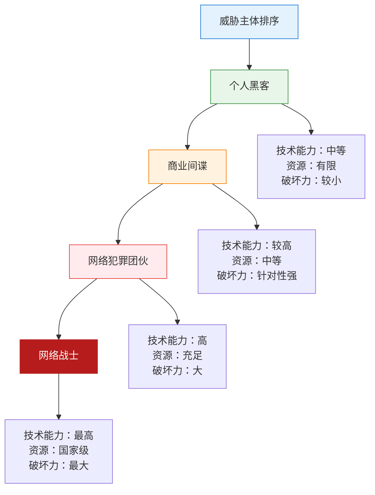

**威胁主体特征对比：**

| 威胁主体 | 技术能力 | 资源 | 破坏力 | 动机 |
|---------|---------|------|--------|------|
| 个人黑客 | 中等 | 有限 | 较小 | 好奇、炫耀、学习 |
| 商业间谍 | 较高 | 中等 | 针对性强 | 商业利益、竞争情报 |
| 网络犯罪团伙 | 高 | 充足 | 大 | 经济利益、勒索 |
| **网络战士** | **最高** | **国家级** | **最大** | **政治、军事、战略目标** |

!!!warning "⚠️ 最大威胁"
    **网络战士**（Cyber Warriors）是威胁最大的主体，因为他们：
    - 拥有国家级的技术能力和资源支持
    - 可以发动大规模、持续性的攻击
    - 破坏力可能影响国家安全和关键基础设施
    - 攻击目标通常是战略性的

## 二、信息安全保障管理体系建设

**体系建设需要重点考虑的因素：**

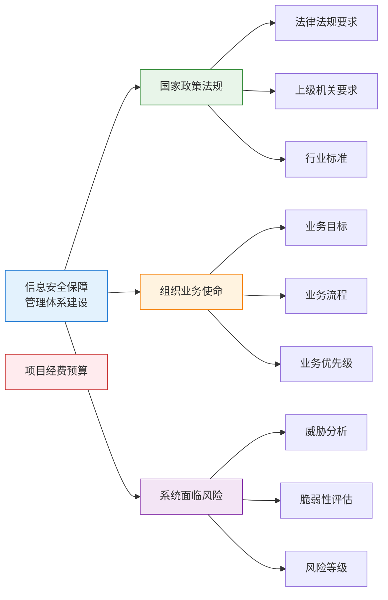

**必须考虑的因素：**

✅ **国家、上级机关的相关政策法规要求**
- 合规性是体系建设的基础
- 必须满足法律法规的强制性要求
- 遵循行业监管要求

✅ **组织的业务使命**
- 安全服务于业务，不能脱离业务谈安全
- 安全措施应支撑业务目标的实现
- 平衡安全与业务效率

✅ **信息系统面临的风险**
- 基于风险评估结果制定安全策略
- 针对实际威胁和脆弱性设计控制措施
- 风险驱动的体系建设

❌ **不是重点考虑的因素：**

**项目的经费预算**
- 经费预算是实施层面的约束条件，不是体系建设的决定性因素
- 体系建设应基于需求和风险，而非预算
- 预算不足时应调整实施优先级，而非降低体系要求

!!!anote "💡 体系建设逻辑"
    正确的逻辑是：先确定需求（法规、业务、风险）→ 设计体系 → 根据预算制定实施计划
    
    错误的逻辑是：先看预算 → 根据预算设计体系


## 三、信息安全管理目标

**信息安全管理的根本目标：**

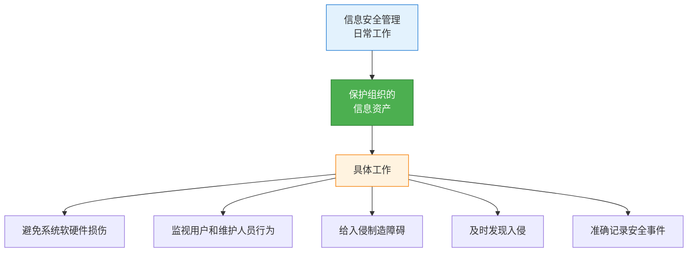

!!!success "🎯 根本目标"
    **保护组织的信息资产**是信息安全管理的根本目标。
    
    所有其他工作都是为了实现这个根本目标的手段：
    - 避免系统软硬件损伤 → 保护物理资产
    - 监视系统用户和维护人员行为 → 防止内部威胁
    - 给入侵行为制造障碍 → 预防外部攻击
    - 及时发现、准确记录入侵 → 响应和恢复

**信息资产的范围：**

| 资产类型 | 示例 |
|---------|------|
| 数据资产 | 客户数据、业务数据、知识产权 |
| 软件资产 | 应用系统、操作系统、数据库 |
| 硬件资产 | 服务器、网络设备、存储设备 |
| 服务资产 | 云服务、外包服务、技术支持 |
| 人员资产 | 专业技能、知识经验 |
| 无形资产 | 品牌声誉、客户信任 |

## 四、信息安全管理方法

**风险管理是信息安全管理的根本方法：**

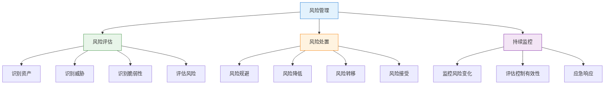

**管理方法层次关系：**

| 方法 | 层次 | 说明 |
|------|------|------|
| **风险管理** | **根本方法** | **贯穿整个安全管理生命周期** |
| 风险评估 | 核心活动 | 风险管理的基础和起点 |
| 风险处置 | 核心活动 | 根据评估结果采取措施 |
| 应急响应 | 支撑活动 | 处理已发生的安全事件 |

!!!anote "💡 为什么风险管理是根本方法"
    1. **全面性**：覆盖识别、评估、处置、监控全过程
    2. **持续性**：不是一次性活动，而是持续的循环过程
    3. **系统性**：将各种安全活动整合为统一的管理框架
    4. **决策支持**：为安全投资和资源分配提供依据

**风险管理与其他方法的关系：**

- **风险评估**是风险管理的一部分，是基础和起点
- **风险处置**是风险管理的执行环节
- **应急响应**是风险管理中处理已实现风险的手段

## 五、资产分类分级管理

**资产分类分级的责任主体：**

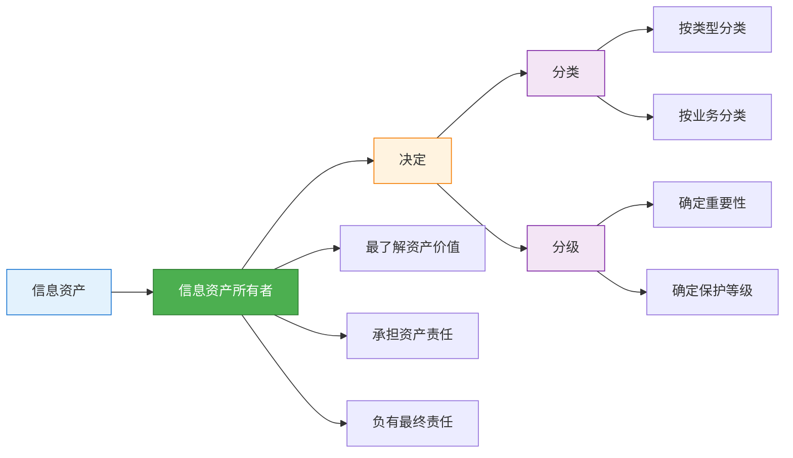

!!!success "🎯 最终责任人"
    **信息资产所有者**负有资产分类与分级的最终责任。

**为什么是资产所有者：**

✅ **最了解资产价值**
- 清楚资产对业务的重要性
- 了解资产的敏感程度
- 知道资产丢失或泄露的影响

✅ **承担资产责任**
- 对资产的安全负责
- 有权决定资产的使用和保护方式
- 承担资产安全事件的后果

✅ **业务视角**
- 从业务角度评估资产重要性
- 平衡安全需求和业务需求
- 确保分类分级符合业务实际

**其他角色的职责：**

| 角色 | 职责 | 说明 |
|------|------|------|
| 部门经理 | 协助和支持 | 提供部门视角，但不是最终责任人 |
| 高级管理层 | 批准和监督 | 批准分类分级策略，但不负责具体决定 |
| 最终用户 | 遵守规定 | 按照分类分级要求使用资产 |
| 安全团队 | 提供指导 | 提供分类分级方法和标准 |

**资产分类分级示例：**

| 分类 | 分级 | 保护要求 | 示例 |
|------|------|---------|------|
| 客户数据 | 高度敏感 | 加密存储、严格访问控制 | 身份证号、银行账号 |
| 业务数据 | 敏感 | 访问控制、审计日志 | 销售数据、财务报表 |
| 公开信息 | 公开 | 完整性保护 | 产品手册、公告 |


## 六、职责分离原则

**职责分离（Separation of Duties, SoD）的目的：**

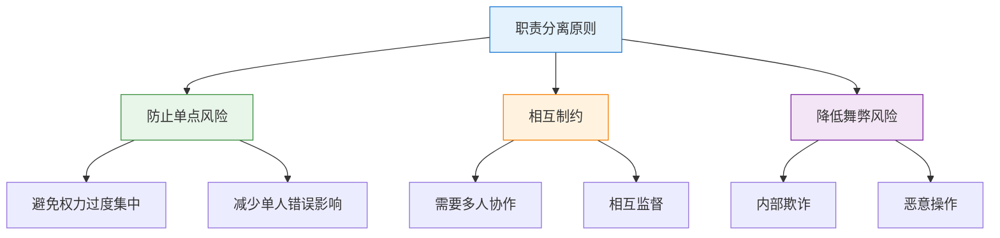

**需要分离的职责组合：**

!!!warning "⚠️ 必须分离的职责"
    以下职责组合存在利益冲突或风险，**不能**由同一人执行：

❌ **计算机操作 + 系统开发**
- 开发人员不应直接操作生产系统
- 避免开发人员绕过控制直接修改系统
- 防止未经测试的代码进入生产环境

❌ **系统开发 + 变更管理**
- 开发人员不应批准自己的变更
- 需要独立的变更审批流程
- 防止未经审查的变更上线

❌ **系统开发 + 系统维护**
- 开发和维护应该分离
- 维护人员应独立于开发团队
- 确保维护的客观性和独立性

!!!success "✅ 可以由同一人执行"
    **安全管理 + 变更管理**
    
    这两个职责可以由同一人执行，因为：
    - 不存在直接的利益冲突
    - 安全管理需要参与变更管理
    - 有助于确保变更的安全性
    - 两者都属于管理职能，而非技术执行

**职责分离矩阵：**

| 职责A | 职责B | 是否可以合并 | 原因 |
|-------|-------|-------------|------|
| 安全管理 | 变更管理 | ✅ 可以 | 无利益冲突，有协同效应 |
| 计算机操作 | 系统开发 | ❌ 不可以 | 开发人员不应操作生产系统 |
| 系统开发 | 变更管理 | ❌ 不可以 | 不能批准自己的变更 |
| 系统开发 | 系统维护 | ❌ 不可以 | 需要独立的维护视角 |
| 系统管理 | 安全审计 | ❌ 不可以 | 不能审计自己的操作 |
| 数据录入 | 数据审核 | ❌ 不可以 | 不能审核自己录入的数据 |

**职责分离的实施要点：**

1. **明确职责边界**：清晰定义每个角色的职责范围
2. **建立审批流程**：关键操作需要多人审批
3. **技术控制**：通过系统权限强制实施职责分离
4. **定期审查**：定期检查职责分配是否合理
5. **例外管理**：小型组织可能需要补偿性控制

## 七、安全管理组织体系

**构建安全管理组织体系的必需内容：**

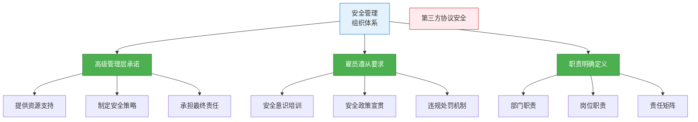

**必需考虑的内容：**

✅ **高级管理层承诺对安全工作的支持**
- 安全工作需要自上而下的推动
- 管理层承诺是获得资源的前提
- 体现安全在组织中的重要性

✅ **要求雇员们遵从安全策略的指示**
- 安全策略需要全员执行
- 建立安全意识和文化
- 明确违规的后果

✅ **清晰地定义部门和岗位的职责**
- 明确谁负责什么
- 避免职责空白和重叠
- 建立责任追溯机制

❌ **不是必需考虑的内容：**

**在第三方协议中强调安全**
- 这是外部关系管理的内容
- 不是构建内部组织体系的必需内容
- 虽然重要，但不属于组织体系建设的核心

**组织体系建设的层次：**

| 层次 | 内容 | 关键要素 |
|------|------|---------|
| 战略层 | 高级管理层承诺 | 安全战略、资源投入、组织定位 |
| 管理层 | 职责定义 | 部门职责、岗位职责、责任矩阵 |
| 执行层 | 雇员遵从 | 安全意识、政策执行、行为规范 |

## 八、信息安全保障要素

**信息安全保障的四大要素：**

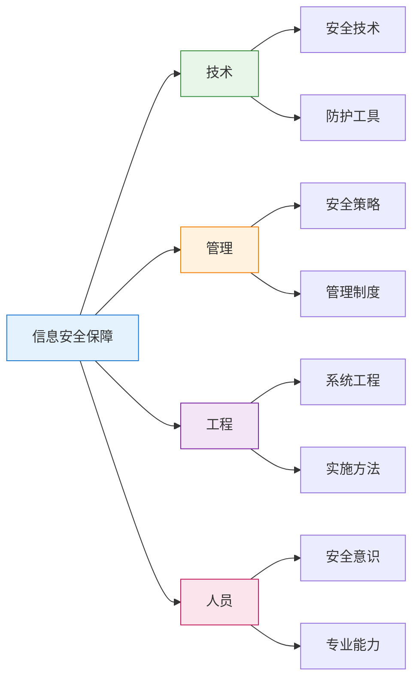

!!!anote "💡 四大要素"
    信息安全保障要素包括：**技术、管理、工程、人员**
    
    注意：不是"组织"，而是"人员"

**四大要素详解：**

| 要素 | 说明 | 示例 |
|------|------|------|
| **技术** | 安全技术和工具 | 防火墙、加密、认证、入侵检测 |
| **管理** | 安全管理体系 | 策略、制度、流程、标准 |
| **工程** | 系统工程方法 | 安全架构设计、实施方法论 |
| **人员** | 人的因素 | 安全意识、技能培训、行为规范 |

**为什么不是"组织"：**

- "组织"是管理要素的一部分
- "人员"强调的是人的能力和意识
- 人员是安全的核心，技术和管理都需要人来实施

**四大要素的关系：**

```
技术 + 管理 + 工程 = 安全体系框架
人员 = 实施和运行安全体系的主体
```


## 九、信息安全保障的核心理念

**信息安全保障的正确理念：**

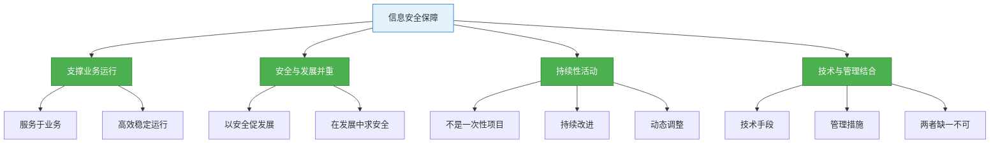

**正确的理念：**

✅ **信息安全保障是为了支撑业务高效稳定的运行**
- 安全的目的是保护业务
- 安全措施应促进而非阻碍业务
- 安全与业务目标一致

✅ **以安全促发展，在发展中求安全**
- 安全和发展不是对立的
- 安全是发展的保障
- 发展为安全提供资源

✅ **信息安全保障是持续性开展的活动**
- 不是一次性项目
- 需要持续投入和改进
- 随着威胁和业务变化而调整

✅ **信息安全保障的实现，需要将信息安全技术与管理相结合**
- 单纯的技术或管理都不够
- 技术提供手段，管理提供规范
- 两者相辅相成

!!!warning "❌ 错误理念"
    **"信息安全保障不是持续性开展的活动"** - 这是错误的！
    
    信息安全保障必须是持续性的，因为：
    - 威胁在不断演变
    - 业务在不断变化
    - 技术在不断更新
    - 需要持续监控和改进

**信息安全保障的生命周期：**

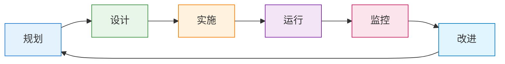

**持续性活动的体现：**

| 阶段 | 活动 | 频率 |
|------|------|------|
| 规划 | 安全战略规划、年度计划 | 年度/季度 |
| 设计 | 安全架构设计、方案设计 | 按需 |
| 实施 | 安全措施部署、系统上线 | 按项目 |
| 运行 | 日常安全运维、事件处理 | 持续 |
| 监控 | 安全监控、日志分析 | 实时/日常 |
| 改进 | 风险评估、体系优化 | 定期 |

## 九、工程监理与标准

### 9.1 信息安全工程监理

**工程监理的定位与作用：**

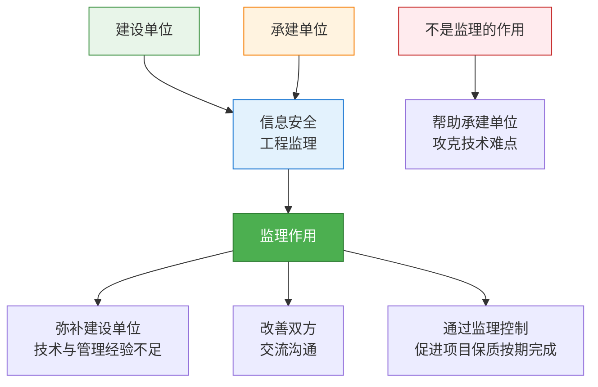

!!!success "✅ 监理的作用"
    
    **弥补建设单位在技术与管理上的经验不足**
    - 建设单位可能缺乏信息安全专业知识
    - 监理提供专业技术支持和管理经验
    - 帮助建设单位做出正确决策
    
    **改善建设单位与承建单位之间的交流沟通**
    - 监理作为独立第三方，促进双方有效沟通
    - 协调解决项目实施中的分歧
    - 确保需求准确传达和实现
    
    **通过监理控制积极促进项目保质按期完成**
    - 监督项目进度和质量
    - 及时发现和纠正问题
    - 确保项目符合合同要求

!!!warning "❌ 不是监理的作用"
    **帮助承建单位攻克技术难点，顺利实施项目**
    
    这不是监理的作用，因为：
    - 监理是独立的第三方，不应帮助承建单位
    - 监理的职责是监督，而非协助承建单位实施
    - 帮助承建单位会损害监理的独立性和公正性
    - 技术难点应由承建单位自行解决或寻求其他技术支持

**监理的三方关系：**

| 角色 | 职责 | 与监理的关系 |
|------|------|-------------|
| 建设单位 | 项目业主，提出需求 | 委托监理，接受监理服务 |
| 监理单位 | 独立第三方，监督管理 | 代表建设单位利益，保持独立性 |
| 承建单位 | 项目实施方 | 接受监理监督，不应获得监理帮助 |

**监理的独立性原则：**

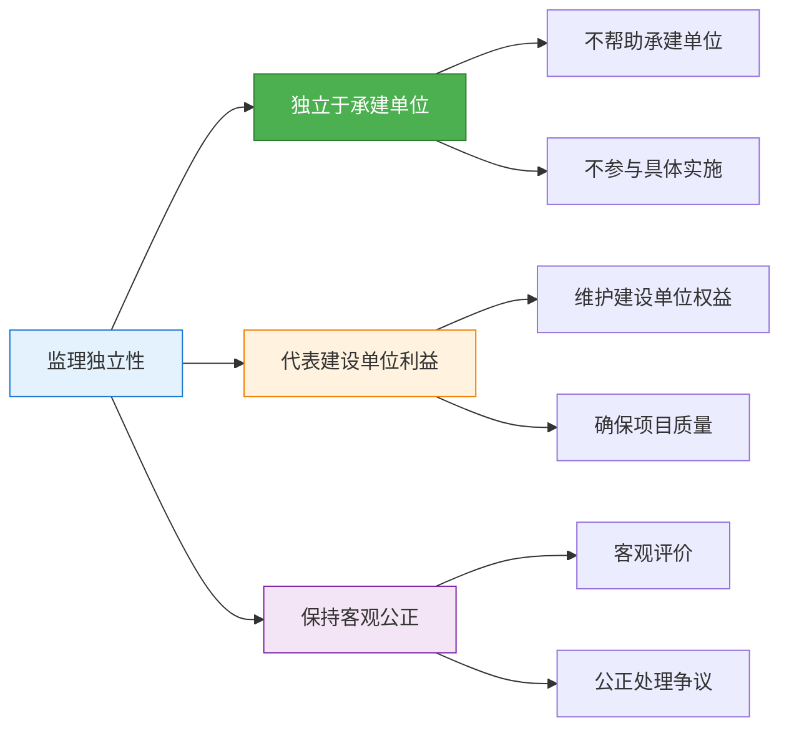

### 9.2 应急响应方法论

**GB/T 24364-2009 应急响应过程：**

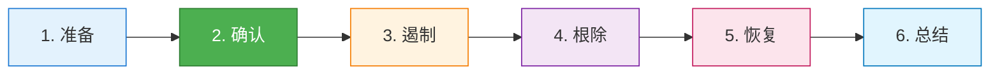

!!!anote "💡 应急响应六步法"
    依据GB/T 24364-2009《信息安全技术 信息安全应急响应计划规范》，应急响应过程包括六个步骤，**第二步是确认**。

**应急响应各阶段详解：**

| 阶段 | 主要活动 | 目标 |
|------|---------|------|
| **1. 准备** | 建立应急响应团队、制定计划、准备工具 | 做好应急准备 |
| **2. 确认** | 确认事件真实性、评估影响范围和严重程度 | 验证和评估事件 |
| **3. 遏制** | 隔离受影响系统、阻止事件扩散 | 控制事件影响 |
| **4. 根除** | 清除恶意代码、修复漏洞、消除威胁 | 彻底消除威胁 |
| **5. 恢复** | 恢复系统正常运行、验证系统安全 | 恢复业务运行 |
| **6. 总结** | 事后分析、经验教训、改进措施 | 持续改进 |

**第二步"确认"的重要性：**

✅ **验证事件真实性**
- 区分真实事件和误报
- 避免资源浪费在虚假警报上
- 确保应急响应的必要性

✅ **评估事件影响**
- 确定受影响的系统和数据
- 评估业务影响程度
- 确定事件严重级别

✅ **决定响应策略**
- 根据事件严重程度决定响应级别
- 确定需要调动的资源
- 制定初步响应方案

**确认阶段的关键问题：**

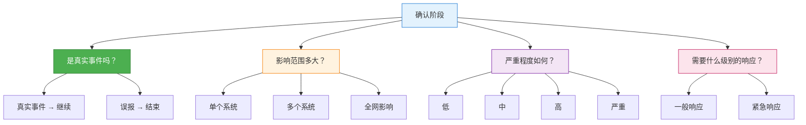

### 9.3 信息安全组织架构

**国家信息安全组织架构的两种模式：**

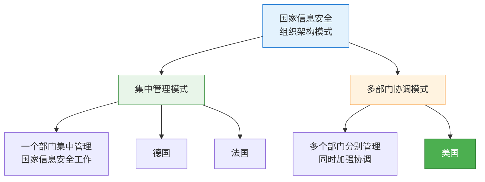

!!!success "🎯 美国采用多部门协调模式"
    美国的信息安全组织架构采用**多部门协调**的做法，多个部门分别管理信息安全相关工作，同时加强部门间的协调。

**两种模式对比：**

| 模式 | 特点 | 优势 | 劣势 | 代表国家 |
|------|------|------|------|----------|
| **集中管理** | 一个部门统一管理 | 决策高效、职责清晰、执行力强 | 可能缺乏灵活性 | 德国、法国 |
| **多部门协调** | 多部门分工协作 | 专业分工、资源整合、灵活应对 | 需要强化协调机制 | **美国** |

**美国信息安全组织架构特点：**

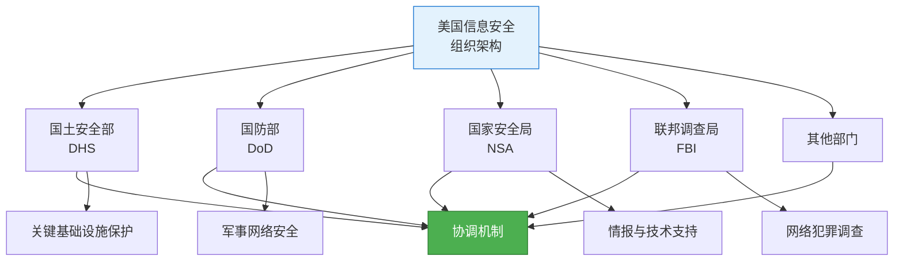

**多部门协调模式的关键要素：**

✅ **明确分工**
- 各部门有明确的职责范围
- 避免职责重叠和空白
- 发挥各部门专业优势

✅ **协调机制**
- 建立跨部门协调机构
- 定期沟通和信息共享
- 联合应对重大事件

✅ **资源整合**
- 整合各部门的技术和人力资源
- 避免重复建设
- 提高资源利用效率

**中国的信息安全组织架构：**

!!!anote "💡 中国模式"
    中国采用的是**多部门协调模式**，由中央网络安全和信息化委员会统筹协调，多个部门分工负责：
    - 国家网信办：统筹协调网络安全工作
    - 公安部：网络安全监察和打击网络犯罪
    - 工信部：通信网络安全管理
    - 国家安全部：国家安全领域的网络安全
    - 其他相关部门：各自领域的网络安全工作

## 十、运行时安全工作

**信息安全保障的立体保障体系：**

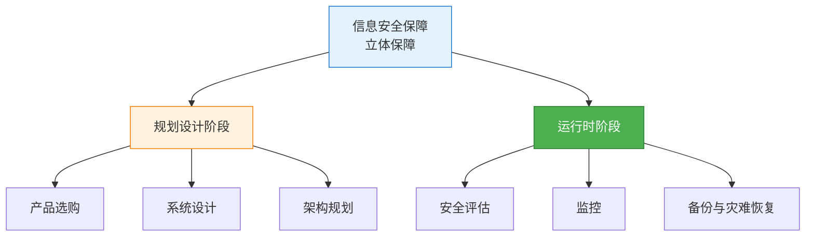

!!!anote "💡 运行时安全工作的范围"
    信息安全保障是一种立体保障，在运行时的安全工作包括：
    - ✅ 安全评估
    - ✅ 监控
    - ✅ 备份与灾难恢复
    - ❌ 产品选购（属于规划设计阶段）

**运行时安全工作详解：**

| 工作内容 | 所属阶段 | 主要活动 | 目的 |
|---------|---------|---------|------|
| **安全评估** | 运行时 | 漏洞扫描、渗透测试、风险评估 | 发现安全问题，评估安全状态 |
| **监控** | 运行时 | 日志监控、入侵检测、异常分析 | 实时发现安全事件 |
| **备份与灾难恢复** | 运行时 | 数据备份、恢复演练、业务连续性 | 确保业务连续性 |
| **产品选购** | 规划设计 | 产品评估、选型、采购 | 建设阶段的工作 |

**为什么产品选购不属于运行时工作：**

!!!warning "❌ 产品选购不是运行时工作"
    **产品选购属于规划设计阶段，不是运行时安全工作。**
    
    **原因：**
    
    🔧 **时间节点不同**
    - 产品选购发生在系统建设之前
    - 运行时工作发生在系统投入使用之后
    - 两者处于不同的生命周期阶段
    
    🎯 **工作性质不同**
    - 产品选购是一次性的建设活动
    - 运行时工作是持续性的运维活动
    - 产品选购为运行时工作提供基础
    
    📋 **职责分工不同**
    - 产品选购通常由项目组或采购部门负责
    - 运行时工作由运维和安全团队负责
    - 两者的责任主体不同

**信息安全保障的生命周期阶段：**

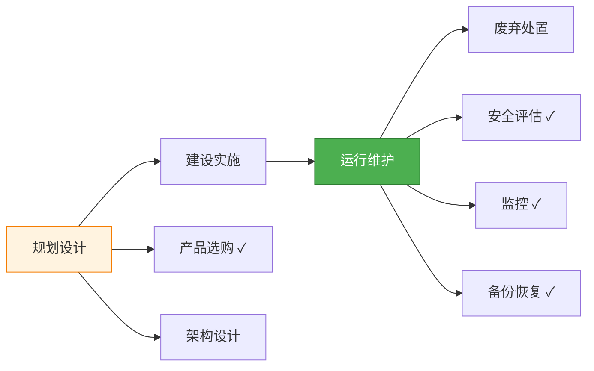

**运行时安全工作的三大支柱：**

### 10.1 安全评估

!!!anote "🔍 安全评估"
    **定义：**
    - 定期或不定期地评估系统的安全状态
    - 发现潜在的安全问题和风险
    
    **主要活动：**
    - 漏洞扫描：自动化工具扫描系统漏洞
    - 渗透测试：模拟攻击测试系统防御能力
    - 风险评估：评估资产、威胁和脆弱性
    - 合规审计：检查是否符合安全标准
    
    **频率：**
    - 定期评估：季度或年度
    - 重大变更后评估
    - 安全事件后评估

### 10.2 监控

!!!anote "👁️ 安全监控"
    **定义：**
    - 实时或准实时地监控系统安全状态
    - 及时发现和响应安全事件
    
    **主要活动：**
    - 日志监控：收集和分析系统日志
    - 入侵检测：IDS/IPS检测攻击行为
    - 异常检测：识别异常行为模式
    - 性能监控：监控系统性能指标
    
    **特点：**
    - 持续性：7×24小时运行
    - 实时性：快速发现问题
    - 自动化：减少人工干预

### 10.3 备份与灾难恢复

!!!anote "💾 备份与灾难恢复"
    **定义：**
    - 定期备份关键数据和系统
    - 制定和演练灾难恢复计划
    
    **主要活动：**
    - 数据备份：定期备份关键数据
    - 系统备份：备份系统配置和镜像
    - 恢复演练：定期测试恢复能力
    - 业务连续性计划：确保业务不中断
    
    **关键指标：**
    - RTO（恢复时间目标）：系统恢复所需时间
    - RPO（恢复点目标）：可接受的数据丢失量

**运行时安全工作的协同关系：**

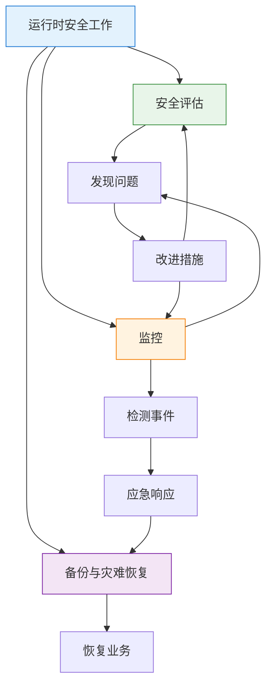

**运行时安全工作的最佳实践：**

```
运行时安全工作最佳实践：
├── 安全评估
│   ├── 定期进行（至少每年一次）
│   ├── 重大变更后评估
│   ├── 使用自动化工具
│   └── 及时修复发现的问题
├── 监控
│   ├── 建立安全运营中心（SOC）
│   ├── 集中日志管理
│   ├── 自动化告警
│   └── 快速响应机制
└── 备份与灾难恢复
    ├── 3-2-1备份原则
    │   ├── 3份数据副本
    │   ├── 2种不同介质
    │   └── 1份异地备份
    ├── 定期恢复演练
    └── 文档化恢复流程
```

## 十一、总结

**信息安全管理实践的核心要点：**

!!!success "🎯 关键要点总结"
    
    **威胁评估：**
    - 网络战士是威胁最大的主体（技术能力、资源、破坏力最强）
    
    **体系建设：**
    - 重点考虑：法规要求、业务使命、系统风险
    - 不是重点：项目经费预算（预算是约束条件，不是决定因素）
    
    **管理目标与方法：**
    - 根本目标：保护组织的信息资产
    - 根本方法：风险管理（不是风险评估或应急响应）
    
    **资产管理：**
    - 信息资产所有者负有分类分级的最终责任
    
    **职责分离：**
    - 安全管理和变更管理可以由同一人执行
    - 系统开发不能与操作、变更管理、维护合并
    
    **组织体系：**
    - 必需：高级管理层承诺、雇员遵从、职责定义
    - 不必需：第三方协议安全（属于外部关系管理）
    
    **保障要素：**
    - 四大要素：技术、管理、工程、人员（不是组织）
    
    **核心理念：**
    - 支撑业务运行
    - 安全与发展并重
    - 持续性活动（不是一次性项目）
    - 技术与管理结合
    
    **工程监理与标准：**
    - 监理作用：弥补建设单位经验不足、改善沟通、促进项目完成
    - 不是监理作用：帮助承建单位攻克技术难点
    - 应急响应六步：准备、**确认**、遏制、根除、恢复、总结
    - 美国采用多部门协调模式（德国、法国采用集中管理）
    
    **运行时安全工作：**
    - 包括：安全评估、监控、备份与灾难恢复
    - 不包括：产品选购（属于规划设计阶段）
    - 运行时工作是持续性的运维活动
    - 产品选购是一次性的建设活动

**学习建议：**

1. **理解本质**：理解每个概念的本质和目的，而非死记硬背
2. **建立联系**：理解各个概念之间的关系和逻辑
3. **实践思考**：结合实际工作场景思考如何应用
4. **对比辨析**：注意容易混淆的概念，如风险管理vs风险评估

**常见考点：**

- 威胁主体排序（网络战士最大）
- 体系建设因素（不包括经费预算）
- 管理根本目标（保护信息资产）
- 管理根本方法（风险管理）
- 资产分类责任人（资产所有者）
- 职责分离（哪些可以合并，哪些不能）
- 组织体系必需内容（不包括第三方协议）
- 保障要素（人员，不是组织）
- 持续性理念（不是一次性活动）
- **工程监理作用（不包括帮助承建单位攻克技术难点）**
- **应急响应第二步（确认）**
- **美国采用多部门协调模式**
- **运行时安全工作（不包括产品选购）**
