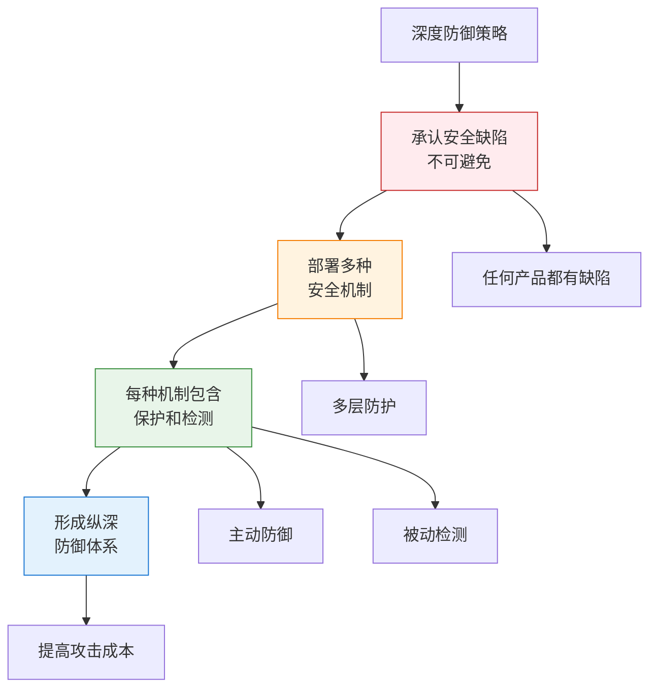
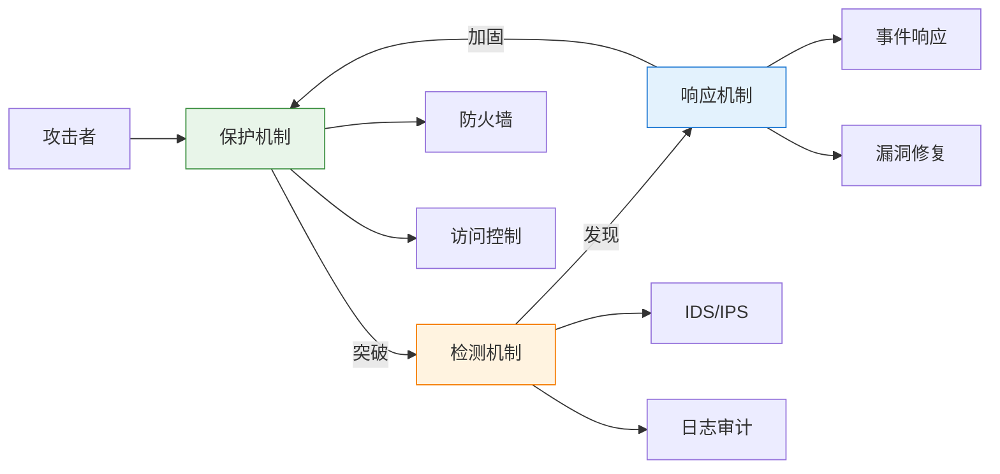
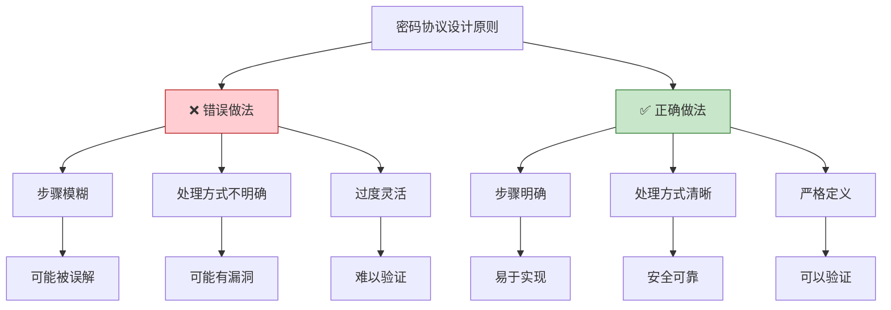
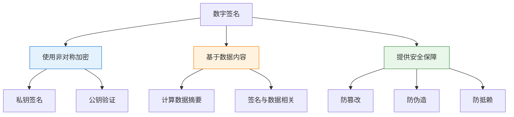
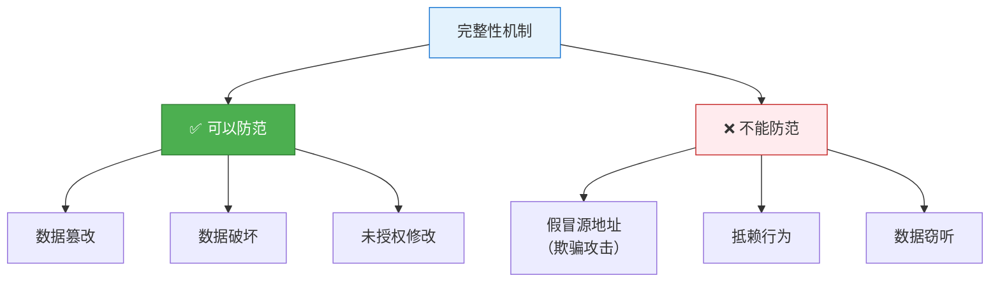
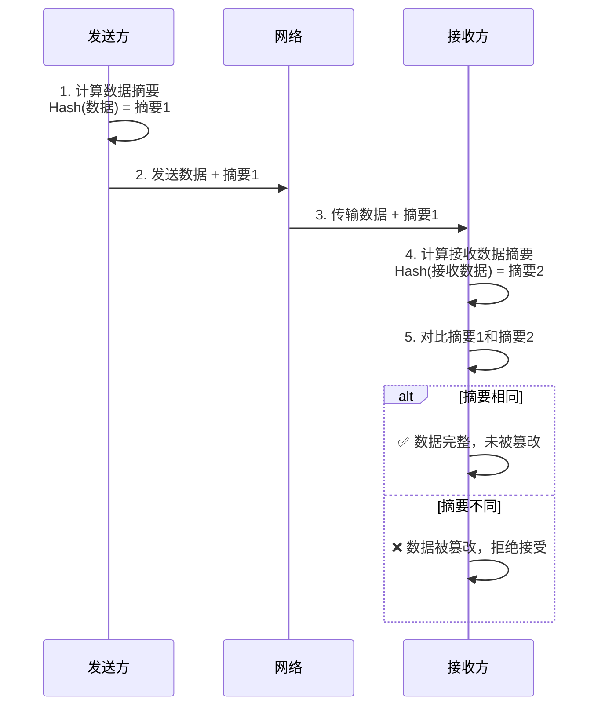
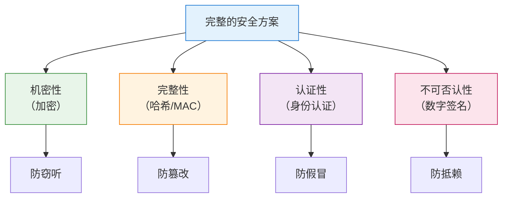
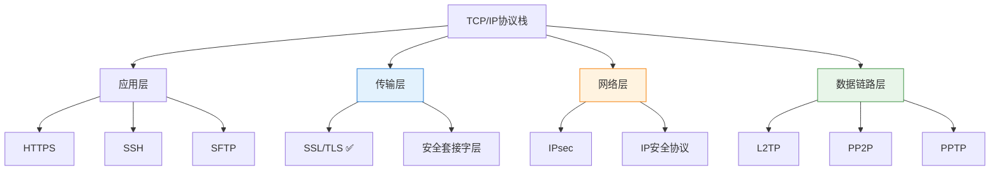

---
title: "CISP学习指南：安全机制、密码协议与数字签名"
date: 2025-10-20
categories:
  - Cybersecurity
tags:
  - CISP
excerpt: "深入解析CISP认证中的安全机制、密码协议设计原则和数字签名应用知识点。"
lang: zh-CN
available_langs: []
permalink: /zh-CN/2025/10/CISP-Security-Mechanisms-Protocols/
thumbnail: /assets/cisp/thumbnail.png
thumbnail_80: /assets/cisp/thumbnail_80.png
series: cisp
canonical_lang: zh-CN
---

安全机制和密码协议是构建安全系统的基础，理解其原理和应用对信息安全至关重要。

## 一、安全机制与深度防御

### 1.1 安全缺陷的普遍性

**安全产品的局限性：**

!!!anote "⚠️ 安全产品的现实"
    即使最好用的安全产品也存在安全缺陷。
    
    **为什么会存在安全缺陷：**
    
    🔧 **技术复杂性**
    - 软件系统复杂
    - 代码量庞大
    - 难以完全测试
    
    🔄 **持续演进**
    - 新威胁不断出现
    - 攻击技术进步
    - 零日漏洞存在
    
    👥 **人为因素**
    - 设计缺陷
    - 实现错误
    - 配置不当

### 1.2 多层防御策略

!!!anote "💡 深度防御的核心原则"
    **深度防御策略的关键要素：**
    
    即使最好用的安全产品也存在**安全缺陷**。结果，在任何的系统中敌手最终都能够找出一个被开发出的漏洞，一种有效的对策是在敌手和安全目标之间配备多种**安全机制**，每一种机制都应包括**保护和检测**两种手段。
    
    **三个关键概念：**
    
    🔓 **安全缺陷**
    - 任何安全产品都不可能完美
    - 总会存在未知漏洞
    - 需要承认这一现实
    
    🛡️ **多种安全机制**
    - 不依赖单一防护措施
    - 部署多层防御体系
    - 增加攻击难度和成本
    
    🔍 **保护和检测**
    - 保护：主动防御措施
    - 检测：被动监控措施
    - 两者缺一不可

**深度防御的核心思想：**



### 1.3 保护与检测机制

**安全机制的两种手段：**

```
安全机制的两种手段：
├── 1. 保护（Protection）
│   ├── 定义：主动防御措施
│   ├── 目的：阻止攻击发生
│   ├── 特点：
│   │   ├── 预防性
│   │   ├── 主动性
│   │   └── 实时性
│   └── 示例：
│       ├── 防火墙
│       ├── 访问控制
│       ├── 加密
│       ├── 身份认证
│       └── 安全配置
└── 2. 检测（Detection）
    ├── 定义：被动监控措施
    ├── 目的：发现攻击行为
    ├── 特点：
    │   ├── 响应性
    │   ├── 被动性
    │   └── 事后性
    └── 示例：
        ├── 入侵检测系统（IDS）
        ├── 日志审计
        ├── 异常监控
        ├── 安全扫描
        └── 行为分析
```

**保护与检测的关系：**



### 1.4 多层安全机制示例

**典型的多层防御架构：**

| 层次 | 保护机制 | 检测机制 | 目的 |
|------|---------|---------|------|
| 网络边界 | 防火墙、IPS | IDS、流量分析 | 阻止外部攻击 |
| 网络内部 | VLAN隔离、ACL | 网络监控、异常检测 | 限制横向移动 |
| 主机层 | 主机防火墙、加固 | 主机IDS、日志 | 保护单个系统 |
| 应用层 | WAF、输入验证 | 应用日志、审计 | 保护应用安全 |
| 数据层 | 加密、访问控制 | 数据审计、DLP | 保护数据安全 |

**为什么需要多种机制：**

!!!tip "🛡️ 多层防御的必要性"
    **单一机制的局限：**
    - 任何单一机制都可能被突破
    - 存在未知漏洞
    - 配置可能不当
    
    **多层防御的优势：**
    - 攻击者需要突破多道防线
    - 增加攻击难度和成本
    - 提供多次检测机会
    - 即使一层失效，其他层仍可防护
    
    **保护+检测的必要性：**
    - 保护机制可能被绕过
    - 检测机制提供第二道防线
    - 及时发现攻击行为
    - 支持事件响应和改进

## 二、密码协议

### 2.1 密码协议概述

**密码协议的定义：**

!!!anote "🔐 密码协议"
    **Cryptographic Protocol（也称安全协议 Security Protocol）**
    
    使用密码学完成某项特定任务并满足安全需求的协议。
    
    **核心特点：**
    
    📋 **定义明确**
    - 定义两方或多方之间的步骤
    - 为完成某项任务而制定
    - 每个参与方都必须了解协议
    
    🔄 **步骤执行**
    - 按照规定步骤执行
    - 顺序不能随意改变
    - 每步都有明确要求
    
    🎯 **安全目标**
    - 提供安全服务
    - 满足安全需求
    - 防止安全威胁

### 2.2 密码协议设计原则

!!!anote "💡 密码协议设计的正确原则"
    **密码协议设计的核心要求：**
    
    密码学是网络安全的基础，但网络安全不能单纯依靠安全的密码算法，密码协议也是网络安全的一个重要组成部分。
    
    ✅ **必须明确定义所有步骤**
    - 密码协议定义了两方或多方之间为完成某项任务而制定的一系列步骤
    - 协议中的每个参与方都必须了解协议，且按步骤执行
    - 所有步骤必须明确，不能模糊或不明确
    - 复杂步骤更需要明确处理方式，否则可能导致安全漏洞
    
    ✅ **适用于不同信任场景**
    - 根据密码协议应用目的的不同，参与该协议的双方可能是朋友和完全信任的人
    - 也可能是敌人和互相完全不信任的人
    - 可以是信任环境（如内部通信）
    - 也可以是零信任环境（如电子商务）
    
    ✅ **提供安全服务**
    - 密码协议（Cryptographic protocol），有时也称安全协议（security protocol）
    - 是使用密码学完成某项特定的任务并满足安全需求的协议
    - 其目的是提供安全服务
    
    ❌ **常见误区：过度灵活**
    - 不应按照灵活性好、可扩展性高的方式制定而不限制执行步骤
    - 不能让复杂的步骤处理方式不明确
    - 这会导致安全漏洞和实现不一致

**密码协议设计的正确原则：**



### 2.3 密码协议设计要求

**密码协议的关键要求：**

```
密码协议设计要求：
├── 1. 明确性
│   ├── 所有步骤必须明确定义
│   ├── 每个步骤的输入输出清晰
│   ├── 处理方式不能模糊
│   └── 异常情况有明确处理
├── 2. 完整性
│   ├── 覆盖所有可能场景
│   ├── 包含所有必要步骤
│   ├── 考虑边界条件
│   └── 处理错误情况
├── 3. 安全性
│   ├── 抵抗已知攻击
│   ├── 考虑潜在威胁
│   ├── 使用安全的密码算法
│   └── 正确使用密钥
├── 4. 可验证性
│   ├── 可以形式化验证
│   ├── 可以测试验证
│   ├── 安全属性可证明
│   └── 实现可审计
└── 5. 实用性
    ├── 效率合理
    ├── 易于实现
    ├── 兼容性好
    └── 可扩展性适当
```

### 2.4 密码协议的信任模型

**不同信任场景下的协议：**

| 信任关系 | 场景示例 | 协议特点 | 典型协议 |
|---------|---------|---------|---------|
| 完全信任 | 内部系统通信 | 相对简单，重点在效率 | Kerberos |
| 部分信任 | 企业间合作 | 需要验证，但有基础信任 | SSL/TLS |
| 零信任 | 电子商务 | 严格验证，不信任任何方 | SET协议 |
| 互不信任 | 匿名交易 | 最复杂，需要第三方 | 数字现金协议 |

**密码协议示例：**

!!!example "🔒 SSL/TLS握手协议"
    **步骤明确的协议示例：**
    
    1. **客户端Hello**
       - 发送支持的协议版本
       - 发送支持的加密套件
       - 发送随机数
    
    2. **服务器Hello**
       - 选择协议版本
       - 选择加密套件
       - 发送随机数
       - 发送服务器证书
    
    3. **客户端验证**
       - 验证服务器证书
       - 生成预主密钥
       - 用服务器公钥加密
       - 发送给服务器
    
    4. **密钥协商**
       - 双方计算会话密钥
       - 切换到加密通信
    
    **每个步骤都有明确定义，不能省略或模糊处理。**

## 三、数字签名应用

### 3.1 数字签名功能回顾

**数字签名的核心功能：**

!!!anote "💡 数字签名的正确理解"
    **数字签名的核心特性：**
    
    ✅ **与数据密切相关**
    - 数字签名不是和传输数据毫无关系的数字信息
    - 签名是对数据摘要的加密
    - 签名值由数据内容决定
    - 数据改变，签名也会改变
    
    ✅ **使用非对称加密**
    - 数字签名使用非对称加密机制，不是对称加密
    - 用私钥签名
    - 用公钥验证
    - 保证只有持有私钥的人能签名
    
    ✅ **解决篡改和伪造问题**
    - 防止数据被篡改（完整性）
    - 防止签名被伪造（认证性）
    - 防止发送方抵赖（不可否认性）
    - 这是数字签名的核心功能
    
    ❌ **不提供加密功能**
    - 数字签名不能解决数据的加密传输问题
    - 签名只提供认证和完整性
    - 不提供机密性保护
    - 需要结合加密才能保密传输

**数字签名的正确理解：**



### 3.2 数字签名的工作原理

**签名生成和验证过程：**

```
数字签名流程：
├── 签名生成（发送方）
│   ├── 1. 计算消息摘要
│   │   └── Hash(消息) = 摘要
│   ├── 2. 用私钥加密摘要
│   │   └── Encrypt(摘要, 私钥) = 签名
│   └── 3. 附加签名发送
│       └── 发送：消息 + 签名
└── 签名验证（接收方）
    ├── 1. 计算接收消息的摘要
    │   └── Hash(接收消息) = 摘要1
    ├── 2. 用公钥解密签名
    │   └── Decrypt(签名, 公钥) = 摘要2
    └── 3. 对比两个摘要
        ├── 摘要1 == 摘要2 → 验证成功
        └── 摘要1 != 摘要2 → 验证失败
```

### 3.3 数字签名解决的问题

**数字签名的安全保障：**

| 安全问题 | 数字签名如何解决 | 原理 |
|---------|----------------|------|
| 篡改 | ✅ 能解决 | 数据改变导致摘要改变，签名验证失败 |
| 伪造 | ✅ 能解决 | 没有私钥无法生成有效签名 |
| 冒充 | ✅ 能解决 | 公钥验证确认发送方身份 |
| 抵赖 | ✅ 能解决 | 只有发送方有私钥，无法否认 |
| 窃听 | ❌ 不能解决 | 签名不加密消息内容 |
| 重放 | ⚠️ 需配合其他机制 | 需要添加时间戳或序列号 |

### 3.4 数字签名与加密的结合

**完整的安全通信方案：**

!!!tip "🔒 数字签名 + 加密 = 完整安全"
    **单独使用数字签名：**
    - ✅ 提供认证
    - ✅ 提供完整性
    - ✅ 提供不可否认性
    - ❌ 不提供机密性
    
    **结合加密使用：**
    - 先签名后加密
    - 或先加密后签名
    - 提供完整的安全保障
    
    **完整流程：**
    1. 发送方用私钥签名（认证）
    2. 发送方用接收方公钥加密（保密）
    3. 接收方用私钥解密（获取内容）
    4. 接收方用发送方公钥验证（验证身份）

## 四、完整性机制

### 4.1 完整性机制的作用

**完整性机制可以防范的攻击：**



!!!success "✅ 完整性机制防范的攻击"
    **数据传输中被篡改或破坏**
    
    完整性机制的核心作用是确保数据在传输或存储过程中未被篡改或破坏。
    
    **工作原理：**
    
    🔍 **检测篡改**
    - 通过哈希函数计算数据摘要
    - 接收方重新计算并对比摘要
    - 摘要不一致则说明数据被篡改
    
    🛡️ **保护完整性**
    - 确保数据的准确性
    - 确保数据的一致性
    - 确保数据的未被修改性
    
    🔐 **常用技术**
    - 消息摘要（MD5、SHA系列）
    - 消息认证码（MAC、HMAC）
    - 数字签名（结合非对称加密）

!!!warning "❌ 完整性机制不能防范的攻击"
    
    **A. 假冒源地址或用户的地址的欺骗攻击**
    - 这需要**认证机制**来防范
    - 完整性机制只能确保数据未被篡改
    - 不能验证数据来源的真实性
    
    **B. 抵赖做过信息的递交行为**
    - 这需要**不可否认机制**（如数字签名）来防范
    - 完整性机制不能证明谁发送了数据
    - 不能防止发送方否认发送行为
    
    **C. 数据传输中被窃听获取**
    - 这需要**机密性机制**（加密）来防范
    - 完整性机制不加密数据内容
    - 不能防止数据被窃听

### 4.2 安全机制与防范攻击的对应关系

**不同安全机制防范的攻击类型：**

| 安全机制 | 防范的攻击 | 实现技术 | CIA属性 |
|---------|-----------|---------|--------|
| **完整性机制** | 数据篡改、数据破坏 | 哈希函数、MAC、数字签名 | Integrity（完整性） |
| 认证机制 | 假冒、欺骗攻击 | 身份认证、消息认证 | Authenticity（认证性） |
| 机密性机制 | 窃听、信息泄露 | 对称加密、非对称加密 | Confidentiality（机密性） |
| 不可否认机制 | 抵赖行为 | 数字签名、审计日志 | Non-repudiation（不可否认性） |
| 可用性机制 | 拒绝服务攻击 | 冗余、负载均衡 | Availability（可用性） |

### 4.3 完整性机制的实现技术

**常用的完整性保护技术：**

```
完整性机制实现技术：
├── 1. 哈希函数（Hash Function）
│   ├── MD5（已不推荐）
│   ├── SHA-1（已不推荐）
│   ├── SHA-256（推荐）
│   ├── SHA-512（推荐）
│   └── 特点：
│       ├── 单向性：不可逆
│       ├── 唯一性：不同输入产生不同输出
│       └── 固定长度：输出长度固定
├── 2. 消息认证码（MAC）
│   ├── HMAC（基于哈希的MAC）
│   ├── CMAC（基于分组密码的MAC）
│   └── 特点：
│       ├── 需要共享密钥
│       ├── 同时提供完整性和认证
│       └── 防止篡改和伪造
└── 3. 数字签名
    ├── RSA签名
    ├── DSA签名
    ├── ECDSA签名
    └── 特点：
        ├── 使用非对称加密
        ├── 提供完整性、认证和不可否认性
        └── 可以公开验证
```

**完整性机制的工作流程：**



### 4.4 完整性机制的局限性

**完整性机制的能力边界：**

!!!anote "💡 完整性机制的能力与局限"
    
    **✅ 完整性机制能做什么：**
    - 检测数据是否被篡改
    - 检测数据是否被破坏
    - 确保数据的准确性和一致性
    - 发现未授权的修改
    
    **❌ 完整性机制不能做什么：**
    - 不能验证数据来源（需要认证机制）
    - 不能防止抵赖（需要数字签名）
    - 不能保护数据机密性（需要加密）
    - 不能防止重放攻击（需要时间戳或序列号）
    - 不能阻止篡改，只能检测篡改

**综合安全方案：**



**实际应用示例：**

| 应用场景 | 使用的完整性机制 | 目的 |
|---------|----------------|------|
| 文件下载 | SHA-256哈希值 | 验证文件未被篡改 |
| 软件分发 | 数字签名 | 验证软件完整性和来源 |
| 网络通信 | HMAC | 保护消息完整性 |
| 数据库 | 校验和 | 检测数据损坏 |
| 区块链 | 哈希链 | 确保交易记录不可篡改 |

### 4.5 完整性机制与其他安全机制的配合

**完整性机制通常需要与其他机制配合使用：**

!!!tip "🔒 安全机制的组合使用"
    
    **完整性 + 认证：**
    - 使用HMAC或数字签名
    - 既保证数据完整性，又验证来源
    - 防止篡改和假冒
    
    **完整性 + 机密性：**
    - 先加密后计算MAC（Encrypt-then-MAC）
    - 或先计算MAC后加密（MAC-then-Encrypt）
    - 同时保护机密性和完整性
    
    **完整性 + 不可否认：**
    - 使用数字签名
    - 提供完整性、认证和不可否认性
    - 适用于需要法律效力的场景
    
    **完整性 + 时间戳：**
    - 防止重放攻击
    - 确保消息的时效性
    - 检测过期或重复的消息

## 五、TCP/IP协议栈安全协议

### 4.1 TCP/IP协议栈层次

!!!anote "💡 TCP/IP协议栈安全协议的层次划分"
    **各层安全协议的正确归属：**
    
    由于Internet的安全问题日益突出，基于TCP/IP协议相关组织和专家在协议的不同层次设计了相应的安全通信协议，用来保障网络各层次的安全。
    
    ✅ **传输层安全协议：SSL/TLS**
    - SSL（安全套接字层）属于传输层
    - 位于TCP和应用层之间
    - 为应用层协议提供安全服务
    - 典型应用：HTTPS、SMTPS、FTPS
    
    🌐 **网络层安全协议：IPsec**
    - IPsec（IP安全协议）属于网络层
    - 在IP层实现
    - 对IP数据包进行保护
    - 典型应用：VPN
    
    🔗 **数据链路层安全协议：L2TP、PP2P**
    - L2TP（第二层隧道协议）属于数据链路层
    - PP2P/PPTP（点对点隧道协议）属于数据链路层
    - 封装链路层帧
    - 典型应用：远程访问VPN

**TCP/IP协议栈安全协议分层：**



### 4.2 各层安全协议详解

**传输层安全协议：SSL/TLS**

!!!anote "🔐 SSL/TLS（传输层）"
    **SSL（Secure Sockets Layer）/ TLS（Transport Layer Security）**
    
    📍 **位置：传输层**
    - 位于TCP和应用层之间
    - 为应用层协议提供安全服务
    
    🎯 **主要功能：**
    - 数据加密传输
    - 服务器身份认证
    - 客户端身份认证（可选）
    - 数据完整性保护
    
    💼 **典型应用：**
    - HTTPS（HTTP over SSL/TLS）
    - SMTPS（邮件传输）
    - FTPS（文件传输）

**网络层安全协议：IPsec**

!!!anote "🛡️ IPsec（网络层）"
    **IPsec（Internet Protocol Security）**
    
    📍 **位置：网络层**
    - 在IP层实现
    - 对IP数据包进行保护
    
    🎯 **主要功能：**
    - IP数据包加密
    - 数据源认证
    - 数据完整性验证
    - 防重放攻击
    
    💼 **典型应用：**
    - VPN（虚拟专用网）
    - 站点到站点连接
    - 远程访问

**数据链路层安全协议：L2TP、PP2P**

!!!anote "🔗 L2TP/PP2P（数据链路层）"
    **L2TP（Layer 2 Tunneling Protocol）**
    
    📍 **位置：数据链路层**
    - 第二层隧道协议
    - 通常与IPsec结合使用
    
    🎯 **主要功能：**
    - 建立隧道连接
    - 封装PPP帧
    - 支持多协议
    
    **PP2P/PPTP（Point-to-Point Tunneling Protocol）**
    
    📍 **位置：数据链路层**
    - 点对点隧道协议
    - 较早的VPN协议
    
    💼 **典型应用：**
    - 远程拨号VPN
    - 企业远程访问

### 4.3 安全协议层次对比

**各层安全协议对比表：**

| 协议 | 所属层次 | 保护范围 | 优势 | 劣势 | 典型应用 |
|------|---------|---------|------|------|----------|
| SSL/TLS | 传输层 | 应用数据 | 易部署、广泛支持 | 只保护应用层 | HTTPS、邮件 |
| IPsec | 网络层 | IP数据包 | 透明、全面保护 | 配置复杂 | VPN、站点互联 |
| L2TP | 数据链路层 | 链路层帧 | 支持多协议 | 需配合IPsec | 远程访问VPN |
| PP2P/PPTP | 数据链路层 | PPP连接 | 简单易用 | 安全性较弱 | 旧式VPN |

**协议选择建议：**

```
安全协议选择指南：
├── Web应用安全
│   └── 推荐：SSL/TLS（HTTPS）
├── 站点到站点VPN
│   └── 推荐：IPsec
├── 远程访问VPN
│   ├── 推荐：L2TP/IPsec
│   └── 备选：SSL VPN
└── 移动办公
    └── 推荐：SSL VPN或IPsec
```

### 4.4 协议层次记忆技巧

!!!tip "💡 记忆技巧"
    **按层次记忆：**
    
    🔝 **传输层：SSL/TLS**
    - S开头：Socket（套接字）
    - 在TCP之上
    - 为应用提供安全
    
    🌐 **网络层：IPsec**
    - IP开头：IP层协议
    - 保护IP数据包
    - VPN常用
    
    🔗 **数据链路层：L2TP、PP2P**
    - L2：Layer 2（第二层）
    - PP：Point-to-Point（点对点）
    - 链路层隧道

## 六、总结

安全机制、密码协议与数字签名的核心要点：

1. **安全机制**：多层防御，每层包含保护和检测两种手段
2. **完整性机制**：防范数据篡改和破坏，但不能防范假冒、抵赖和窃听
3. **密码协议**：必须明确定义所有步骤，不能模糊处理
4. **数字签名**：解决篡改和伪造问题，但不提供加密
5. **TCP/IP安全协议**：SSL/TLS（传输层）、IPsec（网络层）、L2TP/PP2P（数据链路层）

!!!success "🎯 关键要点"
    - 即使最好的安全产品也存在安全缺陷
    - 应配备多种安全机制形成深度防御
    - 每种安全机制应包括保护和检测两种手段
    - 密码协议必须明确定义所有步骤和处理方式
    - 复杂步骤更需要明确，不能模糊处理
    - 密码协议参与方可能完全信任或完全不信任
    - 数字签名基于数据内容，与数据密切相关
    - 数字签名使用非对称加密，不是对称加密
    - 数字签名能解决篡改、伪造等问题
    - 数字签名不能解决加密传输问题
    - **完整性机制防范数据篡改和破坏**
    - **完整性机制不能防范假冒、抵赖和窃听**
    - **不同安全机制防范不同类型的攻击**
    - SSL/TLS属于传输层安全协议
    - IPsec属于网络层安全协议
    - L2TP、PP2P属于数据链路层安全协议

!!!tip "💡 实践建议"
    - 实施多层安全防御策略
    - 每层部署保护和检测机制
    - 设计密码协议时明确所有步骤
    - 对复杂步骤进行详细定义
    - 根据信任关系选择合适的协议
    - 正确使用数字签名提供认证
    - 结合加密和签名实现完整安全
    - 定期审查和更新安全机制
