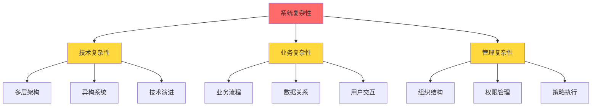
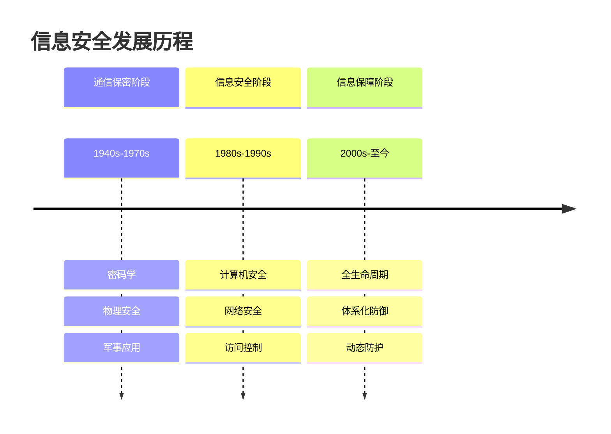
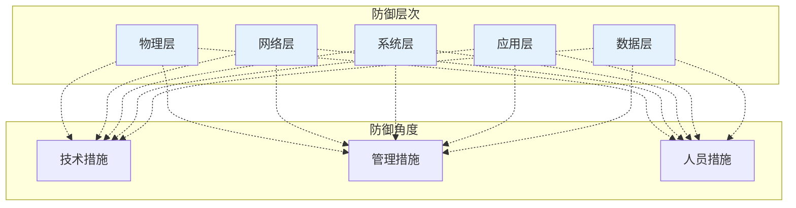
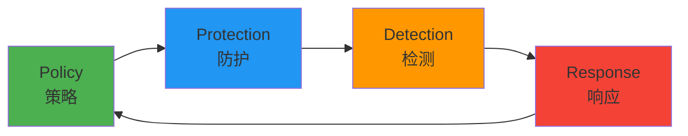
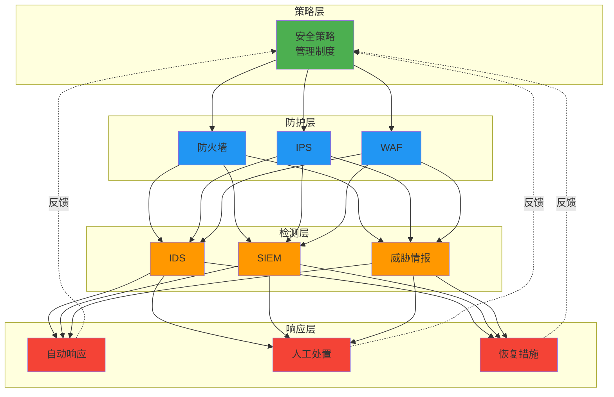
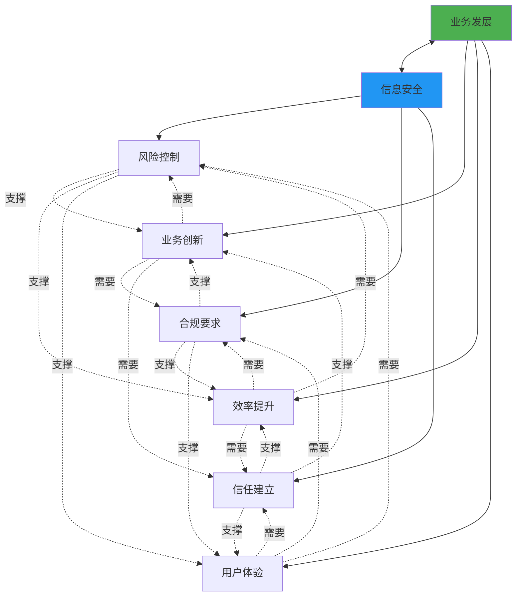

---
title: "CISP学习指南：信息安全模型与发展演进"
date: 2025-10-02
lang: zh-CN
available_langs: []
permalink: /zh-CN/2025/10/CISP-Security-Models-Evolution/
excerpt: "全面解析信息安全问题的根源、PDR/P2DR动态防御模型、CC标准评估体系，以及信息安全保障阶段的核心特征。"
tags:
  - CISP
categories:
  - Cybersecurity
thumbnail: /assets/cisp/thumbnail.png
thumbnail_80: /assets/cisp/thumbnail_80.png
---

## 信息安全问题的根源

### 问题产生的本质

信息安全问题的产生有其深层次的原因，理解这些根源对于构建有效的安全防护体系至关重要。

!!!anote "💡 核心观点"
    **信息安全问题产生的内因是信息系统的复杂性，外因是对手的威胁与破坏。**
    
    这是对信息安全问题根源最准确的描述。

### 内因：系统复杂性

#### 复杂性的来源



**技术层面的复杂性**：
- 多层次的系统架构（网络层、系统层、应用层）
- 异构系统的集成
- 新旧技术的并存
- 第三方组件的依赖

**业务层面的复杂性**：
- 复杂的业务逻辑
- 多样化的用户需求
- 频繁的业务变更
- 跨部门的协作

**管理层面的复杂性**：
- 组织结构的复杂性
- 权限管理的复杂性
- 策略执行的复杂性

!!!warning "⚠️ 复杂性带来的安全挑战"
    系统越复杂，潜在的安全漏洞就越多。复杂性是安全的天敌，因为：
    - 难以全面测试
    - 难以完整理解
    - 难以有效维护
    - 难以及时响应

### 外因：威胁与破坏

**威胁来源**：
- 黑客组织（追求名利）
- 犯罪集团（经济利益）
- 国家级APT（政治目的）
- 内部人员（恶意或疏忽）
- 自动化攻击（蠕虫、僵尸网络）

**攻击动机**：
- 经济利益
- 政治目的
- 技术挑战
- 报复心理
- 意识形态

### 其他相关因素

虽然不是根本原因，但以下因素也会影响安全问题的产生：

| 因素 | 影响 | 是否为根本原因 |
|------|------|---------------|
| 信息技术的发展 | 带来新的攻击面 | ❌ 否 |
| 黑客和犯罪集团 | 外部威胁的具体表现 | ❌ 否（是外因的一部分） |
| 设计开发疏忽 | 系统复杂性的体现 | ❌ 否（是内因的表现） |
| 系统复杂性+外部威胁 | 内外因结合 | ✅ 是 |

## 信息安全保障阶段的特征

### 信息安全发展的三个阶段



### 信息安全保障阶段的基本特征

#### ✅ 全生命周期安全要求

保护对象覆盖系统的整个生命周期：

```
规划 → 设计 → 开发 → 测试 → 部署 → 运维 → 退役
  ↓      ↓      ↓      ↓      ↓      ↓      ↓
安全   安全   安全   安全   安全   安全   安全
需求   设计   编码   测试   加固   监控   销毁
```

#### ✅ 多层次多角度体系化防御

**纵深防御架构**：



#### ✅ 动态发展变化

安全保障是一个持续的过程，需要：
- 持续监控
- 动态评估
- 及时响应
- 不断改进

#### ❌ 不具有的特征

!!!error "🚫 错误理解"
    **"具有高度复杂性和不能控制的特点"** 不是信息安全保障阶段的特征。
    
    虽然信息系统本身具有复杂性，但信息安全保障的目标恰恰是通过体系化的方法来**控制和管理**这种复杂性，而不是认为其"不能控制"。

## PDR与P2DR模型

### PDR模型

PDR模型是一个动态的安全模型，包含三个核心要素：

**Protection（防护）**：
- 防火墙
- 访问控制
- 加密技术
- 安全配置

**Detection（检测）**：
- 入侵检测系统（IDS）
- 日志分析
- 异常检测
- 安全审计

**Response（响应）**：
- 事件响应
- 应急处置
- 恢复措施
- 改进优化

### P2DR模型

P2DR模型在PDR基础上增加了Policy（策略）要素：



**Policy（策略）**：
- 安全策略制定
- 标准规范
- 管理制度
- 技术规范

### 模型特点分析

#### ✅ 正确理解

**1. 引入动态时间基线**

模型强调时间因素的重要性：

```
Pt = Et + Dt + Rt

其中：
Pt：系统的安全周期
Et：暴露时间（从漏洞出现到被发现）
Dt：检测时间（从攻击开始到被检测）
Rt：响应时间（从检测到响应完成）
```

**目标**：使 Pt > 攻击时间，确保在攻击成功前完成防护

**2. 强调持续的保护和响应**

安全不是一次性的工作，而是持续的循环过程：

```
监控 → 检测 → 分析 → 响应 → 改进 → 监控 ...
```

**3. 引入多层防御机制**

符合安全的"木桶原理"：
- 不依赖单点防护
- 多层次纵深防御
- 整体安全水平取决于最薄弱环节

#### ❌ 错误理解

!!!error "🚫 常见误解"
    **"模型是基于人为的管理和控制而运行的"** 是错误的理解。
    
    P2DR模型虽然包含策略（Policy）要素，但其核心是**自动化的动态循环机制**，而不是完全依赖人为管理。模型强调：
    - 自动化检测
    - 快速响应
    - 动态调整
    - 持续改进

### PDR/P2DR模型的实践应用

**安全运营中心（SOC）架构**：



## CC标准（Common Criteria）

### CC标准概述

CC标准（ISO/IEC 15408）是国际通行的信息安全技术产品安全性评价规范。

**全称**：Common Criteria for Information Technology Security Evaluation

**版本**：当前为3.1版本

### CC标准的先进性

#### ✅ 先进特性

**1. 基于保护轮廓和安全目标**

```
保护轮廓（PP）
    ↓
安全目标（ST）
    ↓
安全功能要求（SFR）
    ↓
安全保证要求（SAR）
```

- **灵活性**：可根据不同需求定制
- **合理性**：基于实际威胁和风险

**2. 功能要求和保证要求分离**

| 类型 | 关注点 | 评估内容 |
|------|--------|---------|
| 功能要求（SFR） | 做什么 | 安全功能的完整性 |
| 保证要求（SAR） | 如何做 | 开发和评估的可信度 |

**3. 多维度安全要求**

不仅考虑保密性，还包括：
- **保密性**（Confidentiality）
- **完整性**（Integrity）
- **可用性**（Availability）
- **真实性**（Authenticity）
- **不可否认性**（Non-repudiation）

#### ❌ 错误理解

!!!error "🚫 常见错误"
    **"它划分为A、B、C、D四个等级"** 是错误的。
    
    这是TCSEC（橙皮书）的等级划分方式，不是CC标准的评估方式。

### CC标准的评估等级

CC标准使用**EAL（Evaluation Assurance Level）**评估保证等级：

| EAL等级 | 名称 | 描述 |
|---------|------|------|
| EAL1 | 功能测试 | 最基本的保证 |
| EAL2 | 结构测试 | 需要开发者配合 |
| EAL3 | 系统测试和检查 | 需要开发文档 |
| EAL4 | 系统设计、测试和审查 | 商业产品常用等级 |
| EAL5 | 半形式化设计和测试 | 高安全产品 |
| EAL6 | 半形式化验证设计和测试 | 专用安全产品 |
| EAL7 | 形式化验证设计和测试 | 最高安全等级 |

### CC标准 vs TCSEC

| 特性 | CC标准 | TCSEC（橙皮书） |
|------|--------|----------------|
| 等级划分 | EAL1-7 | D, C1, C2, B1, B2, B3, A1 |
| 评估对象 | 多种IT产品 | 主要针对操作系统 |
| 灵活性 | 高（基于PP/ST） | 低（固定要求） |
| 国际认可 | 广泛认可 | 已被CC取代 |
| 发布时间 | 1999年 | 1983年 |

### CC标准的核心概念

#### 保护轮廓（Protection Profile, PP）

对一类TOE（Target of Evaluation，评估对象）的安全需求进行与技术实现无关的描述。

**特点**：
- 独立于具体产品
- 描述安全需求
- 可重用
- 便于比较

#### 安全目标（Security Target, ST）

对特定评估对象的安全声明。

**内容**：
- TOE描述
- 安全环境
- 安全目标
- 功能要求
- 保证要求

#### 评估流程


## 信息安全与业务发展的关系

### 核心关系

!!!anote "💡 准确定位"
    **信息安全为业务发展提供基础安全保障。**
    
    这是对信息安全与业务发展关系最准确的描述。

### 安全与业务的平衡



### 投资收益的特点

**安全投资的特殊性**：

| 特点 | 说明 |
|------|------|
| 难以量化 | 收益主要体现在"避免损失" |
| 长期性 | 效果需要长期观察 |
| 间接性 | 通过支撑业务产生价值 |
| 必要性 | 是业务运行的基础条件 |

!!!warning "⚠️ 常见误区"
    - ❌ "安全投入很容易测算收益" - 错误，安全收益难以直接量化
    - ❌ "安全投入不能测算收益" - 过于绝对，可以通过风险评估间接评估
    - ✅ "安全为业务提供基础保障" - 正确，这是安全的核心价值

### 安全投资的价值评估

**风险避免价值**：
```
安全投资价值 = 潜在损失 × 风险降低比例 - 安全投资成本

其中：
潜在损失 = 事件影响 × 发生概率
风险降低比例 = 安全措施的有效性
```

**业务支撑价值**：
- 提升客户信任
- 满足合规要求
- 支持业务创新
- 保护品牌声誉

## 总结

!!!tip "📝 关键要点"
    1. **安全问题根源**：内因是系统复杂性，外因是威胁与破坏
    2. **保障阶段特征**：全生命周期、体系化防御、动态发展
    3. **PDR/P2DR模型**：动态循环、自动化运行、多层防御
    4. **CC标准**：EAL1-7等级、灵活的PP/ST机制、多维度评估
    5. **安全与业务**：安全为业务提供基础保障，收益难以直接量化

## 相关资源

- [Common Criteria Portal](https://www.commoncriteriaportal.org/)
- [ISO/IEC 15408 Standard](https://www.iso.org/standard/72891.html)
- [NIST Cybersecurity Framework](https://www.nist.gov/cyberframework)
