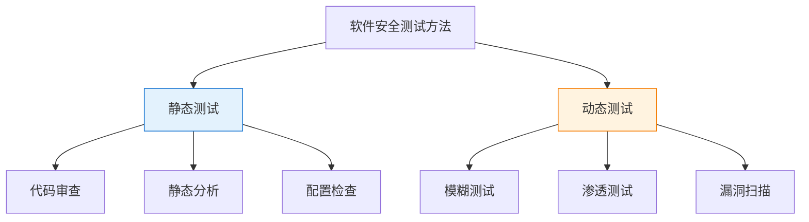
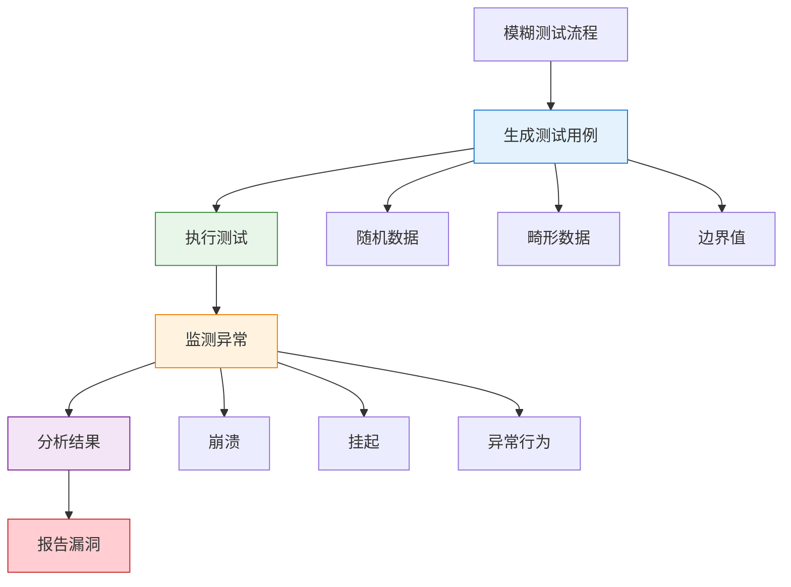
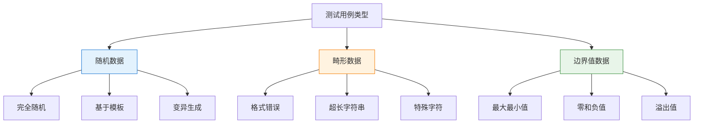
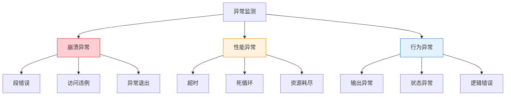
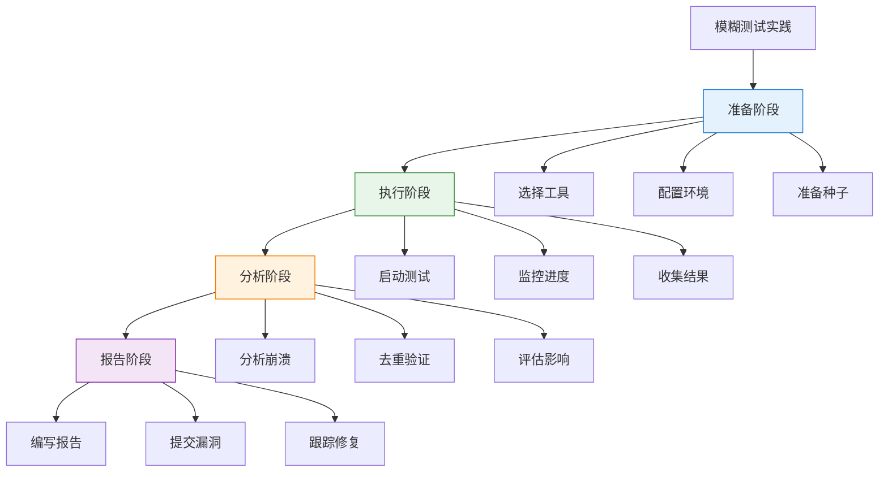

---
title: "CISP学习指南：软件测试与安全"
date: 2025-10-19
categories:
  - Cybersecurity
tags:
  - CISP
excerpt: "深入解析CISP认证中的软件安全测试方法，重点讲解模糊测试（Fuzzing）的原理、流程和应用。"
lang: zh-CN
available_langs: []
permalink: /zh-CN/2025/10/CISP-Software-Testing-Security/
thumbnail: /assets/cisp/thumbnail.png
thumbnail_80: /assets/cisp/thumbnail_80.png
series: cisp
canonical_lang: zh-CN
---

软件安全测试是发现软件漏洞和安全缺陷的重要手段，模糊测试作为一种自动化测试方法，在安全测试中发挥着重要作用。

## 一、软件安全测试概述

### 1.1 软件安全测试的重要性

**软件安全测试的目标：**

!!!anote "🎯 软件安全测试"
    软件安全测试是通过各种测试方法和技术，发现软件中存在的安全漏洞和缺陷，评估软件的安全性。
    
    **核心目标：**
    
    🔍 **发现漏洞**
    - 识别安全缺陷
    - 发现潜在威胁
    - 评估安全风险
    
    🛡️ **提升安全性**
    - 修复安全问题
    - 加固安全防护
    - 降低安全风险
    
    ✅ **验证有效性**
    - 验证安全控制
    - 测试防护措施
    - 确保安全要求

### 1.2 软件安全测试方法

**常见的软件安全测试方法：**



**测试方法对比：**

| 测试方法 | 类型 | 特点 | 优势 | 局限性 |
|---------|------|------|------|--------|
| 代码审查 | 静态 | 人工检查代码 | 深入全面 | 耗时耗力 |
| 静态分析 | 静态 | 工具自动分析 | 快速高效 | 误报率高 |
| 模糊测试 | 动态 | 异常输入测试 | 发现未知漏洞 | 覆盖率有限 |
| 渗透测试 | 动态 | 模拟攻击 | 真实场景 | 需要专业技能 |
| 漏洞扫描 | 动态 | 自动化扫描 | 快速便捷 | 仅发现已知漏洞 |

## 二、模糊测试（Fuzzing）

### 2.1 模糊测试概述

**模糊测试的定义：**

!!!anote "💡 什么是模糊测试"
    模糊测试（Fuzzing）是一种自动化的软件测试技术，通过向程序输入大量随机、畸形或异常的数据，监测程序的异常行为，从而发现潜在的安全漏洞。
    
    **核心特点：**
    
    🎲 **随机性**
    - 生成随机测试数据
    - 模拟异常输入
    - 覆盖边界情况
    
    🤖 **自动化**
    - 自动生成测试用例
    - 自动执行测试
    - 自动监测异常
    
    🔍 **黑盒测试**
    - 不需要源代码
    - 不需要了解内部结构
    - 关注输入输出行为



### 2.2 模糊测试过程

!!!anote "💡 模糊测试过程"
    **模糊测试的完整过程包括：**
    
    **1️⃣ 生成测试用例**
    - ✅ 生成大量随机、畸形、边界值数据
    - ✅ 模拟异常输入，不是正常用户输入
    - ✅ 覆盖各种异常情况
    
    **2️⃣ 选择测试对象**
    - ✅ 数据处理点：处理外部输入的位置
    - ✅ 入口点：程序接收输入的接口
    - ✅ 可信边界：信任域和非信任域的交界
    
    **3️⃣ 执行测试**
    - ✅ 向目标程序输入测试数据
    - ✅ 观察程序运行状态
    - ✅ 记录测试过程
    
    **4️⃣ 监测和记录**
    - ✅ 监测程序异常运行
    - ✅ 记录崩溃情况
    - ✅ 捕获异常信息
    
    **5️⃣ 分析和重现**
    - ✅ 深入分析崩溃原因
    - ✅ 必要时手工重现
    - ✅ 确定漏洞性质

**模糊测试详细流程：**

```
模糊测试完整流程：
├── 第一步：确定测试目标
│   ├── 识别测试对象
│   ├── 确定测试范围
│   ├── 选择测试点
│   └── 定义测试目标
├── 第二步：生成测试用例
│   ├── 随机数据生成
│   │   ├── 完全随机
│   │   ├── 伪随机
│   │   └── 基于种子
│   ├── 畸形数据生成
│   │   ├── 格式错误
│   │   ├── 类型错误
│   │   └── 结构错误
│   └── 边界值生成
│       ├── 最大值
│       ├── 最小值
│       ├── 零值
│       └── 负值
├── 第三步：选择测试对象
│   ├── 数据处理点
│   │   ├── 文件解析
│   │   ├── 网络协议
│   │   └── API接口
│   ├── 入口点
│   │   ├── 命令行参数
│   │   ├── 配置文件
│   │   └── 用户输入
│   └── 可信边界
│       ├── 外部输入
│       ├── 网络数据
│       └── 文件读取
├── 第四步：执行测试
│   ├── 输入测试数据
│   ├── 运行目标程序
│   ├── 监控程序状态
│   └── 记录执行过程
├── 第五步：监测和记录
│   ├── 崩溃检测
│   │   ├── 段错误
│   │   ├── 访问违例
│   │   └── 异常退出
│   ├── 异常检测
│   │   ├── 超时
│   │   ├── 死循环
│   │   └── 资源耗尽
│   └── 日志记录
│       ├── 输入数据
│       ├── 崩溃信息
│       └── 堆栈跟踪
└── 第六步：分析和报告
    ├── 深入分析
    │   ├── 确定漏洞类型
    │   ├── 评估安全影响
    │   └── 分析利用可能
    ├── 手工重现
    │   ├── 验证漏洞
    │   ├── 简化测试用例
    │   └── 确认触发条件
    └── 编写报告
        ├── 漏洞描述
        ├── 重现步骤
        ├── 影响评估
        └── 修复建议
```

### 2.3 测试用例生成

**测试用例的类型：**



**测试数据生成策略：**

| 策略 | 说明 | 示例 | 适用场景 |
|------|------|------|----------|
| 随机生成 | 完全随机的数据 | 随机字节流 | 初步测试 |
| 变异生成 | 基于有效数据变异 | 修改部分字节 | 格式化数据 |
| 模板生成 | 基于数据模板 | 按协议格式生成 | 协议测试 |
| 字典生成 | 使用预定义字典 | SQL关键字 | 特定漏洞 |

### 2.4 测试对象选择

**重点测试对象：**

!!!tip "🎯 模糊测试的重点对象"
    **数据处理点（Data Processing Points）**
    - 文件解析器：图片、文档、音视频
    - 协议解析器：网络协议、通信协议
    - 数据转换器：编码转换、格式转换
    
    **入口点（Entry Points）**
    - 命令行参数：程序启动参数
    - 配置文件：配置项和参数
    - 用户输入：表单、对话框
    - API接口：函数调用接口
    
    **可信边界（Trust Boundaries）**
    - 外部输入：来自不可信源的数据
    - 网络数据：网络接收的数据
    - 文件读取：外部文件内容
    - 进程间通信：IPC数据

**测试对象优先级：**

```
测试对象优先级排序：
├── 高优先级
│   ├── 处理外部输入的代码
│   ├── 网络协议解析
│   ├── 文件格式解析
│   └── 权限检查代码
├── 中优先级
│   ├── 数据验证代码
│   ├── 字符串处理
│   ├── 内存操作
│   └── 数学运算
└── 低优先级
    ├── 内部函数
    ├── 辅助功能
    └── 日志记录
```

### 2.5 异常监测

**监测的异常类型：**



**异常监测方法：**

| 监测方法 | 说明 | 工具 | 检测内容 |
|---------|------|------|----------|
| 调试器监控 | 使用调试器附加 | GDB, WinDbg | 崩溃、异常 |
| 系统监控 | 监控系统调用 | strace, Process Monitor | 系统调用异常 |
| 内存检测 | 检测内存错误 | Valgrind, ASan | 内存泄漏、越界 |
| 日志分析 | 分析程序日志 | 自定义脚本 | 错误日志 |

### 2.6 结果分析

**漏洞分析流程：**

```
漏洞分析流程：
├── 1. 初步分析
│   ├── 确认崩溃可重现
│   ├── 收集崩溃信息
│   ├── 分析堆栈跟踪
│   └── 识别崩溃位置
├── 2. 深入分析
│   ├── 分析崩溃原因
│   │   ├── 缓冲区溢出
│   │   ├── 空指针引用
│   │   ├── 整数溢出
│   │   └── 格式化字符串
│   ├── 评估安全影响
│   │   ├── 拒绝服务
│   │   ├── 信息泄露
│   │   ├── 代码执行
│   │   └── 权限提升
│   └── 分析利用难度
│       ├── 容易利用
│       ├── 中等难度
│       └── 难以利用
├── 3. 手工重现
│   ├── 简化测试用例
│   ├── 确定最小输入
│   ├── 验证触发条件
│   └── 编写PoC
└── 4. 编写报告
    ├── 漏洞描述
    ├── 影响范围
    ├── 重现步骤
    ├── 技术细节
    └── 修复建议
```

## 三、模糊测试的特点

### 3.1 模糊测试的优势

**模糊测试的主要优势：**

!!!success "✅ 模糊测试的优点"
    **1️⃣ 黑盒测试方法**
    - 不需要了解程序内部结构
    - 不需要源代码
    - 适用于闭源软件
    - 降低测试门槛
    
    **2️⃣ 自动化程度高**
    - 自动生成测试用例
    - 自动执行测试
    - 自动监测异常
    - 提高测试效率
    
    **3️⃣ 发现未知漏洞**
    - 不依赖漏洞特征库
    - 可以发现0day漏洞
    - 覆盖意外情况
    - 发现逻辑错误
    
    **4️⃣ 适合特定漏洞**
    - 输入验证漏洞
    - 边界检查错误
    - 内存安全问题
    - 异常处理缺陷

### 3.2 模糊测试的局限性

**模糊测试的主要局限：**

!!!warning "⚠️ 模糊测试的缺点"
    **1️⃣ 覆盖率有限**
    - 难以覆盖所有代码路径
    - 深层逻辑难以触发
    - 依赖随机性
    
    **2️⃣ 需要人工分析**
    - 需要分析崩溃原因
    - 需要确定漏洞性质
    - 需要评估安全影响
    - 需要编写利用代码
    
    **3️⃣ 误报和漏报**
    - 可能产生误报
    - 可能遗漏漏洞
    - 需要人工验证
    
    **4️⃣ 资源消耗大**
    - 需要大量计算资源
    - 测试时间长
    - 存储空间需求大

### 3.3 模糊测试工具

**常见的模糊测试工具：**

| 工具 | 类型 | 特点 | 适用场景 |
|------|------|------|----------|
| AFL | 覆盖率引导 | 高效、智能 | 通用程序 |
| libFuzzer | 覆盖率引导 | 集成LLVM | C/C++程序 |
| Peach | 基于模板 | 支持协议 | 协议测试 |
| Sulley | 基于模板 | 网络协议 | 网络服务 |
| Radamsa | 变异生成 | 简单易用 | 文件格式 |
| Honggfuzz | 覆盖率引导 | 多平台 | 通用程序 |

## 四、模糊测试实践

### 4.1 模糊测试流程

**实际应用中的模糊测试流程：**



### 4.2 最佳实践

**模糊测试的最佳实践：**

```
模糊测试最佳实践：
├── 测试准备
│   ├── 选择合适的工具
│   ├── 准备高质量种子
│   ├── 配置监控环境
│   └── 设置合理参数
├── 测试执行
│   ├── 持续运行测试
│   ├── 监控测试进度
│   ├── 定期检查结果
│   └── 调整测试策略
├── 结果分析
│   ├── 及时分析崩溃
│   ├── 去重相同问题
│   ├── 优先处理高危
│   └── 验证漏洞真实性
└── 持续改进
    ├── 总结测试经验
    ├── 优化测试策略
    ├── 更新种子库
    └── 改进工具配置
```

## 五、总结

软件测试与安全的核心要点：

1. **模糊测试**：自动化的黑盒测试方法，通过异常输入发现漏洞
2. **测试流程**：生成测试用例→选择测试对象→执行测试→监测异常→分析结果
3. **测试对象**：数据处理点、入口点、可信边界是重点
4. **测试特点**：自动化程度高，可发现未知漏洞，但需要人工分析

!!!success "🎯 关键要点"
    - 模糊测试模拟异常输入，不是正常用户输入
    - 生成大量随机、畸形、边界值数据作为测试用例
    - 数据处理点、入口点、可信边界是重点测试对象
    - 监测和记录程序异常运行和崩溃情况
    - 深入分析崩溃原因，必要时手工重现
    - 黑盒测试方法，不需要了解程序内部结构
    - 自动化程度高，可以发现未知漏洞
    - 适合发现输入验证、边界检查等问题
    - 需要结合人工分析确定漏洞性质

!!!tip "💡 实践建议"
    - 选择合适的模糊测试工具
    - 准备高质量的种子文件
    - 持续运行测试以提高覆盖率
    - 及时分析和验证发现的问题
    - 结合其他测试方法综合评估
    - 建立漏洞管理和跟踪机制
