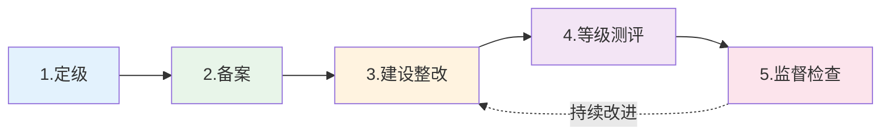
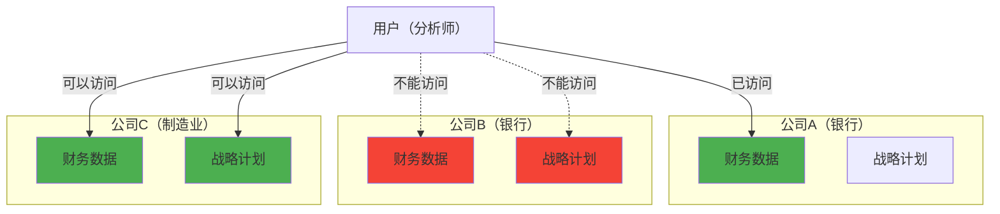

---
title: "CISP学习指南：标准规范与管理实践"
date: 2025-10-02
lang: zh-CN
available_langs: []
permalink: /zh-CN/2025/10/CISP-Standards-Management/
excerpt: "深入解析信息安全标准体系、等级保护、风险管理、访问控制模型等管理类知识点。"
tags:
  - CISP
categories:
  - Cybersecurity
thumbnail: /assets/cisp/thumbnail.png
thumbnail_80: /assets/cisp/thumbnail_80.png
---

## 一、信息系统安全等级保护

### 1.1 等级保护定级要素

!!!anote "📊 等级保护定级依据"
    **信息系统的安全保护等级由两个定级要素决定：**
    
    🎯 **受侵害的客体**
    - 公民、法人和其他组织的合法权益
    - 社会秩序、公共利益
    - 国家安全
    
    📈 **对客体造成侵害的程度**
    - 一般损害
    - 严重损害
    - 特别严重损害

**等级保护五个等级：**

| 等级 | 名称 | 受侵害客体 | 侵害程度 |
|------|------|----------|---------|
| 第一级 | 自主保护级 | 公民、法人、组织 | 一般损害 |
| 第二级 | 指导保护级 | 公民、法人、组织 | 严重损害 |
| 第三级 | 监督保护级 | 社会秩序、公共利益 | 严重损害 |
| 第四级 | 强制保护级 | 社会秩序、公共利益 | 特别严重损害 |
| 第五级 | 专控保护级 | 国家安全 | 特别严重损害 |

### 1.2 等级保护工作环节

!!!anote "🔄 等级保护工作流程"
    **等级保护工作五个环节：定级-备案-建设整改-等级测评-监督检查**
    
    1️⃣ **定级**
    - 确定保护等级
    - 编写定级报告
    - 专家评审
    
    2️⃣ **备案**
    - 向公安机关备案
    - 提交备案材料
    - 获取备案证明
    
    3️⃣ **建设整改**
    - 安全建设
    - 安全整改
    - 符合等级要求
    
    4️⃣ **等级测评**
    - 第三方测评
    - 出具测评报告
    - 发现问题
    
    5️⃣ **监督检查**
    - 公安机关检查
    - 持续改进
    - 定期复查



## 二、信息安全管理体系

!!!tip "🔗 ISMS详细内容"
    **关于ISMS的PDCA模型、控制措施、资产管理等详细内容，请参考：**
    
    📚 [CISP学习指南：信息安全管理体系与标准](/zh-CN/2025/10/CISP-ISMS-and-Standards/)
    
    **包括：**
    - ISMS的PDCA模型（Plan-Do-Check-Act）
    - ISO 27001控制措施范围
    - 资产管理控制目标
    - 管理层职责
    - ISMS变更通知

### 2.1 ISMS核心要点

!!!anote "📚 ISMS关键知识"
    **ISMS基于国际标准ISO/IEC 27001（不是27000）**
    
    **ISO 27002包含11个控制领域（不包括内容安全）**
    
    **ISO 27001来源于BS 7799-2**

## 三、安全评估标准

### 3.1 TCSEC标准

!!!anote "🟠 TCSEC（橙皮书）"
    **TCSEC的特点：**
    
    **主要用途：**
    - 为评估操作系统的可信赖程度提供方法
    - 专注于操作系统安全评估
    
    **评估范围：**
    - ✅ 操作系统安全
    - ❌ 不包括网络和通信安全评估
    - ❌ 不包括数据库系统安全评估
    
    **与其他标准的区别：**
    - CC标准明确区分安全功能和安全保证
    - TCSEC主要关注操作系统的可信计算基础

**TCSEC等级划分：**

| 等级 | 名称 | 特点 |
|------|------|------|
| D | 最小保护 | 不满足更高等级要求 |
| C1 | 自主安全保护 | 自主访问控制 |
| C2 | 受控访问保护 | 审计、登录控制 |
| B1 | 标记安全保护 | 强制访问控制 |
| B2 | 结构化保护 | 形式化安全策略 |
| B3 | 安全域 | 安全管理员 |
| A1 | 验证设计 | 形式化验证 |

### 3.2 保护轮廓（PP）

!!!anote "📝 保护轮廓定义"
    **保护轮廓（PP）的特点：**
    
    **核心定义：**
    - 对一类TOE（评估目标）的安全需求描述
    - 与技术实现无关
    
    **主要特征：**
    - 独立于具体产品
    - 描述安全需求
    - 可重用
    - 技术中立


## 四、风险管理

### 4.1 预期年度损失（ALE）

!!!anote "💰 ALE计算方法"
    **风险计算公式：**
    
    ```
    ALE = SLE × ARO
    
    其中：
    ALE (Annual Loss Expectancy) = 预期年度损失
    SLE (Single Loss Expectancy) = 单次预期损失
    ARO (Annual Rate of Occurrence) = 年发生率
    
    计算方法：预期年度损失 = 单次预期损失 × 年发生率
    ```

**风险评估相关概念：**

| 概念 | 英文 | 说明 | 计算方式 |
|------|------|------|---------|
| 资产价值 | AV | 资产的价值 | 评估确定 |
| 暴露因子 | EF | 损失比例 | 0-100% |
| 单次损失 | SLE | 单次事件损失 | AV × EF |
| 年发生率 | ARO | 年发生次数 | 统计分析 |
| 年度损失 | ALE | 年度预期损失 | SLE × ARO |

**ALE计算示例：**

```
假设：
- 服务器价值：100万元
- 硬盘故障导致损失：30%
- 年发生率：0.1次/年

计算：
SLE = 100万 × 30% = 30万元
ALE = 30万 × 0.1 = 3万元/年

结论：预期每年因硬盘故障损失3万元
```

## 五、访问控制模型

### 5.1 Chinese Wall模型

!!!anote "🧱 Chinese Wall模型"
    **Chinese Wall模型的核心原则：**
    
    **设计宗旨：**
    - 用户只能访问那些与已经拥有的信息不冲突的信息
    - 防止利益冲突
    
    🏦 **应用场景**
    - 金融机构
    - 咨询公司
    - 律师事务所
    - 需要防止利益冲突的组织
    
    🚧 **核心特点**
    - 防止信息流动
    - 避免利益冲突
    - 动态访问控制
    - 基于历史访问决策

**Chinese Wall模型示例：**



## 六、身份认证

### 6.1 鉴别方式

!!!anote "🔐 三种基本鉴别方式"
    **三种基本鉴别方式：**
    
    1️⃣ **你知道什么（What you know）**
    - 密码
    - PIN码
    - 安全问题答案
    
    2️⃣ **你有什么（What you have）**
    - 智能卡
    - USB令牌
    - 手机（接收验证码）
    
    3️⃣ **你是什么（What you are）**
    - 指纹
    - 虹膜
    - 面部识别
    - 声纹

**多因素认证（MFA）：**

| 因素数量 | 名称 | 安全性 | 示例 |
|---------|------|--------|------|
| 单因素 | Single-Factor | 低 | 仅密码 |
| 双因素 | Two-Factor (2FA) | 中 | 密码+短信验证码 |
| 多因素 | Multi-Factor (MFA) | 高 | 密码+指纹+令牌 |

## 七、人员安全管理

### 7.1 最大安全风险来源

!!!anote "👥 内部威胁"
    **内部员工的安全风险：**
    
    🔑 **访问权限**
    - 拥有合法访问权限
    - 了解系统架构
    - 知道数据位置
    
    💼 **内部知识**
    - 熟悉业务流程
    - 了解安全措施
    - 知道薄弱环节
    
    ⚠️ **威胁类型**
    - 恶意行为
    - 疏忽大意
    - 社会工程目标
    - 账号被盗用
    
    **风险程度：**
    - 当前员工是最大的安全风险来源
    - 拥有最多的访问权限和内部知识
    - 需要重点关注和管理

**内部威胁统计：**

```
内部威胁占比：
├── 当前员工：60%
├── 前员工：20%
├── 承包商/顾问：15%
└── 临时工：5%
```

### 7.2 员工离职安全措施

!!!anote "🚪 员工离职处理"
    **员工离职安全检查清单：**
    
    ✅ **立即执行**
    - 禁用所有账号
    - 收回门禁卡
    - 收回公司设备
    - 更改共享密码
    
    ✅ **文档处理**
    - 签署保密协议
    - 签署竞业禁止协议
    - 离职面谈记录
    - 资产交接清单
    
    ✅ **后续跟踪**
    - 监控异常访问
    - 审查数据传输
    - 定期检查

## 八、密码安全

### 8.1 密码生成方法

!!!anote "🔒 密码强度"
    **密码强度 vs 可记忆性：**
    
    | 方法 | 强度 | 可记忆性 | 推荐度 |
    |------|------|---------|--------|
    | 生日倒转 | ❌ 低 | ✅ 高 | 不推荐 |
    | 年薪倒转 | ❌ 低 | ✅ 高 | 不推荐 |
    | 配偶名字倒转 | ❌ 低 | ✅ 高 | 不推荐 |
    | 随机字母 | ✅ 高 | ❌ 低 | 推荐（配合密码管理器） |

**密码最佳实践：**

```
强密码要求：
├── 长度：至少12位
├── 复杂度
│   ├── 大写字母
│   ├── 小写字母
│   ├── 数字
│   └── 特殊字符
├── 避免
│   ├── 个人信息
│   ├── 常见单词
│   ├── 键盘序列
│   └── 重复使用
└── 管理
    ├── 使用密码管理器
    ├── 定期更换
    ├── 多因素认证
    └── 不同账号不同密码
```

### 8.2 破解口令攻击方式

!!!anote "🔨 口令破解"
    **口令破解方法对比：**
    
    | 方法 | 原理 | 速度 | 成功率 | 适用场景 |
    |------|------|------|--------|---------|
    | 字典攻击 | 常用密码列表 | 快 | 高 | 弱密码 |
    | 暴力破解 | 穷举所有组合 | 慢 | 100% | 短密码 |
    | 彩虹表 | 预计算哈希 | 很快 | 高 | 无盐哈希 |
    | 社会工程 | 欺骗获取 | - | 中 | 人为因素 |

## 九、网络拓扑与架构

### 9.1 网络拓扑结构

!!!anote "⭐ 星型拓扑特点"
    **星型拓扑的特点：**
    - 如果一条链路发生故障，只有和该链路相连的终端受到影响
    - 故障隔离性好
    - 单点故障影响最小
    
    **网络拓扑结构对比：**
    
    | 拓扑 | 故障影响 | 可靠性 | 成本 | 扩展性 |
    |------|---------|--------|------|--------|
    | 星型 | 单点 | 高 | 中 | 好 |
    | 总线 | 全网 | 低 | 低 | 差 |
    | 环型 | 全网 | 中 | 中 | 中 |
    | 网状 | 最小 | 很高 | 高 | 好 |

### 9.2 Intranet技术

!!!anote "🌐 Intranet定义"
    **Intranet使用的技术：**
    - ✅ Java编程语言
    - ✅ TCP/IP协议
    - ✅ 电子邮件
    - ❌ 公众网络（使用私有网络）
    
    **Intranet特点：**
    - 使用互联网技术
    - 部署在私有网络
    - 不对公众开放

## 十、其他安全概念

### 10.1 电子邮件协议

!!!anote "📧 电子邮件系统协议"
    **X系列协议：**
    
    | 协议 | 用途 |
    |------|------|
    | X.25 | 分组交换网络 |
    | X.75 | 网关互联 |
    | X.400 | 电子邮件 |
    | X.500 | 目录服务 |

### 10.2 DOS攻击类型

!!!anote "💥 DOS攻击识别"
    **DOS攻击类型：**
    - ✅ Smurf攻击（ICMP放大）
    - ✅ Land攻击（自连接）
    - ✅ Teardrop攻击（分片重组）
    
    **非DOS攻击：**
    - ❌ CGI溢出（属于代码执行攻击，不是拒绝服务）

### 10.3 数据仓库安全

!!!anote "🕐 安全调查辅助"
    **时戳的作用：**
    - 记录事件发生时间
    - 建立事件时间线
    - 追踪操作顺序
    - 法律证据支持

### 10.4 ISO 9000标准

!!!anote "⚙️ ISO 9000关注点"
    **ISO 9000 vs ISO 27001：**
    
    | 标准 | 关注点 | 领域 |
    |------|--------|------|
    | ISO 9000 | 质量管理 | 过程管理 |
    | ISO 27001 | 信息安全 | 安全管理 |

### 10.5 国家推荐性标准

!!!anote "📋 标准类型"
    **标准类型识别：**
    - GB：国家强制性标准
    - GB/T：国家推荐性标准
    - SJ/T：行业推荐性标准
    - GA：公安行业标准

## 十一、总结

!!!success "🎯 关键要点"
    **等级保护：**
    - 定级要素：受侵害客体+侵害程度
    - 工作流程：定级→备案→建设整改→等级测评→监督检查
    
    **风险管理：**
    - ALE = SLE × ARO
    - 单次损失 × 年发生率
    
    **访问控制：**
    - Chinese Wall：防止利益冲突
    - 动态访问控制
    
    **身份认证：**
    - 三种方式：知道、拥有、是什么
    - 多因素认证提高安全性
    
    **人员安全：**
    - 当前员工风险最大
    - 离职需完整处理流程
    - 随机密码最难记忆但最安全
    
    **其他概念：**
    - 星型拓扑故障影响小
    - X.400用于电子邮件
    - 时戳辅助安全调查

!!!tip "🔗 相关内容"
    **更多相关知识点：**
    - ISMS的PDCA模型和等级保护发展 → [ISMS管理体系与标准](/zh-CN/2025/10/CISP-ISMS-and-Standards/)
    - 标准体系和标准化组织 → [系统工程、密码算法与标准](/zh-CN/2025/10/CISP-System-Engineering-Standards/)

!!!tip "💡 考试提示"
    - 记住等级保护的两个定级要素
    - 掌握等级保护工作的五个环节顺序
    - 理解ALE的计算公式
    - 区分ISO 27000系列标准的用途
    - 了解Chinese Wall模型的应用场景
    - 掌握三种基本鉴别方式
    - 理解内部威胁的严重性
