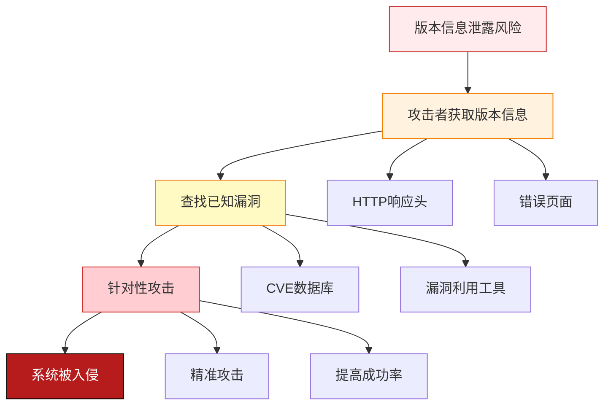
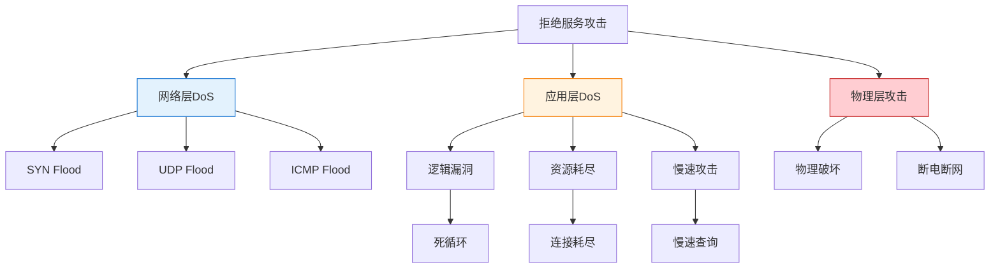
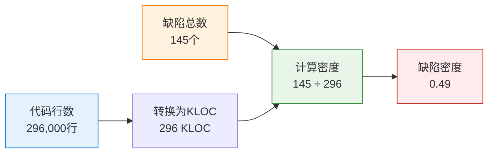

---
title: "CISP学习指南：Web服务器与软件安全"
date: 2025-10-19
categories:
  - Cybersecurity
tags:
  - CISP
excerpt: "深入解析CISP认证中的Web服务器安全配置、拒绝服务攻击防御和软件缺陷密度计算知识点。"
lang: zh-CN
available_langs: []
permalink: /zh-CN/2025/10/CISP-Web-Software-Security/
thumbnail: /assets/cisp/thumbnail.png
thumbnail_80: /assets/cisp/thumbnail_80.png
series: cisp
canonical_lang: zh-CN
---

Web服务器安全配置和软件安全开发是信息安全的重要实践领域。

## 一、Apache HTTP Server安全配置

### 1.1 Apache概述

**Apache HTTP Server简介：**

!!!anote "🌐 Apache HTTP Server"
    **Apache HTTP Server（简称Apache）**
    
    是世界上使用最广泛的开源Web服务器软件。
    
    **主要特点：**
    
    🔓 **开源免费**
    - 开放源代码
    - 免费使用
    - 社区支持
    
    🔧 **高度可配置**
    - 模块化设计
    - 灵活配置
    - 扩展性强
    
    🌍 **跨平台**
    - 支持Windows
    - 支持Linux/Unix
    - 支持macOS

### 1.2 信息泄露风险

!!!anote "💡 隐藏Apache版本信息"
    Apache HTTP Server在使用过程中，该软件默认会将自己的软件名和版本号发送给客户端。从安全角度出发，为隐藏这些信息，应当采取正确的措施。
    
    **错误的做法：**
    
    ❌ **不选择Windows平台下安装使用**
    - 平台选择不能解决版本信息泄露问题
    - 无论在哪个平台，默认都会发送版本信息
    
    ❌ **安装后，删除Apache HTTP Server源码**
    - 删除源码不能隐藏版本信息
    - 版本信息是在运行时发送的
    - 与源码是否存在无关
    
    ❌ **从正确的官方网站下载Apache HTTP Server，并安装使用**
    - 从官方下载只能保证软件安全性
    - 不能解决版本信息泄露问题
    - 默认配置仍会发送版本信息
    
    **正确的做法：**
    
    ✅ **安装后，修改配置文件httpd.conf中的有关参数**
    - 通过修改配置文件可以隐藏版本信息
    - 需要修改ServerTokens和ServerSignature参数
    - 这是正确的安全加固方法

**为什么要隐藏版本信息：**



### 1.3 Apache安全配置

**隐藏版本信息的配置方法：**

!!!tip "🔧 Apache安全配置"
    **修改httpd.conf配置文件：**
    
    **1️⃣ ServerTokens参数**
    
    控制HTTP响应头中Server字段显示的信息。
    
    ```apache
    # 默认配置（不安全）
    ServerTokens Full
    # 显示：Apache/2.4.41 (Unix) PHP/7.4.3
    
    # 推荐配置（安全）
    ServerTokens Prod
    # 仅显示：Apache
    
    # 或更严格
    ServerTokens ProductOnly
    # 仅显示产品名称
    ```
    
    **2️⃣ ServerSignature参数**
    
    控制错误页面底部是否显示服务器信息。
    
    ```apache
    # 默认配置（不安全）
    ServerSignature On
    # 错误页面显示完整版本信息
    
    # 推荐配置（安全）
    ServerSignature Off
    # 错误页面不显示服务器信息
    ```

**ServerTokens参数值对比：**

| 参数值 | 显示内容 | 安全性 | 推荐 |
|--------|---------|--------|------|
| Full | Apache/2.4.41 (Unix) PHP/7.4.3 OpenSSL/1.1.1 | 最低 | ❌ |
| OS | Apache/2.4.41 (Unix) | 低 | ❌ |
| Minor | Apache/2.4 | 中 | ⚠️ |
| Minimal | Apache/2.4.41 | 中 | ⚠️ |
| Major | Apache/2 | 较高 | ✅ |
| Prod | Apache | 高 | ✅ |

**完整的Apache安全配置示例：**

```apache
# httpd.conf 安全配置

# 1. 隐藏版本信息
ServerTokens Prod
ServerSignature Off

# 2. 禁用目录浏览
<Directory />
    Options -Indexes
    AllowOverride None
    Require all denied
</Directory>

# 3. 限制HTTP方法
<Directory "/var/www/html">
    <LimitExcept GET POST HEAD>
        Require all denied
    </LimitExcept>
</Directory>

# 4. 设置超时
Timeout 60
KeepAliveTimeout 5

# 5. 限制请求大小
LimitRequestBody 10485760

# 6. 禁用不必要的模块
# LoadModule status_module modules/mod_status.so
# LoadModule info_module modules/mod_info.so

# 7. 设置安全响应头
Header always set X-Frame-Options "SAMEORIGIN"
Header always set X-Content-Type-Options "nosniff"
Header always set X-XSS-Protection "1; mode=block"
```

### 1.4 其他Web服务器安全措施

**Web服务器安全加固清单：**

```
Web服务器安全加固：
├── 信息隐藏
│   ├── 隐藏版本信息
│   ├── 自定义错误页面
│   ├── 移除默认页面
│   └── 禁用服务器状态页
├── 访问控制
│   ├── 限制目录访问
│   ├── 禁用目录浏览
│   ├── 限制HTTP方法
│   └── IP白名单
├── 资源限制
│   ├── 设置超时时间
│   ├── 限制请求大小
│   ├── 限制并发连接
│   └── 防止资源耗尽
├── 模块管理
│   ├── 禁用不必要模块
│   ├── 只加载必需模块
│   ├── 定期更新模块
│   └── 审查第三方模块
└── 日志审计
    ├── 启用访问日志
    ├── 启用错误日志
    ├── 定期审查日志
    └── 集中日志管理
```

## 二、拒绝服务攻击防御

### 2.1 拒绝服务攻击概述

**DoS攻击的定义：**

!!!anote "⚠️ 拒绝服务攻击（DoS）"
    **Denial of Service Attack**
    
    通过消耗系统资源使软件无法响应正常请求的一种攻击方式。
    
    **攻击目标：**
    
    💻 **系统资源**
    - CPU资源
    - 内存资源
    - 网络带宽
    - 磁盘I/O
    - 数据库连接
    
    🎯 **攻击效果**
    - 系统响应缓慢
    - 服务不可用
    - 业务中断
    - 用户无法访问

### 2.2 DoS攻击方式

!!!anote "💡 软件开发中需要考虑的DoS攻击方式"
    针对软件的拒绝服务攻击是通过消耗系统资源使软件无法响应正常请求的一种攻击方式。在软件开发时分析拒绝服务攻击的威胁，需要重点关注应用层攻击。
    
    **需要考虑的攻击方式：**
    
    ✅ **CPU资源耗尽攻击**
    - 攻击者利用软件存在的逻辑错误，通过发送某种类型数据导致运算进入死循环，CPU资源占用始终100%
    - 这是典型的DoS攻击方式
    - 利用逻辑漏洞消耗CPU资源
    - 属于应用层DoS攻击
    
    ✅ **数据库资源耗尽攻击**
    - 攻击者利用软件脚本使用多重嵌套查询，在数据量大时会导致查询效率低，通过发送大量的查询导致数据库响应缓慢
    - 这是SQL查询DoS攻击
    - 利用低效查询消耗数据库资源
    - 属于应用层DoS攻击
    
    ✅ **连接资源耗尽攻击**
    - 攻击者利用软件不自动释放连接的问题，通过发送大量连接消耗软件并发连接数，导致并发连接数耗尽而无法访问
    - 这是连接耗尽DoS攻击
    - 利用资源泄露消耗连接资源
    - 属于应用层DoS攻击
    
    **不需要在软件开发中考虑的攻击：**
    
    ❌ **物理攻击**
    - 例如：攻击者买通IDC人员，将某软件运行服务器的网线拔掉导致无法访问
    - 这不是软件层面的DoS攻击
    - 不属于软件开发需要考虑的威胁
    - 应通过物理安全和人员管理防范

**DoS攻击分类：**



### 2.3 应用层DoS攻击详解

**三种典型的应用层DoS攻击：**

```
应用层DoS攻击方式：
├── 1. CPU资源耗尽攻击
│   ├── 攻击方式：
│   │   ├── 利用逻辑错误导致死循环
│   │   ├── 触发复杂计算
│   │   ├── 正则表达式回溯
│   │   └── 加密解密操作
│   ├── 攻击效果：
│   │   ├── CPU占用100%
│   │   ├── 系统响应缓慢
│   │   └── 无法处理正常请求
│   └── 防御措施：
│       ├── 代码审查
│       ├── 输入验证
│       ├── 超时控制
│       └── 资源限制
├── 2. 数据库资源耗尽攻击
│   ├── 攻击方式：
│   │   ├── 多重嵌套查询
│   │   ├── 全表扫描
│   │   ├── 笛卡尔积查询
│   │   └── 大量JOIN操作
│   ├── 攻击效果：
│   │   ├── 数据库响应缓慢
│   │   ├── 查询超时
│   │   └── 数据库连接耗尽
│   └── 防御措施：
│       ├── 查询优化
│       ├── 索引优化
│       ├── 查询超时设置
│       ├── 限制查询复杂度
│       └── 数据库连接池
└── 3. 连接资源耗尽攻击
    ├── 攻击方式：
    │   ├── 大量建立连接
    │   ├── 不释放连接
    │   ├── 慢速连接
    │   └── 保持连接不活动
    ├── 攻击效果：
    │   ├── 并发连接数耗尽
    │   ├── 新连接无法建立
    │   └── 服务不可用
    └── 防御措施：
        ├── 连接超时设置
        ├── 自动释放连接
        ├── 连接数限制
        ├── 连接池管理
        └── 空闲连接回收
```

### 2.4 DoS防御策略

**综合防御措施：**

!!!tip "🛡️ DoS防御最佳实践"
    **代码层面：**
    - 避免死循环和无限递归
    - 优化算法复杂度
    - 实施输入验证
    - 设置操作超时
    
    **资源管理：**
    - 限制并发连接数
    - 实施资源配额
    - 自动释放资源
    - 连接池管理
    
    **数据库层面：**
    - 优化查询语句
    - 建立合适索引
    - 限制查询复杂度
    - 设置查询超时
    
    **网络层面：**
    - 流量限制
    - 速率限制
    - 异常检测
    - 黑名单机制

## 三、软件缺陷密度

### 3.1 软件缺陷密度概念

**软件缺陷密度的定义：**

!!!anote "📊 软件缺陷密度"
    **Defects per KLOC (Thousand Lines of Code)**
    
    用于衡量软件质量和安全性的重要指标。
    
    **计算公式：**
    ```
    软件缺陷密度 = 缺陷总数 / (代码行数 / 1000)
    ```
    
    **单位：**
    - Defects/KLOC
    - 每千行代码的缺陷数

### 3.2 缺陷密度计算

!!!anote "💡 软件缺陷密度计算示例"
    软件存在漏洞和缺陷是不可避免的，实践中常用软件缺陷密度（Defects/KLOC）来衡量软件的安全性。
    
    **计算示例：**
    
    假设某个软件共有29.6万行源代码，总共被检测出145个缺陷。
    
    **已知条件：**
    - 代码行数：29.6万行 = 296,000行
    - 缺陷总数：145个
    
    **步骤1：将代码行数转换为KLOC**
    ```
    KLOC = 296,000 / 1000 = 296
    ```
    
    **步骤2：计算缺陷密度**
    ```
    缺陷密度 = 缺陷总数 / KLOC
    缺陷密度 = 145 / 296
    缺陷密度 = 0.4898...
    缺陷密度 ≈ 0.49
    ```
    
    **结果：该软件的缺陷密度为 0.49 Defects/KLOC**

**计算示例图示：**



### 3.3 缺陷密度的意义

**缺陷密度的应用：**

| 应用场景 | 说明 | 目的 |
|---------|------|------|
| 质量评估 | 评估软件整体质量 | 了解软件成熟度 |
| 安全评估 | 评估软件安全性 | 识别安全风险 |
| 项目管理 | 跟踪开发进度 | 控制质量目标 |
| 对比分析 | 与行业标准对比 | 找出改进方向 |
| 趋势分析 | 跟踪历史变化 | 评估改进效果 |

**行业参考标准：**

!!!tip "📈 缺陷密度参考值"
    **一般软件：**
    - 优秀：< 0.5 Defects/KLOC
    - 良好：0.5 - 1.0 Defects/KLOC
    - 一般：1.0 - 2.0 Defects/KLOC
    - 较差：> 2.0 Defects/KLOC
    
    **安全关键软件：**
    - 要求更严格
    - 通常 < 0.1 Defects/KLOC
    - 如航空、医疗、金融系统
    
    **注意：**
    - 不同类型软件标准不同
    - 需要结合具体场景评估
    - 缺陷严重程度也很重要

### 3.4 降低缺陷密度的方法

**提高软件质量的措施：**

```
降低缺陷密度的方法：
├── 开发阶段
│   ├── 采用安全编码规范
│   ├── 代码审查
│   ├── 结对编程
│   ├── 单元测试
│   └── 静态代码分析
├── 测试阶段
│   ├── 功能测试
│   ├── 安全测试
│   ├── 渗透测试
│   ├── 模糊测试
│   └── 回归测试
├── 工具支持
│   ├── 静态分析工具
│   ├── 动态分析工具
│   ├── 漏洞扫描工具
│   ├── 代码审计工具
│   └── 自动化测试工具
└── 管理措施
    ├── 建立质量标准
    ├── 缺陷跟踪管理
    ├── 持续集成
    ├── 定期评审
    └── 培训和提升
```

## 四、总结

Web服务器与软件安全的核心要点：

1. **Apache安全配置**：修改httpd.conf隐藏版本信息
2. **DoS攻击防御**：关注应用层攻击，物理攻击不属于软件开发考虑范围
3. **软件缺陷密度**：用于衡量软件质量，计算公式为缺陷数/KLOC

!!!success "🎯 关键要点"
    - Apache通过修改httpd.conf中ServerTokens和ServerSignature参数隐藏版本信息
    - 应用层DoS攻击包括：CPU资源耗尽、数据库资源耗尽、连接资源耗尽
    - 物理攻击（如拔网线）不属于软件开发需要考虑的DoS威胁
    - 软件缺陷密度 = 缺陷总数 / (代码行数 / 1000)
    - 优秀软件的缺陷密度应 < 0.5 Defects/KLOC

!!!tip "💡 实践建议"
    - 部署Web服务器后立即进行安全加固
    - 隐藏所有可能泄露的系统信息
    - 在软件开发阶段考虑DoS攻击威胁
    - 实施资源限制和超时控制
    - 定期进行代码审查和安全测试
    - 跟踪和降低软件缺陷密度
    - 建立完善的质量管理体系
