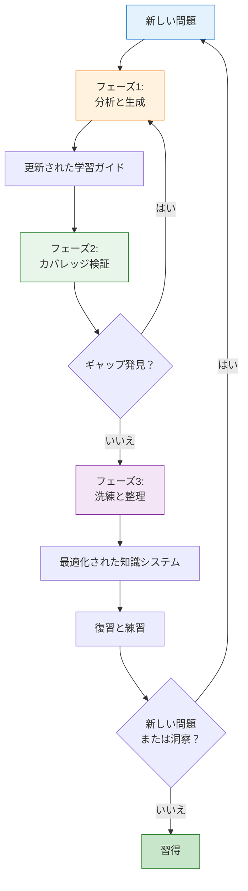
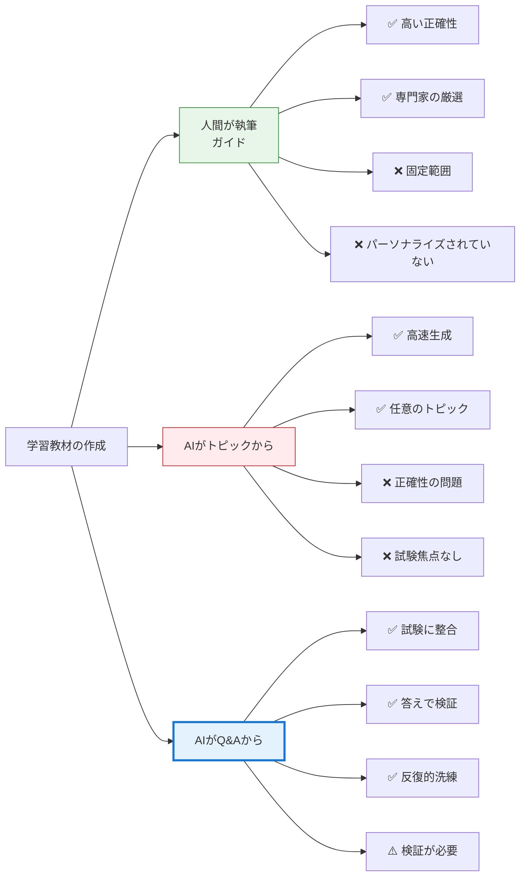
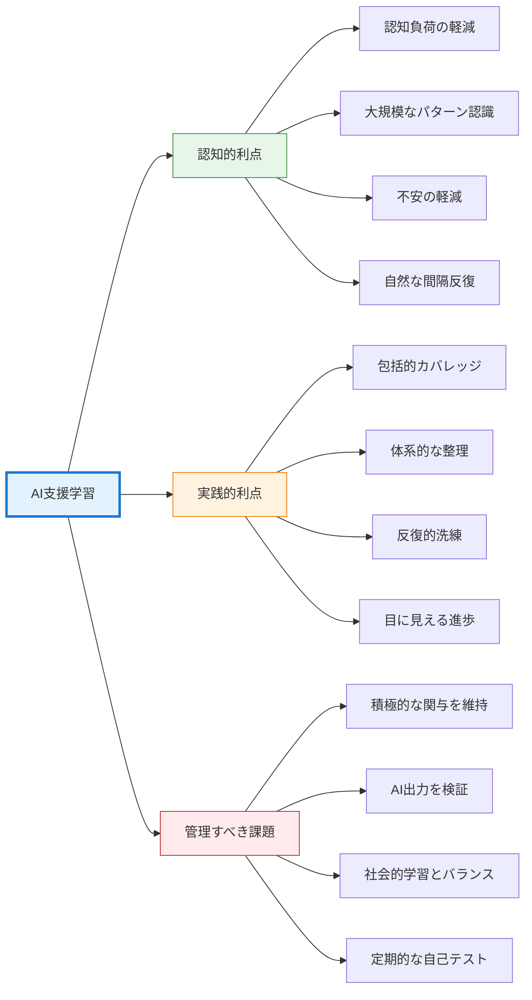

人工知能が私たちの働き方、創造の仕方、コミュニケーションの仕方を再構築している時代において、それは学習の仕方も根本的に変革しています。これはAIが人間の学習を置き換えるという話ではありません——AIが私たちの生来の認知プロセスを増幅し、散在する情報を構造化された知識システムに変える方法についての話です。認定試験の準備を通じて、私はAIの強みを活用しながら、パターン認識と統合における人間の脳の卓越した能力を尊重する学習方法を発見しました。

## 学習の課題：問題から理解へ

従来の試験準備は、予測可能なパターンに従うことが多いです：問題を暗記し、答えを練習し、幸運を祈る。このアプローチは、学習を知識構築ではなく情報保存として扱います。根本的な問題は問題そのものではありません——孤立したQ&Aペアでは、深い理解や実践的な応用に必要な神経経路を構築できないのです。

私の課題は異なっていました。複数の領域にわたる数百の模擬試験問題を、試験に合格するだけでなく、永続的な理解を生み出す一貫した知識システムに変換する必要がありました。その量は圧倒的でした：技術概念、セキュリティフレームワーク、管理原則、すべてが相互に関連しているにもかかわらず、異なる問題セットに散在していました。

ここでAIは単なるツールではなく、学習パートナーになりました。


## 方法：反復的知識構築

私の学習プロセスは、脳が自然に理解を構築する方法——反復、洗練、接続の構築——を反映する体系的なサイクルに進化しました。この方法の核心は、それぞれが特定の認知目的を果たす3つの異なるフェーズで構成されています。

### フェーズ1：問題分析とコンテンツ生成

最初のフェーズは、生の試験問題を構造化された学習コンテンツに変換します。単に答えを暗記するのではなく、AIを使用して各問題を深く分析し、包括的な学習ガイドを構築します。

**コアプロンプトパターン：**

```
これらのサンプル試験問題を1つずつ分析してください。各問題について：
1. テストされている基礎概念を特定する
2. すべての選択肢から重要な知識ポイントを抽出する
3. 関連するコンテンツが存在する場合、既存の学習ガイドを更新する
4. カバーされていないトピックの新しい学習ガイドセクションを作成する

要件：
- Q&Aペアだけでなく、包括的な説明を構築する
- 問題ごとではなく、概念ごとにコンテンツを整理する
- 必要に応じて大規模で詳細なセクションを作成する
- 答えを暗記するのではなく、原則を理解することに焦点を当てる
```

このアプローチは重要なことを行います：焦点を「正しい答えは何か」から「どの概念がテストされているか」に移します。各問題は、より広範な知識領域への窓になります。AIは単に答えを教えるだけでなく、その答えがなぜ重要なのか、他の概念とどのように関連しているかを理解するのを助けてくれます。

**認知レベルで起こること：**

このように問題を分析するとき、私たちは心理学者が「精緻化リハーサル」と呼ぶものに従事しています——情報を既存の知識と結びつけることで深く処理します。脳は孤立した事実をうまく保存しません；パターンと関係を保存します。AIに答えだけでなく概念を抽出させることで、真の理解につながる相互接続された知識構造を構築しています。

### フェーズ2：カバレッジ検証

第2フェーズは完全性を確保します——これは一般的な学習不安に対処する重要なステップです：「何か見落としていないか？」

**検証プロンプト：**

```
既存の学習ガイドコンテンツに対してすべてのサンプル問題をレビューしてください。
各問題について、以下を確認：
1. コア概念がガイドで説明されているか
2. すべての選択肢が扱われているか（正解だけでなく）
3. 説明の深さが問題の複雑さに合っているか

十分にカバーされていない問題をリストアップし、以下を含める：
- 完全な問題文
- すべての選択肢
- 正解
- 現在のカバレッジが不十分な理由
```

このフェーズには二重の目的があります。実際には、学習教材のギャップを特定します。心理的には、安心感を提供します——すべてをカバーしたという不安を軽減する確実性です。これは見た目以上に重要です。

**心理学的利点：**

不確実性は認知的にコストがかかります。必要な教材をすべてカバーしたかどうか不確かな場合、脳は精神的リソースを消費する心配のバックグラウンドプロセスを維持します。体系的にカバレッジを検証することで、不安管理ではなく実際の学習のために認知能力を解放します。

### フェーズ3：コンテンツの洗練と整理

初期コンテンツが生成され検証されると、第3フェーズは最適化に焦点を当てます——冗長性の削減、パターンの特定、一貫した構造の確保。

**洗練プロンプト：**

```
1. すべての学習ガイド記事をスキャンし、コンテンツの重複を特定する
   - 同じ概念の繰り返し説明を探す
   - 重複情報を統合する
   - 繰り返しではなく相互参照を作成する

2. 見出しをスキャンして潜在的な重複コンテンツを特定する
   - 類似のトピックをカバーする投稿を見つける
   - それらを統合すべきか区別すべきかを判断する
   - 関連トピック間の明確な境界を確保する

3. 見出しパターンを分析して潜在的に欠落しているコンテンツを特定する
   - 知識構造の論理的ギャップを探す
   - 言及されているが完全に説明されていない概念を見つける
   - 前提とされているがカバーされていない前提知識を特定する
```

この洗練フェーズは魔法が起こる場所です。単なるクリーンアップではありません——文書のコレクションを知識システムに変換することです。

**認知アーキテクチャ：**

私たちの脳はパターン認識マシンです。情報が明確な階層と接続で適切に整理されている場合、簡単にナビゲートできます。散在していて冗長な場合、すべての検索が検索操作になります。AIがコンテンツの整理を支援することで、本質的に、教材について考えたい方法を反映する外部認知構造を構築しています。


## 反復ループ：継続的改善

これら3つのフェーズが継続的なサイクルを形成するとき、真の力が現れます：



各反復は単に情報を追加するだけではありません——理解を洗練します。初期の反復は基本的な説明を生成するかもしれません。後期の反復は、より多くの問題とより深い分析に基づいて、領域の基礎構造を明らかにする微妙で相互接続されたコンテンツを生成します。

**反復が生物学的に重要な理由：**

学習は一度きりのプロセスではありません。教材を再訪するたびに、脳は特定の神経経路を強化し、他の経路を剪定します。これは「統合」と呼ばれます。AIの支援を受けて教材を複数回反復することで、単に復習しているだけではありません——知識領域をより良く表現するために神経アーキテクチャを積極的に再形成しています。

間隔効果——分散練習が集中練習に勝る現象——は、このアプローチに自然に組み込まれています。各反復は時間が経過した後に発生し、学習を定着させる統合を可能にします。

## アプローチの比較：学習教材を作成する3つの方法

利点を深く掘り下げる前に、この問題駆動型AIアプローチが他の学習教材作成方法とどのように異なるかを理解することが重要です。

### アプローチ1：人間が執筆した学習ガイド

人間の専門家によって書かれた従来の学習ガイドは、多くの点でゴールドスタンダードを表しています。これらの教材は以下の恩恵を受けています：

- **ドメイン専門知識：** 著者は主題を深く理解している
- **教育経験：** 学生がどのように学び、何に混乱するかを知っている
- **厳選されたコンテンツ：** 情報は慎重に選択され整理されている
- **検証された正確性：** 複数のレビューサイクルが正確性を保証する

しかし、人間が執筆したガイドには限界があります：
- **固定範囲：** 著者が重要だと考えることをカバーし、試験の焦点と一致しない可能性がある
- **静的コンテンツ：** 一度公開されると、特定のギャップに適応しない
- **汎用アプローチ：** 万能で、学習ニーズに合わせてパーソナライズされていない
- **可用性：** ニッチなトピックや特定の試験バージョンには存在しない可能性がある

### アプローチ2：トピックから生成されたAIコンテンツ

AIに「トピックXを説明して」または「Yについての学習ガイドを作成して」と依頼することがますます一般的になっています。このアプローチは以下を提供します：

- **速度：** 包括的なコンテンツの即座の生成
- **広さ：** オンデマンドで任意のトピックをカバーできる
- **カスタマイズ：** 特定の形式や深さを要求できる

しかし、重大な弱点があります：
- **正確性の懸念：** AIはもっともらしいが不正確な情報を生成する可能性がある
- **コンテキストの欠如：** 試験問題がなければ、AIは実際に何がテストされているかを知らない
- **汎用カバレッジ：** すべての側面を平等に扱い、試験固有の重点を見逃す
- **検証アンカーなし：** 外部ソース以外に検証するものがない

### アプローチ3：問題と答えから生成されたAIコンテンツ

これは私が使用する方法です——実際の試験問題とその正解を分析して学習教材を生成します。このアプローチは、前の2つの方法の強みを組み合わせています：

!!!anote "🎯 問題駆動型の利点"
    **組み込みコンテキスト：** 問題は実際に何がどのようにテストされているかを明らかにする
    
    **答えの検証：** 正解が正確性のアンカーとして機能する
    
    **焦点を絞ったカバレッジ：** コンテンツは試験要件と一致する
    
    **反復的洗練：** 同じトピックに関する複数の問題が包括的な理解を構築する
    
    **ギャップの特定：** 欠落している問題が知識のギャップを明らかにする

**重要な違い：**

AIが答え付きの問題からコンテンツを生成する場合、答えは不正確性を大幅に減らす**コンテキスト制約**として機能します。AIがトピックについて自由にコンテンツを生成する（もっともらしく聞こえる誤りに漂流する可能性がある）代わりに、提供された正解と一致する方法で概念を説明する必要があります。




## 利点：なぜこのアプローチが機能するのか

このAI支援学習方法の利点は、試験準備をはるかに超えています。人間がどのように学習し、記憶し、知識を適用するかの基本的な側面に触れています。

### 認知負荷管理

従来の学習は、情報を処理する精神的ワークスペースであるワーキングメモリを圧倒することがよくあります。数百の問題に直面すると、脳はコンテキストを維持し、パターンを特定し、接続を構築することを同時に行うのに苦労します。

!!!anote "🧠 ワーキングメモリの軽減"
    AIは情報整理の機械的側面を処理し、より高次の思考のためにワーキングメモリを解放します。「これはどこに置くべきか？」「これを前に見たことがあるか？」「パターンは何か？」を同時に処理する代わりに、概念そのものを理解することに完全に集中できます。

**生物学的現実：**

ワーキングメモリは厳しく制限されています——ほとんどの人は同時に4〜7個の情報チャンクしか保持できません。組織タスクをAIにオフロードすることで、この貴重な認知リソースを実際の学習のために保存します。これは、あなたが読んで理解することに集中している間、図書館員が本を整理してくれるようなものです。

### 大規模なパターン認識

人間はパターンを認識するのが得意です——しかし、それを見ることができる場合に限ります。複数のドメインにわたる数百の問題では、パターンはノイズの中に隠れたままです。AIはこのボリュームを即座に処理し、手動では決して見つけられない接続を明らかにできます。

!!!tip "🔍 パターンの発見"
    AIは、「アクセス制御」、「認証」、「認可」に関する問題がすべてより広範なセキュリティフレームワークに関連していることを特定できます——それらが異なるコンテキストで現れる場合でも。これはドメインの概念アーキテクチャを明らかにします。

**これが心理学的に重要な理由：**

理解は根本的にパターンと関係を見ることについてです。AIがこれらのパターンを明らかにするのを助けるとき、それは私たちのために学習しているのではありません——学習を可能にしているのです。これは、光害のある都市と澄んだ砂漠の空で星座を見ようとすることの違いのようなものです。星（情報）は同じです；可視性（パターン認識）が変換されています。

### 認知不安の軽減

学習不安は単に不快なだけではありません——認知的にコストがかかります。「何か見落としていないか？」または「これは整理する正しい方法か？」という心配は、学習に使用できる精神的リソースを消費します。

!!!anote "😌 不安の軽減"
    体系的な検証と整理は心理的安全性を提供します。すべてをカバーしたことがわかります。それがよく整理されていることがわかります。この確実性は、心配ではなく理解に集中するために心を解放します。

**ストレスと学習の関連：**

慢性的なストレスは海馬を損ないます——新しい記憶を形成するために重要な脳領域です。学習関連の不安を軽減することで、単に気分が良くなるだけでなく、情報をエンコードおよび検索する脳の能力を文字通り改善しています。

### 反復による間隔反復

この方法の反復的性質は、認知科学で知られている最も強力な学習技術の1つである間隔反復を自然に実装します。

!!!tip "📅 自然な間隔"
    各反復サイクルは、教材への露出の間に自然なギャップを作成します。詰め込みではありません——分散練習を通じて長期記憶を構築しています。

**神経科学：**

情報を検索するたびに、その記憶に関連する神経経路を強化します。しかし、落とし穴があります：検索はわずかに困難なときに最も効果的です。簡単すぎる（即座の反復）と経路をあまり強化しません。難しすぎる（時間が経ちすぎた）と全く検索できません。反復サイクルは自然にこの「望ましい困難」を作り出します。

### 分析による能動的学習

おそらく最も重要な利点は、この方法があなたを積極的に関与させ続けることです。AI生成コンテンツを受動的に読んでいるのではありません——AIを指示し、その出力を評価し、整理と重点について決定を下しています。

!!!anote "🎯 積極的な関与"
    作成するすべてのプロンプトは、何を学ぶ必要があるか、どのように整理すべきかを考えることを要求します。すべてのAI応答は評価と統合を必要とします。この積極的な関与は深い学習の本質です。

**学習科学：**

能動的学習——学生が分析、統合、評価を通じて教材に関与する——は一貫して受動的学習を上回ります。AIを代替品ではなくツールとして使用することで、この方法は真の理解を駆動する積極的な関与を維持します。

### メタ認知の発達

このようにAIを使用することは、メタ認知——自分自身の思考プロセスの認識と理解——を発達させます。どのように学習するか、何を理解しているか、何を理解していないかを意識するようになります。

!!!tip "🤔 学習を学ぶ"
    プロセスを反復するにつれて、以下について直感を発達させます：
    - 何が良い説明を構成するか
    - 概念をどのように整理すべきか
    - どのレベルの詳細が必要か
    - 異なるトピックがどのように接続するか
    
    これらのメタ認知スキルは他の学習コンテキストに転移します。

**長期的な利点：**

メタ認知は学習成功の最も強力な予測因子の1つです。学習プロセスの認識を発達させることで、現在の教材を学習しているだけでなく、その後のすべてのことに対してより良い学習者になっています。


## 課題：正直な限界

完璧な学習方法はなく、このアプローチの限界と課題を認識することが重要です。

### 依存リスク

整理と統合のためにAIに依存するようになる実際のリスクがあります。注意しないと、機械的な作業だけでなく、思考そのものをアウトソーシングしてしまう可能性があります。

!!!warning "⚠️ 主体性の維持"
    AIはあなたの思考を増幅するツールであるべきで、代替品ではありません。ディレクター、評価者、統合者としての役割を維持する必要があります。AIは整理します；あなたは理解します。

**緩和策：**

定期的にAIの支援なしで自分自身をテストしてください。自分の言葉で概念を説明できますか？AI生成の図なしで接続を見ることができますか？できない場合、ツールに過度に依存しており、より多くの内在化が必要です。

### 品質管理の要求

AIはもっともらしく聞こえるが実際には不正確または誤解を招くコンテンツを生成できます。この方法は、エラーを捕捉するための継続的な警戒とドメイン知識を必要とします。

!!!warning "🔍 検証の必要性"
    すべてのAI生成の説明には人間の検証が必要です。これは、微妙なエラーが根本的な誤解につながる可能性がある技術ドメインで特に重要です。

**現実：**

これは受動的な学習ではありません。積極的な関与、批判的思考、そしてしばしば権威あるソースに対する外部検証が必要です。AIはプロセスを加速しますが、注意深い学習の必要性を排除するものではありません。

### 初期時間投資

このシステムのセットアップには時間がかかります。効果的なプロンプトの作成、組織構造の確立、初期コンテンツベースの構築には、大きな前払い投資が必要です。

!!!anote "⏰ 時間の考慮"
    最初の数回の反復は従来の学習よりも遅いです。システムがより包括的で洗練されるにつれて、後で見返りがあります。これはマラソンアプローチであり、スプリントではありません。

**トレードオフ：**

即座の進歩を長期的な効率とより深い理解と交換しています。短期的な詰め込みには、従来の方法の方が速いかもしれません。永続的な知識を構築するには、このアプローチが優れています。

### 孤立要因

AIを使った学習は孤独になる可能性があります。学習の社会的側面——議論、討論、他者と一緒に学ぶことから来る多様な視点——を逃します。

!!!warning "👥 社会的学習のギャップ"
    人間の相互作用は以下を提供します：
    - よりよく理解できる代替説明
    - 考えもしなかった質問
    - 感情的サポートとモチベーション
    - 実世界のコンテキストと応用
    
    AIは、どれほど洗練されていても、これらの社会的次元を完全に置き換えることはできません。

**バランス：**

この方法は、人間の相互作用と組み合わせたときに最もよく機能します——学習グループ、メンター、またはAI整理されたコンテンツについて議論し討論できるオンラインコミュニティ。

## 心理学的・生物学的基盤

この方法がなぜ機能するかを理解するには、脳が実際にどのように学習し記憶するかを見る必要があります。

### 学習の構成主義的性質

学習は情報をある場所から別の場所に転送することではありません——理解を構築することです。私たちの脳はハードドライブのように事実を保存しません；物事がどのように機能するかのモデルを構築します。

!!!anote "🏗️ 知識構築"
    AIを使用して問題を分析し学習ガイドを構築するとき、単に情報を整理しているだけではありません——ドメインの精神モデルを積極的に構築しています。各反復はこのモデルを洗練し、より正確で有用にします。

**神経科学：**

学習は物理的に脳を変えます。新しいシナプス接続が形成され、既存のものが強化され、神経ネットワークが再編成されます。このプロセス——神経可塑性と呼ばれる——は、時間をかけて複数の方法で教材に積極的に関与するときに最も効果的です。この方法の反復的で分析的なアプローチは、まさにこの種の関与を提供します。

### 認知オフロードの役割

人間は常に外部ツールを使用して認知能力を拡張してきました——書くことから計算機、検索エンジンまで。AIはこの長い伝統の最新のものです。

!!!tip "🔧 ツール使用の進化"
    書くことがすべてを記憶することから私たちを解放し、計算機が手動計算から私たちを解放したように、AIは機械的な整理とパターン発見から私たちを解放できます——より高次の思考に集中できるようにします。

**進化的視点：**

私たちの脳はツールを使用するように進化しました。書くことを使用することが「ズル」でないのと同じように、AIを使用することは「ズル」ではありません。私たちは人間が最も得意とすることをしています：ツールを活用して生物学的限界を超えて能力を拡張すること。

### 感情調整の重要性

学習は深く感情的です。フラストレーション、不安、圧倒は学習プロセスを閉じることができます。自信と好奇心はそれを開きます。

!!!anote "😊 感情状態が重要"
    この方法の体系的アプローチは感情調整を提供します：
    - 検証はギャップについての不安を軽減する
    - 整理は圧倒を軽減する
    - 目に見える進歩は自信を構築する
    - 反復は段階的な習得を可能にする
    
    これらの感情的利点は単にあると良いものではありません——効果的な学習に不可欠です。

**生物学的メカニズム：**

扁桃体——私たちの感情センター——は、ストレスや不安を感じているときに学習プロセスを乗っ取ることができます。構造、確実性、目に見える進歩を提供することで、この方法は扁桃体を落ち着かせ、海馬と前頭前皮質が記憶をエンコードし整理する仕事をすることを可能にします。

## 実践的洞察：私が学んだこと

この方法を数ヶ月使用することで、このアプローチを検討している他の人に役立つかもしれないいくつかの実践的洞察が浮かび上がりました。

### 小さく始めて徐々に拡大する

初日に包括的な知識システムを構築しようとしないでください。小さな問題セットから始め、プロンプトを開発し、拡大する前にプロセスを洗練してください。

!!!tip "🌱 成長マインドセット"
    最初の反復は粗雑になります。プロンプトは不完全になります。整理は修正が必要になります。これは正常で予想されることです。各反復は次をより良く行う方法を教えてくれます。

### プロンプトテンプレートを開発する

作業するにつれて、学習スタイルと主題に適したプロンプトパターンを発見します。これらを再利用および洗練できるテンプレートとして文書化してください。

**例の進化：**

- **初期プロンプト：**「この問題を説明して」
- **洗練されたプロンプト：**「テストされている概念を分析し、各選択肢がなぜ正しいか間違っているかを説明し、関連する概念に接続して」
- **成熟したプロンプト：**「基礎となる原則を抽出し、その実践的応用を説明し、一般的な誤解を特定し、より広範なフレームワークとどのように関連するかを示して」

### 広さと深さのバランス

すべてのために包括的なコンテンツを生成したくなります。この衝動に抵抗してください。いくつかのトピックは深い探求が必要です；他のものは表面的なカバレッジのみが必要です。問題に深さを導かせてください。

!!!anote "⚖️ 適切な詳細"
    すべての概念が2000語の説明を必要とするわけではありません。いくつかは段落が必要です。いくつかは図が必要です。いくつかは実例が必要です。反復プロセスは各トピックの適切な詳細レベルを発見するのに役立ちます。

### メタドキュメントを維持する

別のドキュメントを保持して追跡します：
- カバーしたこと
- より多くの作業が必要なこと
- 気づいているパターン
- 生じる質問
- トピック間の接続

このメタドキュメントは、学習の旅の地図となり、将来の反復を計画するためのツールになります。

## 結果：個人的経験と観察

試験問題から生成された教材が他の方法を上回ることを証明する科学的研究はありませんが、私の個人的経験はこのアプローチの有効性の説得力のある証拠を提供します。

### 学習成果

最も重要な結果は試験に合格することだけではありませんでした——学習プロセス自体の間に発達した理解の深さでした。学習教材を生成、レビュー、洗練する行為が主要な学習メカニズムになりました。

!!!anote "📚 創造を通じた学習"
    **パラドックス：** 学習教材を読むことよりも作成することから多くを学びました。
    
    **なぜ機能するか：** 問題を分析し、コンテンツを生成し、カバレッジを検証し、整理を洗練する反復プロセスは、すべての概念に複数回深く関与することを強制しました。
    
    **結果：** 教材が「完成」したとき、作成プロセス自体を通じてすでにほとんどの知識を内在化していました。

**予期しない利点：**

従来の学習は、作成（著者による）と消費（学生による）を分離します。この方法はその区別を崩壊させます。あなたは同時に著者であり学生であり、これは強力な学習ダイナミクスを作り出します。何かを整理または説明する方法についてのすべての決定は、それを深く理解することを要求します。

## 未来の可能性：静的学習ガイドを超えて

AI支援学習とのこの旅は、このアプローチがどのように進化できるかについての多くのアイデアを引き起こしました。私はAIを使用して静的な学習教材を生成しましたが、潜在的な可能性はテキストドキュメントをはるかに超えています。

### インタラクティブ学習ツール

次の論理的ステップは、静的学習ガイドをインタラクティブな学習体験に変換することです。

!!!tip "🎮 インタラクティブな可能性"
    **適応型クイズシステム**
    - AIが学習教材に基づいて問題を生成
    - パフォーマンスに基づいて難易度を調整
    - 苦労している概念に焦点を当てる
    - 時間の経過とともに進捗を追跡
    
    **概念探索ツール**
    - 任意の概念をクリックして関連する問題を表示
    - 接続を示す視覚的知識グラフ
    - クエリに応答するインタラクティブ図
    - 複雑なシナリオのシミュレーション

**実装ビジョン：**

以下のようなWebアプリケーションを想像してください：
1. 試験問題をアップロードする
2. AIが包括的な学習教材を生成する
3. システムがインタラクティブな知識グラフを作成する
4. ノードをクリックして概念を探索できる
5. 練習問題がオンデマンドで生成される
6. 弱点領域が自動的に特定され強化される

**技術的実現可能性：**

これは現在の技術で完全に達成可能です：
- フロントエンド：インタラクティブインターフェースのためのReactまたはVue
- バックエンド：AIオーケストレーションのためのPythonとLangChain
- データベース：知識関係のためのグラフデータベース（Neo4j）
- AI：コンテンツ生成と分析のためのGPT-4またはClaude

### パーソナライズされた学習パス

異なる学習者には異なるニーズ、背景、学習スタイルがあります。AIはユーザープロファイルに基づいて学習教材をパーソナライズできます。

!!!anote "👤 パーソナライゼーションの次元"
    **学習スタイルの適応**
    - 視覚学習者：より多くの図とフローチャート
    - 言語学習者：詳細な説明と例
    - 運動感覚学習者：インタラクティブシミュレーションと演習
    
    **背景知識**
    - 初心者：より多くの基礎的説明
    - 中級：接続と応用に焦点
    - 上級：エッジケースとニュアンスの強調
    
    **時間制約**
    - 詰め込みモード：必須概念のみ
    - 深い学習モード：包括的カバレッジ
    - レビューモード：間隔反復スケジューリング
    
    **専門的コンテキスト**
    - 開発者：コード例と技術実装
    - マネージャー：ビジネスへの影響と意思決定フレームワーク
    - 監査人：コンプライアンスと検証の焦点

**最終目標：**

人間の教師、メンター、または学習プロセス自体を置き換えることではなく、質の高い教育へのアクセスを増強し民主化することです。AIはすべての学習者が値する疲れを知らない教育アシスタントになり、人間は学習を意味のあるものにする判断、創造性、知恵を提供します。

## 結論：新しい学習パラダイム

AIを使って学ぶことは、ショートカットやズルについてではありません。私たちの脳が自然に学ぶ方法に逆らうのではなく、それと協力するためにテクノロジーを活用することです。整理とパターン発見の機械的側面を処理することで、AIは人間が最も得意とすること——知識の理解、統合、応用——に集中することを可能にします。

反復的アプローチ——分析、検証、洗練、反復——は、脳の自然な学習プロセスを反映しています。各サイクルは神経経路を強化し、精神モデルを洗練し、理解を深めます。AIは私たちのために学習するのではありません；学習がより効果的に起こる条件を作り出します。

利点は明確です：より良い整理、より深い理解、不安の軽減、より効率的な学習。課題は現実的ですが管理可能です：主体性の維持、品質の検証、前払い時間の投資、社会的学習とのバランス。

最も重要なことは、このアプローチは根本的な真実を認識しています：学習はテクノロジーによって置き換えられるのではなく、強化できる人間の活動です。AIはツールです——強力なツールですが——学習は人間の脳で、理解を構築する人間のプロセスを通じて起こります。

AIが進化し続けるにつれて、代替品や松葉杖としてではなく、学習パートナーとして使用することを学ぶ人々は大きな利点を持つでしょう。コンテンツをより速く生成できるからではなく、より深く学び、より徹底的に理解し、知識をより効果的に適用できるからです。

学習の未来は人間対AIではありません。それは人間とAIであり、それぞれが世界を理解するという時代を超えた人間の努力にユニークな強みを貢献します。

## より広範な影響：AIを学習パートナーとして

この個人的な学習の旅は、教育と知識労働の未来についてより大きな意味を明らかにします。AIは人間の学習を置き換えているのではありません——人間とAIがそれぞれの強みを貢献する新しい種類のパートナーシップを可能にしています。

### 人間がもたらすもの

- **判断：** 何が重要か、何が正しいか、何が関連しているかを決定する
- **統合：** 重要な接続とパターンを見る
- **応用：** 知識が実際の文脈でどのように適用されるかを理解する
- **動機：** 学習と理解を気にかける
- **創造性：** 新しい質問を提起し、新しい接続を探索する

### AIがもたらすもの

- **規模：** 人間には不可能な情報量を処理する
- **一貫性：** 疲労なしに組織と構造を維持する
- **速度：** 迅速な分析とコンテンツ生成
- **パターン認識：** 大規模なデータセット全体で接続を見つける
- **疲れ知らず：** 認知疲労や注意力の限界がない

### パートナーシップモデル

最も効果的な学習は、人間とAIが協力し、それぞれが最も得意とすることを行うときに起こります。人間は指示し、評価し、統合します。AIは整理し、分析し、生成します。どちらも他方を置き換えません；互いに増幅し合います。

!!!anote "🤝 共生学習"
    これはAIがあなたに教えることやあなたがAIに教えることについてではありません。人間の知能と人工知能が組み合わさって、どちらか一方だけでは達成できないことを達成する学習システムを作ることです。

**将来への影響：**

AI能力が成長するにつれて、このパートナーシップモデルはますます重要になります。問題は「AIは人間の学習を置き換えるか？」ではなく、「より効果的に学習するために人間とAIの能力をどのように最もよく組み合わせるか？」です。

## 結論：新しい学習パラダイム

AIを使って学ぶことは、ショートカットやズルについてではありません。私たちの脳が自然に学ぶ方法に逆らうのではなく、それと協力するためにテクノロジーを活用することです。整理とパターン発見の機械的側面を処理することで、AIは人間が最も得意とすること——知識の理解、統合、応用——に集中することを可能にします。

反復的アプローチ——分析、検証、洗練、反復——は、脳の自然な学習プロセスを反映しています。各サイクルは神経経路を強化し、精神モデルを洗練し、理解を深めます。AIは私たちのために学習するのではありません；学習がより効果的に起こる条件を作り出します。

**重要なポイント：**



利点は明確です：より良い整理、より深い理解、不安の軽減、より効率的な学習。課題は現実的ですが管理可能です：主体性の維持、品質の検証、前払い時間の投資、社会的学習とのバランス。

最も重要なことは、このアプローチは根本的な真実を認識しています：学習はテクノロジーによって置き換えられるのではなく、強化できる人間の活動です。AIはツールです——強力なツールですが——学習は人間の脳で、理解を構築する人間のプロセスを通じて起こります。

AIが進化し続けるにつれて、代替品や松葉杖としてではなく、学習パートナーとして使用することを学ぶ人々は大きな利点を持つでしょう。コンテンツをより速く生成できるからではなく、より深く学び、より徹底的に理解し、知識をより効果的に適用できるからです。

学習の未来は人間対AIではありません。それは人間とAIであり、それぞれが世界を理解するという時代を超えた人間の努力にユニークな強みを貢献します。

## 参考文献と参考資料

- **認知負荷理論：** Sweller, J. (1988). Cognitive load during problem solving: Effects on learning.
- **間隔反復：** Cepeda, N. J., et al. (2006). Distributed practice in verbal recall tasks: A review and quantitative synthesis.
- **能動的学習：** Freeman, S., et al. (2014). Active learning increases student performance in science, engineering, and mathematics.
- **メタ認知：** Flavell, J. H. (1979). Metacognition and cognitive monitoring: A new area of cognitive-developmental inquiry.
- **神経可塑性：** Doidge, N. (2007). The Brain That Changes Itself.
- **分散認知：** Hutchins, E. (1995). Cognition in the Wild.
