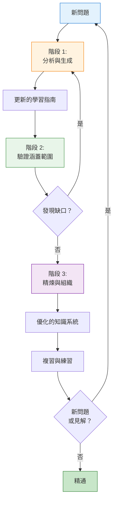
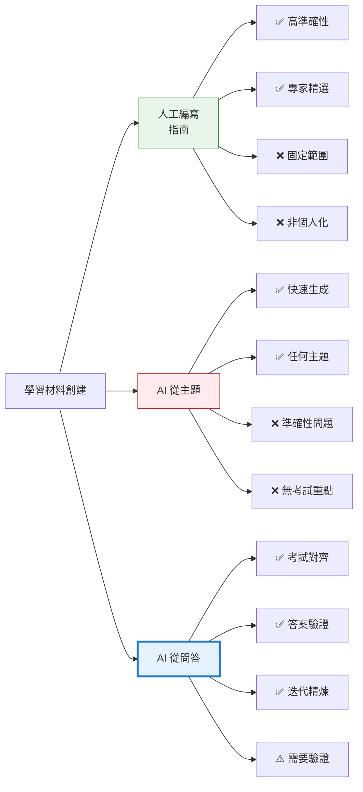
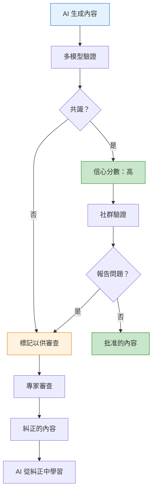
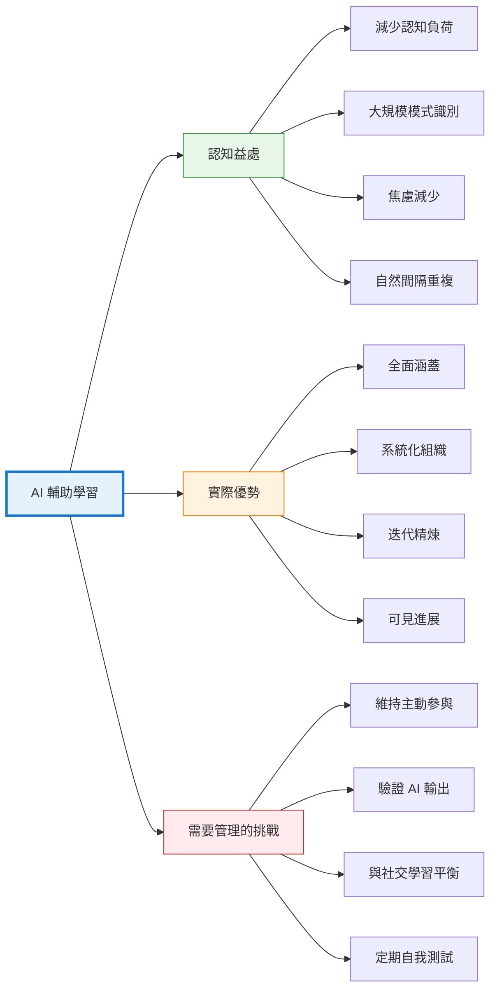

在人工智慧正在重塑我們工作、創造和溝通方式的時代，它也從根本上改變了我們的學習方式。這不是一個關於 AI 取代人類學習的故事——而是關於 AI 如何放大我們天生的認知過程，將零散的資訊轉化為結構化的知識系統。透過我準備認證考試的旅程，我發現了一種學習方法，它利用 AI 的優勢，同時尊重人腦在模式識別和綜合方面的卓越能力。

## 學習挑戰：從問題到理解

傳統的考試準備通常遵循可預測的模式：記憶問題、練習答案、祈求好運。這種方法將學習視為資訊儲存而非知識建構。根本問題不在於問題本身——而是孤立的問答配對無法建立深度理解或實際應用所需的神經路徑。

我的挑戰有所不同。我需要將跨多個領域的數百道範例考題轉化為連貫的知識系統——一個不僅能幫助我通過考試，還能創造持久理解的系統。數量令人不知所措：技術概念、安全框架、管理原則，全都相互關聯卻分散在不同的題組中。

這就是 AI 不僅成為工具，更成為學習夥伴的地方。


## 方法：迭代知識建構

我的學習過程演變成一個系統化的循環，反映了我們的大腦如何自然地建立理解——透過重複、精煉和建立連結。這個方法的核心包含三個不同的階段，每個階段都服務於特定的認知目的。

### 階段 1：問題分析與內容生成

第一階段將原始考題轉化為結構化的學習內容。我不是單純記憶答案，而是使用 AI 深入分析每個問題並建立全面的學習指南。

**核心提示詞模式：**

```
逐一分析這些範例考題。對於每個問題：
1. 識別正在測試的基礎概念
2. 從所有答案選項中提取關鍵知識點
3. 如果存在相關內容，更新現有的學習指南
4. 為未涵蓋的主題創建新的學習指南章節

要求：
- 建立全面的解釋，而非僅僅問答配對
- 按概念組織內容，而非按問題
- 需要時創建大型、詳細的章節
- 專注於理解原則，而非記憶答案
```

這種方法做了一件關鍵的事：它將焦點從「什麼是正確答案」轉移到「正在測試什麼概念」。每個問題都成為通往更廣泛知識領域的窗口。AI 不只是告訴我答案——它幫助我理解為什麼那個答案重要，以及它如何與其他概念連結。

**認知層面發生的事：**

當我們以這種方式分析問題時，我們正在進行心理學家所說的「精緻複述」——透過將資訊與現有知識連結來深度處理資訊。大腦不善於儲存孤立的事實；它儲存模式和關係。透過讓 AI 提取概念而非僅僅答案，我們正在建立那種導向真正理解的相互連結知識結構。

### 階段 2：涵蓋範圍驗證

第二階段確保完整性——這是解決常見學習焦慮的關鍵步驟：「我遺漏了什麼？」

**驗證提示詞：**

```
對照現有學習指南內容檢視所有範例問題。
對於每個問題，檢查：
1. 核心概念是否在指南中解釋
2. 所有答案選項是否都被處理（不只是正確的）
3. 解釋深度是否符合問題複雜度

列出任何未充分涵蓋的問題，包括：
- 完整問題文字
- 所有答案選項
- 正確答案
- 為何當前涵蓋範圍不足
```

這個階段有雙重目的。實際上，它識別學習材料中的缺口。心理上，它提供保證——減少焦慮的確定性，確認你已經涵蓋了所有內容。這比看起來更重要。

**心理學益處：**

不確定性在認知上是昂貴的。當我們不確定是否涵蓋了所有必要材料時，我們的大腦會維持一個消耗心智資源的背景擔憂過程。透過系統化地驗證涵蓋範圍，我們釋放了認知能力，用於實際學習而非焦慮管理。

### 階段 3：內容精煉與組織

一旦初始內容生成並驗證完畢，第三階段專注於優化——減少冗餘、識別模式並確保連貫結構。

**精煉提示詞：**

```
1. 掃描所有學習指南文章並識別內容重疊
   - 尋找相同概念的重複解釋
   - 整合重複資訊
   - 創建交叉引用而非重複

2. 透過掃描標題識別潛在的重複內容
   - 找出涵蓋相似主題的文章
   - 判斷它們應該合併還是區分
   - 確保相關主題之間有清晰界限

3. 透過分析標題模式識別潛在的遺漏內容
   - 尋找知識結構中的邏輯缺口
   - 找出提到但未完全解釋的概念
   - 識別假設但未涵蓋的先備知識
```

這個精煉階段是魔法發生的地方。它不只是清理——而是將文件集合轉化為知識系統。

**認知架構：**

我們的大腦是模式識別機器。當資訊組織良好，具有清晰的層次結構和連結時，我們可以輕鬆地導航。當它分散且冗餘時，每次檢索都變成搜尋操作。透過讓 AI 幫助組織內容，我們本質上是在建立一個外部認知結構，反映我們想要思考材料的方式。


## 迭代循環：持續改進

當這三個階段形成持續循環時，真正的力量就會顯現：



每次迭代不只是增加資訊——它精煉理解。早期迭代可能產生基本解釋。後期迭代，在更多問題和更深入分析的基礎上，產生細緻、相互連結的內容，揭示領域的底層結構。

**為什麼迭代在生物學上很重要：**

學習不是單次過程。每次我們重新審視材料時，我們的大腦會強化某些神經路徑，同時修剪其他路徑。這稱為「鞏固」。透過在 AI 協助下多次迭代材料，我們不只是複習——我們正在積極重塑我們的神經架構，以更好地表示知識領域。

間隔效應——分散練習勝過集中練習的現象——自然地內建在這種方法中。每次迭代都在經過一段時間後發生，允許使學習持久的鞏固。


## 比較方法：創建學習材料的三種方式

在深入探討優勢之前，重要的是要理解這種問題驅動的 AI 方法與其他創建學習材料的方法有何不同。

### 方法 1：人工編寫的學習指南

由人類專家編寫的傳統學習指南在許多方面代表了黃金標準。這些材料受益於：

- **領域專業知識：** 作者深入理解主題
- **教學經驗：** 他們知道學生如何學習以及什麼會讓他們困惑
- **精選內容：** 資訊經過仔細選擇和組織
- **驗證準確性：** 多次審查循環確保正確性

然而，人工編寫的指南有其限制：
- **固定範圍：** 它們涵蓋作者認為重要的內容，可能與考試重點不一致
- **靜態內容：** 一旦出版，它們不會適應你的特定缺口
- **通用方法：** 一體適用，不針對你的學習需求個人化
- **可用性：** 可能不存在針對小眾主題或特定考試版本的指南

### 方法 2：從主題生成的 AI 內容

要求 AI「解釋主題 X」或「創建關於 Y 的學習指南」越來越常見。這種方法提供：

- **速度：** 即時生成全面內容
- **廣度：** 可以按需涵蓋任何主題
- **客製化：** 可以要求特定格式或深度

但它有顯著的弱點：
- **準確性問題：** AI 可能生成看似合理但不正確的資訊
- **缺乏情境：** 沒有考題，AI 不知道實際測試什麼
- **通用涵蓋範圍：** 平等對待所有方面，錯過考試特定的重點
- **無驗證錨點：** 除了外部來源外，沒有可驗證的依據

### 方法 3：從問題和答案生成的 AI 內容

這是我使用的方法——透過分析實際考題及其正確答案來生成學習材料。這種方法結合了前兩種方法的優勢：

!!!anote "🎯 問題驅動的優勢"
    **內建情境：** 問題揭示實際測試的內容和方式
    
    **答案驗證：** 正確答案作為準確性錨點
    
    **聚焦涵蓋範圍：** 內容與考試要求一致
    
    **迭代精煉：** 同一主題的多個問題建立全面理解
    
    **缺口識別：** 缺失的問題揭示知識缺口

**關鍵差異：**

當 AI 從帶有答案的問題生成內容時，答案充當**情境約束**，顯著減少不準確性。AI 不是自由地生成關於主題的內容（可能漂移到聽起來合理的錯誤），而是必須以與提供的正確答案一致的方式解釋概念。




## 優勢：為什麼這種方法有效

這種 AI 輔助學習方法的好處遠超考試準備。它們觸及人類如何學習、記憶和應用知識的基本面向。

### 認知負荷管理

傳統學習常常讓工作記憶不堪重負——這是我們處理資訊的心智工作空間。面對數百個問題時,我們的大腦難以同時維持情境、識別模式和建立連結。

!!!anote "🧠 工作記憶減負"
    AI 處理資訊組織的機械面向，釋放你的工作記憶用於更高階的思考。你不必同時處理「這應該放在哪裡？」、「我之前看過這個嗎？」和「模式是什麼？」，而可以完全專注於理解概念本身。

**生物學現實：**

工作記憶嚴重受限——大多數人只能同時保持 4-7 個資訊塊。透過將組織任務卸載給 AI，我們保留了這個寶貴的認知資源用於實際學習。這就像有一位圖書館員組織書籍，而你專注於閱讀和理解它們。

### 大規模模式識別

人類擅長識別模式——但只有當我們能看到它們時。面對跨多個領域的數百個問題，模式隱藏在雜訊中。AI 可以即時處理這個量，揭示我們永遠不會手動發現的連結。

!!!tip "🔍 模式發現"
    AI 可以識別關於「存取控制」、「身份驗證」和「授權」的問題都與更廣泛的安全框架相關——即使它們出現在不同情境中。這揭示了領域的概念架構。

**為什麼這在心理學上很重要：**

理解從根本上是關於看到模式和關係。當 AI 幫助揭示這些模式時，它不是為我們學習——它是使學習成為可能。這就像試圖在光污染的城市與清澈的沙漠天空中看星座的區別。星星（資訊）是相同的；可見度（模式識別）被轉化了。

### 減少認知焦慮

學習焦慮不只是不舒服——它在認知上是昂貴的。對「我是否遺漏了什麼？」或「這是組織的正確方式嗎？」的擔憂消耗了可用於學習的心智資源。

!!!anote "😌 焦慮減少"
    系統化的驗證和組織提供心理安全感。你知道你已經涵蓋了所有內容。你知道它組織良好。這種確定性釋放你的心智專注於理解而非擔憂。

**壓力-學習連結：**

慢性壓力損害海馬體——對形成新記憶至關重要的大腦區域。透過減少與學習相關的焦慮，我們不只是感覺更好；我們實際上在改善大腦編碼和檢索資訊的能力。

### 透過迭代的間隔重複

這種方法的迭代性質自然實現了間隔重複——認知科學已知最強大的學習技術之一。

!!!tip "📅 自然間隔"
    每個迭代循環在接觸材料之間創建自然間隔。你不是填鴨式學習——你是透過分散練習建立長期記憶。

**神經科學：**

每次我們檢索資訊時，我們都會強化與該記憶相關的神經路徑。但有一個陷阱：檢索在稍微困難時最有效。太容易（立即重複）我們不會大幅強化路徑。太難（時間過長）我們根本無法檢索。迭代循環自然創造這種「理想困難」。

### 透過分析的主動學習

也許最重要的優勢是這種方法讓你保持積極參與。你不是被動地閱讀 AI 生成的內容——你在指導 AI、評估其輸出，並做出關於組織和重點的決策。

!!!anote "🎯 主動參與"
    你製作的每個提示詞都要求你思考你需要學習什麼以及應該如何組織。每個 AI 回應都需要評估和整合。這種主動參與是深度學習的本質。

**學習科學：**

主動學習——學生透過分析、綜合和評估參與材料——始終優於被動學習。透過將 AI 用作工具而非替代品，這種方法維持了驅動真正理解的主動參與。

### 後設認知發展

以這種方式使用 AI 發展後設認知——對你自己思考過程的意識和理解。你變得意識到你如何學習、你理解什麼以及你不理解什麼。

!!!tip "🤔 學會學習"
    當你迭代這個過程時，你會發展出關於以下方面的直覺：
    - 什麼構成好的解釋
    - 概念應該如何組織
    - 你需要什麼程度的細節
    - 不同主題如何連結
    
    這些後設認知技能轉移到其他學習情境。

**長期益處：**

後設認知是學習成功最強的預測因素之一。透過發展對學習過程的意識，你不只是在學習當前材料——你正在成為一個更好的學習者，適用於之後的所有事物。


## 挑戰：誠實的限制

沒有學習方法是完美的，承認這種方法的限制和挑戰很重要。

### 依賴風險

存在對 AI 組織和綜合產生依賴的真實風險。如果不小心，你可能會外包的不只是機械工作，還有思考本身。

!!!warning "⚠️ 維持主導權"
    AI 應該是放大你思考的工具，而非替代品。你必須保持導演、評估者和綜合者的角色。AI 組織；你理解。

**緩解措施：**

定期在沒有 AI 協助的情況下測試自己。你能用自己的話解釋概念嗎？你能在沒有 AI 生成的圖表的情況下看到連結嗎？如果不能，你過度依賴工具，需要更多內化。

### 品質控制要求

AI 可以生成聽起來合理但實際上不正確或誤導的內容。這種方法需要持續警惕和領域知識來捕捉錯誤。

!!!warning "🔍 驗證必要性"
    每個 AI 生成的解釋都需要人工驗證。這在技術領域尤其關鍵，因為細微的錯誤可能導致根本性的誤解。

**現實：**

這不是被動學習。它需要主動參與、批判性思考，並經常需要對照權威來源進行外部驗證。AI 加速了過程，但沒有消除仔細學習的需要。

### 初始時間投資

建立這個系統需要時間。製作有效的提示詞、建立組織結構和建立初始內容基礎需要大量的前期投資。

!!!anote "⏰ 時間考量"
    前幾次迭代比傳統學習慢。回報在後期出現，當系統變得更全面和精煉時。這是馬拉松方法，不是短跑。

**權衡：**

你是在用即時進展換取長期效率和更深入的理解。對於短期填鴨，傳統方法可能更快。對於建立持久知識，這種方法表現出色。

### 孤立因素

使用 AI 學習可能是孤獨的。你錯過了學習的社交面向——討論、辯論以及與他人一起學習帶來的多元觀點。

!!!warning "👥 社交學習缺口"
    人際互動提供：
    - 可能更容易理解的替代解釋
    - 你沒想到要問的問題
    - 情感支持和動力
    - 真實世界的情境和應用
    
    AI，無論多麼複雜，都無法完全取代這些社交維度。

**平衡：**

這種方法在與人際互動結合時效果最好——學習小組、導師或線上社群，你可以在那裡討論和辯論 AI 組織的內容。


## 心理學和生物學基礎

理解為什麼這種方法有效需要了解我們的大腦實際上如何學習和記憶。

### 學習的建構主義本質

學習不是將資訊從一個地方轉移到另一個地方——而是建構理解。我們的大腦不像硬碟那樣儲存事實；它們建立事物如何運作的模型。

!!!anote "🏗️ 知識建構"
    當你使用 AI 分析問題並建立學習指南時，你不只是在組織資訊——你正在積極建構領域的心智模型。每次迭代都精煉這個模型，使其更準確和有用。

**神經科學：**

學習在物理上改變大腦。新的突觸連結形成，現有的連結加強，神經網路重組。這個過程——稱為神經可塑性——在我們隨時間以多種方式積極參與材料時最有效。這種方法的迭代、分析方法正好提供了這種參與。

### 認知卸載的角色

人類一直使用外部工具來擴展我們的認知能力——從書寫到計算器到搜尋引擎。AI 是這個悠久傳統中的最新工具。

!!!tip "🔧 工具使用演化"
    正如書寫使我們免於記憶所有事物，計算器使我們免於手動計算，AI 可以使我們免於機械組織和模式發現——讓我們專注於更高階的思考。

**演化觀點：**

我們的大腦演化為使用工具。我們使用 AI 並不是「作弊」，就像我們使用書寫不是作弊一樣。我們正在做人類最擅長的事：利用工具將我們的能力擴展到生物限制之外。

### 情緒調節的重要性

學習是深度情緒化的。挫折、焦慮和不知所措可以關閉學習過程。信心和好奇心打開它。

!!!anote "😊 情緒狀態很重要"
    這種方法的系統化方法提供情緒調節：
    - 驗證減少對缺口的焦慮
    - 組織減少不知所措
    - 可見的進展建立信心
    - 迭代允許逐步精通
    
    這些情緒益處不只是錦上添花——它們對有效學習至關重要。

**生物學機制：**

杏仁核——我們的情緒中心——在我們壓力或焦慮時可以劫持學習過程。透過提供結構、確定性和可見進展，這種方法保持杏仁核平靜，允許海馬體和前額葉皮質進行編碼和組織記憶的工作。

### 外化的力量

寫下事物——或在這種情況下，讓 AI 幫助組織它們——不只是創建參考。而是外化我們的思考，以便我們可以檢查和精煉它。

!!!tip "📝 思考可視化"
    當知識只存在於你的頭腦中時，很難看到缺口、不一致或連結的機會。當它在學習指南中外化時，這些變得可見和可處理。

**認知益處：**

心理學家稱之為「分散認知」——將認知工作分散到內部（大腦）和外部（文件、工具）資源。透過將知識組織外化到 AI 輔助的學習指南，我們釋放了內部資源用於理解和應用。


## 實用見解：我學到的東西

透過數月使用這種方法，出現了幾個實用見解，可能對考慮這種方法的其他人有幫助。

### 從小開始，逐步擴展

不要試圖在第一天就建立全面的知識系統。從一小組問題開始，發展你的提示詞，並在擴展之前精煉你的過程。

!!!tip "🌱 成長心態"
    你的第一次迭代會很粗糙。你的提示詞會不完美。你的組織需要修訂。這是正常和預期的。每次迭代都教你如何更好地進行下一次。

### 發展提示詞範本

當你工作時，你會發現適合你的學習風格和主題的提示詞模式。將這些記錄為可以重複使用和精煉的範本。

**範例演化：**

- **早期提示詞：**「解釋這個問題」
- **精煉提示詞：**「分析正在測試的概念，解釋為什麼每個答案選項是對或錯，並連結到相關概念」
- **成熟提示詞：**「提取底層原則，解釋其實際應用，識別常見誤解，並展示它如何與更廣泛的框架相關」

### 平衡廣度和深度

生成所有內容的全面內容很誘人。抵制這種衝動。有些主題需要深入探索；其他主題只需要表面涵蓋。讓問題引導深度。

!!!anote "⚖️ 適當的細節"
    不是每個概念都需要 2000 字的解釋。有些需要一段。有些需要圖表。有些需要實例。迭代過程幫助你發現每個主題的正確細節層次。

### 維護元文件

保持一個單獨的文件追蹤：
- 你已經涵蓋的內容
- 需要更多工作的內容
- 你注意到的模式
- 出現的問題
- 主題之間的連結

這個元文件成為你學習旅程的地圖和規劃未來迭代的工具。

### 定期無 AI 複習

定期在沒有 AI 協助的情況下測試自己。你能：
- 用自己的話解釋概念嗎？
- 從記憶中繪製圖表嗎？
- 看到主題之間的連結嗎？
- 將知識應用到新場景嗎？

如果不能，你過度依賴外部系統，需要更多內化。


## 結果：個人經驗和觀察

雖然沒有科學研究證明從考題生成的材料優於其他方法，但我的個人經驗提供了這種方法有效性的有力證據。

### 學習成果

最重要的結果不只是通過考試——而是我在學習過程本身中發展的理解深度。生成、審查和精煉學習材料的行為成為主要的學習機制。

!!!anote "📚 透過創建學習"
    **悖論：** 我從創建學習材料中學到的比從閱讀它們中學到的更多。
    
    **為什麼有效：** 分析問題、生成內容、驗證涵蓋範圍和精煉組織的迭代過程迫使我多次深入參與每個概念。
    
    **結果：** 當材料「完成」時，我已經透過創建過程本身內化了大部分知識。

**意外的益處：**

傳統學習將創建（由作者）與消費（由學生）分開。這種方法消除了這種區別。你同時是作者和學生，這創造了強大的學習動力。關於如何組織或解釋某事的每個決定都要求你深入理解它。

### 準確性問題

AI 生成的內容可能不準確——這是眾所周知的限制。然而，使用帶有正確答案的問題作為生成來源顯著減輕了這種風險。

!!!warning "🔍 驗證優勢"
    **問題：** AI 可以生成看似合理但錯誤的解釋
    
    **解決方案：** 正確答案充當驗證錨點
    
    **機制：** 當 AI 必須解釋為什麼答案 B 正確而 A、C、D 錯誤時，它受到這些事實的約束
    
    **結果：** 解釋必須與提供的答案一致，減少漂移到不準確

**剩餘挑戰：**

這並不能完全消除準確性問題。AI 可能仍然：
- 提供正確但不完整的解釋
- 在推理中犯細微錯誤
- 誤解問題的意圖
- 生成技術上正確但教學上不佳的解釋

**必要的工作流程：**

強大的驗證過程至關重要：

1. **交叉引用：** 將 AI 解釋與權威來源比較
2. **一致性檢查：** 驗證不同問題的解釋是否一致
3. **邏輯審查：** 確保推理健全，而不只是結論
4. **實際測試：** 將概念應用到新場景以驗證理解
5. **同儕審查：** 可能時，讓其他人審查生成的內容

### 量化經驗

雖然不是科學嚴謹的，但我的主觀評估：

**時間投資：**
- 初始設置和第一次迭代：比傳統學習多 40% 時間
- 後期迭代：由於現有結構減少 60% 時間
- 整體：大致相當的時間，但分佈更好

**理解深度：**
- 傳統方法：事實的表面記憶
- 這種方法：對底層原則和連結的深入理解
- 應用知識的信心：顯著更高

**保留：**
- 傳統填鴨：考試後快速衰退
- 這種方法：知識持續，因為它是結構化和相互連結的
- 回憶能力：由於組織的心智模型更容易

**壓力水平：**
- 傳統學習：對涵蓋範圍和缺口的高度焦慮
- 這種方法：由於系統化驗證而降低焦慮
- 進入考試的信心：大幅提高

### 意外的益處

除了考試準備，這種方法產生了令人驚訝的額外價值：

!!!tip "🎁 額外成果"
    **可轉移技能：** 學會如何有效地使用 AI 學習
    
    **可重複使用的材料：** 創建了超越考試有用的知識庫
    
    **後設認知成長：** 發展了對我學習過程的意識
    
    **問題解決方法：** 學會將複雜領域分解為可管理的部分

### 誠實的評估

這種方法不是魔法，也不適合每個人：

**如果你符合以下條件，它效果很好：**
- 可以獲得帶有答案的優質練習題
- 享受系統化、結構化的方法
- 可以投資時間進行設置和迭代
- 對技術感到舒適
- 可以批判性地評估 AI 輸出

**如果你符合以下條件，它可能不起作用：**
- 需要立即結果（填鴨）
- 偏好社交、協作學習
- 缺乏驗證 AI 輸出的領域知識
- 發現迭代過程令人沮喪
- 透過實踐而非閱讀學習更好

**底線：**

對我來說，學習 AI 生成的材料是一個大勝利——不是因為材料完美，而是因為創建它們本身就是一個強大的學習過程。材料成為學習的副產品，而非主要機制。


## 未來可能性：超越靜態學習指南

這段 AI 輔助學習的旅程激發了許多關於這種方法如何演化的想法。雖然我使用 AI 生成靜態學習材料，但潛力遠超文字文件。

### 互動式學習工具

下一個合理步驟是將靜態學習指南轉化為互動式學習體驗。

!!!tip "🎮 互動可能性"
    **自適應測驗系統**
    - AI 根據你的學習材料生成問題
    - 難度根據你的表現調整
    - 專注於你掙扎的概念
    - 隨時間追蹤進展
    
    **概念探索工具**
    - 點擊任何概念查看相關問題
    - 顯示連結的視覺知識圖
    - 回應查詢的互動圖表
    - 複雜場景的模擬

**實現願景：**

想像一個網路應用程式，其中：
1. 你上傳你的考題
2. AI 生成全面的學習材料
3. 系統創建互動式知識圖
4. 你可以透過點擊節點探索概念
5. 按需生成練習題
6. 自動識別並強化你的弱點領域

**技術可行性：**

這完全可以用當前技術實現：
- 前端：React 或 Vue 用於互動介面
- 後端：Python 與 LangChain 用於 AI 編排
- 資料庫：圖資料庫（Neo4j）用於知識關係
- AI：GPT-4 或 Claude 用於內容生成和分析

### 個人化學習路徑

不同的學習者有不同的需求、背景和學習風格。AI 可以根據使用者檔案個人化學習材料。

!!!anote "👤 個人化維度"
    **學習風格適應**
    - 視覺學習者：更多圖表和流程圖
    - 語言學習者：詳細解釋和範例
    - 動覺學習者：互動模擬和練習
    
    **背景知識**
    - 初學者：更多基礎解釋
    - 中級：專注於連結和應用
    - 進階：強調邊緣案例和細微差別
    
    **時間限制**
    - 填鴨模式：僅基本概念
    - 深度學習模式：全面涵蓋
    - 複習模式：間隔重複排程
    
    **專業情境**
    - 開發者：程式碼範例和技術實現
    - 管理者：業務影響和決策框架
    - 稽核員：合規和驗證重點

**使用者檔案範例：**

```json
{
  "learner_profile": {
    "name": "Alex",
    "learning_style": "visual",
    "background": {
      "programming": "advanced",
      "security": "intermediate",
      "management": "beginner"
    },
    "time_available": "2_weeks",
    "goal": "certification_exam",
    "preferences": {
      "depth": "comprehensive",
      "examples": "code_heavy",
      "practice_frequency": "daily"
    }
  }
}
```

**AI 生成的個人化內容：**

對於 Alex（視覺學習者，強大的程式設計背景）：
- 更多 Mermaid 圖表和流程圖
- 每個概念的程式碼範例
- 技術實現細節
- 較少強調基本程式設計概念
- 更多專注於安全和管理方面

對於 Jordan（語言學習者，管理背景）：
- 詳細的書面解釋
- 業務案例研究
- 決策框架和矩陣
- 較少技術術語
- 更多強調策略影響

### 協作學習平台

雖然我的方法是孤獨的，但 AI 可以在維持個人化的同時促進協作學習。

!!!tip "👥 協作功能"
    **共享知識庫**
    - 多個使用者貢獻問題
    - AI 綜合多元觀點
    - 社群驗證 AI 生成的內容
    - 同儕審查和討論串
    
    **學習小組**
    - AI 識別具有互補知識缺口的使用者
    - 建議最佳學習小組組成
    - 生成小組討論主題
    - 追蹤集體進展
    
    **專家整合**
    - 主題專家可以審查和糾正 AI 內容
    - 專家註釋增強 AI 生成的材料
    - AI 從專家糾正中學習
    - 創造良性改進循環

### 持續學習系統

除了考試準備，這種方法可以支持終身學習。

!!!anote "📚 終身學習願景"
    **專業發展**
    - 追蹤產業變化和新概念
    - 生成現有知識庫的更新
    - 根據工作要求識別技能缺口
    - 建議職業發展的學習路徑
    
    **知識維護**
    - 基於遺忘曲線的定期複習提醒
    - 當標準或實踐改變時更新內容
    - 連結到真實世界應用
    - 與專業工作整合

**範例工作流程：**

1. **初始學習：** 使用考題建立知識庫
2. **認證：** 以深入理解通過考試
3. **專業實踐：** 在工作中應用知識
4. **持續更新：** AI 監控領域發展
5. **定期複習：** 間隔重複維持知識
6. **進階主題：** AI 建議下一個學習領域

### 驗證和品質保證

如結果部分所述，AI 準確性是一個問題。未來系統可以納入強大的驗證工作流程。

!!!warning "✅ 驗證框架"
    **多來源驗證**
    - 交叉引用多個 AI 模型
    - 與權威來源比較
    - 標記不一致以供人工審查
    - 每個解釋的信心評分
    
    **社群驗證**
    - 使用者可以標記不正確的內容
    - 專家可以驗證和糾正
    - 內容品質的投票系統
    - AI 從糾正中學習
    
    **自動化測試**
    - 從內容生成測試問題
    - 驗證邏輯一致性
    - 檢查矛盾
    - 確保完整性

**驗證工作流程：**



### 可及性和包容性

AI 驅動的學習工具可以使教育對不同人群更易於獲得。

!!!anote "🌍 可及性功能"
    **語言翻譯**
    - 以多種語言生成學習材料
    - 在翻譯中保持概念準確性
    - 文化情境適應
    
    **可及性調整**
    - 視覺障礙的文字轉語音
    - 學習障礙的簡化語言
    - 可調整的複雜度層次
    - 多種表示格式
    
    **經濟可及性**
    - 與傳統材料相比免費或低成本
    - 不需要昂貴的教科書
    - 民主化優質教育的獲取

### 倫理考量

當我們建立這些系統時，出現了重要的倫理問題。

!!!warning "⚖️ 倫理問題"
    **資料隱私**
    - 誰擁有生成的學習材料？
    - 使用者學習資料如何受到保護？
    - 問題資料庫會發生什麼？
    
    **學術誠信**
    - 使用 AI 生成的材料是「作弊」嗎？
    - 我們如何確保真正的學習而非記憶？
    - 人類教師和導師的角色是什麼？
    
    **公平和獲取**
    - 這會為有 AI 獲取權的人創造優勢嗎？
    - 我們如何防止擴大教育差距？
    - 那些沒有技術技能的人呢？
    
    **品質控制**
    - 當 AI 生成不正確的內容時誰負責？
    - 我們如何防止錯誤資訊傳播？
    - 這些系統應該符合什麼標準？

**解決這些問題：**

- **透明度：** 清楚披露 AI 參與
- **人工監督：** 專家審查和驗證
- **開放獲取：** 讓所有人都能使用工具
- **教育：** 教導批判性評估 AI 內容
- **監管：** 發展標準和最佳實踐

### 從個人工具到教育平台

從個人學習方法開始的東西可以演變成全面的教育平台。

**平台願景：**

```
AI 驅動的學習平台
├── 內容生成
│   ├── 從考題
│   ├── 從教科書
│   ├── 從講座
│   └── 從真實世界場景
├── 個人化引擎
│   ├── 學習風格適應
│   ├── 背景知識評估
│   ├── 進展追蹤
│   └── 自適應難度
├── 互動工具
│   ├── 知識圖
│   ├── 練習題生成器
│   ├── 概念探索器
│   └── 模擬環境
├── 協作功能
│   ├── 學習小組
│   ├── 同儕審查
│   ├── 專家整合
│   └── 社群知識庫
├── 驗證系統
│   ├── 多來源驗證
│   ├── 專家審查工作流程
│   ├── 社群標記
│   └── 自動化一致性檢查
└── 分析儀表板
    ├── 進展追蹤
    ├── 弱點領域識別
    ├── 學習模式分析
    └── 推薦引擎
```

**轉型旅程：**

1. **階段 1：** 個人工具（當前狀態）
2. **階段 2：** 可分享的學習指南
3. **階段 3：** 互動式網路應用程式
4. **階段 4：** 個人化學習平台
5. **階段 5：** 協作教育生態系統

### 更大的圖景

這些可能性不只是關於更好的考試準備——它們代表了我們在 AI 時代如何學習的根本轉變。

!!!tip "🚀 學習革命"
    **從被動到主動：** 學習者成為他們教育內容的共同創造者
    
    **從一體適用到個人化：** 每個學習者都獲得針對其需求量身定制的材料
    
    **從孤立到協作：** AI 促進人際連結和集體學習
    
    **從靜態到動態：** 學習材料隨領域和學習者演化
    
    **從昂貴到可及：** 優質教育對所有人都可獲得

**最終目標：**

不是用 AI 取代人類學習，而是創建一個生態系統，其中 AI 放大人類能力，使學習更有效、更易於獲得，並且更適應每個學習者的獨特需求和目標。這段旅程才剛剛開始，可能性是無限的。

## 更廣泛的影響：AI 作為學習夥伴

這段個人學習旅程揭示了關於教育和知識工作未來的更大意義。AI 不是取代人類學習——它正在實現一種新型夥伴關係，人類和 AI 各自貢獻自己的優勢。

### 人類帶來什麼

- **判斷力：** 決定什麼重要、什麼正確、什麼相關
- **綜合：** 看到重要的連結和模式
- **應用：** 理解知識如何在真實情境中應用
- **動機：** 關心學習和理解
- **創造力：** 提出新問題並探索新穎的連結

### AI 帶來什麼

- **規模：** 處理人類不可能處理的資訊量
- **一致性：** 維持組織和結構而不疲勞
- **速度：** 快速分析和內容生成
- **模式識別：** 在大型資料集中找到連結
- **不知疲倦：** 沒有認知疲勞或注意力限制

### 夥伴模式

最有效的學習發生在人類和 AI 共同工作時，各自做自己最擅長的事。人類指導、評估和綜合。AI 組織、分析和生成。兩者都不取代對方；它們相互放大。

!!!anote "🤝 共生學習"
    這不是關於 AI 教你或你教 AI。而是創建一個學習系統，其中人類智慧和人工智慧結合起來實現任何一方單獨無法實現的目標。

**未來影響：**

隨著 AI 能力的增長，這種夥伴模式將變得越來越重要。問題不是「AI 會取代人類學習嗎？」而是「我們如何最好地結合人類和 AI 能力以更有效地學習？」

## 結論：新的學習範式

使用 AI 學習不是關於捷徑或作弊。而是利用技術與我們大腦自然學習的方式協作，而非對抗。透過處理組織和模式發現的機械面向，AI 使我們能夠專注於人類最擅長的事：理解、綜合和應用知識。

反復方法——分析、驗證、精煉、重複——反映了我們大腦的自然學習過程。每個循環都強化神經路徑，精煉心智模型，並加深理解。AI 不是為我們學習；它創造了學習可以更有效發生的條件。

**關鍵要點：**



優勢是明確的：更好的組織、更深的理解、減少的焦慮和更有效的學習。挑戰是真實的但可管理的：維持主導權、驗證品質、前期時間投資以及與社交學習的平衡。

最重要的是，這種方法認識到一個根本真理：學習是一種可以透過技術增強而非取代的人類活動。AI 是一個工具——一個強大的工具——但學習發生在人類大腦中，透過建構理解的人類過程。

隨著 AI 持續演化，那些學會將其用作學習夥伴——而非替代品或拐杖——的人將擁有顯著優勢。不是因為他們可以更快地生成內容，而是因為他們可以更深入地學習、更徹底地理解並更有效地應用知識。

學習的未來不是人類對抗 AI。而是人類與 AI，各自為理解我們世界這一永恆的人類努力貢獻獨特的優勢。

## 參考文獻和延伸閱讀

- **認知負荷理論：** Sweller, J. (1988). Cognitive load during problem solving: Effects on learning.
- **間隔重複：** Cepeda, N. J., et al. (2006). Distributed practice in verbal recall tasks: A review and quantitative synthesis.
- **主動學習：** Freeman, S., et al. (2014). Active learning increases student performance in science, engineering, and mathematics.
- **後設認知：** Flavell, J. H. (1979). Metacognition and cognitive monitoring: A new area of cognitive-developmental inquiry.
- **神經可塑性：** Doidge, N. (2007). The Brain That Changes Itself.
- **分散認知：** Hutchins, E. (1995). Cognition in the Wild.
