In an era where artificial intelligence is reshaping how we work, create, and communicate, it's also fundamentally transforming how we learn. This is not a story about AI replacing human learning—it's about AI amplifying our natural cognitive processes, turning scattered information into structured knowledge systems. Through my journey preparing for certification exams, I discovered a learning methodology that leverages AI's strengths while honoring the human brain's remarkable capacity for pattern recognition and synthesis.

## The Learning Challenge: From Questions to Understanding

Traditional exam preparation often follows a predictable pattern: memorize questions, practice answers, hope for the best. This approach treats learning as information storage rather than knowledge construction. The fundamental problem isn't the questions themselves—it's that isolated Q&A pairs don't build the neural pathways necessary for deep understanding or practical application.

My challenge was different. I needed to transform hundreds of sample exam questions across multiple domains into a coherent knowledge system—one that wouldn't just help me pass an exam, but would create lasting understanding. The volume was overwhelming: technical concepts, security frameworks, management principles, all interconnected yet scattered across different question sets.

This is where AI became not just a tool, but a learning partner.


## The Method: Iterative Knowledge Construction

My learning process evolved into a systematic cycle that mirrors how our brains naturally build understanding—through repetition, refinement, and connection-making. The core of this method involves three distinct phases, each serving a specific cognitive purpose.

### Phase 1: Question Analysis and Content Generation

The first phase transforms raw exam questions into structured learning content. Rather than simply memorizing answers, I use AI to analyze each question deeply and build comprehensive study guides.

**The Core Prompt Pattern:**

```
Analyze these sample exam questions one by one. For each question:
1. Identify the underlying concept being tested
2. Extract the key knowledge points from all answer choices
3. Update existing study guides if relevant content exists
4. Create new study guide sections for uncovered topics

Requirements:
- Build comprehensive explanations, not just Q&A pairs
- Organize content by concept, not by question
- Create large, detailed sections when needed
- Focus on understanding principles, not memorizing answers
```

This approach does something crucial: it shifts focus from "what's the right answer" to "what concept is being tested." Each question becomes a window into a broader knowledge domain. The AI doesn't just tell me the answer—it helps me understand why that answer matters and how it connects to other concepts.

**What happens cognitively:**

When we analyze questions this way, we're engaging in what psychologists call "elaborative rehearsal"—processing information deeply by connecting it to existing knowledge. The brain doesn't store isolated facts well; it stores patterns and relationships. By having AI extract concepts rather than just answers, we're building the kind of interconnected knowledge structures that lead to genuine understanding.

### Phase 2: Coverage Verification

The second phase ensures completeness—a critical step that addresses a common learning anxiety: "What am I missing?"

**The Verification Prompt:**

```
Review all sample questions against existing study guide content.
For each question, check if:
1. The core concept is explained in the guides
2. All answer choices are addressed (not just the correct one)
3. The explanation depth matches the question complexity

List any questions not adequately covered, including:
- Full question text
- All answer choices
- Correct answer
- Why current coverage is insufficient
```

This phase serves a dual purpose. Practically, it identifies gaps in the study materials. Psychologically, it provides reassurance—the anxiety-reducing certainty that you've covered everything. This matters more than it might seem.

**The psychological benefit:**

Uncertainty is cognitively expensive. When we're unsure whether we've covered all necessary material, our brain maintains a background process of worry that consumes mental resources. By systematically verifying coverage, we free up cognitive capacity for actual learning rather than anxiety management.


### Phase 3: Content Refinement and Organization

Once the initial content is generated and verified, the third phase focuses on optimization—reducing redundancy, identifying patterns, and ensuring coherent structure.

**The Refinement Prompts:**

```
1. Scan all study guide posts and identify content overlap
   - Look for repeated explanations of the same concept
   - Consolidate duplicate information
   - Create cross-references instead of repetition

2. Identify potential duplicate content by scanning headings
   - Find posts covering similar topics
   - Determine if they should be merged or differentiated
   - Ensure clear boundaries between related topics

3. Identify potential missing content by analyzing heading patterns
   - Look for logical gaps in the knowledge structure
   - Find concepts mentioned but not fully explained
   - Identify prerequisite knowledge that's assumed but not covered
```

This refinement phase is where the magic happens. It's not just about cleaning up—it's about transforming a collection of documents into a knowledge system.

**The cognitive architecture:**

Our brains are pattern-recognition machines. When information is well-organized with clear hierarchies and connections, we can navigate it effortlessly. When it's scattered and redundant, every retrieval becomes a search operation. By having AI help organize content, we're essentially building an external cognitive structure that mirrors how we want to think about the material.

## The Iterative Loop: Continuous Improvement

The real power emerges when these three phases form a continuous cycle:


Each iteration doesn't just add information—it refines understanding. Early iterations might produce basic explanations. Later iterations, informed by more questions and deeper analysis, produce nuanced, interconnected content that reveals the underlying structure of the domain.

**Why iteration matters biologically:**

Learning isn't a single-pass process. Each time we revisit material, our brain strengthens certain neural pathways while pruning others. This is called "consolidation." By iterating through the material multiple times with AI assistance, we're not just reviewing—we're actively reshaping our neural architecture to better represent the knowledge domain.

The spacing effect—the phenomenon where distributed practice beats massed practice—is naturally built into this approach. Each iteration happens after some time has passed, allowing for the consolidation that makes learning stick.


## Comparing Approaches: Three Ways to Create Study Materials

Before diving into the advantages, it's important to understand how this question-driven AI approach differs from other methods of creating study materials.

### Approach 1: Human-Authored Study Guides

Traditional study guides written by human experts represent the gold standard in many ways. These materials benefit from:

- **Domain expertise:** Authors deeply understand the subject matter
- **Pedagogical experience:** They know how students learn and what confuses them
- **Curated content:** Information is carefully selected and organized
- **Verified accuracy:** Multiple review cycles ensure correctness

However, human-authored guides have limitations:
- **Fixed scope:** They cover what the author thinks is important, which may not align with exam focus
- **Static content:** Once published, they don't adapt to your specific gaps
- **Generic approach:** One-size-fits-all, not personalized to your learning needs
- **Availability:** May not exist for niche topics or specific exam versions

### Approach 2: AI-Generated from Topics

Asking AI to "explain topic X" or "create a study guide about Y" is increasingly common. This approach offers:

- **Speed:** Instant generation of comprehensive content
- **Breadth:** Can cover any topic on demand
- **Customization:** Can request specific formats or depths

But it has significant weaknesses:
- **Accuracy concerns:** AI may generate plausible but incorrect information
- **Lack of context:** Without exam questions, AI doesn't know what's actually tested
- **Generic coverage:** Treats all aspects equally, missing exam-specific emphasis
- **No validation anchor:** Nothing to verify against except external sources

### Approach 3: AI-Generated from Questions and Answers

This is the method I use—generating study materials by analyzing actual exam questions with their correct answers. This approach combines strengths from both previous methods:

!!!anote "🎯 The Question-Driven Advantage"
    **Built-in context:** Questions reveal what's actually tested and how
    
    **Answer validation:** Correct answers serve as accuracy anchors
    
    **Focused coverage:** Content aligns with exam requirements
    
    **Iterative refinement:** Multiple questions on same topic build comprehensive understanding
    
    **Gap identification:** Missing questions reveal knowledge gaps

**The critical difference:**

When AI generates content from questions with answers, the answers act as **context constraints** that significantly reduce inaccuracy. Instead of AI freely generating content about a topic (which can drift into plausible-sounding errors), it must explain concepts in a way that's consistent with the provided correct answers.

```mermaid
graph LR
    A["Study Material Creation"]
    
    B["Human-Authored<br/>Guides"]
    C["AI from Topics"]
    D["AI from Q&A"]
    
    A --> B
    A --> C
    A --> D
    
    B --> B1["✅ High accuracy"]
    B --> B2["✅ Expert curation"]
    B --> B3["❌ Fixed scope"]
    B --> B4["❌ Not personalized"]
    
    C --> C1["✅ Fast generation"]
    C --> C2["✅ Any topic"]
    C --> C3["❌ Accuracy issues"]
    C --> C4["❌ No exam focus"]
    
    D --> D1["✅ Exam-aligned"]
    D --> D2["✅ Answer-validated"]
    D --> D3["✅ Iterative refinement"]
    D --> D4["⚠️ Needs verification"]
    
    style B fill:#e8f5e9,stroke:#388e3d
    style C fill:#ffebee,stroke:#c62828
    style D fill:#e3f2fd,stroke:#1976d2,stroke-width:3px
```



## The Advantages: Why This Approach Works

The benefits of this AI-assisted learning method extend far beyond exam preparation. They touch on fundamental aspects of how humans learn, remember, and apply knowledge.

### Cognitive Load Management

Traditional studying often overwhelms working memory—the mental workspace where we process information. When faced with hundreds of questions, our brain struggles to maintain context, identify patterns, and build connections simultaneously.

!!!anote "🧠 Working Memory Relief"
    AI handles the mechanical aspects of information organization, freeing your working memory for higher-order thinking. Instead of juggling "Where should this go?" and "Have I seen this before?" and "What's the pattern here?", you can focus entirely on understanding the concepts themselves.

**The biological reality:**

Working memory is severely limited—most people can hold only 4-7 chunks of information simultaneously. By offloading organizational tasks to AI, we preserve this precious cognitive resource for actual learning. It's like having a librarian who organizes books while you focus on reading and understanding them.

### Pattern Recognition at Scale

Humans are exceptional at recognizing patterns—but only when we can see them. With hundreds of questions across multiple domains, patterns remain hidden in the noise. AI can process this volume instantly, revealing connections we'd never spot manually.

!!!tip "🔍 Pattern Discovery"
    AI can identify that questions about "access control," "authentication," and "authorization" all relate to a broader security framework—even when they appear in different contexts. This reveals the conceptual architecture of the domain.

**Why this matters psychologically:**

Understanding is fundamentally about seeing patterns and relationships. When AI helps reveal these patterns, it's not doing the learning for us—it's making the learning possible. It's the difference between trying to see constellations in a light-polluted city versus a clear desert sky. The stars (information) are the same; the visibility (pattern recognition) is transformed.

### Reduced Cognitive Anxiety

Learning anxiety isn't just uncomfortable—it's cognitively expensive. Worry about "Am I missing something?" or "Is this the right way to organize this?" consumes mental resources that could be used for learning.

!!!anote "😌 Anxiety Reduction"
    Systematic verification and organization provide psychological safety. You know you've covered everything. You know it's well-organized. This certainty frees your mind to focus on understanding rather than worrying.

**The stress-learning connection:**

Chronic stress impairs the hippocampus—the brain region crucial for forming new memories. By reducing learning-related anxiety, we're not just feeling better; we're literally improving our brain's capacity to encode and retrieve information.

### Spaced Repetition Through Iteration

The iterative nature of this method naturally implements spaced repetition—one of the most powerful learning techniques known to cognitive science.

!!!tip "📅 Natural Spacing"
    Each iteration cycle creates a natural gap between exposures to the material. You're not cramming—you're building long-term memory through distributed practice.

**The neuroscience:**

Each time we retrieve information, we strengthen the neural pathways associated with that memory. But there's a catch: retrieval is most effective when it's slightly difficult. Too easy (immediate repetition) and we don't strengthen the pathway much. Too hard (too much time has passed) and we can't retrieve it at all. The iterative cycle naturally creates this "desirable difficulty."


### Active Learning Through Analysis

Perhaps the most significant advantage is that this method keeps you actively engaged. You're not passively reading AI-generated content—you're directing the AI, evaluating its output, and making decisions about organization and emphasis.

!!!anote "🎯 Active Engagement"
    Every prompt you craft requires you to think about what you need to learn and how it should be organized. Every AI response requires evaluation and integration. This active engagement is the essence of deep learning.

**The learning science:**

Active learning—where students engage with material through analysis, synthesis, and evaluation—consistently outperforms passive learning. By using AI as a tool rather than a replacement, this method maintains the active engagement that drives genuine understanding.

### Metacognitive Development

Using AI this way develops metacognition—awareness and understanding of your own thought processes. You become conscious of how you learn, what you understand, and what you don't.

!!!tip "🤔 Learning to Learn"
    As you iterate through the process, you develop intuition about:
    - What makes a good explanation
    - How concepts should be organized
    - What level of detail you need
    - How different topics connect
    
    These metacognitive skills transfer to other learning contexts.

**The long-term benefit:**

Metacognition is one of the strongest predictors of learning success. By developing awareness of your learning process, you're not just learning the current material—you're becoming a better learner for everything that follows.

## The Challenges: Honest Limitations

No learning method is perfect, and it's important to acknowledge the limitations and challenges of this approach.

### The Dependency Risk

There's a real risk of becoming dependent on AI for organization and synthesis. If you're not careful, you might outsource not just the mechanical work but the thinking itself.

!!!warning "⚠️ Maintaining Agency"
    The AI should be a tool that amplifies your thinking, not a replacement for it. You must remain the director, evaluator, and synthesizer. The AI organizes; you understand.

**The mitigation:**

Regularly test yourself without AI assistance. Can you explain concepts in your own words? Can you see the connections without the AI-generated diagrams? If not, you're relying too heavily on the tool.

### Quality Control Demands

AI can generate plausible-sounding content that's actually incorrect or misleading. This method requires constant vigilance and domain knowledge to catch errors.

!!!warning "🔍 Verification Necessity"
    Every AI-generated explanation needs human verification. This is especially critical in technical domains where subtle errors can lead to fundamental misunderstandings.

**The reality:**

This isn't passive learning. It requires active engagement, critical thinking, and often external verification against authoritative sources. The AI accelerates the process but doesn't eliminate the need for careful study.

### The Initial Time Investment

Setting up this system takes time. Crafting effective prompts, establishing organizational structures, and building the initial content base requires significant upfront investment.

!!!anote "⏰ Time Consideration"
    The first few iterations are slower than traditional studying. The payoff comes later, as the system becomes more comprehensive and refined. This is a marathon approach, not a sprint.

**The trade-off:**

You're trading immediate progress for long-term efficiency and deeper understanding. For short-term cramming, traditional methods might be faster. For building lasting knowledge, this approach excels.


### The Isolation Factor

Learning with AI can be solitary. You miss the social aspects of learning—discussion, debate, and the diverse perspectives that come from studying with others.

!!!warning "👥 Social Learning Gap"
    Human interaction provides:
    - Alternative explanations that might click better
    - Questions you hadn't thought to ask
    - Emotional support and motivation
    - Real-world context and applications
    
    AI, no matter how sophisticated, can't fully replace these social dimensions.

**The balance:**

This method works best when combined with human interaction—study groups, mentors, or online communities where you can discuss and debate the AI-organized content.

## The Psychological and Biological Foundations

Understanding why this method works requires looking at how our brains actually learn and remember.

### The Constructivist Nature of Learning

Learning isn't about transferring information from one place to another—it's about constructing understanding. Our brains don't store facts like a hard drive; they build models of how things work.

!!!anote "🏗️ Knowledge Construction"
    When you use AI to analyze questions and build study guides, you're not just organizing information—you're actively constructing a mental model of the domain. Each iteration refines this model, making it more accurate and useful.

**The neuroscience:**

Learning physically changes the brain. New synaptic connections form, existing ones strengthen, and neural networks reorganize. This process—called neuroplasticity—is most effective when we actively engage with material in multiple ways over time. The iterative, analytical approach of this method provides exactly this kind of engagement.

### The Role of Cognitive Offloading

Humans have always used external tools to extend our cognitive capabilities—from writing to calculators to search engines. AI is the latest in this long tradition.

!!!tip "🔧 Tool Use Evolution"
    Just as writing freed us from memorizing everything, and calculators freed us from manual computation, AI can free us from mechanical organization and pattern-finding—allowing us to focus on higher-order thinking.

**The evolutionary perspective:**

Our brains evolved to use tools. We're not "cheating" by using AI any more than we're cheating by using writing. We're doing what humans do best: leveraging tools to extend our capabilities beyond our biological limitations.

### The Importance of Emotional Regulation

Learning is deeply emotional. Frustration, anxiety, and overwhelm can shut down the learning process. Confidence and curiosity open it up.

!!!anote "😊 Emotional States Matter"
    This method's systematic approach provides emotional regulation:
    - Verification reduces anxiety about gaps
    - Organization reduces overwhelm
    - Visible progress builds confidence
    - Iteration allows for gradual mastery
    
    These emotional benefits aren't just nice to have—they're essential for effective learning.

**The biological mechanism:**

The amygdala—our emotional center—can hijack the learning process when we're stressed or anxious. By providing structure, certainty, and visible progress, this method keeps the amygdala calm, allowing the hippocampus and prefrontal cortex to do their work of encoding and organizing memories.


### The Power of Externalization

Writing things down—or in this case, having AI help organize them—isn't just about creating a reference. It's about externalizing our thinking so we can examine and refine it.

!!!tip "📝 Thinking Made Visible"
    When knowledge exists only in your head, it's hard to see gaps, inconsistencies, or opportunities for connection. When it's externalized in study guides, these become visible and addressable.

**The cognitive benefit:**

Psychologists call this "distributed cognition"—spreading cognitive work across internal (brain) and external (documents, tools) resources. By externalizing knowledge organization to AI-assisted study guides, we free up internal resources for understanding and application.

## Practical Insights: What I've Learned

Through months of using this method, several practical insights have emerged that might help others considering this approach.

### Start Small, Scale Gradually

Don't try to build a comprehensive knowledge system on day one. Start with a small set of questions, develop your prompts, and refine your process before scaling up.

!!!tip "🌱 Growth Mindset"
    Your first iterations will be rough. Your prompts will be imperfect. Your organization will need revision. This is normal and expected. Each iteration teaches you how to do the next one better.

### Develop Prompt Templates

As you work, you'll discover prompt patterns that work well for your learning style and subject matter. Document these as templates you can reuse and refine.

**Example evolution:**

- **Early prompt:** "Explain this question"
- **Refined prompt:** "Analyze the concept being tested, explain why each answer choice is right or wrong, and connect to related concepts"
- **Mature prompt:** "Extract the underlying principle, explain its practical applications, identify common misconceptions, and show how it relates to the broader framework"

### Balance Breadth and Depth

It's tempting to generate comprehensive content for everything. Resist this urge. Some topics need deep exploration; others need only surface coverage. Let the questions guide the depth.

!!!anote "⚖️ Appropriate Detail"
    Not every concept needs a 2000-word explanation. Some need a paragraph. Some need a diagram. Some need worked examples. The iterative process helps you discover the right level of detail for each topic.

### Maintain a Meta-Document

Keep a separate document tracking:
- What you've covered
- What needs more work
- Patterns you're noticing
- Questions that arise
- Connections between topics

This meta-document becomes a map of your learning journey and a tool for planning future iterations.

### Regular Review Without AI

Periodically test yourself without AI assistance. Can you:
- Explain concepts in your own words?
- Draw the diagrams from memory?
- See the connections between topics?
- Apply the knowledge to new scenarios?

If not, you're relying too heavily on the external system and need to internalize more.


## The Results: Personal Experience and Observations

While there's no scientific study proving that materials generated from exam questions outperform other methods, my personal experience offers compelling evidence of this approach's effectiveness.

### The Learning Outcome

The most significant result wasn't just passing the exam—it was the depth of understanding I developed during the study process itself. The act of generating, reviewing, and refining study materials became the primary learning mechanism.

!!!anote "📚 Learning Through Creation"
    **The paradox:** I learned more from creating the study materials than from reading them.
    
    **Why it works:** The iterative process of analyzing questions, generating content, verifying coverage, and refining organization forced deep engagement with every concept multiple times.
    
    **The outcome:** By the time the materials were "complete," I had already internalized most of the knowledge through the creation process itself.

**The unexpected benefit:**

Traditional studying separates creation (by authors) from consumption (by students). This method collapses that distinction. You're simultaneously the author and the student, which creates a powerful learning dynamic. Every decision about how to organize or explain something requires you to understand it deeply.

### The Accuracy Question

AI-generated content can be inaccurate—this is a well-known limitation. However, using questions with correct answers as the generation source significantly mitigates this risk.

!!!warning "🔍 The Validation Advantage"
    **The problem:** AI can generate plausible but wrong explanations
    
    **The solution:** Correct answers act as validation anchors
    
    **The mechanism:** When AI must explain why answer B is correct and A, C, D are wrong, it's constrained by these facts
    
    **The result:** Explanations must be consistent with the provided answers, reducing drift into inaccuracy

**The remaining challenge:**

This doesn't eliminate accuracy concerns entirely. AI might still:
- Provide correct but incomplete explanations
- Make subtle errors in reasoning
- Misinterpret the question's intent
- Generate technically correct but pedagogically poor explanations

**The necessary workflow:**

A robust validation process is essential:

1. **Cross-reference:** Compare AI explanations against authoritative sources
2. **Consistency check:** Verify that explanations across different questions align
3. **Logic review:** Ensure reasoning is sound, not just conclusions
4. **Practical testing:** Apply concepts to new scenarios to verify understanding
5. **Peer review:** When possible, have others review generated content

### Quantifying the Experience

While not scientifically rigorous, my subjective assessment:

**Time investment:**
- Initial setup and first iterations: 40% more time than traditional studying
- Later iterations: 60% less time due to existing structure
- Overall: Roughly equivalent time, but better distributed

**Understanding depth:**
- Traditional methods: Surface-level memorization of facts
- This method: Deep understanding of underlying principles and connections
- Confidence in applying knowledge: Significantly higher

**Retention:**
- Traditional cramming: Rapid decay after exam
- This method: Knowledge persists because it's structured and interconnected
- Ability to recall: Easier due to organized mental models

**Stress levels:**
- Traditional studying: High anxiety about coverage and gaps
- This method: Lower anxiety due to systematic verification
- Confidence going into exam: Substantially higher

### The Unexpected Benefits

Beyond exam preparation, this method produced surprising additional value:

!!!tip "🎁 Bonus Outcomes"
    **Transferable skills:** Learned how to learn with AI effectively
    
    **Reusable materials:** Created a knowledge base useful beyond the exam
    
    **Metacognitive growth:** Developed awareness of my learning process
    
    **Problem-solving approach:** Learned to break complex domains into manageable pieces

### The Honest Assessment

This method isn't magic, and it's not for everyone:

**It works well if you:**
- Have access to quality practice questions with answers
- Enjoy systematic, structured approaches
- Can invest time in setup and iteration
- Are comfortable with technology
- Can critically evaluate AI output

**It may not work if you:**
- Need immediate results (cramming)
- Prefer social, collaborative learning
- Lack domain knowledge to verify AI output
- Find iterative processes frustrating
- Learn better through hands-on practice than reading

**The bottom line:**

For me, studying the AI-generated materials was a big win—not because the materials were perfect, but because creating them was itself a powerful learning process. The materials became a byproduct of learning, not the primary mechanism.

## Future Possibilities: Beyond Static Study Guides

This journey with AI-assisted learning has sparked numerous ideas about how this approach could evolve. While I used AI to generate static study materials, the potential extends far beyond text documents.

### Interactive Learning Tools

The next logical step is transforming static study guides into interactive learning experiences.

!!!tip "🎮 Interactive Possibilities"
    **Adaptive Quizzing Systems**
    - AI generates questions based on your study materials
    - Difficulty adjusts based on your performance
    - Focuses on concepts you struggle with
    - Tracks progress over time
    
    **Concept Exploration Tools**
    - Click any concept to see related questions
    - Visual knowledge graphs showing connections
    - Interactive diagrams that respond to queries
    - Simulations for complex scenarios

**Implementation vision:**

Imagine a web application where:
1. You upload your exam questions
2. AI generates comprehensive study materials
3. The system creates an interactive knowledge graph
4. You can explore concepts by clicking nodes
5. Practice questions are generated on-demand
6. Your weak areas are automatically identified and reinforced

**Technical feasibility:**

This is entirely achievable with current technology:
- Frontend: React or Vue for interactive interfaces
- Backend: Python with LangChain for AI orchestration
- Database: Graph database (Neo4j) for knowledge relationships
- AI: GPT-4 or Claude for content generation and analysis

### Personalized Learning Paths

Different learners have different needs, backgrounds, and learning styles. AI could personalize study materials based on user profiles.

!!!anote "👤 Personalization Dimensions"
    **Learning Style Adaptation**
    - Visual learners: More diagrams and flowcharts
    - Verbal learners: Detailed explanations and examples
    - Kinesthetic learners: Interactive simulations and exercises
    
    **Background Knowledge**
    - Beginners: More foundational explanations
    - Intermediate: Focus on connections and applications
    - Advanced: Emphasis on edge cases and nuances
    
    **Time Constraints**
    - Cramming mode: Essential concepts only
    - Deep learning mode: Comprehensive coverage
    - Review mode: Spaced repetition scheduling
    
    **Professional Context**
    - Developers: Code examples and technical implementations
    - Managers: Business implications and decision frameworks
    - Auditors: Compliance and verification focus

**User profile example:**

```json
{
  "learner_profile": {
    "name": "Alex",
    "learning_style": "visual",
    "background": {
      "programming": "advanced",
      "security": "intermediate",
      "management": "beginner"
    },
    "time_available": "2_weeks",
    "goal": "certification_exam",
    "preferences": {
      "depth": "comprehensive",
      "examples": "code_heavy",
      "practice_frequency": "daily"
    }
  }
}
```

**AI-generated personalized content:**

For Alex (visual learner, strong programming background):
- More Mermaid diagrams and flowcharts
- Code examples for every concept
- Technical implementation details
- Less emphasis on basic programming concepts
- More focus on security and management aspects

For Jordan (verbal learner, management background):
- Detailed written explanations
- Business case studies
- Decision frameworks and matrices
- Less technical jargon
- More emphasis on strategic implications

### Collaborative Learning Platforms

While my approach was solitary, AI could facilitate collaborative learning while maintaining personalization.

!!!tip "👥 Collaborative Features"
    **Shared Knowledge Bases**
    - Multiple users contribute questions
    - AI synthesizes diverse perspectives
    - Community validation of AI-generated content
    - Peer review and discussion threads
    
    **Study Groups**
    - AI identifies users with complementary knowledge gaps
    - Suggests optimal study group compositions
    - Generates group discussion topics
    - Tracks collective progress
    
    **Expert Integration**
    - Subject matter experts can review and correct AI content
    - Expert annotations enhance AI-generated materials
    - AI learns from expert corrections
    - Creates a virtuous cycle of improvement

### Continuous Learning Systems

Beyond exam preparation, this approach could support lifelong learning.

!!!anote "📚 Lifelong Learning Vision"
    **Professional Development**
    - Track industry changes and new concepts
    - Generate updates to existing knowledge bases
    - Identify skill gaps based on job requirements
    - Suggest learning paths for career advancement
    
    **Knowledge Maintenance**
    - Periodic review reminders based on forgetting curves
    - Updated content when standards or practices change
    - Connection to real-world applications
    - Integration with professional work

**Example workflow:**

1. **Initial Learning:** Use exam questions to build knowledge base
2. **Certification:** Pass exam with deep understanding
3. **Professional Practice:** Apply knowledge in work
4. **Continuous Updates:** AI monitors field developments
5. **Periodic Review:** Spaced repetition maintains knowledge
6. **Advanced Topics:** AI suggests next learning areas

### Validation and Quality Assurance

As mentioned in the results section, AI accuracy is a concern. Future systems could incorporate robust validation workflows.

!!!warning "✅ Validation Framework"
    **Multi-Source Verification**
    - Cross-reference multiple AI models
    - Compare against authoritative sources
    - Flag inconsistencies for human review
    - Confidence scoring for each explanation
    
    **Community Validation**
    - Users can flag incorrect content
    - Experts can verify and correct
    - Voting system for content quality
    - AI learns from corrections
    
    **Automated Testing**
    - Generate test questions from content
    - Verify logical consistency
    - Check for contradictions
    - Ensure completeness

**Validation workflow:**


### Accessibility and Inclusivity

AI-powered learning tools could make education more accessible to diverse populations.

!!!anote "🌍 Accessibility Features"
    **Language Translation**
    - Generate study materials in multiple languages
    - Maintain conceptual accuracy across translations
    - Cultural context adaptation
    
    **Accessibility Accommodations**
    - Text-to-speech for visual impairments
    - Simplified language for learning disabilities
    - Adjustable complexity levels
    - Multiple representation formats
    
    **Economic Accessibility**
    - Free or low-cost compared to traditional materials
    - No need for expensive textbooks
    - Democratizes access to quality education

### The Ethical Considerations

As we build these systems, important ethical questions arise.

!!!warning "⚖️ Ethical Concerns"
    **Data Privacy**
    - Who owns the generated study materials?
    - How is user learning data protected?
    - What happens to question databases?
    
    **Academic Integrity**
    - Is using AI-generated materials "cheating"?
    - How do we ensure genuine learning vs. memorization?
    - What's the role of human teachers and mentors?
    
    **Equity and Access**
    - Will this create advantages for those with AI access?
    - How do we prevent widening educational gaps?
    - What about those without technical skills?
    
    **Quality Control**
    - Who's responsible when AI generates incorrect content?
    - How do we prevent misinformation spread?
    - What standards should these systems meet?

**Addressing these concerns:**

- **Transparency:** Clear disclosure of AI involvement
- **Human oversight:** Expert review and validation
- **Open access:** Make tools available to all
- **Education:** Teach critical evaluation of AI content
- **Regulation:** Develop standards and best practices

### From Personal Tool to Educational Platform

What started as a personal learning method could evolve into a comprehensive educational platform.

**Platform vision:**

```
AI-Powered Learning Platform
├── Content Generation
│   ├── From exam questions
│   ├── From textbooks
│   ├── From lectures
│   └── From real-world scenarios
├── Personalization Engine
│   ├── Learning style adaptation
│   ├── Background knowledge assessment
│   ├── Progress tracking
│   └── Adaptive difficulty
├── Interactive Tools
│   ├── Knowledge graphs
│   ├── Practice question generators
│   ├── Concept explorers
│   └── Simulation environments
├── Collaboration Features
│   ├── Study groups
│   ├── Peer review
│   ├── Expert integration
│   └── Community knowledge bases
├── Validation System
│   ├── Multi-source verification
│   ├── Expert review workflows
│   ├── Community flagging
│   └── Automated consistency checks
└── Analytics Dashboard
    ├── Progress tracking
    ├── Weak area identification
    ├── Learning pattern analysis
    └── Recommendation engine
```

**The transformation journey:**

1. **Phase 1:** Personal tool (current state)
2. **Phase 2:** Shareable study guides
3. **Phase 3:** Interactive web application
4. **Phase 4:** Personalized learning platform
5. **Phase 5:** Collaborative educational ecosystem

### The Bigger Picture

These possibilities aren't just about better exam preparation—they represent a fundamental shift in how we approach learning in the AI age.

!!!tip "🚀 The Learning Revolution"
    **From passive to active:** Learners become co-creators of their educational content
    
    **From one-size-fits-all to personalized:** Every learner gets materials tailored to their needs
    
    **From isolated to collaborative:** AI facilitates human connection and collective learning
    
    **From static to dynamic:** Learning materials evolve with the field and the learner
    
    **From expensive to accessible:** Quality education becomes available to all

**The ultimate goal:**

Not to replace human teachers, mentors, or the learning process itself—but to augment and democratize access to quality education. AI becomes the tireless teaching assistant that every learner deserves, while humans provide the judgment, creativity, and wisdom that make learning meaningful.

## The Broader Implications: AI as Learning Partner

This personal learning journey reveals something larger about the future of education and knowledge work. AI isn't replacing human learning—it's enabling a new kind of partnership where humans and AI each contribute their strengths.

### What Humans Bring

- **Judgment:** Deciding what's important, what's correct, what's relevant
- **Synthesis:** Seeing connections and patterns that matter
- **Application:** Understanding how knowledge applies in real contexts
- **Motivation:** Caring about learning and understanding
- **Creativity:** Asking new questions and exploring novel connections

### What AI Brings

- **Scale:** Processing volumes of information impossible for humans
- **Consistency:** Maintaining organization and structure without fatigue
- **Speed:** Rapid analysis and content generation
- **Pattern Recognition:** Finding connections across large datasets
- **Tirelessness:** No cognitive fatigue or attention limits

### The Partnership Model

The most effective learning happens when humans and AI work together, each doing what they do best. The human directs, evaluates, and synthesizes. The AI organizes, analyzes, and generates. Neither replaces the other; they amplify each other.

!!!anote "🤝 Symbiotic Learning"
    This isn't about AI teaching you or you teaching AI. It's about creating a learning system where human intelligence and artificial intelligence combine to achieve what neither could alone.

**The future implication:**

As AI capabilities grow, this partnership model will become increasingly important. The question isn't "Will AI replace human learning?" but "How can we best combine human and AI capabilities to learn more effectively?"

## Conclusion: A New Learning Paradigm

Using AI to learn isn't about shortcuts or cheating. It's about leveraging technology to work with, rather than against, how our brains naturally learn. By handling the mechanical aspects of organization and pattern-finding, AI frees us to focus on what humans do best: understanding, synthesizing, and applying knowledge.

The iterative approach—analyze, verify, refine, repeat—mirrors the natural learning process of our brains. Each cycle strengthens neural pathways, refines mental models, and deepens understanding. The AI doesn't do the learning for us; it creates the conditions where learning can happen more effectively.

**Key Takeaways:**


The advantages are clear: better organization, deeper understanding, reduced anxiety, and more efficient learning. The challenges are real but manageable: maintaining agency, verifying quality, investing time upfront, and balancing with social learning.

Most importantly, this approach recognizes a fundamental truth: learning is a human activity that can be enhanced by technology, not replaced by it. The AI is a tool—a powerful one—but the learning happens in the human brain, through the human process of constructing understanding.

As AI continues to evolve, those who learn to use it as a learning partner—rather than a replacement or a crutch—will have a significant advantage. Not because they can generate content faster, but because they can learn more deeply, understand more thoroughly, and apply knowledge more effectively.

The future of learning isn't human versus AI. It's human with AI, each contributing their unique strengths to the timeless human endeavor of understanding our world.

## References and Further Reading

- **Cognitive Load Theory:** Sweller, J. (1988). Cognitive load during problem solving: Effects on learning.
- **Spaced Repetition:** Cepeda, N. J., et al. (2006). Distributed practice in verbal recall tasks: A review and quantitative synthesis.
- **Active Learning:** Freeman, S., et al. (2014). Active learning increases student performance in science, engineering, and mathematics.
- **Metacognition:** Flavell, J. H. (1979). Metacognition and cognitive monitoring: A new area of cognitive-developmental inquiry.
- **Neuroplasticity:** Doidge, N. (2007). The Brain That Changes Itself.
- **Distributed Cognition:** Hutchins, E. (1995). Cognition in the Wild.
