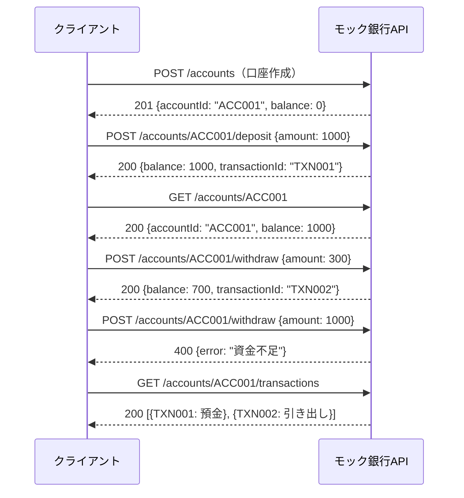
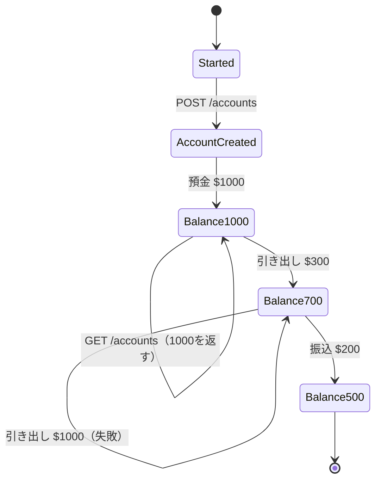
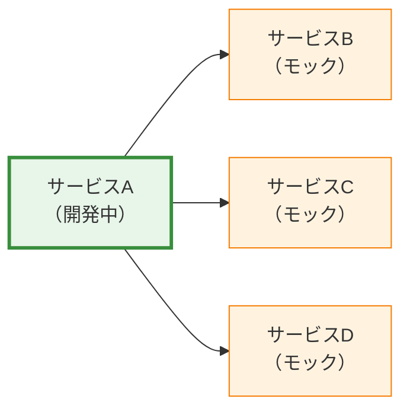
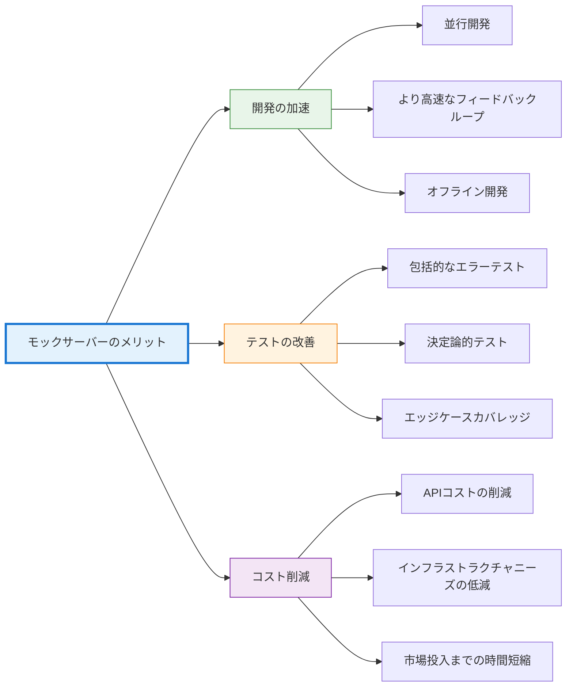

## はじめに

現代のソフトウェア開発が孤立して行われることはほとんどありません。アプリケーションは数十の外部サービスに依存しています——決済プロセッサ、認証プロバイダ、サードパーティAPI、マイクロサービス、データベースなど。各依存関係は複雑さをもたらします：開発中にサービスが利用できない、レート制限がある、繰り返し呼び出すとコストがかかる、あるいはまだ構築されていないなど。

別のチームがまだ開発中の決済APIと統合する必要があるモバイルアプリを構築していると想像してください。そのAPIがなければ、チームは待機するしかありません。あるいはエラーシナリオのテストを考えてみましょう——実際のサービスが99.9%の稼働率を持つ場合、アプリケーションが503サービス利用不可応答を処理することをどのように検証しますか？ネットワーク遅延、部分的な障害、本番環境でめったに発生しないエッジケースをどのようにシミュレートしますか？

モックサーバーは、制御可能で予測可能な動作で外部依存関係をシミュレートすることで、これらの課題を解決します。これらは単なるテストツールではありません——並行作業、包括的なテスト、高速な反復サイクルを可能にする開発アクセラレータです。本記事では、モックサーバーとは何か、なぜ重要なのか、効果的に実装する方法、そしてその価値を最大化するパターンについて探ります。

## モックサーバーの理解

実装に入る前に、モックサーバーとは何か、関連する概念とどう違うのかを明確にしましょう。

### モックサーバーとは？

モックサーバーは、実際のAPIまたはサービスエンドポイントの動作を模倣するシミュレーションサービスです。リクエストを受け入れ、入力を検証し、設定されたルールに基づいて事前定義された応答を返します。実際のサービスとは異なり、モックサーバーはローカルまたは制御された環境で実行され、即座に応答し、設定された通りに正確に動作します。

モックサーバーはネットワークレベルで動作し、実際のポートをリッスンしてHTTP/HTTPSリクエストに応答します。クライアントの観点から見ると、モックサーバーは実際のサービスと区別がつきません——同じエンドポイント、同じ応答フォーマット、同じプロトコルです。

| 実際のサービス | モックサーバー |
|--------------|---------------|
| クライアント → 実際のAPI（外部ネットワーク） | クライアント → モックサーバー（localhost:8080） |
| リクエスト：POST /api/payment | リクエスト：POST /api/payment |
| 応答：201 Created（サービス状態に依存） | 応答：201 Created（事前定義、即座） |

クライアントコードは変更不要——エンドポイントURLのみが異なります。

### モックサーバーと関連概念の違い

モックサーバーは関連するテスト概念と混同されることがよくあります。類似点はありますが、モックサーバーは異なるレベル——コードレベルではなくネットワークレベルで動作します。

**モックサーバー（ネットワークレベル）：**
- HTTP/HTTPSサービス全体をシミュレート
- 実際のネットワークポートをリッスン
- あらゆるクライアント（ブラウザ、モバイルアプリ、CLI）で動作
- コード変更不要（エンドポイントURLを変更するだけ）
- 例：WireMock、Mockoon、Prism

**ユニットテストモック（コードレベル）：**
- コード内のオブジェクト/関数を置き換え
- 単一アプリケーション内で動作
- 言語固有（JavaScriptのJest、Pythonのunittest.mock）
- コードのインストルメンテーションが必要
- 例：Jest mocks、Mockito、unittest.mock

!!!anote "🔍 抽象化レベル"
    **ユニットテストモック：** コード内の関数をモック
    - `const paymentService = { processPayment: jest.fn() };`
    - `checkout(cart, paymentService);`
    
    **モックサーバー：** HTTPエンドポイントをモック
    - `fetch('http://localhost:8080/api/payment', { method: 'POST', body: JSON.stringify({ amount: 99.99 }) })`
    
    モックサーバーは外部サービスをシミュレート；ユニットモックは内部依存関係を置き換えます。

**使い分け：**

| シナリオ | モックサーバーを使用 | ユニットモックを使用 |
|---------|-------------------|-------------------|
| API統合のテスト | ✅ | ❌ |
| 内部関数のテスト | ❌ | ✅ |
| バックエンドなしのフロントエンド開発 | ✅ | ❌ |
| ビジネスロジックのユニットテスト | ❌ | ✅ |
| サードパーティAPIのシミュレート | ✅ | ❌ |
| 関数の相互作用のテスト | ❌ | ✅ |
| クロスランゲージテスト | ✅ | ❌ |
| 高速で分離されたユニットテスト | ❌ | ✅ |

!!!tip "💡 補完的アプローチ"
    モックサーバーとユニットモックは相互排他的ではありません——両方を使用します。ビジネスロジックの高速で分離されたテストにはユニットモック。外部APIに対する統合テストと開発にはモックサーバー。ほとんどのモックサーバーツールは4つのパターンすべてをサポート——テストニーズに基づいて選択します。

### モックサーバーを使用するタイミング

モックサーバーは特定のシナリオで優れています：

**開発フェーズ：**
- 外部APIがまだ利用できない
- サードパーティサービスが有料アクセスを必要とする
- 別のチームが所有する依存関係がまだ開発中
- オフラインまたは制限されたネットワークで作業する必要がある

**テストフェーズ：**
- エラー条件のシミュレート（タイムアウト、500エラー、不正な応答）
- 実際のサービスでは再現が難しいエッジケースのテスト
- 一貫したテスト結果の確保（外部依存関係からの不安定なテストなし）
- レート制限なしの並行テスト実行

**デモフェーズ：**
- 外部依存関係なしの製品デモ
- インターネットアクセスのない環境での営業プレゼンテーション
- 予測可能な動作を持つトレーニング環境

**不適切：**
- 実際のサービスとの統合テスト（ステージング環境を使用）
- 外部サービスのパフォーマンステスト（実際の遅延パターンをシミュレートできない）
- サードパーティAPIのセキュリティテスト（モックは実際の脆弱性を明らかにしない）


## モックサーバーが重要な理由

モックサーバーの価値は利便性だけではありません——チームがソフトウェアを開発しテストする方法を根本的に変えます。

### 並行開発の実現

マイクロサービスアーキテクチャでは、チームは相互依存するサービスを同時に作業することがよくあります。モックサーバーがなければ、開発は順次的になります：チームAはチームBがAPIを完成させるまで統合作業を開始できません。

モックサーバーはこの依存関係チェーンを断ち切ります。チームはAPI契約（エンドポイント、リクエスト/レスポンスフォーマット、ステータスコード）に合意し、その後各チームが独立して作業します。フロントエンド開発者はモックされたバックエンドAPIを使用します。バックエンドチームは外部サービスをモックします。統合は両側が完了した後に行われます。

!!!example "🏗️ 並行開発ワークフロー"
    **従来の順次アプローチ：**
    1. バックエンドチームがAPIを構築（2週間）
    2. フロントエンドチームが待機
    3. フロントエンドチームがAPIと統合（1週間）
    4. 合計：3週間
    
    **モックを使用した並行アプローチ：**
    1. チームがAPI契約に合意（1日）
    2. バックエンドが実際のAPIを構築（2週間）
    3. フロントエンドがモックAPIでUIを構築（2週間、並行）
    4. 統合と調整（2日）
    5. 合計：2週間 + 2日
    
    節約時間：約1週間（33%高速）

### 包括的なエラーテスト

本番システムは障害を優雅に処理する必要があります——ネットワークタイムアウト、レート制限、サービス停止、不正な応答など。実際のサービスでこれらのシナリオをテストすることは困難です：

- 実際のサービスはオンデマンドで失敗することはほとんどない
- 特定のエラー条件を再現するには複雑なセットアップが必要
- レート制限が繰り返しテストを妨げる
- 一部のエラーは特定の条件下でのみ発生

モックサーバーはエラーテストを簡単にします。モックを503エラーを返すように設定し、アプリケーションの再試行ロジックを即座に検証します。遅延を追加してタイムアウトをシミュレートします。不正なJSONを返してエラー処理をテストします。本番障害を待つことなく、すべてのエッジケースをテストします。

!!!warning "⚠️ テストされていないエラーパスのコスト"
    **一般的なテストされていないシナリオ：**
    - タイムアウト処理（アプリはハングするか再試行するか？）
    - 部分的な障害（一部のリクエストは成功、他は失敗）
    - レート制限（429 Too Many Requests）
    - 不正な応答（無効なJSON、欠落フィールド）
    - 認証失敗（期限切れトークン、無効な資格情報）
    
    これらのシナリオはほとんどの本番インシデントを引き起こしますが、モックサーバーなしではほとんどテストされません。

### 決定論的テスト

外部サービスに依存するテストは本質的に不安定です。サービスがダウンしたり、遅かったり、毎回異なるデータを返したりする可能性があります。不安定なテストは信頼を損ないます——チームはテスト失敗を無視し始め、誤検知だと考えます。

モックサーバーは決定論的な動作を提供します。同じリクエストは常に同じ応答を返します。テストは秒ではなくミリ秒で実行されます。ネットワークの問題なし、レート制限なし、予期しないデータ変更なし。テストは信頼性が高く、高速で、信頼できるものになります。

### コスト削減

多くのサードパーティAPIはリクエストごとに課金します。開発とテストは毎日数千のリクエストを生成し、大きなコストを生み出す可能性があります。モックサーバーは開発中にこれらのコストを排除し、有料API呼び出しを本番と最終統合テストのために予約します。

さらに、モックサーバーはインフラストラクチャコストを削減します。すべての外部依存関係に専用のステージング環境は必要ありません。開発者はローカルでモックを実行し、クラウドリソースの消費を削減します。

### より高速なフィードバックループ

開発速度はフィードバック速度に依存します。外部APIの応答を数秒待つことは反復を遅くします。モックサーバーはミリ秒で応答し、迅速な開発サイクルを可能にします。コードを変更し、テストを実行し、結果を確認——すべて分ではなく秒で完了します。

この速度は時間とともに複利的に増加します。より高速なテストはより頻繁なテストを意味します。より頻繁なテストはバグをより早く発見します。より早いバグ検出はデバッグ時間を削減します。累積効果は開発を大幅に加速します。


## 実装アプローチ

モックサーバーはさまざまなツールと技術を使用して実装でき、それぞれ異なるシナリオに適しています。

### 専用モックサーバーツール

いくつかのツールはAPIモッキングに特化し、豊富な機能と簡単な設定を提供します。

**WireMock：**
- Javaベース、スタンドアロンまたは組み込みで実行
- 強力なリクエストマッチング（URL、ヘッダー、ボディ）
- 動的コンテンツを含むレスポンステンプレート
- リクエスト検証とステートフル動作
- 広範なエコシステムと統合

**Mockoon：**
- GUIを備えたデスクトップアプリケーション
- モック作成のためのビジュアルインターフェース
- テンプレート、プロキシ、CORSをサポート
- 設定のエクスポート/インポート
- ビジュアルツールを好む開発者に最適

**Prism：**
- OpenAPIファーストアプローチ
- OpenAPI仕様からモックを生成
- スキーマに対してリクエストを検証
- 動的レスポンス例
- APIファースト開発に最適

**MockServer：**
- Javaベース、複数言語のクライアントライブラリ
- 洗練されたリクエストマッチングと検証
- HTTPS、WebSocket、プロキシをサポート
- API経由のプログラマティック設定
- 強力な統合テスト機能

!!!tip "🔧 ツール選択基準"
    **WireMockを選択する場合：**
    - 強力なリクエストマッチングが必要
    - Java/JVMエコシステムで作業
    - ステートフルモッキングが必要
    
    **Mockoonを選択する場合：**
    - 設定ファイルよりGUIを好む
    - コーディングなしで迅速なセットアップが必要
    - ビジュアルモック管理が必要
    
    **Prismを選択する場合：**
    - OpenAPI仕様がある
    - 自動モック生成が必要
    - リクエスト検証が必要
    
    **MockServerを選択する場合：**
    - プログラマティック制御が必要
    - 高度な検証が必要
    - 複数のプロトコルを使用

### コードベースのモッキング

よりシンプルなシナリオや特定のフレームワークには、コードベースのモッキングがより適切な場合があります。

**Express.js（Node.js）：**
```javascript
const express = require('express');
const app = express();

app.use(express.json());

// モック決済エンドポイント
app.post('/api/payment', (req, res) => {
  const { amount, currency } = req.body;
  
  // 検証をシミュレート
  if (!amount || amount <= 0) {
    return res.status(400).json({
      error: 'Invalid amount'
    });
  }
  
  // 処理遅延をシミュレート
  setTimeout(() => {
    res.status(201).json({
      id: 'pay_' + Date.now(),
      amount,
      currency,
      status: 'completed'
    });
  }, 100);
});

app.listen(8080, () => {
  console.log('Mock server running on port 8080');
});
```

**Flask（Python）：**
```python
from flask import Flask, request, jsonify
import time

app = Flask(__name__)

@app.route('/api/payment', methods=['POST'])
def create_payment():
    data = request.json
    amount = data.get('amount')
    
    if not amount or amount <= 0:
        return jsonify({'error': 'Invalid amount'}), 400
    
    # 処理遅延をシミュレート
    time.sleep(0.1)
    
    return jsonify({
        'id': f'pay_{int(time.time())}',
        'amount': amount,
        'currency': data.get('currency', 'USD'),
        'status': 'completed'
    }), 201

if __name__ == '__main__':
    app.run(port=8080)
```

コードベースのモックは最大の柔軟性を提供しますが、APIの進化に伴いより多くのメンテナンスが必要です。

### 契約ベースのモッキング

Pactのような契約テストツールは、コンシューマー駆動の契約テストを可能にし、コンシューマーが期待を定義し、プロバイダーがコンプライアンスを検証します。

**Pactワークフロー：**
1. コンシューマーが期待される相互作用を定義（契約）
2. コンシューマーテストがモックプロバイダーに対して実行（契約から生成）
3. 契約がPact Brokerに公開
4. プロバイダーが契約を満たすことを検証
5. 両側が独立して開発、互換性に自信

このアプローチは、モックが実際のサービス動作を正確に反映することを保証し、統合の驚きを防ぎます。

### サービス仮想化

エンタープライズサービス仮想化ツール（CA Service Virtualization、Parasoft Virtualize）は高度な機能を提供します：

- 実際のサービス相互作用の記録と再生
- 複雑なステートフル動作のシミュレート
- 実際の負荷でのパフォーマンステスト
- 複数のシナリオでのデータ駆動テスト
- エンタープライズガバナンスと管理

これらのツールはほとんどのプロジェクトには過剰ですが、複雑な統合環境を持つ大企業では価値があります。


## ベストプラクティスとパターン

効果的なモックサーバーの使用には、確立されたパターンに従い、一般的な落とし穴を避ける必要があります。

### モックを現実と同期させる

モックサーバーの最大のリスクはドリフトです——モックが実際のサービス動作から乖離し、誤った自信を生み出します。モックに対するテストは合格しますが、本番では失敗します。

**緩和戦略：**

!!!anote "📋 同期技術"
    **1. 契約テスト：**
    - PactまたはPact類似ツールを使用
    - プロバイダーがコンシューマー契約を検証
    - 自動検証がドリフトを防止
    
    **2. OpenAPI仕様：**
    - OpenAPI仕様からモックを生成
    - 仕様変更時にモックを更新
    - スキーマに対してリクエストを検証
    
    **3. 統合テスト：**
    - 実際のサービスに対してテストのサブセットを実行
    - モックと現実の間の不一致を捕捉
    - 定期的にスケジュール（夜間ビルド）
    
    **4. モック記録：**
    - 実際のサービス応答を記録
    - 記録をモック応答として使用
    - 定期的に記録を更新

### 現実的なデータを使用

モックはしばしば過度に単純なデータを使用します——"test@example.com"、"John Doe"、連番ID。これは実世界のデータの複雑さでのみ現れるバグを隠します。

**より良いアプローチ：**
- 現実的な名前、メール、住所を使用
- エッジケースを含める（長い文字列、特殊文字、Unicode）
- テスト実行間でデータを変化させる
- 現実的なタイムスタンプとIDを含める

```javascript
// 悪い：非現実的なデータ
{
  "user": {
    "name": "Test User",
    "email": "test@test.com",
    "id": 1
  }
}

// 良い：エッジケースを含む現実的なデータ
{
  "user": {
    "name": "María José García-Rodríguez",
    "email": "maria.garcia+newsletter@empresa.example.com",
    "id": "usr_2nK8fH3mP9qL7xR4"
  }
}
```

### 現実的な遅延をシミュレート

モックからの即座の応答はパフォーマンス問題を隠します。実際のサービスには遅延があります——ネットワーク遅延、処理時間、データベースクエリ。アプリケーションはこれらを優雅に処理する必要があります。

モック応答に現実的な遅延を追加：
- 高速APIには50-200ms
- 遅いサービスには500-1000ms
- 時折タイムアウト（5-10秒）
- タイムアウト処理をテストするための可変遅延

```javascript
// 遅延を含むWireMock設定
{
  "request": {
    "method": "GET",
    "url": "/api/users/123"
  },
  "response": {
    "status": 200,
    "body": "{ ... }",
    "fixedDelayMilliseconds": 150,
    "delayDistribution": {
      "type": "lognormal",
      "median": 150,
      "sigma": 0.4
    }
  }
}
```

### 状態とシーケンスのモデル化

一部の相互作用にはステートフル動作が必要です——リソースを作成してから取得する。単純なモックは以前のリクエストに関係なく同じ応答を返し、状態関連のバグを見逃します。銀行取引は、ステートフルモッキングが重要な理由の優れた例を提供します。

#### ステートフルモッキングが重要な理由

操作が以前の操作に依存する銀行APIを考えてみましょう。ステートレスモックは預金と引き出しに関係なく同じ残高を返し、取引ロジック、残高検証、エラー処理の重要なバグを見逃します。

#### 銀行取引の例

ステート管理が不可欠である理由を示す現実的な銀行シナリオを見てみましょう：

**シナリオ：取引を含む口座ライフサイクル**

1. **口座開設**で新しい口座番号を作成
2. **預金**で残高を増加
3. **引き出し**で残高を減少（資金が十分な場合）
4. **残高照会**で現在の状態を返す
5. **振込**で口座間で資金を移動



**ステップ1：口座開設**

クライアントが口座を作成すると、モックは一意の口座IDを生成し、残高をゼロに初期化します：

```json
// リクエスト
POST /api/accounts
{"customerId": "CUST001"}

// 応答（状態：開始 → 口座作成済み）
201 Created
{
  "accountId": "ACC001",
  "customerId": "CUST001",
  "balance": 0,
  "currency": "USD",
  "status": "active"
}
```

モックは「開始」状態から「口座作成済み」状態に遷移し、ACC001が存在することを記憶します。

**ステップ2：預金で残高を増加**

$1000を預金すると口座残高が更新されます：

```json
// リクエスト
POST /api/accounts/ACC001/deposit
{"amount": 1000}

// 応答（状態：口座作成済み → 残高1000）
200 OK
{
  "transactionId": "TXN001",
  "type": "deposit",
  "amount": 1000,
  "balance": 1000
}
```

モックは残高が$1000であることを記憶し、「残高1000」状態に遷移します。

**ステップ3：残高照会で現在の状態を返す**

口座を照会すると現在の残高が返されます：

```json
// リクエスト
GET /api/accounts/ACC001

// 応答（状態：残高1000）
200 OK
{
  "accountId": "ACC001",
  "balance": 1000,
  "currency": "USD",
  "status": "active"
}
```

モックはハードコードされた値ではなく、現在の状態から残高を返します。

**ステップ4：引き出しで残高を減少（資金が十分な場合）**

$300を引き出すと残高が減少します：

```json
// リクエスト
POST /api/accounts/ACC001/withdraw
{"amount": 300}

// 応答（状態：残高1000 → 残高700）
200 OK
{
  "transactionId": "TXN002",
  "type": "withdrawal",
  "amount": 300,
  "balance": 700
}
```

モックは新しい残高（1000 - 300 = 700）を計算し、「残高700」状態に遷移します。

**資金不足の処理：**

利用可能額以上の引き出しを試みると失敗します：

```json
// リクエスト
POST /api/accounts/ACC001/withdraw
{"amount": 1000}

// 応答（状態：残高700、状態変化なし）
400 Bad Request
{
  "error": "資金不足",
  "code": "INSUFFICIENT_FUNDS",
  "currentBalance": 700,
  "requestedAmount": 1000
}
```

モックは現在の残高に対して引き出しを検証し、無効な操作を拒否します。

**ステップ5：振込で口座間で資金を移動**

ACC001からACC002へ$200を振込：

```json
// リクエスト
POST /api/transfers
{
  "fromAccount": "ACC001",
  "toAccount": "ACC002",
  "amount": 200
}

// 応答（状態：ACC001残高700 → 500、ACC002残高0 → 200）
200 OK
{
  "transferId": "TRF001",
  "fromAccount": "ACC001",
  "toAccount": "ACC002",
  "amount": 200,
  "status": "completed"
}
```

モックは両方の口座残高をアトミックに更新し、口座間の一貫性を維持します。

**取引履歴の追跡：**

モックはすべての操作の履歴を維持します：

```json
// リクエスト
GET /api/accounts/ACC001/transactions

// 応答
200 OK
{
  "accountId": "ACC001",
  "transactions": [
    {
      "transactionId": "TXN001",
      "type": "deposit",
      "amount": 1000,
      "balanceAfter": 1000,
      "timestamp": "2025-11-01T10:00:00Z"
    },
    {
      "transactionId": "TXN002",
      "type": "withdrawal",
      "amount": 300,
      "balanceAfter": 700,
      "timestamp": "2025-11-01T10:05:00Z"
    },
    {
      "transactionId": "TXN003",
      "type": "transfer_out",
      "amount": 200,
      "balanceAfter": 500,
      "relatedAccount": "ACC002",
      "timestamp": "2025-11-01T10:10:00Z"
    }
  ]
}
```

#### WireMock状態設定

これらの状態遷移を処理するためのWireMock設定方法：

```json
// 口座作成：開始 → 口座作成済み
{
  "scenarioName": "Banking Operations",
  "requiredScenarioState": "Started",
  "newScenarioState": "Account Created",
  "request": {
    "method": "POST",
    "url": "/api/accounts"
  },
  "response": {
    "status": 201,
    "jsonBody": {
      "accountId": "ACC001",
      "balance": 0,
      "status": "active"
    }
  }
}

// 預金：口座作成済み → 残高1000
{
  "scenarioName": "Banking Operations",
  "requiredScenarioState": "Account Created",
  "newScenarioState": "Balance 1000",
  "request": {
    "method": "POST",
    "url": "/api/accounts/ACC001/deposit",
    "bodyPatterns": [{"equalToJson": "{\"amount\": 1000}"}]
  },
  "response": {
    "status": 200,
    "jsonBody": {"balance": 1000}
  }
}

// 引き出し：残高1000 → 残高700
{
  "scenarioName": "Banking Operations",
  "requiredScenarioState": "Balance 1000",
  "newScenarioState": "Balance 700",
  "request": {
    "method": "POST",
    "url": "/api/accounts/ACC001/withdraw",
    "bodyPatterns": [{"equalToJson": "{\"amount\": 300}"}]
  },
  "response": {
    "status": 200,
    "jsonBody": {"balance": 700}
  }
}

// 資金不足：残高700、状態変化なし
{
  "scenarioName": "Banking Operations",
  "requiredScenarioState": "Balance 700",
  "request": {
    "method": "POST",
    "url": "/api/accounts/ACC001/withdraw",
    "bodyPatterns": [{"matchesJsonPath": "$[?(@.amount > 700)]"}]
  },
  "response": {
    "status": 400,
    "jsonBody": {
      "error": "資金不足",
      "currentBalance": 700
    }
  }
}
```

#### 何がステートフルにするのか？

ステートレスモックとの主な違い：

**ステートレスモック（誤り）：**
```json
// 操作に関係なく常に同じ残高を返す
GET /api/accounts/ACC001
→ {"balance": 1000}  // 引き出し後でも常に1000
```

**ステートフルモック（正しい）：**
```json
// 以前の操作に基づいて残高を返す
GET /api/accounts/ACC001
→ {"balance": 0}     // 作成後
→ {"balance": 1000}  // $1000預金後
→ {"balance": 700}   // $300引き出し後
→ {"balance": 500}   // $200振込後
```

ステートフルモックは記憶します：
- 口座作成
- 各預金と引き出し
- 現在の残高
- 取引履歴
- ビジネスルール（資金不足）

これによりテスト可能：
- ✅ 残高計算
- ✅ 資金不足処理
- ✅ 取引シーケンス
- ✅ 振込ロジック
- ✅ 履歴追跡

状態管理なしでは、これらの重要なシナリオは本番まで未テストのままです。

#### 状態遷移図

銀行モックはこの状態フローに従います：



各状態遷移はビジネスルールを検証し、それに応じてモックの内部状態を更新します。

!!!tip "💡 ステートフルモックのベストプラクティス"
    **設計上の考慮事項：**
    - シンプルな状態遷移から始める
    - 状態フロー図を文書化
    - テストスイート間で状態をリセット
    - 並行リクエストを適切に処理
    - 状態遷移を検証（無効な状態を防止）
    
    **テスト戦略：**
    - ハッピーパスシーケンスをテスト
    - 無効な状態遷移をテスト（預金前の引き出し）
    - 並行操作をテスト
    - リクエスト間の状態永続性をテスト
    - 取引履歴の正確性を検証
    
    **ステートフルモックを使用するタイミング：**
    - ✅ ワークフローのテスト（口座作成 → 預金 → 引き出し）
    - ✅ ビジネスルールの検証（資金不足）
    - ✅ 取引シーケンスのテスト
    - ✅ 状態一貫性の検証
    - ❌ シンプルなリクエスト/レスポンスシナリオ（ステートレススタブを使用）
    - ❌ パフォーマンステスト（実際のサービスを使用）

ステートフルモッキングは、モックサーバーをシンプルなレスポンスジェネレータから現実的なサービスシミュレータに変換します。銀行の例は、適切な状態管理が、実際のサービスに対してテストすることが困難または高コストな複雑なワークフロー、ビジネスルール、エラー条件のテストを可能にする方法を示しています。

### エラーシナリオを明示的にテスト

ハッピーパスだけをモックしないでください。エラーシナリオを明示的にテストします：

- 400 Bad Request（無効な入力）
- 401 Unauthorized（認証失敗）
- 403 Forbidden（認可失敗）
- 404 Not Found（リソースが存在しない）
- 429 Too Many Requests（レート制限）
- 500 Internal Server Error（サーバー障害）
- 503 Service Unavailable（一時的な停止）
- ネットワークタイムアウト
- 不正な応答

各エラータイプの専用テストケースを作成し、アプリケーションが正しく処理することを検証します。

### モック設定をバージョン管理

モック設定はコードです——コードとして扱います。アプリケーションコードと一緒にバージョン管理に設定を保存します。これにより可能になります：

- 時間経過に伴う変更の追跡
- 問題のある変更の復元
- プルリクエストでのモック更新のレビュー
- チーム間での設定の共有
- 履歴テスト環境の再現

### 過度なモッキングを避ける

すべてをモックすることは誤った自信を生み出します。一部の統合ポイントは実際のサービスを使用すべきです：

- 外部サービスの重要なビジネスロジック
- 複雑な認証フロー
- 決済処理（サンドボックス環境を使用）
- データベース相互作用（モックではなくテストデータベースを使用）

モック（速度と分離のため）と実際の統合テスト（信頼のため）のバランスを取ります。


## 一般的なパターンとユースケース

モックサーバーはいくつかの強力な開発パターンを可能にします。

### APIファースト開発

チームは実装前にAPI契約を定義し、並行開発を可能にします：

1. **APIを設計**：OpenAPI仕様を作成
2. **モックを生成**：PrismまたはPrism類似ツールを使用
3. **フロントエンド開発**：モックAPIに対して
4. **バックエンド開発**：仕様を実装
5. **統合**：モックを実際のAPIに置き換え

このアプローチは統合の摩擦を減らし、フロントエンド/バックエンドの整合性を確保します。

### マイクロサービス開発

マイクロサービスアーキテクチャでは、サービスは複数の他のサービスに依存します。すべての依存関係をローカルで実行することは非現実的です。モックサーバーは分離された開発を可能にします：



開発者はモックされた依存関係でサービスAを作業し、統合テスト中にモックを実際のサービスに交換します。

### サードパーティAPI統合

サードパーティAPI（決済プロセッサ、ソーシャルメディア、分析）を統合する際、モックサーバーは提供します：

- **APIキーなしの開発**：本番資格情報を共有する必要なし
- **無制限のテスト**：レート制限やコストなし
- **オフライン開発**：インターネット接続なしで作業
- **予測可能な動作**：API変更からの驚きなし

サードパーティAPIの動作を反映するモックを維持し、APIが変更されたときに更新します。

### カオスエンジニアリング

モックサーバーは制御されたカオステストを可能にします——障害をシミュレートして回復力を検証：

- ランダムタイムアウト
- 断続的な500エラー
- 段階的なパフォーマンス低下
- 部分的な応答破損
- 接続リセット

```javascript
// WireMockカオス設定
{
  "request": {
    "method": "GET",
    "url": "/api/data"
  },
  "response": {
    "status": 200,
    "body": "{ ... }",
    "fault": "RANDOM_DATA_THEN_CLOSE"
  }
}
```

これは実際のサービスに影響を与えることなくアプリケーションの回復力をテストします。

### デモとトレーニング環境

モックサーバーは信頼性の高いデモ環境を作成します：

- 外部依存関係なし
- 予測可能なデータと動作
- オフラインで動作
- 本番データを公開するリスクなし
- デモ間で一貫した体験

営業チームとトレーナーは、外部サービスの可用性やデータプライバシーを心配することなく機能をデモできます。

## 課題と制限

モックサーバーは万能ではありません——制限と潜在的な落とし穴があります。

### メンテナンスオーバーヘッド

モック設定にはメンテナンスが必要です。APIが進化するにつれて、モックを更新する必要があります。古いモックは誤った自信を生み出します——テストは合格しますが、本番では失敗します。

**緩和策：**
- OpenAPI仕様からモックを自動生成
- 契約テストを使用してドリフトを検出
- 実際のサービスに対する統合テストを定期的にスケジュール
- モックメンテナンスの所有権を割り当て

### 誤った自信

モックに対して合格するテストは本番の成功を保証しません。モックは実際のサービスの動作、エッジケース、パフォーマンス特性を正確に反映しない可能性があります。

!!!warning "⚠️ モックの罠"
    **症状：**
    - すべてのテストがローカルで合格
    - モックに対する統合テストが合格
    - 本番デプロイが失敗
    
    **原因：**
    - モックが実際のサービス動作と一致しない
    - 実際のサービスに文書化されていない癖がある
    - ネットワーク条件がモックされた遅延と異なる
    - 認証/認可が異なる動作をする
    
    **予防：**
    - 実際のサービスに対して定期的に統合テストを実行
    - 契約テストを使用
    - 予期しない動作について本番を監視
    - 本番の観察に基づいてモックを更新

### ステートフルシナリオの複雑さ

複雑なステートフル相互作用のモッキングは困難です。実際のサービスはリクエスト間で状態を維持し、並行アクセスを処理し、ビジネスルールを実施します。モックでこれを複製するには大きな努力が必要です。

複雑なステートフルシナリオの場合、すべての動作をモックしようとするのではなく、テスト環境で実際のサービスを使用することを検討してください。

### パフォーマンステストの制限

モックサーバーは実際のサービスのパフォーマンス特性を正確にシミュレートできません：

- ネットワーク遅延は地理、ルーティング、混雑によって異なる
- 実際のサービスは負荷に基づいて可変の応答時間を持つ
- キャッシング動作はモックと実際のサービスで異なる
- データベースクエリのパフォーマンスは正確にモックできない

機能テストにはモックを使用しますが、パフォーマンステストには実際のサービスまたは洗練されたサービス仮想化ツールが必要です。

### セキュリティテストのギャップ

モックは外部サービスのセキュリティ脆弱性を明らかにしません。認証、認可、データ検証のテストには実際のサービスが必要です。モックは過度に寛容であることでセキュリティ問題を意図せず隠す可能性があります。

## 実世界での採用

モックサーバーは業界と企業規模を超えて広く採用されています。

### 業界の例

!!!example "💼 Eコマースプラットフォーム"
    **課題：**
    - 決済プロセッサ、配送API、在庫システムとの統合
    - 決済APIは取引ごとに課金
    - 配送APIはレート制限あり
    
    **解決策：**
    - 開発とテストのために決済APIをモック
    - 現実的な応答で配送APIをモック
    - 最終統合テストのみで実際のAPIを使用
    
    **結果：**
    - 開発中の決済APIコストが70%削減
    - より高速なテスト実行（分ではなく秒）
    - エラーシナリオのテスト能力（決済拒否、配送失敗）

!!!example "🏦 銀行アプリケーション"
    **課題：**
    - コア銀行システム（メインフレーム）との統合
    - メインフレームアクセスが制限され遅い
    - テストには複雑なデータセットアップが必要
    
    **解決策：**
    - メインフレーム相互作用を記録
    - 記録からモックを作成
    - 開発者は日常業務でモックを使用
    
    **結果：**
    - 開発速度が3倍に向上
    - メインフレーム負荷を削減
    - チーム間の並行開発を実現

!!!example "📱 モバイルアプリ開発"
    **課題：**
    - バックエンドAPIが開発中
    - モバイルチームがAPIを待ってブロック
    - 開発中のAPI変更が頻繁
    
    **解決策：**
    - OpenAPI仕様を使用したAPIファーストアプローチ
    - 仕様からモックを生成
    - モバイルチームがモックに対して開発
    
    **結果：**
    - 並行開発（2週間節約）
    - スムーズな統合（仕様駆動開発）
    - 統合バグの削減

### チーム採用パターン

成功したモックサーバー採用は共通のパターンに従います：

**フェーズ1：個人採用**
- 開発者が個人の生産性のためにモックサーバーを発見
- 特定の問題に対するアドホックな使用
- チーム全体の標準なし

**フェーズ2：チーム標準化**
- チームが共通のモックサーバーツールを採用
- バージョン管理での共有モック設定
- CI/CDパイプラインとの統合

**フェーズ3：組織全体の実践**
- モックサーバーが開発標準の一部に
- 集中型モック管理
- APIガバナンスとの統合

## 将来の方向性

モックサーバー技術は進化を続けており、いくつかの新興トレンドがあります。

### AI駆動のモック生成

機械学習モデルはAPIトラフィックを分析し、現実的なモックを自動生成できます：

- 本番トラフィックから応答パターンを学習
- 現実的なテストデータを生成
- 可能性の高いエラーシナリオを予測
- 使用パターンに基づいてモックを適応

これにより手動モック設定の労力が削減され、モックのリアリズムが向上します。

### サービスメッシュ統合

サービスメッシュ（Istio、Linkerd）は洗練されたトラフィック管理を可能にします。モックサーバーとの統合により可能になります：

- コード変更なしの動的モック注入
- 実際のサービスとモックされたサービス間のA/Bテスト
- モックから実際のサービスへの段階的移行
- カオスエンジニアリングのための障害注入

### 契約ファースト開発

契約ファースト開発（OpenAPI、GraphQLスキーマ、gRPC protobuf）の採用拡大により、モック生成が自動化されます：

- 契約を定義
- モックを自動生成
- クライアントコードを生成
- サーバースタブを生成
- 契約に対して実装を検証

このアプローチは手動モックメンテナンスを排除し、一貫性を確保します。

### クラウドベースのモックサービス

クラウドプラットフォームはマネージドモックサービスをますます提供しています：

- インフラストラクチャ管理なしのホスト型モックサーバー
- 協調的なモック編集と共有
- APIゲートウェイとの統合
- モック使用の分析

これらのサービスは運用オーバーヘッドを削減し、より簡単なコラボレーションを可能にします。

## 結論

モックサーバーは、シンプルなテストユーティリティから、チームがソフトウェアを構築する方法を根本的に変える不可欠な開発ツールへと進化しました。制御可能で予測可能な動作で外部依存関係をシミュレートすることで、モックサーバーは並行開発、包括的なテスト、より高速な反復サイクルを可能にします。

メリットは大きいです：チームは依存関係を待つことなく独立して作業し、エラーシナリオは徹底的にテストされ、テストは高速で決定論的になり、開発コストは減少します。モックサーバーは開発を順次から並行へ、脆弱から堅牢へ、遅いから速いへと変革します。



しかし、モックサーバーには課題がないわけではありません。モックの正確性を維持するには規律と自動化が必要です。不正確なモックに対して合格するテストからの誤った自信は本番障害につながる可能性があります。複雑なステートフルシナリオは現実的にモックすることが困難です。鍵はモックと実際の統合テストのバランスを取ることです——速度と分離のためにモックを使用しますが、定期的に実際のサービスに対して検証します。

モックサーバーを評価するチームにとって、問題はそれらを採用するかどうかではなく、開発ワークフローに効果的に統合する方法です。小さく始めましょう——単一の問題のある依存関係をモックします。モック設定とメンテナンスのパターンを確立します。チームが経験を積むにつれて使用を徐々に拡大します。モックを現実と同期させるために自動化に投資します。

モックサーバーの未来は有望です。AI駆動のモック生成は手動設定を削減します。サービスメッシュ統合は洗練されたトラフィック管理を可能にします。契約ファースト開発はモックを自動的に正確にします。クラウドベースのサービスは運用オーバーヘッドを削減します。

現代のソフトウェア開発は本質的に分散されています——アプリケーションは多数の外部サービスに依存します。モックサーバーはこの複雑さを管理可能にし、チームが依存関係にもかかわらず自信を持って開発できるようにします。これらは単なるテストツールではありません——並行作業、包括的なテスト、より高速な配信を解き放つ開発アクセラレータです。

外部依存関係を持つソフトウェアを構築するあらゆるチームにとって、モックサーバーはもはやオプションではありません——不可欠です。生産性の向上、テストの改善、コスト削減は、モックサーバーインフラストラクチャの学習と維持への投資を正当化します。今日からモックサーバーを使い始め、開発速度と自信の変革を体験してください。

開発の未来は並行、高速、回復力があります。モックサーバーは、一度に1つのシミュレートされたリクエストでその未来を構築しています。

## 参考資料

- **WireMock**：[https://wiremock.org/](https://wiremock.org/)
- **Mockoon**：[https://mockoon.com/](https://mockoon.com/)
- **Prism**：[https://stoplight.io/open-source/prism](https://stoplight.io/open-source/prism)
- **MockServer**：[https://www.mock-server.com/](https://www.mock-server.com/)
- **Pact（契約テスト）**：[https://pact.io/](https://pact.io/)
- **OpenAPI仕様**：[https://swagger.io/specification/](https://swagger.io/specification/)
- **Martin FowlerのMocksについて**：[https://martinfowler.com/articles/mocksArentStubs.html](https://martinfowler.com/articles/mocksArentStubs.html)
