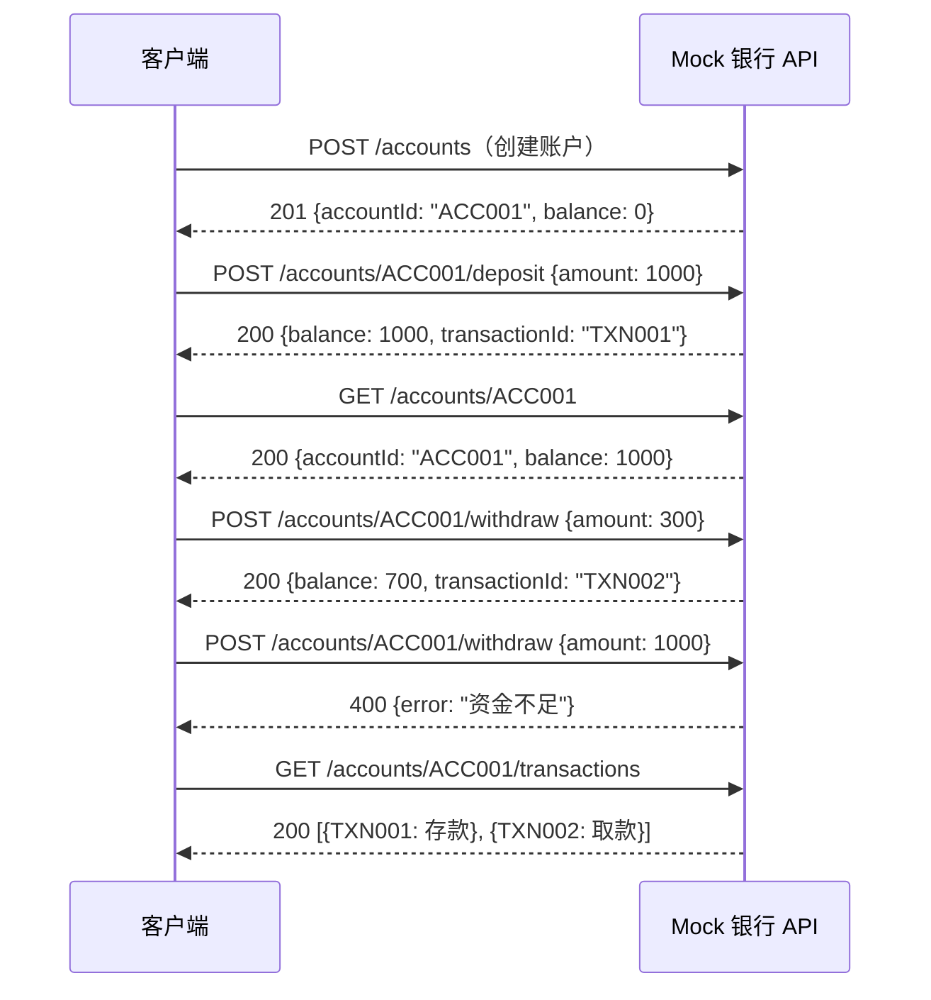
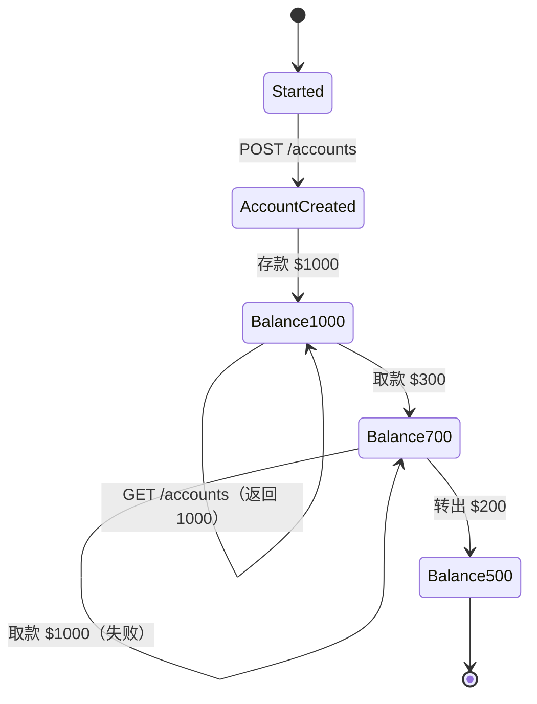
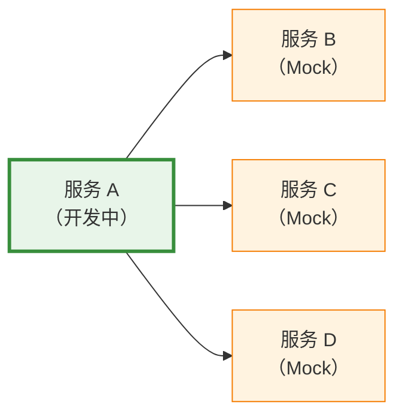
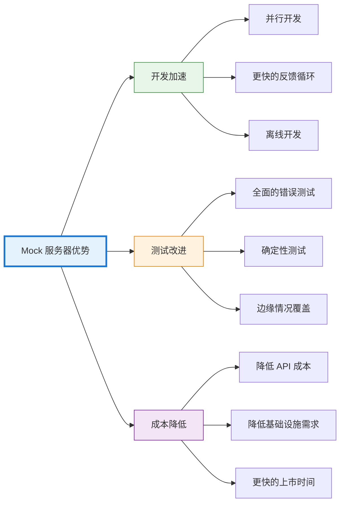

## 引言

现代软件开发很少是孤立进行的。应用程序依赖于数十个外部服务——支付处理器、身份验证提供商、第三方 API、微服务和数据库。每个依赖项都会带来复杂性：服务在开发期间可能不可用、受速率限制、重复调用成本高昂，或者根本还没有构建。

想象一下，你正在构建一个移动应用，需要集成一个仍在由另一个团队开发的支付 API。没有那个 API，你的团队只能闲置等待。或者考虑测试错误场景——当真实服务有 99.9% 的正常运行时间时，你如何验证应用程序处理 503 服务不可用响应？如何模拟网络延迟、部分故障或生产环境中很少发生的边缘情况？

Mock 服务器通过使用可控、可预测的行为模拟外部依赖项来解决这些挑战。它们不仅仅是测试工具——它们是开发加速器，能够实现并行工作、全面测试和更快的迭代周期。本文将探讨什么是 Mock 服务器、为什么它们至关重要、如何有效实施它们，以及能够最大化其价值的模式。

## 理解 Mock 服务器

在深入实施之前，让我们先明确什么是 Mock 服务器以及它们与相关概念的区别。

### 什么是 Mock 服务器？

Mock 服务器是一个模拟真实 API 或服务端点行为的仿真服务。它接受请求、验证输入，并根据配置的规则返回预定义的响应。与真实服务不同，Mock 服务器在本地或受控环境中运行，立即响应，并完全按照配置的方式运行。

Mock 服务器在网络层面运行，监听实际端口并响应 HTTP/HTTPS 请求。从客户端的角度来看，Mock 服务器与真实服务无法区分——相同的端点、相同的响应格式、相同的协议。

| 真实服务 | Mock 服务器 |
|---------|------------|
| 客户端 → 真实 API（外部网络） | 客户端 → Mock 服务器（localhost:8080） |
| 请求：POST /api/payment | 请求：POST /api/payment |
| 响应：201 Created（取决于服务状态） | 响应：201 Created（预定义，即时） |

客户端代码保持不变——只有端点 URL 不同。

### Mock 服务器与相关概念的区别

Mock 服务器经常与相关的测试概念混淆。虽然它们有相似之处，但 Mock 服务器在不同的层面运行——网络层而不是代码层。

**Mock 服务器（网络层）：**
- 模拟整个 HTTP/HTTPS 服务
- 监听实际网络端口
- 适用于任何客户端（浏览器、移动应用、CLI）
- 无需更改代码（只需更改端点 URL）
- 示例：WireMock、Mockoon、Prism

**单元测试 Mock（代码层）：**
- 替换代码中的对象/函数
- 在单个应用程序内工作
- 特定于语言（JavaScript 的 Jest、Python 的 unittest.mock）
- 需要代码插桩
- 示例：Jest mocks、Mockito、unittest.mock

!!!anote "🔍 抽象层级"
    **单元测试 mock：** 模拟代码中的函数
    - `const paymentService = { processPayment: jest.fn() };`
    - `checkout(cart, paymentService);`
    
    **Mock 服务器：** 模拟 HTTP 端点
    - `fetch('http://localhost:8080/api/payment', { method: 'POST', body: JSON.stringify({ amount: 99.99 }) })`
    
    Mock 服务器模拟外部服务；单元 mock 替换内部依赖项。

**何时使用：**

| 场景 | 使用 Mock 服务器 | 使用单元 Mock |
|------|----------------|--------------|
| 测试 API 集成 | ✅ | ❌ |
| 测试内部函数 | ❌ | ✅ |
| 无后端的前端开发 | ✅ | ❌ |
| 单元测试业务逻辑 | ❌ | ✅ |
| 模拟第三方 API | ✅ | ❌ |
| 测试函数交互 | ❌ | ✅ |
| 跨语言测试 | ✅ | ❌ |
| 快速隔离的单元测试 | ❌ | ✅ |

!!!tip "💡 互补方法"
    Mock 服务器和单元 mock 并不互斥——两者都使用。单元 mock 用于快速、隔离的业务逻辑测试。Mock 服务器用于集成测试和针对外部 API 的开发。大多数 Mock 服务器工具支持所有四种模式——根据测试需求选择。

### 何时使用 Mock 服务器

Mock 服务器在特定场景中表现出色：

**开发阶段：**
- 外部 API 尚未可用
- 第三方服务需要付费访问
- 由另一个团队拥有的依赖项仍在开发中
- 需要离线工作或在受限网络中工作

**测试阶段：**
- 模拟错误条件（超时、500 错误、格式错误的响应）
- 测试难以用真实服务重现的边缘情况
- 确保一致的测试结果（没有来自外部依赖项的不稳定测试）
- 并行测试执行，无速率限制

**演示阶段：**
- 无外部依赖的产品演示
- 在没有互联网访问的环境中进行销售演示
- 具有可预测行为的培训环境

**不适用：**
- 与真实服务的集成测试（使用预发布环境）
- 外部服务的性能测试（无法模拟真实的延迟模式）
- 第三方 API 的安全测试（mock 不会揭示真实的漏洞）


## 为什么 Mock 服务器很重要

Mock 服务器的价值不仅仅是便利性——它们从根本上改变了团队开发和测试软件的方式。

### 实现并行开发

在微服务架构中，团队经常同时处理相互依赖的服务。没有 Mock 服务器，开发就会变成顺序进行：团队 A 等待团队 B 完成他们的 API 后才能开始集成工作。

Mock 服务器打破了这种依赖链。团队就 API 契约（端点、请求/响应格式、状态码）达成一致，然后每个团队独立工作。前端开发人员使用模拟的后端 API。后端团队模拟外部服务。集成在双方都完成后进行。

!!!example "🏗️ 并行开发工作流"
    **传统顺序方法：**
    1. 后端团队构建 API（2 周）
    2. 前端团队等待
    3. 前端团队与 API 集成（1 周）
    4. 总计：3 周
    
    **使用 Mock 的并行方法：**
    1. 团队就 API 契约达成一致（1 天）
    2. 后端构建真实 API（2 周）
    3. 前端使用 mock API 构建 UI（2 周，并行）
    4. 集成和调整（2 天）
    5. 总计：2 周 + 2 天
    
    节省时间：约 1 周（快 33%）

### 全面的错误测试

生产系统必须优雅地处理故障——网络超时、速率限制、服务中断、格式错误的响应。使用真实服务测试这些场景很困难：

- 真实服务很少按需失败
- 重现特定错误条件需要复杂的设置
- 速率限制阻止重复测试
- 某些错误仅在特定条件下发生

Mock 服务器使错误测试变得简单。配置 mock 返回 503 错误，立即验证应用程序的重试逻辑。通过添加延迟来模拟超时。返回格式错误的 JSON 来测试错误处理。测试每个边缘情况，无需等待生产故障。

!!!warning "⚠️ 未测试错误路径的代价"
    **常见的未测试场景：**
    - 超时处理（你的应用会挂起还是重试？）
    - 部分故障（一些请求成功，其他失败）
    - 速率限制（429 Too Many Requests）
    - 格式错误的响应（无效的 JSON、缺少字段）
    - 身份验证失败（过期的令牌、无效的凭据）
    
    这些场景导致大多数生产事故，但没有 Mock 服务器很少被测试。

### 确定性测试

依赖外部服务的测试本质上是不稳定的。服务可能宕机、缓慢或每次返回不同的数据。不稳定的测试会削弱信心——团队开始忽略测试失败，认为它们是误报。

Mock 服务器提供确定性行为。相同的请求总是返回相同的响应。测试在毫秒内运行，而不是秒。没有网络问题，没有速率限制，没有意外的数据更改。测试变得可靠、快速和值得信赖。

### 降低成本

许多第三方 API 按请求收费。开发和测试每天可能产生数千个请求，造成巨大的成本。Mock 服务器在开发期间消除了这些成本，将付费 API 调用保留给生产和最终集成测试。

此外，Mock 服务器降低了基础设施成本。不需要为每个外部依赖项提供专用的预发布环境。开发人员在本地运行 mock，减少云资源消耗。

### 更快的反馈循环

开发速度取决于反馈速度。等待外部 API 响应几秒钟会减慢迭代速度。Mock 服务器在毫秒内响应，实现快速的开发周期。更改代码、运行测试、查看结果——全部在几秒钟内完成，而不是几分钟。

这种速度随着时间的推移而累积。更快的测试意味着更频繁的测试。更频繁的测试更早地发现错误。更早的错误检测减少了调试时间。累积效应显著加速了开发。


## 实施方法

Mock 服务器可以使用各种工具和技术实现，每种都适合不同的场景。

### 专用 Mock 服务器工具

几个工具专门用于 API 模拟，提供丰富的功能和简单的配置。

**WireMock：**
- 基于 Java，可独立运行或嵌入
- 强大的请求匹配（URL、标头、正文）
- 带有动态内容的响应模板
- 请求验证和有状态行为
- 广泛的生态系统和集成

**Mockoon：**
- 带有 GUI 的桌面应用程序
- 用于创建 mock 的可视化界面
- 支持模板、代理和 CORS
- 导出/导入配置
- 适合喜欢可视化工具的开发人员

**Prism：**
- OpenAPI 优先方法
- 从 OpenAPI 规范生成 mock
- 根据模式验证请求
- 动态响应示例
- 非常适合 API 优先开发

**MockServer：**
- 基于 Java，具有多种语言的客户端库
- 复杂的请求匹配和验证
- 支持 HTTPS、WebSocket 和代理
- 通过 API 进行编程配置
- 强大的集成测试能力

!!!tip "🔧 工具选择标准"
    **选择 WireMock 如果：**
    - 需要强大的请求匹配
    - 在 Java/JVM 生态系统中工作
    - 需要有状态模拟
    
    **选择 Mockoon 如果：**
    - 更喜欢 GUI 而不是配置文件
    - 需要快速设置而无需编码
    - 想要可视化 mock 管理
    
    **选择 Prism 如果：**
    - 有 OpenAPI 规范
    - 想要自动 mock 生成
    - 需要请求验证
    
    **选择 MockServer 如果：**
    - 需要编程控制
    - 需要高级验证
    - 使用多种协议

### 基于代码的模拟

对于更简单的场景或特定框架，基于代码的模拟可能更合适。

**Express.js（Node.js）：**
```javascript
const express = require('express');
const app = express();

app.use(express.json());

// Mock 支付端点
app.post('/api/payment', (req, res) => {
  const { amount, currency } = req.body;
  
  // 模拟验证
  if (!amount || amount <= 0) {
    return res.status(400).json({
      error: 'Invalid amount'
    });
  }
  
  // 模拟处理延迟
  setTimeout(() => {
    res.status(201).json({
      id: 'pay_' + Date.now(),
      amount,
      currency,
      status: 'completed'
    });
  }, 100);
});

app.listen(8080, () => {
  console.log('Mock server running on port 8080');
});
```

**Flask（Python）：**
```python
from flask import Flask, request, jsonify
import time

app = Flask(__name__)

@app.route('/api/payment', methods=['POST'])
def create_payment():
    data = request.json
    amount = data.get('amount')
    
    if not amount or amount <= 0:
        return jsonify({'error': 'Invalid amount'}), 400
    
    # 模拟处理延迟
    time.sleep(0.1)
    
    return jsonify({
        'id': f'pay_{int(time.time())}',
        'amount': amount,
        'currency': data.get('currency', 'USD'),
        'status': 'completed'
    }), 201

if __name__ == '__main__':
    app.run(port=8080)
```

基于代码的 mock 提供最大的灵活性，但随着 API 的演变需要更多的维护。

### 基于契约的模拟

像 Pact 这样的契约测试工具支持消费者驱动的契约测试，消费者定义期望，提供者验证合规性。

**Pact 工作流：**
1. 消费者定义预期的交互（契约）
2. 消费者测试针对 mock 提供者运行（从契约生成）
3. 契约发布到 Pact Broker
4. 提供者验证它满足契约
5. 双方独立开发，对兼容性充满信心

这种方法确保 mock 准确反映真实服务行为，防止集成意外。

### 服务虚拟化

企业服务虚拟化工具（CA Service Virtualization、Parasoft Virtualize）提供高级功能：

- 记录和重放真实服务交互
- 模拟复杂的有状态行为
- 使用真实负载进行性能测试
- 使用多个场景进行数据驱动测试
- 企业治理和管理

这些工具对大多数项目来说过于复杂，但在具有复杂集成环境的大型企业中很有价值。


## 最佳实践和模式

有效使用 Mock 服务器需要遵循既定的模式并避免常见的陷阱。

### 保持 Mock 与现实同步

Mock 服务器的最大风险是漂移——mock 与真实服务行为发生偏离，产生虚假的信心。测试针对 mock 通过，但在生产中失败。

**缓解策略：**

!!!anote "📋 同步技术"
    **1. 契约测试：**
    - 使用 Pact 或类似工具
    - 提供者验证消费者契约
    - 自动验证防止漂移
    
    **2. OpenAPI 规范：**
    - 从 OpenAPI 规范生成 mock
    - 规范更改时更新 mock
    - 根据模式验证请求
    
    **3. 集成测试：**
    - 针对真实服务运行测试子集
    - 捕获 mock 与现实之间的差异
    - 定期安排（每晚构建）
    
    **4. Mock 录制：**
    - 记录真实服务响应
    - 使用录制作为 mock 响应
    - 定期更新录制

### 使用真实数据

Mock 通常使用过于简单的数据——"test@example.com"、"John Doe"、顺序 ID。这掩盖了只在真实世界数据复杂性下出现的错误。

**更好的方法：**
- 使用真实的姓名、电子邮件、地址
- 包括边缘情况（长字符串、特殊字符、Unicode）
- 在测试运行中变化数据
- 包括真实的时间戳和 ID

```javascript
// 差：不真实的数据
{
  "user": {
    "name": "Test User",
    "email": "test@test.com",
    "id": 1
  }
}

// 好：带有边缘情况的真实数据
{
  "user": {
    "name": "María José García-Rodríguez",
    "email": "maria.garcia+newsletter@empresa.example.com",
    "id": "usr_2nK8fH3mP9qL7xR4"
  }
}
```

### 模拟真实延迟

来自 mock 的即时响应隐藏了性能问题。真实服务有延迟——网络延迟、处理时间、数据库查询。应用程序必须优雅地处理这些。

为 mock 响应添加真实延迟：
- 快速 API 为 50-200ms
- 较慢的服务为 500-1000ms
- 偶尔超时（5-10 秒）
- 可变延迟以测试超时处理

```javascript
// 带有延迟的 WireMock 配置
{
  "request": {
    "method": "GET",
    "url": "/api/users/123"
  },
  "response": {
    "status": 200,
    "body": "{ ... }",
    "fixedDelayMilliseconds": 150,
    "delayDistribution": {
      "type": "lognormal",
      "median": 150,
      "sigma": 0.4
    }
  }
}
```

### 建模状态和序列

某些交互需要有状态行为——创建资源，然后检索它。简单的 mock 无论之前的请求如何都返回相同的响应，遗漏了与状态相关的错误。银行交易提供了一个很好的例子，说明为什么有状态模拟很重要。

#### 为什么有状态模拟很重要

考虑一个银行 API，其中操作依赖于先前的操作。无状态 mock 无论存款和取款如何都会返回相同的余额，遗漏了交易逻辑、余额验证和错误处理中的关键错误。

#### 银行交易示例

让我们通过一个真实的银行场景来演示为什么状态管理至关重要：

**场景：带有交易的账户生命周期**

1. **开户**创建新账号
2. **存款**增加余额
3. **取款**减少余额（如果资金充足）
4. **余额查询**返回当前状态
5. **转账**在账户之间转移资金



**步骤 1：开户**

当客户端创建账户时，mock 生成唯一的账户 ID 并将余额初始化为零：

```json
// 请求
POST /api/accounts
{"customerId": "CUST001"}

// 响应（状态：已开始 → 账户已创建）
201 Created
{
  "accountId": "ACC001",
  "customerId": "CUST001",
  "balance": 0,
  "currency": "USD",
  "status": "active"
}
```

mock 从"已开始"状态转换到"账户已创建"状态，记住 ACC001 现在存在。

**步骤 2：存款增加余额**

存入 $1000 更新账户余额：

```json
// 请求
POST /api/accounts/ACC001/deposit
{"amount": 1000}

// 响应（状态：账户已创建 → 余额 1000）
200 OK
{
  "transactionId": "TXN001",
  "type": "deposit",
  "amount": 1000,
  "balance": 1000
}
```

mock 现在记住余额是 $1000 并转换到"余额 1000"状态。

**步骤 3：余额查询返回当前状态**

查询账户返回当前余额：

```json
// 请求
GET /api/accounts/ACC001

// 响应（状态：余额 1000）
200 OK
{
  "accountId": "ACC001",
  "balance": 1000,
  "currency": "USD",
  "status": "active"
}
```

mock 从其当前状态返回余额，而不是硬编码值。

**步骤 4：取款减少余额（如果资金充足）**

取出 $300 减少余额：

```json
// 请求
POST /api/accounts/ACC001/withdraw
{"amount": 300}

// 响应（状态：余额 1000 → 余额 700）
200 OK
{
  "transactionId": "TXN002",
  "type": "withdrawal",
  "amount": 300,
  "balance": 700
}
```

mock 计算新余额（1000 - 300 = 700）并转换到"余额 700"状态。

**资金不足处理：**

尝试取出超过可用金额的资金会失败：

```json
// 请求
POST /api/accounts/ACC001/withdraw
{"amount": 1000}

// 响应（状态：余额 700，无状态变化）
400 Bad Request
{
  "error": "资金不足",
  "code": "INSUFFICIENT_FUNDS",
  "currentBalance": 700,
  "requestedAmount": 1000
}
```

mock 根据当前余额验证取款并拒绝无效操作。

**步骤 5：转账在账户之间转移资金**

从 ACC001 转账 $200 到 ACC002：

```json
// 请求
POST /api/transfers
{
  "fromAccount": "ACC001",
  "toAccount": "ACC002",
  "amount": 200
}

// 响应（状态：ACC001 余额 700 → 500，ACC002 余额 0 → 200）
200 OK
{
  "transferId": "TRF001",
  "fromAccount": "ACC001",
  "toAccount": "ACC002",
  "amount": 200,
  "status": "completed"
}
```

mock 原子地更新两个账户余额，保持账户之间的一致性。

**交易历史跟踪：**

mock 维护所有操作的历史记录：

```json
// 请求
GET /api/accounts/ACC001/transactions

// 响应
200 OK
{
  "accountId": "ACC001",
  "transactions": [
    {
      "transactionId": "TXN001",
      "type": "deposit",
      "amount": 1000,
      "balanceAfter": 1000,
      "timestamp": "2025-11-01T10:00:00Z"
    },
    {
      "transactionId": "TXN002",
      "type": "withdrawal",
      "amount": 300,
      "balanceAfter": 700,
      "timestamp": "2025-11-01T10:05:00Z"
    },
    {
      "transactionId": "TXN003",
      "type": "transfer_out",
      "amount": 200,
      "balanceAfter": 500,
      "relatedAccount": "ACC002",
      "timestamp": "2025-11-01T10:10:00Z"
    }
  ]
}
```

#### WireMock 状态配置

以下是如何配置 WireMock 来处理这些状态转换：

```json
// 创建账户：已开始 → 账户已创建
{
  "scenarioName": "Banking Operations",
  "requiredScenarioState": "Started",
  "newScenarioState": "Account Created",
  "request": {
    "method": "POST",
    "url": "/api/accounts"
  },
  "response": {
    "status": 201,
    "jsonBody": {
      "accountId": "ACC001",
      "balance": 0,
      "status": "active"
    }
  }
}

// 存款：账户已创建 → 余额 1000
{
  "scenarioName": "Banking Operations",
  "requiredScenarioState": "Account Created",
  "newScenarioState": "Balance 1000",
  "request": {
    "method": "POST",
    "url": "/api/accounts/ACC001/deposit",
    "bodyPatterns": [{"equalToJson": "{\"amount\": 1000}"}]
  },
  "response": {
    "status": 200,
    "jsonBody": {"balance": 1000}
  }
}

// 取款：余额 1000 → 余额 700
{
  "scenarioName": "Banking Operations",
  "requiredScenarioState": "Balance 1000",
  "newScenarioState": "Balance 700",
  "request": {
    "method": "POST",
    "url": "/api/accounts/ACC001/withdraw",
    "bodyPatterns": [{"equalToJson": "{\"amount\": 300}"}]
  },
  "response": {
    "status": 200,
    "jsonBody": {"balance": 700}
  }
}

// 资金不足：余额 700，无状态变化
{
  "scenarioName": "Banking Operations",
  "requiredScenarioState": "Balance 700",
  "request": {
    "method": "POST",
    "url": "/api/accounts/ACC001/withdraw",
    "bodyPatterns": [{"matchesJsonPath": "$[?(@.amount > 700)]"}]
  },
  "response": {
    "status": 400,
    "jsonBody": {
      "error": "资金不足",
      "currentBalance": 700
    }
  }
}
```

#### 什么使其有状态？

与无状态 mock 的关键区别：

**无状态 Mock（错误）：**
```json
// 无论操作如何，总是返回相同的余额
GET /api/accounts/ACC001
→ {"balance": 1000}  // 总是 1000，即使在取款后
```

**有状态 Mock（正确）：**
```json
// 根据先前的操作返回余额
GET /api/accounts/ACC001
→ {"balance": 0}     // 创建后
→ {"balance": 1000}  // $1000 存款后
→ {"balance": 700}   // $300 取款后
→ {"balance": 500}   // $200 转出后
```

有状态 mock 记住：
- 账户创建
- 每次存款和取款
- 当前余额
- 交易历史
- 业务规则（资金不足）

这使得能够测试：
- ✅ 余额计算
- ✅ 资金不足处理
- ✅ 交易序列
- ✅ 转账逻辑
- ✅ 历史跟踪

没有状态管理，这些关键场景将在生产之前无法测试。

#### 状态转换图

银行 mock 遵循此状态流：



每个状态转换验证业务规则并相应地更新 mock 的内部状态。

!!!tip "💡 有状态 Mock 最佳实践"
    **设计考虑：**
    - 从简单的状态转换开始
    - 记录状态流程图
    - 在测试套件之间重置状态
    - 适当处理并发请求
    - 验证状态转换（防止无效状态）
    
    **测试策略：**
    - 测试快乐路径序列
    - 测试无效状态转换（取款前存款）
    - 测试并发操作
    - 测试跨请求的状态持久性
    - 验证交易历史准确性
    
    **何时使用有状态 mock：**
    - ✅ 测试工作流（账户创建 → 存款 → 取款）
    - ✅ 验证业务规则（资金不足）
    - ✅ 测试交易序列
    - ✅ 验证状态一致性
    - ❌ 简单的请求/响应场景（使用无状态存根）
    - ❌ 性能测试（使用真实服务）

有状态模拟将 Mock 服务器从简单的响应生成器转变为真实的服务模拟器。银行示例演示了适当的状态管理如何能够测试复杂的工作流、业务规则和错误条件，这些在针对真实服务测试时会很困难或昂贵。

### 明确测试错误场景

不要只模拟快乐路径。明确测试错误场景：

- 400 Bad Request（无效输入）
- 401 Unauthorized（身份验证失败）
- 403 Forbidden（授权失败）
- 404 Not Found（资源不存在）
- 429 Too Many Requests（速率限制）
- 500 Internal Server Error（服务器故障）
- 503 Service Unavailable（临时中断）
- 网络超时
- 格式错误的响应

为每种错误类型创建专用测试用例，验证应用程序正确处理它们。

### 版本化 Mock 配置

Mock 配置是代码——像对待代码一样对待它们。将配置与应用程序代码一起存储在版本控制中。这使得能够：

- 随时间跟踪更改
- 恢复有问题的更改
- 在拉取请求中审查 mock 更新
- 在团队中共享配置
- 重现历史测试环境

### 避免过度模拟

模拟所有内容会产生虚假的信心。某些集成点应使用真实服务：

- 外部服务中的关键业务逻辑
- 复杂的身份验证流程
- 支付处理（使用沙箱环境）
- 数据库交互（使用测试数据库，而不是 mock）

平衡 mock（速度和隔离）与真实集成测试（信心）。


## 常见模式和用例

Mock 服务器支持几种强大的开发模式。

### API 优先开发

团队在实施之前定义 API 契约，实现并行开发：

1. **设计 API**：创建 OpenAPI 规范
2. **生成 mock**：使用 Prism 或类似工具
3. **前端开发**：针对 mock API
4. **后端开发**：实施规范
5. **集成**：用真实 API 替换 mock

这种方法减少了集成摩擦并确保前端/后端对齐。

### 微服务开发

在微服务架构中，服务依赖于多个其他服务。在本地运行所有依赖项是不切实际的。Mock 服务器支持隔离开发：



开发人员使用模拟的依赖项处理服务 A，然后在集成测试期间将 mock 替换为真实服务。

### 第三方 API 集成

在集成第三方 API（支付处理器、社交媒体、分析）时，Mock 服务器提供：

- **无需 API 密钥的开发**：无需共享生产凭据
- **无限测试**：无速率限制或成本
- **离线开发**：无需互联网连接即可工作
- **可预测的行为**：API 更改不会带来意外

维护镜像第三方 API 行为的 mock，在 API 更改时更新它们。

### 混沌工程

Mock 服务器支持受控的混沌测试——模拟故障以验证弹性：

- 随机超时
- 间歇性 500 错误
- 逐渐的性能下降
- 部分响应损坏
- 连接重置

```javascript
// WireMock 混沌配置
{
  "request": {
    "method": "GET",
    "url": "/api/data"
  },
  "response": {
    "status": 200,
    "body": "{ ... }",
    "fault": "RANDOM_DATA_THEN_CLOSE"
  }
}
```

这在不影响真实服务的情况下测试应用程序弹性。

### 演示和培训环境

Mock 服务器创建可靠的演示环境：

- 无外部依赖
- 可预测的数据和行为
- 离线工作
- 无暴露生产数据的风险
- 跨演示的一致体验

销售团队和培训师可以演示功能，而无需担心外部服务可用性或数据隐私。


## 挑战和局限性

Mock 服务器不是万能的——它们有局限性和潜在的陷阱。

### 维护开销

Mock 配置需要维护。随着 API 的演变，mock 必须更新。过时的 mock 会产生虚假的信心——测试通过，但生产失败。

**缓解措施：**
- 从 OpenAPI 规范自动生成 mock
- 使用契约测试检测漂移
- 定期安排针对真实服务的集成测试
- 分配 mock 维护的所有权

### 虚假信心

针对 mock 通过的测试不能保证生产成功。Mock 可能无法准确反映真实服务行为、边缘情况或性能特征。

!!!warning "⚠️ Mock 陷阱"
    **症状：**
    - 所有测试在本地通过
    - 针对 mock 的集成测试通过
    - 生产部署失败
    
    **原因：**
    - Mock 与真实服务行为不匹配
    - 真实服务有未记录的怪癖
    - 网络条件与模拟延迟不同
    - 身份验证/授权工作方式不同
    
    **预防：**
    - 定期针对真实服务运行集成测试
    - 使用契约测试
    - 监控生产中的意外行为
    - 根据生产观察更新 mock

### 有状态场景的复杂性

模拟复杂的有状态交互具有挑战性。真实服务跨请求维护状态、处理并发访问并执行业务规则。在 mock 中复制这一点需要大量努力。

对于复杂的有状态场景，考虑在测试环境中使用真实服务，而不是尝试模拟所有行为。

### 性能测试局限性

Mock 服务器无法准确模拟真实服务性能特征：

- 网络延迟因地理位置、路由、拥塞而异
- 真实服务根据负载具有可变的响应时间
- 缓存行为在 mock 和真实服务之间不同
- 数据库查询性能无法准确模拟

使用 mock 进行功能测试，但性能测试需要真实服务或复杂的服务虚拟化工具。

### 安全测试差距

Mock 不会揭示外部服务中的安全漏洞。测试身份验证、授权和数据验证需要真实服务。Mock 可能会因过于宽松而无意中隐藏安全问题。


## 实际应用

Mock 服务器在各行业和各种规模的公司中被广泛采用。

### 行业示例

!!!example "💼 电商平台"
    **挑战：**
    - 与支付处理器、物流 API、库存系统集成
    - 支付 API 按交易收费
    - 物流 API 有速率限制
    
    **解决方案：**
    - 为开发和测试模拟支付 API
    - 使用真实响应模拟物流 API
    - 仅在最终集成测试中使用真实 API
    
    **结果：**
    - 开发期间支付 API 成本降低 70%
    - 更快的测试执行（秒而不是分钟）
    - 能够测试错误场景（支付被拒、物流失败）

!!!example "🏦 银行应用"
    **挑战：**
    - 与核心银行系统（大型机）集成
    - 大型机访问受限且缓慢
    - 测试需要复杂的数据设置
    
    **解决方案：**
    - 记录大型机交互
    - 从记录创建 mock
    - 开发人员日常工作使用 mock
    
    **结果：**
    - 开发速度提高 3 倍
    - 减少大型机负载
    - 实现跨团队并行开发

!!!example "📱 移动应用开发"
    **挑战：**
    - 后端 API 正在开发中
    - 移动团队等待 API 而被阻塞
    - 开发期间 API 频繁更改
    
    **解决方案：**
    - 使用 OpenAPI 规范的 API 优先方法
    - 从规范生成 mock
    - 移动团队针对 mock 开发
    
    **结果：**
    - 并行开发（节省 2 周）
    - 顺利集成（规范驱动开发）
    - 减少集成错误

### 团队采用模式

成功的 Mock 服务器采用遵循常见模式：

**阶段 1：个人采用**
- 开发人员发现 Mock 服务器以提高个人生产力
- 针对特定问题的临时使用
- 无团队范围的标准

**阶段 2：团队标准化**
- 团队采用通用 Mock 服务器工具
- 版本控制中的共享 mock 配置
- 与 CI/CD 管道集成

**阶段 3：组织范围的实践**
- Mock 服务器成为开发标准的一部分
- 集中式 mock 管理
- 与 API 治理集成


## 未来方向

Mock 服务器技术持续发展，有几个新兴趋势。

### AI 驱动的 Mock 生成

机器学习模型可以分析 API 流量并自动生成真实的 mock：

- 从生产流量中学习响应模式
- 生成真实的测试数据
- 预测可能的错误场景
- 根据使用模式调整 mock

这减少了手动 mock 配置工作并提高了 mock 的真实性。

### 服务网格集成

服务网格（Istio、Linkerd）支持复杂的流量管理。与 Mock 服务器集成允许：

- 无需代码更改的动态 mock 注入
- 真实服务和模拟服务之间的 A/B 测试
- 从 mock 到真实服务的逐步迁移
- 用于混沌工程的故障注入

### 契约优先开发

契约优先开发（OpenAPI、GraphQL 模式、gRPC protobuf）的日益采用使 mock 生成自动化：

- 定义契约
- 自动生成 mock
- 生成客户端代码
- 生成服务器存根
- 根据契约验证实现

这种方法消除了手动 mock 维护并确保一致性。

### 基于云的 Mock 服务

云平台越来越多地提供托管 mock 服务：

- 无需基础设施管理的托管 mock 服务器
- 协作 mock 编辑和共享
- 与 API 网关集成
- mock 使用分析

这些服务减少了运营开销并实现了更容易的协作。


## 结论

Mock 服务器已经从简单的测试工具演变为基本的开发工具，从根本上改变了团队构建软件的方式。通过使用可控、可预测的行为模拟外部依赖项，Mock 服务器实现了并行开发、全面测试和更快的迭代周期。

好处是巨大的：团队独立工作而无需等待依赖项，错误场景得到详尽测试，测试变得快速和确定性，开发成本降低。Mock 服务器将开发从顺序转变为并行，从脆弱转变为健壮，从缓慢转变为快速。



然而，Mock 服务器并非没有挑战。保持 mock 准确性需要纪律和自动化。针对不准确的 mock 通过测试产生的虚假信心可能导致生产故障。复杂的有状态场景难以真实地模拟。关键是平衡 mock 与真实集成测试——使用 mock 以获得速度和隔离，但定期针对真实服务进行验证。

对于评估 Mock 服务器的团队来说，问题不是是否采用它们，而是如何有效地将它们集成到开发工作流程中。从小处开始——模拟单个有问题的依赖项。建立 mock 配置和维护的模式。随着团队获得经验逐步扩大使用。投资自动化以保持 mock 与现实同步。

Mock 服务器的未来是光明的。AI 驱动的 mock 生成将减少手动配置。服务网格集成将支持复杂的流量管理。契约优先开发将使 mock 自动准确。基于云的服务将减少运营开销。

现代软件开发本质上是分布式的——应用程序依赖于众多外部服务。Mock 服务器使这种复杂性变得可管理，使团队能够在有依赖项的情况下自信地开发。它们不仅仅是测试工具——它们是开发加速器，能够解锁并行工作、全面测试和更快的交付。

对于任何构建具有外部依赖项的软件的团队来说，Mock 服务器不再是可选的——它们是必不可少的。生产力提升、测试改进和成本降低证明了学习和维护 Mock 服务器基础设施的投资是值得的。今天就开始使用 Mock 服务器，体验开发速度和信心的转变。

开发的未来是并行、快速和有弹性的。Mock 服务器正在构建这个未来，一次模拟一个请求。

## 参考资源

- **WireMock**：[https://wiremock.org/](https://wiremock.org/)
- **Mockoon**：[https://mockoon.com/](https://mockoon.com/)
- **Prism**：[https://stoplight.io/open-source/prism](https://stoplight.io/open-source/prism)
- **MockServer**：[https://www.mock-server.com/](https://www.mock-server.com/)
- **Pact（契约测试）**：[https://pact.io/](https://pact.io/)
- **OpenAPI 规范**：[https://swagger.io/specification/](https://swagger.io/specification/)
- **Martin Fowler 关于 Mock**：[https://martinfowler.com/articles/mocksArentStubs.html](https://martinfowler.com/articles/mocksArentStubs.html)
