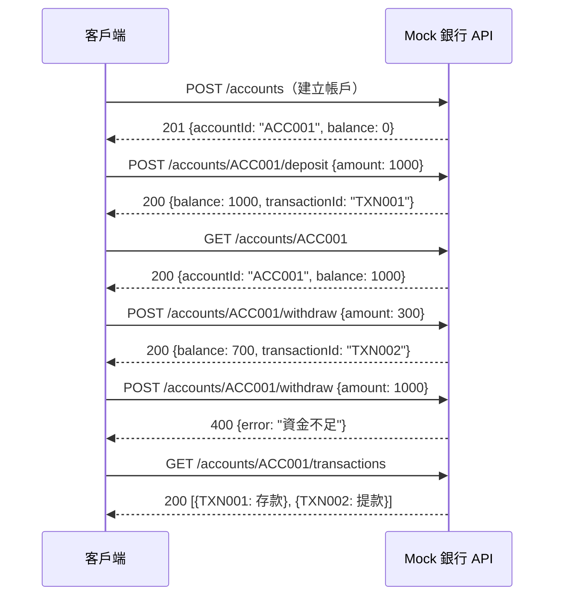
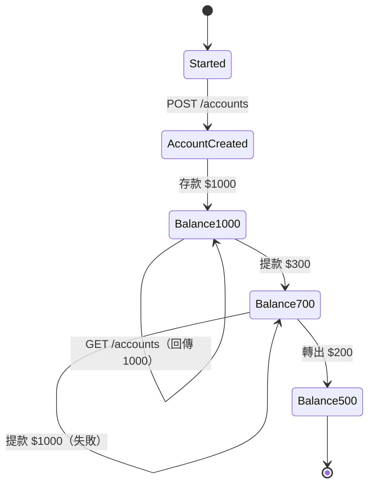
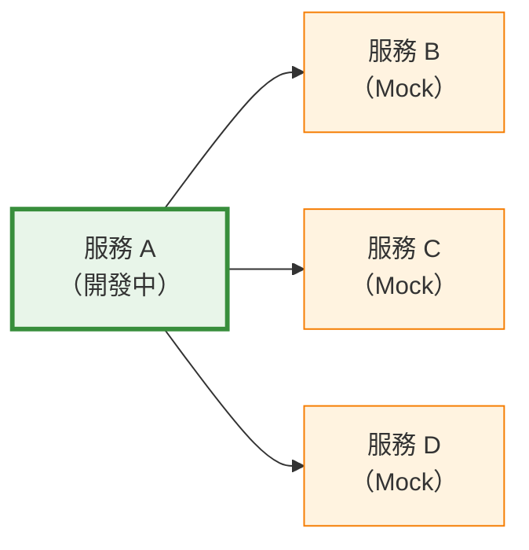
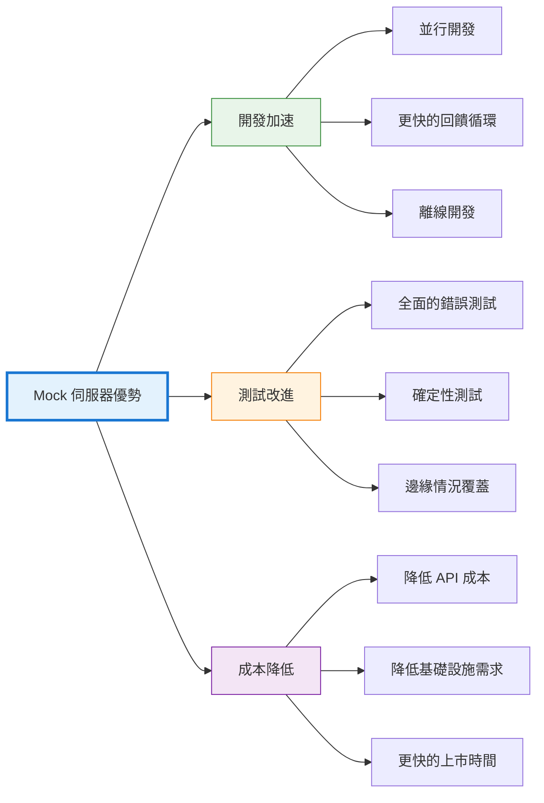

## 引言

現代軟體開發很少是孤立進行的。應用程式依賴於數十個外部服務——支付處理器、身份驗證提供商、第三方 API、微服務和資料庫。每個依賴項都會帶來複雜性：服務在開發期間可能不可用、受速率限制、重複呼叫成本高昂，或者根本還沒有建構。

想像一下，你正在建構一個行動應用程式，需要整合一個仍在由另一個團隊開發的支付 API。沒有那個 API，你的團隊只能閒置等待。或者考慮測試錯誤場景——當真實服務有 99.9% 的正常運行時間時，你如何驗證應用程式處理 503 服務不可用回應？如何模擬網路延遲、部分故障或生產環境中很少發生的邊緣情況？

Mock 伺服器透過使用可控、可預測的行為模擬外部依賴項來解決這些挑戰。它們不僅僅是測試工具——它們是開發加速器，能夠實現並行工作、全面測試和更快的迭代週期。本文將探討什麼是 Mock 伺服器、為什麼它們至關重要、如何有效實施它們，以及能夠最大化其價值的模式。

## 理解 Mock 伺服器

在深入實施之前，讓我們先明確什麼是 Mock 伺服器以及它們與相關概念的區別。

### 什麼是 Mock 伺服器？

Mock 伺服器是一個模擬真實 API 或服務端點行為的仿真服務。它接受請求、驗證輸入，並根據配置的規則回傳預定義的回應。與真實服務不同，Mock 伺服器在本地或受控環境中執行，立即回應，並完全按照配置的方式運作。

Mock 伺服器在網路層面運作，監聽實際埠並回應 HTTP/HTTPS 請求。從客戶端的角度來看，Mock 伺服器與真實服務無法區分——相同的端點、相同的回應格式、相同的協定。

| 真實服務 | Mock 伺服器 |
|---------|------------|
| 客戶端 → 真實 API（外部網路） | 客戶端 → Mock 伺服器（localhost:8080） |
| 請求：POST /api/payment | 請求：POST /api/payment |
| 回應：201 Created（取決於服務狀態） | 回應：201 Created（預定義，即時） |

客戶端程式碼保持不變——只有端點 URL 不同。

### Mock 伺服器與相關概念的區別

Mock 伺服器經常與相關的測試概念混淆。雖然它們有相似之處，但 Mock 伺服器在不同的層面運作——網路層而不是程式碼層。

**Mock 伺服器（網路層）：**
- 模擬整個 HTTP/HTTPS 服務
- 監聽實際網路埠
- 適用於任何客戶端（瀏覽器、行動應用程式、CLI）
- 無需更改程式碼（只需更改端點 URL）
- 範例：WireMock、Mockoon、Prism

**單元測試 Mock（程式碼層）：**
- 替換程式碼中的物件/函式
- 在單個應用程式內工作
- 特定於語言（JavaScript 的 Jest、Python 的 unittest.mock）
- 需要程式碼插樁
- 範例：Jest mocks、Mockito、unittest.mock

!!!anote "🔍 抽象層級"
    **單元測試 mock：** 模擬程式碼中的函式
    - `const paymentService = { processPayment: jest.fn() };`
    - `checkout(cart, paymentService);`
    
    **Mock 伺服器：** 模擬 HTTP 端點
    - `fetch('http://localhost:8080/api/payment', { method: 'POST', body: JSON.stringify({ amount: 99.99 }) })`
    
    Mock 伺服器模擬外部服務；單元 mock 替換內部依賴項。

**何時使用：**

| 場景 | 使用 Mock 伺服器 | 使用單元 Mock |
|------|----------------|--------------|
| 測試 API 整合 | ✅ | ❌ |
| 測試內部函式 | ❌ | ✅ |
| 無後端的前端開發 | ✅ | ❌ |
| 單元測試業務邏輯 | ❌ | ✅ |
| 模擬第三方 API | ✅ | ❌ |
| 測試函式互動 | ❌ | ✅ |
| 跨語言測試 | ✅ | ❌ |
| 快速隔離的單元測試 | ❌ | ✅ |

!!!tip "💡 互補方法"
    Mock 伺服器和單元 mock 並不互斥——兩者都使用。單元 mock 用於快速、隔離的業務邏輯測試。Mock 伺服器用於整合測試和針對外部 API 的開發。大多數 Mock 伺服器工具支援所有四種模式——根據測試需求選擇。

### 何時使用 Mock 伺服器

Mock 伺服器在特定場景中表現出色：

**開發階段：**
- 外部 API 尚未可用
- 第三方服務需要付費存取
- 由另一個團隊擁有的依賴項仍在開發中
- 需要離線工作或在受限網路中工作

**測試階段：**
- 模擬錯誤條件（逾時、500 錯誤、格式錯誤的回應）
- 測試難以用真實服務重現的邊緣情況
- 確保一致的測試結果（沒有來自外部依賴項的不穩定測試）
- 並行測試執行，無速率限制

**展示階段：**
- 無外部依賴的產品展示
- 在沒有網際網路存取的環境中進行銷售簡報
- 具有可預測行為的培訓環境

**不適用：**
- 與真實服務的整合測試（使用預發布環境）
- 外部服務的效能測試（無法模擬真實的延遲模式）
- 第三方 API 的安全測試（mock 不會揭示真實的漏洞）


## 為什麼 Mock 伺服器很重要

Mock 伺服器的價值不僅僅是便利性——它們從根本上改變了團隊開發和測試軟體的方式。

### 實現並行開發

在微服務架構中，團隊經常同時處理相互依賴的服務。沒有 Mock 伺服器，開發就會變成順序進行：團隊 A 等待團隊 B 完成他們的 API 後才能開始整合工作。

Mock 伺服器打破了這種依賴鏈。團隊就 API 契約（端點、請求/回應格式、狀態碼）達成一致，然後每個團隊獨立工作。前端開發人員使用模擬的後端 API。後端團隊模擬外部服務。整合在雙方都完成後進行。

!!!example "🏗️ 並行開發工作流"
    **傳統順序方法：**
    1. 後端團隊建構 API（2 週）
    2. 前端團隊等待
    3. 前端團隊與 API 整合（1 週）
    4. 總計：3 週
    
    **使用 Mock 的並行方法：**
    1. 團隊就 API 契約達成一致（1 天）
    2. 後端建構真實 API（2 週）
    3. 前端使用 mock API 建構 UI（2 週，並行）
    4. 整合和調整（2 天）
    5. 總計：2 週 + 2 天
    
    節省時間：約 1 週（快 33%）

### 全面的錯誤測試

生產系統必須優雅地處理故障——網路逾時、速率限制、服務中斷、格式錯誤的回應。使用真實服務測試這些場景很困難：

- 真實服務很少按需失敗
- 重現特定錯誤條件需要複雜的設定
- 速率限制阻止重複測試
- 某些錯誤僅在特定條件下發生

Mock 伺服器使錯誤測試變得簡單。配置 mock 回傳 503 錯誤，立即驗證應用程式的重試邏輯。透過新增延遲來模擬逾時。回傳格式錯誤的 JSON 來測試錯誤處理。測試每個邊緣情況，無需等待生產故障。

!!!warning "⚠️ 未測試錯誤路徑的代價"
    **常見的未測試場景：**
    - 逾時處理（你的應用程式會掛起還是重試？）
    - 部分故障（一些請求成功，其他失敗）
    - 速率限制（429 Too Many Requests）
    - 格式錯誤的回應（無效的 JSON、缺少欄位）
    - 身份驗證失敗（過期的權杖、無效的憑證）
    
    這些場景導致大多數生產事故，但沒有 Mock 伺服器很少被測試。

### 確定性測試

依賴外部服務的測試本質上是不穩定的。服務可能當機、緩慢或每次回傳不同的資料。不穩定的測試會削弱信心——團隊開始忽略測試失敗，認為它們是誤報。

Mock 伺服器提供確定性行為。相同的請求總是回傳相同的回應。測試在毫秒內執行，而不是秒。沒有網路問題，沒有速率限制，沒有意外的資料更改。測試變得可靠、快速和值得信賴。

### 降低成本

許多第三方 API 按請求收費。開發和測試每天可能產生數千個請求，造成巨大的成本。Mock 伺服器在開發期間消除了這些成本，將付費 API 呼叫保留給生產和最終整合測試。

此外，Mock 伺服器降低了基礎設施成本。不需要為每個外部依賴項提供專用的預發布環境。開發人員在本地執行 mock，減少雲端資源消耗。

### 更快的回饋循環

開發速度取決於回饋速度。等待外部 API 回應幾秒鐘會減慢迭代速度。Mock 伺服器在毫秒內回應，實現快速的開發週期。更改程式碼、執行測試、查看結果——全部在幾秒鐘內完成，而不是幾分鐘。

這種速度隨著時間的推移而累積。更快的測試意味著更頻繁的測試。更頻繁的測試更早地發現錯誤。更早的錯誤檢測減少了除錯時間。累積效應顯著加速了開發。


## 實施方法

Mock 伺服器可以使用各種工具和技術實現，每種都適合不同的場景。

### 專用 Mock 伺服器工具

幾個工具專門用於 API 模擬，提供豐富的功能和簡單的配置。

**WireMock：**
- 基於 Java，可獨立執行或嵌入
- 強大的請求匹配（URL、標頭、正文）
- 帶有動態內容的回應範本
- 請求驗證和有狀態行為
- 廣泛的生態系統和整合

**Mockoon：**
- 帶有 GUI 的桌面應用程式
- 用於建立 mock 的視覺化介面
- 支援範本、代理和 CORS
- 匯出/匯入配置
- 適合喜歡視覺化工具的開發人員

**Prism：**
- OpenAPI 優先方法
- 從 OpenAPI 規範產生 mock
- 根據模式驗證請求
- 動態回應範例
- 非常適合 API 優先開發

**MockServer：**
- 基於 Java，具有多種語言的客戶端函式庫
- 複雜的請求匹配和驗證
- 支援 HTTPS、WebSocket 和代理
- 透過 API 進行程式化配置
- 強大的整合測試能力

!!!tip "🔧 工具選擇標準"
    **選擇 WireMock 如果：**
    - 需要強大的請求匹配
    - 在 Java/JVM 生態系統中工作
    - 需要有狀態模擬
    
    **選擇 Mockoon 如果：**
    - 更喜歡 GUI 而不是配置檔案
    - 需要快速設定而無需編碼
    - 想要視覺化 mock 管理
    
    **選擇 Prism 如果：**
    - 有 OpenAPI 規範
    - 想要自動 mock 產生
    - 需要請求驗證
    
    **選擇 MockServer 如果：**
    - 需要程式化控制
    - 需要進階驗證
    - 使用多種協定

### 基於程式碼的模擬

對於更簡單的場景或特定框架，基於程式碼的模擬可能更合適。

**Express.js（Node.js）：**
```javascript
const express = require('express');
const app = express();

app.use(express.json());

// Mock 支付端點
app.post('/api/payment', (req, res) => {
  const { amount, currency } = req.body;
  
  // 模擬驗證
  if (!amount || amount <= 0) {
    return res.status(400).json({
      error: 'Invalid amount'
    });
  }
  
  // 模擬處理延遲
  setTimeout(() => {
    res.status(201).json({
      id: 'pay_' + Date.now(),
      amount,
      currency,
      status: 'completed'
    });
  }, 100);
});

app.listen(8080, () => {
  console.log('Mock server running on port 8080');
});
```

**Flask（Python）：**
```python
from flask import Flask, request, jsonify
import time

app = Flask(__name__)

@app.route('/api/payment', methods=['POST'])
def create_payment():
    data = request.json
    amount = data.get('amount')
    
    if not amount or amount <= 0:
        return jsonify({'error': 'Invalid amount'}), 400
    
    # 模擬處理延遲
    time.sleep(0.1)
    
    return jsonify({
        'id': f'pay_{int(time.time())}',
        'amount': amount,
        'currency': data.get('currency', 'USD'),
        'status': 'completed'
    }), 201

if __name__ == '__main__':
    app.run(port=8080)
```

基於程式碼的 mock 提供最大的靈活性，但隨著 API 的演變需要更多的維護。

### 基於契約的模擬

像 Pact 這樣的契約測試工具支援消費者驅動的契約測試，消費者定義期望，提供者驗證合規性。

**Pact 工作流：**
1. 消費者定義預期的互動（契約）
2. 消費者測試針對 mock 提供者執行（從契約產生）
3. 契約發布到 Pact Broker
4. 提供者驗證它滿足契約
5. 雙方獨立開發，對相容性充滿信心

這種方法確保 mock 準確反映真實服務行為，防止整合意外。

### 服務虛擬化

企業服務虛擬化工具（CA Service Virtualization、Parasoft Virtualize）提供進階功能：

- 記錄和重播真實服務互動
- 模擬複雜的有狀態行為
- 使用真實負載進行效能測試
- 使用多個場景進行資料驅動測試
- 企業治理和管理

這些工具對大多數專案來說過於複雜，但在具有複雜整合環境的大型企業中很有價值。


## 最佳實踐和模式

有效使用 Mock 伺服器需要遵循既定的模式並避免常見的陷阱。

### 保持 Mock 與現實同步

Mock 伺服器的最大風險是漂移——mock 與真實服務行為發生偏離，產生虛假的信心。測試針對 mock 通過，但在生產中失敗。

**緩解策略：**

!!!anote "📋 同步技術"
    **1. 契約測試：**
    - 使用 Pact 或類似工具
    - 提供者驗證消費者契約
    - 自動驗證防止漂移
    
    **2. OpenAPI 規範：**
    - 從 OpenAPI 規範產生 mock
    - 規範更改時更新 mock
    - 根據模式驗證請求
    
    **3. 整合測試：**
    - 針對真實服務執行測試子集
    - 捕獲 mock 與現實之間的差異
    - 定期安排（每晚建構）
    
    **4. Mock 錄製：**
    - 記錄真實服務回應
    - 使用錄製作為 mock 回應
    - 定期更新錄製

### 使用真實資料

Mock 通常使用過於簡單的資料——"test@example.com"、"John Doe"、順序 ID。這掩蓋了只在真實世界資料複雜性下出現的錯誤。

**更好的方法：**
- 使用真實的姓名、電子郵件、地址
- 包括邊緣情況（長字串、特殊字元、Unicode）
- 在測試執行中變化資料
- 包括真實的時間戳記和 ID

```javascript
// 差：不真實的資料
{
  "user": {
    "name": "Test User",
    "email": "test@test.com",
    "id": 1
  }
}

// 好：帶有邊緣情況的真實資料
{
  "user": {
    "name": "María José García-Rodríguez",
    "email": "maria.garcia+newsletter@empresa.example.com",
    "id": "usr_2nK8fH3mP9qL7xR4"
  }
}
```

### 模擬真實延遲

來自 mock 的即時回應隱藏了效能問題。真實服務有延遲——網路延遲、處理時間、資料庫查詢。應用程式必須優雅地處理這些。

為 mock 回應新增真實延遲：
- 快速 API 為 50-200ms
- 較慢的服務為 500-1000ms
- 偶爾逾時（5-10 秒）
- 可變延遲以測試逾時處理

```javascript
// 帶有延遲的 WireMock 配置
{
  "request": {
    "method": "GET",
    "url": "/api/users/123"
  },
  "response": {
    "status": 200,
    "body": "{ ... }",
    "fixedDelayMilliseconds": 150,
    "delayDistribution": {
      "type": "lognormal",
      "median": 150,
      "sigma": 0.4
    }
  }
}
```

### 建模狀態和序列

某些互動需要有狀態行為——建立資源，然後檢索它。簡單的 mock 無論之前的請求如何都回傳相同的回應，遺漏了與狀態相關的錯誤。銀行交易提供了一個很好的範例，說明為什麼有狀態模擬很重要。

#### 為什麼有狀態模擬很重要

考慮一個銀行 API，其中操作依賴於先前的操作。無狀態 mock 無論存款和提款如何都會回傳相同的餘額，遺漏了交易邏輯、餘額驗證和錯誤處理中的關鍵錯誤。

#### 銀行交易範例

讓我們透過一個真實的銀行場景來展示為什麼狀態管理至關重要：

**場景：帶有交易的帳戶生命週期**

1. **開戶**建立新帳號
2. **存款**增加餘額
3. **提款**減少餘額（如果資金充足）
4. **餘額查詢**回傳當前狀態
5. **轉帳**在帳戶之間轉移資金



**步驟 1：開戶**

當客戶端建立帳戶時，mock 產生唯一的帳戶 ID 並將餘額初始化為零：

```json
// 請求
POST /api/accounts
{"customerId": "CUST001"}

// 回應（狀態：已開始 → 帳戶已建立）
201 Created
{
  "accountId": "ACC001",
  "customerId": "CUST001",
  "balance": 0,
  "currency": "USD",
  "status": "active"
}
```

mock 從「已開始」狀態轉換到「帳戶已建立」狀態，記住 ACC001 現在存在。

**步驟 2：存款增加餘額**

存入 $1000 更新帳戶餘額：

```json
// 請求
POST /api/accounts/ACC001/deposit
{"amount": 1000}

// 回應（狀態：帳戶已建立 → 餘額 1000）
200 OK
{
  "transactionId": "TXN001",
  "type": "deposit",
  "amount": 1000,
  "balance": 1000
}
```

mock 現在記住餘額是 $1000 並轉換到「餘額 1000」狀態。

**步驟 3：餘額查詢回傳當前狀態**

查詢帳戶回傳當前餘額：

```json
// 請求
GET /api/accounts/ACC001

// 回應（狀態：餘額 1000）
200 OK
{
  "accountId": "ACC001",
  "balance": 1000,
  "currency": "USD",
  "status": "active"
}
```

mock 從其當前狀態回傳餘額，而不是硬編碼值。

**步驟 4：提款減少餘額（如果資金充足）**

提出 $300 減少餘額：

```json
// 請求
POST /api/accounts/ACC001/withdraw
{"amount": 300}

// 回應（狀態：餘額 1000 → 餘額 700）
200 OK
{
  "transactionId": "TXN002",
  "type": "withdrawal",
  "amount": 300,
  "balance": 700
}
```

mock 計算新餘額（1000 - 300 = 700）並轉換到「餘額 700」狀態。

**資金不足處理：**

嘗試提出超過可用金額的資金會失敗：

```json
// 請求
POST /api/accounts/ACC001/withdraw
{"amount": 1000}

// 回應（狀態：餘額 700，無狀態變化）
400 Bad Request
{
  "error": "資金不足",
  "code": "INSUFFICIENT_FUNDS",
  "currentBalance": 700,
  "requestedAmount": 1000
}
```

mock 根據當前餘額驗證提款並拒絕無效操作。

**步驟 5：轉帳在帳戶之間轉移資金**

從 ACC001 轉帳 $200 到 ACC002：

```json
// 請求
POST /api/transfers
{
  "fromAccount": "ACC001",
  "toAccount": "ACC002",
  "amount": 200
}

// 回應（狀態：ACC001 餘額 700 → 500，ACC002 餘額 0 → 200）
200 OK
{
  "transferId": "TRF001",
  "fromAccount": "ACC001",
  "toAccount": "ACC002",
  "amount": 200,
  "status": "completed"
}
```

mock 原子地更新兩個帳戶餘額，保持帳戶之間的一致性。

**交易歷史追蹤：**

mock 維護所有操作的歷史記錄：

```json
// 請求
GET /api/accounts/ACC001/transactions

// 回應
200 OK
{
  "accountId": "ACC001",
  "transactions": [
    {
      "transactionId": "TXN001",
      "type": "deposit",
      "amount": 1000,
      "balanceAfter": 1000,
      "timestamp": "2025-11-01T10:00:00Z"
    },
    {
      "transactionId": "TXN002",
      "type": "withdrawal",
      "amount": 300,
      "balanceAfter": 700,
      "timestamp": "2025-11-01T10:05:00Z"
    },
    {
      "transactionId": "TXN003",
      "type": "transfer_out",
      "amount": 200,
      "balanceAfter": 500,
      "relatedAccount": "ACC002",
      "timestamp": "2025-11-01T10:10:00Z"
    }
  ]
}
```

#### WireMock 狀態配置

以下是如何配置 WireMock 來處理這些狀態轉換：

```json
// 建立帳戶：已開始 → 帳戶已建立
{
  "scenarioName": "Banking Operations",
  "requiredScenarioState": "Started",
  "newScenarioState": "Account Created",
  "request": {
    "method": "POST",
    "url": "/api/accounts"
  },
  "response": {
    "status": 201,
    "jsonBody": {
      "accountId": "ACC001",
      "balance": 0,
      "status": "active"
    }
  }
}

// 存款：帳戶已建立 → 餘額 1000
{
  "scenarioName": "Banking Operations",
  "requiredScenarioState": "Account Created",
  "newScenarioState": "Balance 1000",
  "request": {
    "method": "POST",
    "url": "/api/accounts/ACC001/deposit",
    "bodyPatterns": [{"equalToJson": "{\"amount\": 1000}"}]
  },
  "response": {
    "status": 200,
    "jsonBody": {"balance": 1000}
  }
}

// 提款：餘額 1000 → 餘額 700
{
  "scenarioName": "Banking Operations",
  "requiredScenarioState": "Balance 1000",
  "newScenarioState": "Balance 700",
  "request": {
    "method": "POST",
    "url": "/api/accounts/ACC001/withdraw",
    "bodyPatterns": [{"equalToJson": "{\"amount\": 300}"}]
  },
  "response": {
    "status": 200,
    "jsonBody": {"balance": 700}
  }
}

// 資金不足：餘額 700，無狀態變化
{
  "scenarioName": "Banking Operations",
  "requiredScenarioState": "Balance 700",
  "request": {
    "method": "POST",
    "url": "/api/accounts/ACC001/withdraw",
    "bodyPatterns": [{"matchesJsonPath": "$[?(@.amount > 700)]"}]
  },
  "response": {
    "status": 400,
    "jsonBody": {
      "error": "資金不足",
      "currentBalance": 700
    }
  }
}
```

#### 什麼使其有狀態？

與無狀態 mock 的關鍵區別：

**無狀態 Mock（錯誤）：**
```json
// 無論操作如何，總是回傳相同的餘額
GET /api/accounts/ACC001
→ {"balance": 1000}  // 總是 1000，即使在提款後
```

**有狀態 Mock（正確）：**
```json
// 根據先前的操作回傳餘額
GET /api/accounts/ACC001
→ {"balance": 0}     // 建立後
→ {"balance": 1000}  // $1000 存款後
→ {"balance": 700}   // $300 提款後
→ {"balance": 500}   // $200 轉出後
```

有狀態 mock 記住：
- 帳戶建立
- 每次存款和提款
- 當前餘額
- 交易歷史
- 業務規則（資金不足）

這使得能夠測試：
- ✅ 餘額計算
- ✅ 資金不足處理
- ✅ 交易序列
- ✅ 轉帳邏輯
- ✅ 歷史追蹤

沒有狀態管理，這些關鍵場景將在生產之前無法測試。

#### 狀態轉換圖

銀行 mock 遵循此狀態流：



每個狀態轉換驗證業務規則並相應地更新 mock 的內部狀態。

!!!tip "💡 有狀態 Mock 最佳實踐"
    **設計考量：**
    - 從簡單的狀態轉換開始
    - 記錄狀態流程圖
    - 在測試套件之間重置狀態
    - 適當處理並行請求
    - 驗證狀態轉換（防止無效狀態）
    
    **測試策略：**
    - 測試快樂路徑序列
    - 測試無效狀態轉換（提款前存款）
    - 測試並行操作
    - 測試跨請求的狀態持久性
    - 驗證交易歷史準確性
    
    **何時使用有狀態 mock：**
    - ✅ 測試工作流（帳戶建立 → 存款 → 提款）
    - ✅ 驗證業務規則（資金不足）
    - ✅ 測試交易序列
    - ✅ 驗證狀態一致性
    - ❌ 簡單的請求/回應場景（使用無狀態存根）
    - ❌ 效能測試（使用真實服務）

有狀態模擬將 Mock 伺服器從簡單的回應產生器轉變為真實的服務模擬器。銀行範例展示了適當的狀態管理如何能夠測試複雜的工作流、業務規則和錯誤條件，這些在針對真實服務測試時會很困難或昂貴。

### 明確測試錯誤場景

不要只模擬快樂路徑。明確測試錯誤場景：

- 400 Bad Request（無效輸入）
- 401 Unauthorized（身份驗證失敗）
- 403 Forbidden（授權失敗）
- 404 Not Found（資源不存在）
- 429 Too Many Requests（速率限制）
- 500 Internal Server Error（伺服器故障）
- 503 Service Unavailable（臨時中斷）
- 網路逾時
- 格式錯誤的回應

為每種錯誤類型建立專用測試案例，驗證應用程式正確處理它們。

### 版本化 Mock 配置

Mock 配置是程式碼——像對待程式碼一樣對待它們。將配置與應用程式程式碼一起儲存在版本控制中。這使得能夠：

- 隨時間追蹤更改
- 恢復有問題的更改
- 在拉取請求中審查 mock 更新
- 在團隊中共享配置
- 重現歷史測試環境

### 避免過度模擬

模擬所有內容會產生虛假的信心。某些整合點應使用真實服務：

- 外部服務中的關鍵業務邏輯
- 複雜的身份驗證流程
- 支付處理（使用沙箱環境）
- 資料庫互動（使用測試資料庫，而不是 mock）

平衡 mock（速度和隔離）與真實整合測試（信心）。


## 常見模式和用例

Mock 伺服器支援幾種強大的開發模式。

### API 優先開發

團隊在實施之前定義 API 契約，實現並行開發：

1. **設計 API**：建立 OpenAPI 規範
2. **產生 mock**：使用 Prism 或類似工具
3. **前端開發**：針對 mock API
4. **後端開發**：實施規範
5. **整合**：用真實 API 替換 mock

這種方法減少了整合摩擦並確保前端/後端對齊。

### 微服務開發

在微服務架構中，服務依賴於多個其他服務。在本地執行所有依賴項是不切實際的。Mock 伺服器支援隔離開發：



開發人員使用模擬的依賴項處理服務 A，然後在整合測試期間將 mock 替換為真實服務。

### 第三方 API 整合

在整合第三方 API（支付處理器、社群媒體、分析）時，Mock 伺服器提供：

- **無需 API 金鑰的開發**：無需共享生產憑證
- **無限測試**：無速率限制或成本
- **離線開發**：無需網際網路連線即可工作
- **可預測的行為**：API 更改不會帶來意外

維護鏡像第三方 API 行為的 mock，在 API 更改時更新它們。

### 混沌工程

Mock 伺服器支援受控的混沌測試——模擬故障以驗證彈性：

- 隨機逾時
- 間歇性 500 錯誤
- 逐漸的效能下降
- 部分回應損壞
- 連線重置

```javascript
// WireMock 混沌配置
{
  "request": {
    "method": "GET",
    "url": "/api/data"
  },
  "response": {
    "status": 200,
    "body": "{ ... }",
    "fault": "RANDOM_DATA_THEN_CLOSE"
  }
}
```

這在不影響真實服務的情況下測試應用程式彈性。

### 展示和培訓環境

Mock 伺服器建立可靠的展示環境：

- 無外部依賴
- 可預測的資料和行為
- 離線工作
- 無暴露生產資料的風險
- 跨展示的一致體驗

銷售團隊和培訓師可以展示功能，而無需擔心外部服務可用性或資料隱私。

## 挑戰和局限性

Mock 伺服器不是萬能的——它們有局限性和潛在的陷阱。

### 維護開銷

Mock 配置需要維護。隨著 API 的演變，mock 必須更新。過時的 mock 會產生虛假的信心——測試通過，但生產失敗。

**緩解措施：**
- 從 OpenAPI 規範自動產生 mock
- 使用契約測試檢測漂移
- 定期安排針對真實服務的整合測試
- 分配 mock 維護的所有權

### 虛假信心

針對 mock 通過的測試不能保證生產成功。Mock 可能無法準確反映真實服務行為、邊緣情況或效能特徵。

!!!warning "⚠️ Mock 陷阱"
    **症狀：**
    - 所有測試在本地通過
    - 針對 mock 的整合測試通過
    - 生產部署失敗
    
    **原因：**
    - Mock 與真實服務行為不匹配
    - 真實服務有未記錄的怪癖
    - 網路條件與模擬延遲不同
    - 身份驗證/授權工作方式不同
    
    **預防：**
    - 定期針對真實服務執行整合測試
    - 使用契約測試
    - 監控生產中的意外行為
    - 根據生產觀察更新 mock

### 有狀態場景的複雜性

模擬複雜的有狀態互動具有挑戰性。真實服務跨請求維護狀態、處理並行存取並執行業務規則。在 mock 中複製這一點需要大量努力。

對於複雜的有狀態場景，考慮在測試環境中使用真實服務，而不是嘗試模擬所有行為。

### 效能測試局限性

Mock 伺服器無法準確模擬真實服務效能特徵：

- 網路延遲因地理位置、路由、擁塞而異
- 真實服務根據負載具有可變的回應時間
- 快取行為在 mock 和真實服務之間不同
- 資料庫查詢效能無法準確模擬

使用 mock 進行功能測試，但效能測試需要真實服務或複雜的服務虛擬化工具。

### 安全測試差距

Mock 不會揭示外部服務中的安全漏洞。測試身份驗證、授權和資料驗證需要真實服務。Mock 可能會因過於寬鬆而無意中隱藏安全問題。

## 實際應用

Mock 伺服器在各行業和各種規模的公司中被廣泛採用。

### 行業範例

!!!example "💼 電商平台"
    **挑戰：**
    - 與支付處理器、物流 API、庫存系統整合
    - 支付 API 按交易收費
    - 物流 API 有速率限制
    
    **解決方案：**
    - 為開發和測試模擬支付 API
    - 使用真實回應模擬物流 API
    - 僅在最終整合測試中使用真實 API
    
    **結果：**
    - 開發期間支付 API 成本降低 70%
    - 更快的測試執行（秒而不是分鐘）
    - 能夠測試錯誤場景（支付被拒、物流失敗）

!!!example "🏦 銀行應用"
    **挑戰：**
    - 與核心銀行系統（大型主機）整合
    - 大型主機存取受限且緩慢
    - 測試需要複雜的資料設定
    
    **解決方案：**
    - 記錄大型主機互動
    - 從記錄建立 mock
    - 開發人員日常工作使用 mock
    
    **結果：**
    - 開發速度提高 3 倍
    - 減少大型主機負載
    - 實現跨團隊並行開發

!!!example "📱 行動應用程式開發"
    **挑戰：**
    - 後端 API 正在開發中
    - 行動團隊等待 API 而被阻塞
    - 開發期間 API 頻繁更改
    
    **解決方案：**
    - 使用 OpenAPI 規範的 API 優先方法
    - 從規範產生 mock
    - 行動團隊針對 mock 開發
    
    **結果：**
    - 並行開發（節省 2 週）
    - 順利整合（規範驅動開發）
    - 減少整合錯誤

### 團隊採用模式

成功的 Mock 伺服器採用遵循常見模式：

**階段 1：個人採用**
- 開發人員發現 Mock 伺服器以提高個人生產力
- 針對特定問題的臨時使用
- 無團隊範圍的標準

**階段 2：團隊標準化**
- 團隊採用通用 Mock 伺服器工具
- 版本控制中的共享 mock 配置
- 與 CI/CD 管線整合

**階段 3：組織範圍的實踐**
- Mock 伺服器成為開發標準的一部分
- 集中式 mock 管理
- 與 API 治理整合

## 未來方向

Mock 伺服器技術持續發展，有幾個新興趨勢。

### AI 驅動的 Mock 產生

機器學習模型可以分析 API 流量並自動產生真實的 mock：

- 從生產流量中學習回應模式
- 產生真實的測試資料
- 預測可能的錯誤場景
- 根據使用模式調整 mock

這減少了手動 mock 配置工作並提高了 mock 的真實性。

### 服務網格整合

服務網格（Istio、Linkerd）支援複雜的流量管理。與 Mock 伺服器整合允許：

- 無需程式碼更改的動態 mock 注入
- 真實服務和模擬服務之間的 A/B 測試
- 從 mock 到真實服務的逐步遷移
- 用於混沌工程的故障注入

### 契約優先開發

契約優先開發（OpenAPI、GraphQL 模式、gRPC protobuf）的日益採用使 mock 產生自動化：

- 定義契約
- 自動產生 mock
- 產生客戶端程式碼
- 產生伺服器存根
- 根據契約驗證實作

這種方法消除了手動 mock 維護並確保一致性。

### 基於雲端的 Mock 服務

雲端平台越來越多地提供託管 mock 服務：

- 無需基礎設施管理的託管 mock 伺服器
- 協作 mock 編輯和共享
- 與 API 閘道整合
- mock 使用分析

這些服務減少了營運開銷並實現了更容易的協作。

## 結論

Mock 伺服器已經從簡單的測試工具演變為基本的開發工具，從根本上改變了團隊建構軟體的方式。透過使用可控、可預測的行為模擬外部依賴項，Mock 伺服器實現了並行開發、全面測試和更快的迭代週期。

好處是巨大的：團隊獨立工作而無需等待依賴項，錯誤場景得到詳盡測試，測試變得快速和確定性，開發成本降低。Mock 伺服器將開發從順序轉變為並行，從脆弱轉變為健壯，從緩慢轉變為快速。



然而，Mock 伺服器並非沒有挑戰。保持 mock 準確性需要紀律和自動化。針對不準確的 mock 通過測試產生的虛假信心可能導致生產故障。複雜的有狀態場景難以真實地模擬。關鍵是平衡 mock 與真實整合測試——使用 mock 以獲得速度和隔離，但定期針對真實服務進行驗證。

對於評估 Mock 伺服器的團隊來說，問題不是是否採用它們，而是如何有效地將它們整合到開發工作流程中。從小處開始——模擬單個有問題的依賴項。建立 mock 配置和維護的模式。隨著團隊獲得經驗逐步擴大使用。投資自動化以保持 mock 與現實同步。

Mock 伺服器的未來是光明的。AI 驅動的 mock 產生將減少手動配置。服務網格整合將支援複雜的流量管理。契約優先開發將使 mock 自動準確。基於雲端的服務將減少營運開銷。

現代軟體開發本質上是分散式的——應用程式依賴於眾多外部服務。Mock 伺服器使這種複雜性變得可管理，使團隊能夠在有依賴項的情況下自信地開發。它們不僅僅是測試工具——它們是開發加速器，能夠解鎖並行工作、全面測試和更快的交付。

對於任何建構具有外部依賴項的軟體的團隊來說，Mock 伺服器不再是可選的——它們是必不可少的。生產力提升、測試改進和成本降低證明了學習和維護 Mock 伺服器基礎設施的投資是值得的。今天就開始使用 Mock 伺服器，體驗開發速度和信心的轉變。

開發的未來是並行、快速和有彈性的。Mock 伺服器正在建構這個未來，一次模擬一個請求。

## 參考資源

- **WireMock**：[https://wiremock.org/](https://wiremock.org/)
- **Mockoon**：[https://mockoon.com/](https://mockoon.com/)
- **Prism**：[https://stoplight.io/open-source/prism](https://stoplight.io/open-source/prism)
- **MockServer**：[https://www.mock-server.com/](https://www.mock-server.com/)
- **Pact（契約測試）**：[https://pact.io/](https://pact.io/)
- **OpenAPI 規範**：[https://swagger.io/specification/](https://swagger.io/specification/)
- **Martin Fowler 關於 Mock**：[https://martinfowler.com/articles/mocksArentStubs.html](https://martinfowler.com/articles/mocksArentStubs.html)
