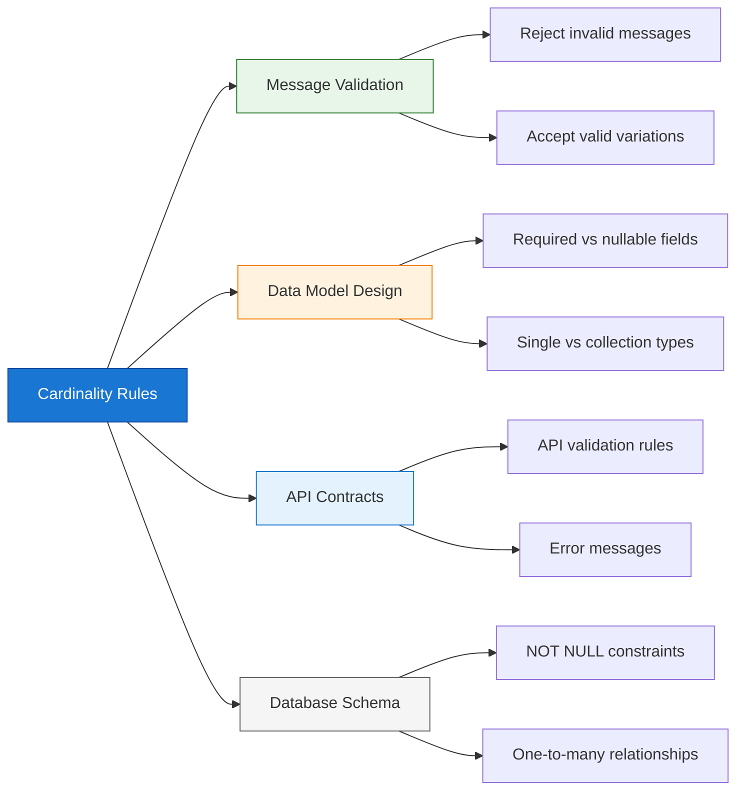
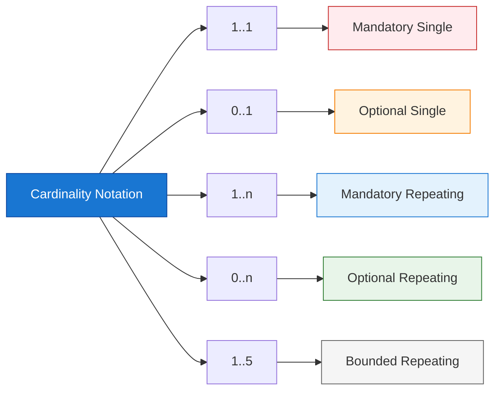
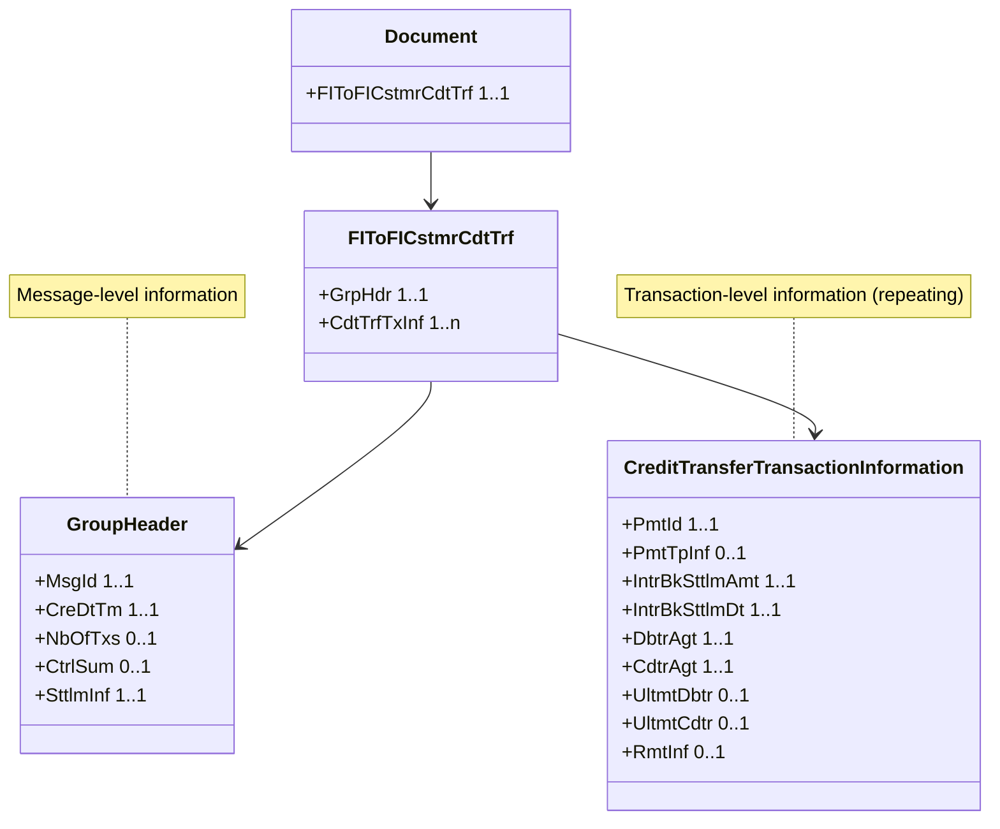

Cardinality rules are among the most critical yet frequently misunderstood aspects of ISO 20022 message validation. This guide provides a comprehensive explanation of what cardinality means, how it's expressed, and how to handle it in RTGS implementations.

## 1 What is Cardinality?

### 1.1 Definition

**Cardinality** defines how many times an element or attribute can or must appear within a message structure. It answers two fundamental questions:

| Question | Cardinality Aspect |
|----------|-------------------|
| **Is this element required?** | Minimum occurrence (0 or 1) |
| **How many can appear?** | Maximum occurrence (1 or many) |

### 1.2 Why Cardinality Matters



**Real-World Impact:**

| Scenario | Cardinality Error | Consequence |
|----------|------------------|-------------|
| Missing mandatory field | `MsgId` not provided | Message rejected at gateway |
| Extra repeating element | 5th address line when max is 4 | Data truncation or rejection |
| Wrong occurrence | Single element appears twice | Schema validation failure |
| Optional treated as required | Code assumes element exists | NullPointerException, crashes |

## 2 Cardinality Notation

### 2.1 ISO 20022 Notation Format

ISO 20022 uses a standard notation with two numbers separated by dots:

```
<minimum>..<maximum>

Examples:
  1..1    ← Exactly one (mandatory, single)
  0..1    ← Zero or one (optional, single)
  1..n    ← One or more (mandatory, repeating)
  0..n    ← Zero or more (optional, repeating)
```

### 2.2 Complete Notation Reference



| Notation | Name | Meaning | XML Schema Equivalent |
|----------|------|---------|----------------------|
| **1..1** | Mandatory Single | Must appear exactly once | `minOccurs="1" maxOccurs="1"` |
| **0..1** | Optional Single | May appear zero or one time | `minOccurs="0" maxOccurs="1"` |
| **1..n** | Mandatory Repeating | Must appear at least once, can repeat | `minOccurs="1" maxOccurs="unbounded"` |
| **0..n** | Optional Repeating | May appear zero or more times | `minOccurs="0" maxOccurs="unbounded"` |
| **1..5** | Bounded Repeating | Must appear 1 to 5 times | `minOccurs="1" maxOccurs="5"` |
| **0..5** | Optional Bounded | May appear 0 to 5 times | `minOccurs="0" maxOccurs="5"` |

### 2.3 Visual Representation in Documentation

ISO 20022 documentation often uses visual indicators:

```
┌─────────────────────────────────────────────────────────────┐
│ Element Name              │ Cardinality │ Type              │
├─────────────────────────────────────────────────────────────┤
│ MsgId                     │ 1           │ Max35Text         │
│ CreDtTm                   │ 1           │ ISODateTime       │
│ NbOfTxs                   │ 0..1        │ Max15NumericText  │
│ CdtTrfTxInf               │ 1..n        │ Transaction       │
│ RmtInf                    │ 0..1        │ RemittanceInfo    │
│ PstlAdr                   │ 0..1        │ PostalAddress     │
│ AddrLine                  │ 0..7        │ Max70Text         │
└─────────────────────────────────────────────────────────────┘

Legend:
  1       = Mandatory, exactly one (same as 1..1)
  0..1    = Optional, at most one
  1..n    = Mandatory, can repeat unlimited
  0..n    = Optional, can repeat unlimited
  0..7    = Optional, up to 7 times
```

## 3 Cardinality in Practice: pacs.008 Example

### 3.1 Full Structure with Cardinality

Let's examine the complete pacs.008.001.08 structure with cardinality for each element:



### 3.2 Detailed Element Breakdown

```
Document [1..1]
└── FIToFICstmrCdtTrf [1..1]
    ├── GrpHdr [1..1]                      ← Mandatory, exactly one
    │   ├── MsgId [1..1]                   ← Mandatory: Your message ID
    │   ├── CreDtTm [1..1]                 ← Mandatory: Creation timestamp
    │   ├── NbOfTxs [0..1]                 ← Optional: Transaction count
    │   ├── CtrlSum [0..1]                 ← Optional: Control sum
    │   └── SttlmInf [1..1]                ← Mandatory: Settlement info
    │
    └── CdtTrfTxInf [1..n]                 ← Mandatory, repeating!
        ├── PmtId [1..1]                   ← Mandatory: Payment IDs
        │   ├── InstrId [0..1]             ← Optional: Instruction ID
        │   └── TxId [1..1]                ← Mandatory: Transaction ID
        ├── PmtTpInf [0..1]                ← Optional: Payment type
        ├── IntrBkSttlmAmt [1..1]          ← Mandatory: Amount
        ├── IntrBkSttlmDt [1..1]           ← Mandatory: Settlement date
        ├── DbtrAgt [1..1]                 ← Mandatory: Debtor agent
        ├── CdtrAgt [1..1]                 ← Mandatory: Creditor agent
        ├── UltmtDbtr [0..1]               ← Optional: Ultimate debtor
        ├── UltmtCdtr [0..1]               ← Optional: Ultimate creditor
        └── RmtInf [0..1]                  ← Optional: Remittance info
```

### 3.3 Valid vs. Invalid Examples

**✅ Valid pacs.008 (Minimal):**

```xml
<Document>
  <FIToFICstmrCdtTrf>
    <GrpHdr>
      <MsgId>MSG-001</MsgId>           <!-- 1..1 ✓ -->
      <CreDtTm>2025-12-10T10:30:00Z</CreDtTm>  <!-- 1..1 ✓ -->
      <SttlmInf>                       <!-- 1..1 ✓ -->
        <SttlmMtd>INDA</SttlmMtd>
      </SttlmInf>
    </GrpHdr>
    
    <CdtTrfTxInf>                      <!-- 1..n ✓ (one transaction) -->
      <PmtId>
        <TxId>TXN-001</TxId>           <!-- 1..1 ✓ -->
      </PmtId>
      <IntrBkSttlmAmt Ccy="USD">1000000.00</IntrBkSttlmAmt>  <!-- 1..1 ✓ -->
      <IntrBkSttlmDt>2025-12-10</IntrBkSttlmDt>  <!-- 1..1 ✓ -->
      <DbtrAgt>...</DbtrAgt>           <!-- 1..1 ✓ -->
      <CdtrAgt>...</CdtrAgt>           <!-- 1..1 ✓ -->
      <!-- UltmtDbtr, UltmtCdtr, RmtInf are 0..1, so optional ✓ -->
    </CdtTrfTxInf>
  </FIToFICstmrCdtTrf>
</Document>
```

**❌ Invalid pacs.008 (Missing Mandatory):**

```xml
<Document>
  <FIToFICstmrCdtTrf>
    <GrpHdr>
      <!-- MsgId MISSING - validation error! -->
      <CreDtTm>2025-12-10T10:30:00Z</CreDtTm>  <!-- 1..1 ✓ -->
      <SttlmInf>                       <!-- 1..1 ✓ -->
        <SttlmMtd>INDA</SttlmMtd>
      </SttlmInf>
    </GrpHdr>
    
    <CdtTrfTxInf>
      <PmtId>
        <!-- TxId MISSING - validation error! -->
        <InstrId>INSTR-001</InstrId>   <!-- 0..1 ✓ (optional) -->
      </PmtId>
      <!-- IntrBkSttlmAmt MISSING - validation error! -->
      <IntrBkSttlmDt>2025-12-10</IntrBkSttlmDt>
      <DbtrAgt>...</DbtrAgt>
      <CdtrAgt>...</CdtrAgt>
    </CdtTrfTxInf>
  </FIToFICstmrCdtTrf>
</Document>
```

**❌ Invalid pacs.008 (Cardinality Violation):**

```xml
<Document>
  <FIToFICstmrCdtTrf>
    <GrpHdr>
      <MsgId>MSG-001</MsgId>
      <MsgId>MSG-002</MsgId>           <!-- ERROR: 1..1 but appears twice! -->
      <CreDtTm>2025-12-10T10:30:00Z</CreDtTm>
      <SttlmInf>
        <SttlmMtd>INDA</SttlmMtd>
      </SttlmInf>
    </GrpHdr>
    
    <CdtTrfTxInf>                      <!-- ERROR: 1..n but ZERO transactions! -->
    </CdtTrfTxInf>
  </FIToFICstmrCdtTrf>
</Document>
```

## 4 XML Schema Representation

### 4.1 How Cardinality is Expressed in XSD

ISO 20022 XML Schemas (XSD) use `minOccurs` and `maxOccurs` attributes:

```xml
<!-- Mandatory Single (1..1) -->
<xs:element name="MsgId" type="Max35Text" minOccurs="1" maxOccurs="1"/>

<!-- Optional Single (0..1) -->
<xs:element name="NbOfTxs" type="Max15NumericText" minOccurs="0" maxOccurs="1"/>

<!-- Mandatory Repeating (1..n) -->
<xs:element name="CdtTrfTxInf" type="CreditTransferTransactionInformation" 
            minOccurs="1" maxOccurs="unbounded"/>

<!-- Optional Repeating (0..n) -->
<xs:element name="AddrLine" type="Max70Text" minOccurs="0" maxOccurs="7"/>
```

### 4.2 Default Values

When `minOccurs` and `maxOccurs` are not specified:

| Attribute | Default Value |
|-----------|---------------|
| `minOccurs` | `1` (mandatory) |
| `maxOccurs` | `1` (single) |

So this:
```xml
<xs:element name="MsgId" type="Max35Text"/>
```
Is equivalent to:
```xml
<xs:element name="MsgId" type="Max35Text" minOccurs="1" maxOccurs="1"/>
```

### 4.3 Reading XSD for Cardinality

Here's how to extract cardinality information from an XSD file:

```xml
<xs:complexType name="GroupHeader">
  <xs:sequence>
    <xs:element name="MsgId" type="Max35Text"/>
    <!-- ↑ 1..1 mandatory single (default) -->
    
    <xs:element name="CreDtTm" type="ISODateTime"/>
    <!-- ↑ 1..1 mandatory single (default) -->
    
    <xs:element name="NbOfTxs" type="Max15NumericText" minOccurs="0"/>
    <!-- ↑ 0..1 optional single (minOccurs=0, maxOccurs defaults to 1) -->
    
    <xs:element name="CtrlSum" type="DecimalNumber" minOccurs="0"/>
    <!-- ↑ 0..1 optional single -->
    
    <xs:element name="CdtTrfTxInf" type="CreditTransferTransactionInformation" 
                maxOccurs="unbounded"/>
    <!-- ↑ 1..n mandatory repeating (minOccurs defaults to 1, maxOccurs=unbounded) -->
  </xs:sequence>
</xs:complexType>
```

## 5 Common Cardinality Patterns in ISO 20022

### 5.1 Pattern 1: Message Wrapper

```
Document [1..1]
└── [RootMessage] [1..1]
    └── ...
```

**Purpose:** Every XML document has exactly one root element containing exactly one message.

**Examples:**
- `Document/FIToFICstmrCdtTrf` (pacs.008)
- `Document/FIToFIPmtStsRpt` (pacs.002)
- `Document/BkToCstmrAcctRpt` (camt.052)

### 5.2 Pattern 2: Header + Transactions

```
Message [1..1]
├── GroupHeader [1..1]
└── TransactionInformation [1..n]
```

**Purpose:** One header with metadata, one or more transaction details.

**Examples:**
- pacs.008: `GrpHdr` + `CdtTrfTxInf[]`
- pacs.009: `GrpHdr` + `FIToFICdtTrf[]`
- pacs.002: `GrpHdr` + `TxInfAndSts[]`

### 5.3 Pattern 3: Optional Party Information

```
Transaction [1..1]
├── DebtorAgent [1..1]
├── CreditorAgent [1..1]
├── UltimateDebtor [0..1]
└── UltimateCreditor [0..1]
```

**Purpose:** Intermediaries (agents) are mandatory; ultimate parties are optional (may be same as direct parties).

**Implementation Note:** Don't assume optional elements exist—always check for null/nil.

### 5.4 Pattern 4: Address Lines

```
PostalAddress [1..1]
├── StreetName [0..1]
├── BuildingNumber [0..1]
├── PostCode [0..1]
├── TownName [0..1]
├── Country [0..1]
└── AddressLine [0..7]
```

**Purpose:** Structured address fields preferred, but up to 7 unstructured lines allowed as fallback.

**Common Pitfall:** Some implementations use `AddressLine` exclusively instead of structured fields, losing data quality.

### 5.5 Pattern 5: Status and Reason

```
StatusReport [1..1]
├── OriginalMessageId [1..1]
├── TransactionStatus [1..1]
├── StatusReason [0..1]
│   ├── Code [0..1]
│   └── AdditionalInformation [0..1]
└── AdditionalStatusInfo [0..n]
```

**Purpose:** Status is mandatory; reason is optional (not all statuses have reasons); additional info can repeat.

## 6 Cardinality in Data Modeling

### 6.1 Mapping to Object-Oriented Classes

```java
// Cardinality: 1..1 → Required field, non-nullable
@XmlElement(required = true)
private String msgId;

// Cardinality: 0..1 → Optional field, nullable
@XmlElement(required = false)
private String numberOfTransactions;

// Cardinality: 1..n → Required collection, must have at least one
@XmlElement(required = true, minOccurs = 1)
private List<CreditTransferTransactionInformation> creditTransferTransactionInformation;

// Cardinality: 0..n → Optional collection, can be empty
@XmlElement(required = false)
private List<String> addressLine;
```

### 6.2 Mapping to Database Schema

```sql
-- Cardinality: 1..1 → NOT NULL constraint
CREATE TABLE payment_message (
    id              BIGSERIAL PRIMARY KEY,
    msg_id          VARCHAR(35) NOT NULL,    -- 1..1
    creation_time   TIMESTAMP NOT NULL,      -- 1..1
    nb_of_txs       VARCHAR(15),             -- 0..1 (nullable)
    ctrl_sum        NUMERIC                  -- 0..1 (nullable)
);

-- Cardinality: 1..n → Parent table with child table (FK NOT NULL)
CREATE TABLE payment_transaction (
    id              BIGSERIAL PRIMARY KEY,
    message_id      BIGINT NOT NULL REFERENCES payment_message(id),
    tx_id           VARCHAR(35) NOT NULL,    -- 1..1
    amount          NUMERIC NOT NULL,        -- 1..1
    currency        CHAR(3) NOT NULL,        -- Attribute, 1..1
    settlement_date DATE NOT NULL            -- 1..1
    -- No ultimate_debtor_id here (0..1, so nullable FK)
);

-- Cardinality: 0..1 → Nullable foreign key
ALTER TABLE payment_transaction 
ADD COLUMN ultimate_debtor_id BIGINT REFERENCES party(id);  -- 0..1

-- Cardinality: 0..n → Separate child table
CREATE TABLE address_line (
    address_id      BIGINT NOT NULL REFERENCES postal_address(id),
    line_number     INTEGER NOT NULL,        -- Track order
    line_text       VARCHAR(70) NOT NULL,    -- 0..7 repeating
    PRIMARY KEY (address_id, line_number)
);
```

### 6.3 Mapping to JSON APIs

```typescript
// TypeScript interface reflecting cardinality
interface FIToFICustomerCreditTransfer {
  grpHdr: GroupHeader;           // 1..1 → required property
  cdTrfTxInf: CreditTransfer[];  // 1..n → non-empty array
}

interface GroupHeader {
  msgId: string;                 // 1..1 → required
  creDtTm: string;               // 1..1 → required, ISODateTime
  nbOfTxs?: string;              // 0..1 → optional property
  ctrlSum?: number;              // 0..1 → optional property
  sttlmInf: SettlementInfo;      // 1..1 → required
}

interface CreditTransfer {
  pmtId: PaymentId;              // 1..1 → required
  pmtTpInf?: PaymentType;        // 0..1 → optional
  intrBkSttlmAmt: Amount;        // 1..1 → required
  intrBkSttlmDt: string;         // 1..1 → required, ISODate
  dbtrAgt: FinancialInstitution; // 1..1 → required
  cdtrAgt: FinancialInstitution; // 1..1 → required
  ultmtDbtr?: Party;             // 0..1 → optional
  ultmtCdtr?: Party;             // 0..1 → optional
  rmtInf?: RemittanceInfo;       // 0..1 → optional
}
```

## 7 Validation and Error Handling

### 7.1 Schema Validation Errors

Common validation error messages for cardinality violations:

| Error Message | Cause | Cardinality Rule |
|---------------|-------|------------------|
| `Element 'MsgId' is missing` | Mandatory element not present | 1..1 violated |
| `Element 'CdtTrfTxInf' must appear at least once` | No transactions in batch | 1..n violated |
| `Element 'MsgId' appears more than once` | Duplicate element | 1..1 violated |
| `Maximum number of address lines exceeded` | More than 7 lines | 0..7 violated |

### 7.2 Schematron Rules for Cardinality

Beyond XSD, Schematron can enforce business-level cardinality:

```xml
<sch:rule context="FIToFICstmrCdtTrf">
  <!-- At least one transaction is required (already in XSD) -->
  <sch:assert test="count(CdtTrfTxInf) &gt;= 1">
    At least one credit transfer transaction is required.
  </sch:assert>
  
  <!-- NbOfTxs should match actual count if present -->
  <sch:rule context="GrpHdr">
    <sch:assert test="not(NbOfTxs) or NbOfTxs = count(../CdtTrfTxInf)">
      NbOfTxs should match the actual number of transactions.
    </sch:assert>
  </sch:rule>
</sch:rule>
```

### 7.3 Application-Level Validation

Even after schema validation, implement defensive checks:

```java
public void processPayment(FIToFICstmrCdtTrf payment) {
    // XSD ensures these exist, but validate business rules
    if (payment.getCdtTrfTxInf().isEmpty()) {
        throw new ValidationException("No transactions in payment");
    }
    
    for (CreditTransferTransaction tx : payment.getCdtTrfTxInf()) {
        // Optional element - must check for null
        if (tx.getUltmtDbtr() != null) {
            validateParty(tx.getUltmtDbtr());
        }
        
        // Optional remittance info
        RemittanceInfo remittance = tx.getRmtInf();
        if (remittance != null && remittance.getUstrd() != null) {
            // Process unstructured remittance
        }
    }
}
```

## 8 Common Pitfalls and How to Avoid Them

### 8.1 Pitfall 1: Assuming Optional Means "Always Present"

```java
// ❌ WRONG: Assumes optional element exists
String debtorName = transaction.getUltmtDbtr().getNm();  // NullPointerException!

// ✅ CORRECT: Check for null first
Party debtor = transaction.getUltmtDbtr();
String debtorName = (debtor != null) ? debtor.getNm() : null;

// ✅ BETTER: Use Optional (Java 8+)
String debtorName = Optional.ofNullable(transaction.getUltmtDbtr())
    .map(Party::getNm)
    .orElse("Unknown");
```

### 8.2 Pitfall 2: Not Validating Collection Size

```java
// ❌ WRONG: Assumes any size is valid
List<String> addrLines = address.getAddrLine();
process(addrLines.get(0));  // IndexOutOfBoundsException if empty!

// ✅ CORRECT: Validate collection
List<String> addrLines = address.getAddrLine();
if (addrLines != null && !addrLines.isEmpty()) {
    process(addrLines.get(0));
}

// ✅ BETTER: Validate bounds (0..7)
if (addrLines != null && addrLines.size() <= 7) {
    // Process address lines
}
```

### 8.3 Pitfall 3: Confusing 0..1 with 1..1 in Database Design

```sql
-- ❌ WRONG: Making optional field NOT NULL
CREATE TABLE payment (
    ultimate_debtor_id BIGINT NOT NULL  -- ERROR: UltmtDbtr is 0..1!
);

-- ✅ CORRECT: Optional field is nullable
CREATE TABLE payment (
    ultimate_debtor_id BIGINT  -- NULL allowed for 0..1
);
```

### 8.4 Pitfall 4: Ignoring Bounded Cardinality

```java
// ❌ WRONG: No validation of upper bound
for (String line : address.getAddrLine()) {
    save(line);  // What if there are 20 lines? (max is 7!)
}

// ✅ CORRECT: Enforce bounds
List<String> addrLines = address.getAddrLine();
if (addrLines != null && addrLines.size() <= 7) {
    for (String line : addrLines) {
        save(line);
    }
} else if (addrLines != null && addrLines.size() > 7) {
    throw new ValidationException("Maximum 7 address lines allowed");
}
```

### 8.5 Pitfall 5: Misreading Cardinality in Documentation

```
Documentation shows:
  CdtTrfTxInf [1..n]

❌ MISREAD: "It's optional because some messages might not have it"
✅ CORRECT: "At least one transaction is REQUIRED"
```

## 9 Cardinality Quick Reference Card

```
┌─────────────────────────────────────────────────────────────────┐
│ ISO 20022 CARDINALITY QUICK REFERENCE                           │
├─────────────────────────────────────────────────────────────────┤
│ Notation    │ Name              │ XML Schema                    │
│ 1..1        │ Mandatory Single  │ minOccurs="1" maxOccurs="1"   │
│ 0..1        │ Optional Single   │ minOccurs="0" maxOccurs="1"   │
│ 1..n        │ Mandatory Repeat  │ minOccurs="1" maxOccurs="unbounded" │
│ 0..n        │ Optional Repeat   │ minOccurs="0" maxOccurs="unbounded" │
│ 1..5        │ Bounded (1-5)     │ minOccurs="1" maxOccurs="5"   │
│ 0..5        │ Optional Bounded  │ minOccurs="0" maxOccurs="5"   │
├─────────────────────────────────────────────────────────────────┤
│ Java Mapping:                                                   │
│ 1..1 → private Type field; (required, non-null)                │
│ 0..1 → private Type field; (optional, check for null)          │
│ 1..n → private List<Type> field; (required, non-empty)         │
│ 0..n → private List<Type> field; (optional, may be empty)      │
├─────────────────────────────────────────────────────────────────┤
│ Database Mapping:                                               │
│ 1..1 → column VARCHAR(35) NOT NULL                              │
│ 0..1 → column VARCHAR(35)  (nullable)                           │
│ 1..n → child table with FK NOT NULL                             │
│ 0..n → child table with FK (nullable or empty set)             │
├─────────────────────────────────────────────────────────────────┤
│ Common pacs.008 Cardinalities:                                  │
│ MsgId           [1..1]  ← Must provide exactly one              │
│ CreDtTm         [1..1]  ← Must provide exactly one              │
│ NbOfTxs         [0..1]  ← Optional count                        │
│ CdtTrfTxInf     [1..n]  ← At least one transaction required     │
│ TxId            [1..1]  ← Must provide exactly one per tx       │
│ IntrBkSttlmAmt  [1..1]  ← Must provide exactly one per tx       │
│ DbtrAgt         [1..1]  ← Must provide exactly one per tx       │
│ CdtrAgt         [1..1]  ← Must provide exactly one per tx       │
│ UltmtDbtr       [0..1]  ← Optional ultimate debtor              │
│ UltmtCdtr       [0..1]  ← Optional ultimate creditor            │
│ RmtInf          [0..1]  ← Optional remittance                   │
│ AddrLine        [0..7]  ← Up to 7 unstructured lines            │
└─────────────────────────────────────────────────────────────────┘
```

## 10 Summary

!!!anote "📋 Key Takeaways"
    **Essential cardinality knowledge:**

    ✅ **Notation Understanding**
    - `1..1` = Mandatory, exactly one
    - `0..1` = Optional, at most one
    - `1..n` = Mandatory, one or more (repeating)
    - `0..n` = Optional, zero or more (repeating)

    ✅ **XML Schema Mapping**
    - `minOccurs="1"` (default) = mandatory
    - `minOccurs="0"` = optional
    - `maxOccurs="1"` (default) = single
    - `maxOccurs="unbounded"` = repeating

    ✅ **Implementation Rules**
    - Mandatory (1..1, 1..n) → Validate presence, never null
    - Optional (0..1, 0..n) → Check for null/empty before access
    - Bounded (0..5, 1..7) → Validate both min and max

    ✅ **Common Pitfalls**
    - Assuming optional elements exist (NullPointerException)
    - Not validating collection bounds
    - Making optional database fields NOT NULL
    - Misreading documentation notation

---

**Footnotes for this article:**

[^1]: **XSD** - XML Schema Definition: W3C standard for XML document validation
[^2]: **Schematron** - Rule-based XML validation language using XPath expressions
[^3]: **minOccurs** - XSD attribute defining minimum number of element occurrences
[^4]: **maxOccurs** - XSD attribute defining maximum number of element occurrences
[^5]: **Cardinality** - Mathematical term for the number of elements in a set, applied to XML element occurrences
