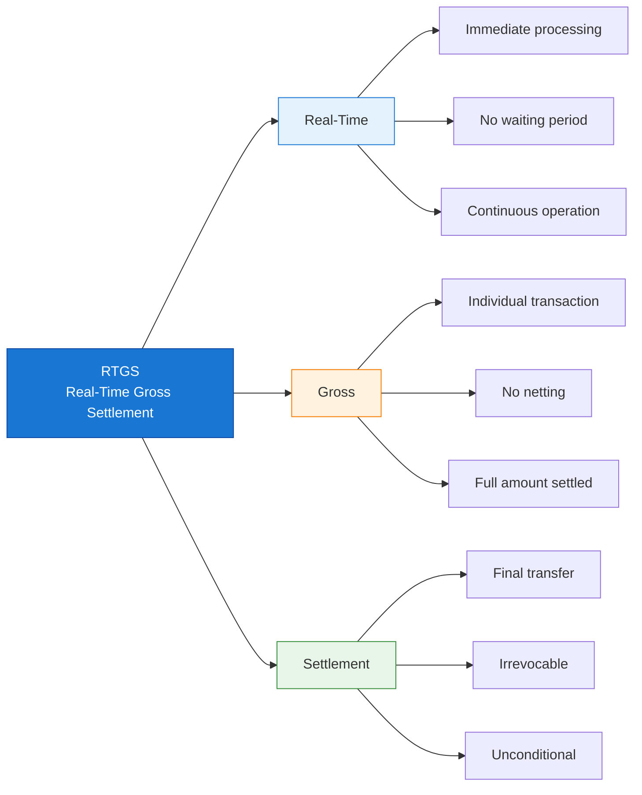
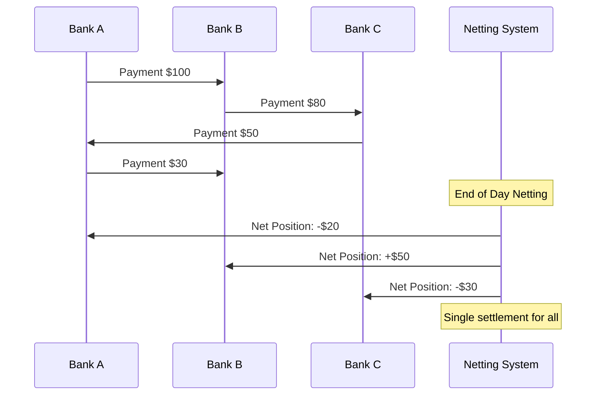
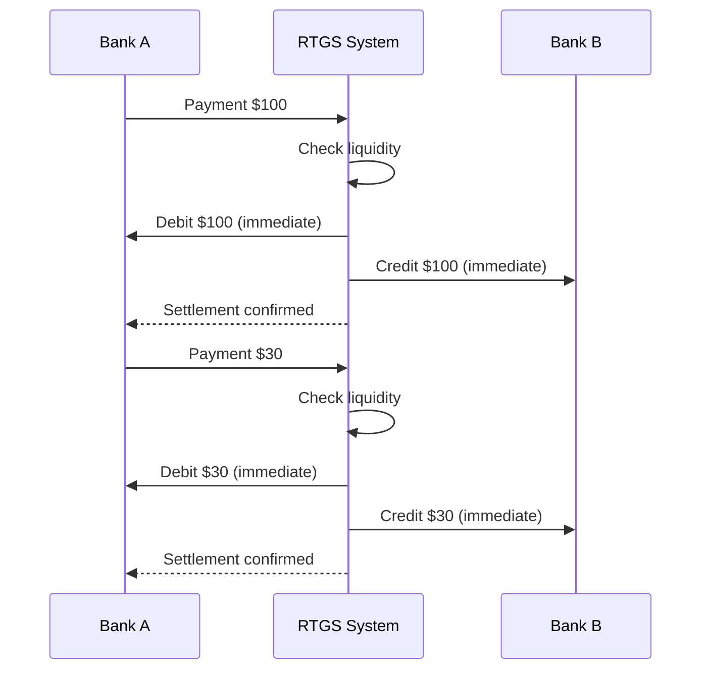
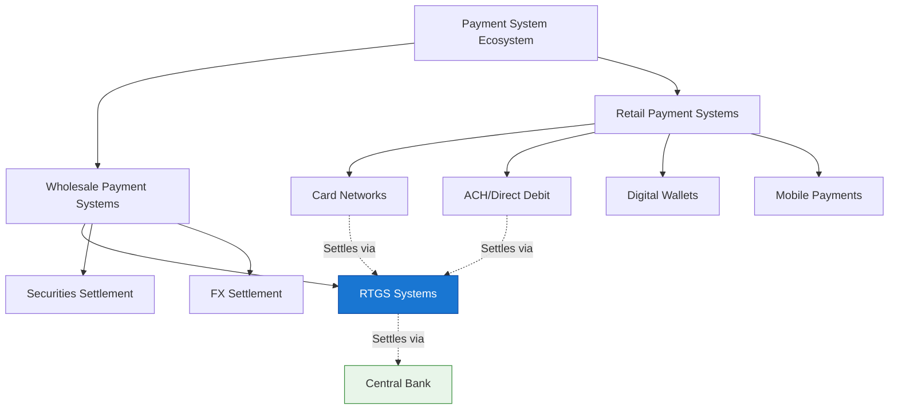
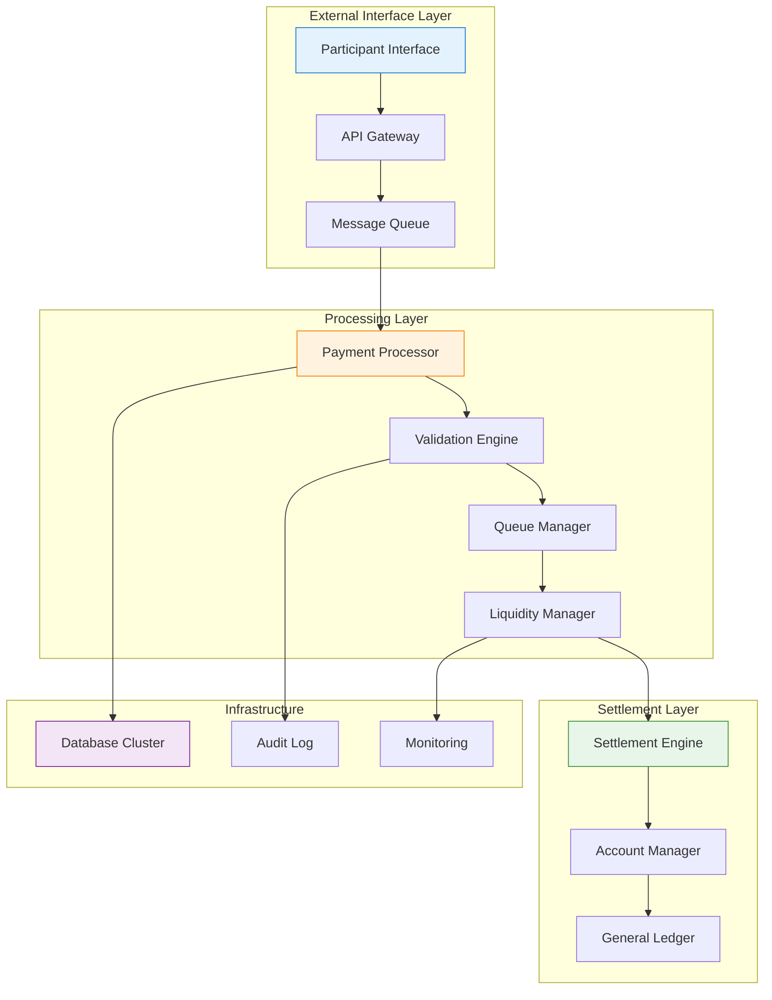
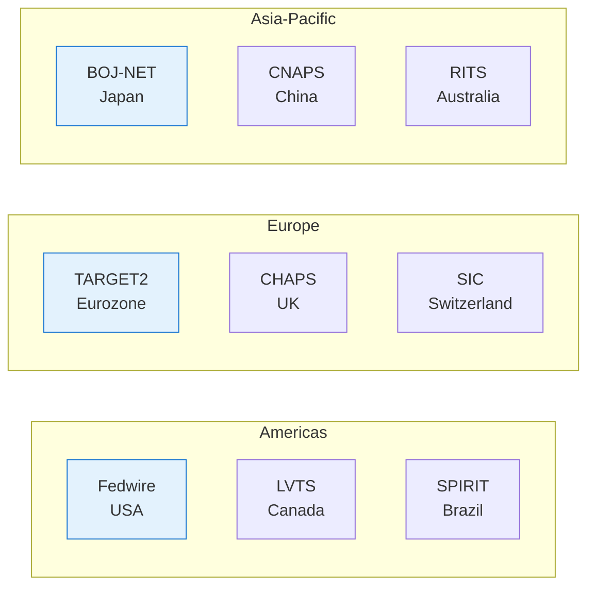
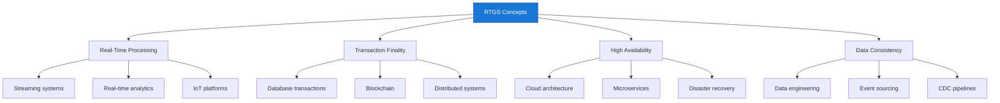

Real-Time Gross Settlement (RTGS) systems form the backbone of modern financial infrastructure, processing trillions of dollars in transactions daily. For IT professionals, understanding RTGS is essential when working with financial systems, payment platforms, or enterprise architecture.

## 1、What is RTGS?

### 1.1 Definition and Core Concept

!!!tip "💡 RTGS Definition"
    **Real-Time Gross Settlement (RTGS)** is a funds transfer system where transactions are settled **immediately** and **individually** on a **gross basis** in real-time.

Let's break down each component of this definition:



!!!anote "⚡ What Does 'Real-Time' Really Mean?"
    For IT professionals, it's important to understand that "real-time" in RTGS context means **near real-time** from a technical perspective:

    **✅ Real-Time in RTGS Context:**
    - **No intentional delay**: Transactions are not batched or queued for later processing
    - **Continuous processing**: System processes transactions as they arrive, 24/7 during operating hours
    - **Settlement finality within seconds**: Once processed, settlement is final and irrevocable
    - **Contrast with batch systems**: Unlike ACH[^1] or net settlement that wait hours or days

    **⏱️ Actual Processing Times:**

    ```
    Phase                    Typical Duration    Notes
    ─────────────────────────────────────────────────────────
    Message validation       10-50 ms           XML schema, signature check
    Liquidity check           5-20 ms           Database lookup
    Settlement execution     10-100 ms          Account updates, ledger write
    Confirmation sent         5-50 ms           Network latency dependent
    ─────────────────────────────────────────────────────────
    Total end-to-end        100-500 ms          P99 latency typically < 1 second
    ```

    **🔬 Technical Reality:**
    - Not "hard real-time" like embedded systems (microsecond deadlines)
    - Is "soft real-time" / "near real-time" by IT standards
    - But "real-time" compared to traditional banking (days) or batch systems (hours)
    - Industry benchmark: >95% of payments settled within 60 seconds

    **💡 Key Takeaway:** "Real-time" means **no batching, no deferred settlement**—each transaction is processed individually upon receipt, with settlement completing in under a second in normal conditions.

    **📝 Note:** Throughout this article, acronyms are used for brevity. See [Section 8: Acronyms and Abbreviations](#8-acronyms-and-abbreviations) for full names and descriptions.

### 1.2 RTGS vs. Net Settlement Systems

Understanding the difference between RTGS and net settlement is fundamental. But first, what is a Net Settlement System and why does it exist?

!!!anote "🏦 What is Net Settlement?"
    **Net Settlement** (also called Deferred Net Settlement or DNS[^2]) is a payment system where transactions are **accumulated over a period** and settled as **net positions** at predetermined intervals.

    **How it works:**
    1. Throughout the day, banks send payment instructions to the system
    2. The system records all transactions but **does not settle immediately**
    3. At settlement time (e.g., end of day), the system calculates **net positions**
    4. Each participant pays or receives only the **net difference**

    **Why Net Settlement Exists:**

    ✅ **Liquidity Efficiency**
    - Banks need less cash on hand
    - Multiple obligations offset each other
    - Ideal for high-volume, lower-value payments

    ✅ **Cost Reduction**
    - Fewer actual fund transfers
    - Lower operational costs
    - Economical for small transactions

    ✅ **Historical Reasons**
    - Predates modern computing
    - Worked well with batch processing
    - Still suitable for certain payment types

    ⚠️ **Trade-off: Credit Risk**
    - Settlement is deferred, creating exposure
    - If one bank fails before settlement, others are affected
    - Known as "Herstatt Risk" or settlement risk

**Visual Comparison: How Money Flows**

```mermaid
graph TB
    subgraph "RTGS: Each Transaction Settled Immediately"
        A1[Bank A] -->|Pay $100| A2((RTGS))
        A2 -->|Pay $100| A3[Bank B]
        A1 -->|Pay $50| A2
        A2 -->|Pay $50| A4[Bank C]
        
        A5[Bank B] -->|Pay $80| A2
        A2 -->|Pay $80| A4
    end
    
    subgraph "Net Settlement: Accumulate Then Net"
        B1[Bank A] -->|Owe $150| B2((Clearing))
        B3[Bank B] -->|Owe $80| B2
        B4[Bank C] -->|Receive $70| B2
        
        B2 -->|Net: -$150| B1
        B2 -->|Net: +$20| B3
        B2 -->|Net: +$130| B4
        
        Note below B2: Settle once<br/>at period end
    end
    
    style A2 fill:#1976d2,stroke:#0d47a1,color:#fff
    style B2 fill:#f57c00,stroke:#e65100,color:#fff
```

**Detailed Comparison:**

| Feature | RTGS | Net Settlement (DNS) |
|---------|------|---------------------|
| **Settlement Timing** | Real-time, continuous | End of period (batch) |
| **Settlement Basis** | Gross (individual) | Net (aggregated) |
| **Transaction Finality** | Immediate | Deferred |
| **Liquidity Requirement** | High | Lower |
| **Credit Risk** | Minimal | Higher (counterparty risk) |
| **Processing Cost** | Higher per transaction | Lower per transaction |
| **Best For** | High-value, time-critical | Low-value, high-volume |

**Net Settlement Example:**



**RTGS Example:**



**Real-World Usage:**

| System Type | Typical Settlement Method | Examples |
|-------------|--------------------------|----------|
| **High-Value Payments** | RTGS | Fedwire, TARGET2, CHAPS |
| **Retail Payments** | Net Settlement | ACH[^1], Direct Debit, Card Networks |
| **Securities Trading** | RTGS or Hybrid | DTC[^3], Euroclear |
| **Foreign Exchange (FX)**[^4] | RTGS | CLS[^5] Bank |

### 1.3 Key Characteristics of RTGS Systems

!!!anote "🔐 Essential RTGS Characteristics"
    RTGS systems share these critical characteristics that IT professionals must understand:

    ✅ **Real-Time Processing**
    - Transactions processed immediately upon receipt
    - No batching or queuing for settlement
    - Continuous operation during business hours

    ✅ **Gross Settlement**
    - Each transaction settled individually
    - No netting against other transactions
    - Full value transferred

    ✅ **Finality**
    - Settlement is irrevocable
    - Unconditional transfer of funds
    - Legal certainty once processed

    ✅ **Central Bank Money**
    - Settlement in central bank reserves
    - Highest form of money safety
    - No commercial bank credit risk

## 2、RTGS in the Payment System Ecosystem

### 2.1 Payment System Hierarchy



### 2.2 Transaction Flow in RTGS

**Complete Transaction Lifecycle:**


### 2.3 Participants in RTGS Systems

| Participant Type | Role | Examples |
|-----------------|------|----------|
| **Central Bank** | Operator/Regulator | Federal Reserve, ECB, PBOC |
| **Direct Participants** | Banks with RTGS accounts | Commercial banks, Central banks |
| **Indirect Participants** | Access via direct participants | Credit unions, Small banks |
| **System Operators** | Technical operation | Central bank IT, Vendors |
| **Settlement Agents** | Provide liquidity | Central bank, Commercial banks |

## 3、Technical Architecture Overview

### 3.1 High-Level System Components



### 3.2 Core Technical Requirements

!!!anote "⚡ Critical Technical Requirements"
    RTGS systems demand exceptional technical standards:

    ✅ **Availability**
    - 99.99%+ uptime during operating hours
    - Redundant systems with failover
    - Disaster recovery capabilities

    ✅ **Performance**
    - Sub-second processing latency
    - High throughput (thousands TPS)
    - Scalable architecture

    ✅ **Security**
    - End-to-end encryption
    - Strong authentication (HSM, PKI)
    - Audit trails and non-repudiation

    ✅ **Data Integrity**
    - ACID transactions
    - Exactly-once processing
    - Reconciliation mechanisms

### 3.3 Message Standards

RTGS systems use standardized message formats:

| Standard | Usage | Region |
|----------|-------|--------|
| **ISO 20022** | Modern standard | Global |
| **SWIFT MT** | Legacy standard | Global |
| **Fedwire** | US Federal Reserve | USA |
| **TARGET2** | European System | EU |

## 4、Real-World RTGS Systems

### 4.1 Major RTGS Systems Worldwide



### 4.2 System Comparison

| System | Operator | Currency | Avg Daily Value |
|--------|----------|----------|-----------------|
| **Fedwire** | Federal Reserve | USD | $5+ trillion |
| **TARGET2** | ECB | EUR | €3+ trillion |
| **CHAPS** | Bank of England | GBP | £800+ billion |
| **BOJ-NET** | Bank of Japan | JPY | ¥80+ trillion |

## 5、Why IT Professionals Should Understand RTGS

### 5.1 Career Relevance

!!!tip "💡 Professional Applications"
    Understanding RTGS opens doors in multiple IT domains:

    ✅ **Financial Technology (FinTech)**
    - Payment system development
    - Banking software
    - Financial integration projects

    ✅ **Enterprise Architecture**
    - High-value transaction systems
    - Real-time processing architectures
    - Mission-critical system design

    ✅ **System Integration**
    - Bank connectivity projects
    - Payment gateway development
    - Cross-border payment solutions

    ✅ **Security and Compliance**
    - Financial security standards
    - Regulatory compliance
    - Audit and risk management

### 5.2 Transferable Concepts

RTGS principles apply to many IT domains:



## 6、Series Overview

This is the **first article** in our RTGS series for IT professionals. Upcoming articles will cover:

| Part | Topic | Focus |
|------|-------|-------|
| **Part 1** | Core Concepts | Foundations (this article) |
| **Part 2** | System Architecture | Components and design |
| **Part 3** | Message Standards | ISO 20022 and protocols |
| **Part 4** | Security & Risk | Threats and mitigation |
| **Part 5** | High Availability | Performance and resilience |

## 7、Summary

!!!anote "📋 Key Takeaways"
    **Essential points to remember:**

    ✅ **RTGS = Real-Time + Gross + Settlement**
    - Real-time: Immediate processing
    - Gross: Individual transaction settlement
    - Settlement: Final and irrevocable

    ✅ **RTGS vs. Net Settlement**
    - RTGS: Higher safety, immediate finality
    - Net: Lower cost, deferred settlement

    ✅ **Critical for Financial Infrastructure**
    - Processes high-value transactions
    - Uses central bank money
    - Systemically important

    ✅ **IT Relevance**
    - Demands high availability and performance
    - Requires robust security
    - Uses standardized messaging

---

**Related Articles:**
- [Understanding ISO 20022 Payment Messages](/2025/12/understanding-rtgs-message-standards/)
- [High Availability System Design Patterns](/assets/architecture/)

---

## Footnotes

[^1]: **ACH** - Automated Clearing House: US electronic network for processing financial transactions, typically used for domestic low-value payments
[^2]: **DNS** - Deferred Net Settlement: System that accumulates transactions and settles them in batches at predetermined intervals
[^3]: **DTC** - Depository Trust Company: US securities depository and clearinghouse that settles securities trades
[^4]: **FX** - Foreign Exchange: The trading of currencies between different nations
[^5]: **CLS** - Continuous Linked Settlement: Multi-currency cash settlement system for foreign exchange transactions, eliminating settlement risk

---

## 8、Acronyms and Abbreviations

| Acronym | Full Name | Description |
|---------|-----------|-------------|
| **RTGS** | Real-Time Gross Settlement | System for immediate settlement of individual transactions |
| **ECB** | European Central Bank | Central bank for the Eurozone |
| **PBOC** | People's Bank of China | Central bank of the People's Republic of China |
| **CHAPS** | Clearing House Automated Payment System | UK same-day sterling payment system |
| **Fedwire** | Federal Reserve Wire Network | US real-time gross settlement funds transfer system |
| **TARGET2** | Trans-European Automated Real-time Gross settlement Express Transfer system | Eurozone RTGS system |
| **BOJ-NET** | Bank of Japan Financial Network Network | Japanese RTGS system |
| **CNAPS** | China National Advanced Payment System | Chinese payment system including HVPS (RTGS) |
| **RITS** | Reserve Bank Information and Transfer System | Australian RTGS system |
| **LVTS** | Large Value Transfer System | Canadian RTGS system (now replaced by Lynx) |
| **SIC** | Swiss Interbank Clearing | Swiss RTGS system |
| **ISO** | International Organization for Standardization | Develops international standards including ISO 20022 |
| **SWIFT** | Society for Worldwide Interbank Financial Telecommunication | Global messaging network for financial institutions |
| **BIC** | Bank Identifier Code | Standard format for identifying banks (also called SWIFT code) |
| **IBAN** | International Bank Account Number | International standard for identifying bank accounts |
| **HSM** | Hardware Security Module | Physical device for managing digital keys and cryptographic operations |
| **PKI** | Public Key Infrastructure | Framework for managing digital certificates and encryption |
| **TLS** | Transport Layer Security | Cryptographic protocol for secure communications |
| **mTLS** | Mutual TLS | TLS where both parties authenticate each other |
| **API** | Application Programming Interface | Interface for software components to communicate |
| **XML** | Extensible Markup Language | Markup language for encoding documents (used in ISO 20022) |
| **JSON** | JavaScript Object Notation | Lightweight data interchange format |
| **ACID** | Atomicity, Consistency, Isolation, Durability | Properties guaranteeing reliable database transactions |
| **TPS** | Transactions Per Second | Measure of system throughput |
| **RTO** | Recovery Time Objective | Maximum acceptable downtime after a failure |
| **RPO** | Recovery Point Objective | Maximum acceptable data loss measured in time |
| **DR** | Disaster Recovery | Strategies and procedures for recovering from disasters |
| **DC** | Data Center | Facility housing computer systems and network infrastructure |
| **IoT** | Internet of Things | Network of physical devices with embedded connectivity |
| **CDC** | Change Data Capture | Process of identifying and capturing data changes |
