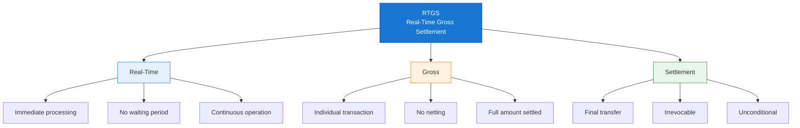
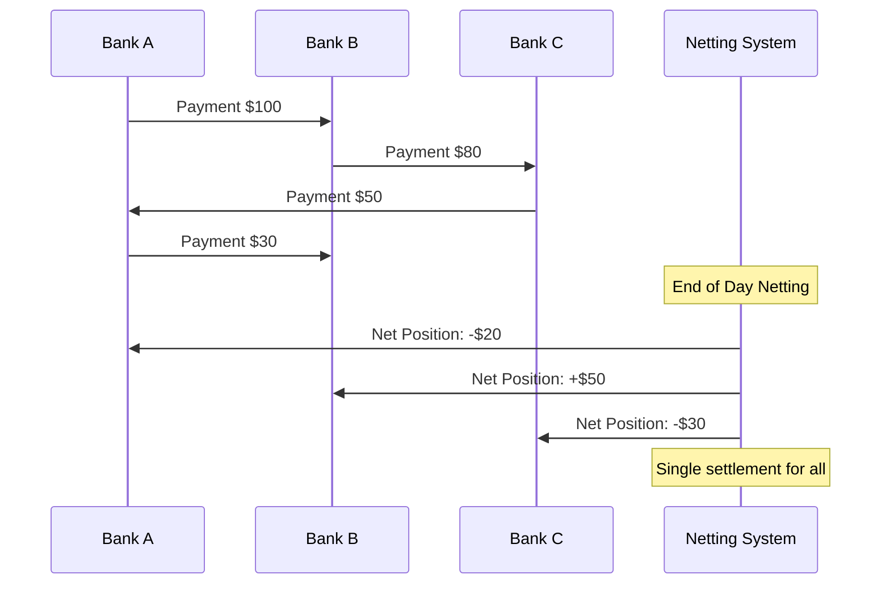
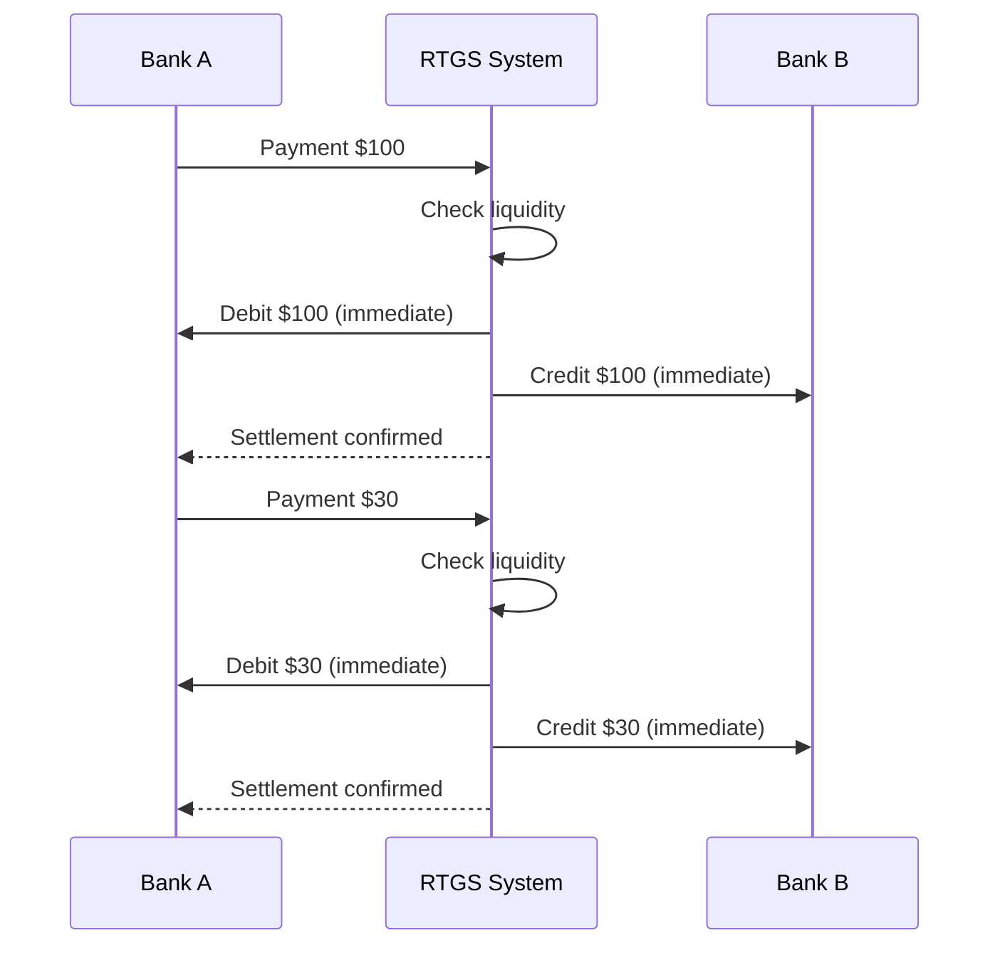
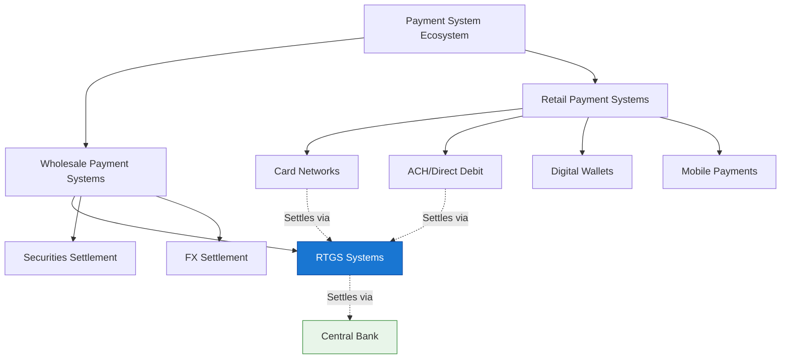
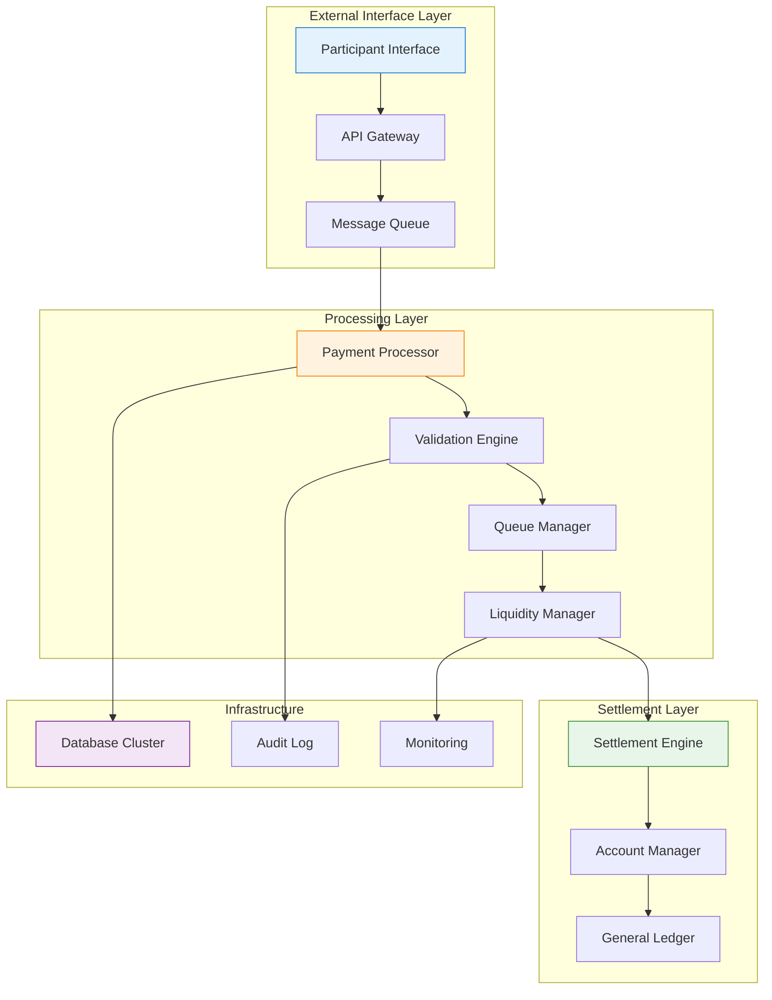
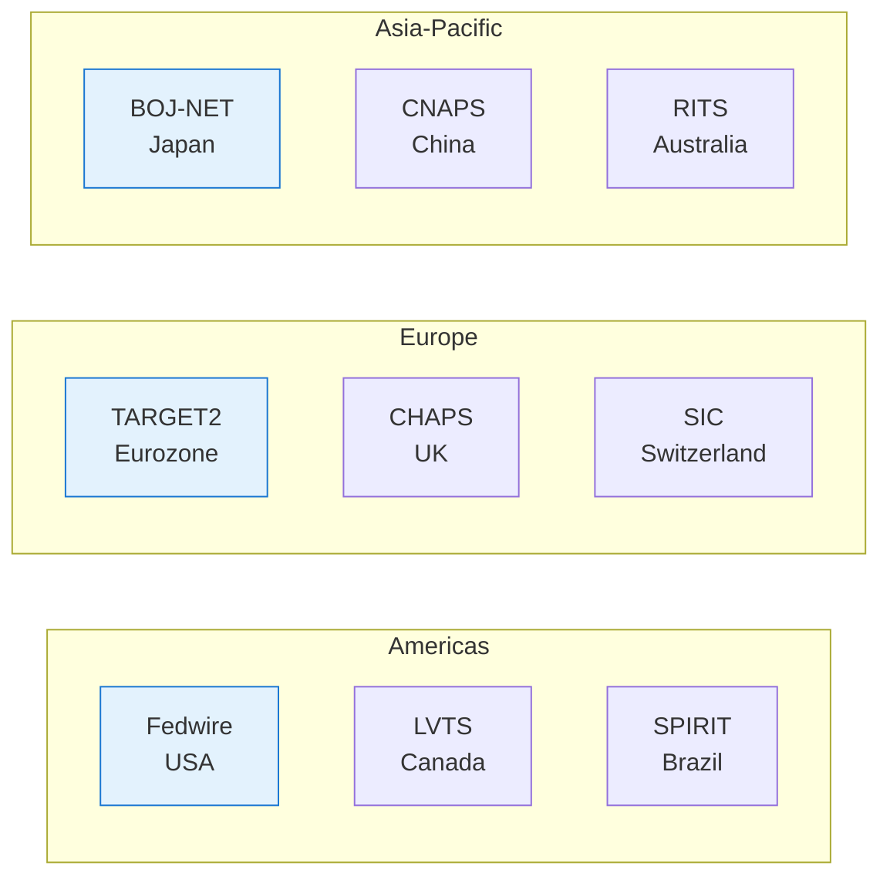
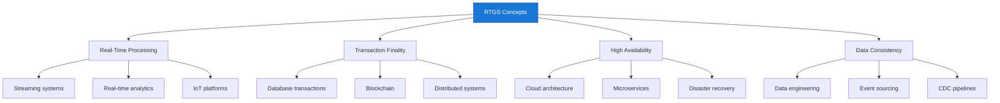

Real-Time Gross Settlement (RTGS) systems form the backbone of modern financial infrastructure, processing trillions of dollars in transactions daily. For IT professionals, understanding RTGS is essential when working with financial systems, payment platforms, or enterprise architecture.

## 1、What is RTGS?

### 1.1 Definition and Core Concept

!!!tip "💡 RTGS Definition"
    **Real-Time Gross Settlement (RTGS)** is a funds transfer system where transactions are settled **immediately** and **individually** on a **gross basis** in real-time.

Let's break down each component of this definition:

### 1.2 RTGS vs. Net Settlement Systems

Understanding the difference between RTGS and net settlement is fundamental:

| Feature | RTGS | Net Settlement (DNS) |
|---------|------|---------------------|
| **Settlement Timing** | Real-time, continuous | End of period (batch) |
| **Settlement Basis** | Gross (individual) | Net (aggregated) |
| **Transaction Finality** | Immediate | Deferred |
| **Liquidity Requirement** | High | Lower |
| **Credit Risk** | Minimal | Higher (counterparty risk) |
| **Processing Cost** | Higher per transaction | Lower per transaction |
| **Best For** | High-value, time-critical | Low-value, high-volume |

**Net Settlement Example:**

**RTGS Example:**

### 1.3 Key Characteristics of RTGS Systems

!!!anote "🔐 Essential RTGS Characteristics"
    RTGS systems share these critical characteristics that IT professionals must understand:

    ✅ **Real-Time Processing**
    - Transactions processed immediately upon receipt
    - No batching or queuing for settlement
    - Continuous operation during business hours

    ✅ **Gross Settlement**
    - Each transaction settled individually
    - No netting against other transactions
    - Full value transferred

    ✅ **Finality**
    - Settlement is irrevocable
    - Unconditional transfer of funds
    - Legal certainty once processed

    ✅ **Central Bank Money**
    - Settlement in central bank reserves
    - Highest form of money safety
    - No commercial bank credit risk

## 2、RTGS in the Payment System Ecosystem

### 2.1 Payment System Hierarchy

### 2.2 Transaction Flow in RTGS

**Complete Transaction Lifecycle:**

### 2.3 Participants in RTGS Systems

| Participant Type | Role | Examples |
|-----------------|------|----------|
| **Central Bank** | Operator/Regulator | Federal Reserve, ECB, PBOC |
| **Direct Participants** | Banks with RTGS accounts | Commercial banks, Central banks |
| **Indirect Participants** | Access via direct participants | Credit unions, Small banks |
| **System Operators** | Technical operation | Central bank IT, Vendors |
| **Settlement Agents** | Provide liquidity | Central bank, Commercial banks |

## 3、Technical Architecture Overview

### 3.1 High-Level System Components

### 3.2 Core Technical Requirements

!!!anote "⚡ Critical Technical Requirements"
    RTGS systems demand exceptional technical standards:

    ✅ **Availability**
    - 99.99%+ uptime during operating hours
    - Redundant systems with failover
    - Disaster recovery capabilities

    ✅ **Performance**
    - Sub-second processing latency
    - High throughput (thousands TPS)
    - Scalable architecture

    ✅ **Security**
    - End-to-end encryption
    - Strong authentication (HSM, PKI)
    - Audit trails and non-repudiation

    ✅ **Data Integrity**
    - ACID transactions
    - Exactly-once processing
    - Reconciliation mechanisms

### 3.3 Message Standards

RTGS systems use standardized message formats:

| Standard | Usage | Region |
|----------|-------|--------|
| **ISO 20022** | Modern standard | Global |
| **SWIFT MT** | Legacy standard | Global |
| **Fedwire** | US Federal Reserve | USA |
| **TARGET2** | European System | EU |

## 4、Real-World RTGS Systems

### 4.1 Major RTGS Systems Worldwide

### 4.2 System Comparison

| System | Operator | Currency | Avg Daily Value |
|--------|----------|----------|-----------------|
| **Fedwire** | Federal Reserve | USD | $5+ trillion |
| **TARGET2** | ECB | EUR | €3+ trillion |
| **CHAPS** | Bank of England | GBP | £800+ billion |
| **BOJ-NET** | Bank of Japan | JPY | ¥80+ trillion |

## 5、Why IT Professionals Should Understand RTGS

### 5.1 Career Relevance

!!!tip "💡 Professional Applications"
    Understanding RTGS opens doors in multiple IT domains:

    ✅ **Financial Technology (FinTech)**
    - Payment system development
    - Banking software
    - Financial integration projects

    ✅ **Enterprise Architecture**
    - High-value transaction systems
    - Real-time processing architectures
    - Mission-critical system design

    ✅ **System Integration**
    - Bank connectivity projects
    - Payment gateway development
    - Cross-border payment solutions

    ✅ **Security and Compliance**
    - Financial security standards
    - Regulatory compliance
    - Audit and risk management

### 5.2 Transferable Concepts

RTGS principles apply to many IT domains:

## 6、Series Overview

This is the **first article** in our RTGS series for IT professionals. Upcoming articles will cover:

| Part | Topic | Focus |
|------|-------|-------|
| **Part 1** | Core Concepts | Foundations (this article) |
| **Part 2** | System Architecture | Components and design |
| **Part 3** | Message Standards | ISO 20022 and protocols |
| **Part 4** | Security & Risk | Threats and mitigation |
| **Part 5** | High Availability | Performance and resilience |

## 7、Summary

!!!anote "📋 Key Takeaways"
    **Essential points to remember:**

    ✅ **RTGS = Real-Time + Gross + Settlement**
    - Real-time: Immediate processing
    - Gross: Individual transaction settlement
    - Settlement: Final and irrevocable

    ✅ **RTGS vs. Net Settlement**
    - RTGS: Higher safety, immediate finality
    - Net: Lower cost, deferred settlement

    ✅ **Critical for Financial Infrastructure**
    - Processes high-value transactions
    - Uses central bank money
    - Systemically important

    ✅ **IT Relevance**
    - Demands high availability and performance
    - Requires robust security
    - Uses standardized messaging

---

**Related Articles:**
- [Understanding ISO 20022 Payment Messages](/2025/12/understanding-rtgs-message-standards/)
- [High Availability System Design Patterns](/assets/architecture/)
