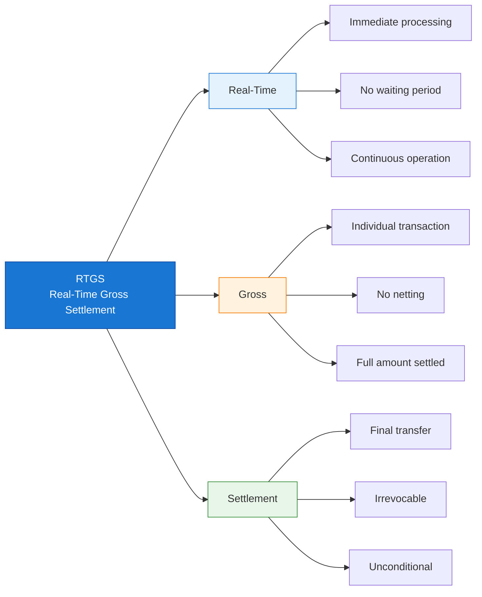
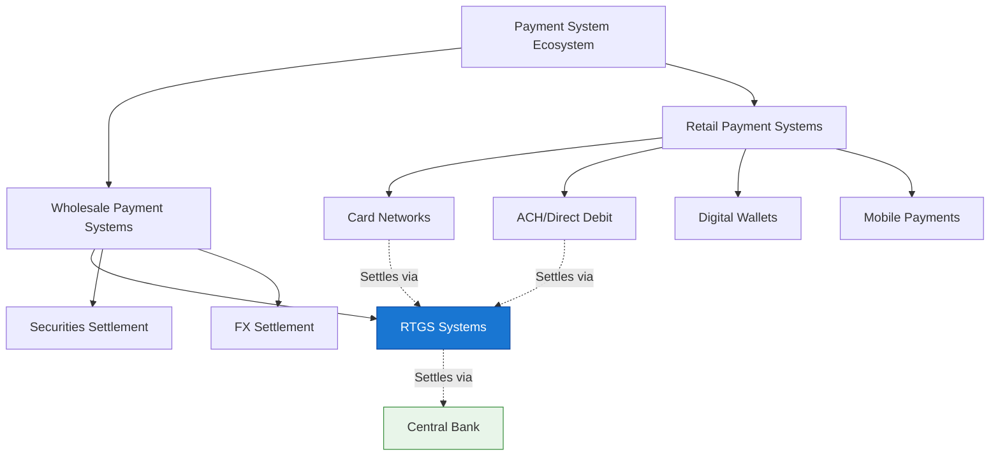
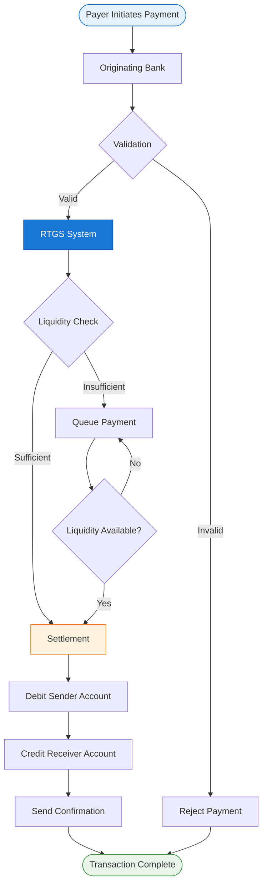
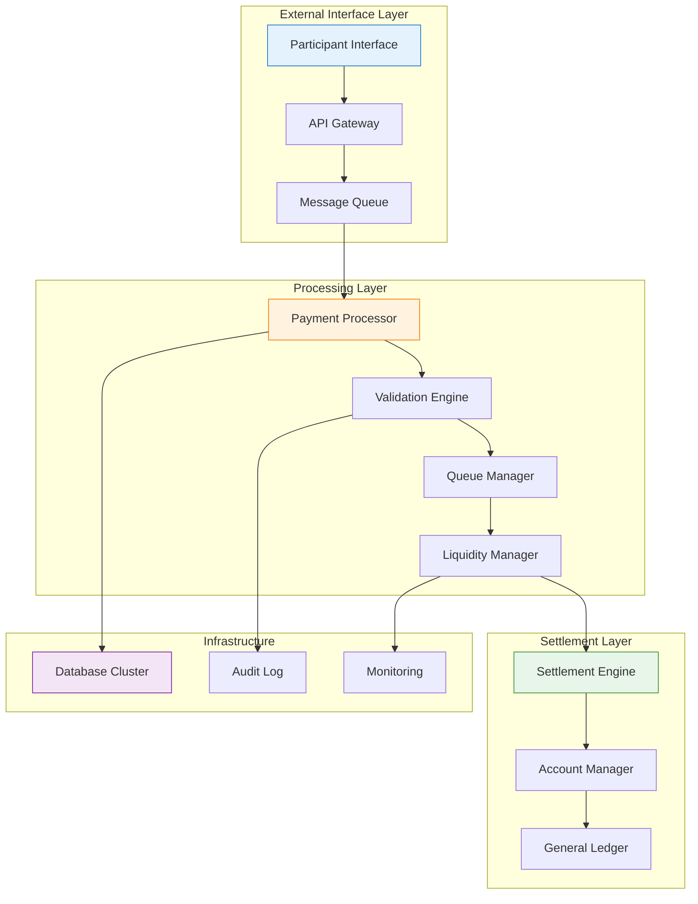
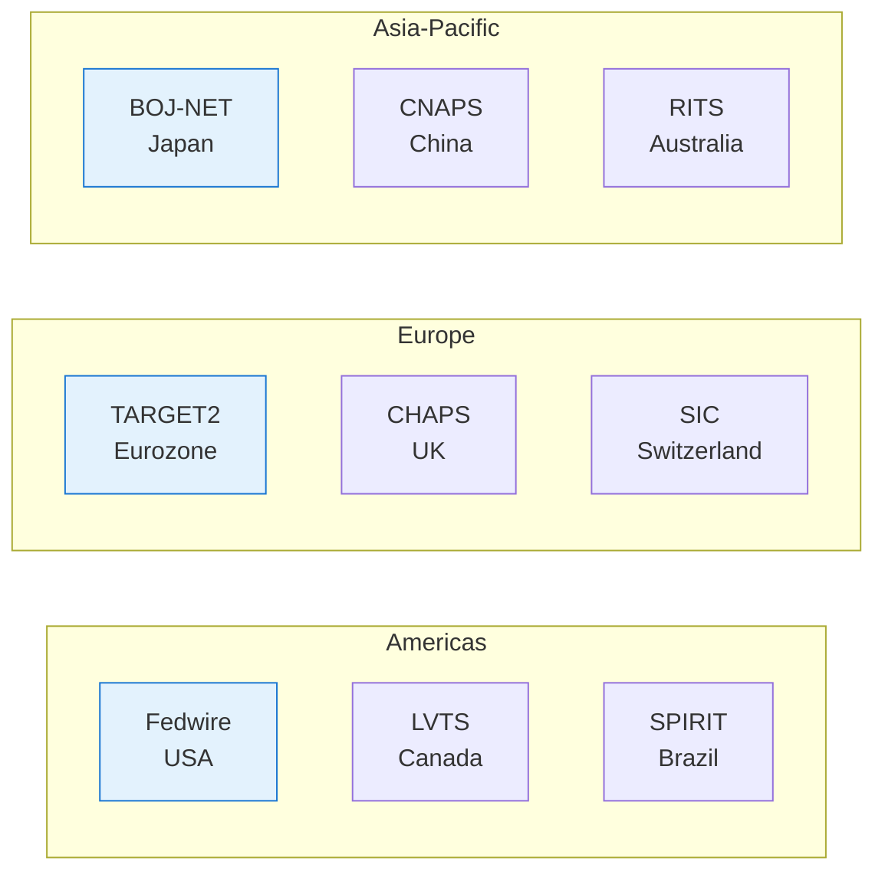
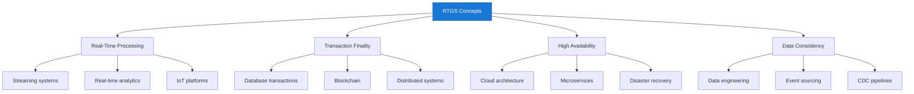

## 1 Basic Concept

### 1.1 Liquidity

Liquidity here means having enough readily available funds (or credit) in your central-bank settlement account right now (intraday) to cover the full gross amount of each outgoing payment as it hits the system. No netting, no waiting till end-of-day—every single transfer needs to be backed 1:1 the moment it settles.

**Why RTGS eats so much liquidity compared to the old batch/netting days**

In deferred netting (pre-RTGS hell), you only needed to fund the net difference at the end—send $100m out, receive $95m back, settle just $5m. Super efficient on cash; banks could recycle the same dollars all day.

RTGS says nope: settle gross, real-time, irrevocable. That $100m outgoing has to be fully covered before it leaves your account—no offsetting incoming flows yet. So if your payments are lumpy or timed unevenly (classic in FX, securities settlement, or just big corporate wires), you burn through reserves fast. Banks end up needing way more intraday liquidity to avoid queues, rejections, or gridlock (where everything stalls because everyone’s waiting for incoming funds to pay outgoing).

**Where does the liquidity actually come from?**

* **Own reserves** — Cash sitting in your central-bank account (cheapest but opportunity-cost heavy—can't lend/invest it elsewhere).
* **Incoming payments** — The "free" liquidity: funds landing from other banks that you can immediately reuse.
Intraday credit/overdrafts — Central banks often provide this (usually collateralized, sometimes free up to limits, sometimes priced). Think of it as an emergency line, but posting collateral ties up assets.
* **Money-market borrowing** — Borrow from other banks intraday, but that's redistribution, not new liquidity.
* **Liquidity-saving mechanisms (LSMs)** — Fancy overlays in modern RTGS (e.g., in TARGET2, CHAPS, many others): queue payments, match offsetting ones, settle bundles with minimal/no funds. Saves tons of liquidity without reintroducing credit risk—basically the RTGS version of batching but still real-time-ish.

**The daily grind for us in ops/IT**
You end up obsessing over:

* Intraday liquidity forecasting — Predict peaks, set alerts for low balances.
* Queue management — Prioritize urgent payments, avoid deadlocks.
* Collateral optimization — Don't over-post; free up assets where possible.
* Turnover ratios — How efficiently are you using liquidity? (High-value payments settled per unit of liquidity held—central banks watch this closely.)

Bottom line: RTGS trades the old settlement risk nightmare for liquidity risk and operational intensity. It's safer overall (no Herstatt-style surprises), but it forces banks to run hot all day—more monitoring, smarter queuing, constant liquidity juggling. That's why so many RTGS upgrades focus on LSMs and better intraday tools: make the system less thirsty without losing finality.

### 1.2 Deconstructing RTGS: Three Words, Entire Financial Infrastructure

Let me tell you a story about three words that keep the global financial system from collapsing.

**RTGS** — Real-Time Gross Settlement. Sounds like enterprise software jargon, right? But each of these three words represents a fundamental design decision that took humanity centuries to figure out. And as an IT professional, understanding these concepts will make you see distributed systems, databases, and transaction processing in a whole new light.

Let's break it down, one concept at a time.



#### Real-Time: The "Right Now" Problem

**B1 — Immediate Processing**

Imagine you're building a distributed system. User A clicks "Send $1 million to User B." What happens next?

In most systems you've built, the answer is: "We'll process it soon™."

- Your credit card transaction? Authorized now, settled in 2-3 days.
- Your ACH direct deposit? Submitted today, lands in your account tomorrow.
- Your wire transfer? "Same-day" means "within 24 hours."

RTGS says: **No. Right. Now.**

When a payment hits the RTGS system, it doesn't go into a batch queue. It doesn't wait for a nightly job. It doesn't sit in a "pending" state until someone's cron job wakes up at 2 AM. The system validates it, checks liquidity, and settles it **immediately** — typically in 100-500 milliseconds.

> **IT Analogy:** Think of the difference between:
> - **Batch processing** (like nightly ETL jobs, ACH files)
> - **Stream processing** (like Kafka Streams, Flink, real-time analytics)
>
> RTGS is the ultimate stream processor. Every payment is an event that must be processed the moment it arrives.

---

**B2 — No Waiting Period**

Here's where it gets interesting from a system design perspective.

In the old days (pre-RTGS, before the 1990s), banks would send payment instructions throughout the day, but **nothing actually settled until end-of-day**. The clearing house would net everything out, and banks would exchange the differences.

This created what we call **Herstatt Risk** (named after a German bank that failed in 1974):

```
Timeline of a Herstatt-style disaster:

09:00 — Bank A sends $100M to Bank B (via netting system)
10:00 — Bank B sends $80M to Bank A (via netting system)
14:00 — Bank A goes bankrupt
15:00 — Bank B has already sent $80M but won't receive $100M
17:00 — End-of-day netting: Bank B was supposed to receive net $20M
Result: Bank B lost $80M, Bank A's creditors keep the $100M
```

RTGS eliminates this by saying: **Every payment settles when it's sent. No waiting. No "I'll pay you later."**

> **IT Analogy:** This is like the difference between:
> - **Eventual consistency** (DynamoDB, Cassandra — "it'll sync up eventually")
> - **Strong consistency** (traditional RDBMS with ACID — "it's consistent NOW or it fails")
>
> RTGS chose strong consistency. The financial system couldn't handle "eventual."

---

**B3 — Continuous Operation**

RTGS systems don't process payments in batches. They don't have "processing windows." They run **continuously** during operating hours (often 18-24 hours/day for modern systems).

Think about what this means architecturally:

| Batch System (ACH, old clearing) | RTGS System |
|----------------------------------|-------------|
| Collect payments all day | Process payments as they arrive |
| Run settlement job at 2 AM | Settle each payment in milliseconds |
| Results available next morning | Results confirmed immediately |
| Can replay/retry failed batches | Must handle each payment atomically |
| Peak load at batch time | Steady load throughout the day |

> **IT Analogy:** This is the difference between:
> - **Scheduled jobs** (nightly backups, batch reports)
> - **Always-on services** (API gateways, streaming platforms, real-time databases)
>
> RTGS is an always-on, mission-critical service. When it goes down, trillions in transactions stall. Banks can't move money. Markets freeze. This is why availability requirements are 99.99%+ during operating hours.

---

#### Gross: The "One by One" Problem

**C1 — Individual Transaction**

Here's where RTGS gets expensive (and why banks complained when it was introduced).

**Gross** means: **Each transaction is settled individually, on its own merits, without reference to any other transaction.**

Let me show you what this means with an example:

```
Three banks, three payments:

Bank A → Bank B: $100 million
Bank B → Bank C: $80 million
Bank C → Bank A: $90 million

NET SETTLEMENT (old way):
- Bank A: -$100 + $90 = -$10 million (pays $10M)
- Bank B: +$100 - $80 = +$20 million (receives $20M)
- Bank C: +$80 - $90 = -$10 million (pays $10M)
- Total money that actually moves: $20 million

RTGS GROSS SETTLEMENT (new way):
- Bank A → Bank B: $100 million (settles immediately)
- Bank B → Bank C: $80 million (settles immediately)
- Bank C → Bank A: $90 million (settles immediately)
- Total money that actually moves: $270 million
```

See the difference? In net settlement, the system only moves the **net difference** ($20M). In RTGS, it moves the **full gross amount** of each transaction ($270M).

> **IT Analogy:** This is like the difference between:
> - **Delta sync** (only send changed data)
> - **Full sync** (send complete data every time)
>
> RTGS does full sync. Every. Single. Time.

---

**C2 — No Netting**

This is the controversial part.

Before RTGS, banks could **net** payments against each other. If Bank A owed Bank B $100M, and Bank B owed Bank A $95M, they'd just settle the $5M difference.

RTGS says: **Nope. Pay the full $100M. Then get your $95M separately.**

Why would anyone design a system this way?

**Answer:** Because netting introduces **credit risk**.

In the netting example above, what if Bank A pays its $100M, but then Bank B fails before paying its $95M? Bank A just lost $95M. This happened. A lot. In 1974, Bankhaus Herstatt failed after receiving payments but before sending its outgoing payments. Counterparties lost hundreds of millions. The risk became known as **Herstatt Risk** or **settlement risk**.

RTGS eliminates this by making every payment **final and independent**. No "I'll pay you later." No netting. No credit exposure between banks.

> **IT Analogy:** This is like the difference between:
> - **Two-phase commit with rollback** (if one part fails, everything rolls back)
> - **Saga pattern with compensating transactions** (each step is independent, failures require explicit compensation)
>
> RTGS chose: **Each transaction stands alone. No rollbacks. No "oops, never mind."**

---

**C3 — Full Amount Settled**

This is where liquidity becomes a problem.

Remember the example above? Bank A needs to have **$100 million available right now** to send that payment. It can't say "Well, I'm receiving $95M from Bank B in 10 minutes, so I only need $5M."

**RTGS says: Show me the money. Now.**

This is why RTGS systems require banks to maintain large **intraday liquidity** balances. You need enough cash on hand to cover your outgoing payments **before** incoming payments arrive.

> **IT Analogy:** This is like the difference between:
> - **Connection pooling** (reuse resources, efficient but complex)
> - **Fresh connection per request** (simple, safe, but resource-intensive)
>
> RTGS chose "fresh connection per request." Every payment must be fully funded. No recycling. No "I'll use the incoming payment to fund the outgoing one."

---

#### Settlement: The "It's Done" Problem

**D1 — Final Transfer**

When an RTGS payment settles, it's **final**. Not "pending." Not "subject to review." **Done.**

This matters because in banking, there's a difference between:
- **Payment instruction** ("Please pay $1M to Vendor X")
- **Settlement** ("$1M has moved from your account to Vendor X's account")

In consumer banking, you can send a payment instruction and it might take days to settle. In RTGS, the instruction and settlement are the **same event**.

> **IT Analogy:** This is like the difference between:
> - **Optimistic locking** ("I think this will work, let me try")
> - **Pessimistic locking** ("I have the lock, the resource is mine")
>
> RTGS uses pessimistic locking. When a payment settles, the money is gone from the sender and arrived at the receiver. No take-backs.

---

**D2 — Irrevocable**

Once an RTGS payment settles, **it cannot be reversed**.

Not by the sender. Not by the receiving bank. Not even by the central bank (except in extraordinary circumstances like court orders or proven fraud).

This is both a feature and a bug:

| Pros | Cons |
|------|------|
| No settlement risk | No "oops, wrong amount" |
| Certainty for receivers | No accidental reversal |
| Prevents fraud | Requires careful validation upfront |
| Legal finality | Disputes must be handled separately |

> **IT Analogy:** This is like the difference between:
> - **Soft delete** (mark as deleted, can be restored)
> - **Hard delete** (gone forever, no undo)
>
> RTGS payments are hard deletes. Once committed, they're immutable. This is why RTGS systems have extensive validation, compliance checks, and confirmation steps **before** settlement.

---

**D3 — Unconditional**

This is the subtlest but most important point.

An RTGS settlement is **not conditional** on anything else. It doesn't matter if:
- The sender changes their mind
- The underlying transaction is disputed
- There's a legal dispute between the parties
- The sender goes bankrupt 5 minutes later

The settlement **happened**. It's unconditional.

This is what makes RTGS **systemically safe**. When a bank receives an RTGS payment, it knows that money is **theirs**, full stop. They can lend it, invest it, send it elsewhere. No risk that it'll be clawed back.

> **IT Analogy:** This is like the difference between:
> - **Conditional commit** ("I'll commit if X, Y, Z all succeed")
> - **Unconditional commit** ("I've committed, it's done")
>
> RTGS is unconditional commit. The transaction log is written. The ledger is updated. The money has moved. End of story.

---

#### Putting It All Together: Why This Matters for IT

Let me connect this back to your world as an IT professional.

| RTGS Concept | IT Equivalent | Why You Should Care |
|--------------|---------------|---------------------|
| **Real-Time** | Stream processing, event-driven architecture | You're building more real-time systems every year |
| **Gross** | Individual transaction processing, no batching | Understanding trade-offs between efficiency and safety |
| **Settlement** | ACID transactions, strong consistency | Financial systems demand correctness over speed |
| **Finality** | Immutable records, append-only logs | Blockchain, event sourcing, audit trails |
| **Irrevocable** | Hard deletes, no undo | Designing systems where mistakes are expensive |
| **Unconditional** | No rollback, compensating transactions | Microservices, distributed sagas |

**The deeper lesson:** RTGS represents a fundamental design choice that you'll face in your own systems:

!!!anote "🎯 The RTGS Design Decision"
    **Do you optimize for efficiency (netting, batching, eventual consistency)?**
    **Or do you optimize for safety (gross settlement, strong consistency, finality)?**

    RTGS chose safety. The global financial system couldn't tolerate the risk of netting. And as an IT professional, you need to understand when **your** systems should make the same choice.

## 2 RTGS in the Payment System Ecosystem

### 2.1 Payment System Hierarchy



### 2.2 Transaction Flow in RTGS

**Complete Transaction Lifecycle:**



### 2.3 Participants in RTGS Systems

| Participant Type | Role | Examples |
|-----------------|------|----------|
| **Central Bank** | Operator/Regulator | Federal Reserve, ECB, PBOC |
| **Direct Participants** | Banks with RTGS accounts | Commercial banks, Central banks |
| **Indirect Participants** | Access via direct participants | Credit unions, Small banks |
| **System Operators** | Technical operation | Central bank IT, Vendors |
| **Settlement Agents** | Provide liquidity | Central bank, Commercial banks |

## 3 Technical Architecture Overview

### 3.1 High-Level System Components



### 3.2 Core Technical Requirements

!!!anote "⚡ Critical Technical Requirements"
    RTGS systems demand exceptional technical standards:

    ✅ **Availability**
    - 99.99%+ uptime during operating hours
    - Redundant systems with failover
    - Disaster recovery capabilities

    ✅ **Performance**
    - Sub-second processing latency
    - High throughput (thousands TPS)
    - Scalable architecture

    ✅ **Security**
    - End-to-end encryption
    - Strong authentication (HSM, PKI)
    - Audit trails and non-repudiation

    ✅ **Data Integrity**
    - ACID transactions
    - Exactly-once processing
    - Reconciliation mechanisms

### 3.3 Message Standards

RTGS systems use standardized message formats:

| Standard | Usage | Region |
|----------|-------|--------|
| **ISO 20022** | Modern standard | Global |
| **SWIFT MT** | Legacy standard | Global |
| **Fedwire** | US Federal Reserve | USA |
| **TARGET2** | European System | EU |

## 4 Real-World RTGS Systems

### 4.1 Major RTGS Systems Worldwide



### 4.2 System Comparison

| System | Operator | Currency | Avg Daily Value |
|--------|----------|----------|-----------------|
| **Fedwire** | Federal Reserve | USD | $5+ trillion |
| **TARGET2** | ECB | EUR | €3+ trillion |
| **CHAPS** | Bank of England | GBP | £800+ billion |
| **BOJ-NET** | Bank of Japan | JPY | ¥80+ trillion |

## 5 Why IT Professionals Should Understand RTGS

### 5.1 Career Relevance

!!!tip "💡 Professional Applications"
    Understanding RTGS opens doors in multiple IT domains:

    ✅ **Financial Technology (FinTech)**
    - Payment system development
    - Banking software
    - Financial integration projects

    ✅ **Enterprise Architecture**
    - High-value transaction systems
    - Real-time processing architectures
    - Mission-critical system design

    ✅ **System Integration**
    - Bank connectivity projects
    - Payment gateway development
    - Cross-border payment solutions

    ✅ **Security and Compliance**
    - Financial security standards
    - Regulatory compliance
    - Audit and risk management

### 5.2 Transferable Concepts

RTGS principles apply to many IT domains:



## 6 Series Overview

This is the **first article** in our RTGS series for IT professionals. Upcoming articles will cover:

| Part | Topic | Focus |
|------|-------|-------|
| **Part 1** | Core Concepts | Foundations (this article) |
| **Part 2** | System Architecture | Components and design |
| **Part 3** | Message Standards | ISO 20022 and protocols |
| **Part 4** | Security & Risk | Threats and mitigation |
| **Part 5** | High Availability | Performance and resilience |

## 7 Summary

!!!anote "📋 Key Takeaways"
    **Essential points to remember:**

    ✅ **RTGS = Real-Time + Gross + Settlement**
    - Real-time: Immediate processing
    - Gross: Individual transaction settlement
    - Settlement: Final and irrevocable

    ✅ **RTGS vs. Net Settlement**
    - RTGS: Higher safety, immediate finality
    - Net: Lower cost, deferred settlement

    ✅ **Critical for Financial Infrastructure**
    - Processes high-value transactions
    - Uses central bank money
    - Systemically important

    ✅ **IT Relevance**
    - Demands high availability and performance
    - Requires robust security
    - Uses standardized messaging

---

**Related Articles:**
- [Understanding ISO 20022 Payment Messages](/2025/12/understanding-rtgs-message-standards/)
- [High Availability System Design Patterns](/assets/architecture/)
- [RTGS Acronyms and Abbreviations Reference](/2025/12/rtgs-acronyms-and-abbreviations/)

---

**Footnotes for this article:**

[^1]: **ACH** - Automated Clearing House: US electronic network for processing financial transactions, typically used for domestic low-value payments
[^2]: **DNS** - Deferred Net Settlement: System that accumulates transactions and settles them in batches at predetermined intervals
[^3]: **DTC** - Depository Trust Company: US securities depository and clearinghouse that settles securities trades
[^4]: **FX** - Foreign Exchange: The trading of currencies between different nations
[^5]: **CLS** - Continuous Linked Settlement: Multi-currency cash settlement system for foreign exchange transactions, eliminating settlement risk

> **Note:** For a complete list of all acronyms used in the RTGS series, see the [RTGS Acronyms and Abbreviations Reference](/2025/12/rtgs-acronyms-and-abbreviations/).
