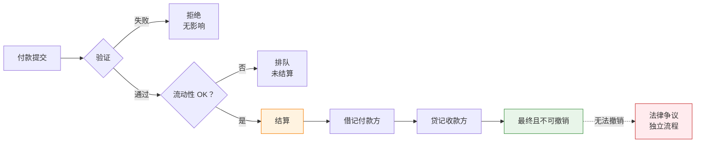

RTGS 以实时、不可撤销的结算方式，每天处理数兆的高价值支付——再也不必进行日终净额结算的轮盘赌注。在深入架构和代码之前，你需要了解驱动每个设计决策的金融概念。以下是金融优先的分解：流动性需求、最终性保证、为何 Herstatt 风险终结了净额结算，以及中央银行如何防止系统性僵局。

## 1 流动性

此处的流动性是指：在你的中央银行结算账户中，拥有足够的可用资金（或信用额度），以在每笔付出款项进入系统时，全额覆盖其总额。没有净额结算，不必等到日终——每笔转账在结算的当下都需要 1:1 的资金支持。

**为何 RTGS 比起旧式的批次/净额结算时代更消耗流动性**

在递延净额结算（RTGS 之前的地狱模式）中，你只需要在日终时为净差额融资——付出 1 亿美元，收到 9500 万美元，只需结算 500 万美元的差额。对现金超级有效；银行可以整天循环使用相同的美元。

RTGS 则说不行：总结算、实时、不可撤销。那 1 亿美元的付出款项在离开你的账户之前必须全额覆盖——还没有抵消的流入资金。因此，如果你的付款不规则或时间分布不均（外汇、证券结算或大型企业汇款的典型情况），你会迅速消耗准备金。银行最终需要更多的日内流动性，以避免排队、拒绝或系统性僵局（所有人都等待流入资金来支付流出款项，导致一切停摆）。

**流动性实际上从何而来？**

* **自有准备金** — 存放在中央银行账户的现金（成本最低，但机会成本高——无法借出或投资到其他地方）。
* **流入款项** — “免费”的流动性：从其他银行到账的资金，可以立即重复使用。
* **日内信用/透支** — 中央银行通常提供此服务（通常需要担保品，有时在限额内免费，有时计息）。想象成紧急信用贷款，但提交担保品会冻结资产。
* **货币市场借贷** — 日内向其他银行借款，但这只是重新分配，不是新的流动性。
* **流动性节省机制 (LSM)** — 现代 RTGS 中的高级覆盖层（例如 TARGET2、CHAPS 等）：将付款排队、匹配抵消的款项、以最少/无需资金结算捆绑款项。节省大量流动性，同时不重新引入信用风险——基本上是 RTGS 版本的批次处理，但仍保持实时性。

**资金和运营团队的日常磨练**

你最终会痴迷于：

* **日内流动性预测** — 预测高峰，设定低余额警报。
* **排队管理** — 优先处理紧急付款，避免死结。
* **担保品优化** — 不要过度提交；在可能的情况下释放资产。
* **周转率** — 你使用流动性的效率如何？（每单位持有流动性所结算的高价值付款数量——中央银行密切关注此指标。）

结论：RTGS 用旧式的结算风险噩梦换取了流动性风险和运营强度。整体而言更安全（没有 Herstatt 风格的意外），但它迫使银行整天高强度运作——更多监控、更智慧的排队、持续的流动性杂耍。这就是为何许多 RTGS 升级专注于 LSM 和更好的日内工具：让系统不那么渴求流动性，同时不失去最终性。

### DNS 与 RTGS：流动性权衡

**DNS（递延净额结算 / 净额结算）：**

流动性**低且集中在日终**。银行整天累积付款指令，但只有净额部位进行结算（例如：付出 1 亿美元，收到 9500 万美元 → 在日终或次日早晨只需结算 500 万美元的差额）。这通过多边净额结算消除了大量义务，因此参与者前期需要的实际现金/中央银行余额少得多。对流动性超级有效——银行在日内多次循环使用相同的资金，直到批次结算前不必移动真实资金。

**问题在于：** 你在白天累积信用/结算风险（Herstatt 风格的曝险），如果有人在结算时无法覆盖其净借记，可能会引发撤销或系统性问题。

**RTGS（实时总结算）：**

流动性**高、日内、且为总额**。每笔付款个别、全额（总额）、实时（或近实时）地在中央银行账簿上结算——没有净额抵消。如果你付出 1 亿美元，你当下就需要 1 亿美元的覆盖（来自你的余额、流入资金或日内信用/透支）。不必等待日终净额结算来减少账单。这意味着：

* **整体流动性需求更高** — 在高峰流量时，通常比 DNS 多 5-20 倍，取决于付款模式（在流入资金到达前的不规则流出）。
* **日内强度** — 高峰和低谷非常重要。你在大量流出期间消耗准备金，然后循环使用流入款项。不匹配会导致排队/系统性僵局。
* **积极的实时管理** — 资金/运营团队进行预测、每几分钟监控余额、优先处理排队、为透支提交担保品，或使用流动性节省机制 (LSM) 来抵消排队付款，而无需全额总额融资。

**数据显示：**

根据中央银行报告和研究（国际清算银行、美联储等），RTGS 通常需要**远多于**DNS 的流动性，因为没有多边净额结算的好处来抵消不平衡。银行最终持有更多准备金、日内借贷（成本高昂），或依赖 LSM/排队工具来挤出效率（例如 TARGET2 或 CHAPS 等系统通过抵消捆绑节省 20-50%）。

| 面向 | DNS（递延净额结算） | RTGS（实时总结算） |
|--------|-------------------------------|-----------------------------------|
| **流动性何时重要** | 日终批次结算 | 每毫秒，整天 |
| **需要多少** | 仅净额部位（例如 500 万美元） | 全额总额（例如 2.7 亿美元） |
| **风险概况** | 信用风险在白天累积 | 无信用风险，但有流动性风险 |
| **管理风格** | 批次关注，夜间压力 | 持续、实时监控 |
| **资金循环** | 高（相同美元重复使用） | 有限（必须在付出前融资） |

| DNS 世界 | RTGS 世界 |
|-----------|------------|
| 流动性主要是日终批次关注 | 流动性是持续的实时战斗 |
| 监控净额部位，确保凌晨 2 点有覆盖 | 仪表板闪烁着排队深度、余额警报 |
| 夜间压力，但白天运营在现金方面较轻松 | 上午 10 点一笔大型企业汇款而无匹配的流入？排队激增，潜在系统性僵局 |
| 简单预测 | 痴迷于周转率、LSM 触发器、预测工具 |

!!!question "关键要点"
    DNS 在流动性上便宜但过夜有风险；RTGS 在流动性上昂贵（前期投入、持续高强度）但实时无风险。这就是为何现代 RTGS 核心内置这么多流动性技巧（LSM、日内信用额度、排队优化器）——在不重新引入信用风险的情况下，挽回一些净额结算效率。

---

## 2 最终性

**“完成即完成”的保证**

一旦付款在 RTGS 中结算，就是**最终的**。中央银行账簿上的原子借记/贷记。不可撤销。无条件。无撤销。无追回。没有“哎呀，交易对手后来倒闭了”。资金可立即由收款方使用（下游到客户账户而无风险）。

这打破了旧式净额结算世界的撤销噩梦。在净额结算系统中，日终结算意味着付款在最终净额部位计算和资金转账之前是暂定的。RTGS 完全消除了这种不确定性。

**最终性在实务中的意义：**

| 面向 | 意义 | 业务影响 |
|--------|---------------|-----------------|
| **不可撤销** | 无法由付款方、收款方或中央银行撤销 | 收款方确定性 |
| **无条件** | 不依赖任何其他事件或条件 | 无“受限于”条款 |
| **实时** | 收款方可立即使用资金 | 无浮动期 |
| **绝对** | 法律最终性，不仅是系统确认 | 法院承认结算 |

**为何这对市场参与者很重要：**

你会看到最终性体现在：

- **SLA** — 结算 = 最终，提交后无“待定”状态
- **错误处理** — 拒绝仅发生在*结算前*；结算后错误通过单独的争议流程处理
- **无暂定贷记** — 与消费者银行不同，没有“我们已贷记你的账户但保留撤销权利”
- **下游处理** — 收款方可立即借出、投资或转送资金而无风险



**法律基础：**

最终性不仅是技术属性——它已写入法律。大多数司法管辖区都有**支付系统最终性立法**，保护 RTGS 结算免受：

- 破产冻结（受托人无法追回已结算付款）
- 法院禁令（除非非凡的欺诈案件）
- 监管干预（中央银行不会撤销，除非系统性紧急情况）

这种法律支持使 RTGS 成为金融稳定的支柱。当银行收到 RTGS 付款时，它知道那笔钱是**他们的**，就这样。他们可以借出、投资、转送到其他地方。没有被追回的风险。

---

## 3 结算风险（Herstatt 风险 / 本金风险）

**结算风险**是一个更广泛的术语，指金融交易中一方交付了其侧（例如支付现金或证券），但由于违约、破产、运营失败或结算窗口期间的时间问题，未能从交易对手收到相应价值的危险。

它被昵称为**Herstatt 风险**，具体是因为 1974 年著名的 Bankhaus I.D. Herstatt 倒闭事件，这是一家位于科隆的中型德国私人银行。1974 年 6 月 26 日，德国监管机构撤销了其执照，并在下午中段（当地时间下午 3:30-4:30 左右）将其关闭，此前发现巨大的外汇损失已多次抹去其资本。

**该事件为何变得传奇：**

* Herstatt 积极参与外汇即期交易，尤其是 USD/DM 货币对。
* 许多交易对手（主要是国际银行）在欧洲营业时间内已不可撤销地将德国马克支付到 Herstatt 在法兰克福的账户（他们的一侧已结算）。
* 但相应的美国美元稍后才到期，在纽约市场开市后（时区差距：欧洲收市时纽约刚开始）。
* 当监管机构切断电源时，Herstatt 无法（也没有）进行这些美元付款。交易对手们被迫承担交易的的全部本金金额（以今天的术语来说数亿美元），除了在破产程序中无担保索赔外，别无追索权。
* 这引发了立即的混乱：银行冻结付款，流动性干涸，纽约代理银行暂停与 Herstatt 相关的流量，纽约的多边净额结算系统在接下来几天内总额转账下降了约 60%。这是对系统脆弱性的警钟。

**“Herstatt 风险”一词作为简写的含义：**

这种确切的情境——尤其在外汇结算中——其中一种货币结算但另一种货币由于在非重叠结算窗口内的交易对手失败而未结算。它突出了跨时区非同时结算的危险，并直接导致：

* 成立**巴塞尔银行监管委员会**（1974 年末，总部设在国际清算银行）。
* 推动全球建立**实时总结算 (RTGS)** 系统。
* 后来的创新，如**CLS 银行**（2002 年推出），用于外汇的 PvP（付款对付款）以消除差距。

它也常被称为**本金风险**（或本金结算风险），因为曝险的是交易的全部本金金额——不仅是重置成本或按市价计价的损失（如预结算风险）。在失败的结算中，你可能会损失你付出的全部名义价值（本金），而不仅仅是价格变动的损益。尤其在外汇中，如果曝险很大，这可能使银行的资本相形见绌——因此 BIS/CPSS/BCBS 指南中强调“本金”（例如，他们 2013 年关于管理外汇结算风险压力的监管规则，强调通过 PvP 尽可能减少本金风险）。

| 术语 | 意义 |
|------|---------|
| **结算风险** | 交付对未交付风险的通用术语 |
| **Herstatt 风险** | 1974 年著名的外汇特定案例 → 成为昵称 |
| **本金风险** | 强调涉及的全部本金曝险（相对于仅重置成本） |

在如今的 RTGS 情境中（国内高价值付款），真正的 Herstatt/本金风险已基本消除，因为结算是总额、实时且在中央银行资金上最终的——没有等待窗口或净额结算赌注。但该术语在跨境/外汇中仍然存在，时区和遗留系统仍可能创造差距。

---

**RTGS 旨在消除的噩梦**

1974 年的灾难不仅是一次性损失——它暴露了全球金融系统处理结算的根本缺陷。在 RTGS 之前，整个支付基础设施运作于信任和时间之上：银行整天发送付款指令，但**直到日终没有任何实际结算**。清算所会将一切净额化，银行交换差额。

这为 Herstatt 风格的灾难创造了完美条件：

尤其在外汇和跨境交易中，**时区差距**使 RTGS 之前的情况变得残酷：

```
经典 Herstatt 灾难 (1974)：

09:00 中欧时间 — A 银行（德国）欠 B 银行（美国）1 亿美元
10:00 中欧时间 — B 银行欠 A 银行 2 亿德国马克（通过独立系统）
14:00 中欧时间 — A 银行从 B 银行收到 1 亿美元（通过美国系统，美国仍是早晨）
15:30 中欧时间 — 德国监管机构关闭 A 银行（资不抵债）
17:00 中欧时间 — B 银行本应从 A 银行收到 2 亿德国马克
结果：B 银行损失 2 亿德国马克。A 银行的债权人保留 1 亿美元。

发生是因为结算不同时。
一方支付了。另一方在支付回来之前失败了。
```

Bankhaus Herstatt 的失败不仅让交易对手损失数亿美元——它几乎冻结了整个外汇市场。银行意识到，如果结算发生在不同时区且没有协调，他们无法安全地交易货币。

**RTGS 如何消除结算风险（国内/同货币）：**

具有**实时最终性**的 RTGS 意味着：
- 付款**现在**结算，而不是“日终前”
- 收款方立即知道资金是**他们的**
- 没有你已支付但尚未收到的曝险窗口

**防止风险累积的 RTGS 设计特征：**

| 特征 | 如何防止风险 | 金融影响 |
|---------|---------------------|------------------|
| **排队** | 如果没有覆盖，付款等待 | 未经授权无透支 |
| **验证** | 结算前拒绝无效/资金不足的付款 | 防止失败的结算 |
| **原子结算** | 借记和贷记同时发生 | 无部分结算风险 |
| **实时监控** | 排队深度、吞吐量警报 | 压力早期预警 |

**结算风险仍然存在的地方：**

RTGS 消除了**国内、同货币**付款的这种风险。但跨境呢？仍然是问题：

- **时区差距** — 美国在美国时间结算，欧盟在欧盟时间
- **货币不匹配** — 美元端在 Fedwire 结算，欧元端在 TARGET2 结算
- **法律管辖问题** — 不同国家，不同的最终性法律

**解决方案覆盖层：**

| 机制 | 如何运作 | 范例 |
|-----------|--------------|---------|
| **CLS（连续链接结算）** | 多边净额结算与外汇 PvP | 同时结算 17 种货币 |
| **PvP（付款对付款）** | 两种货币端的原子结算 | 两笔付款都发生或都不发生 |
| **链接结算系统** | 跨 RTGS 系统的协调时间 | 香港 CHATS 与大陆 CNAPS 链接 |

**金融教训：**

结算风险本质上是关于**交易对手曝险**。在 RTGS 之前，银行面临：

```
信用曝险时间线（净额结算系统）：

09:00 — 我支付你 1 亿美元（我现在有曝险）
12:00 — 你本应支付我 9500 万美元
14:00 — 你破产了
结果：我损失 1 亿美元，将在破产中收回零头

信用曝险时间线（RTGS）：

09:00 — 我支付你 1 亿美元（已结算，最终）
09:01 — 你支付我 9500 万美元（已结算，最终）
14:00 — 你破产了
结果：无曝险。两笔付款在失败前完成。
```

这就是为何现代 RTGS 核心设计有**原子结算逻辑**——除非存在覆盖且保证counter-结算，否则没有付款会执行。

---

## 4 系统性僵局（系统范围死结）

**分布式系统死结的 RTGS 版本**

系统性僵局是当付款排队因为付款方缺乏流动性，但**所有人都在等待流入资金而这些资金本身也被困住**时发生的情况。连锁反应。排队膨胀。吞吐量骤降。即使系统总流动性没问题，它都在错误的时间在错误的地方。

想象一个交通路口，每个方向都在等待其他方向移动：

```
系统性僵局情境：

A 银行 → B 银行：5000 万美元（排队，A 等待流入）
B 银行 → C 银行：4000 万美元（排队，B 等待流入）
C 银行 → A 银行：4500 万美元（排队，C 等待流入）

系统总流动性：存在 1.35 亿美元
但：三笔付款都被困住
为何：每家银行都在等待本身被排队的资金

这是一个循环。A → B → C → A。经典死结。
```

**导致系统性僵局的原因：**

| 原因 | 描述 | 市场影响 |
|-------|-------------|---------------|
| **付款时间不佳** | 大型付款聚集在一起 | 早晨高峰，午餐低谷 |
| **集中** | 少数银行主导付款流 | 系统重要性增加 |
| **无协调** | 银行不同步流出/流入 | 所有人囤积流动性 |
| **FIFO 刚性** | 排队中的第一笔付款阻塞后面的 | 小型付款被困在大型后面 |

**现实世界的系统性僵局事件：**

历史显示系统性僵局多么快速地级联：

- **1985 年，Fedwire** — 软件故障导致排队累积，超过 100 亿美元延迟
- **2001 年，9 月 11 日** — 运营中断导致大规模排队，美联储注入前所未有的流动性
- **2008 年，雷曼兄弟** — 交易对手不确定性导致银行囤积流动性，系统性僵局风险飙升

中央银行现在将系统性僵局视为**系统性风险**——不仅是运营不便。

**中央银行如何对抗系统性僵局：**

现代 RTGS 系统部署复杂的**僵局解决算法**：

**1. 流动性节省机制 (LSM)：**
- **双边抵消** — 匹配两笔抵消的排队付款
- **多边抵消** — 净额化循环中的多笔付款
- **排队优化** — 重新排序以更好地循环

```
范例：多边偏移检测

排队付款：
A → B: 5000 万美元
B → C: 4000 万美元
C → A: 4500 万美元

循环检测找到：A → B → C → A
以最少流动性结算：
- A 需要：500 万美元净额（而非 5000 万美元总额）
- B 需要：0 美元（完全抵消）
- C 需要：0 美元（完全抵消）

系统仅用 500 万美元而非 1.35 亿美元结算循环
```

**2. 排队管理功能：**
- **优先级重新排序** — 紧急付款跳过排队
- **绕过 FIFO** — 跳过被阻塞的付款，结算后面的
- **部分结算** — 结算你能结算的，排队其余的

**3. 中央银行干预：**
- **流动性注入** — 临时日内信用扩张
- **排队重组** — 运营商启动的抵消
- **系统范围警报** — 协调银行行为

**监控与早期预警：**

你的煤矿金丝雀：
- **排队深度** — 突然激增 = 潜在系统性僵局
- **系统吞吐量** — 下降 = 付款被困
- **结算延迟** — 增加 = 流动性短缺
- **周转率** — 下降 = 流动性囤积

Bech-Soramäki 风格的**循环检测算法**在 TARGET2 和 CHAPS 等核心中仍然常见。这些是**高性能匹配引擎**——复杂、对延迟敏感，也是现代 RTGS 感觉不那么蛮力的重要原因。

---

## 5 日内信用 / 透支

**中央银行提供的缓冲**

日内信用是中央银行提供的紧急信用贷款，以便银行在流出在流入之前激增时不会停止。将它想象成**担保透支额度**，定价和上限旨在阻止滥用。

**为何它存在：**

即使是资本充足的银行也有**时间不匹配**：

```
典型日内流动性模式：

08:00 — 开户余额：1 亿美元
09:00 — 大型企业税款支付：-8000 万美元（余额：2000 万美元）
10:00 — 证券结算：-5000 万美元（余额：-3000 万美元 ← 透支！）
11:00 — 流入 RTGS 付款：+6000 万美元（余额：3000 万美元）
14:00 — 更多流入：+4000 万美元（余额：7000 万美元）
17:00 — 收盘：7000 万美元（偿还透支 + 利息）

无日内信用：10:00 的付款将排队或失败
有日内信用：系统继续顺利运行
```

**日内信用类型：**

| 类型 | 描述 | 范例系统 |
|------|-------------|-----------------|
| **担保透支** | 提交资产，获得信用额度 | Fedwire, TARGET2 |
| **计息信用** | 使用时收取利息 | 欧洲央行，英格兰银行 |
| **免费额度** | 有限金额，不收费 | 一些亚洲系统 |
| **无日内信用** | 必须有资金或排队 | 一些新兴市场 |

**担保品管理：**

信用额度不是免费的——银行必须提交担保品：

| 担保品类型 | 折扣率 | 流动性 |
|-----------------|---------|-----------|
| **政府债券** | 0-2% | 高 |
| **机构证券** | 3-5% | 中 |
| **公司债券** | 5-15% | 较低 |
| **股票** | 15-30% | 逐案处理 |

折扣率保护中央银行，如果银行失败且担保品必须清算。

**定价机制：**

中央银行平衡两个目标：
1. **提供足够信用**以防止系统性僵局
2. **定价足够高**以阻止滥用

| 定价模型 | 行为激励 |
|---------------|-------------------|
| **免费至限额** | 使用全部额度 |
| **固定利率** | 最小化使用持续时间 |
| **分层定价** | 保持在较低层级内 |
| **惩罚性利率** | 完全避免透支 |

**日终要求：**

大多数系统要求**收盘时零透支**：

```
日终扫描流程：

17:00 — 系统关闭客户付款
17:30 — 银行审查部位
18:00 — 自动扫描：借入/借出以清零
18:30 — 最终结算
19:00 — 系统关闭，所有账户平衡
```

负余额的银行必须从以下借入：
- 其他银行（银行间市场）
- 中央银行常设设施（惩罚性利率）

正余额的银行可以：
- 借给其他银行
- 存入中央银行（报酬利率）

---

## 6 流动性节省机制 (LSM)

**在不失去最终性的情况下减少流动性渴求的覆盖层**

LSM 是聪明的算法，让现代 RTGS 感觉不像“蛮力总结算”而更像“智慧实时结算”。它们减少流动性需求，同时不重新引入信用风险。

**演进：**

早期 RTGS 系统（1980-1990 年代）是纯总结算——每笔付款，全额，无技巧。银行抱怨流动性成本。现代系统（2000 年代+）添加 LSM 以减少负担。

**核心 LSM 技术：**

| 机制 | 如何运作 | 流动性节省 |
|-----------|--------------|-------------------|
| **双边抵消** | 净额化两笔抵消的排队付款 | 减少 40-60% |
| **多边抵消** | 净额化循环中的多笔付款 | 减少 60-80% |
| **排队优化** | 重新排序付款以更好地流动 | 改进 20-30% |
| **PvP/DvP 同步** | 原子链接结算 | 消除失败风险 |

**Bech-Soramäki 循环检测：**

以形式化该算法的研究人员命名。在 TARGET2 和 CHAPS 等核心中仍然常见。该算法：

1. 扫描排队中的付款循环（A→B→C→A）
2. 计算结算循环所需的最小流动性
3. 以该最小值原子地结算整个循环

```
LSM 之前：
A → B: 1 亿美元（排队，A 有 6000 万美元）
B → C: 8000 万美元（排队，B 有 5000 万美元）
C → A: 9000 万美元（排队，C 有 4000 万美元）

总需求：2.7 亿美元
总可用：1.5 亿美元
结果：系统性僵局

LSM 循环检测之后：
净额部位：
- A: -1000 万美元（支付 1 亿，收到 9000 万）
- B: +2000 万美元（收到 1 亿，支付 8000 万）
- C: -1000 万美元（支付 8000 万，收到 9000 万）

循环以约 1000 万美元额外流动性结算
系统解锁 2.6 亿美元付款
```

**LSM 运行时机：**

| 触发类型 | 描述 | 范例 |
|--------------|-------------|---------|
| **连续** | 每笔付款到达时运行 | 实时优化 |
| **定期** | 在固定间隔运行 | 每 5-10 分钟 |
| **事件驱动** | 在排队深度阈值时运行 | 检测到系统性僵局时 |
| **手动** | 运营商启动 | 压力事件期间 |

**权衡：**

LSM 不是免费的——有成本：

| 好处 | 成本 |
|---------|------|
| 更低的流动性需求 | 算法复杂性 |
| 更快的结算 | 计算延迟 |
| 减少的系统性僵局 | 运营风险 |
| 更好的吞吐量 | 透明度问题 |

!!!tip "为何重要"
    这就是为何 RTGS 供应商（如 SWIFT、Euroclear、中央银行自定义建构）大力投资 LSM 优化——这是系统停摆与系统顺畅运行之间的差异。

---

## 7 排队安排（及透明度）

**当覆盖缺失时付款的去处**

当银行没有足够的流动性来结算付款时，它不会立即失败——而是**排队**。但何处和如何排队至关重要。

**排队类型：**

| 类型 | 描述 | 优点 | 缺点 |
|------|-------------|------|------|
| **中央/系统排队** | 由 RTGS 核心本身持有 | 对所有人可见，公平排序 | 单一争点 |
| **内部排队** | 银行在向 RTGS 提交前的自己的排队 | 银行控制优先级 | 对系统较不透明 |

大多数现代系统使用**混合方法**——银行管理内部排队，然后在准备好时提交到中央排队。

**排队纪律：**

默认是**FIFO**（先进先出），但现代系统增加灵活性：

```
带有优先级的排队：

位置 1: 付款 A（5000 万美元，优先级：正常）    ← 先到达
位置 2: 付款 B（1000 万美元，优先级：紧急）    ← 跳过前面！
位置 3: 付款 C（3000 万美元，优先级：正常）
位置 4: 付款 D（2000 万美元，优先级：绕过）    ← 绕过被阻塞的付款

无优先级/绕过：A 阻塞后面的一切
有优先级：即使 A 被困，B 和 D 也可以结算
```

**优先级级别：**

| 优先级 | 使用案例 | 结算顺序 |
|----------|----------|------------------|
| **关键** | 市场基础设施，中央银行运营 | 第一 |
| **紧急** | 时间敏感的客户付款 | 在正常之前 |
| **正常** | 标准付款 | 类别内 FIFO |
| **递延** | 可以等待，低优先级 | 最后 |

**透明度很重要：**

一些系统显示**流入排队付款**（帮助预测流入流动性）；其他系统隐藏它。

| 透明度级别 | 银行看到什么 | 影响 |
|--------------------|----------------|--------|
| **完全透明度** | 所有流入排队付款可见 | 更好的预测，更多信心 |
| **部分透明度** | 仅自己的排队付款可见 | 有限的可见性 |
| **无透明度** | 银行看不到排队状态 | 保守行为，更多流动性囤积 |

**为何透明度重要：**

想象你是银行资金经理：

```
情境 A（无透明度）：
- 你的付出付款：5000 万美元（排队）
- 你的余额：3000 万美元
- 你不知道什么会进来
- 决策：囤积流动性，“以防万一”借入

情境 B（完全透明度）：
- 你的付出付款：5000 万美元（排队）
- 你的余额：3000 万美元
- 你看到流入：4000 万美元来自 X 银行（排队）
- 决策：等待 10 分钟，付款将结算
```

透明度减少**预防性流动性需求**——银行减少持有“以防万一”。

**不良排队 = 真实问题：**

| 症状 | 业务影响 | 市场信号 |
|---------|-----------------|---------------|
| 延迟付款 | 客户投诉，SLA 违约 | 排队深度增加 |
| 更高的借贷成本 | 银行“以防万一”过度借入 | 日内信用使用激增 |
| 系统性僵局传播 | 系统范围减慢 | 吞吐量下降 |

**银行的最佳实践：**

1. **积极排队管理** — 监控、重新排序、按需取消
2. **付款时间** — 全天分散大型付款
3. **流动性缓冲** — 维持足够以避免频繁排队
4. **透明度使用** — 使用流入可见性进行预测

---

## 8 总结

**必记的核心金融概念：**

✅ **流动性** — RTGS 需要每笔付款 1:1 融资，创造日内需求
✅ **最终性** — 一旦结算，付款不可撤销且无条件
✅ **结算风险** — Herstatt 风险终结了净额结算；RTGS 通过实时最终性消除它
✅ **系统性僵局** — 来自循环流动性等待的系统范围死结
✅ **日内信用** — 中央银行缓冲以平滑时间不匹配
✅ **LSM** — 减少流动性需求而不失去安全性的算法
✅ **排队** — 付款等待的地方，以及透明度如何影响行为

**RTGS 权衡：**
- **净额结算系统**：有效但有风险（Herstatt）
- **RTGS**：安全但流动性密集
- **现代 RTGS + LSM**：两全其美

---

**本文脚注：**

[^1]: **CLS** - 连续链接结算：用于外汇交易的多货币现金结算系统，消除结算风险
[^2]: **PvP** - 付款对付款：确保外汇交易两端同时结算的结算机制
[^3]: **DvP** - 交付对付款：链接证券转账与现金付款的结算机制
[^4]: **Bech-Soramäki** - 形式化支付系统循环检测算法的研究人员
[^5]: **折扣率** - 应用于担保品价值的折扣，以保护免受市场波动

> **注意：** 如需 RTGS 系列中使用的所有缩写的完整列表，请参阅 [RTGS 缩写和简称参考](/2025/12/RTGS-Acronyms-and-Abbreviations/)。
