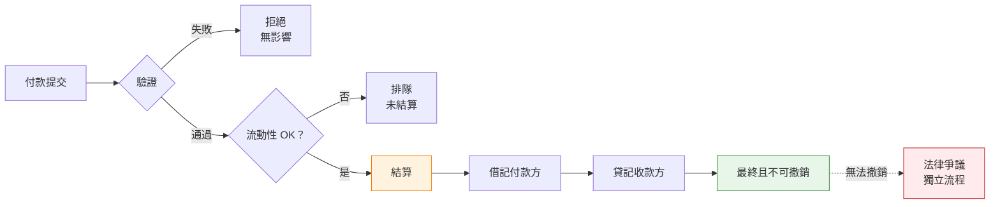

RTGS 以即時、不可撤銷的結算方式，每天處理數兆的高價值支付——再也不必進行日終淨額結算的輪盤賭注。在深入架構和程式碼之前，你需要了解驅動每個設計決策的金融概念。以下是金融優先的分解：流動性需求、最終性保證、為何 Herstatt 風險終結了淨額結算，以及中央銀行如何防止系統性僵局。

## 1 流動性

此處的流動性是指：在你的中央銀行結算帳戶中，擁有足夠的可用資金（或信用額度），以在每筆付出款項進入系統時，全額覆蓋其總額。沒有淨額結算，不必等到日終——每筆轉帳在結算的當下都需要 1:1 的資金支持。

**為何 RTGS 比起舊式的批次/淨額結算時代更消耗流動性**

在遞延淨額結算（RTGS 之前的地獄模式）中，你只需要在日終時為淨差額融資——付出 1 億美元，收到 9500 萬美元，只需結算 500 萬美元的差額。對現金超級有效；銀行可以整天循環使用相同的美元。

RTGS 則說不行：總額結算、即時、不可撤銷。那 1 億美元的付出款項在離開你的帳戶之前必須全額覆蓋——還沒有抵消的流入資金。因此，如果你的付款不規則或時間分佈不均（外匯、證券結算或大型企業匯款的典型情況），你會迅速消耗準備金。銀行最終需要更多的日內流動性，以避免排隊、拒絕或系統性僵局（所有人都等待流入資金來支付流出款項，導致一切停擺）。

**流動性實際上從何而來？**

* **自有準備金** — 存放在中央銀行帳戶的現金（成本最低，但機會成本高——無法借出或投資到其他地方）。
* **流入款項** — 「免費」的流動性：從其他銀行到帳的資金，可以立即重複使用。
* **日內信用/透支** — 中央銀行通常提供此服務（通常需要擔保品，有時在限額內免費，有時計息）。想像成緊急信用貸款，但提交擔保品會凍結資產。
* **貨幣市場借貸** — 日內向其他銀行借款，但這只是重新分配，不是新的流動性。
* **流動性節省機制 (LSM)** — 現代 RTGS 中的高級覆蓋層（例如 TARGET2、CHAPS 等）：將付款排隊、匹配抵消的款項、以最少/無需資金結算捆綁款項。節省大量流動性，同時不重新引入信用風險——基本上是 RTGS 版本的批次處理，但仍保持即時性。

**資金和營運團隊的日常磨練**

你最終會痴迷於：

* **日內流動性預測** — 預測高峰，設定低餘額警報。
* **排隊管理** — 優先處理緊急付款，避免死結。
* **擔保品優化** — 不要過度提交；在可能的情況下釋放資產。
* **周轉率** — 你使用流動性的效率如何？（每單位持有流動性所結算的高價值付款數量——中央銀行密切關注此指標。）

結論：RTGS 用舊式的結算風險噩夢換取了流動性風險和營運強度。整體而言更安全（沒有 Herstatt 風格的意外），但它迫使銀行整天高強度運作——更多監控、更智慧的排隊、持續的流動性雜耍。這就是為何許多 RTGS 升級專注於 LSM 和更好的日內工具：讓系統不那么渴求流動性，同時不失去最終性。

### DNS 與 RTGS：流動性權衡

**DNS（遞延淨額結算 / 淨額結算）：**

流動性**低且集中在日終**。銀行整天累積付款指令，但只有淨額部位進行結算（例如：付出 1 億美元，收到 9500 萬美元 → 在日終或次日早晨只需結算 500 萬美元的差額）。這通過多邊淨額結算消除了大量義務，因此參與者前期需要的實際現金/中央銀行餘額少得多。對流動性超級有效——銀行在日內多次循環使用相同的資金，直到批次結算前不必移動真實資金。

**問題在於：** 你在白天累積信用/結算風險（Herstatt 風格的曝險），如果有人在結算時無法覆蓋其淨借記，可能會引發撤銷或系統性問題。

**RTGS（即時總額結算）：**

流動性**高、日內、且為總額**。每筆付款個別、全額（總額）、即時（或近即時）地在中央銀行帳簿上結算——沒有淨額抵消。如果你付出 1 億美元，你當下就需要 1 億美元的覆蓋（來自你的餘額、流入資金或日內信用/透支）。不必等待日終淨額結算來減少帳單。這意味著：

* **整體流動性需求更高** — 在高峰流量時，通常比 DNS 多 5-20 倍，取決於付款模式（在流入資金到達前的不規則流出）。
* **日內強度** — 高峰和低谷非常重要。你在大量流出期間消耗準備金，然後循環使用流入款項。不匹配會導致排隊/系統性僵局。
* **積極的即時管理** — 資金/營運團隊進行預測、每幾分鐘監控餘額、優先處理排隊、為透支提交擔保品，或使用流動性節省機制 (LSM) 來抵消排隊付款，而無需全額總額融資。

**數據顯示：**

根據中央銀行報告和研究（國際清算銀行、美聯儲等），RTGS 通常需要**遠多於**DNS 的流動性，因為沒有多邊淨額結算的好處來抵消不平衡。銀行最終持有更多準備金、日內借貸（成本高昂），或依賴 LSM/排隊工具來擠出效率（例如 TARGET2 或 CHAPS 等系統通過抵消捆綁節省 20-50%）。

| 面向 | DNS（遞延淨額結算） | RTGS（即時總額結算） |
|--------|-------------------------------|-----------------------------------|
| **流動性何時重要** | 日終批次結算 | 每毫秒，整天 |
| **需要多少** | 僅淨額部位（例如 500 萬美元） | 全額總額（例如 2.7 億美元） |
| **風險概況** | 信用風險在白天累積 | 無信用風險，但有流動性風險 |
| **管理風格** | 批次關注，夜間壓力 | 持續、即時監控 |
| **資金循環** | 高（相同美元重複使用） | 有限（必須在付出前融資） |

| DNS 世界 | RTGS 世界 |
|-----------|------------|
| 流動性主要是日終批次關注 | 流動性是持續的即時戰鬥 |
| 監控淨額部位，確保凌晨 2 點有覆蓋 | 儀表板閃爍著排隊深度、餘額警報 |
| 夜間壓力，但白天營運在現金方面較輕鬆 | 上午 10 點一筆大型企業匯款而無匹配的流入？排隊激增，潛在系統性僵局 |
| 簡單預測 | 痴迷於周轉率、LSM 觸發器、預測工具 |

!!!question "關鍵要點"
    DNS 在流動性上便宜但過夜有風險；RTGS 在流動性上昂貴（前期投入、持續高強度）但即時無風險。這就是為何現代 RTGS 核心內建這麼多流動性技巧（LSM、日內信用額度、排隊優化器）——在不重新引入信用風險的情況下，挽回一些淨額結算效率。

---

## 2 最終性

**「完成即完成」的保證**

一旦付款在 RTGS 中結算，就是**最終的**。中央銀行帳簿上的原子借記/貸記。不可撤銷。無條件。無撤銷。無追回。沒有「哎呀，交易對手後來倒閉了」。資金可立即由收款方使用（下游到客戶帳戶而無風險）。

這打破了舊式淨額結算世界的撤銷噩夢。在淨額結算系統中，日終結算意味著付款在最終淨額部位計算和資金轉帳之前是暫定的。RTGS 完全消除了這種不確定性。

**最終性在實務中的意義：**

| 面向 | 意義 | 業務影響 |
|--------|---------------|-----------------|
| **不可撤銷** | 無法由付款方、收款方或中央銀行撤銷 | 收款方確定性 |
| **無條件** | 不依賴任何其他事件或條件 | 無「受限於」條款 |
| **即時** | 收款方可立即使用資金 | 無浮動期 |
| **絕對** | 法律最終性，不僅是系統確認 | 法院承認結算 |

**為何這對市場參與者很重要：**

你會看到最終性體現在：

- **SLA** — 結算 = 最終，提交後無「待定」狀態
- **錯誤處理** — 拒絕僅發生在*結算前*；結算後錯誤通過單獨的爭議流程處理
- **無暫定貸記** — 與消費者銀行不同，沒有「我們已貸記你的帳戶但保留撤銷權利」
- **下游處理** — 收款方可立即借出、投資或轉送資金而無風險



**法律基礎：**

最終性不僅是技術屬性——它已寫入法律。大多數司法管轄區都有**支付系統最終性立法**，保護 RTGS 結算免受：

- 破產凍結（受託人無法追回已結算付款）
- 法院禁令（除非非凡的詐欺案件）
- 監管干預（中央銀行不會撤銷，除非系統性緊急情況）

這種法律支持使 RTGS 成為金融穩定的支柱。當銀行收到 RTGS 付款時，它知道那筆錢是**他們的**，就這樣。他們可以借出、投資、轉送到其他地方。沒有被追回的風險。

---

## 3 結算風險（Herstatt 風險 / 本金風險）

**結算風險**是一個更廣泛的術語，指金融交易中一方交付了其側（例如支付現金或證券），但由於違約、破產、營運失敗或結算窗口期間的時間問題，未能從交易對手收到相應價值的危險。

它被暱稱為**Herstatt 風險**，具體是因為 1974 年著名的 Bankhaus I.D. Herstatt 倒閉事件，這是一家位於科隆的中型德國私人銀行。1974 年 6 月 26 日，德國監管機構撤銷了其執照，並在下午中段（當地時間下午 3:30-4:30 左右）將其關閉，此前發現巨大的外匯損失已多次抹去其資本。

**該事件為何變得傳奇：**

* Herstatt 積極參與外匯即期交易，尤其是 USD/DM 貨幣對。
* 許多交易對手（主要是國際銀行）在歐洲營業時間內已不可撤銷地將德國馬克支付到 Herstatt 在法蘭克福的帳戶（他們的一側已結算）。
* 但相應的美國美元稍後才到期，在紐約市場開市後（時區差距：歐洲收市時紐約剛開始）。
* 當監管機構切斷電源時，Herstatt 無法（也沒有）進行這些美元付款。交易對手們被迫承擔交易的的全部本金金額（以今天的術語來說數億美元），除了在破產程序中無擔保索賠外，別無追索權。
* 這引發了立即的混亂：銀行凍結付款，流動性乾涸，紐約代理銀行暫停與 Herstatt 相關的流量，紐約的多邊淨額結算系統在接下來幾天內總額轉帳下降了約 60%。這是對系統脆弱性的警鐘。

**「Herstatt 風險」一詞作為簡寫的含义：**

這種確切的情境——尤其在外匯結算中——其中一種貨幣結算但另一種貨幣由於在非重疊結算窗口內的交易對手失敗而未結算。它突出了跨時區非同時結算的危險，並直接導致：

* 成立**巴塞爾銀行監管委員會**（1974 年末，總部設在國際清算銀行）。
* 推動全球建立**即時總額結算 (RTGS)** 系統。
* 後來的創新，如**CLS 銀行**（2002 年推出），用於外匯的 PvP（付款對付款）以消除差距。

它也常被稱為**本金風險**（或本金結算風險），因為曝險的是交易的全部本金金額——不僅是重置成本或按市價計價的損失（如預結算風險）。在失敗的結算中，你可能會損失你付出的全部名義價值（本金），而不僅僅是價格變動的損益。尤其在外匯中，如果曝險很大，這可能使銀行的資本相形見絀——因此 BIS/CPSS/BCBS 指南中強調「本金」（例如，他們 2013 年關於管理外匯結算風險壓力的監管規則，強調通過 PvP 盡可能減少本金風險）。

| 術語 | 意義 |
|------|---------|
| **結算風險** | 交付對未交付風險的通用術語 |
| **Herstatt 風險** | 1974 年著名的外匯特定案例 → 成為暱稱 |
| **本金風險** | 強調涉及的全部本金曝險（相對於僅重置成本） |

在如今的 RTGS 情境中（國內高價值付款），真正的 Herstatt/本金風險已基本消除，因為結算是總額、即時且在中央銀行資金上最終的——沒有等待窗口或淨額結算賭注。但該術語在跨境/外匯中仍然存在，時區和遺留系統仍可能創造差距。

---

**RTGS 旨在消除的噩夢**

1974 年的災難不僅僅是一次性損失——它暴露了全球金融系統處理結算的根本缺陷。在 RTGS 之前，整個支付基礎設施運作於信任和時間之上：銀行整天發送付款指令，但**直到日終沒有任何實際結算**。清算所會將一切淨額化，銀行交換差額。

這為 Herstatt 風格的災難創造了完美條件：

尤其在外匯和跨境交易中，**時區差距**使 RTGS 之前的情況變得殘酷：

```
經典 Herstatt 災難 (1974)：

09:00 中歐時間 — A 銀行（德國）欠 B 銀行（美國）1 億美元
10:00 中歐時間 — B 銀行欠 A 銀行 2 億德國馬克（通過獨立系統）
14:00 中歐時間 — A 銀行從 B 銀行收到 1 億美元（通過美國系統，美國仍是早晨）
15:30 中歐時間 — 德國監管機構關閉 A 銀行（資不抵債）
17:00 中歐時間 — B 銀行本應從 A 銀行收到 2 億德國馬克
結果：B 銀行損失 2 億德國馬克。A 銀行的債權人保留 1 億美元。

發生是因為結算不同時。
一方支付了。另一方在支付回來之前失敗了。
```

Bankhaus Herstatt 的失敗不僅讓交易對手損失數億美元——它幾乎凍結了整個外匯市場。銀行意識到，如果結算發生在不同時區且沒有協調，他們無法安全地交易貨幣。

**RTGS 如何消除結算風險（國內/同貨幣）：**

具有**即時最終性**的 RTGS 意味著：
- 付款**現在**結算，而不是「日終前」
- 收款方立即知道資金是**他們的**
- 沒有你已支付但尚未收到的曝險窗口

**防止風險累積的 RTGS 設計特徵：**

| 特徵 | 如何防止風險 | 金融影響 |
|---------|---------------------|------------------|
| **排隊** | 如果沒有覆蓋，付款等待 | 未經授權無透支 |
| **驗證** | 結算前拒絕無效/資金不足的付款 | 防止失敗的結算 |
| **原子結算** | 借記和貸記同時發生 | 無部分結算風險 |
| **即時監控** | 排隊深度、吞吐量警報 | 壓力早期預警 |

**結算風險仍然存在的地方：**

RTGS 消除了**國內、同貨幣**付款的這種風險。但跨境呢？仍然是問題：

- **時區差距** — 美國在美國時間結算，歐盟在歐盟時間
- **貨幣不匹配** — 美元端在 Fedwire 結算，歐元端在 TARGET2 結算
- **法律管轄問題** — 不同國家，不同的最終性法律

**解決方案覆蓋層：**

| 機制 | 如何運作 | 範例 |
|-----------|--------------|---------|
| **CLS（連續連結結算）** | 多邊淨額結算與外匯 PvP | 同時結算 17 種貨幣 |
| **PvP（付款對付款）** | 兩種貨幣端的原子結算 | 兩筆付款都發生或都不發生 |
| **連結結算系統** | 跨 RTGS 系統的協調時間 | 香港 CHATS 與大陸 CNAPS 連結 |

**金融教訓：**

結算風險本質上是關於**交易對手曝險**。在 RTGS 之前，銀行面臨：

```
信用曝險時間線（淨額結算系統）：

09:00 — 我支付你 1 億美元（我現在有曝險）
12:00 — 你本應支付我 9500 萬美元
14:00 — 你破產了
結果：我損失 1 億美元，將在破產中收回零頭

信用曝險時間線（RTGS）：

09:00 — 我支付你 1 億美元（已結算，最終）
09:01 — 你支付我 9500 萬美元（已結算，最終）
14:00 — 你破產了
結果：無曝險。兩筆付款在失敗前完成。
```

這就是為何現代 RTGS 核心設計有**原子結算邏輯**——除非存在覆蓋且保證counter-結算，否則沒有付款會執行。

---

## 4 系統性僵局（系統範圍死結）

**分散式系統死結的 RTGS 版本**

系統性僵局是當付款排隊因為付款方缺乏流動性，但**所有人都在等待流入資金而這些資金本身也被困住**時發生的情況。連鎖反應。排隊膨脹。吞吐量驟降。即使系統總流動性沒問題，它都在錯誤的時間在錯誤的地方。

想像一個交通路口，每個方向都在等待其他方向移動：

```
系統性僵局情境：

A 銀行 → B 銀行：5000 萬美元（排隊，A 等待流入）
B 銀行 → C 銀行：4000 萬美元（排隊，B 等待流入）
C 銀行 → A 銀行：4500 萬美元（排隊，C 等待流入）

系統總流動性：存在 1.35 億美元
但：三筆付款都被困住
為何：每家銀行都在等待本身被排隊的資金

這是一個循環。A → B → C → A。經典死結。
```

**導致系統性僵局的原因：**

| 原因 | 描述 | 市場影響 |
|-------|-------------|---------------|
| **付款時間不佳** | 大型付款聚集在一起 | 早晨高峰，午餐低谷 |
| **集中** | 少數銀行主導付款流 | 系統重要性增加 |
| **無協調** | 銀行不同步流出/流入 | 所有人囤積流動性 |
| **FIFO 剛性** | 排隊中的第一筆付款阻塞後面的 | 小型付款被困在大型後面 |

**現實世界的系統性僵局事件：**

歷史顯示系統性僵局多麼快速地級聯：

- **1985 年，Fedwire** — 軟體故障導致排隊累積，超過 100 億美元延遲
- **2001 年，9 月 11 日** — 營運中斷導致大規模排隊，美聯儲注入前所未有的流動性
- **2008 年，雷曼兄弟** — 交易對手不確定性導致銀行囤積流動性，系統性僵局風險飆升

中央銀行現在將系統性僵局視為**系統性風險**——不僅是營運不便。

**中央銀行如何對抗系統性僵局：**

現代 RTGS 系統部署複雜的**僵局解決算法**：

**1. 流動性節省機制 (LSM)：**
- **雙邊抵消** — 匹配兩筆抵消的排隊付款
- **多邊抵消** — 淨額化循環中的多筆付款
- **排隊優化** — 重新排序以更好地循環

```
範例：多邊偏移檢測

排隊付款：
A → B: 5000 萬美元
B → C: 4000 萬美元
C → A: 4500 萬美元

循環檢測找到：A → B → C → A
以最少流動性結算：
- A 需要：500 萬美元淨額（而非 5000 萬美元總額）
- B 需要：0 美元（完全抵消）
- C 需要：0 美元（完全抵消）

系統僅用 500 萬美元而非 1.35 億美元結算循環
```

**2. 排隊管理功能：**
- **優先級重新排序** — 緊急付款跳過排隊
- **繞過 FIFO** — 跳過被阻塞的付款，結算後面的
- **部分結算** — 結算你能結算的，排隊其餘的

**3. 中央銀行干預：**
- **流動性注入** — 臨時日內信用擴張
- **排隊重組** — 營運商啟動的抵消
- **系統範圍警報** — 協調銀行行為

**監控與早期預警：**

你的煤礦金絲雀：
- **排隊深度** — 突然激增 = 潛在系統性僵局
- **系統吞吐量** — 下降 = 付款被困
- **結算延遲** — 增加 = 流動性短缺
- **周轉率** — 下降 = 流動性囤積

Bech-Soramäki 風格的**循環檢測算法**在 TARGET2 和 CHAPS 等核心中仍然常見。這些是**高性能匹配引擎**——複雜、對延遲敏感，也是現代 RTGS 感覺不那么蠻力的重要原因。

---

## 5 日內信用 / 透支

**中央銀行提供的緩衝**

日內信用是中央銀行提供的緊急信用貸款，以便銀行在流出在流入之前激增時不會停止。將它想像成**擔保透支額度**，定價和上限旨在阻止濫用。

**為何它存在：**

即使是資本充足的銀行也有**時間不匹配**：

```
典型日內流動性模式：

08:00 — 開戶餘額：1 億美元
09:00 — 大型企業稅款支付：-8000 萬美元（餘額：2000 萬美元）
10:00 — 證券結算：-5000 萬美元（餘額：-3000 萬美元 ← 透支！）
11:00 — 流入 RTGS 付款：+6000 萬美元（餘額：3000 萬美元）
14:00 — 更多流入：+4000 萬美元（餘額：7000 萬美元）
17:00 — 收盤：7000 萬美元（償還透支 + 利息）

無日內信用：10:00 的付款將排隊或失敗
有日內信用：系統繼續順利運行
```

**日內信用類型：**

| 類型 | 描述 | 範例系統 |
|------|-------------|-----------------|
| **擔保透支** | 提交資產，獲得信用額度 | Fedwire, TARGET2 |
| **計息信用** | 使用時收取利息 | 歐洲央行，英格蘭銀行 |
| **免費額度** | 有限金額，不收費 | 一些亞洲系統 |
| **無日內信用** | 必須有資金或排隊 | 一些新興市場 |

**擔保品管理：**

信用額度不是免費的——銀行必須提交擔保品：

| 擔保品類型 | 折扣率 | 流動性 |
|-----------------|---------|-----------|
| **政府債券** | 0-2% | 高 |
| **機構證券** | 3-5% | 中 |
| **公司債券** | 5-15% | 較低 |
| **股票** | 15-30% | 逐案處理 |

折扣率保護中央銀行，如果銀行失敗且擔保品必須清算。

**定價機制：**

中央銀行平衡兩個目標：
1. **提供足夠信用**以防止系統性僵局
2. **定價足夠高**以阻止濫用

| 定價模型 | 行為激勵 |
|---------------|-------------------|
| **免費至限額** | 使用全部額度 |
| **固定利率** | 最小化使用持續時間 |
| **分層定價** | 保持在較低層級內 |
| **懲罰性利率** | 完全避免透支 |

**日終要求：**

大多數系統要求**收盤時零透支**：

```
日終掃描流程：

17:00 — 系統關閉客戶付款
17:30 — 銀行審查部位
18:00 — 自動掃描：借入/借出以清零
18:30 — 最終結算
19:00 — 系統關閉，所有帳戶平衡
```

負餘額的銀行必須從以下借入：
- 其他銀行（銀行間市場）
- 中央銀行常設設施（懲罰性利率）

正餘額的銀行可以：
- 借給其他銀行
- 存入中央銀行（報酬利率）

---

## 6 流動性節省機制 (LSM)

**在不失去最終性的情況下減少流動性渴求的覆蓋層**

LSM 是聰明的算法，讓現代 RTGS 感覺不像「蠻力總額結算」而更像「智慧即時結算」。它們減少流動性需求，同時不重新引入信用風險。

**演進：**

早期 RTGS 系統（1980-1990 年代）是純總額結算——每筆付款，全額，無技巧。銀行抱怨流動性成本。現代系統（2000 年代+）添加 LSM 以減少負擔。

**核心 LSM 技術：**

| 機制 | 如何運作 | 流動性節省 |
|-----------|--------------|-------------------|
| **雙邊抵消** | 淨額化兩筆抵消的排隊付款 | 減少 40-60% |
| **多邊抵消** | 淨額化循環中的多筆付款 | 減少 60-80% |
| **排隊優化** | 重新排序付款以更好地流動 | 改進 20-30% |
| **PvP/DvP 同步** | 原子連結結算 | 消除失敗風險 |

**Bech-Soramäki 循環檢測：**

以形式化該算法的研究人員命名。在 TARGET2 和 CHAPS 等核心中仍然常見。該算法：

1. 掃描排隊中的付款循環（A→B→C→A）
2. 計算結算循環所需的最小流動性
3. 以該最小值原子地結算整個循環

```
LSM 之前：
A → B: 1 億美元（排隊，A 有 6000 萬美元）
B → C: 8000 萬美元（排隊，B 有 5000 萬美元）
C → A: 9000 萬美元（排隊，C 有 4000 萬美元）

總需求：2.7 億美元
總可用：1.5 億美元
結果：系統性僵局

LSM 循環檢測之後：
淨額部位：
- A: -1000 萬美元（支付 1 億，收到 9000 萬）
- B: +2000 萬美元（收到 1 億，支付 8000 萬）
- C: -1000 萬美元（支付 8000 萬，收到 9000 萬）

循環以約 1000 萬美元額外流動性結算
系統解鎖 2.6 億美元付款
```

**LSM 運行時機：**

| 觸發類型 | 描述 | 範例 |
|--------------|-------------|---------|
| **連續** | 每筆付款到達時運行 | 即時優化 |
| **定期** | 在固定間隔運行 | 每 5-10 分鐘 |
| **事件驅動** | 在排隊深度閾值時運行 | 檢測到系統性僵局時 |
| **手動** | 營運商啟動 | 壓力事件期間 |

**權衡：**

LSM 不是免費的——有成本：

| 好處 | 成本 |
|---------|------|
| 更低的流動性需求 | 算法複雜性 |
| 更快的結算 | 計算延遲 |
| 減少的系統性僵局 | 營運風險 |
| 更好的吞吐量 | 透明度問題 |

!!!tip "為何重要"
    這就是為何 RTGS 供應商（如 SWIFT、Euroclear、中央銀行自訂建構）大力投資 LSM 優化——這是系統停擺與系統順暢運行之間的差異。

---

## 7 排隊安排（及透明度）

**當覆蓋缺失時付款的去處**

當銀行沒有足夠的流動性來結算付款時，它不會立即失敗——而是**排隊**。但何處和如何排隊至關重要。

**排隊類型：**

| 類型 | 描述 | 優點 | 缺點 |
|------|-------------|------|------|
| **中央/系統排隊** | 由 RTGS 核心本身持有 | 對所有人可見，公平排序 | 單一爭點 |
| **內部排隊** | 銀行在向 RTGS 提交前的自己的排隊 | 銀行控制優先級 | 對系統較不透明 |

大多數現代系統使用**混合方法**——銀行管理內部排隊，然後在準備好時提交到中央排隊。

**排隊紀律：**

預設是**FIFO**（先進先出），但現代系統增加靈活性：

```
帶有優先級的排隊：

位置 1: 付款 A（5000 萬美元，優先級：正常）    ← 先到達
位置 2: 付款 B（1000 萬美元，優先級：緊急）    ← 跳過前面！
位置 3: 付款 C（3000 萬美元，優先級：正常）
位置 4: 付款 D（2000 萬美元，優先級：繞過）    ← 繞過被阻塞的付款

無優先級/繞過：A 阻塞後面的一切
有優先級：即使 A 被困，B 和 D 也可以結算
```

**優先級級別：**

| 優先級 | 使用案例 | 結算順序 |
|----------|----------|------------------|
| **關鍵** | 市場基礎設施，中央銀行營運 | 第一 |
| **緊急** | 時間敏感的客戶付款 | 在正常之前 |
| **正常** | 標準付款 | 類別內 FIFO |
| **遞延** | 可以等待，低優先級 | 最後 |

**透明度很重要：**

一些系統顯示**流入排隊付款**（幫助預測流入流動性）；其他系統隱藏它。

| 透明度級別 | 銀行看到什麼 | 影響 |
|--------------------|----------------|--------|
| **完全透明度** | 所有流入排隊付款可見 | 更好的預測，更多信心 |
| **部分透明度** | 僅自己的排隊付款可見 | 有限的可見性 |
| **無透明度** | 銀行看不到排隊狀態 | 保守行為，更多流動性囤積 |

**為何透明度重要：**

想像你是銀行資金經理：

```
情境 A（無透明度）：
- 你的付出付款：5000 萬美元（排隊）
- 你的餘額：3000 萬美元
- 你不知道什麼會進來
- 決策：囤積流動性，「以防萬一」借入

情境 B（完全透明度）：
- 你的付出付款：5000 萬美元（排隊）
- 你的餘額：3000 萬美元
- 你看到流入：4000 萬美元來自 X 銀行（排隊）
- 決策：等待 10 分鐘，付款將結算
```

透明度減少**預防性流動性需求**——銀行減少持有「以防萬一」。

**不良排隊 = 真實問題：**

| 症狀 | 業務影響 | 市場信號 |
|---------|-----------------|---------------|
| 延遲付款 | 客戶投訴，SLA 違約 | 排隊深度增加 |
| 更高的借貸成本 | 銀行「以防萬一」過度借入 | 日內信用使用激增 |
| 系統性僵局傳播 | 系統範圍減慢 | 吞吐量下降 |

**銀行的最佳實踐：**

1. **積極排隊管理** — 監控、重新排序、按需取消
2. **付款時間** — 全天分散大型付款
3. **流動性緩衝** — 維持足夠以避免頻繁排隊
4. **透明度使用** — 使用流入可見性進行預測

---

## 8 總結

**必記的核心金融概念：**

✅ **流動性** — RTGS 需要每筆付款 1:1 融資，創造日內需求
✅ **最終性** — 一旦結算，付款不可撤銷且無條件
✅ **結算風險** — Herstatt 風險終結了淨額結算；RTGS 通過即時最終性消除它
✅ **系統性僵局** — 來自循環流動性等待的系統範圍死結
✅ **日內信用** — 中央銀行緩衝以平滑時間不匹配
✅ **LSM** — 減少流動性需求而不失去安全性的算法
✅ **排隊** — 付款等待的地方，以及透明度如何影響行為

**RTGS 權衡：**
- **淨額結算系統**：有效但有風險（Herstatt）
- **RTGS**：安全但流動性密集
- **現代 RTGS + LSM**：兩全其美

---

**本文腳註：**

[^1]: **CLS** - 連續連結結算：用於外匯交易的多貨幣現金結算系統，消除結算風險
[^2]: **PvP** - 付款對付款：確保外匯交易兩端同時結算的結算機制
[^3]: **DvP** - 交付對付款：連結證券轉帳與現金付款的結算機制
[^4]: **Bech-Soramäki** - 形式化支付系統循環檢測算法的研究人員
[^5]: **折扣率** - 應用於擔保品價值的折扣，以保護免受市場波動

> **注意：** 如需 RTGS 系列中使用的所有縮寫的完整列表，請參閱 [RTGS 縮寫和簡稱參考](/2025/12/RTGS-Acronyms-and-Abbreviations/)。
