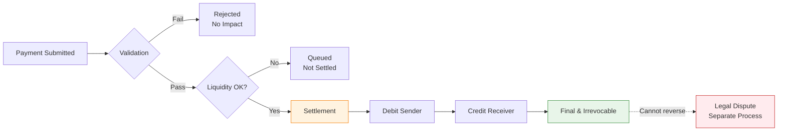

RTGS powers trillions in daily high-value payments with instant, irrevocable settlement—no more end-of-day netting roulette. Before diving into architecture and code, you need to understand the financial concepts that drive every design decision. Here's the finance-first breakdown: liquidity demands, finality guarantees, why Herstatt risk killed netting, and how central banks prevent gridlock.

## 1 Liquidity

Liquidity here means having enough readily available funds (or credit) in your central-bank settlement account right now (intraday) to cover the full gross amount of each outgoing payment as it hits the system. No netting, no waiting till end-of-day—every single transfer needs to be backed 1:1 the moment it settles.

**Why RTGS eats so much liquidity compared to the old batch/netting days**

In deferred netting (pre-RTGS hell), you only needed to fund the net difference at the end—send $100m out, receive $95m back, settle just $5m. Super efficient on cash; banks could recycle the same dollars all day.

RTGS says nope: settle gross, real-time, irrevocable. That $100m outgoing has to be fully covered before it leaves your account—no offsetting incoming flows yet. So if your payments are lumpy or timed unevenly (classic in FX, securities settlement, or just big corporate wires), you burn through reserves fast. Banks end up needing way more intraday liquidity to avoid queues, rejections, or gridlock (where everything stalls because everyone's waiting for incoming funds to pay outgoing).

**Where does the liquidity actually come from?**

* **Own reserves** — Cash sitting in your central-bank account (cheapest but opportunity-cost heavy—can't lend/invest it elsewhere).
* **Incoming payments** — The "free" liquidity: funds landing from other banks that you can immediately reuse.
* **Intraday credit/overdrafts** — Central banks often provide this (usually collateralized, sometimes free up to limits, sometimes priced). Think of it as an emergency line, but posting collateral ties up assets.
* **Money-market borrowing** — Borrow from other banks intraday, but that's redistribution, not new liquidity.
* **Liquidity-saving mechanisms (LSMs)** — Fancy overlays in modern RTGS (e.g., in TARGET2, CHAPS, many others): queue payments, match offsetting ones, settle bundles with minimal/no funds. Saves tons of liquidity without reintroducing credit risk—basically the RTGS version of batching but still real-time-ish.

**The daily grind for treasury and ops teams**

You end up obsessing over:

* **Intraday liquidity forecasting** — Predict peaks, set alerts for low balances.
* **Queue management** — Prioritize urgent payments, avoid deadlocks.
* **Collateral optimization** — Don't over-post; free up assets where possible.
* **Turnover ratios** — How efficiently are you using liquidity? (High-value payments settled per unit of liquidity held—central banks watch this closely.)

Bottom line: RTGS trades the old settlement risk nightmare for liquidity risk and operational intensity. It's safer overall (no Herstatt-style surprises), but it forces banks to run hot all day—more monitoring, smarter queuing, constant liquidity juggling. That's why so many RTGS upgrades focus on LSMs and better intraday tools: make the system less thirsty without losing finality.

### DNS vs. RTGS: The Liquidity Trade-Off

**DNS (Deferred Net Settlement / Netting):**

Liquidity is **low and end-of-day focused**. Banks accumulate payment instructions all day, but only the net position settles (e.g., send $100m out, receive $95m back → settle just $5m difference at close or next morning). This nets out a ton of obligations multilaterally, so participants need far less actual cash/central-bank balances upfront. It's super efficient on liquidity—banks recycle the same funds multiple times intraday without moving real money until the batch.

**The catch:** you build up credit/settlement risk during the day (Herstatt-style exposure), and if someone can't cover their net debit at settlement time, unwinds or systemic issues can hit.

**RTGS (Real-Time Gross Settlement):**

Liquidity is **high, intraday, and gross**. Every single payment settles individually, in full (gross amount), instantly (or near-instantly) on central-bank books—no netting offsets. If you send $100m, you need $100m cover right then (from your balance, incoming funds, or intraday credit/overdraft). No waiting for end-of-day netting to reduce the bill. This means:

* **Higher overall liquidity needs** — often 5–20x more than DNS in peak flows, depending on payment patterns (lumpy outflows before inflows arrive).
* **Intraday intensity** — Peaks and troughs matter a lot. You burn through reserves during heavy outflow periods, then recycle incoming payments. Mismatches cause queues/gridlock.
* **Active, real-time management** — Treasury/ops teams forecast, monitor balances every few minutes, prioritize queues, pledge collateral for overdrafts, or use liquidity-saving mechanisms (LSMs) to offset queued payments without full gross funding.

**What the Data Says:**

From central-bank reports and studies (BIS, Fed, etc.), RTGS generally requires **substantially more liquidity** than DNS because there's no multilateral netting benefit to offset imbalances. Banks end up holding more reserves, borrowing intraday (costly), or relying on LSMs/queuing tools to squeeze efficiency back up (e.g., 20–50% savings in systems like TARGET2 or CHAPS via offsetting bundles).

| Aspect | DNS (Deferred Net Settlement) | RTGS (Real-Time Gross Settlement) |
|--------|-------------------------------|-----------------------------------|
| **When liquidity matters** | End-of-day batch settlement | Every millisecond, all day |
| **How much you need** | Net position only (e.g., $5M) | Full gross amounts (e.g., $270M) |
| **Risk profile** | Credit risk builds during day | No credit risk, but liquidity risk |
| **Management style** | Batch concern, nightly stress | Constant, live monitoring |
| **Fund recycling** | High (same dollars reused) | Limited (must fund before send) |

| DNS World | RTGS World |
|-----------|------------|
| Liquidity is mostly an end-of-day batch concern | Liquidity is a constant, live battle |
| Monitor net positions, ensure coverage at 2 a.m. | Dashboards blinking with queue depths, balance alerts |
| Nightly stress, but daytime ops are chill on cash | One big corporate wire at 10 a.m. without matching inflows? Queue spikes, potential gridlock |
| Simple forecasting | Obsess over turnover ratios, LSM triggers, forecasting tools |

!!!question "Key Takeaway"
    DNS is cheap on liquidity but risky overnight; RTGS is expensive on liquidity (front-loaded, always-hot) but risk-free in real time. That's why modern RTGS cores pack so many liquidity tricks (LSMs, intraday credit facilities, queue optimizers)—to claw back some of that netting efficiency without reintroducing credit risk.

---

## 2 Finality

**The "Done Is Done" Guarantee**

Once a payment settles in RTGS, it's **final**. Atomic debit/credit on central-bank books. Irrevocable. Unconditional. No reversals. No clawbacks. No "oops, counterparty failed later." The funds are immediately usable by the receiver (downstream to customer accounts without risk).

This breaks the old netting world's unwind nightmares. In netting systems, end-of-day settlement meant payments were provisional until the final net position was calculated and funds transferred. RTGS eliminates this uncertainty entirely.

**What Finality Means in Practice:**

| Aspect | What It Means | Business Impact |
|--------|---------------|-----------------|
| **Irrevocable** | Cannot be reversed by sender, receiver, or central bank | Receiver has certainty |
| **Unconditional** | Not dependent on any other event or condition | No "subject to" clauses |
| **Immediate** | Funds usable instantly by receiver | No float period |
| **Absolute** | Legal finality, not just system confirmation | Courts recognize settlement |

**Why This Matters for Market Participants:**

You'll see finality reflected in:

- **SLAs** — Settlement = final, no "pending" state after commit
- **Error handling** — Rejects happen *pre-settlement* only; post-settlement errors are handled via separate dispute processes
- **No provisional credits** — Unlike consumer banking, there's no "we've credited your account but reserve the right to reverse it"
- **Downstream processing** — Receiver can immediately lend, invest, or retransmit funds without risk



**The Legal Foundation:**

Finality isn't just a technical property—it's enshrined in law. Most jurisdictions have **payment system finality legislation** that protects RTGS settlements from:

- Bankruptcy stays (trustee can't claw back settled payments)
- Court injunctions (except in extraordinary fraud cases)
- Regulatory intervention (central bank won't reverse except for systemic emergencies)

This legal backing is what makes RTGS the backbone of financial stability. When a bank receives an RTGS payment, it knows that money is **theirs**, full stop. They can lend it, invest it, send it elsewhere. No risk that it'll be clawed back.

---

## 3 Settlement Risk (Herstatt Risk / Principal Risk)

**Settlement risk** is the broader term for the danger that one party in a financial transaction delivers its side (e.g., pays cash or securities) but doesn't receive the corresponding value from the counterparty—due to default, insolvency, operational failure, or timing issues during the settlement window.

It gets nicknamed **Herstatt Risk** specifically because of the infamous 1974 collapse of Bankhaus I.D. Herstatt, a mid-sized German private bank in Cologne. On June 26, 1974, German regulators revoked its license and shut it down mid-afternoon (around 3:30–4:30 p.m. local time) after discovering massive foreign-exchange losses that had wiped out its capital many times over.

**Here's Why That Event Became Legendary:**

* Herstatt was heavily active in FX spot trading, especially USD/DM pairs.
* Many counterparties (mostly international banks) had already irrevocably paid Deutsche Marks to Herstatt's account in Frankfurt during European business hours (their side settled).
* But the corresponding US dollars were due later, after New York markets opened (time-zone gap: Europe closes while NY is just starting).
* When regulators pulled the plug, Herstatt couldn't (and didn't) make those USD payments. Counterparties were left holding the bag—out the full principal amount of the trades (hundreds of millions in today's terms), with no recourse except an unsecured claim in insolvency proceedings.
* This triggered immediate chaos: banks froze payments, liquidity dried up, NY correspondent banks suspended Herstatt-related flows, and the multilateral netting system in New York saw gross transfers drop ~60% over the next few days. It was a wake-up call on systemic fragility.

**The Term "Herstatt Risk" Stuck As Shorthand For:**

This exact scenario—especially in foreign exchange settlement—where one currency settles but the other doesn't due to a counterparty failure in the non-overlapping settlement window. It highlighted the perils of non-simultaneous settlement across time zones and led directly to:

* Creation of the **Basel Committee on Banking Supervision** (in late 1974, headquartered at BIS).
* Push for **real-time gross settlement (RTGS)** systems worldwide.
* Later innovations like **CLS Bank** (launched 2002) for PvP (Payment-versus-Payment) in FX to eliminate the gap.

It's also commonly called **Principal Risk** (or principal-settlement risk) because the exposure is to the full principal amount of the transaction—not just replacement cost or mark-to-market loss (like in pre-settlement risk). In a failed settlement, you could lose the entire notional value you paid out (principal), not merely the profit/loss from price moves. In FX especially, this can dwarf a bank's capital if exposures are large—hence the "principal" emphasis in BIS/CPSS/BCBS guidance (e.g., their 2013 supervisory rules on managing FX settlement risk stress reducing principal risk via PvP where possible).

| Term | Meaning |
|------|---------|
| **Settlement risk** | General term for delivery-vs-non-delivery risk |
| **Herstatt risk** | Famous FX-specific example from 1974 → became the nickname |
| **Principal risk** | Emphasizes the full principal exposure at stake (vs. just replacement cost) |

In RTGS contexts today (domestic high-value payments), true Herstatt/principal risk is largely eliminated because settlements are gross, real-time, and final on central-bank money—no waiting windows or netting gambles. But the term lives on for cross-border/FX, where time zones and legacy systems can still create gaps.

---

**The Nightmare RTGS Was Built to Kill**

That 1974 disaster wasn't just a one-off loss—it exposed a fundamental flaw in how the global financial system handled settlement. Before RTGS, the entire payment infrastructure operated on trust and timing: banks would send payment instructions throughout the day, but **nothing actually settled until end-of-day**. The clearing house would net everything out, and banks would exchange the differences.

This created the perfect conditions for Herstatt-style disasters:

In FX and cross-border trades especially, **time-zone gaps** made this brutal pre-RTGS:

```
The Classic Herstatt Disaster (1974):

09:00 CET — Bank A (Germany) owes Bank B (USA) $100M USD
10:00 CET — Bank B owes Bank A DM 200M (via separate system)
14:00 CET — Bank A receives $100M from Bank B (via US system, still morning in US)
15:30 CET — German regulators shut down Bank A (insolvent)
17:00 CET — Bank B was supposed to receive DM 200M from Bank A
Result: Bank B lost DM 200M. Bank A's creditors keep the $100M.

This happened because settlement wasn't simultaneous.
One side paid. The other side failed before paying back.
```

Bankhaus Herstatt's failure didn't just cost counterparties hundreds of millions—it nearly froze the entire FX market. Banks realized they couldn't safely trade currencies if settlement happened in different time zones with no coordination.

**How RTGS Eliminates Settlement Risk (Domestic/Same-Currency):**

RTGS with **instant finality** means:
- Payment settles **now**, not "by end of day"
- Receiver knows funds are **theirs** immediately
- No exposure window where you've paid but haven't been paid

**RTGS Design Features That Prevent Risk Buildup:**

| Feature | How It Prevents Risk | Financial Impact |
|---------|---------------------|------------------|
| **Queuing** | Payments wait if no cover exists | No overdraft without authorization |
| **Validation** | Rejects invalid/underfunded payments pre-settlement | Prevents failed settlements |
| **Atomic settlement** | Debit and credit happen together | No partial settlement risk |
| **Real-time monitoring** | Queue depth, throughput alerts | Early warning of stress |

**Where Settlement Risk Still Exists:**

RTGS eliminates this for **domestic, same-currency** payments. But cross-border? Still a problem:

- **Time-zone gaps** — US settles during US hours, EU during EU hours
- **Currency mismatches** — USD leg settles in Fedwire, EUR leg in TARGET2
- **Legal jurisdiction issues** — Different countries, different finality laws

**Solution Overlays:**

| Mechanism | How It Works | Example |
|-----------|--------------|---------|
| **CLS (Continuous Linked Settlement)** | Multilateral netting with PvP for FX | Settles 17 currencies simultaneously |
| **PvP (Payment vs. Payment)** | Atomic settlement of both currency legs | Both payments happen or neither happens |
| **Linked settlement systems** | Coordinated timing across RTGS systems | HKU CHATS links with mainland CNAPS |

**The Financial Lesson:**

Settlement risk is fundamentally about **counterparty exposure**. Before RTGS, banks faced:

```
Credit Exposure Timeline (Netting System):

09:00 — I pay you $100M (I'm now exposed)
12:00 — You were supposed to pay me $95M
14:00 — You go bankrupt
Result: I lost $100M, will recover pennies in bankruptcy

Credit Exposure Timeline (RTGS):

09:00 — I pay you $100M (settled, final)
09:01 — You pay me $95M (settled, final)
14:00 — You go bankrupt
Result: No exposure. Both payments complete before failure.
```

This is why modern RTGS cores are designed with **atomic settlement logic**—no payment flies unless cover exists and the counter-settlement is guaranteed.

---

## 4 Gridlock (System-Wide Deadlock)

**The RTGS Version of a Distributed Systems Deadlock**

Gridlock is what happens when payments queue because senders lack liquidity, but **everyone's waiting for incoming funds that are themselves stuck**. Chain reaction. Queues balloon. Throughput tanks. Even if total system liquidity is fine, it's all in the wrong places at the wrong time.

Picture a traffic intersection where every direction is waiting for the others to move:

```
Gridlock Scenario:

Bank A → Bank B: $50M (queued, A waiting for incoming)
Bank B → Bank C: $40M (queued, B waiting for incoming)
Bank C → Bank A: $45M (queued, C waiting for incoming)

Total system liquidity: $135M exists
But: All three payments are stuck
Why: Each bank is waiting for funds that are themselves queued

This is a cycle. A → B → C → A. Classic deadlock.
```

**What Causes Gridlock:**

| Cause | Description | Market Impact |
|-------|-------------|---------------|
| **Poor payment timing** | Large payments clustered together | Morning peaks, lunch lulls |
| **Concentration** | Few banks dominate payment flow | Systemic importance increases |
| **No coordination** | Banks don't synchronize outgoing/incoming | Everyone hoards liquidity |
| **FIFO rigidity** | First payment in queue blocks later ones | Small payments stuck behind large |

**Real-World Gridlock Events:**

History has shown how quickly gridlock can cascade:

- **1985, Fedwire** — Software glitch caused queue buildup, $10B+ delayed
- **2001, September 11** — Operational disruption caused massive queuing, Fed injected unprecedented liquidity
- **2008, Lehman Brothers** — Counterparty uncertainty caused banks to hoard liquidity, gridlock risk spiked

Central banks now treat gridlock as a **systemic risk**—not just an operational inconvenience.

**How Central Banks Fight Gridlock:**

Modern RTGS systems deploy sophisticated **gridlock-resolution algorithms**:

**1. Liquidity-Saving Mechanisms (LSMs):**
- **Bilateral offsetting** — Match two queued payments that cancel out
- **Multilateral offsetting** — Net multiple payments in a cycle
- **Queue optimization** — Resequence for better recycling

```
Example: Multilateral Offset Detection

Queued payments:
A → B: $50M
B → C: $40M
C → A: $45M

Cycle detection finds: A → B → C → A
Settlement with minimal liquidity:
- A needs: $5M net (instead of $50M gross)
- B needs: $0 (fully offset)
- C needs: $0 (fully offset)

System settles the cycle with just $5M instead of $135M
```

**2. Queue Management Features:**
- **Priority reordering** — Urgent payments jump the queue
- **Bypass FIFO** — Skip blocked payments, settle later ones
- **Partial settlement** — Settle what you can, queue the rest

**3. Central Bank Intervention:**
- **Liquidity injection** — Temporary intraday credit expansion
- **Queue restructuring** — Operator-initiated offsetting
- **System-wide alerts** — Coordinate bank behavior

**Monitoring & Early Warning:**

Your canary in the coal mine:
- **Queue depth** — Sudden spikes = potential gridlock
- **System throughput** — Drops = payments stuck
- **Settlement latency** — Increasing = liquidity shortage
- **Turnover ratio** — Declining = liquidity hoarding

Bech-Soramäki style **cycle detection algorithms** are still common in cores like TARGET2 and CHAPS. These are **high-performance matching engines**—complex, latency-sensitive, and a big part of why modern RTGS feels less brute-force.

---

## 5 Intraday Credit / Overdrafts

**Central-Bank Provided Buffer**

Intraday credit is the emergency line central banks provide so banks don't halt when outflows spike before inflows arrive. Think of it as a **collateralized overdraft facility** priced and capped to discourage abuse.

**Why It Exists:**

Even well-capitalized banks have **timing mismatches**:

```
Typical Intraday Liquidity Pattern:

08:00 — Opening balance: $100M
09:00 — Large corporate tax payment: -$80M (balance: $20M)
10:00 — Securities settlement: -$50M (balance: -$30M ← overdraft!)
11:00 — Incoming RTGS payments: +$60M (balance: $30M)
14:00 — More inflows: +$40M (balance: $70M)
17:00 — Close: $70M (repay overdraft + interest)

Without intraday credit: Payment at 10:00 would queue or fail
With intraday credit: System continues smoothly
```

**Types of Intraday Credit:**

| Type | Description | Example Systems |
|------|-------------|-----------------|
| **Collateralized overdraft** | Post assets, get credit line | Fedwire, TARGET2 |
| **Priced credit** | Interest charged on usage | ECB, Bank of England |
| **Free allowance** | Limited amount, no charge | Some Asian systems |
| **No intraday credit** | Must have funds or queue | Some emerging markets |

**Collateral Management:**

The credit line isn't free—banks must post collateral:

| Collateral Type | Haircut | Liquidity |
|-----------------|---------|-----------|
| **Government bonds** | 0-2% | High |
| **Agency securities** | 3-5% | Medium |
| **Corporate bonds** | 5-15% | Lower |
| **Equities** | 15-30% | Case-by-case |

Haircuts protect the central bank if the bank fails and collateral must be liquidated.

**Pricing Mechanisms:**

Central banks balance two goals:
1. **Provide enough credit** to prevent gridlock
2. **Price high enough** to discourage abuse

| Pricing Model | Behavior Incentive |
|---------------|-------------------|
| **Free up to limit** | Use full allowance |
| **Flat interest rate** | Minimize usage duration |
| **Tiered pricing** | Stay within lower tiers |
| **Penalty rates** | Avoid overdraft entirely |

**End-of-Day Requirements:**

Most systems require **zero overdraft at close**:

```
End-of-Day Sweep Process:

17:00 — System closes for customer payments
17:30 — Banks review positions
18:00 — Automatic sweep: borrow/lend to zero out
18:30 — Final settlement
19:00 — System closes, all accounts balanced
```

Banks with negative balances must borrow from:
- Other banks (interbank market)
- Central bank standing facility (penalty rate)

Banks with positive balances can:
- Lend to other banks
- Deposit at central bank (remuneration rate)

---

## 6 Liquidity-Saving Mechanisms (LSMs)

**Overlays That Reduce Liquidity Thirst Without Losing Finality**

LSMs are the clever algorithms that make modern RTGS feel less like "brute force gross settlement" and more like "smart real-time settlement." They reduce liquidity needs without reintroducing credit risk.

**The Evolution:**

Early RTGS systems (1980s-1990s) were pure gross settlement—every payment, full amount, no tricks. Banks complained about liquidity costs. Modern systems (2000s+) added LSMs to reduce the burden.

**Core LSM Techniques:**

| Mechanism | How It Works | Liquidity Savings |
|-----------|--------------|-------------------|
| **Bilateral offsetting** | Net two queued payments that cancel | 40-60% reduction |
| **Multilateral offsetting** | Net multiple payments in a cycle | 60-80% reduction |
| **Queue optimization** | Resequence payments for better flow | 20-30% improvement |
| **PvP/DvP synchronization** | Atomic linked settlements | Eliminates fail risk |

**Bech-Soramäki Cycle Detection:**

Named after the researchers who formalized the algorithm. Still common in cores like TARGET2 and CHAPS. The algorithm:

1. Scan queues for payment cycles (A→B→C→A)
2. Calculate minimum liquidity needed to settle the cycle
3. Settle the entire cycle atomically with that minimum

```
Before LSM:
A → B: $100M (queued, A has $60M)
B → C: $80M (queued, B has $50M)
C → A: $90M (queued, C has $40M)

Total needed: $270M
Total available: $150M
Result: Gridlock

After LSM cycle detection:
Net positions:
- A: -$10M (pays $100M, receives $90M)
- B: +$20M (receives $100M, pays $80M)
- C: -$10M (pays $80M, receives $90M)

Cycle settles with ~$10M additional liquidity
System unlocks $260M in payments
```

**When LSMs Run:**

| Trigger Type | Description | Example |
|--------------|-------------|---------|
| **Continuous** | Run on every payment arrival | Real-time optimization |
| **Periodic** | Run at fixed intervals | Every 5-10 minutes |
| **Event-driven** | Run on queue depth threshold | When gridlock detected |
| **Manual** | Operator-initiated | During stress events |

**Trade-Offs:**

LSMs aren't free—there are costs:

| Benefit | Cost |
|---------|------|
| Lower liquidity needs | Algorithm complexity |
| Faster settlement | Latency from computation |
| Reduced gridlock | Operational risk |
| Better throughput | Transparency concerns |

!!!tip "Why It Matters"
    This is why RTGS vendors (like SWIFT, Euroclear, central bank custom builds) invest heavily in LSM optimization—it's the difference between a system that stalls and one that hums.

---

## 7 Queuing Arrangements (and Transparency)

**Where Payments Go When Cover Is Missing**

When a bank doesn't have enough liquidity to settle a payment, it doesn't fail immediately—it **queues**. But where and how matters enormously.

**Queue Types:**

| Type | Description | Pros | Cons |
|------|-------------|------|------|
| **Central/System queue** | Held by RTGS core itself | Visible to all, fair ordering | Single point of contention |
| **Internal queue** | Bank's own queue before submitting to RTGS | Bank controls prioritization | Less transparent to system |

Most modern systems use **hybrid approaches**—banks manage internal queues, then submit to central queues when ready.

**Queue Discipline:**

Default is **FIFO** (first in, first out), but modern systems add flexibility:

```
Queue with Priorities:

Position 1: Payment A ($50M, Priority: Normal)    ← arrived first
Position 2: Payment B ($10M, Priority: Urgent)    ← jumps ahead!
Position 3: Payment C ($30M, Priority: Normal)
Position 4: Payment D ($20M, Priority: Bypass)    ← bypasses blocked payments

Without priority/bypass: A blocks everything behind it
With priority: B and D can settle even if A is stuck
```

**Priority Levels:**

| Priority | Use Case | Settlement Order |
|----------|----------|------------------|
| **Critical** | Market infrastructure, central bank ops | First |
| **Urgent** | Time-sensitive customer payments | Before normal |
| **Normal** | Standard payments | FIFO within class |
| **Deferred** | Can wait, low priority | Last |

**Transparency Matters:**

Some systems show **incoming queued payments** (helps forecast incoming liquidity); others hide it.

| Transparency Level | What Banks See | Impact |
|--------------------|----------------|--------|
| **Full transparency** | All incoming queued payments visible | Better forecasting, more confidence |
| **Partial transparency** | Only own queued payments visible | Limited visibility |
| **No transparency** | Banks don't see queue state | Conservative behavior, more liquidity hoarding |

**Why Transparency Matters:**

Imagine you're a bank treasury manager:

```
Scenario A (No Transparency):
- Your outgoing payment: $50M (queued)
- Your balance: $30M
- You don't know what's coming in
- Decision: Hoard liquidity, borrow "just in case"

Scenario B (Full Transparency):
- Your outgoing payment: $50M (queued)
- Your balance: $30M
- You see incoming: $40M from Bank X (queued)
- Decision: Wait 10 minutes, payment will settle
```

Transparency reduces **precautionary liquidity demand**—banks hold less "just in case."

**Bad Queuing = Real Problems:**

| Symptom | Business Impact | Market Signal |
|---------|-----------------|---------------|
| Delayed payments | Client complaints, SLA breaches | Queue depth increasing |
| Higher borrowing costs | Banks over-borrow "just in case" | Intraday credit usage spikes |
| Gridlock propagation | System-wide slowdown | Throughput drops |

**Best Practices for Banks:**

1. **Active queue management** — Monitor, reorder, cancel as needed
2. **Payment timing** — Spread large payments throughout day
3. **Liquidity buffers** — Maintain enough to avoid frequent queuing
4. **Transparency usage** — Use incoming visibility for forecasting

---

## 8 Summary

**Essential finance concepts to remember:**

✅ **Liquidity** — RTGS requires 1:1 funding for each payment, creating intraday demand
✅ **Finality** — Once settled, payments are irrevocable and unconditional
✅ **Settlement Risk** — Herstatt risk killed netting; RTGS eliminates it via instant finality
✅ **Gridlock** — System-wide deadlock from circular liquidity waits
✅ **Intraday Credit** — Central bank buffer to smooth timing mismatches
✅ **LSMs** — Algorithms that reduce liquidity needs without losing safety
✅ **Queuing** — Where payments wait, and how transparency affects behavior

**The RTGS Trade-Off:**
- **Netting systems**: Efficient but risky (Herstatt)
- **RTGS**: Safe but liquidity-intensive
- **Modern RTGS + LSMs**: Best of both worlds

---

**Footnotes for this article:**

[^1]: **CLS** - Continuous Linked Settlement: Multi-currency cash settlement system for foreign exchange transactions, eliminating settlement risk
[^2]: **PvP** - Payment vs. Payment: Settlement mechanism ensuring both legs of an FX transaction settle simultaneously
[^3]: **DvP** - Delivery vs. Payment: Settlement mechanism linking securities transfer to cash payment
[^4]: **Bech-Soramäki** - Researchers who formalized cycle detection algorithms for payment systems
[^5]: **Haircut** - Discount applied to collateral value to protect against market movements

> **Note:** For a complete list of all acronyms used in the RTGS series, see the [RTGS Acronyms and Abbreviations Reference](/2025/12/RTGS-Acronyms-and-Abbreviations/).
