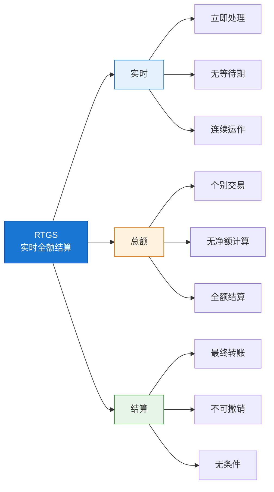
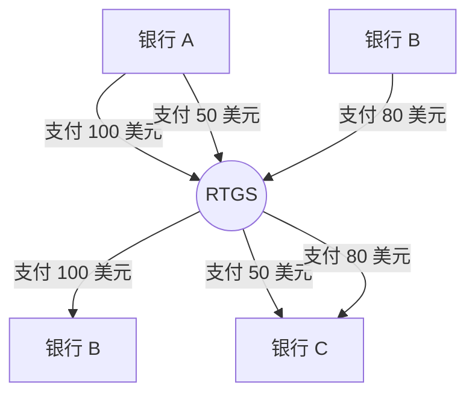
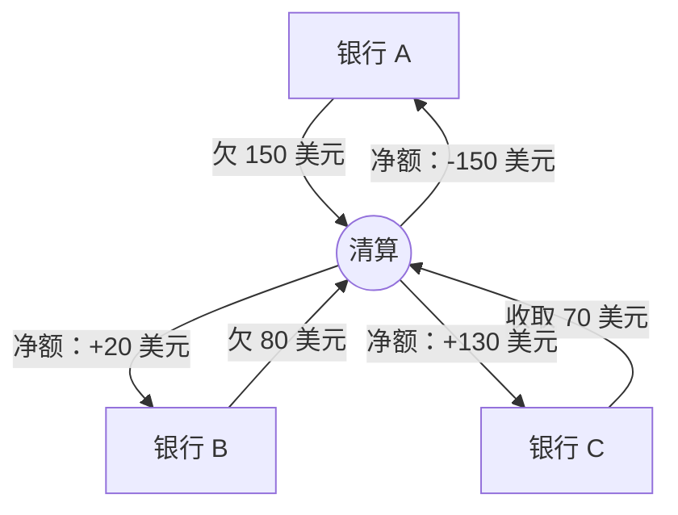
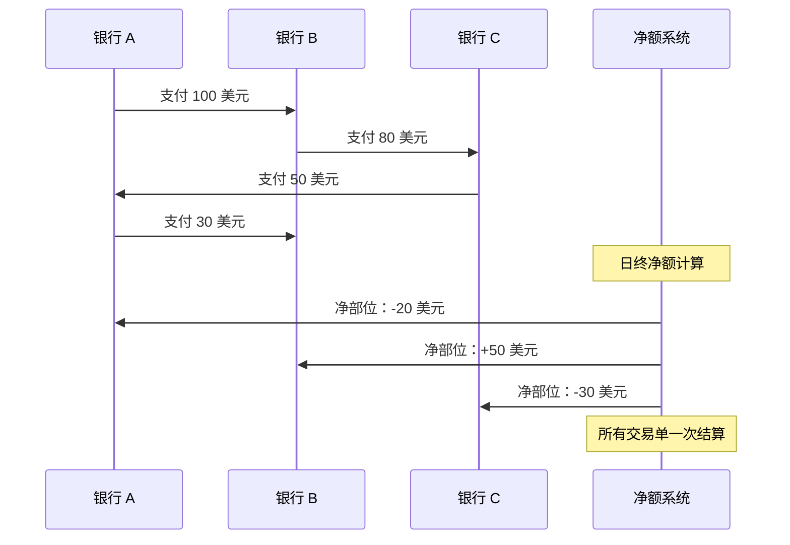
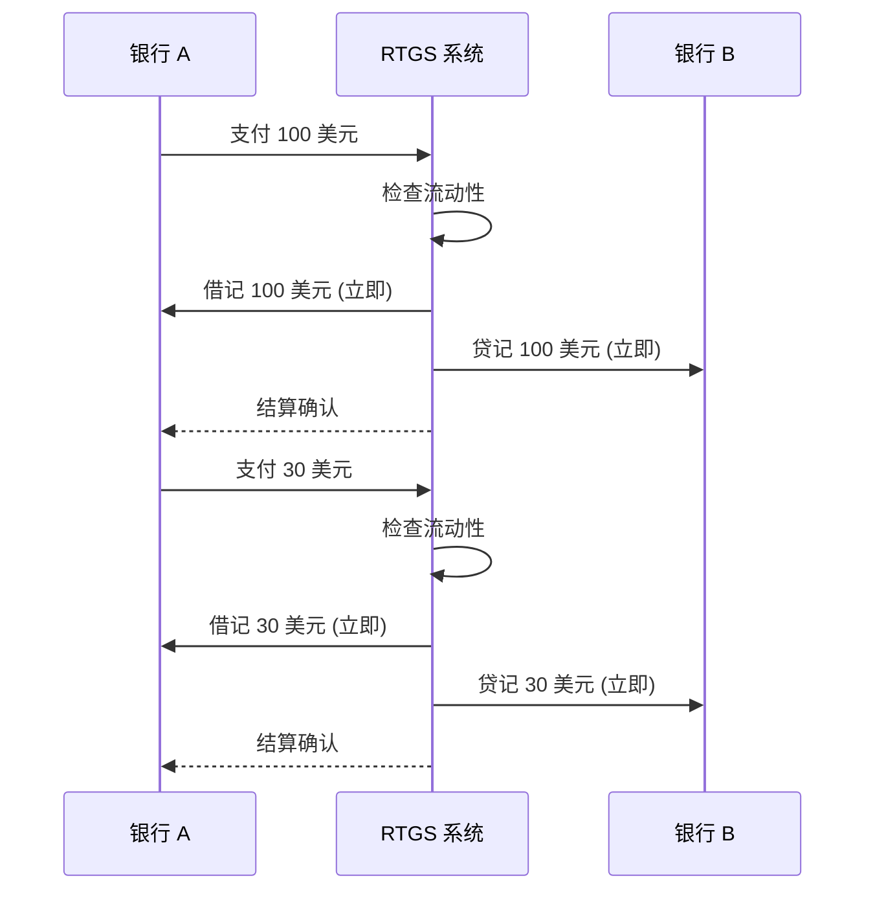

实时全额结算（RTGS）系统构成了现代金融基础设施的骨干，每天处理数万亿美元的交易。对于 IT 专业人员来说，在处理金融系统、支付平台或企业架构时，理解 RTGS 至关重要。

## 1 RTGS 之前

在 RTGS 普及之前，我们基本上是靠着希望和夜间批次作业的勇气来运行支付系统。想象一下：你是一名中型银行的 on-call DevOps / 中间件工程师。时间大约是 1998 到 2005 年左右，你负责维护高额支付网关，这个网关会与你所在国家的大额支付系统通信（CHAPS、RTGS 全面实施前的 Fedwire、Euro1、旧版 TARGET 等，任选一个）。

白天一切都感觉出奇地平静。SWIFT 消息飞进飞出，你的应用程序记录它们，将它们放入 Oracle 队列或纯文本文件中，更新每个交易对手的影子分类账，记录总借记和贷记。没有真正的资金移动。你只是在记分：「我们欠他们 8.47 亿，他们欠我们 9.12 亿 → 目前净额我们领先 6500 万。」流动性团队喜欢这样，因为实际的央行借记会保持很小，直到日终。

然后截止时间到了，真正的乐趣开始了。

批次作业启动了——某些陈旧的 COBOL 或早期 Java 怪物，负责对所有参与者进行多边净额计算。根据交易量，它会运算 20 到 90 分钟。你追踪日志，看着临时表膨胀，祈祷没有人在使用者余额列上产生死锁。当它完成时，轰的一声：净借记/贷记部位入账。只有这些净额会通过央行账户结算，通常是在第二天早上，或者如果你所在的方案不错的话，当天晚上。

从我们键盘这侧来看，可怕的不是技术崩溃（虽然确实会发生）。而是凌晨 2:30 的呼叫通知：

> 参与者 ABC 净借记 21 亿美元 – 无法覆盖
> 临时贷记已下发至企业活期存款账户

你知道如果央行不救助他们接下来会发生什么：撤销。进入追索城市。每个收到净贷记的银行都必须退回一些。已经花费「他们的」汇入汇款的客户会被反向扣款。交易台保证金催缴电话爆炸。而你——这个拥有生产环境权限的可怜家伙——是那个在凌晨 3 点风险委员会决定后重新排队、取消或强制释放任何内容的人，而流动性主管在电话会议中尖叫。

跨境外汇结算简直是直截了当的赌博，只是多了额外的步骤。你会在东京 nostro 账户关闭时贷记日元，然后经历八个小时的无线电静默，祈祷美元第二天早上到达纽约。如果交易对手隔夜倒闭？自认倒霉。那是教科书式的赫斯塔特风险（Herstatt risk），我们在每个价值日都经历着。

## 2 什么是 RTGS？

### 2.1 定义和核心概念

!!!tip "💡 RTGS 定义"
    **实时全额结算（RTGS）** 是一个资金转账系统，其中交易以**即时**、**个别**方式在**总额**基础上结算。

让我们分解这个定义的每个组成部分：



!!!anote "⚡「实时」究竟是什么意思？"
    对于 IT 专业人员来说，重要的是要理解 RTGS 上下文中的「实时」从技术角度来看意味着**接近实时**：

    **✅ RTGS 上下文中的实时：**
    - **无故意延迟**：交易不会被批次处理或排队等待稍后处理
    - **连续处理**：系统在运作时间内收到交易时立即处理，全天候运作
    - **秒级结算最终性**：一旦处理完成，结算即为最终且不可撤销
    - **与批次系统对比**：不像 ACH[^1] 或净额结算需要等待数小时或数天

    **⏱️ 实际处理时间：**

    ```
    阶段                       典型持续时间        备注
    ─────────────────────────────────────────────────────────
    消息验证                   10-50 毫秒         XML 架构、签名检查
    流动性检查                  5-20 毫秒         数据库查询
    结算执行                    10-100 毫秒        账户更新、分类账写入
    确认发送                    5-50 毫秒         取决于网络延迟
    ─────────────────────────────────────────────────────────
    端到端总计                  100-500 毫秒       P99 延迟通常 < 1 秒
    ```

    **🔬 技术现实：**
    - 不像嵌入式系统的「硬实时」（微秒级截止时间）
    - 按 IT 标准属于「软实时」/「接近实时」
    - 但与传统银行（数天）或批次系统（数小时）相比是「实时」
    - 行业基准：>95% 的支付在 60 秒内结算

    **💡 关键要点：** 「实时」意味着**无批次处理、无延迟结算**——每笔交易在收到时个别处理，正常情况下结算在不到一秒内完成。

    **📝 注意：** 整篇文章中使用缩写以求简洁。完整名称和描述请参阅 [第 8 节：缩写和简称](#8-acronyms-and-abbreviations)。

有了 RTGS，每笔支付都是其自己的原子单位。发送者有覆盖 → 借记、贷记、完成，亚秒级、不可撤销、由央行本身盖上最终性印章。无批次处理。无黎明时的净额抽奖。如果发送者没有资金（或日间信贷额度），支付会停留在队列中或直接拒绝。没有稍后要追索的临时贷记。没有凌晨 3 点的撤销。

我们的日常工作彻底改变了：

* 告别夜间批次恐惧，迎来日间队列管理（优先级通道、死锁检测、自动重新提交逻辑）
* 流动性预测成为真正的工作，而不是电子表格祈祷
* 监控从「批次完成？」转向实时吞吐量、参与者上限、队列深度警报、延迟 SLA
* on-call 变得更频繁，因为系统不能再休眠了——全天候意味着如果节点掉线就要全天候呼叫
* 但恐惧程度？降到地板以下。一家银行的崩溃不会以同样方式连锁反应。你不会醒来担心整个净额系统即将被撕裂。

我们用廉价流动性换来了防弹最终性，我们大多数人都会毫不犹豫地再次达成那笔交易。

如今，当我看到团队抱怨 RTGS 流动性紧缩或 ISO 20022 迁移痛苦时，我只是 smirk 并想：至少你不是那个在凌晨 4 点喝着昨天的咖啡，祈祷多边净额平衡的家伙。

你还在某个地方与旧批次垃圾搏斗，还是已经深入现代 RTGS 战壕？你在 RTGS 之前时代有过最糟糕的生产恐怖故事是什么？

### 2.2 RTGS 与净额结算系统

理解 RTGS 和净额结算之间的差异是基础。但首先，什么是净额结算系统，它为什么存在？

!!!anote "🏦 什么是净额结算？"
    **净额结算**（也称为延迟净额结算或 DNS[^2]）是一个支付系统，其中交易在**预定间隔**内作为**净部位**结算，交易会**累积一段时间**。

    **运作方式：**
    1. 全天，银行向系统发送支付指令
    2. 系统记录所有交易但**不立即结算**
    3. 在结算时间（例如日终），系统计算**净部位**
    4. 每个参与者支付或收取仅**净差额**

    **净额结算存在的原因：**

    ✅ **流动性效率**
    - 银行需要持有的现金较少
    - 多项义务相互抵消
    - 适合高交易量、较低价值的支付

    ✅ **成本降低**
    - 实际资金转账较少
    - 运营成本较低
    - 对小额交易经济实惠

    ✅ **历史原因**
    - 早于现代计算
    - 与批次处理配合良好
    - 仍适合某些支付类型

    ⚠️ **权衡：信用风险**
    - 结算被延迟，产生曝险
    - 如果一家银行在结算前倒闭，其他银行会受到影响
    - 称为「赫斯塔特风险」或结算风险

**视觉比较：资金如何流动**

**RTGS：每笔交易立即结算**



**净额结算：累积然后净额**



**详细比较：**

| 特性 | RTGS | 净额结算 (DNS) |
|---------|------|---------------------|
| **结算时机** | 实时、连续 | 期末（批次） |
| **结算基础** | 总额（个别） | 净额（汇总） |
| **交易最终性** | 立即 | 延迟 |
| **流动性需求** | 高 | 较低 |
| **信用风险** | 最小 | 较高（交易对手风险） |
| **处理成本** | 每笔交易较高 | 每笔交易较低 |
| **最适合** | 高价值、时间关键 | 低价值、高交易量 |

**净额结算范例：**



**RTGS 范例：**



**实际使用情况：**

| 系统类型 | 典型结算方法 | 范例 |
|-------------|--------------------------|----------|
| **高额支付** | RTGS | Fedwire、TARGET2、CHAPS |
| **零售支付** | 净额结算 | ACH[^1]、直接扣款、卡片网络 |
| **证券交易** | RTGS 或混合 | DTC[^3]、Euroclear |
| **外汇 (FX)**[^4] | RTGS | CLS[^5] 银行 |

### 2.3 RTGS 系统的关键特性

!!!anote "🔐 RTGS 基本特性"
    RTGS 系统具有这些 IT 专业人员必须了解的关键特性：

    ✅ **实时处理**
    - 交易在收到时立即处理
    - 无批次处理或排队等待结算
    - 营业时间内连续运作

    ✅ **总额结算**
    - 每笔交易个别结算
    - 不与其他交易净额抵销
    - 全额转账

    ✅ **最终性**
    - 结算不可撤销
    - 无条件资金转账
    - 处理后具有法律确定性

    ✅ **央行货币**
    - 以央行准备金结算
    - 最高形式的资金安全
    - 无商业银行信用风险

!!!tip "💡 敏捷、DevOps 和持续交付实践 vs RTGS"
    RTGS 与核心 DevOps 原则强烈共鸣，尤其是我们所信奉的「更小的发布、更少的风险」口号。

    想想我们刚才谈到的旧延迟净额结算世界：那基本上就是支付领域的大爆炸发布等价物。你整天堆积数百/数千笔支付指令（就像在大型分支或单体 sprint 中累积功能/代码变更）。然后在日终（或第二天早上），你执行一个巨大的批次/净额作业——轰的一声，所有内容在一个原子（但可怕）的提交中结算。如果任何问题出错（参与者无法覆盖其净借记、队列中有坏数据、死锁等），爆炸半径巨大：潜在撤销、追索、系统性冻结、凌晨 3 点的作战室。高风险，因为故障会一次性影响所有内容，恢复痛苦且会连锁反应。

    RTGS 将其翻转为更接近持续部署/小型、频繁发布并具有强大安全网的模式：

    * 每笔支付 = 其自己的小型、独立发布。无捆绑/净额计算。一个指令进入 → 验证 → 检查流动性/覆盖 → 实时总额结算（亚秒级/在央行账簿上原子化）→ 完成，不可撤销。快速失败且隔离——如果发送者没有资金，它会队列或直接拒绝。没有稍后要追索的临时贷记。
    * 风险按交易控制。就像金丝雀/蓝绿/金丝雀部署或基于主干的开发 + 功能旗标：你经常发布小型变更，问题只影响该单一变更（或一小部分流量），而不是整个系统。一个交易对手失败？它不会 unravel 整个天的净额——只有他们未结算的支付被阻止/队列。系统性风险大幅下降，因为没有累积的曝险等待单一批次窗口。
    * 快速失败，快速恢复。在 DevOps 中我们讨厌长反馈回路——这里也一样。批次净额给你在黎明时的反馈（太迟了）。RTGS 提供即时反馈：支付成功 → 资金立即可用；失败 → 发送者立即知道并可以行动（补充流动性、重试等）。mirrors 具有自动化闸道、测试和每次提交回滚的 CI/CD 管道。
    * 权衡感觉也很熟悉。RTGS 需要更多日间流动性（就像需要更多测试环境、更好的可观察性工具或 CD 的基础设施余量）。它「昂贵」在于持续就绪（全天候 HA、队列管理、死锁算法），但回报是更低的爆炸半径，不再有「希望夜间作业不会炸毁生产环境」的恐惧。

    简言之：延迟净额计算 = 瀑布式/大爆炸/单体发布 → 资源效率高但高赌注、高风险当故障时。

    RTGS = DevOps/CD/小型批次/原子部署 → 更高的运营成本（流动性始终热、全天候监控）但更少的生存风险、更快的迭代（支付全天流动无需等待）、真正的最终性/信心。

    我们基本上已经将资金移动的骨干 DevOps 化了。央行做了风险等价的决定：「去他的，不再有季度单体下降——让我们在每次发生时发布每个变更，并带有防护措施。」

    你在你正在处理的支付轨道上看到同样的类比，还是你的设置中有一些打破类比的转折？

这就是基础：我们如何从延迟净额计算时代的夜间批次轮盘赌中爬出来，降落在即时、不可撤销最终性的 RTGS 世界。如果你曾经在凌晨 2 点盯着队列深度警报，想知道净额是否会守住——或者你刚刚开始构建或整合现代支付轨道——这个系列就是为你准备的。接下来，我们将直接深入引擎室：今天的 RTGS 系统实际上如何在底层运作、让数兆资金流动而无死锁的队列逻辑、工程师每天对抗的流动性谜题，以及仍然让央行 SRE 保持高度警报的故障模式。坚持下去——事情会变得技术性、有点粗粝，而且（希望）更清晰。下回见。

---

**本文脚注：**

[^1]: **ACH** - 自动清算所：美国电子金融交易处理网络，通常用于国内低价值支付
[^2]: **DNS** - 延迟净额结算：在预定间隔累积交易并批次结算的系统
[^3]: **DTC** - 存托信托公司：美国证券存管和清算所，结算证券交易
[^4]: **FX** - 外汇：不同国家货币之间的交易
[^5]: **CLS** - 连续连结结算：外汇交易的多币种现金结算系统，消除结算风险

> **注意：** 有关 RTGS 系列中使用的所有缩写的完整列表，请参阅 [RTGS 缩写和简称参考](/2025/12/rtgs-acronyms-and-abbreviations/)。
