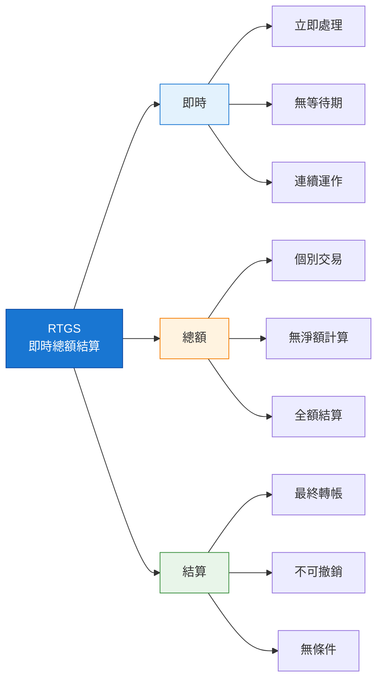
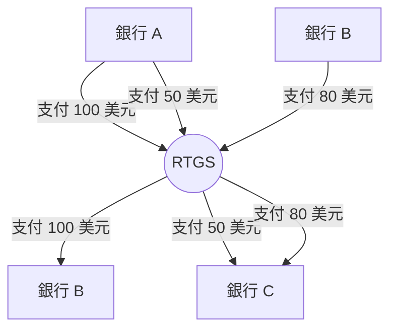
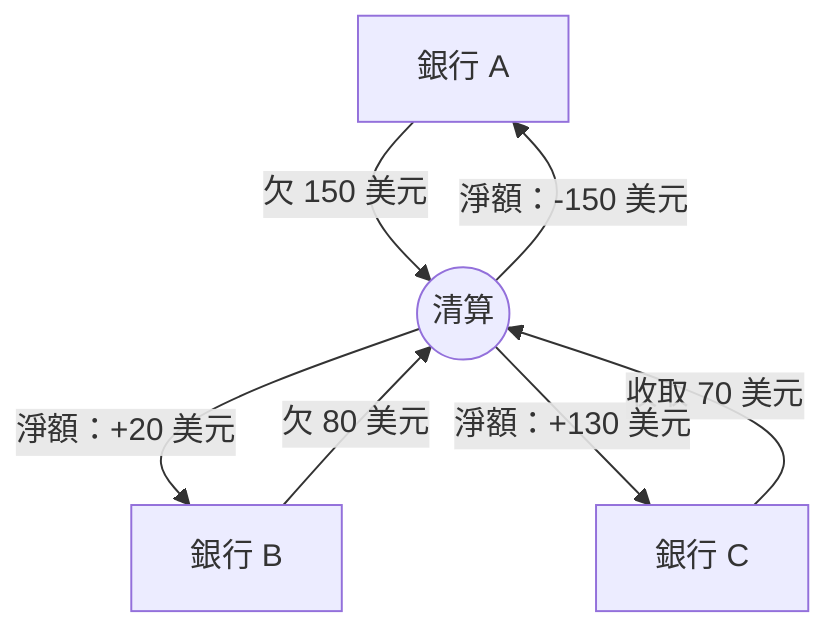
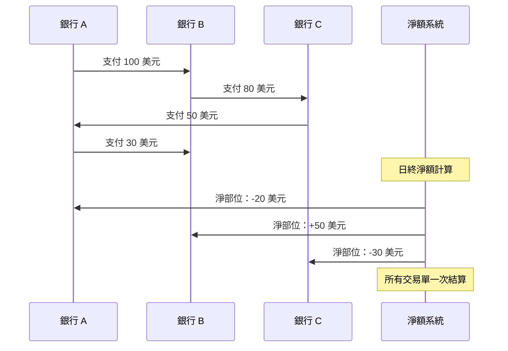
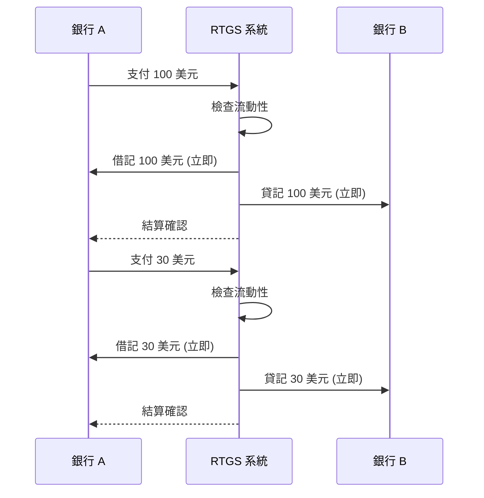

即時總額結算（RTGS）系統構成了現代金融基礎設施的骨幹，每天處理數兆美元的交易。對於 IT 專業人員來說，在處理金融系統、支付平台或企業架構時，理解 RTGS 至關重要。

## 1 RTGS 之前

在 RTGS 普及之前，我們基本上是靠著希望和夜間批次作業的勇氣來運行支付系統。想像一下：你是一名中型銀行的 on-call DevOps / 中介軟體工程師。時間大約是 1998 到 2005 年左右，你負責維護高額支付閘道，這個閘道會與你所在國家的大額支付系統通訊（CHAPS、RTGS 全面實施前的 Fedwire、Euro1、舊版 TARGET 等，任選一個）。

白天一切都感覺出奇地平靜。SWIFT 訊息飛進飛出，你的應用程式記錄它們，將它們放入 Oracle 佇列或純文字檔案中，更新每個交易對手的影子分類帳，記錄總借記和貸記。沒有真正的資金移動。你只是在記分：「我們欠他們 8.47 億，他們欠我們 9.12 億 → 目前淨額我們領先 6500 萬。」流動性團隊喜歡這樣，因為實際的央行借記會保持很小，直到日終。

然後截止時間到了，真正的樂趣開始了。

批次作業啟動了——某些陳舊的 COBOL 或早期 Java 怪物，負責對所有參與者進行多邊淨額計算。根據交易量，它會運算 20 到 90 分鐘。你追蹤日誌，看著臨時表膨脹，祈禱沒有人在使用者餘額列上產生死結。當它完成時，轟的一聲：淨借記/貸記部位入帳。只有這些淨額會透過央行帳戶結算，通常是在第二天早上，或者如果你所在的方案不錯的話，當天晚上。

從我們鍵盤這側來看，可怕的不是技術崩潰（雖然確實會發生）。而是凌晨 2:30 的呼叫通知：

> 參與者 ABC 淨借記 21 億美元 – 無法覆蓋
> 臨時貸記已下發至企業活期存款帳戶

你知道如果央行不救助他們接下來會發生什麼：撤銷。進入追索城市。每個收到淨貸記的銀行都必須退回一些。已經花費「他們的」匯入匯款的客戶會被反向扣款。交易台保證金催繳電話爆炸。而你——這個擁有生產環境權限的可憐傢伙——是那個在凌晨 3 點風險委員會決定後重新排隊、取消或強制釋放任何內容的人，而流動性主管在電話會議中尖叫。

跨境外匯結算簡直是直截了當的賭博，只是多了額外的步驟。你會在東京 nostro 帳戶關閉時貸記日元，然後經歷八個小時的无线电靜默，祈禱美元第二天早上到達紐約。如果交易對手隔夜倒閉？自認倒楣。那是教科書式的赫斯塔特風險（Herstatt risk），我們在每個價值日都經歷著。

## 2 什麼是 RTGS？

### 2.1 定義和核心概念

!!!tip "💡 RTGS 定義"
    **即時總額結算（RTGS）** 是一個資金轉帳系統，其中交易以**即時**、**個別**方式在**總額**基礎上結算。

讓我們分解這個定義的每個組成部分：



!!!anote "⚡「即時」究竟是什麼意思？"
    對於 IT 專業人員來說，重要的是要理解 RTGS 上下文中的「即時」從技術角度來看意味著**接近即時**：

    **✅ RTGS 上下文中的即時：**
    - **無故意延遲**：交易不會被批次處理或排隊等待稍後處理
    - **連續處理**：系統在運作時間內收到交易時立即處理，全天候運作
    - **秒級結算最終性**：一旦處理完成，結算即為最終且不可撤銷
    - **與批次系統對比**：不像 ACH[^1] 或淨額結算需要等待數小時或數天

    **⏱️ 實際處理時間：**

    ```
    階段                       典型持續時間        備註
    ─────────────────────────────────────────────────────────
    訊息驗證                   10-50 毫秒         XML 架構、簽章檢查
    流動性檢查                  5-20 毫秒         資料庫查詢
    結算執行                    10-100 毫秒        帳戶更新、分類帳寫入
    確認發送                    5-50 毫秒         取決於網路延遲
    ─────────────────────────────────────────────────────────
    端到端總計                  100-500 毫秒       P99 延遲通常 < 1 秒
    ```

    **🔬 技術現實：**
    - 不像嵌入式系統的「硬即時」（微秒級截止時間）
    - 按 IT 標準屬於「軟即時」/「接近即時」
    - 但與傳統銀行（數天）或批次系統（數小時）相比是「即時」
    - 行業基準：>95% 的支付在 60 秒內結算

    **💡 關鍵要點：** 「即時」意味著**無批次處理、無延遲結算**——每筆交易在收到時個別處理，正常情況下結算在不到一秒內完成。

    **📝 注意：** 整篇文章中使用縮寫以求簡潔。完整名稱和描述請參閱 [第 8 節：縮寫和簡稱](#8-acronyms-and-abbreviations)。

有了 RTGS，每筆支付都是其自己的原子單位。發送者有覆蓋 → 借記、貸記、完成，亞秒級、不可撤銷、由央行本身蓋上最終性印章。無批次處理。無黎明時的淨額抽獎。如果發送者沒有資金（或日間信貸額度），支付會停留在佇列中或直接拒絕。沒有稍後要追索的臨時貸記。沒有凌晨 3 點的撤銷。

我們的日常工作徹底改變了：

* 告別夜間批次恐懼，迎來日間佇列管理（優先級通道、死結檢測、自動重新提交邏輯）
* 流動性預測成為真正的工作，而不是電子表格祈禱
* 監控從「批次完成？」轉向即時吞吐量、參與者上限、佇列深度警報、延遲 SLA
* on-call 變得更頻繁，因為系統不能再休眠了——全天候意味著如果節點掉線就要全天候呼叫
* 但恐懼程度？降到地板以下。一家銀行的崩潰不會以同樣方式連鎖反應。你不會醒來擔心整個淨額系統即將被撕裂。

我們用廉價流動性換來了防彈最終性，我們大多數人都會毫不猶豫地再次達成那筆交易。

如今，當我看到團隊抱怨 RTGS 流動性緊縮或 ISO 20022 遷移痛苦時，我只是 smirk 並想：至少你不是那個在凌晨 4 點喝著昨天的咖啡，祈禱多邊淨額平衡的傢伙。

你還在某個地方與舊批次垃圾搏鬥，還是已經深入現代 RTGS 戰壕？你在 RTGS 之前時代有過最糟糕的生產恐怖故事是什麼？

### 2.2 RTGS 與淨額結算系統

理解 RTGS 和淨額結算之間的差異是基礎。但首先，什麼是淨額結算系統，它為什麼存在？

!!!anote "🏦 什麼是淨額結算？"
    **淨額結算**（也稱為延遲淨額結算或 DNS[^2]）是一個支付系統，其中交易在**預定間隔**內作為**淨部位**結算，交易會**累積一段時間**。

    **運作方式：**
    1. 全天，銀行向系統發送支付指令
    2. 系統記錄所有交易但**不立即結算**
    3. 在結算時間（例如日終），系統計算**淨部位**
    4. 每個參與者支付或收取僅**淨差額**

    **淨額結算存在的原因：**

    ✅ **流動性效率**
    - 銀行需要持有的現金較少
    - 多項義務相互抵銷
    - 適合高交易量、較低價值的支付

    ✅ **成本降低**
    - 實際資金轉帳較少
    - 營運成本較低
    - 對小額交易經濟實惠

    ✅ **歷史原因**
    - 早於現代計算
    - 與批次處理配合良好
    - 仍適合某些支付類型

    ⚠️ **權衡：信用風險**
    - 結算被延遲，產生曝險
    - 如果一家銀行在結算前倒閉，其他銀行會受到影響
    - 稱為「赫斯塔特風險」或結算風險

**視覺比較：資金如何流動**

**RTGS：每筆交易立即結算**



**淨額結算：累積然後淨額**



**詳細比較：**

| 特性 | RTGS | 淨額結算 (DNS) |
|---------|------|---------------------|
| **結算時機** | 即時、連續 | 期末（批次） |
| **結算基礎** | 總額（個別） | 淨額（彙總） |
| **交易最終性** | 立即 | 延遲 |
| **流動性需求** | 高 | 較低 |
| **信用風險** | 最小 | 較高（交易對手風險） |
| **處理成本** | 每筆交易較高 | 每筆交易較低 |
| **最適合** | 高價值、時間關鍵 | 低價值、高交易量 |

**淨額結算範例：**



**RTGS 範例：**



**實際使用情況：**

| 系統類型 | 典型結算方法 | 範例 |
|-------------|--------------------------|----------|
| **高額支付** | RTGS | Fedwire、TARGET2、CHAPS |
| **零售支付** | 淨額結算 | ACH[^1]、直接扣款、卡片網路 |
| **證券交易** | RTGS 或混合 | DTC[^3]、Euroclear |
| **外匯 (FX)**[^4] | RTGS | CLS[^5] 銀行 |

### 2.3 RTGS 系統的關鍵特性

!!!anote "🔐 RTGS 基本特性"
    RTGS 系統具有這些 IT 專業人員必須了解的關鍵特性：

    ✅ **即時處理**
    - 交易在收到時立即處理
    - 無批次處理或排隊等待結算
    - 營業時間內連續運作

    ✅ **總額結算**
    - 每筆交易個別結算
    - 不與其他交易淨額抵銷
    - 全額轉帳

    ✅ **最終性**
    - 結算不可撤銷
    - 無條件資金轉帳
    - 處理後具有法律確定性

    ✅ **央行貨幣**
    - 以央行準備金結算
    - 最高形式的資金安全
    - 無商業銀行信用風險

!!!tip "💡 敏捷、DevOps 和持續交付實踐 vs RTGS"
    RTGS 與核心 DevOps 原則強烈共鳴，尤其是我們所信奉的「更小的發布、更少的風險」口號。

    想想我們剛才談到的舊延遲淨額結算世界：那基本上就是支付領域的大爆炸發布等價物。你整天堆積數百/數千筆支付指令（就像在大型分支或單體 sprint 中累積功能/程式碼變更）。然後在日終（或第二天早上），你執行一個巨大的批次/淨額作業——轟的一聲，所有內容在一個原子（但可怕）的提交中結算。如果任何問題出錯（參與者無法覆蓋其淨借記、佇列中有壞數據、死結等），爆炸半徑巨大：潛在撤銷、追索、系統性凍結、凌晨 3 點的作戰室。高風險，因為故障會一次性影響所有內容，恢復痛苦且會連鎖反應。

    RTGS 將其翻轉為更接近持續部署/小型、頻繁發布並具有強大安全網的模式：

    * 每筆支付 = 其自己的小型、獨立發布。無捆綁/淨額計算。一個指令進入 → 驗證 → 檢查流動性/覆蓋 → 即時總額結算（亞秒級/在央行帳簿上原子化）→ 完成，不可撤銷。快速失敗且隔離——如果發送者沒有資金，它會佇列或直接拒絕。沒有稍後要追索的臨時貸記。
    * 風險按交易控制。就像金絲雀/藍綠/金絲雀部署或基於主幹的開發 + 功能旗標：你經常發布小型變更，問題只影響該單一變更（或一小部分流量），而不是整個系統。一個交易對手失敗？它不會 unravel 整個天的淨額——只有他們未結算的支付被阻止/佇列。系統性風險大幅下降，因為沒有累積的曝險等待單一批次視窗。
    * 快速失敗，快速恢復。在 DevOps 中我們討厭長反饋迴路——這裡也一樣。批次淨額給你在黎明時的反饋（太遲了）。RTGS 提供即時反饋：支付成功 → 資金立即可用；失敗 → 發送者立即知道並可以行動（補充流動性、重試等）。 mirrors 具有自動化閘道、測試和每次提交回滾的 CI/CD 管道。
    * 權衡感覺也很熟悉。RTGS 需要更多日間流動性（就像需要更多測試環境、更好的可觀察性工具或 CD 的基礎設施餘量）。它「昂貴」在於持續就緒（全天候 HA、佇列管理、死結演算法），但回報是更低的爆炸半徑，不再有「希望夜間作業不會炸毀生產環境」的恐懼。

    簡言之：延遲淨額計算 = 瀑布式/大爆炸/單體發布 → 資源效率高但高賭注、高風險當故障時。

    RTGS = DevOps/CD/小型批次/原子部署 → 更高的營運成本（流動性始終熱、全天候監控）但更少的生存風險、更快的迭代（支付全天流動無需等待）、真正的最終性/信心。

    我們基本上已經將資金移動的骨幹 DevOps 化了。央行做了風險等價的決定：「去他的，不再有季度單體下降——讓我們在每次發生時發布每個變更，並帶有防護措施。」

    你在你正在處理的支付軌道上看到同樣的類比，還是你的設置中有一些打破類比的轉折？

這就是基礎：我們如何從延遲淨額計算時代的夜間批次輪盤賭中爬出來，降落在即時、不可撤銷最終性的 RTGS 世界。如果你曾經在凌晨 2 點盯著佇列深度警報，想知道淨額是否會守住——或者你剛剛開始建構或整合現代支付軌道——這個系列就是為你準備的。接下來，我們將直接深入引擎室：今天的 RTGS 系統實際上如何在底層運作、讓數兆資金流動而無死結的佇列邏輯、工程師每天對抗的流動性謎題，以及仍然讓央行 SRE 保持高度警報的故障模式。堅持下去——事情會變得技術性、有點粗糲，而且（希望）更清晰。下回見。

---

**本文腳註：**

[^1]: **ACH** - 自動清算所：美國電子金融交易處理網路，通常用於國內低價值支付
[^2]: **DNS** - 延遲淨額結算：在預定間隔累積交易並批次結算的系統
[^3]: **DTC** - 存託信託公司：美國證券存管和清算所，結算證券交易
[^4]: **FX** - 外匯：不同國家貨幣之間的交易
[^5]: **CLS** - 連續連結結算：外匯交易的多幣種現金結算系統，消除結算風險

> **注意：** 有關 RTGS 系列中使用的所有縮寫的完整列表，請參閱 [RTGS 縮寫和簡稱參考](/2025/12/RTGS-Acronyms-and-Abbreviations)。
