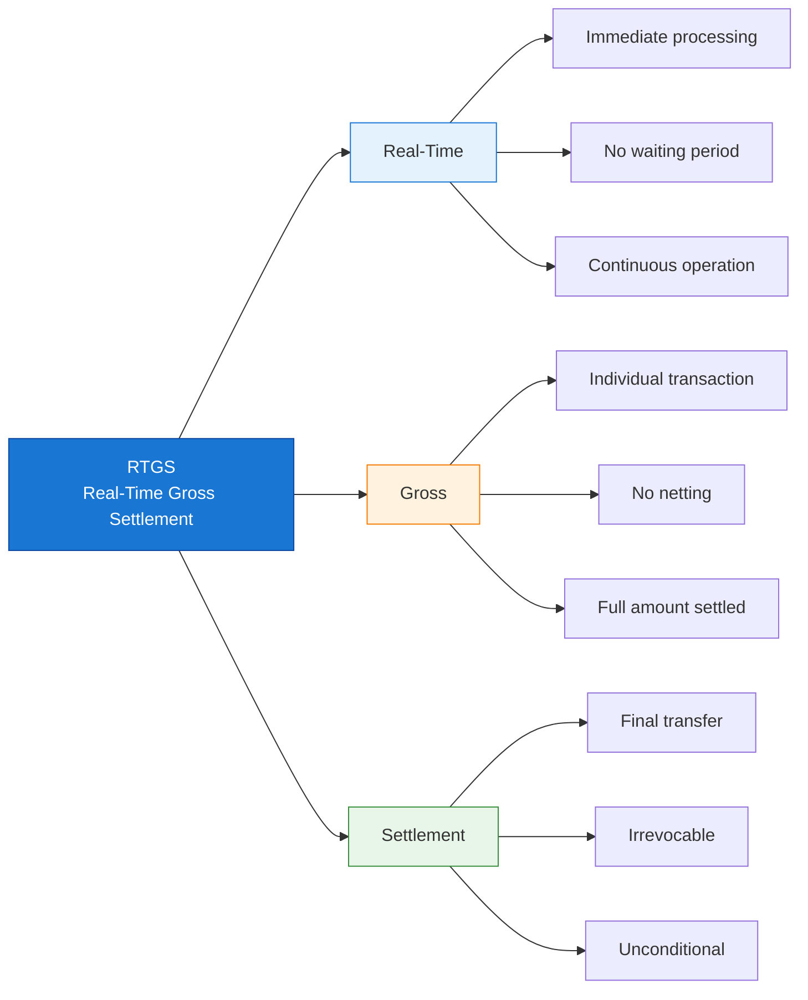
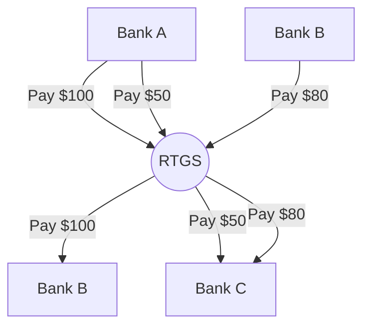
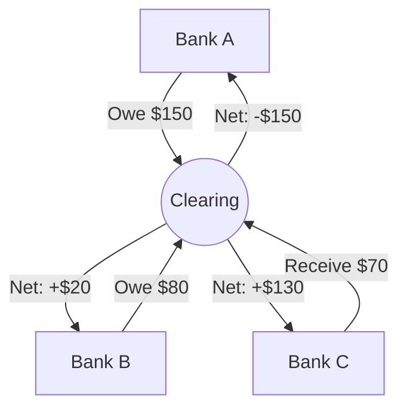
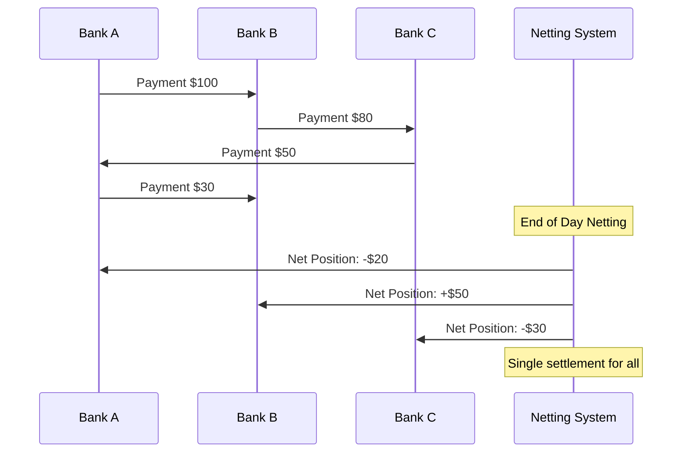
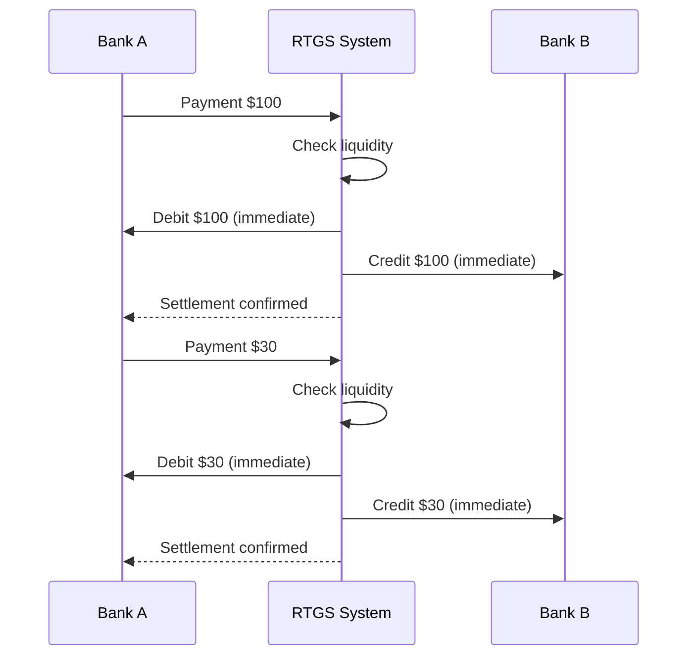

Real-Time Gross Settlement (RTGS) systems form the backbone of modern financial infrastructure, processing trillions of dollars in transactions daily. For IT professionals, understanding RTGS is essential when working with financial systems, payment platforms, or enterprise architecture.

## 1 Before RTGS

Back before RTGS was everywhere, we were basically running payment systems on hope and nightly batch courage. Picture this: you're the on-call devops / middleware engineer at a mid-tier bank. It's 1998–2005-ish, you're maintaining the high-value payment gateway that talks to whatever domestic large-value system your country had (CHAPS, Fedwire pre-full-RTGS vibes, Euro1, the old TARGET, take your pick).

During the day everything feels deceptively chill. SWIFT messages fly in and out, your app logs them, sticks them in Oracle queues or flat files, updates shadow ledgers with gross debits and credits per counterparty. No real money moves. You're just keeping score: "we owe them 847m, they owe us 912m → net we're up 65m for now." Liquidity guys love it because the actual central-bank debits stay tiny until end-of-day.

Then cut-off hits and the real fun begins.

The batch job spins up—some crusty COBOL or early Java monster that does the multilateral netting across every participant. It crunches for 20–90 minutes depending on volume. You tail the logs, watch temp tables balloon, pray nobody deadlocks on the participant balance row. When it finishes, boom: net debit/credit positions land. Only those nets get settled via central-bank accounts, usually next morning or same evening if you're on a good scheme.

From our side of the keyboard, the scary part wasn't the tech crashing (though it did). It was the 02:30 page that says:

> PARTICIPANT ABC NET DEBIT USD 2.1BN – CANNOT COVER
> Provisional credits already downstreamed to corporate DDA accounts

You know what happens next if the central bank doesn't bail them out: unwind. Clawback city. Every bank that received net credits has to give some back. Customers who already spent "their" incoming wire get reversed. Trading desks blow up margin calls. And you—the poor bastard with prod access—are the one re-queueing, cancelling, or force-releasing whatever the risk committee decides at 3 a.m. while the liquidity head screams on the bridge line.

Cross-border FX settlement was straight-up gambling with extra steps. You'd credit yen out of your Tokyo nostro at their close, then sit through eight hours of radio silence hoping the dollars hit New York the next morning. If the counterparty folded overnight? Tough luck. That was textbook Herstatt risk, and we lived it every value date.

## 2 What is RTGS?

### 2.1 Definition and Core Concept

!!!tip "💡 RTGS Definition"
    **Real-Time Gross Settlement (RTGS)** is a funds transfer system where transactions are settled **immediately** and **individually** on a **gross basis** in real-time.

Let's break down each component of this definition:



!!!anote "⚡ What Does 'Real-Time' Really Mean?"
    For IT professionals, it's important to understand that "real-time" in RTGS context means **near real-time** from a technical perspective:

    **✅ Real-Time in RTGS Context:**
    - **No intentional delay**: Transactions are not batched or queued for later processing
    - **Continuous processing**: System processes transactions as they arrive, 24/7 during operating hours
    - **Settlement finality within seconds**: Once processed, settlement is final and irrevocable
    - **Contrast with batch systems**: Unlike ACH[^1] or net settlement that wait hours or days

    **⏱️ Actual Processing Times:**

    ```
    Phase                    Typical Duration    Notes
    ─────────────────────────────────────────────────────────
    Message validation       10-50 ms           XML schema, signature check
    Liquidity check           5-20 ms           Database lookup
    Settlement execution     10-100 ms          Account updates, ledger write
    Confirmation sent         5-50 ms           Network latency dependent
    ─────────────────────────────────────────────────────────
    Total end-to-end        100-500 ms          P99 latency typically < 1 second
    ```

    **🔬 Technical Reality:**
    - Not "hard real-time" like embedded systems (microsecond deadlines)
    - Is "soft real-time" / "near real-time" by IT standards
    - But "real-time" compared to traditional banking (days) or batch systems (hours)
    - Industry benchmark: >95% of payments settled within 60 seconds

    **💡 Key Takeaway:** "Real-time" means **no batching, no deferred settlement**—each transaction is processed individually upon receipt, with settlement completing in under a second in normal conditions.

    **📝 Note:** Throughout this article, acronyms are used for brevity. See [Section 8: Acronyms and Abbreviations](#8-acronyms-and-abbreviations) for full names and descriptions.

With RTGS, every payment is its own little atomic unit. Sender has cover → debit, credit, done, sub-second, irrevocable, finality stamped by the central bank itself. No batch. No netting lottery at dawn. If the sender doesn't have the funds (or intraday credit line), the payment sits in a queue or rejects outright. No provisional credits to claw back later. No 3 a.m. unwinds.
Our day-to-day flipped hard:

* Goodbye nightly batch terror, hello intraday queue management (priority lanes, gridlock detection, auto-resubmit logic)
* Liquidity forecasting became a real job instead of a spreadsheet prayer
* Monitoring went from "batch complete?" to real-time throughput, participant caps, queue depth alerts, latency SLAs
* On-call got way more frequent because the system can't sleep anymore—24×7 means 24×7 paging if a node drops
* But the fear level? Dropped through the floor. One bank's implosion doesn't cascade the same way. You don't wake up wondering if the entire net is about to be torn apart.

We traded cheap liquidity for bulletproof finality, and most of us would make that deal again in a heartbeat.
Nowadays when I see teams complaining about RTGS liquidity squeezes or ISO 20022 migration pain, I just smirk and think: at least you're not the guy who used to pray the multilateral net balanced at 4 a.m. while drinking yesterday's coffee.
You still fighting legacy batch crap somewhere, or are you deep in the modern RTGS trenches already? What's the worst production horror story you've got from the pre-RTGS days?

### 2.2 RTGS vs. Net Settlement Systems

Understanding the difference between RTGS and net settlement is fundamental. But first, what is a Net Settlement System and why does it exist?

!!!anote "🏦 What is Net Settlement?"
    **Net Settlement** (also called Deferred Net Settlement or DNS[^2]) is a payment system where transactions are **accumulated over a period** and settled as **net positions** at predetermined intervals.

    **How it works:**
    1. Throughout the day, banks send payment instructions to the system
    2. The system records all transactions but **does not settle immediately**
    3. At settlement time (e.g., end of day), the system calculates **net positions**
    4. Each participant pays or receives only the **net difference**

    **Why Net Settlement Exists:**

    ✅ **Liquidity Efficiency**
    - Banks need less cash on hand
    - Multiple obligations offset each other
    - Ideal for high-volume, lower-value payments

    ✅ **Cost Reduction**
    - Fewer actual fund transfers
    - Lower operational costs
    - Economical for small transactions

    ✅ **Historical Reasons**
    - Predates modern computing
    - Worked well with batch processing
    - Still suitable for certain payment types

    ⚠️ **Trade-off: Credit Risk**
    - Settlement is deferred, creating exposure
    - If one bank fails before settlement, others are affected
    - Known as "Herstatt Risk" or settlement risk

**Visual Comparison: How Money Flows**

**RTGS: Each Transaction Settled Immediately**



**Net Settlement: Accumulate Then Net**



**Detailed Comparison:**

| Feature | RTGS | Net Settlement (DNS) |
|---------|------|---------------------|
| **Settlement Timing** | Real-time, continuous | End of period (batch) |
| **Settlement Basis** | Gross (individual) | Net (aggregated) |
| **Transaction Finality** | Immediate | Deferred |
| **Liquidity Requirement** | High | Lower |
| **Credit Risk** | Minimal | Higher (counterparty risk) |
| **Processing Cost** | Higher per transaction | Lower per transaction |
| **Best For** | High-value, time-critical | Low-value, high-volume |

**Net Settlement Example:**



**RTGS Example:**



**Real-World Usage:**

| System Type | Typical Settlement Method | Examples |
|-------------|--------------------------|----------|
| **High-Value Payments** | RTGS | Fedwire, TARGET2, CHAPS |
| **Retail Payments** | Net Settlement | ACH[^1], Direct Debit, Card Networks |
| **Securities Trading** | RTGS or Hybrid | DTC[^3], Euroclear |
| **Foreign Exchange (FX)**[^4] | RTGS | CLS[^5] Bank |

### 2.3 Key Characteristics of RTGS Systems

!!!anote "🔐 Essential RTGS Characteristics"
    RTGS systems share these critical characteristics that IT professionals must understand:

    ✅ **Real-Time Processing**
    - Transactions processed immediately upon receipt
    - No batching or queuing for settlement
    - Continuous operation during business hours

    ✅ **Gross Settlement**
    - Each transaction settled individually
    - No netting against other transactions
    - Full value transferred

    ✅ **Finality**
    - Settlement is irrevocable
    - Unconditional transfer of funds
    - Legal certainty once processed

    ✅ **Central Bank Money**
    - Settlement in central bank reserves
    - Highest form of money safety
    - No commercial bank credit risk

!!!tip "💡 Agile, DevOps, and Continuous Delivery practices vs RTGS"
    RTGS vibes hard with core DevOps principles, especially the whole "smaller releases, less risk" mantra we live by.

    Think about the old deferred net settlement world we were just talking about: that's basically the big-bang release equivalent in payments. You pile up hundreds/thousands of payment instructions all day (like accumulating features/code changes in a massive branch or monolith sprint). Then at end-of-day (or next morning), you do one giant batch/netting job—boom, everything settles in one atomic (but scary) commit. If anything goes sideways (a participant can't cover their net debit, bad data in the queue, deadlock, whatever), the blast radius is huge: potential unwind, clawbacks, systemic freeze, 3 a.m. war rooms. High risk because failure hits everything at once, and recovery is painful and cascading.

    RTGS flips that to something way closer to continuous deployment / small, frequent releases with strong safety nets:

    * Each payment = its own small, independent release. No bundling/netting. One instruction comes in → validate → check liquidity/cover → settle gross in real time (sub-second/atomic on central-bank books) → done, irrevocable. Fail fast and isolated—if the sender doesn't have funds, it queues or rejects outright. No provisional credits to claw back later.
    * Risk is contained per transaction. Just like a canary/blue-green/canary deploy or trunk-based dev + feature flags: you ship small changes often, problems affect only that one change (or a tiny % of traffic), not the whole system. One counterparty failing? It doesn't unravel the entire day's net—only their unsettled payments get blocked/queued. Systemic risk drops massively because there's no accumulated exposure waiting for a single batch window.
    * Fail fast, recover fast. In DevOps we hate long feedback loops—same here. Batch netting gives you feedback at dawn (too late). RTGS gives instant feedback: payment succeeds → funds usable immediately; fails → sender knows right away and can act (top up liquidity, retry, whatever). Mirrors CI/CD pipelines with automated gates, tests, and rollback on every commit.
    * Trade-offs feel familiar too. RTGS demands more intraday liquidity (like needing more test environments, better observability tooling, or infra headroom for CD). It's "expensive" in constant readiness (24/7 HA, queue management, gridlock algos), but the payoff is much lower blast radius and no more "hope the nightly job doesn't blow up production" dread.

    In short: deferred netting = waterfall/big-bang/monolithic releases → efficient on resources but high-stakes, high-risk when it fails.

    RTGS = DevOps/CD/small batches/atomic deploys → higher operational cost (liquidity always hot, always-on monitoring) but way less existential risk, faster iteration (payments flow all day without waiting), and true finality/confidence.

    We've basically DevOps-ified the backbone of money movement. The central banks did the risk equivalent of saying "screw it, no more quarterly monolith drops—let's ship every change as it happens, with guardrails."

    You seeing the same parallels in the payment rails you're working on, or is there some twist in your setup that breaks the analogy?

That’s the foundation: how we crawled out of the deferred netting era’s nightly batch roulette and landed in the RTGS world of instant, irrevocable finality. If you’ve ever stared at a queue depth alert at 2 a.m. wondering whether the net would hold—or if you’re just now building or integrating with modern payment rails—this series is for you. Next up, we’ll dive straight into the engine room: how today’s RTGS systems actually work under the hood, the queuing logic that keeps trillions flowing without gridlock, the liquidity puzzles engineers fight every day, and the failure modes that still keep central-bank SREs on high alert. Stick around—things get technical, a little gritty, and (hopefully) a lot clearer. See you in the next one.

---

**Footnotes for this article:**

[^1]: **ACH** - Automated Clearing House: US electronic network for processing financial transactions, typically used for domestic low-value payments
[^2]: **DNS** - Deferred Net Settlement: System that accumulates transactions and settles them in batches at predetermined intervals
[^3]: **DTC** - Depository Trust Company: US securities depository and clearinghouse that settles securities trades
[^4]: **FX** - Foreign Exchange: The trading of currencies between different nations
[^5]: **CLS** - Continuous Linked Settlement: Multi-currency cash settlement system for foreign exchange transactions, eliminating settlement risk

> **Note:** For a complete list of all acronyms used in the RTGS series, see the [RTGS Acronyms and Abbreviations Reference](/2025/12/rtgs-acronyms-and-abbreviations/).
