High availability and performance are non-negotiable for RTGS systems. This final article in our series explores the architectural patterns, design strategies, and operational practices that ensure RTGS systems meet their demanding requirements.

## 1 Availability Requirements

### 1.1 RTGS Availability Standards

!!!anote "⚡ RTGS Availability Expectations"
    RTGS systems operate under stringent availability requirements:

    ✅ **Operating Hours Availability**
    - 99.99%+ during business hours
    - Typically 18-24 hours/day
    - Scheduled maintenance windows only

    ✅ **Recovery Objectives**
    - RTO: < 2 minutes for failover
    - RPO: Zero data loss
    - Graceful degradation under stress

    ✅ **Planned Downtime**
    - Minimal scheduled maintenance
    - Weekend/off-hours only
    - Advanced notification required

### 1.2 Availability Calculation

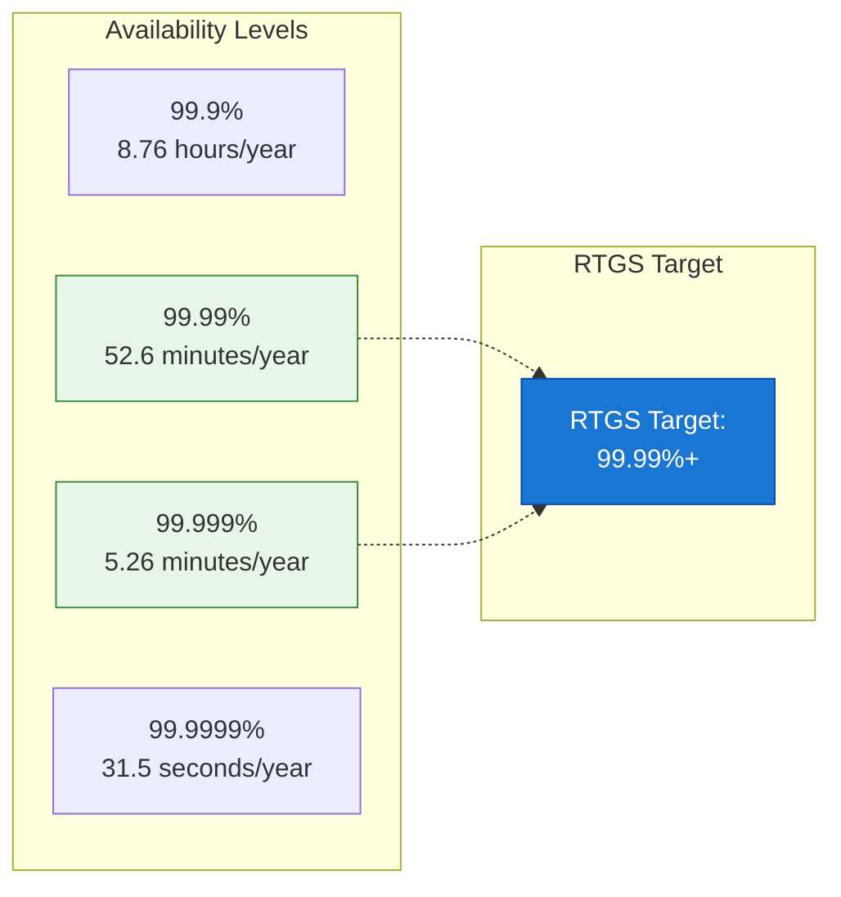

**Availability Metrics:**

| Metric | Formula | RTGS Target |
|--------|---------|-------------|
| **Availability %** | (Uptime / Total Time) × 100 | > 99.99% |
| **MTBF** | Total Uptime / Number of Failures | > 8760 hours |
| **MTTR** | Total Downtime / Number of Failures | < 2 minutes |
| **MTTF** | Total Uptime / Number of Units | > 100,000 hours |

## 2 High Availability Architecture

### 2.1 Redundancy Patterns

**Active-Active Configuration:**
*   **Note:** The diagram below illustrates a proposed Active-Active architectural pattern. The specific components and replication mechanisms can vary based on infrastructure and RPO/RTO objectives.
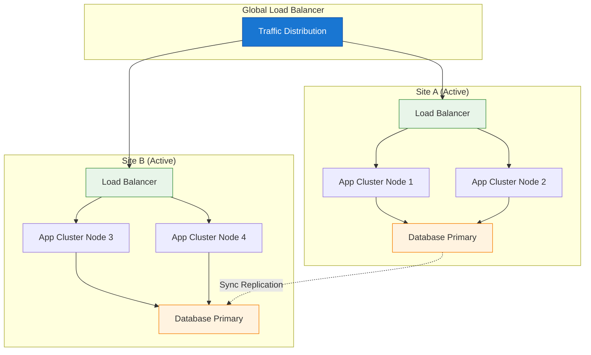

**Active-Passive Configuration:**
*   **Note:** The diagram below illustrates a proposed Active-Passive architectural pattern. The specific components, health monitoring, and failover mechanisms can vary based on infrastructure and RPO/RTO objectives.
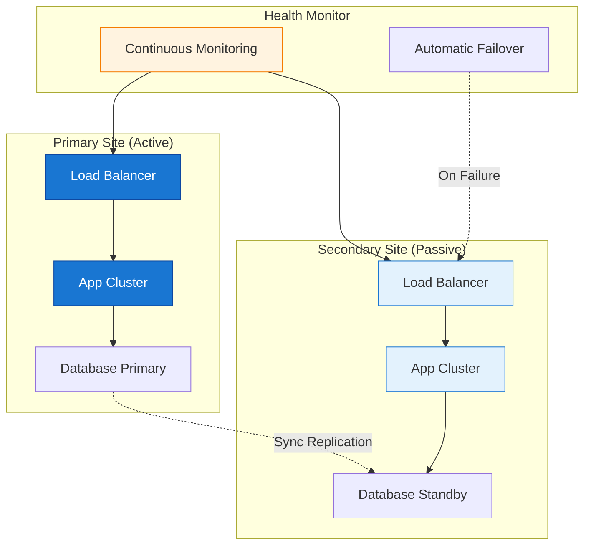

### 2.2 Database High Availability

**Synchronous Replication:**
*   **Note:** The sequence diagram below illustrates a proposed flow for synchronous database replication. While it ensures zero data loss, it introduces higher latency compared to asynchronous replication.
```mermaid
sequenceDiagram
    participant App as Application
    participant Primary as DB Primary
    participant Replica as DB Replica
    
    App->>Primary: Write Transaction
    Primary->>Primary: Write Local
    
    Primary->>Replica: Send Changes
    Replica->>Replica: Write Replica
    
    Replica-->>Primary: Acknowledge
    Primary-->>App: Commit Confirm
    
    Note over Primary,Replica: Zero data loss<br/>Higher latency
    
    style Primary fill:#1976d2,stroke:#0d47a1,color:#fff
    style Replica fill:#e3f2fd,stroke:#1976d2
```

**Asynchronous Replication:**
*   **Note:** The sequence diagram below illustrates a proposed flow for asynchronous database replication. While it offers lower latency, there is a potential for data loss in the event of a primary database failure.
```mermaid
sequenceDiagram
    participant App as Application
    participant Primary as DB Primary
    participant Replica as DB Replica
    
    App->>Primary: Write Transaction
    Primary->>Primary: Write Local
    Primary-->>App: Commit Confirm
    
    Primary->>Replica: Send Changes (async)
    Replica->>Replica: Write Replica
    Replica-->>Primary: Acknowledge
    
    Note over Primary,Replica: Lower latency<br/>Potential data loss
    
    style Primary fill:#1976d2,stroke:#0d47a1,color:#fff
    style Replica fill:#e3f2fd,stroke:#1976d2
```

**Replication Comparison:**

| Aspect | Synchronous | Asynchronous |
|--------|-------------|--------------|
| **Data Loss** | Zero | Possible |
| **Latency** | Higher | Lower |
| **Distance** | Limited (< 100km) | Unlimited |
| **Throughput** | Constrained | Higher |
| **Use Case** | Critical data | Disaster recovery |

### 2.3 Failover Strategies
*   **Note:** The flowchart below illustrates a proposed failover strategy. The specific steps and actions will depend on the type of failure and the recovery procedures defined for the RTGS system.
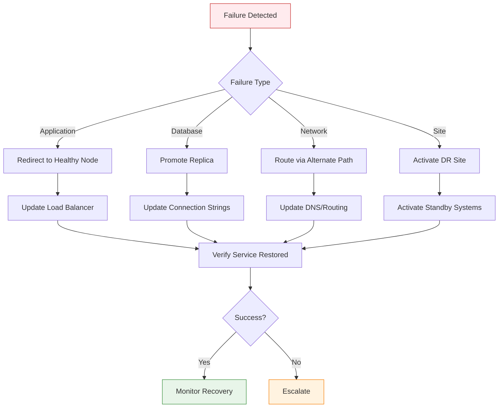

## 3 Performance Optimization

### 3.1 Performance Requirements

| Metric | Target | Measurement |
|--------|--------|-------------|
| **Latency (P50)** | < 100ms | Message receipt to response |
| **Latency (P99)** | < 500ms | 99th percentile |
| **Throughput** | > 1000 TPS | Transactions per second |
| **Queue Processing** | < 30 seconds | Time in queue |
| **Settlement Time** | < 1 second | End-to-end settlement |

### 3.2 Performance Architecture
*   **Note:** The diagram below illustrates a proposed performance architecture with various optimization layers and techniques. The specific components and their configuration will vary based on the performance requirements and system design.
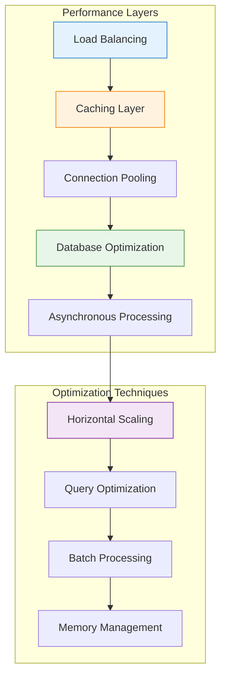

### 3.3 Caching Strategy

**Multi-Level Caching:**
*   **Note:** The diagram below illustrates a proposed multi-level caching hierarchy. The specific cache types, data stored, and eviction policies will depend on the application's performance characteristics.
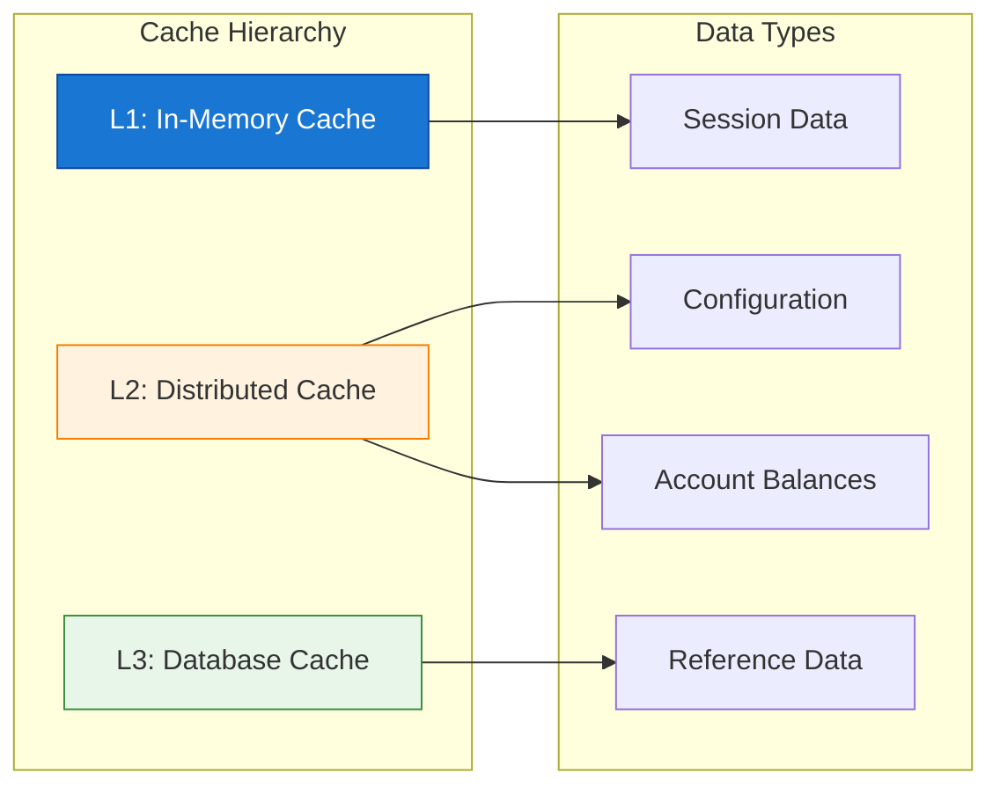

**Cache Implementation:**
*   **Note:** The Java code snippet below provides a proposed conceptual interface and example implementation for a caching layer. The actual implementation will vary significantly based on the chosen caching framework and specific data access patterns.
```java
// Conceptual caching layer for RTGS
interface RTGSCache {
    
    /**
     * L1 Cache: In-memory, ultra-fast
     * Use: Session data, frequently accessed
     */
    <T> T getFromL1(String key);
    void putInL1(String key, Object value, Duration ttl);
    
    /**
     * L2 Cache: Distributed (Redis/Memcached)
     * Use: Shared state, account balances
     */
    <T> CompletableFuture<T> getFromL2(String key);
    CompletableFuture<Void> putInL2(String key, Object value, Duration ttl);
    
    /**
     * L3 Cache: Database query cache
     * Use: Reference data, historical data
     */
    <T> T getFromL3(String key);
    void invalidateL3(String pattern);
    
    /**
     * Cache-aside pattern for account balances
     */
    default BigDecimal getAccountBalance(String accountId) {
        String key = "balance:" + accountId;
        
        // Try L1 first
        BigDecimal balance = getFromL1(key);
        if (balance != null) return balance;
        
        // Try L2
        balance = getFromL2(key).join();
        if (balance != null) {
            putInL1(key, balance, Duration.ofSeconds(10));
            return balance;
        }
        
        // Load from database
        balance = loadFromDatabase(accountId);
        putInL2(key, balance, Duration.ofMinutes(1));
        putInL1(key, balance, Duration.ofSeconds(10));
        
        return balance;
    }
}
```

### 3.4 Database Optimization

**Indexing Strategy:**
*   **Note:** The diagram below illustrates a proposed indexing strategy. The specific indexes and their composition should be determined based on the database schema, query patterns, and performance requirements.
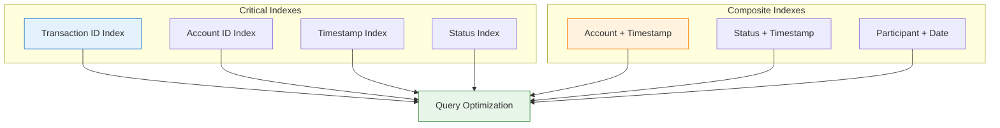

**Query Optimization Examples:**
*   **Note:** The SQL snippets below are proposed examples of database query optimization techniques. The specific optimizations will depend on the database system, data volume, and query patterns.
```sql
-- Optimized query for transaction lookup
-- Uses covering index to avoid table scan
CREATE INDEX idx_transaction_lookup 
ON transactions (account_id, created_at DESC) 
INCLUDE (amount, currency, status);

-- Partitioned table for large transaction history
CREATE TABLE transactions_partitioned (
    id UUID PRIMARY KEY,
    account_id UUID NOT NULL,
    amount DECIMAL(19,4) NOT NULL,
    created_at TIMESTAMP NOT NULL,
    -- ... other columns
) PARTITION BY RANGE (created_at);

-- Queue processing with SKIP LOCKED
SELECT id, payment_data
FROM payment_queue
WHERE status = 'PENDING'
ORDER BY priority, enqueue_time
FOR UPDATE SKIP LOCKED
LIMIT 100;
```

## 4 Scalability Design

### 4.1 Scaling Patterns

**Horizontal Scaling:**
*   **Note:** The diagram below illustrates a proposed horizontal scaling architecture. The specific components, load balancing strategies, and shared resources will vary based on the application's scalability requirements.
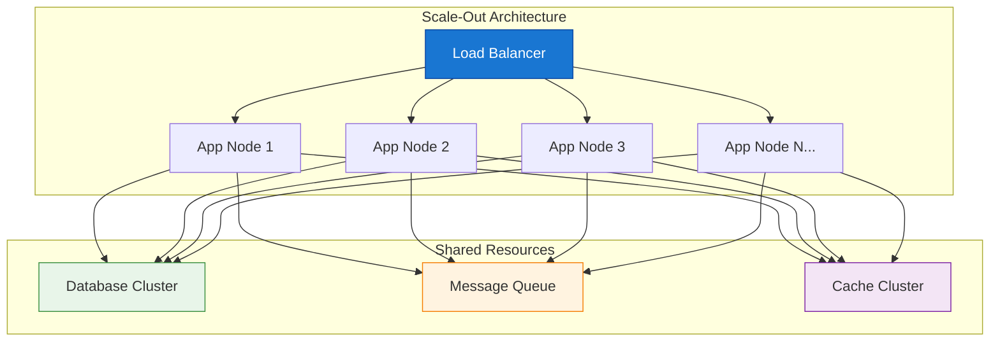

**Scaling Strategies:**

| Component | Scaling Approach | Considerations |
|-----------|-----------------|----------------|
| **Application** | Horizontal (stateless) | Session affinity, Load balancing |
| **Database** | Read replicas, Sharding | Write bottleneck, Consistency |
| **Cache** | Cluster expansion | Memory distribution, Eviction |
| **Message Queue** | Partitioning | Order preservation, Consumer groups |

### 4.2 Queue Scaling
*   **Note:** The diagram below illustrates a proposed queue scaling architecture. The specific partitioning strategy and consumer group configuration will depend on the message processing requirements and chosen message queue technology.
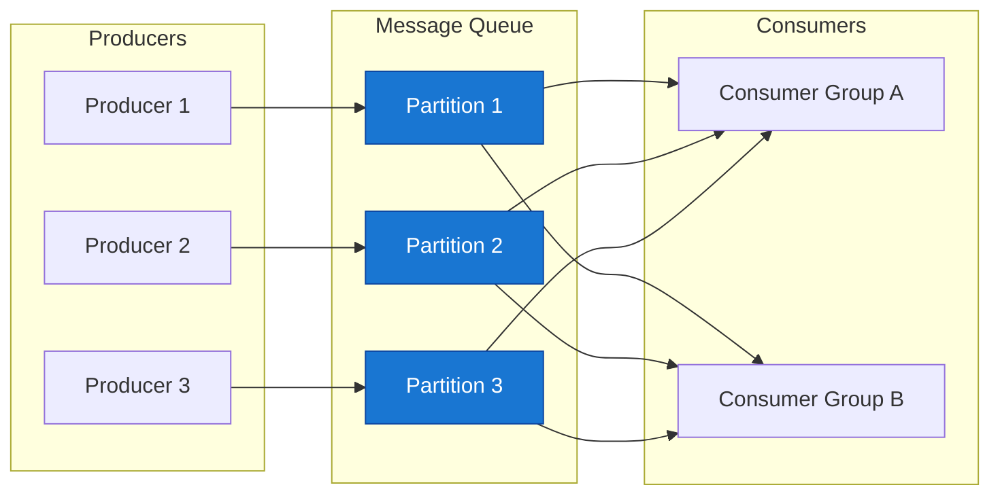

## 5 Monitoring and Observability

### 5.1 Monitoring Architecture
*   **Note:** The diagram below illustrates a proposed monitoring architecture. The specific tools, data sources, and correlation mechanisms will vary based on the observability requirements.
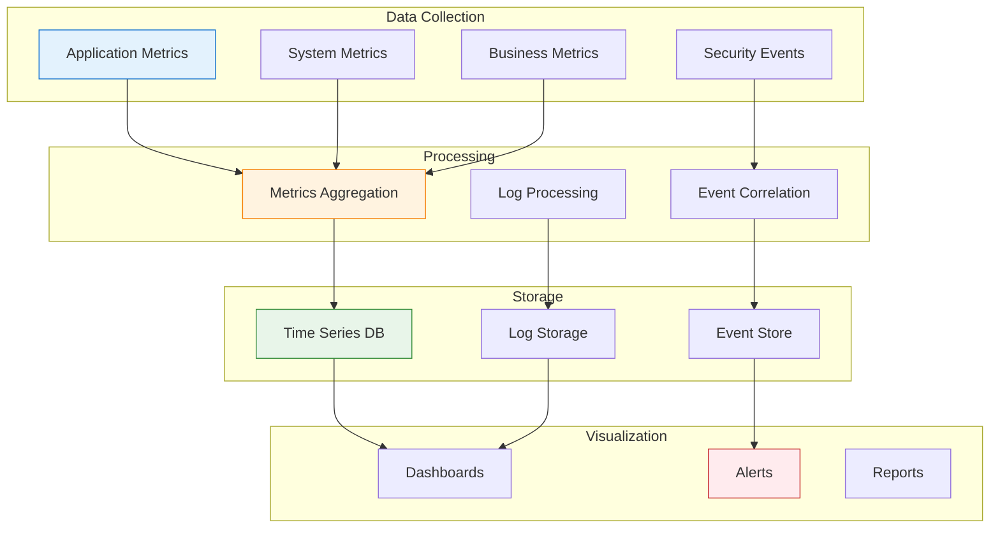

### 5.2 Key Performance Indicators

**System Health Metrics:**
*   **Note:** The table below presents proposed system health metrics with illustrative thresholds and alert levels. The specific KPIs and their targets should be established based on the RTGS system's SLA and operational requirements.
| Category | Metric | Threshold | Alert Level |
|----------|--------|-----------|-------------|
| **Availability** | Uptime % | < 99.99% | Critical |
| **Latency** | P99 Response Time | > 500ms | High |
| **Throughput** | Transactions/sec | < 100 | High |
| **Error Rate** | Failed Transactions | > 0.1% | Critical |
| **Queue Depth** | Pending Payments | > 1000 | Medium |
| **Database** | Connection Pool Usage | > 80% | Medium |
```
**Business Metrics Dashboard:**
*   **Note:** The diagram below illustrates a proposed structure for a business metrics dashboard. The specific metrics, their visualization, and aggregation methods can vary based on business needs.
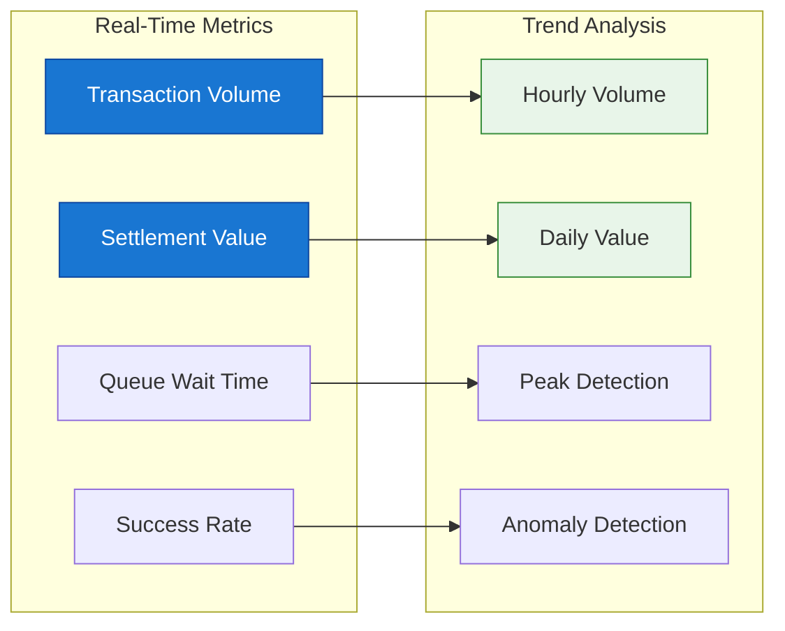

### 5.3 Distributed Tracing
*   **Note:** The sequence diagram below illustrates a proposed distributed tracing flow. The specific services, spans, and metrics captured will depend on the tracing framework and microservices architecture.
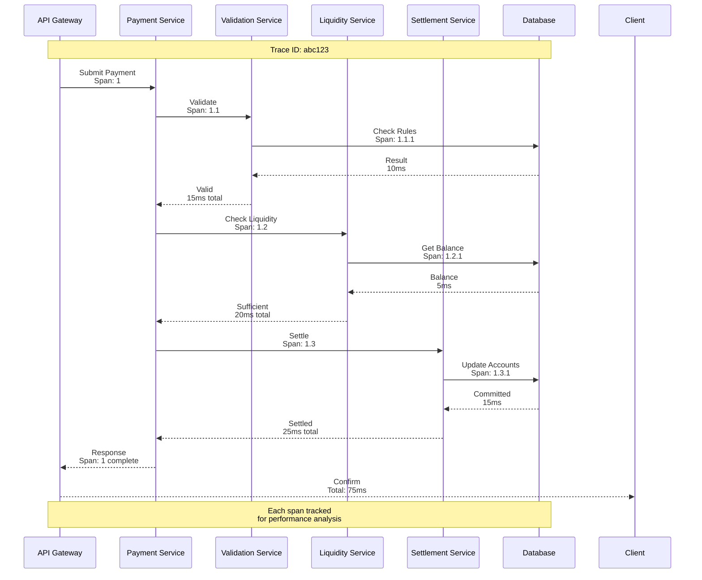

## 6 Operational Excellence

### 6.1 Deployment Pipeline
*   **Note:** The flowchart below illustrates a proposed deployment pipeline. The specific stages, automation tools, and approval gates will vary based on the CI/CD practices and regulatory requirements.


### 6.2 Change Management
*   **Note:** The table below presents a proposed example of change management policies. The specific approval workflows, testing requirements, and deployment windows should be defined based on the organization's risk appetite and operational procedures.
| Change Type | Approval | Testing | Deployment Window |
|-------------|----------|---------|-------------------|
| **Critical Security** | Emergency | Minimal | Immediate |
| **Bug Fix** | Tech Lead | Regression | Off-peak |
| **Feature** | Change Board | Full Suite | Scheduled |
| **Infrastructure** | Architecture | Performance | Maintenance Window |

### 6.3 Capacity Planning
*   **Note:** The diagram below illustrates a proposed capacity planning process. The specific inputs, modeling techniques, and outputs will vary based on the system's growth patterns and resource management strategies.
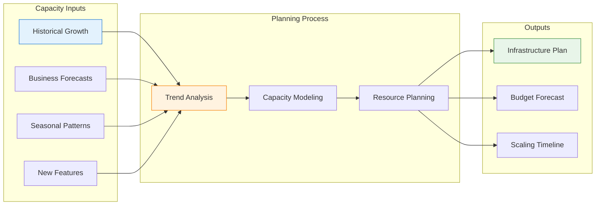

## 7 Series Summary

### 7.1 Complete Series Overview

!!!anote "📚 RTGS Series Complete"
    **All five articles in this series:**

    | Part | Topic | Key Takeaways |
    |------|-------|---------------|
    | **Part 1** | Core Concepts | RTGS fundamentals, Real-time vs. net settlement |
    | **Part 2** | System Architecture | Components, Data flow, Integration |
    | **Part 3** | Message Standards | ISO 20022, SWIFT migration, Validation |
    | **Part 4** | Security & Risk | Threats, Controls, Compliance |
    | **Part 5** | High Availability | Redundancy, Performance, Operations |

### 7.2 Key Concepts Recap

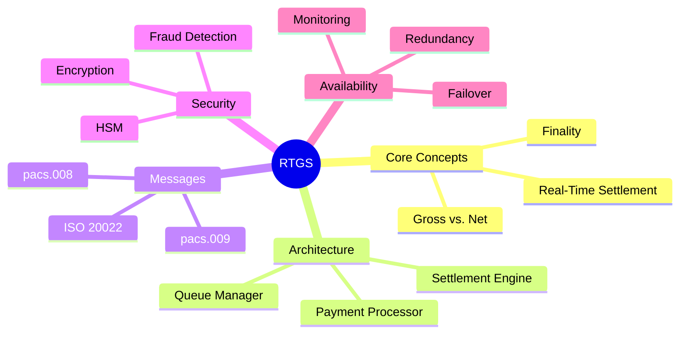

### 7.3 Further Learning

| Topic | Resources |
|-------|-----------|
| **ISO 20022** | iso20022.org, SWIFT documentation |
| **Payment Systems** | BIS Publications, Central Bank guides |
| **Security** | NIST Frameworks, PCI DSS |
| **Architecture** | Enterprise Architecture patterns |

## 8 Summary

!!!anote "📋 Key Takeaways"
    **Essential high availability and performance concepts:**

    ✅ **High Availability Architecture**
    - Active-Active or Active-Passive redundancy
    - Synchronous replication for zero data loss
    - Automatic failover with health monitoring

    ✅ **Performance Optimization**
    - Multi-level caching strategy
    - Database indexing and partitioning
    - Connection pooling and async processing

    ✅ **Scalability Design**
    - Horizontal scaling for stateless components
    - Queue partitioning for parallel processing
    - Read replicas for database scaling

    ✅ **Monitoring and Observability**
    - Comprehensive metrics collection
    - Distributed tracing
    - Real-time alerting

    ✅ **Operational Excellence**
    - Automated deployment pipeline
    - Change management processes
    - Capacity planning

---

**Footnotes for this article:**

[^1]: **RTO** - Recovery Time Objective: Maximum acceptable downtime after a failure
[^2]: **RPO** - Recovery Point Objective: Maximum acceptable data loss measured in time
[^3]: **MTBF** - Mean Time Between Failures: Average time between system failures
[^4]: **MTTR** - Mean Time To Repair: Average time to fix a failed system
[^5]: **MTTF** - Mean Time To Failure: Average time until a system fails
[^6]: **TPS** - Transactions Per Second: Measure of system throughput
[^7]: **P50** - 50th Percentile: Median response time (50% of requests faster)
[^8]: **P99** - 99th Percentile: 99% of requests complete within this time
[^9]: **DR** - Disaster Recovery: Strategies for recovering from disasters
[^10]: **DC** - Data Center: Facility housing computer systems and network infrastructure
[^11]: **API** - Application Programming Interface: Interface for software components to communicate
[^12]: **SQL** - Structured Query Language: Database query language
[^13]: **CDC** - Change Data Capture: Process of identifying and capturing data changes
[^14]: **SIEM** - Security Information and Event Management: Real-time security monitoring

> **Note:** For a complete list of all acronyms used in the RTGS series, see the [RTGS Acronyms and Abbreviations Reference](/2025/12/RTGS-Acronyms-and-Abbreviations/).
