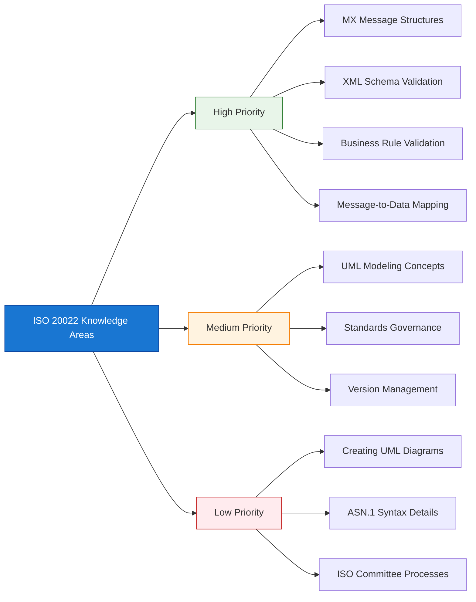
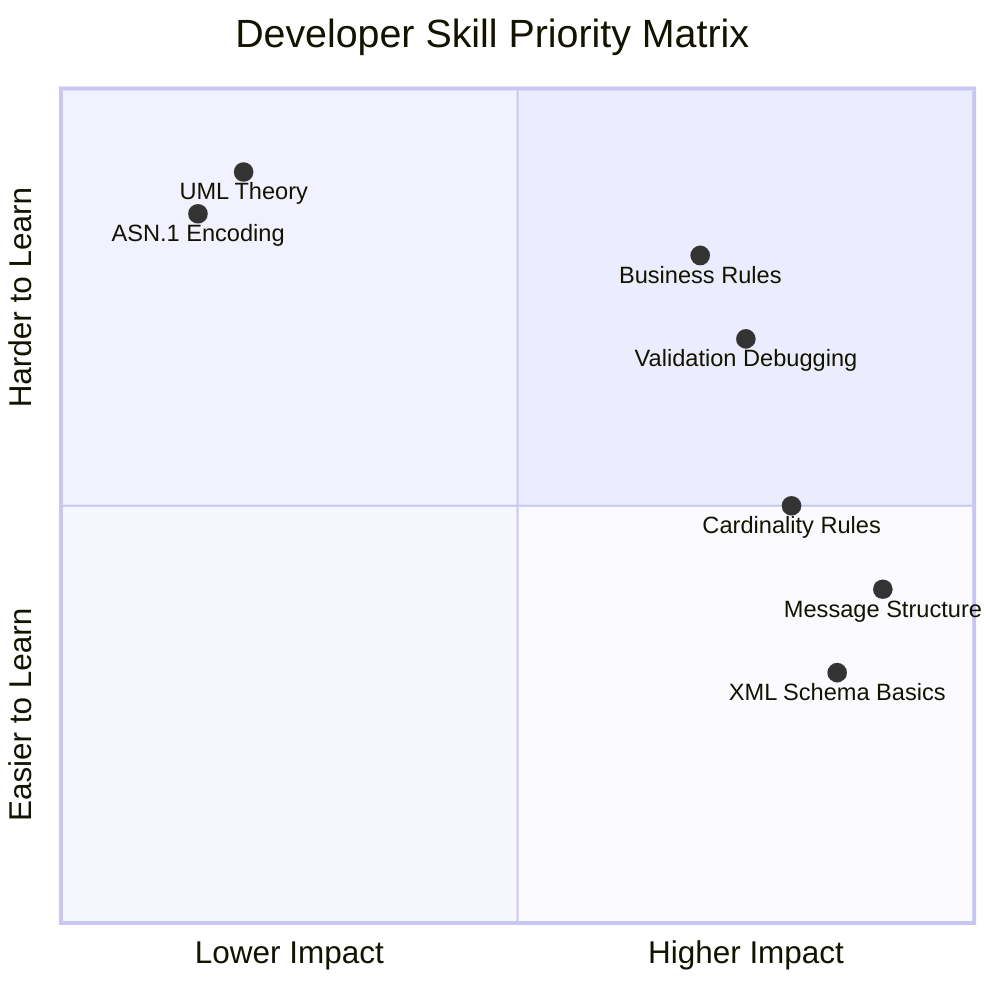
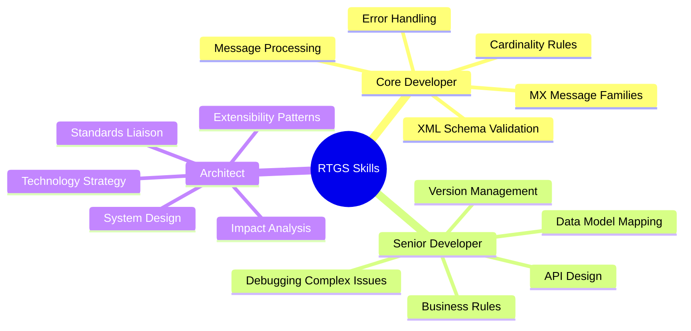
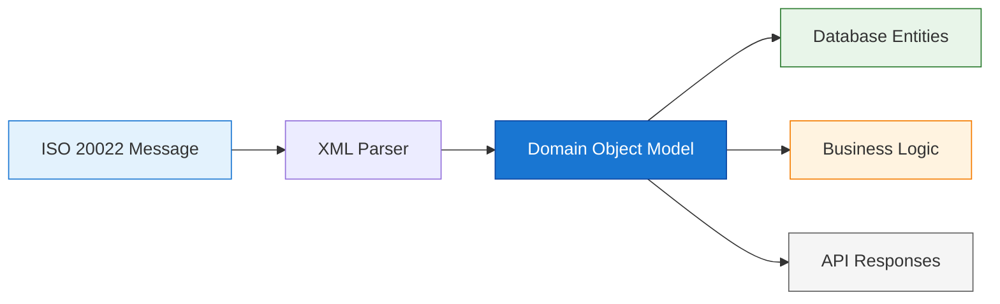
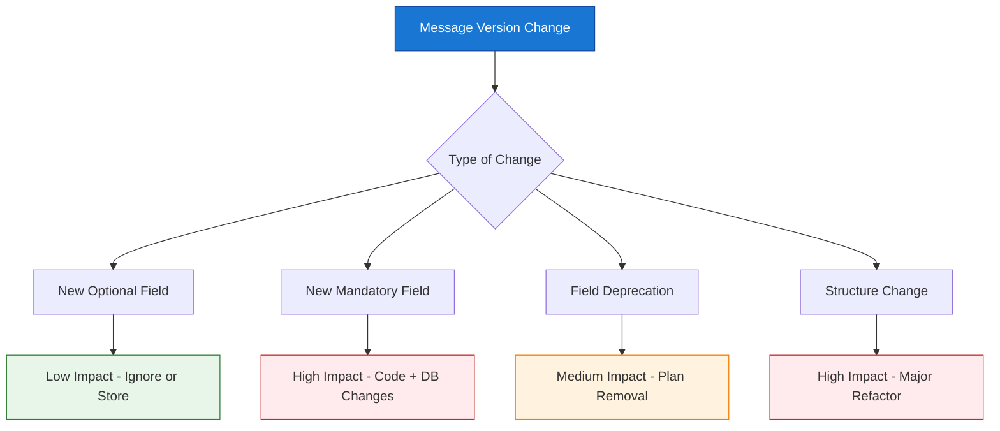
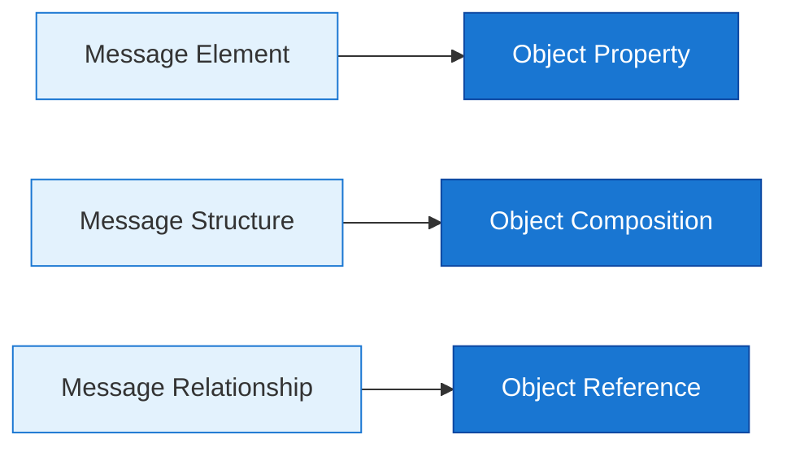
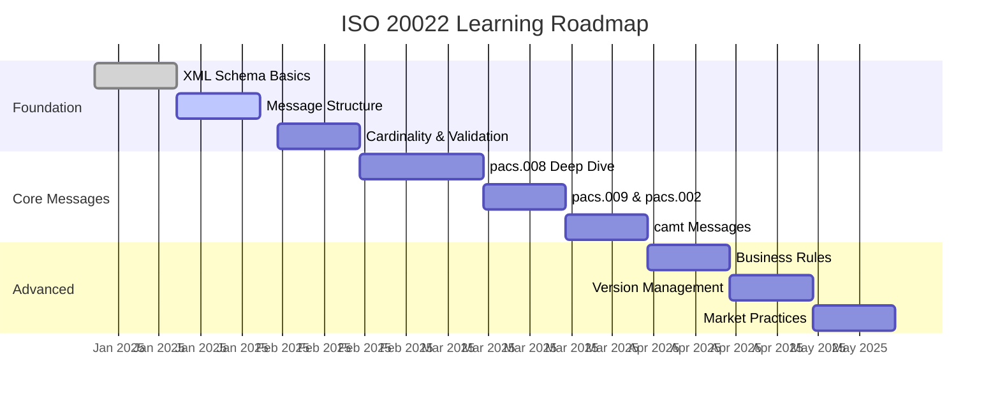

Implementing and operating an RTGS system requires specific ISO 20022 competencies—but not all knowledge is equally valuable. This guide clarifies what RTGS developers and architects actually need to master versus what can remain abstract.

## 1 The Reality Check

### 1.1 What Matters vs. What Doesn't



**The Core Principle:**

> An RTGS developer or architect needs a strong **practical understanding** of ISO 20022 message usage rather than deep **theoretical knowledge** of its UML modeling foundations.

This distinction shapes everything about how teams should approach learning and implementation.

### 1.2 Why This Distinction Matters

Many teams make the mistake of over-investing in theoretical ISO 20022 knowledge—spending weeks studying UML profiles, metamodels, and standards governance—when they should be focusing on:

| Over-Investment | Better Investment |
|-----------------|-------------------|
| Reading UML specifications | Working with actual pacs.008/pacs.009 messages |
| Understanding ASN.1 encoding | Mastering XML Schema validation |
| ISO committee processes | Market practice documents for your jurisdiction |
| Creating UML diagrams | Mapping messages to internal data models |

The result of misaligned learning: teams that can draw UML class diagrams but struggle to process a real payment message or diagnose a validation failure.

## 2 Essential Competencies by Role

### 2.1 Core Developer Skills

Every developer working on RTGS systems should master these fundamentals:



**Must-Have Skills:**

| Skill Area | What You Need | Why It Matters |
|------------|---------------|----------------|
| **MX Message Families** | Comfortable with `pacs`, `camt`, `admi` prefixes | These are the messages you'll process daily |
| **Message Structure** | Understand Group Header, Transaction Info, Party blocks | Core navigation for any processing logic |
| **Cardinality Rules** | Know mandatory vs. optional, single vs. repeating | Prevents validation errors and data loss |
| **XML Schema Validation** | Read XSD errors, understand namespaces | First line of defense against bad messages |
| **Business Rule Validation** | Schematron rules, market practices | Catches semantic errors schema can't |

**Example: Reading Cardinality Notation**

For a complete reference on cardinality rules, see **[ISO 20022 Cardinality Rules Deep Dive](/2025/12/Understanding-RTGS-Cardinality-Rules/)**.

*   **Note:** The table below provides a proposed example for reading cardinality notation for selected message elements. The specific elements and their cardinalities are illustrative.

```
┌─────────────────────────────────────────────────────────────┐
│ Element                    │ Cardinality │ Meaning          │
├─────────────────────────────────────────────────────────────┤
│ MsgId                      │ 1           │ Exactly one      │
│ CreDtTm                    │ 1           │ Exactly one      │
│ NbOfTxs                    │ 0..1        │ Zero or one      │
│ CdtTrfTxInf                │ 1..n        │ One or more      │
│ RmtInf                     │ 0..1        │ Optional         │
│ UltmtDbtr                  │ 0..1        │ Optional         │
│ PstlAdr                    │ 0..1        │ Optional         │
│ Ctry                       │ 0..1        │ Optional         │
└─────────────────────────────────────────────────────────────┘
```

**Practical Exercise:**

Given this pacs.008 snippet, identify validation issues:

*   **Note:** The XML snippet below is a proposed example for a practical exercise. This is a simplified and incomplete `pacs.008` message, designed to illustrate common validation issues.

```xml
<CdtTrfTxInf>
  <PmtId>
    <!-- TxId is mandatory - missing! -->
    <InstrId>INSTR-001</InstrId>
  </PmtId>
  
  <!-- IntrBkSttlmAmt is mandatory - missing! -->
  
  <DbtrAgt>
    <FinInstnId>
      <BICFI>BANKUS33XXX</BICFI>
    </FinInstnId>
  </DbtrAgt>
  
  <!-- CdtrAgt is mandatory - missing! -->
  
  <UltmtDbtr>
    <Nm>ABC Corp</Nm>
    <!-- Address is optional - this is valid -->
  </UltmtDbtr>
</CdtTrfTxInf>
```

### 2.2 Architect Skills

Architects and senior developers need the above plus strategic understanding:

**Additional Competencies:**

| Competency | Application |
|------------|-------------|
| **Message-to-Model Mapping** | Design internal data models that align with ISO 20022 structures |
| **Version Impact Analysis** | Assess how message version changes affect databases, APIs, workflows |
| **Extensibility Patterns** | Design systems that accommodate new message types without rewrites |
| **Standards Communication** | Liaise effectively with central banks, standards bodies, vendors |

**High-Level UML Awareness (Not Mastery):**

Architects benefit from understanding these concepts at a **conceptual level**:


| Concept | Why Architects Should Know | Depth Required |
|---------|---------------------------|----------------|
| **Business vs. Message Models** | Understand why messages are structured as they are | Conceptual |
| **Component Reuse** | Anticipate where changes propagate across messages | Conceptual |
| **Consistency Principles** | Predict patterns in new/updated messages | Conceptual |
| **UML Diagram Reading** | Review standards documentation when needed | Basic literacy |
| **UML Diagram Creation** | Not required for RTGS implementation | **Not needed** |

### 2.3 Skill Matrix Summary



## 3 Message Families You Must Know

### 3.1 Primary RTGS Message Families

| Family | Full Name | Purpose | Key Messages |
|--------|-----------|---------|--------------|
| **pacs** | Payments Clearing and Settlement | Payment processing | pacs.008, pacs.009, pacs.002, pacs.004 |
| **camt** | Cash Management | Account reporting, reconciliation | camt.053, camt.052, camt.054 |
| **admi** | Administration | System administration, notifications | admi.002, admi.004 |

### 3.2 Message Usage by RTGS Function

```mermaid
graph TB
    subgraph "Payment Processing"
        A1[pacs.008] --> A2[RTGS Core]
        A3[pacs.009] --> A2
        A2 --> A4[pacs.002]
    end
    
    subgraph "Liquidity Management"
        B1[pacs.009] --> B2[Liquidity Module]
        B2 --> B3[camt.052]
    end
    
    subgraph "Settlement"
        C1[pacs.008] --> C2[Settlement Engine]
        C2 --> C3[camt.053]
        C2 --> C4[camt.054]
    end
    
    subgraph "Exception Handling"
        D1[pacs.004] --> D2[Exception Handler]
        D2 --> D3[pacs.002]
    end
    
    subgraph "Reconciliation"
        E1[camt.053] --> E2[Reconciliation]
        E1 --> E3[admi.002]
    end
    
    style A2 fill:#1976d2,stroke:#0d47a1,color:#fff
    style B2 fill:#1976d2,stroke:#0d47a1,color:#fff
    style C2 fill:#1976d2,stroke:#0d47a1,color:#fff
    style D2 fill:#1976d2,stroke:#0d47a1,color:#fff
    style E2 fill:#1976d2,stroke:#0d47a1,color:#fff
```



### 3.3 Deep Dive: pacs.008 Structure

Understanding one message family deeply is better than superficial knowledge of many. Here's what a developer should know about pacs.008:

**Key Sections:**
*   **Note:** The ASCII art diagram below provides a proposed high-level breakdown of the `pacs.008` message structure. This is a simplified representation of the full message and its elements.

```
pacs.008.001.08
├── GroupHeader (GrpHdr)
│   ├── MsgId          ← Your message identifier (mandatory)
│   ├── CreDtTm        ← Creation timestamp (mandatory)
│   ├── NbOfTxs        ← Transaction count (optional)
│   └── SttlmInf       ← Settlement method (conditional)
│
└── CreditTransferTransactionInformation (CdtTrfTxInf) [1..n]
    ├── PmtId          ← Payment identifiers (mandatory)
    ├── PmtTpInf       ← Payment type (optional)
    ├── IntrBkSttlmAmt ← Amount (mandatory)
    ├── IntrBkSttlmDt  ← Settlement date (mandatory)
    ├── DbtrAgt        ← Debtor agent (mandatory)
    ├── CdtrAgt        ← Creditor agent (mandatory)
    ├── UltmtDbtr      ← Ultimate debtor (optional)
    ├── UltmtCdtr      ← Ultimate creditor (optional)
    └── RmtInf         ← Remittance info (optional)
```

**Critical Validation Points:**

| Element | Common Pitfall | Validation Rule |
|---------|----------------|-----------------|
| `MsgId` | Duplicate across messages | Must be unique per sender |
| `CreDtTm` | Wrong timezone | Should include timezone offset |
| `IntrBkSttlmAmt` | Missing currency attribute | `Ccy` attribute is mandatory |
| `BICFI` | Invalid format | Must be 8 or 11 characters |
| `Ctry` | Wrong code format | Must be ISO 3166-1 alpha-2 |

## 4 Message-to-Internal-Model Mapping

### 4.1 The Mapping Challenge

One of the most critical skills for RTGS developers is translating ISO 20022 messages into internal data models that support:

- Database persistence
- Business logic processing
- API exposure
- Audit logging
- Reporting

**The Mapping Process:**



### 4.2 Example: Party Information Mapping

**ISO 20022 Structure:**
*   **Note:** The XML snippet below is a proposed example of ISO 20022 party information structure. This is a simplified representation to illustrate mapping concepts.
```xml
<UltmtDbtr>
  <Nm>ABC Corporation</Nm>
  <PstlAdr>
    <StrtNm>Wall Street</StrtNm>
    <BldgNb>100</BldgNb>
    <PstCd>10005</PstCd>
    <TwnNm>New York</TwnNm>
    <Ctry>US</Ctry>
  </PstlAdr>
  <CtryOfRes>US</CtryOfRes>
</UltmtDbtr>
```

**Internal Domain Model:**
*   **Note:** The Java code snippet below provides a proposed example of an internal domain model for party information. The specific class structure and fields may vary based on the application's requirements.
```java
public class Party {
    private String name;
    private Address address;
    private String countryOfResidence;
    private String bic;
    private String lei;
}

public class Address {
    private String streetName;
    private String buildingNumber;
    private String postCode;
    private String townName;
    private String country;
    private List<String> addressLines;  // For unstructured addresses
}
```

**Database Schema:**
*   **Note:** The SQL code snippet below provides a proposed example of a database schema for storing party information. The specific table and column definitions may vary based on the database system and ORM used.
```sql
CREATE TABLE party (
    id              BIGSERIAL PRIMARY KEY,
    name            VARCHAR(255) NOT NULL,
    bic             VARCHAR(11),
    lei             VARCHAR(20),
    country_of_res  CHAR(2)
);

CREATE TABLE party_address (
    party_id        BIGINT REFERENCES party(id),
    street_name     VARCHAR(140),
    building_number VARCHAR(16),
    post_code       VARCHAR(16),
    town_name       VARCHAR(35),
    country         CHAR(2)
);
```

**Key Considerations:**

| Consideration | Question to Ask |
|---------------|-----------------|
| **Field Lengths** | Does our database allow full ISO 20022 lengths? |
| **Optionality** | How do we handle optional fields in queries? |
| **Repeating Elements** | Do we support arrays (e.g., multiple addresses)? |
| **Version Changes** | What happens when message versions add new fields? |
| **Validation** | Do we validate at the API layer or service layer? |

### 4.3 Impact of Message Version Changes

When ISO 20022 messages are updated, RTGS teams must assess:



**Real-World Example: pacs.008 v08 to v09**

| Change | Impact | Action Required |
|--------|--------|-----------------|
| New `ChrgsInf` element (optional) | Low | Add to model, ignore if not used |
| `UltmtDbtr` cardinality change | Medium | Update validation logic |
| New code values in enumerations | Low | Expand validation lists |
| Namespace change | High | Update XSD references, parsers |

## 5 Object-Oriented Thinking Without UML

### 5.1 What You Actually Need

You don't need to draw UML diagrams, but you do need an **object-oriented mindset**:



**Practical Skills:**

| UML Concept | Practical Equivalent |
|-------------|---------------------|
| Class | Domain object / entity class |
| Attribute | Property / field |
| Association | Reference / foreign key |
| Composition | Containment / parent-child |
| Multiplicity | Collection / nullable field |
| Inheritance | Class extension / polymorphism |

### 5.2 Tracing Elements to Business Meaning

When debugging or enhancing systems, you need to trace from technical elements back to business concepts:

```
┌─────────────────────────────────────────────────────────────────┐
│ Debugging Example: Payment Rejected                             │
├─────────────────────────────────────────────────────────────────┤
│ 1. Technical: pacs.002 status = RJCT                            │
│ 2. Element:   StsRsnInf.Rsn.Cd = "AM04"                         │
│ 3. Business:  "Insufficient amount for settlement"              │
│ 4. Root Cause: Debtor account balance < payment amount          │
│ 5. Action:    Check liquidity management, notify operations     │
└─────────────────────────────────────────────────────────────────┘
```

This traceability requires understanding **what each element represents**, not just its technical structure.

## 6 Learning Priorities and Roadmap

### 6.1 90-Day Learning Plan



### 6.2 Recommended Resources

| Resource Type | Examples | Priority |
|---------------|----------|----------|
| **Standards Documentation** | ISO 20022 schemas, MT-to-MX migration guides | High |
| **Market Practices** | Your central bank's implementation guidelines | High |
| **Hands-On Practice** | Sample messages, validation tools | High |
| **UML Specifications** | ISO 20022 metamodel documentation | Low |
| **Academic Papers** | Theoretical modeling approaches | Low |

### 6.3 Common Learning Mistakes

| Mistake | Better Approach |
|---------|-----------------|
| Starting with UML theory | Start with actual XML messages |
| Memorizing all message types | Master pacs.008/009/002 first |
| Ignoring market practices | Learn global standard + local variations |
| Treating XSD as optional | Make schema validation foundational |
| Over-engineering data models | Map directly to message structure initially |

## 7 Summary

!!!anote "📋 Key Takeaways"
    **Essential guidance for RTGS teams:**

    ✅ **Focus on Practical Skills**
    - MX message families (pacs, camt, admi)
    - XML Schema validation and debugging
    - Cardinality rules and mandatory elements
    - Message-to-data-model mapping

    ✅ **Role-Based Expectations**
    - Developers: Operational mastery of messages and validation
    - Architects: Conceptual understanding of modeling principles
    - Neither role requires UML diagram creation skills

    ✅ **System Implementation Priorities**
    - Map messages to internal data models carefully
    - Plan for version changes from the start
    - Maintain traceability from elements to business meaning
    - Design for extensibility without over-engineering

    ✅ **Learning Investment**
    - 80% hands-on message processing
    - 15% business rules and market practices
    - 5% conceptual modeling awareness

---

**Footnotes for this article:**

[^1]: **MX** - Message XML: ISO 20022 XML-based messages (vs. MT - Message Type)
[^2]: **pacs** - Payments Clearing and Settlement message family
[^3]: **camt** - Cash Management message family
[^4]: **admi** - Administration message family
[^5]: **XSD** - XML Schema Definition: Validation schema for XML documents
[^6]: **Cardinality** - Rules defining how many times an element can appear (0..1, 1..n, etc.)
