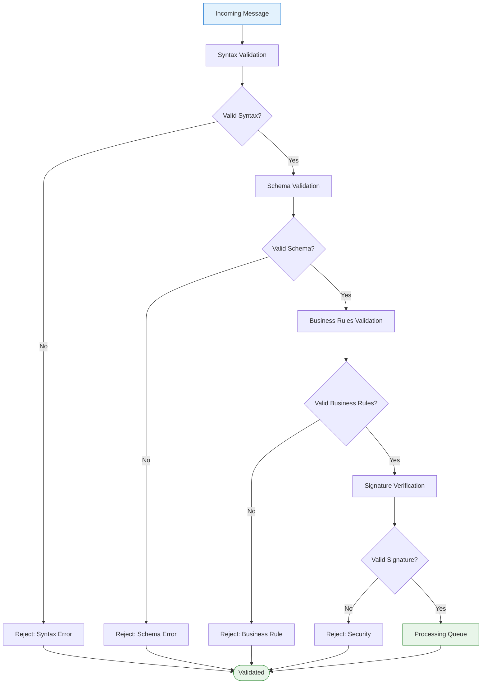
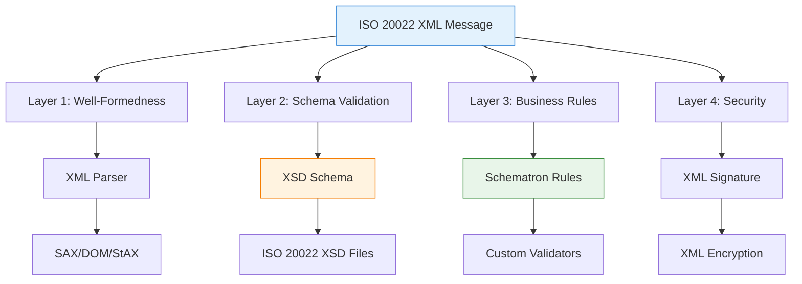
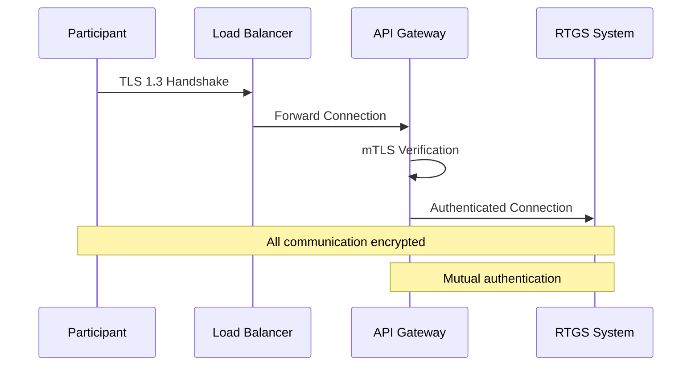
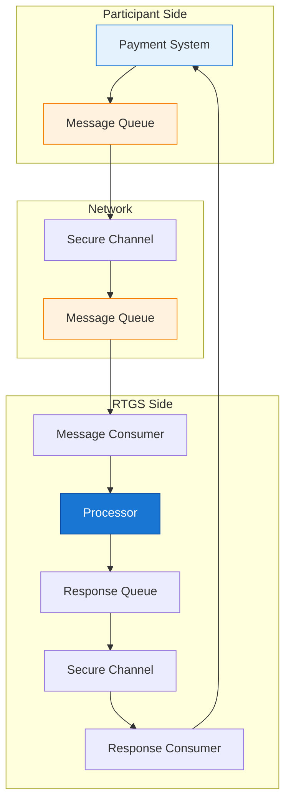
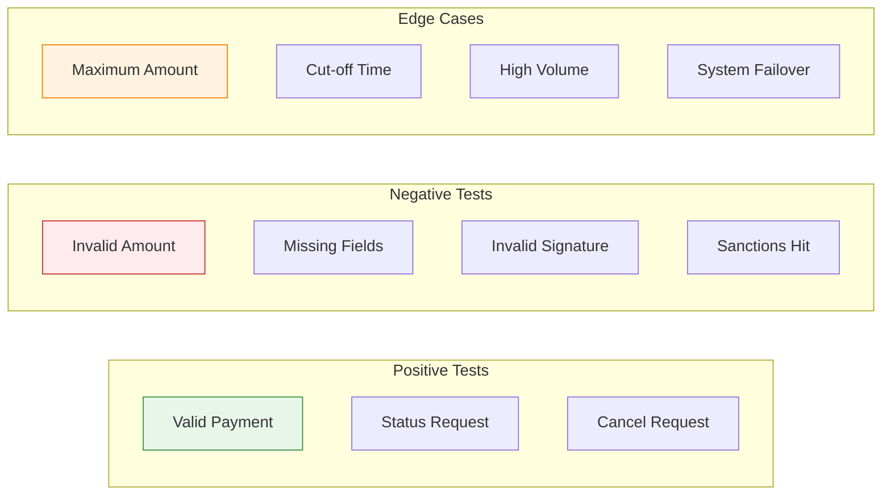

This article covers the technical implementation aspects of ISO 20022 messaging in RTGS systems.
## 1 Message Validation and Processing

### 1.1 Validation Layers



### 1.2 XML Validation Technologies

Since ISO 20022 messages are XML-based, multiple validation layers and technologies can be applied:



**1. XML Well-Formedness (Syntax)**

The first validation layer ensures the message is valid XML. XML parsers verify that the document follows proper XML syntax rules: all tags are properly opened and closed, nesting is correct, special characters are escaped, and the document has a single root element. Common XML parsers include libxml2 (C/C++), Xerces (Java/C++), and the built-in SAX/DOM parsers in Java and .NET. These parsers can operate in different modes: SAX (Simple API for XML) provides event-driven streaming for large documents, DOM (Document Object Model) loads the entire document into memory for random access, and StAX (Streaming API for XML) offers a pull-based approach that balances memory efficiency with programming convenience. Namespace validation is also performed at this layer to ensure all XML namespaces are properly declared and referenced.

| Technology | Purpose | Tools |
|------------|---------|-------|
| **XML Parser** | Parse and validate XML syntax | libxml2, Xerces, Java SAX/DOM |
| **DTD** | Document Type Definition (legacy) | Built into XML parsers |
| **Namespace Validation** | Verify XML namespaces | Standard parser feature |

**Example (Java):**
```java
DocumentBuilderFactory factory = DocumentBuilderFactory.newInstance();
factory.setNamespaceAware(true);
factory.setValidating(true);
DocumentBuilder builder = factory.newDocumentBuilder();
Document doc = builder.parse(new InputSource(new StringReader(xmlMessage)));
```

**2. XSD Schema Validation (Structure)**

Once well-formedness is confirmed, XSD (XML Schema Definition) validation verifies the message structure against the official ISO 20022 schema files. XSD defines the allowed element hierarchy, data types, and constraints. For ISO 20022 messages, this includes validating that required elements are present, elements appear in the correct order, data types match (e.g., currency codes must be exactly 3 uppercase letters, amounts must be decimal numbers, dates must follow ISO 8601 format), and cardinality constraints are respected (e.g., some elements can repeat, others cannot). The ISO 20022 XSD files are published by the standards body and are version-specific (e.g., `pacs.008.001.08.xsd` for version 08 of the Customer Credit Transfer message). Validation tools like lxml (Python), Java's built-in XSD validators, or .NET's XmlSchemaSet can be used to validate messages against these schemas. XSD provides strong structural validation but has limitations—it cannot express rules that compare values across different elements or enforce conditional logic based on element content.

| Feature | Description |
|---------|-------------|
| **Element Structure** | Required/optional elements, nesting, order |
| **Data Types** | String, decimal, date, dateTime, codes |
| **Constraints** | Min/max length, patterns, ranges |
| **Namespaces** | ISO 20022 namespace URIs |

**ISO 20022 XSD Example:**
```xml
<!-- pacs.008.001.08.xsd -->
<xs:schema xmlns:xs="http://www.w3.org/2001/XMLSchema"
           targetNamespace="urn:iso:std:iso:20022:tech:xsd:pacs.008.001.08">

  <xs:element name="Document" type="Document"/>

  <xs:complexType name="Document">
    <xs:sequence>
      <xs:element name="FIToFICstmrCdtTrf" type="FIToFICstmrCdtTrfV08"/>
    </xs:sequence>
  </xs:complexType>

  <xs:complexType name="FIToFICstmrCdtTrfV08">
    <xs:sequence>
      <xs:element name="GrpHdr" type="GroupHeaderV3"/>
      <xs:element name="CdtTrfTxInf" type="CreditTransferTransactionInformationV8" maxOccurs="unbounded"/>
    </xs:sequence>
  </xs:complexType>

  <xs:simpleType name="CurrencyCode">
    <xs:restriction base="xs:string">
      <xs:pattern value="[A-Z]{3,3}"/>
    </xs:restriction>
  </xs:simpleType>

</xs:schema>
```

**XSD Validation (Python):**
```python
from lxml import etree

# Load schema
with open('pacs.008.001.08.xsd', 'r') as f:
    schema_doc = etree.parse(f)
    schema = etree.XMLSchema(schema_doc)

# Validate message
try:
    msg_doc = etree.parse('payment.xml')
    schema.assertValid(msg_doc)
    print("Validation passed!")
except etree.XMLSchemaError as e:
    print(f"Validation failed: {e}")
```

**3. Schematron Validation (Business Rules)**

Schematron addresses the limitations of XSD by providing rule-based validation using XPath assertions. While XSD validates structure, Schematron validates business logic that spans multiple elements or requires conditional checks. For RTGS messages, typical Schematron rules include: verifying that settlement amounts are positive, ensuring settlement dates are not in the past, confirming that debtor and creditor agents are not identical (to prevent circular payments), and checking that currency codes match across related elements. Schematron rules are expressed as XPath assertions within XML, making them both human-readable and machine-executable. The ISO 20022 standard itself publishes Schematron rule sets alongside XSD schemas for many message types. This layer catches business logic errors that would pass XSD validation but represent invalid transactions.

| XSD Limitation | Schematron Solution |
|----------------|---------------------|
| Cannot compare element values | XPath assertions for cross-field validation |
| Limited conditional logic | Complex business rule expressions |
| Cannot check external references | Access to external data sources |

**Schematron Example:**
```xml
<?xml version="1.0" encoding="UTF-8"?>
<sch:schema xmlns:sch="http://purl.oclc.org/dsdl/schematron">
  <sch:pattern id="payment-rules">

    <!-- Amount must be positive -->
    <sch:rule context="pacs:IntrBkSttlmAmt">
      <sch:assert test="number(.) > 0">
        Settlement amount must be positive
      </sch:assert>
    </sch:rule>

    <!-- Settlement date cannot be in the past -->
    <sch:rule context="pacs:IntrBkSttlmDt">
      <sch:assert test=". >= current-date()">
        Settlement date cannot be in the past
      </sch:assert>
    </sch:rule>

    <!-- Debtor and Creditor cannot be the same -->
    <sch:rule context="pacs:CdtTrfTxInf">
      <sch:assert test="pacs:DbtrAgt/pacs:FinInstnId/pacs:BICFI != pacs:CdtrAgt/pacs:FinInstnId/pacs:BICFI">
        Debtor and Creditor agents cannot be identical
      </sch:assert>
    </sch:rule>

  </sch:pattern>
</sch:schema>
```

**4. XML Security Validation**

The final validation layer handles cryptographic security. XML Signature (XMLDSig) provides integrity and authenticity verification by digitally signing messages or specific elements within messages. The signature covers a canonicalized representation of the signed content, ensuring that any modification invalidates the signature. XML Encryption (XMLEnc) allows sensitive elements (such as account numbers or personal data) to be encrypted while leaving the rest of the message in plaintext. XAdES (XML Advanced Electronic Signatures) extends XMLDSig with additional features required for legal compliance in the EU and other jurisdictions, including long-term signature validation and certificate chain preservation. Security validation involves verifying signature chains, checking certificate validity and revocation status, and ensuring encryption algorithms meet current security standards.

| Technology | Purpose | Standard |
|------------|---------|----------|
| **XML Signature (XMLDSig)** | Digital signatures for integrity/authenticity | W3C Recommendation |
| **XML Encryption (XMLEnc)** | Encrypt sensitive elements | W3C Recommendation |
| **XAdES** | Advanced electronic signatures (EU compliance) | ETSI TS 101 903 |

**XML Signature Example:**
```xml
<Signature xmlns="http://www.w3.org/2000/09/xmldsig#">
  <SignedInfo>
    <CanonicalizationMethod Algorithm="http://www.w3.org/2001/10/xml-exc-c14n#"/>
    <SignatureMethod Algorithm="http://www.w3.org/2001/04/xmldsig-more#rsa-sha256"/>
    <Reference URI="#payment-001">
      <DigestMethod Algorithm="http://www.w3.org/2001/04/xmlenc#sha256"/>
      <DigestValue>abc123...</DigestValue>
    </Reference>
  </SignedInfo>
  <SignatureValue>xyz789...</SignatureValue>
  <KeyInfo>
    <X509Data>
      <X509Certificate>MIID...</X509Certificate>
    </X509Data>
  </KeyInfo>
</Signature>
```

### 1.3 Validation Framework Implementation

```java
// Conceptual validation framework
interface MessageValidator {

    /**
     * Validate message syntax (XML well-formedness)
     */
    ValidationResult validateSyntax(Message message);

    /**
     * Validate against XSD schema
     */
    ValidationResult validateSchema(Message message, String schemaVersion);

    /**
     * Validate business rules using Schematron
     */
    ValidationResult validateBusinessRules(Message message);

    /**
     * Validate digital signature
     */
    ValidationResult validateSignature(Message message, Certificate cert);

    /**
     * Validate against sanctions lists
     */
    ComplianceResult validateCompliance(Message message);
}
```

### 1.4 Error Handling

**Error Response Structure:**

```xml
<Document>
  <pacs.004>
    <TxInfAndSts>
      <OrgnlTxId>TRANSACTION-001</OrgnlTxId>

      <!-- Rejection Status -->
      <TxSts>RJCT</TxSts>

      <!-- Rejection Reason -->
      <StsRsnInf>
        <Rsn>
          <Cd>AM04</Cd>
          <!-- AM04 = Incorrect Amount -->
        </Rsn>
        <AddtlInf>
          Amount exceeds transaction limit
        </AddtlInf>
      </StsRsnInf>

      <!-- Original Message Reference -->
      <OrgnlGrpInf>
        <OrgnlMsgId>MSG-12345-2025</OrgnlMsgId>
        <OrgnlMsgNmId>pacs.008.001.08</OrgnlMsgNmId>
      </OrgnlGrpInf>
    </TxInfAndSts>
  </pacs.004>
</Document>
```

**Common Error Codes:**

| Code Category | Range | Examples |
|---------------|-------|----------|
| **Amount (AM)** | AM01-AM99 | AM04: Incorrect amount |
| **Customer (CU)** | CU01-CU99 | CU02: Invalid customer |
| **Technical (TE)** | TE01-TE99 | TE01: System error |
| **Settlement (SA)** | SA01-SA99 | SA01: Invalid account |
| **Regulatory (RV)** | RV01-RV99 | RV01: Sanctions check |

## 2 Communication Protocols

### 2.1 Transport Layer Security



### 2.2 API Standards

**RESTful API for RTGS:**

```yaml
# OpenAPI Specification Example
openapi: 3.0.0
info:
  title: RTGS Payment API
  version: 1.0.0

paths:
  /payments:
    post:
      summary: Submit Payment
      requestBody:
        content:
          application/xml:
            schema:
              $ref: '#/components/schemas/Pacs008'
      responses:
        '202':
          description: Accepted for Processing
          content:
            application/json:
              schema:
                $ref: '#/components/schemas/PaymentResponse'

  /payments/{transactionId}/status:
    get:
      summary: Get Payment Status
      parameters:
        - name: transactionId
          in: path
          required: true
      responses:
        '200':
          description: Status Retrieved
          content:
            application/xml:
              schema:
                $ref: '#/components/schemas/Pacs002'
```

### 2.3 Message Queue Integration



## 3 Testing and Certification

### 3.1 Testing Levels

| Level | Description | Tools |
|-------|-------------|-------|
| **Unit Testing** | Individual message validation | XML validators, Schema checkers |
| **Integration Testing** | End-to-end message flow | Test harnesses, Mock systems |
| **Conformance Testing** | Standard compliance | ISO certification tools |
| **Performance Testing** | Throughput and latency | Load testing tools |
| **Security Testing** | Encryption and authentication | Penetration testing |

### 3.2 Test Scenarios



**Positive Test Scenarios**

Positive tests verify that valid messages are processed correctly end-to-end:

| Test ID | Scenario | Input | Expected Result |
|---------|----------|-------|-----------------|
| POS-001 | Valid customer payment | pacs.008 with all required fields | Payment accepted, pacs.002 with ACSC status |
| POS-002 | Valid interbank transfer | pacs.009 between participating banks | Transfer settled, reserves updated |
| POS-003 | Payment status inquiry | pacs.002 request for known transaction | Status returned with current state |
| POS-004 | Valid cancellation request | pacs.004 for pending payment | Cancellation accepted, original payment reversed |
| POS-005 | Batch submission | Multiple payments in single batch | All valid payments processed, summary returned |
| POS-006 | Urgent payment | pacs.008 with priority=URGP | Payment expedited through priority queue |
| POS-007 | Future-dated payment | Settlement date > current date | Payment queued for future settlement |
| POS-008 | Cross-border payment | Different currency, correspondent banks | FX conversion applied, correspondent notified |

**Negative Test Scenarios**

Negative tests verify that invalid messages are properly rejected with appropriate error codes:

| Test ID | Scenario | Input | Expected Result |
|---------|----------|-------|-----------------|
| NEG-001 | Invalid XML syntax | Malformed XML document | Reject with syntax error |
| NEG-002 | Schema validation failure | Missing required element | Reject with schema error code |
| NEG-003 | Invalid currency code | Currency = "XXX" (not ISO 4217) | Reject with code validation error |
| NEG-004 | Negative amount | Amount = -100.00 | Reject with AM04 (incorrect amount) |
| NEG-005 | Zero amount | Amount = 0.00 | Reject with AM04 |
| NEG-006 | Amount exceeds limit | Amount > system maximum | Reject with limit exceeded error |
| NEG-007 | Invalid BIC code | BIC = "INVALID123" | Reject with invalid institution code |
| NEG-008 | Duplicate transaction ID | Same TxId as recent payment | Reject with duplicate reference |
| NEG-009 | Past settlement date | Settlement date < today | Reject with invalid date error |
| NEG-010 | Invalid signature | Tampered XML signature | Reject with security error |
| NEG-011 | Expired certificate | Signature cert expired | Reject with certificate validation error |
| NEG-012 | Sanctions hit | Debtor on OFAC list | Reject with compliance hold, alert generated |
| NEG-013 | Insufficient funds | Debtor balance < amount | Reject with insufficient liquidity |
| NEG-014 | Invalid message type | Unknown message identifier | Reject with unsupported message type |
| NEG-015 | Circular payment | Debtor agent = Creditor agent | Reject with business rule violation |

**Edge Case Scenarios**

Edge cases test system behavior at boundaries and under stress:

| Test ID | Scenario | Input | Expected Result |
|---------|----------|-------|-----------------|
| EDGE-001 | Maximum amount | Amount = system maximum | Payment processed successfully |
| EDGE-002 | Maximum decimal precision | Amount = 100.005 (3 decimals) | Rounded or rejected per currency rules |
| EDGE-003 | Maximum name length | Party name = 140 characters | Truncated or accepted per schema |
| EDGE-004 | Cut-off time boundary | Submission at exactly cut-off time | Processed or queued per policy |
| EDGE-005 | Just after cut-off | Submission 1 second after cut-off | Queued for next business day |
| EDGE-006 | Weekend submission | Payment on Saturday | Queued for next business day |
| EDGE-007 | Holiday submission | Payment on bank holiday | Queued for next business day |
| EDGE-008 | High volume burst | 10,000 payments in 1 second | All processed within SLA, no data loss |
| EDGE-009 | Sustained load | Maximum throughput for 1 hour | System stable, performance within bounds |
| EDGE-010 | Primary system failure | Kill primary node during processing | Failover to secondary, no transaction loss |
| EDGE-011 | Network partition | Isolate node from cluster | Node gracefully stops, cluster continues |
| EDGE-012 | Database connection loss | Drop DB connection mid-transaction | Transaction rolled back, retry succeeds |
| EDGE-013 | Clock skew | Server clock 5 seconds ahead | NTP sync, timestamps corrected |
| EDGE-014 | Large batch | 10,000 transactions in single batch | Batch processed, partial failures handled |
| EDGE-015 | Unicode characters | Names with emoji, CJK, RTL text | Properly stored and displayed |

**Compliance Test Scenarios**

Compliance tests verify regulatory and audit requirements:

| Test ID | Scenario | Input | Expected Result |
|---------|----------|-------|-----------------|
| COMP-001 | AML screening | Payment with high-risk country | Enhanced due diligence triggered |
| COMP-002 | PEP detection | Beneficiary is politically exposed | Flagged for manual review |
| COMP-003 | Transaction monitoring | Structured payments (just under threshold) | Pattern detected, alert generated |
| COMP-004 | Audit trail | Any valid payment | Complete audit log with timestamps |
| COMP-005 | Data retention | Query payment from 7 years ago | Retrieved from archive per retention policy |
| COMP-006 | Right to erasure | GDPR deletion request (where applicable) | Personal data anonymized, transaction preserved |
| COMP-007 | Regulatory reporting | End-of-day batch | Reports generated for central bank |

**Performance Test Scenarios**

Performance tests validate system meets throughput and latency requirements:

| Test ID | Scenario | Metric | Target |
|---------|----------|--------|--------|
| PERF-001 | Single payment latency | P99 response time | < 500ms |
| PERF-002 | Batch processing | Payments per second | > 1,000 pps |
| PERF-003 | Peak load | Sustained throughput at 2x normal | No degradation |
| PERF-004 | Database query | Status lookup latency | < 100ms |
| PERF-005 | Message queue | Queue depth under load | < 1000 messages |
| PERF-006 | API rate limiting | Requests above threshold | Throttled with 429 response |
| PERF-007 | Memory usage | Heap under sustained load | < 80% of allocated |
| PERF-008 | CPU utilization | Under peak load | < 70% average |

## 4 Summary

!!!anote "📋 Key Takeaways"
    **Essential implementation knowledge:**

    ✅ **XML Validation Stack**
    - XML parsers for well-formedness (SAX, DOM, StAX)
    - XSD schemas for structure validation
    - Schematron for business rules
    - XMLDSig/XMLEnc for security

    ✅ **Validation Technologies**
    - libxml2, Xerces for parsing
    - lxml, Java XML libraries for XSD
    - ISO 20022 XSD files from standards body
    - Custom Schematron rules for business logic

    ✅ **Communication Protocols**
    - TLS 1.3 with mTLS for transport security
    - RESTful APIs with OpenAPI specifications
    - Message queues for reliable delivery

    ✅ **Testing Requirements**
    - Unit, integration, conformance testing
    - Performance and security testing
    - Comprehensive test scenarios

---

**Footnotes for this article:**

[^1]: **XML** - Extensible Markup Language: Markup language used for ISO 20022 messages
[^2]: **XSD** - XML Schema Definition: W3C standard for XML schema validation
[^3]: **SAX** - Simple API for XML: Event-driven XML parsing approach
[^4]: **DOM** - Document Object Model: Tree-based XML parsing approach
[^5]: **StAX** - Streaming API for XML: Pull-based XML parsing approach
[^6]: **Schematron** - Rule-based XML validation language using XPath assertions
[^7]: **XMLDSig** - XML Signature: W3C standard for XML digital signatures
[^8]: **XMLEnc** - XML Encryption: W3C standard for XML encryption
[^9]: **XAdES** - XML Advanced Electronic Signatures: ETSI standard for qualified signatures
[^10]: **mTLS** - Mutual TLS: TLS where both parties authenticate each other
[^11]: **TLS** - Transport Layer Security: Cryptographic protocol for secure communications
[^12]: **API** - Application Programming Interface: Interface for software components to communicate
[^13]: **OpenAPI** - OpenAPI Specification: Standard for describing REST APIs
[^14]: **XPath** - XML Path Language: Query language for selecting XML nodes
