This article traces the complete lifecycle of a payment message through an RTGS system. For background on message formats, see [Understanding RTGS: Message Standards and Protocols](/2025/12/Understanding-RTGS-Message-Standards/). For technical implementation details, see [Understanding RTGS: Message Implementation and Validation](/2025/12/Understanding-RTGS-Message-Implementation/).

## 1 Overview: The Message Lifecycle

A payment message in an RTGS system follows a well-defined journey from initiation to final settlement. Understanding this lifecycle is essential for developers, operations teams, and compliance officers.

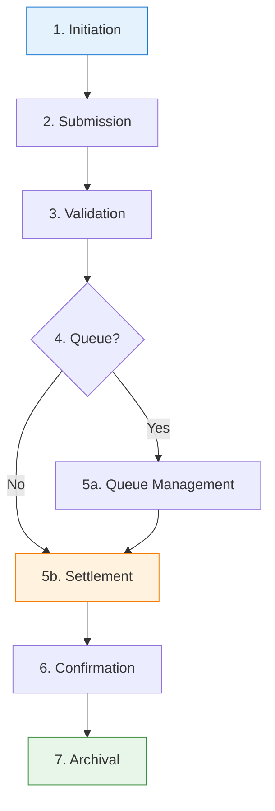

**The Seven Stages:**

| Stage | Name | Duration | Key Actors |
|-------|------|----------|------------|
| 1 | Initiation | Variable | Payer, Originating Bank |
| 2 | Submission | < 100ms | Participant System, API Gateway |
| 3 | Validation | < 500ms | Validation Engine |
| 4 | Queue Decision | < 50ms | Queue Manager |
| 5 | Settlement | < 1 second | Settlement Engine |
| 6 | Confirmation | < 200ms | Notification Service |
| 7 | Archival | Years | Database, Archive System |

---

## 2 Stage 1: Payment Initiation

The lifecycle begins when a payer initiates a payment through their bank.

### 2.1 Initiation Channels

Payment initiation occurs through diverse channels depending on the payer type and use case. Corporate customers typically use host-to-host connections for automated high-volume payments, while retail customers access payment services through branch counters, online banking portals, or mobile applications. Financial market infrastructure such as securities settlement systems and central counterparties initiate payments for trade settlement. Government systems use RTGS for tax collections and benefit disbursements. Each channel has different requirements for authentication, authorization workflows, and message formatting, but all ultimately result in the same ISO 20022 message being sent to the RTGS system.

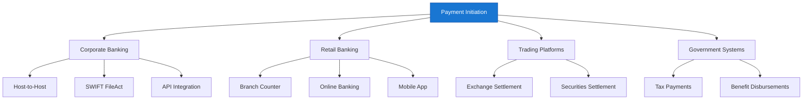

### 2.2 Message Creation

The originating bank creates an ISO 20022 message (typically pacs.008 for customer payments):

```xml
<?xml version="1.0" encoding="UTF-8"?>
<Document xmlns="urn:iso:std:iso:20022:tech:xsd:pacs.008.001.08">
  <FIToFICstmrCdtTrf>
    <!-- Message created by originating bank -->
    <GrpHdr>
      <MsgId>ORIG-BANK-MSG-001</MsgId>
      <CreDtTm>2025-12-10T09:15:00Z</CreDtTm>
      <NbOfTxs>1</NbOfTxs>
      <SttlmInf>
        <SttlmMtd>INDA</SttlmMtd>
      </SttlmInf>
    </GrpHdr>

    <CdtTrfTxInf>
      <PmtId>
        <TxId>TXN-2025-001</TxId>
      </PmtId>

      <!-- Amount to settle -->
      <IntrBkSttlmAmt Ccy="USD">5000000.00</IntrBkSttlmAmt>
      <IntrBkSttlmDt>2025-12-10</IntrBkSttlmDt>

      <!-- Debtor (Sender) Bank -->
      <DbtrAgt>
        <FinInstnId>
          <BICFI>ORIGUS33XXX</BICFI>
        </FinInstnId>
      </DbtrAgt>

      <!-- Creditor (Receiver) Bank -->
      <CdtrAgt>
        <FinInstnId>
          <BICFI>DESTGB2LXXX</BICFI>
        </FinInstnId>
      </CdtrAgt>

      <!-- Ultimate parties -->
      <UltmtDbtr>
        <Nm>ABC Corporation</Nm>
      </UltmtDbtr>
      <UltmtCdtr>
        <Nm>XYZ Limited</Nm>
      </UltmtCdtr>
    </CdtTrfTxInf>
  </FIToFICstmrCdtTrf>
</Document>
```

### 2.3 Digital Signing

Before submission, the message is digitally signed to ensure authenticity and integrity:

```
┌─────────────────────────────────────────────────────────┐
│  Message Signing Process                                │
├─────────────────────────────────────────────────────────┤
│  1. Generate SHA-256 hash of XML content                │
│  2. Sign hash with bank's private key (RSA/ECDSA)       │
│  3. Embed XML Signature in message                      │
│  4. Attach signing certificate                          │
│  5. Include certificate chain                           │
└─────────────────────────────────────────────────────────┘
```

---

## 3 Stage 2: Message Submission

The signed message is transmitted from the participant bank to the RTGS system.

### 3.1 Submission Channels

| Channel | Protocol | Use Case |
|---------|----------|----------|
| **API Gateway** | HTTPS/REST | Real-time submissions |
| **Message Queue** | AMQP/JMS | Batch submissions |
| **SWIFT Interface** | SWIFTNet | Cross-border submissions |
| **File Transfer** | SFTP/FTPS | Bulk file uploads |

### 3.2 Submission Flow

The submission flow ensures secure, reliable message delivery from the participant bank to the RTGS system. The process begins with an HTTPS POST request to the API gateway, which serves as the single entry point for all submissions. The load balancer distributes incoming requests across multiple gateway instances to handle high volumes. The API gateway performs TLS termination to decrypt the message, validates rate limits to prevent abuse, and enqueues the message for processing. Upon successful queuing, the gateway returns an HTTP 202 Accepted response to the sender, acknowledging receipt without guaranteeing immediate processing. This asynchronous design allows the system to handle traffic spikes while maintaining reliability.

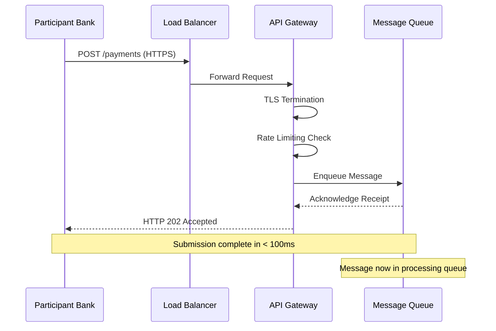

### 3.3 Submission Response

```json
{
  "status": "ACCEPTED",
  "messageId": "RTGS-2025-12-10-001234",
  "originalMessageId": "ORIG-BANK-MSG-001",
  "timestamp": "2025-12-10T09:15:00.123Z",
  "estimatedProcessingTime": "2025-12-10T09:15:00.500Z"
}
```

---

## 4 Stage 3: Message Validation

The RTGS system performs multi-layer validation before processing the payment.

### 4.1 Validation Pipeline

The validation pipeline implements a defense-in-depth strategy where each layer catches different types of errors before the payment proceeds. Early layers (XML well-formedness, XSD schema) are fast and reject obviously malformed messages. Middle layers (business rules, security) validate the semantic correctness and authenticity of the message. The final compliance layer screens against regulatory requirements. This layered approach ensures that expensive operations like sanctions screening only run on messages that have passed all prior checks. Messages flow through the pipeline sequentially, with rejection at any stage halting further processing and triggering an error response to the sender.

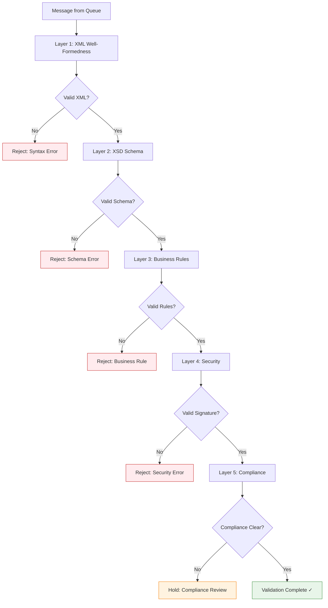

### 4.2 Validation Layers Detail

Each validation layer serves a specific purpose and uses specialized technology optimized for that task. XML well-formedness checking is the fastest layer, performed by streaming parsers that can process megabytes of XML per second. XSD schema validation is more computationally intensive as it must verify complex type constraints and element relationships. Business rules validation using Schematron allows expressive XPath-based assertions that can span multiple elements. Security validation involves cryptographic operations including signature verification and certificate chain validation, which require access to PKI infrastructure. Compliance screening may query external sanctions databases and apply machine learning models for anomaly detection, making it the most variable layer in terms of processing time.

| Layer | Validates | Technology | Duration |
|-------|-----------|------------|----------|
| **1. XML Well-Formedness** | Syntax, namespaces, encoding | XML Parser (SAX/DOM) | < 10ms |
| **2. XSD Schema** | Structure, data types, cardinality | XML Schema Validator | < 50ms |
| **3. Business Rules** | Amount limits, date validity, party relationships | Schematron, Custom Code | < 200ms |
| **4. Security** | Digital signature, certificate validity | XMLDSig, PKI | < 100ms |
| **5. Compliance** | Sanctions lists, PEP screening | AML/KYC Systems | < 500ms |

### 4.3 Validation Outcomes

After passing through all validation layers, a message receives one of four possible outcomes. A PASS result means the message is valid and proceeds to settlement. A REJECT result indicates a fatal error that cannot be resolved without sender intervention; the message is returned with an error code. A HOLD result applies to compliance-related issues requiring manual review by a human analyst; the message remains in a pending state until released or rejected. A DEFER result applies to timing-related conditions such as cut-off times or system maintenance; the message is queued for automatic retry when conditions change.

```
┌─────────────────────────────────────────────────────────┐
│  Possible Validation Results                            │
├─────────────────────────────────────────────────────────┤
│  ✓ PASS    → Forward to Settlement                      │
│  ✗ REJECT  → Return error to sender                     │
│  ⚠ HOLD    → Queue for manual review (compliance)       │
│  ⏸ DEFER   → Queue for later processing (cut-off)       │
└─────────────────────────────────────────────────────────┘
```

---

## 5 Stage 4: Queue Decision

After validation, the system determines whether the payment can settle immediately or must be queued.

### 5.1 Queue Decision Logic

Not all validated payments can settle immediately. The queue decision logic evaluates three critical conditions in sequence. First, it checks whether the settlement date matches the current business day; future-dated payments are held until their scheduled date. Second, it verifies whether the submission occurred before the daily cut-off time; late submissions are deferred to the next business day. Third, and most critically, it checks whether the sender has sufficient liquidity to cover the payment amount. Only payments that pass all three conditions proceed directly to settlement; all others are routed to the appropriate queue for later processing.

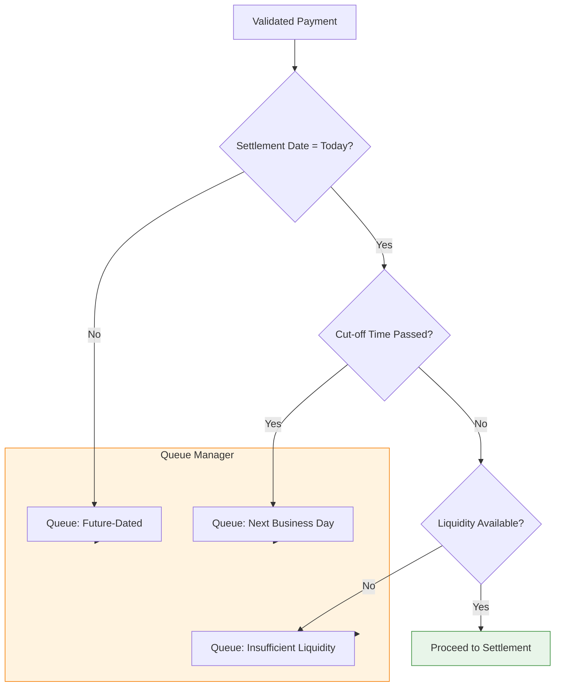

### 5.2 Queue Types

The RTGS system maintains multiple queues, each serving a distinct purpose with different release mechanisms. Future-dated queues automatically release payments when the settlement date arrives. Cut-off queues release at the start of the next business day. Liquidity queues are the most complex, as they continuously monitor the sender's account balance and release payments when sufficient funds become available, often through incoming payments or liquidity top-ups. Compliance queues require manual intervention by compliance officers who review flagged transactions and decide whether to release or reject. Technical queues handle system outages and automatically retry when services are restored.

| Queue Type | Reason | Resolution |
|------------|--------|------------|
| **Future-Dated** | Settlement date > today | Auto-release on settlement date |
| **Cut-Off** | Submitted after daily cut-off | Process next business day |
| **Liquidity** | Insufficient sender balance | Wait for incoming funds or top-up |
| **Compliance** | AML/sanctions review needed | Manual review and release |
| **Technical** | System maintenance/unavailable | Retry when system available |

### 5.3 Queue Management

The queue manager continuously monitors all queued payments and evaluates release conditions in real-time. For liquidity queues, this involves tracking incoming payments that may free up sufficient balance for queued outbound payments. The queue manager also handles priority overrides, where certain payments (such as urgent market operations or time-critical settlements) can be expedited ahead of normal-priority payments. Sophisticated queue management algorithms optimize settlement throughput by identifying cycles of interdependent payments that can be settled together, maximizing liquidity efficiency across the system.

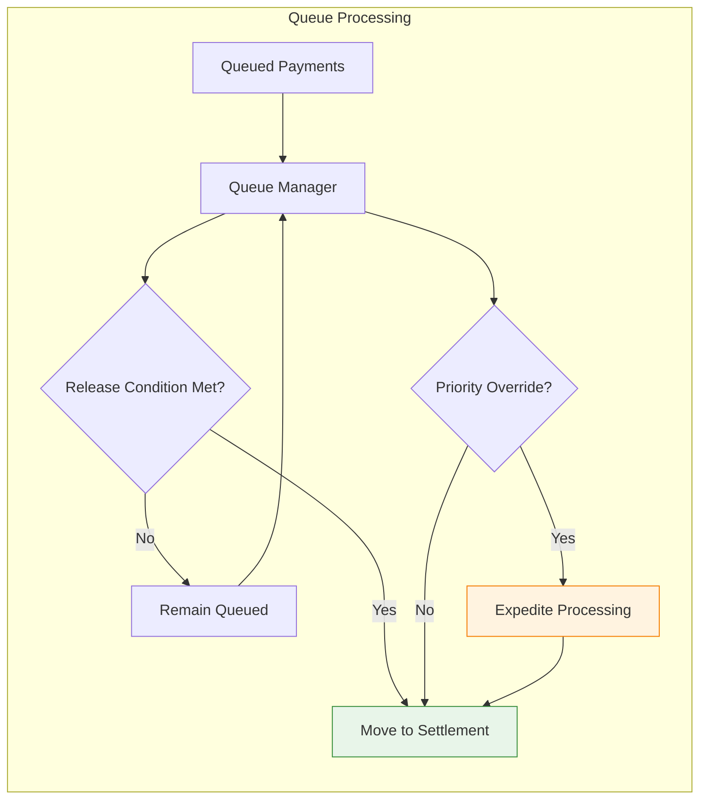

---

## 6 Stage 5: Settlement Execution

The core RTGS function: transferring funds between participant accounts.

### 6.1 Settlement Process

Settlement is the heart of the RTGS system, where actual fund transfers occur between participant banks. The settlement engine coordinates with the account manager to verify balances, execute debits and credits, and update the general ledger. The process follows strict atomicity guarantees: either all steps complete successfully, or the entire transaction rolls back with no partial effects. The settlement engine also enforces the principle of finality—once settlement completes, it cannot be undone. This finality is what distinguishes RTGS from net settlement systems and provides certainty to participants that received funds are definitively theirs.

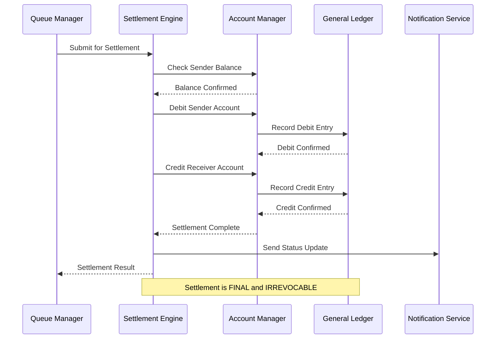

### 6.2 Account Movements

Settlement involves simultaneous movements in two participant accounts: a debit to the sender's reserve account and a credit to the receiver's reserve account. These accounts are held at the central bank and represent the bank's claim on central bank money. The settlement engine ensures both legs of the transfer occur atomically—the sender's account is debited and the receiver's account is credited in the same operation. Each movement is recorded in the general ledger with a unique settlement ID, creating an immutable audit trail. The account movement diagrams illustrate how balances change instantaneously at the moment of settlement.

**Before Settlement:**
```
┌─────────────────────────────────────────────────────────┐
│  Sender Bank (ORIGUS33XXX)     Receiver Bank (DESTGB2L) │
│  Balance: $50,000,000          Balance: $30,000,000     │
│                                                         │
│  Payment Amount: $5,000,000                             │
└─────────────────────────────────────────────────────────┘
```

**After Settlement:**
```
┌─────────────────────────────────────────────────────────┐
│  Sender Bank (ORIGUS33XXX)     Receiver Bank (DESTGB2L) │
│  Balance: $45,000,000          Balance: $35,000,000     │
│  Change: -$5,000,000           Change: +$5,000,000      │
│                                                         │
│  Settlement Time: 09:15:00.456Z                         │
│  Settlement ID: STTL-2025-12-10-001234                  │
└─────────────────────────────────────────────────────────┘
```

### 6.3 Settlement Properties

RTGS settlement is characterized by five fundamental properties that define its role in the financial system. Real-time processing means payments settle individually as they arrive, not in batches at predetermined times. Gross settlement means each payment is processed in full without netting against other payments. Finality means that once settlement occurs, it is unconditional and cannot be revoked. Irrevocability means the sender cannot cancel the payment after settlement. Unconditionality means settlement is not subject to any conditions or contingencies. These properties collectively provide the certainty and finality that financial markets require for high-value transactions.

| Property | Description |
|----------|-------------|
| **Real-Time** | Settlement occurs immediately, not batched |
| **Gross** | Each payment settled individually, not netted |
| **Final** | Settlement cannot be reversed once complete |
| **Irrevocable** | Sender cannot cancel after settlement |
| **Unconditional** | No conditions attached to settlement |

---

## 7 Stage 6: Confirmation and Notification

After settlement, all relevant parties are notified of the outcome.

### 7.1 Status Message Generation

The RTGS system generates a pacs.002 Payment Status Report:

```xml
<?xml version="1.0" encoding="UTF-8"?>
<Document xmlns="urn:iso:std:iso:20022:tech:xsd:pacs.002.001.10">
  <FIToFIPmtStsRpt>
    <GrpHdr>
      <MsgId>RTGS-STATUS-001234</MsgId>
      <CreDtTm>2025-12-10T09:15:01Z</CreDtTm>
    </GrpHdr>

    <OrgnlGrpInf>
      <OrgnlMsgId>ORIG-BANK-MSG-001</OrgnlMsgId>
      <OrgnlMsgNmId>pacs.008.001.08</OrgnlMsgNmId>
    </OrgnlGrpInf>

    <TxInfAndSts>
      <OrgnlTxId>TXN-2025-001</OrgnlTxId>

      <!-- Settlement Status -->
      <TxSts>ACSC</TxSts>
      <!-- ACSC = Accepted Settlement Completed -->

      <StsRsnInf>
        <Rsn>
          <Cd>SETC</Cd>
          <!-- SETC = Settlement Completed -->
        </Rsn>
      </StsRsnInf>

      <!-- Settlement Details -->
      <SttlmInf>
        <SttlmSts>STLD</SttlmSts>
        <SttlmAcct>
          <Id>
            <IBAN>US1234567890</IBAN>
          </Id>
        </SttlmAcct>
      </SttlmInf>

      <!-- Original Amount -->
      <IntrBkSttlmAmt Ccy="USD">5000000.00</IntrBkSttlmAmt>
      <SttlmDt>2025-12-10</SttlmDt>
    </TxInfAndSts>
  </FIToFIPmtStsRpt>
</Document>
```

### 7.2 Status Code Meanings

ISO 20022 defines standardized status codes that communicate the current state of a payment throughout its lifecycle. These codes follow a consistent pattern: the first two letters indicate the general status (AC = Accepted, RJ = Rejected, PD = Pending, CA = Cancelled), and the remaining letters provide specific details. Understanding these codes is essential for operations teams monitoring payment flows and for developers building payment tracking interfaces. The status code is included in every pacs.002 message and provides an unambiguous indication of whether the payment succeeded, failed, or awaits further action.

| Code | Meaning | Stage |
|------|---------|-------|
| **ACCP** | Accepted Customer Profile | After validation |
| **ACSP** | Accepted Settlement in Process | Queued for settlement |
| **ACSC** | Accepted Settlement Completed | Settlement finished |
| **RJCT** | Rejected | Validation/settlement failed |
| **PDNG** | Pending | Awaiting processing |
| **CANC** | Cancelled | Payment cancelled |

### 7.3 Notification Distribution

Once settlement completes, notifications fan out to multiple parties through parallel distribution channels. The sender bank receives confirmation for their records and to notify their customer. The receiver bank is notified to credit the ultimate beneficiary's account. Central bank records are updated for regulatory oversight and monetary policy purposes. In many cases, the notification chain extends further: commercial banks trigger notifications to their customers through online banking portals, mobile apps, or treasury management systems. This distributed notification architecture ensures all stakeholders have timely, consistent information about payment status.

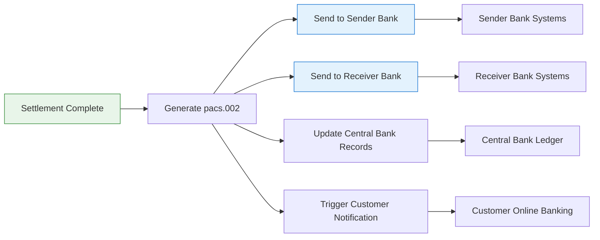

---

## 8 Stage 7: Archival and Audit

All payment data is archived for regulatory compliance and audit purposes.

### 8.1 Data Retention Requirements

Regulatory frameworks worldwide mandate minimum retention periods for payment records, driven by anti-money laundering regulations, tax laws, and banking supervision requirements. Retention periods vary by jurisdiction, ranging from 5 to 7 years minimum. The requirements extend beyond simple transaction records to include all supporting documentation: original messages, status updates, validation results, compliance screening records, and audit trails. Modern RTGS systems implement tiered storage strategies, keeping recent data on high-performance storage for quick access while archiving older records to lower-cost systems. GDPR and similar privacy regulations add complexity by requiring balancing retention obligations against data minimization principles.

| Jurisdiction | Minimum Retention | Requirements |
|--------------|-------------------|--------------|
| **United States** | 5 years | FFIEC, SAR records |
| **European Union** | 5 years | AMLD, GDPR compliance |
| **United Kingdom** | 6 years | FCA, PRA requirements |
| **Singapore** | 5 years | MAS guidelines |
| **Hong Kong** | 7 years | HKMA requirements |

### 8.2 Archived Data Elements

The archived payment record is a comprehensive snapshot of the entire payment lifecycle, preserving not just the transaction details but the complete context in which it occurred. The original pacs.008 message captures the sender's intent and payment instructions. Status messages (pacs.002) document the journey through the system. Validation results provide evidence of due diligence and rule enforcement. Settlement details establish the definitive record of fund movements. Digital signatures and certificates prove authenticity and non-repudiation. The audit trail captures the who, what, when of every action. Compliance screening results demonstrate regulatory adherence. Queue history shows any delays and their reasons. Together, these elements create an immutable, court-admissible record.

```
┌─────────────────────────────────────────────────────────┐
│  Archived Payment Record                                │
├─────────────────────────────────────────────────────────┤
│  • Original message (pacs.008)                          │
│  • Status messages (pacs.002)                           │
│  • Validation results and error codes                   │
│  • Settlement details (timestamp, accounts, amounts)    │
│  • Digital signatures and certificates                  │
│  • Audit trail (who, what, when)                        │
│  • Compliance screening results                         │
│  • Queue history (if applicable)                        │
└─────────────────────────────────────────────────────────┘
```

### 8.3 Audit Trail

The audit trail is a chronological, append-only log that records every significant event in a payment's lifecycle. Each log entry captures five essential elements: a precise timestamp (typically with millisecond accuracy), the actor or component that performed the action, a description of the action taken, the result or outcome, and a correlation ID linking related entries across distributed systems. Audit trails serve multiple purposes: operational debugging, forensic investigation, regulatory examination, and legal proceedings. To maintain integrity, audit logs are written to write-once-read-many (WORM) storage that prevents tampering or deletion. Modern systems also replicate audit logs to geographically distributed locations for disaster recovery.

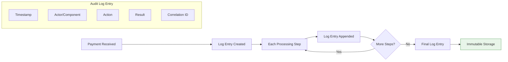

---

## 9 Exception Handling

Not all payments complete successfully. This section covers exception scenarios.

### 9.1 Exception Types and Handling

Exception handling is a critical capability of RTGS systems, ensuring that problems are detected, communicated, and resolved appropriately. Each exception type requires a specific handling strategy tailored to its nature and severity. Validation errors result in immediate rejection with detailed error codes so senders can correct and resubmit. Liquidity shortages trigger queuing with automatic retry when funds arrive. Compliance hits require human judgment and may involve escalation to authorities. System failures demand automatic rollback and recovery procedures to maintain data integrity. The exception handling framework ensures no payment is lost or silently dropped—every payment either completes successfully or returns to the sender with a clear explanation.

| Exception | Stage | Handling |
|-----------|-------|----------|
| **Invalid Message** | Validation | Reject with error code, notify sender |
| **Insufficient Liquidity** | Queue | Hold in queue, retry when funds available |
| **Sanctions Hit** | Compliance | Hold for manual review, escalate if confirmed |
| **System Failure** | Settlement | Rollback, retry on recovery, notify parties |
| **Cut-off Exceeded** | Queue | Defer to next business day |
| **Duplicate Payment** | Validation | Reject duplicate, flag for investigation |
| **Receiver Unknown** | Settlement | Return to sender with error |

### 9.2 Payment Cancellation Flow

Payment cancellation is governed by the principle of finality: queued payments can be cancelled, but settled payments cannot. When a sender bank submits a cancellation request (pacs.004), the RTGS system first checks the current status of the original payment. If the payment remains in a queue (typically due to insufficient liquidity), the cancellation succeeds and the payment is removed from the queue. If settlement has already occurred, the cancellation request is rejected because settlement is final and irrevocable. In cases where funds must be returned after settlement, the receiver bank must initiate a new payment (return) rather than a cancellation. This distinction preserves the legal certainty of RTGS settlement.

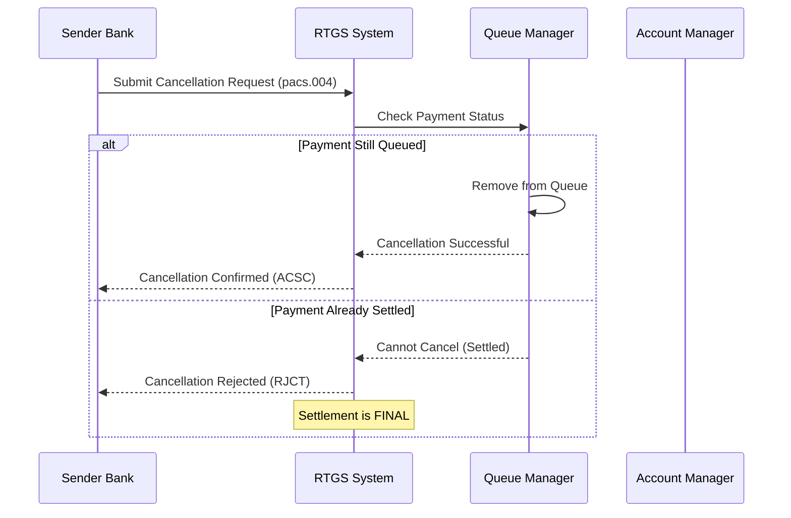

### 9.3 Payment Return Flow

Payment returns address situations where a settled payment cannot be credited to the intended beneficiary. Common scenarios include incorrect account numbers, closed accounts, or unidentified beneficiaries. Unlike cancellations, returns occur after settlement and therefore require reversing the original fund movement. The receiver bank initiates the return by sending a message to the RTGS system, which reverses the settlement by debiting the receiver's account and crediting the sender's account. The return message includes a reason code explaining why the original payment could not be applied, enabling the sender to investigate and potentially resubmit with corrected information. Returns demonstrate that while settlement is final, the system provides mechanisms to correct genuine errors.

When a payment cannot be credited to the ultimate beneficiary:

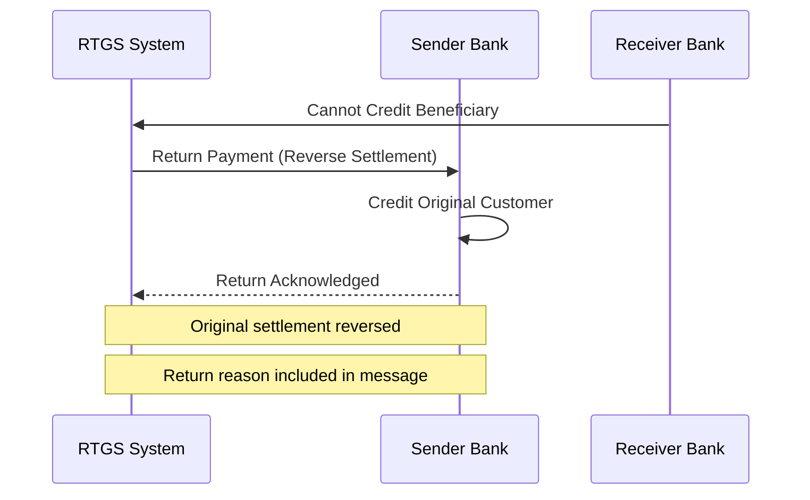

---

## 10 Complete Lifecycle Example

Let's trace a real payment through all stages:

### 10.1 Scenario: Corporate Payment

This example traces a realistic high-value corporate payment through all seven lifecycle stages, illustrating typical processing times and events. The scenario involves a USD 5 million invoice payment between two corporations banking at different institutions—a common use case for RTGS systems. The payment is initiated during normal business hours with sufficient liquidity, representing the "happy path" where no exceptions occur. Understanding this baseline flow helps identify where and how exceptions might arise in alternative scenarios.

**Payment Details:**
- Amount: USD 5,000,000
- Sender: ABC Corporation (bank: ORIGUS33XXX)
- Receiver: XYZ Limited (bank: DESTGB2LXXX)
- Purpose: Invoice payment
- Initiated: 2025-12-10 09:15:00 UTC

### 10.2 Timeline

The timeline demonstrates the remarkable speed of modern RTGS systems: a complete end-to-end settlement in just 700 milliseconds. The majority of this time (400ms) is spent in validation, reflecting the comprehensive checks performed on every payment. Settlement itself takes only 100ms, as does confirmation and notification. This sub-second processing enables time-critical payments such as foreign exchange settlements, securities transactions, and emergency liquidity transfers. The millisecond-level timestamps also illustrate the precision required for audit trails and dispute resolution.

| Time | Stage | Event |
|------|-------|-------|
| 09:15:00.000 | Initiation | ABC Corp submits payment via corporate banking |
| 09:15:00.050 | Submission | Message transmitted to RTGS system |
| 09:15:00.100 | Validation | XML well-formedness check passed |
| 09:15:00.150 | Validation | XSD schema validation passed |
| 09:15:00.250 | Validation | Business rules validation passed |
| 09:15:00.300 | Validation | Digital signature verified |
| 09:15:00.400 | Validation | Compliance screening passed |
| 09:15:00.450 | Queue | Liquidity check passed, proceed to settlement |
| 09:15:00.500 | Settlement | Sender account debited $5M |
| 09:15:00.550 | Settlement | Receiver account credited $5M |
| 09:15:00.600 | Confirmation | pacs.002 generated with ACSC status |
| 09:15:00.650 | Notification | Both banks notified |
| 09:15:00.700 | Archival | Payment record written to audit log |

**Total End-to-End Time: 700ms**

### 10.3 Message Flow Diagram

The message flow diagram provides a swimlane view of the payment journey across all participants: the corporate payer, the originating bank, the RTGS system, and the destination bank. Each numbered step corresponds to a specific message or action, showing how the payment instruction flows from initiator to final recipient. The diagram highlights the central role of the RTGS system as the trusted intermediary that validates, settles, and confirms transactions. Note that steps 3-8 occur entirely within the RTGS system boundary, representing the internal processing that transforms a payment instruction into settled funds.

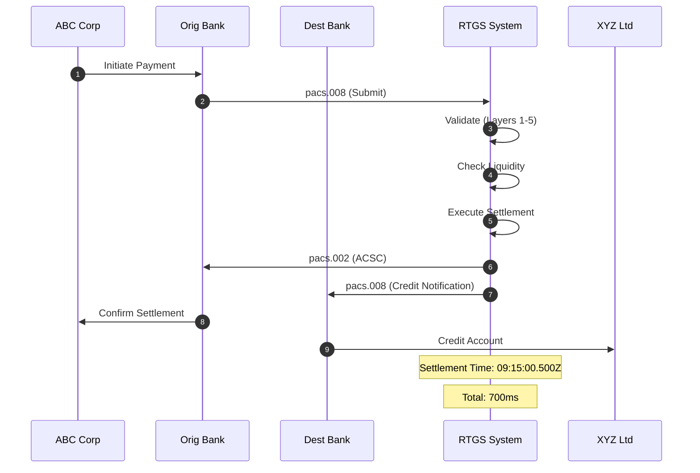

---

## 11 Summary

!!!anote "📋 Key Takeaways"
    **Understanding the message lifecycle:**

    ✅ **Seven Distinct Stages**
    - Initiation → Submission → Validation → Queue → Settlement → Confirmation → Archival

    ✅ **Validation is Multi-Layer**
    - XML syntax, XSD schema, business rules, security, compliance

    ✅ **Settlement is Final**
    - Once settled, payments cannot be reversed (only returned)

    ✅ **Queue Management is Critical**
    - Liquidity, cut-off times, and compliance can delay settlement

    ✅ **End-to-End Time**
    - Typical settlement completes in < 1 second

    ✅ **Audit Trail Required**
    - Complete record retained for 5-7 years minimum

---

**Footnotes for this article:**

[^1]: **pacs.008** - Payment Clearing and Settlement Customer Credit Transfer: ISO 20022 message for customer payments
[^2]: **pacs.002** - Payment Status Report: ISO 20022 message for payment status notifications
[^3]: **pacs.004** - Payment Cancellation Request: ISO 20022 message for cancellation requests
[^4]: **ACSC** - Accepted Settlement Completed: ISO 20022 status code for successful settlement
[^5]: **RJCT** - Rejected: ISO 20022 status code for rejected payments
[^6]: **XMLDSig** - XML Signature: W3C standard for XML digital signatures
[^7]: **AML** - Anti-Money Laundering: Regulatory requirements for financial transaction monitoring
[^8]: **KYC** - Know Your Customer: Due diligence requirements for customer identification
[^9]: **PEP** - Politically Exposed Person: Individual with prominent public function requiring enhanced due diligence
[^10]: **FFIEC** - Federal Financial Institutions Examination Council: US banking regulator
[^11]: **AMLD** - Anti-Money Laundering Directive: EU AML regulations
[^12]: **FCA** - Financial Conduct Authority: UK financial regulator
[^13]: **PRA** - Prudential Regulation Authority: UK banking regulator
[^14]: **MAS** - Monetary Authority of Singapore: Singapore central bank and regulator
[^15]: **HKMA** - Hong Kong Monetary Authority: Hong Kong central bank and regulator
