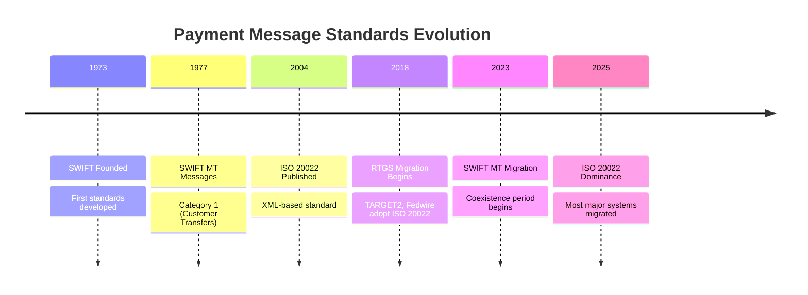
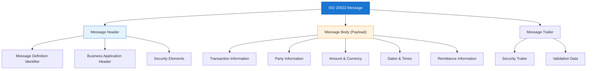
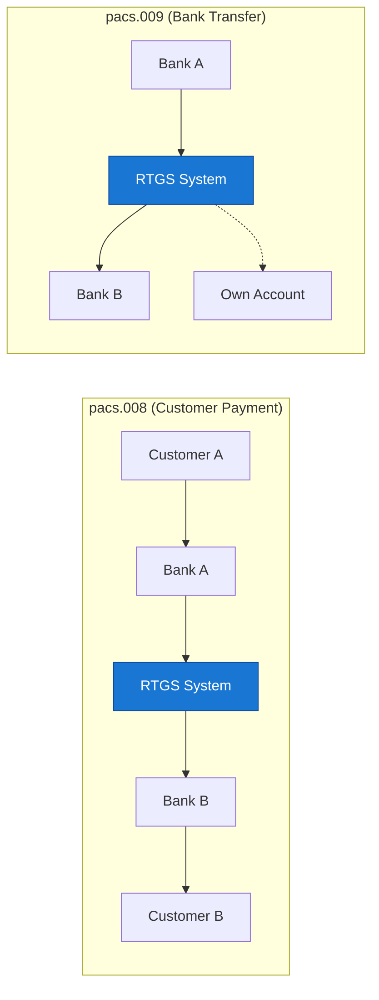
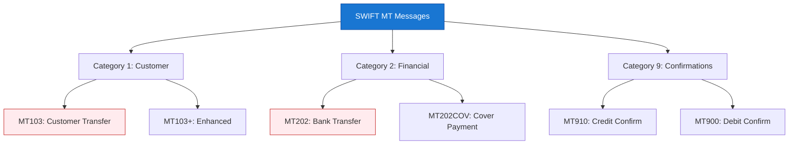

Message standards are the language of RTGS systems. This article explores the message formats, protocols, and standards that enable interoperability between financial institutions in real-time gross settlement networks.

## 1 Evolution of Payment Message Standards

### 1.1 Historical Context



### 1.2 Standards Comparison

| Standard | Format | Era | Status |
|----------|--------|-----|--------|
| **SWIFT MT** | Fixed-length text | 1977-2025 | Legacy (phasing out) |
| **ISO 20022** | XML/JSON | 2004-present | Current standard |
| **Fedwire** | Proprietary | 1918-present | US-specific |
| **CHIPS** | Proprietary | 1971-present | US clearing only |

## 2 ISO 20022 Fundamentals

### 2.1 What is ISO 20022?

!!!anote "📋 ISO 20022 Overview"
    **ISO 20022** is an international standard for financial services messaging that provides:

    ✅ **Common Platform**
    - Unified methodology for message development
    - Standardized data dictionary
    - Consistent modeling approach (UML)

    ✅ **Rich Data Structure**
    - XML-based format (primary)
    - JSON support (emerging)
    - Extensible data model

    ✅ **Global Adoption**
    - Used by 70+ countries
    - Major RTGS systems migrated
    - SWIFT migration underway

### 2.2 Why ISO 20022?

The development of ISO 20022 was driven by fundamental limitations in legacy messaging standards that had served the financial industry for decades but could no longer meet modern requirements.

**The Problem with Legacy Standards:**

When SWIFT MT standards were created in the 1970s, system storage and bandwidth were expensive commodities. Message designs prioritized minimalism—every character counted. This resulted in fixed-length text formats with severe constraints:

| Limitation | Impact |
|------------|--------|
| **Field size constraints** | Names truncated to 35 characters, addresses to 4 lines |
| **Unstructured formats** | Free-text fields led to inconsistent interpretation |
| **Ambiguity** | "CA" could mean Canada or California; "NYC" vs "NEW YORK" |
| **Limited data capacity** | Only essential transaction data could be transmitted |
| **Manual intervention** | Insufficient structure hampered automation |

**The Business Case for Change:**

By the early 2000s, these limitations created critical problems:

1. **Regulatory Pressure**: Post-9/11 AML/KYC regulations demanded greater transparency about payment participants and purposes. Legacy messages couldn't provide sufficient detail for compliance screening.

2. **Automation Barriers**: Unstructured data required manual review and intervention, increasing operational costs and error rates. Straight-through processing (STP) was impossible without standardized, machine-readable fields.

3. **Global Fragmentation**: Different regions and systems used incompatible formats, creating friction in cross-border payments. The G20 identified this as a barrier to efficient international trade.

4. **Innovation Constraints**: New financial products and services couldn't be supported by rigid legacy formats. The industry needed an extensible standard that could evolve.

**The ISO 20022 Solution:**

ISO 20022 addresses these challenges through:

- **Rich, structured data** – XML format supports comprehensive information exchange with unlimited field lengths and hierarchical organization
- **Rules-based methodology** – Standardized data dictionary eliminates ambiguity (e.g., separate fields for country codes vs. state codes)
- **Extensibility** – New message types and data elements can be added without breaking existing implementations
- **Global harmonization** – Single standard replaces fragmented regional formats, enabling seamless cross-border payments

The result is a standard that supports **straight-through processing rates exceeding 95%**, compared to 60-70% under legacy MT formats, while simultaneously meeting regulatory transparency requirements and enabling innovation in financial services.

### 2.3 ISO 20022 Message Structure



### 2.4 Message Naming Convention

ISO 20022 uses a standardized naming pattern:

```
<BusinessArea><Function><SubFunction><Variant>

Example: pacs.008.001.08
├── pacs  = Payments Clearing and Settlement
├── 008   = Customer Credit Transfer
├── 001   = Message variant
└── 08    = Version number
```

**Common RTGS Message Types:**

| Message Type | Code | Usage |
|--------------|------|-------|
| **Customer Credit Transfer** | pacs.008 | High-value customer payments |
| **Financial Institution Transfer** | pacs.009 | Bank-to-bank transfers |
| **Payment Status Report** | pacs.002 | Payment status notification |
| **Cancel Request** | pacs.004 | Payment cancellation |
| **Return** | pacs.004 | Payment return |

## 3 Key ISO 20022 Messages for RTGS

### 3.1 pacs.008 - Customer Credit Transfer

The primary message for customer payments:

```xml
<?xml version="1.0" encoding="UTF-8"?>
<Document xmlns="urn:iso:std:iso:20022:tech:xsd:pacs.008.001.08">
  <FIToFICstmrCdtTrf>
    <!-- Group Header -->
    <GrpHdr>
      <MsgId>MSG-12345-2025</MsgId>
      <CreDtTm>2025-12-10T10:30:00Z</CreDtTm>
      <NbOfTxs>1</NbOfTxs>
      <SttlmInf>
        <SttlmMtd>INDA</SttlmMtd>
      </SttlmInf>
    </GrpHdr>
    
    <!-- Credit Transfer Transaction -->
    <CdtTrfTxInf>
      <PmtId>
        <InstrId>INSTRUCTION-001</InstrId>
        <TxId>TRANSACTION-001</TxId>
      </PmtId>
      
      <!-- Payment Type Information -->
      <PmtTpInf>
        <InstrPrty>URGT</InstrPrty>
        <SvcLvl>
          <Cd>URGP</Cd>
        </SvcLvl>
      </PmtTpInf>
      
      <!-- Amount -->
      <IntrBkSttlmAmt Ccy="USD">1000000.00</IntrBkSttlmAmt>
      
      <!-- Settlement Information -->
      <IntrBkSttlmDt>2025-12-10</IntrBkSttlmDt>
      
      <!-- Debtor Institution -->
      <DbtrAgt>
        <FinInstnId>
          <BICFI>BANKUS33XXX</BICFI>
        </FinInstnId>
      </DbtrAgt>
      
      <!-- Creditor Institution -->
      <CdtrAgt>
        <FinInstnId>
          <BICFI>BANKGB2LXXX</BICFI>
        </FinInstnId>
      </CdtrAgt>
      
      <!-- Ultimate Debtor -->
      <UltmtDbtr>
        <Nm>ABC Corporation</Nm>
        <PstlAdr>
          <StrtNm>Wall Street</StrtNm>
          <BldgNb>100</BldgNb>
          <PstCd>10005</PstCd>
          <TwnNm>New York</TwnNm>
          <Ctry>US</Ctry>
        </PstlAdr>
      </UltmtDbtr>
      
      <!-- Ultimate Creditor -->
      <UltmtCdtr>
        <Nm>XYZ Limited</Nm>
        <PstlAdr>
          <StrtNm>City Road</StrtNm>
          <BldgNb>50</BldgNb>
          <PstCd>EC1V</PstCd>
          <TwnNm>London</TwnNm>
          <Ctry>GB</Ctry>
        </PstlAdr>
      </UltmtCdtr>
      
      <!-- Remittance Information -->
      <RmtInf>
        <Ustrd>Invoice INV-2025-001 Payment</Ustrd>
      </RmtInf>
    </CdtTrfTxInf>
  </FIToFICstmrCdtTrf>
</Document>
```

### 3.2 pacs.009 - Financial Institution Transfer

Used for interbank transfers (own account transfers):



**Key Differences:**

| Aspect | pacs.008 | pacs.009 |
|--------|----------|----------|
| **Purpose** | Customer payments | Interbank transfers |
| **Ultimate Parties** | Customer to Customer | Bank to Bank |
| **Remittance Info** | Required | Optional |
| **Use Case** | Commercial payments | Liquidity transfers |

### 3.3 pacs.002 - Payment Status Report

Provides status updates on payments:

```xml
<Document xmlns="urn:iso:std:iso:20022:tech:xsd:pacs.002.001.10">
  <FIToFIPmtStsRpt>
    <GrpHdr>
      <MsgId>STATUS-12345</MsgId>
      <CreDtTm>2025-12-10T10:31:00Z</CreDtTm>
    </GrpHdr>
    
    <OrgnlGrpInf>
      <OrgnlMsgId>MSG-12345-2025</OrgnlMsgId>
      <OrgnlMsgNmId>pacs.008.001.08</OrgnlMsgNmId>
    </OrgnlGrpInf>
    
    <TxInfAndSts>
      <OrgnlTxId>TRANSACTION-001</OrgnlTxId>
      
      <!-- Transaction Status -->
      <TxSts>ACSC</TxSts>
      <!-- ACSC = Accepted Settlement Completed -->
      
      <StsRsnInf>
        <Rsn>
          <Cd>SETC</Cd>
          <!-- SETC = Settlement Completed -->
        </Rsn>
      </StsRsnInf>
      
      <SttlmInf>
        <SttlmSts>STLD</SttlmSts>
        <!-- STLD = Settled -->
      </SttlmInf>
    </TxInfAndSts>
  </FIToFIPmtStsRpt>
</Document>
```

**Status Codes:**

| Code | Meaning | Description |
|------|---------|-------------|
| **ACSC** | Accepted Settlement Completed | Successfully settled |
| **ACCP** | Accepted Customer Profile | Customer validated |
| **ACSP** | Accepted Settlement in Process | Being processed |
| **RJCT** | Rejected | Payment rejected |
| **PDNG** | Pending | Awaiting processing |
| **ACTC** | Accepted Technical Validation | Technically valid |

## 4 SWIFT MT to ISO 20022 Migration

### 4.1 MT Message Categories



### 4.2 MT to ISO 20022 Mapping

**MT103 to pacs.008:**

| MT103 Field | ISO 20022 Element | Notes |
|-------------|-------------------|-------|
| :20 (TRN) | PmtId.TxId | Transaction ID |
| :32A (Value Date/Currency/Amount) | IntrBkSttlmAmt + IntrBkSttlmDt | Amount and date |
| :50 (Ordering Customer) | UltmtDbtr | Ultimate debtor |
| :52 (Ordering Institution) | DbtrAgt | Debtor agent |
| :59 (Beneficiary Customer) | UltmtCdtr | Ultimate creditor |
| :57 (Account With Institution) | CdtrAgt | Creditor agent |
| :70 (Remittance Info) | RmtInf.Ustrd | Remittance details |

**MT202 to pacs.009:**

| MT202 Field | ISO 20022 Element | Notes |
|-------------|-------------------|-------|
| :20 (TRN) | PmtId.TxId | Transaction ID |
| :32A (Value Date/Currency/Amount) | IntrBkSttlmAmt | Settlement amount |
| :52 (Ordering Institution) | DbtrAgt | Debtor agent |
| :57 (Account With Institution) | CdtrAgt | Creditor agent |

### 4.3 Migration Timeline

```mermaid
gantt
    title SWIFT MT to ISO 20022 Migration
    dateFormat YYYY-MM
    axisFormat %Y-%m
    
    section Coexistence
    MT & ISO Parallel :active, coex, 2022-11, 2025-11
    
    section Migration
    Phase 1: Readiness :done, phase1, 2022-11, 2023-06
    Phase 2: Testing :done, phase2, 2023-06, 2024-06
    Phase 3: Migration :active, phase3, 2024-06, 2025-06
    Phase 4: Completion :phase4, 2025-06, 2025-11
    
    section End of MT
    MT Shutdown :crit, shutdown, 2025-11, 1m
```

## 5 Further Reading

For technical implementation details including XML validation technologies, communication protocols, and testing, see the companion article:

→ **[Understanding RTGS: Message Implementation and Validation](/2025/12/Understanding-RTGS-Message-Implementation/)**

This companion article covers:
- XML validation stack (XSD, Schematron, XMLDSig)
- Communication protocols (TLS, REST APIs, Message Queues)
- Testing and certification requirements

## 6 Summary

!!!anote "📋 Key Takeaways"
    **Essential message standards knowledge:**

    ✅ **ISO 20022 Dominance**
    - Global standard for RTGS messaging
    - XML-based with rich data structure
    - Replacing legacy SWIFT MT formats

    ✅ **Why ISO 20022?**
    - Legacy MT standards had severe data limitations
    - Regulatory pressure demanded greater transparency
    - Enables straight-through processing rates exceeding 95%

    ✅ **Key Message Types**
    - pacs.008: Customer credit transfers
    - pacs.009: Financial institution transfers
    - pacs.002: Payment status reports

    ✅ **Migration from MT**
    - SWIFT MT sunset November 2025
    - Mapping between MT and ISO 20022
    - Coexistence period ending

---

**Footnotes for this article:**

[^1]: **ISO** - International Organization for Standardization: Develops international standards including ISO 20022
[^2]: **SWIFT** - Society for Worldwide Interbank Financial Telecommunication: Global messaging network for financial institutions
[^3]: **MT** - Message Type: SWIFT's legacy message format (e.g., MT103, MT202)
[^4]: **XML** - Extensible Markup Language: Markup language used for ISO 20022 messages
[^5]: **JSON** - JavaScript Object Notation: Lightweight data interchange format, emerging support in ISO 20022
[^6]: **BIC** - Bank Identifier Code: Standard format for identifying banks (also called SWIFT code)
[^7]: **AML** - Anti-Money Laundering: Regulatory requirements for financial transaction monitoring
[^8]: **KYC** - Know Your Customer: Due diligence requirements for customer identification
[^9]: **STP** - Straight-Through Processing: Automated end-to-end transaction processing without manual intervention
[^10]: **G20** - Group of Twenty: International forum for international economic cooperation

> **Note:** For a complete list of all acronyms used in the RTGS series, see the [RTGS Acronyms and Abbreviations Reference](/2025/12/RTGS-Acronyms-and-Abbreviations/).
