The **PFMI** (Principles for Financial Market Infrastructures) establishes the global standard for FMI risk management and governance. This guide maps each PFMI principle to concrete technical controls in RTGS system implementations.

## 1 What is PFMI?

The Principles for Financial Market Infrastructures (PFMI) are a set of internationally recognized standards for designing and operating FMIs. Developed by the Committee on Payment and Settlement Systems (CPSS) and the International Organization of Securities Commissions (IOSCO), they aim to enhance safety and efficiency in payment, clearing, settlement, and recording systems, thereby limiting systemic risk and fostering financial stability.

### 1.1 Overview

This section provides a high-level visual summary of the PFMI's structure, outlining its origin from CPSS-IOSCO, its composition of 24 principles and 5 responsibilities, and its core focus areas. The diagram illustrates how these components interrelate to form a comprehensive framework for FMI oversight.

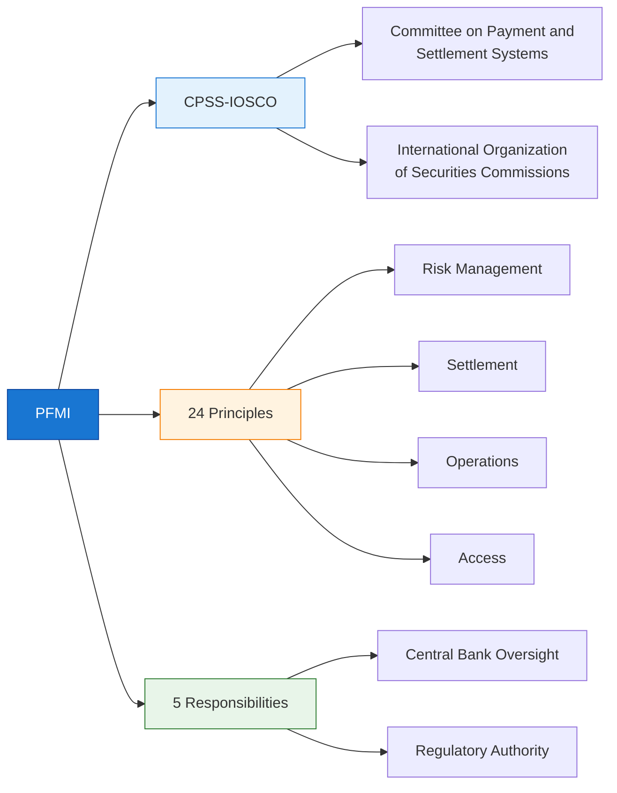

**PFMI Purpose:**

| Aspect | Description |
|--------|-------------|
| **Origin** | Published 2012 by CPSS-IOSCO (now CPMI-IOSCO) |
| **Scope** | All Financial Market Infrastructures (FMIs) |
| **FMIs Covered** | Payment systems, CSDs, SSS, CCPs, TRs |
| **RTGS Relevance** | RTGS systems are Systemically Important Payment Systems (SIPS) |
| **Adoption** | Implemented by 70+ jurisdictions globally |

### 1.2 The 24 PFMI Principles

The 24 PFMI principles are categorized into key areas covering the full spectrum of FMI operations. This mind map provides a complete overview, grouping the principles into logical domains such as Risk Management, Settlement, and Operations. This structure helps in systematically addressing all facets of FMI resilience and integrity.

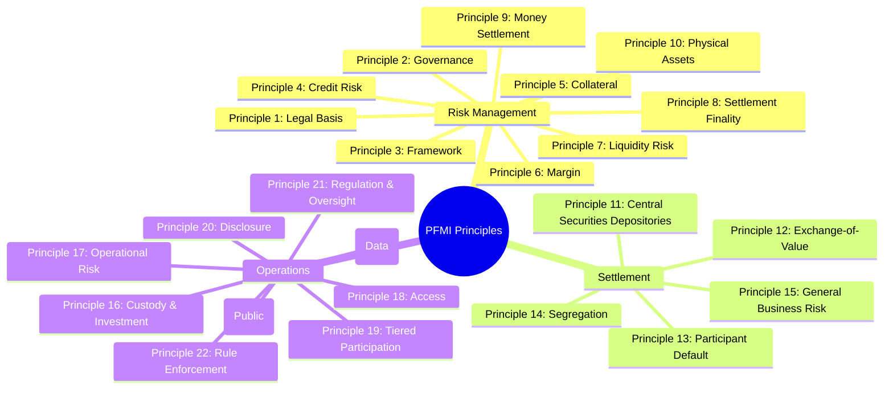

### 1.3 Why PFMI Matters for RTGS Developers

PFMI is not just a high-level policy concern; it has direct and tangible implications for the entire development lifecycle of an RTGS system. From architectural design to daily operations, these principles translate into specific technical requirements that shape how the system is built, maintained, and managed. The following table breaks down the relevance of PFMI for various stakeholders involved in the RTGS project.

| Stakeholder | PFMI Relevance |
|-------------|----------------|
| **Architects** | Drives high availability, disaster recovery, security architecture |
| **Developers** | Influences transaction handling, audit logging, validation rules |
| **Operations** | Defines monitoring, incident management, change procedures |
| **Compliance** | Provides audit trail, reporting, regulatory examination support |
| **Management** | Governance framework, risk appetite, escalation procedures |

## 2 PFMI Principles: Technical Mapping

This section delves into the practical application of specific PFMI principles to the technical implementation of an RTGS system. Each principle is first stated, followed by an explanation of the corresponding technical controls, architectural patterns, and code-level examples. The goal is to bridge the gap between regulatory requirements and engineering execution.

### 2.1 Principle 1: Legal Basis

Principle 1 emphasizes that an FMI's operations must be grounded in a solid legal framework. For an RTGS system, this means that the rules of participation, settlement finality, and liability are not just documented but are also programmatically enforced. The system itself becomes a key tool for ensuring that all activities are compliant with the established legal agreements.

**PFMI Requirement:**
> The FMI should have a well-founded, clear, transparent, and enforceable legal basis for each material aspect of its activities.

**Technical Controls:**

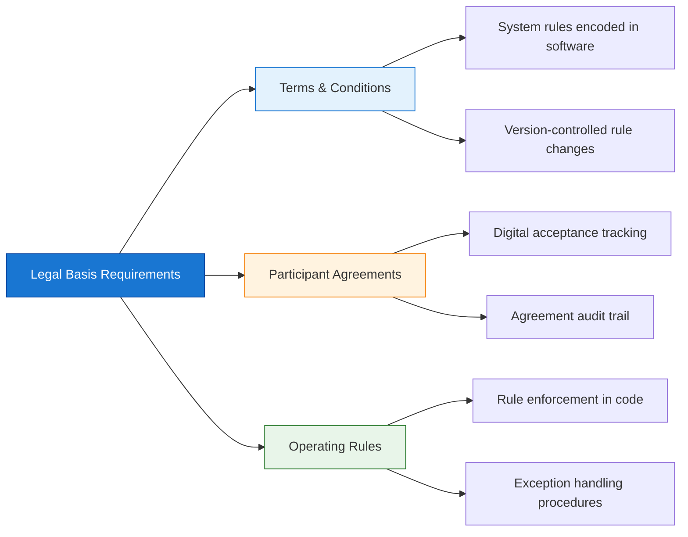

**Implementation Examples:**

| Requirement | Technical Implementation |
|-------------|-------------------------|
| **Clear rules** | Rules documented in API specifications, participant manuals |
| **Transparent** | Public disclosure of system rules, fee schedules |
| **Enforceable** | Automated validation, rejection of non-compliant messages |
| **Audit trail** | Immutable logs of rule applications, exceptions |

```java
// Example: Rule enforcement in code
public class PaymentValidator {
    
    // Rule: Payments must be submitted during operating hours
    public void validateOperatingHours(Payment payment) {
        if (!operatingSchedule.isWithinHours(payment.getSubmissionTime())) {
            throw new RuleViolationException(
                "Payment submitted outside operating hours",
                RuleReference.OPERATING_HOURS
            );
        }
    }
    
    // Rule: Payment must comply with participant limits
    public void validateParticipantLimits(Payment payment) {
        BigDecimal currentTotal = getParticipantDailyTotal(payment.getSender());
        if (currentTotal.add(payment.getAmount()).exceedsLimit()) {
            throw new LimitExceededException(
                "Participant credit limit exceeded",
                RuleReference.PARTICIPANT_LIMITS
            );
        }
    }
}
```

### 2.2 Principle 2: Governance

Effective governance is crucial for an FMI's stability and public confidence. In an RTGS system, this principle translates into technical controls that ensure clear lines of responsibility, accountability, and oversight. This includes implementing robust access control, creating detailed audit trails for decision-making, and providing transparent reporting mechanisms for all stakeholders.

**PFMI Requirement:**
> The FMI should have governance arrangements that are clear and transparent, promote the safety and efficiency of the FMI, and support the stability of the broader financial system.

**Technical Controls:**

| Governance Aspect | Technical Implementation |
|-------------------|-------------------------|
| **Clear roles** | RBAC (Role-Based Access Control), separation of duties |
| **Documented procedures** | Runbooks, escalation matrices in incident management system |
| **Board oversight** | Executive dashboards, KPI reporting |
| **Risk management** | Risk committees, risk registers, issue tracking |

**System Architecture for Governance:**

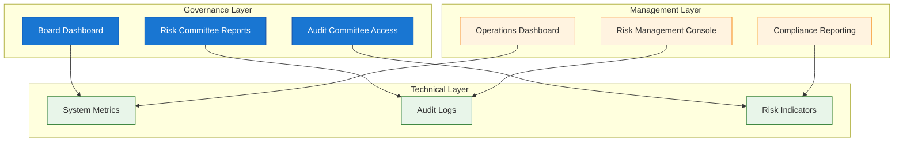

### 2.3 Principle 3: Framework for Management of Risk

A comprehensive risk management framework is the backbone of an FMI's resilience. This principle requires the RTGS system to have integrated tools for identifying, measuring, monitoring, and mitigating a wide range of risks. From a technical standpoint, this involves creating real-time dashboards, automated alert systems, and control mechanisms that are embedded directly into the system's architecture.

**PFMI Requirement:**
> The FMI should have a sound risk management framework for comprehensive management of legal, credit, liquidity, operational, and other risks.

**Technical Implementation:**

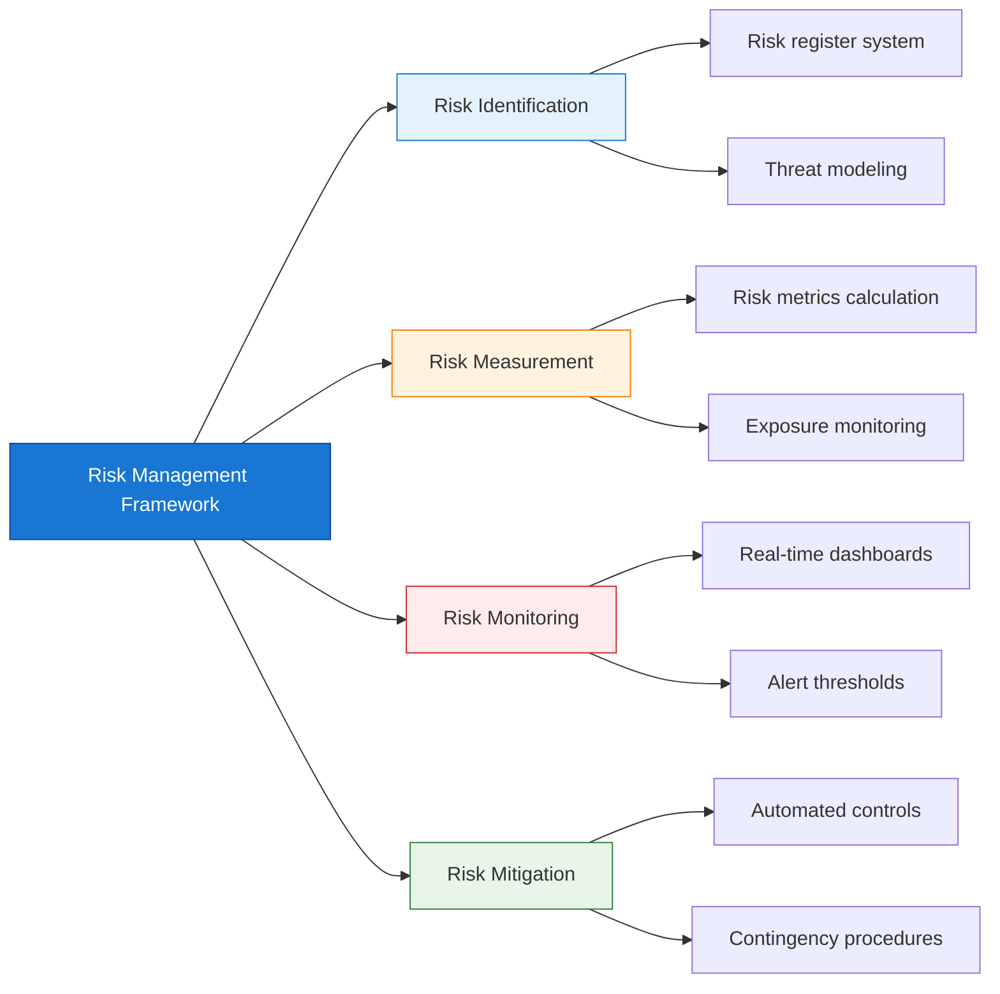

**Proposed Risk Dashboard Metrics:**

```yaml
# Real-time risk metrics
credit_risk:
  - total_exposure: sum(all_participant_positions)
  - largest_exposure: max(participant_positions)
  - collateral_coverage: collateral_value / total_exposure
  
liquidity_risk:
  - liquidity_buffer: available_liquidity
  - settlement_queue: queued_payment_value
  - time_to_settle: avg_queue_wait_time
  
operational_risk:
  - system_availability: uptime_percentage
  - transaction_success_rate: successful / total
  - incident_count: active_incidents
```

*   **Note:** The YAML structure above is a proposed example. PFMI mandates that risks are measured and monitored, but it does not prescribe a specific data format for displaying those metrics. This structure represents a best-practice approach.

### 2.4 Principle 4: Credit Risk

Credit risk in an RTGS system arises from the potential for a participant to fail to meet its financial obligations. The system must implement sophisticated controls to manage this risk, including real-time exposure monitoring, enforcement of credit limits, and automated collateral management. These technical measures are essential for preventing defaults from cascading and threatening the stability of the financial system.

**PFMI Requirement:**
> The FMI should effectively measure, monitor, and manage its credit exposures to participants and arising from its payment, clearing, and settlement processes.

**Technical Controls:**

| Control | Implementation |
|---------|----------------|
| **Exposure measurement** | Real-time calculation of participant positions |
| **Credit limits** | Configurable limits per participant, per transaction |
| **Collateral management** | Haircut calculations, margin calls |
| **Loss allocation** | Default waterfall, pro-rata distribution |

**Proposed Credit Limit System:**

```java
public class CreditLimitManager {
    
    // Real-time exposure calculation
    public BigDecimal calculateExposure(Participant participant) {
        BigDecimal outgoing = sumOutgoingPayments(participant);
        BigDecimal incoming = sumIncomingSettled(participant);
        BigDecimal collateral = getCollateralValue(participant);
        
        return outgoing.subtract(incoming).subtract(collateral);
    }
    
    // Pre-transaction validation
    public void checkCreditLimit(Participant participant, Payment payment) {
        BigDecimal currentExposure = calculateExposure(participant);
        BigDecimal newExposure = currentExposure.add(payment.getAmount());
        
        if (newExposure.compareTo(participant.getCreditLimit()) > 0) {
            throw new CreditLimitExceededException(
                String.format("Exposure %s exceeds limit %s", 
                    newExposure, participant.getCreditLimit())
            );
        }
    }
    
    // Automated margin calls
    public void processMarginCall(Participant participant) {
        BigDecimal exposure = calculateExposure(participant);
        BigDecimal threshold = participant.getMarginCallThreshold();
        
        if (exposure.compareTo(threshold) > 0) {
            MarginCall call = new MarginCall(
                participant,
                exposure.subtract(threshold)
            );
            notificationService.sendMarginCall(call);
        }
    }
}
```

*   **Note:** The code above is a proposed example. PFMI mandates the effective management of credit risk, but it does not prescribe a specific class structure or method implementation. This example shows a practical, best-practice approach to implementing credit risk controls.

### 2.5 Principle 7: Liquidity Risk

Liquidity risk is the danger that a participant has insufficient funds to settle its payment obligations on time. An RTGS system must include advanced features to manage this, such as real-time liquidity monitoring, sophisticated queue management algorithms, and tools for optimizing settlement. These features help ensure the smooth flow of payments and prevent gridlock, where transactions are blocked pending the receipt of other funds.

**PFMI Requirement:**
> The FMI should effectively measure, monitor, and manage its liquidity risk.

**Technical Implementation:**

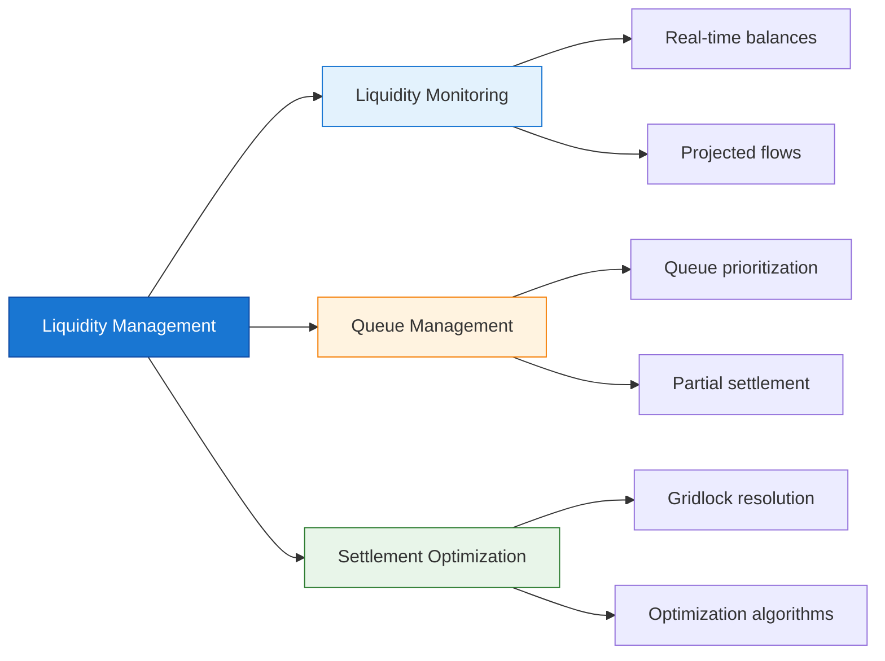

**Queue Management Algorithm:**

```java
public class LiquidityQueueManager {
    
    // Settlement queue with prioritization
    private PriorityQueue<Payment> settlementQueue;
    
    public void processQueue() {
        List<Payment> settled = new ArrayList<>();
        List<Payment> gridlocked = new ArrayList<>();
        
        while (!settlementQueue.isEmpty()) {
            Payment payment = settlementQueue.peek();
            
            if (canSettle(payment)) {
                settle(payment);
                settled.add(settlementQueue.poll());
            } else {
                // Check for gridlock resolution
                if (canResolveGridlock(payment)) {
                    resolveGridlock(payment);
                } else {
                    gridlocked.add(payment);
                    settlementQueue.poll(); // Temporarily remove
                }
            }
        }
        
        // Re-queue gridlocked payments
        settlementQueue.addAll(gridlocked);
    }
    
    private boolean canSettle(Payment payment) {
        return participantService.hasSufficientLiquidity(
            payment.getSender(), 
            payment.getAmount()
        );
    }
}
```

### 2.6 Principle 8: Settlement Finality

Settlement finality is the bedrock of a payment system's integrity. It ensures that once a payment is settled, it is irrevocable and unconditional. From a technical perspective, this is achieved through atomic database transactions, the creation of immutable audit logs, and the immediate dispatch of confirmation messages. This provides legal certainty to participants and removes the risk of a settlement being unwound.

**PFMI Requirement:**
> The FMI should provide clear and certain final settlement, at a minimum by the end of the value date.

**Technical Controls:**

| Aspect | Implementation |
|--------|----------------|
| **Finality point** | Database commit + confirmation message |
| **Irrevocability** | Immutable audit log, no rollback after finality |
| **Timestamping** | Trusted timestamp, sequence numbering |
| **Confirmation** | Immediate pacs.002 status notification |

**Proposed Settlement Finality Implementation:**

```java
@Transactional
public class SettlementEngine {
    
    public SettlementResult settle(Payment payment) {
        // 1. Pre-settlement validation
        validate(payment);
        
        // 2. Debit sender account
        accountService.debit(payment.getSender(), payment.getAmount());
        
        // 3. Credit receiver account
        accountService.credit(payment.getReceiver(), payment.getAmount());
        
        // 4. Record settlement (immutable)
        SettlementRecord record = new SettlementRecord(
            payment.getId(),
            Instant.now(),
            "SETTLED",
            getTransactionSequence()
        );
        auditLog.append(record);  // Immutable append-only log
        
        // 5. Send confirmation (pacs.002)
        PaymentStatusReport status = createStatusReport(payment, "ACSC");
        messageService.send(status);
        
        // 6. Return finality confirmation
        return SettlementResult.finalized(record.getTimestamp());
    }
}
```

*   **Note:** The code above is a proposed example. PFMI mandates that settlement be final, but it does not prescribe a specific class structure or method implementation. This example shows a practical, best-practice approach to achieving settlement finality through transactional logic.

**Proposed Database Transaction for Finality:**

```sql
-- Settlement transaction with audit trail
BEGIN;

-- 1. Update sender balance
UPDATE participant_account 
SET balance = balance - 1000000.00,
    last_updated = NOW()
WHERE participant_id = 'BANK_A'
  AND balance >= 1000000.00;  -- Atomic check

-- 2. Update receiver balance
UPDATE participant_account 
SET balance = balance + 1000000.00,
    last_updated = NOW()
WHERE participant_id = 'BANK_B';

-- 3. Record settlement (immutable)
INSERT INTO settlement_log (
    payment_id, 
    settlement_time, 
    status, 
    sequence_number
) VALUES (
    'PAYMENT-123',
    NOW(),
    'SETTLED',
    nextval('settlement_sequence')
);

-- 4. Record audit trail
INSERT INTO audit_trail (
    event_type,
    entity_id,
    old_value,
    new_value,
    timestamp
) VALUES 
    ('DEBIT', 'BANK_A', '5000000', '4000000', NOW()),
    ('CREDIT', 'BANK_B', '3000000', '4000000', NOW());

COMMIT;  -- Finality point
```

*   **Note:** The SQL script above is a proposed example. PFMI mandates that settlement be final, which is often achieved via atomic database transactions, but it does not prescribe a specific SQL implementation. This example shows a practical, best-practice approach.

### 2.7 Principle 17: Operational Risk

Operational risk encompasses failures in internal processes, people, and systems, as well as external events. For a systemically important RTGS, managing this risk is paramount. This principle drives the need for a highly resilient architecture, including active-active data centers, robust disaster recovery plans, stringent security controls, and formalized change management processes to ensure continuous and reliable operation.

**PFMI Requirement:**
> The FMI should identify the plausible sources of operational risk, both internal and external, and mitigate their impact through the use of appropriate systems, policies, procedures, and controls.

**Technical Implementation:**

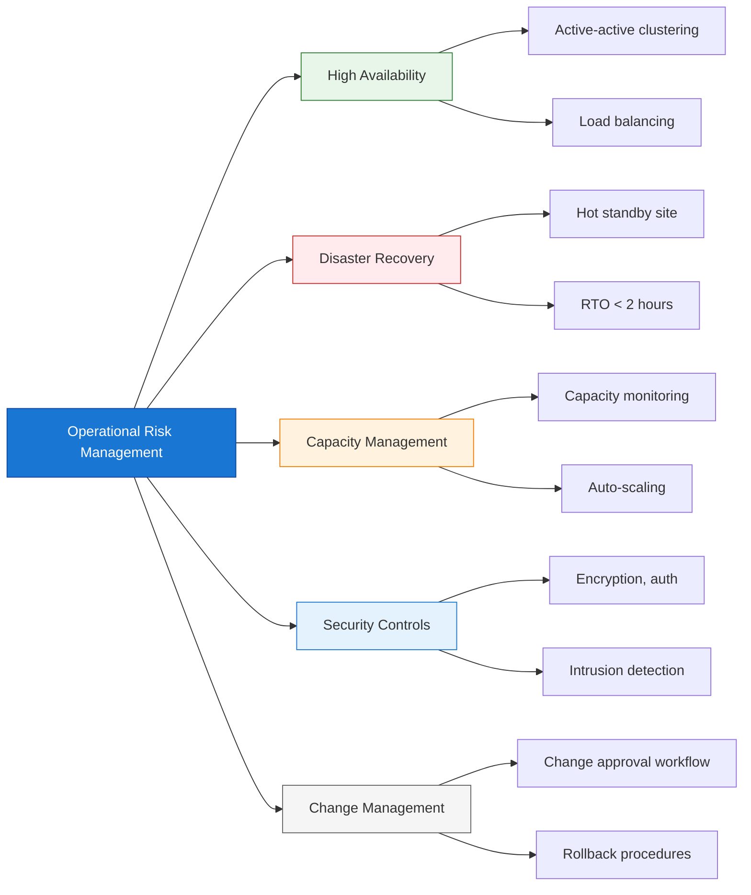

**High Availability Architecture:**

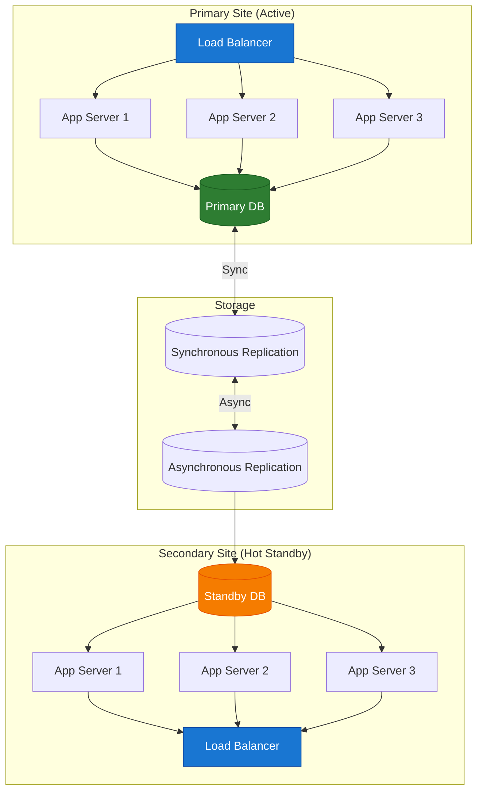

**Operational Metrics (PFMI Compliance):**

```yaml
# Availability metrics (PFMI requires 99.9%+ uptime)
availability:
  target: 99.9%
  measurement: (total_minutes - downtime_minutes) / total_minutes
  rto_target: < 2 hours
  rpo_target: < 15 minutes
  
# Capacity metrics
capacity:
  peak_tps: current_peak_transactions_per_second
  capacity_headroom: (max_capacity - peak_tps) / max_capacity
  alert_threshold: headroom < 20%
  
# Incident metrics
incidents:
  mttr: mean_time_to_resolution
  mtbf: mean_time_between_failures
  open_critical: count(status = 'critical')
```

### 2.8 Principle 20: Disclosure (Public)

Transparency is key to building trust and enabling participants to manage their risks effectively. This principle requires the FMI to make key information publicly available. Technically, this can be implemented through a public-facing portal that provides access to system documentation, fee schedules, performance metrics (like uptime and transaction volumes), and risk disclosures.

**PFMI Requirement:**
> The FMI should provide clear and comprehensive public disclosure of its rules, procedures, and risks.

**Technical Implementation:**

| Disclosure Type | Technical Implementation |
|-----------------|-------------------------|
| **System documentation** | Public API documentation, participant manuals |
| **Fee schedules** | Published fee calculator, rate tables |
| **Performance metrics** | Public dashboard (availability, volumes) |
| **Risk disclosures** | Published risk framework, stress test results |

**Public Disclosure Dashboard:**

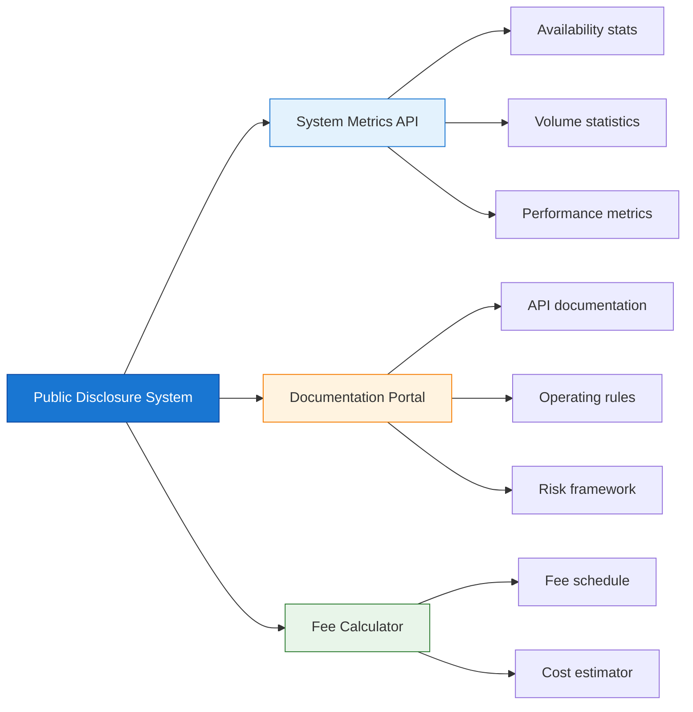

## 3 Complete PFMI Control Matrix

To provide a consolidated view, this section maps all 24 PFMI principles to their corresponding technical controls and implementation examples. It serves as a quick reference guide for architects, developers, and compliance officers to understand the scope of work required for full PFMI alignment.

### 3.1 Summary Table

The following table provides a comprehensive summary that links each of the 24 PFMI principles to its most critical technical controls and specific implementation examples. This matrix is designed to be a practical tool for mapping regulatory requirements directly to system features and functionalities.

| Principle | Key Technical Controls | Implementation Examples |
|-----------|----------------------|------------------------|
| **P1: Legal Basis** | Rule enforcement, audit trail | Validation engine, immutable logs |
| **P2: Governance** | RBAC, dashboards, reporting | Access control, executive reports |
| **P3: Risk Framework** | Risk metrics, monitoring | Risk dashboard, alerting |
| **P4: Credit Risk** | Exposure calculation, limits | Credit limit engine, margin calls |
| **P5: Collateral** | Haircut calculation, valuation | Collateral management system |
| **P6: Margin** | Margin models, calls | Variation margin, initial margin |
| **P7: Liquidity Risk** | Queue management, optimization | Liquidity monitoring, gridlock resolution |
| **P8: Settlement Finality** | Atomic transactions, confirmations | Database commits, pacs.002 |
| **P9: Money Settlement** | Central bank money, finality | RTGS account integration |
| **P10: Physical Assets** | Asset protection, insurance | Vault systems, access control |
| **P11: CSD** | Safekeeping, transfer | Securities accounts, book-entry |
| **P12: Exchange-of-Value** | DvP, PvP mechanisms | Atomic settlement, escrow |
| **P13: Participant Default** | Default procedures, testing | Default fund, auction mechanisms |
| **P14: Segregation** | Account segregation | Omnibus vs. individual accounts |
| **P15: Business Risk** | Capital planning, recovery | Business continuity, capital buffers |
| **P16: Custody** | Asset protection, audit | Custody accounts, reconciliation |
| **P17: Operational Risk** | HA/DR, security, capacity | Clustering, backup, encryption |
| **P18: Access** | Objective criteria, monitoring | Onboarding workflow, AML checks |
| **P19: Tiered Participation** | Indirect participant oversight | Sponsor bank relationships |
| **P20: Disclosure** | Public documentation, metrics | API docs, public dashboard |
| **P21: Regulation** | Oversight cooperation | Regulatory reporting, exams |
| **P22: Rule Enforcement** | Automated enforcement | Validation, rejection, sanctions |
| **P23: Public Disclosure** | Comprehensive disclosure | Annual report, risk framework |
| **P24: Data Disclosure** | Transaction data access | Trade repository reporting |

### 3.2 Implementation Priority

While all principles are important, some are more foundational or complex to implement than others. This quadrant chart helps prioritize implementation efforts by plotting principles based on their criticality versus their implementation difficulty. This allows teams to focus on the most crucial and challenging areas first, such as operational risk and settlement finality.

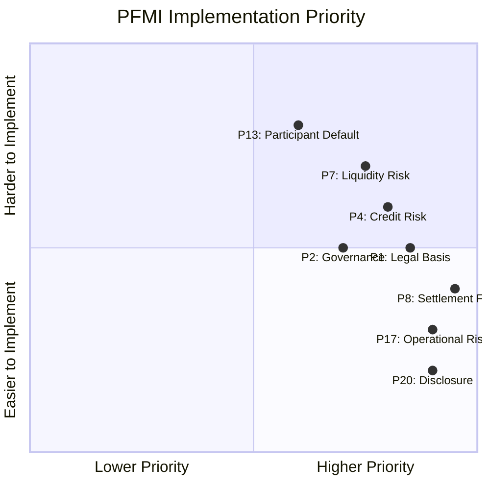

## 4 Audit and Compliance

Demonstrating compliance with PFMI is an ongoing activity that relies on robust auditing and reporting capabilities. This section explores the technical features required to support internal and external audits, as well as to meet regulatory reporting obligations. A well-designed system makes compliance a continuous, automated process rather than a periodic, manual effort.

### 4.1 PFMI Audit Trail Requirements

A cornerstone of PFMI compliance is the ability to produce a complete and trustworthy audit trail. The system must log every significant action, from transaction processing to user access and configuration changes. These logs must be immutable, easily searchable, and detailed enough to reconstruct events for forensic analysis and regulatory review.

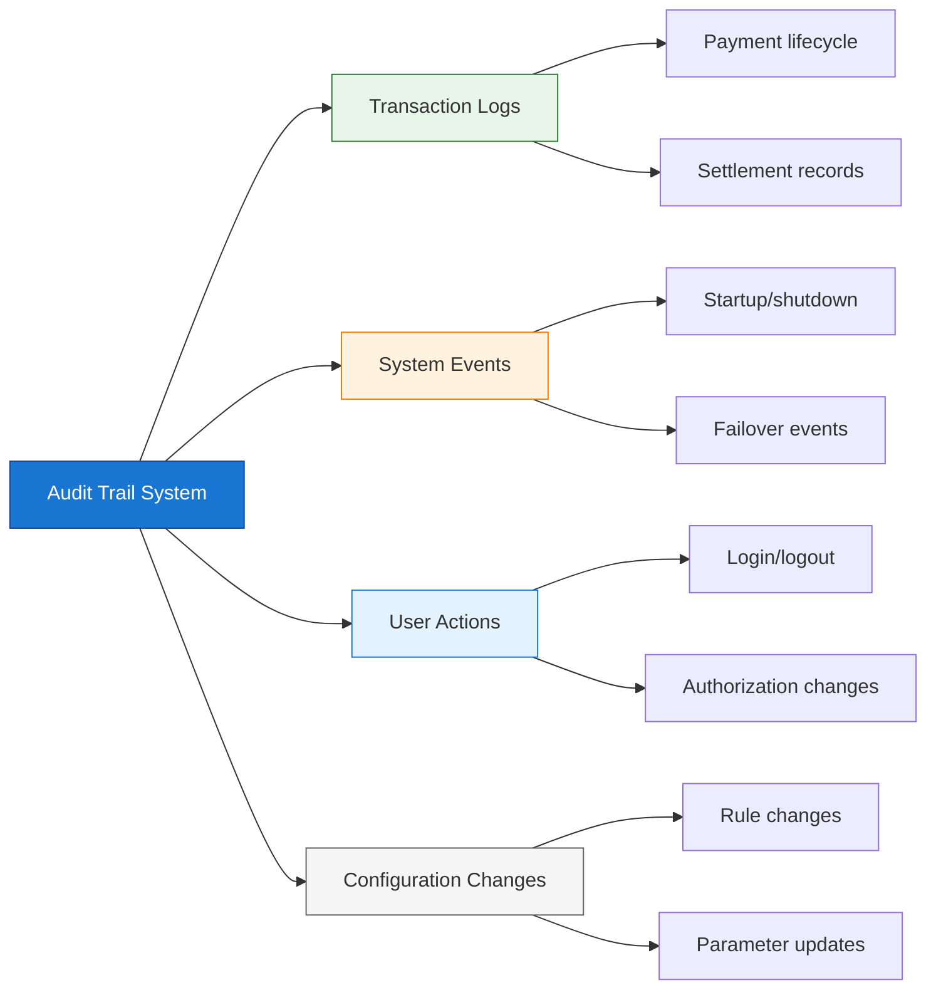

**Proposed Audit Log Structure:**

```json
{
  "audit_id": "AUDIT-2025-12-14-001234",
  "timestamp": "2025-12-14T10:30:00.123Z",
  "event_type": "PAYMENT_SETTLED",
  "entity_type": "PAYMENT",
  "entity_id": "PAYMENT-12345",
  "actor": {
    "type": "SYSTEM",
    "id": "SETTLEMENT-ENGINE",
    "user_id": null
  },
  "action": "SETTLE",
  "old_value": null,
  "new_value": {
    "status": "SETTLED",
    "settlement_time": "2025-12-14T10:30:00.123Z",
    "sequence_number": 987654
  },
  "metadata": {
    "sender": "BANK_A",
    "receiver": "BANK_B",
    "amount": 1000000.00,
    "currency": "USD"
  },
  "integrity": {
    "hash": "sha256:abc123...",
    "previous_hash": "sha256:def456..."
  }
}
```

*   **What PFMI Mandates:** The PFMI principles require that a financial market infrastructure (FMI) must have comprehensive, secure, and tamper-evident audit trails to reconstruct events and support audits. The principles define what must be achieved (e.g., traceability, accountability).
*   **What the Article Shows:** The JSON structure is a practical, best-practice implementation of how to meet those requirements. It includes all the critical elements (who, what, when, before/after state, integrity hash) needed for a robust and auditable log.

### 4.2 Regulatory Reporting

FMIs are required to submit regular reports to regulators to demonstrate their compliance and provide transparency into their operations. The RTGS system should be designed to automate the generation of these reports. This reduces the operational burden, minimizes the risk of human error, and ensures timely and accurate submission of all required data.

```yaml
# Automated regulatory reports
regulatory_reports:
  daily:
    - name: Transaction Volume Report
      recipients: [central_bank]
      format: XML
      deadline: "09:00 next business day"
      
    - name: Liquidity Position Report
      recipients: [central_bank, risk_committee]
      format: JSON
      deadline: "08:00 next business day"
      
  monthly:
    - name: Operational Risk Metrics
      recipients: [regulator, board]
      format: PDF
      deadline: "15th of following month"
      
  annual:
    - name: PFMI Disclosure Framework
      recipients: [public, regulator]
      format: PDF
      deadline: "March 31"
```

## 5 Summary

This article has provided a comprehensive overview of the PFMI principles and their direct translation into the technical design and implementation of an RTGS system. From legal frameworks to operational resilience and public disclosure, adherence to PFMI is not just a compliance exercise but a foundational element of building a safe, efficient, and reliable financial market infrastructure.

!!!anote "📋 Key Takeaways"
    **Essential PFMI implementation knowledge:**

    ✅ **PFMI Drives Architecture**
    - High availability (99.9%+ uptime)
    - Disaster recovery (RTO < 2 hours)
    - Settlement finality (atomic transactions)
    - Comprehensive audit trails

    ✅ **Key Technical Controls**
    - Credit limits and exposure monitoring
    - Liquidity queue management
    - Operational risk mitigation
    - Automated rule enforcement

    ✅ **Governance & Disclosure**
    - Role-based access control
    - Executive dashboards
    - Public disclosure requirements
    - Regulatory reporting automation

    ✅ **Audit & Compliance**
    - Immutable audit logs
    - Transaction lifecycle tracking
    - Configuration change tracking
    - Automated regulatory reports

---

**Footnotes for this article:**

[^1]: **PFMI** - Principles for Financial Market Infrastructures: International standard for FMI risk management
[^2]: **CPSS-IOSCO** - Committee on Payment and Settlement Systems / International Organization of Securities Commissions (now CPMI-IOSCO)
[^3]: **FMI** - Financial Market Infrastructure: Payment systems, CSDs, CCPs, trade repositories
[^4]: **RTGS** - Real-Time Gross Settlement: Payment system for large-value transactions
[^5]: **SIPS** - Systemically Important Payment Systems: Payment systems whose failure could impact financial stability
[^6]: **DvP** - Delivery versus Payment: Settlement mechanism linking securities and cash transfers
[^7]: **PvP** - Payment versus Payment: Settlement mechanism linking two currency transfers
