Security and risk management are paramount in RTGS systems where trillions of dollars flow daily. This article explores the security architecture, threat landscape, and risk management frameworks essential for RTGS operations.

## 1 Security Requirements for RTGS

### 1.1 Security Objectives

!!!anote "🔐 CIA Triad in RTGS Context"
    RTGS systems must protect the three pillars of information security:

    ✅ **Confidentiality**
    - Payment details encrypted in transit and at rest
    - Access restricted to authorized parties
    - Sensitive data masked in logs

    ✅ **Integrity**
    - Transactions cannot be altered undetectably
    - Digital signatures ensure authenticity
    - Hash verification for data integrity

    ✅ **Availability**
    - System accessible during operating hours
    - Resilient against attacks (DDoS, etc.)
    - Disaster recovery capabilities

### 1.2 Additional Security Requirements

| Requirement | Description | Implementation |
|-------------|-------------|----------------|
| **Non-repudiation** | Sender cannot deny sending | Digital signatures, Audit logs |
| **Authentication** | Verify identity | mTLS, Certificates, HSM |
| **Authorization** | Control access rights | RBAC, Least privilege |
| **Auditability** | Track all actions | Complete audit trail |
| **Accountability** | Assign responsibility | User identification, Logging |

## 2 Threat Landscape

### 2.1 Threat Categories

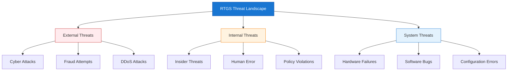

### 2.2 Attack Vectors

**Common Attack Scenarios:**

```mermaid
flowchart TD
    subgraph "Attack Vector 1: Credential Theft"
        A1[Phishing Email] --> A2[Stolen Credentials]
        A2 --> A3[Unauthorized Access]
        A3 --> A4[Fraudulent Payment]
    end
    
    subgraph "Attack Vector 2: Man-in-the-Middle"
        B1[Network Compromise] --> B2[Intercept Messages]
        B2 --> B3[Modify Payment Details]
        B3 --> B4[Divert Funds]
    end
    
    subgraph "Attack Vector 3: DDoS"
        C1[Botnet Attack] --> C2[System Overload]
        C2 --> C3[Service Disruption]
        C3 --> C4[Settlement Failure]
    end
    
    subgraph "Attack Vector 4: Insider Threat"
        D1[Privileged User] --> D2[Bypass Controls]
        D2 --> D3[Unauthorized Transaction]
        D3 --> D4[Fund Misappropriation]
    end
    
    style A1 fill:#ffebee,stroke:#c62828
    style B1 fill:#ffebee,stroke:#c62828
    style C1 fill:#ffebee,stroke:#c62828
    style D1 fill:#ffebee,stroke:#c62828
```

### 2.3 Real-World Incidents

| Incident | Year | Impact | Lesson |
|----------|------|--------|--------|
| **Bangladesh Bank Heist** | 2016 | $81M stolen | SWIFT security, Internal controls |
| **Carbanak Gang** | 2013-2018 | $1B+ stolen | Malware, Insider threats |
| **Lazarus Group Attacks** | 2014-present | Multiple | State-sponsored, Persistence |

## 3 Security Architecture

### 3.1 Defense in Depth

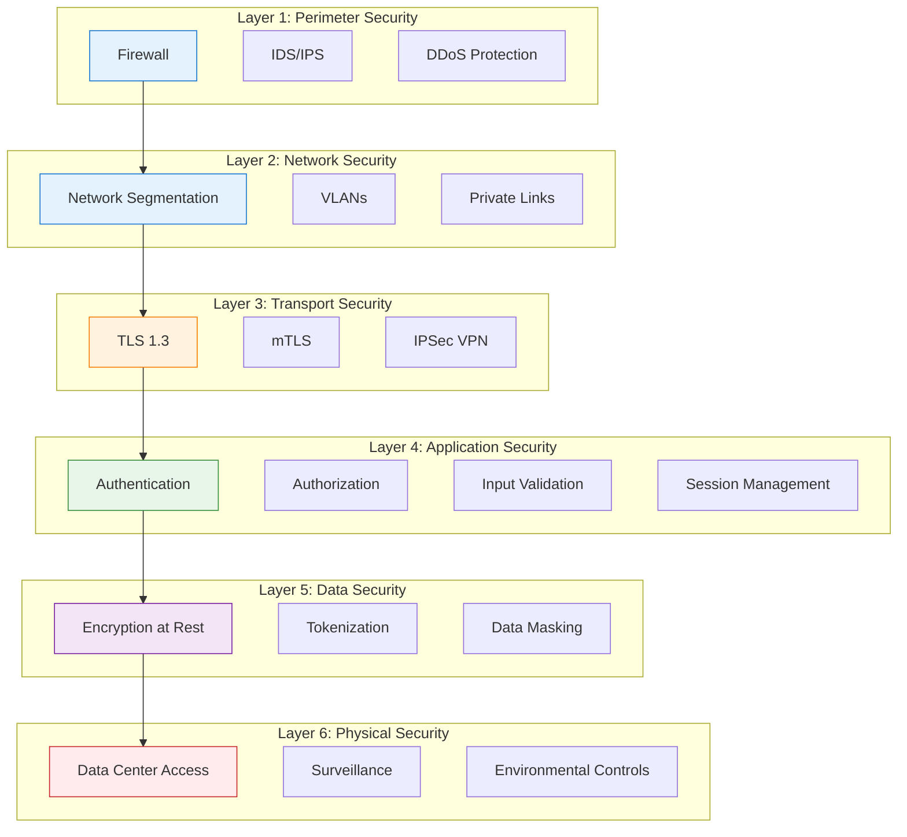

### 3.2 Cryptographic Infrastructure

**Hardware Security Module (HSM):**

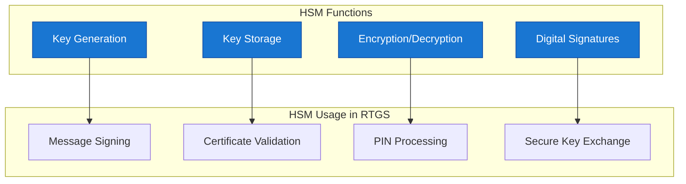

**Cryptographic Standards:**

| Operation | Algorithm | Key Size | Standard |
|-----------|-----------|----------|----------|
| **Asymmetric Encryption** | RSA, ECC | 2048+, 256+ | FIPS 140-2 |
| **Symmetric Encryption** | AES | 256 | FIPS 197 |
| **Hashing** | SHA-256, SHA-3 | 256+ | FIPS 180-4 |
| **Digital Signature** | RSA-PSS, ECDSA | 2048+, 256+ | FIPS 186-4 |
| **Key Exchange** | ECDH | 256+ | SP 800-56A |

### 3.3 Authentication Architecture

**Multi-Factor Authentication Flow:**

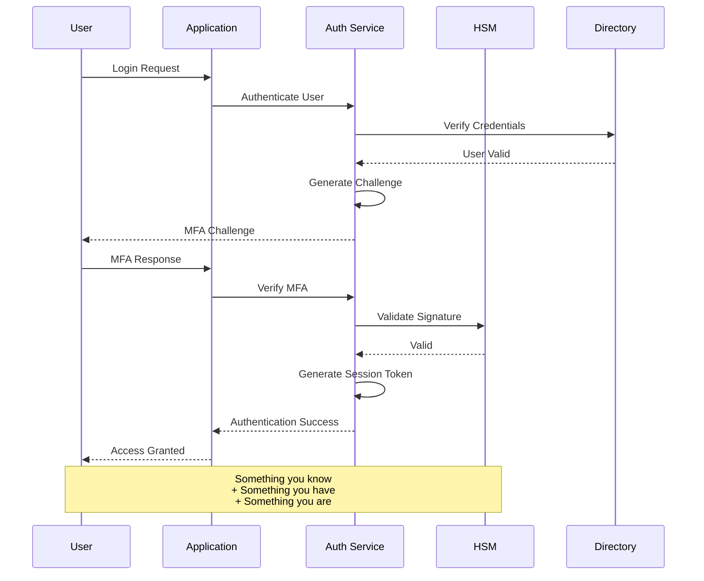

### 3.4 Authorization Model

**Role-Based Access Control (RBAC):**

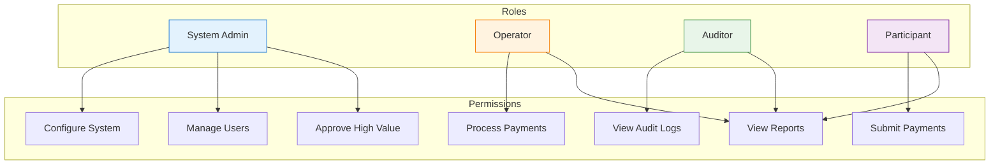

**Permission Matrix:**

| Role | Submit Payment | Approve Payment | View Reports | Configure System | Manage Users |
|------|---------------|-----------------|--------------|------------------|--------------|
| **System Admin** | ❌ | ❌ | ✅ | ✅ | ✅ |
| **Operator** | ✅ | ❌ | ✅ | ❌ | ❌ |
| **Senior Operator** | ✅ | ✅ (> $1M) | ✅ | ❌ | ❌ |
| **Auditor** | ❌ | ❌ | ✅ | ❌ | ❌ |
| **Participant** | ✅ | ✅ (internal) | ✅ (own) | ❌ | ✅ (own users) |

## 4 Risk Management Framework

### 4.1 Risk Categories in RTGS

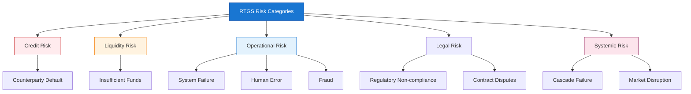

### 4.2 Risk Mitigation Strategies

| Risk Type | Mitigation Strategy | Implementation |
|-----------|--------------------|----------------|
| **Credit Risk** | Real-time settlement | No intraday credit exposure |
| **Liquidity Risk** | Queue management | Payment optimization algorithms |
| **Operational Risk** | Redundancy | Multi-site deployment |
| **Fraud Risk** | Detection systems | AI/ML anomaly detection |
| **Systemic Risk** | Circuit breakers | Transaction limits, Pauses |

### 4.3 Fraud Detection

**Real-time Fraud Monitoring:**

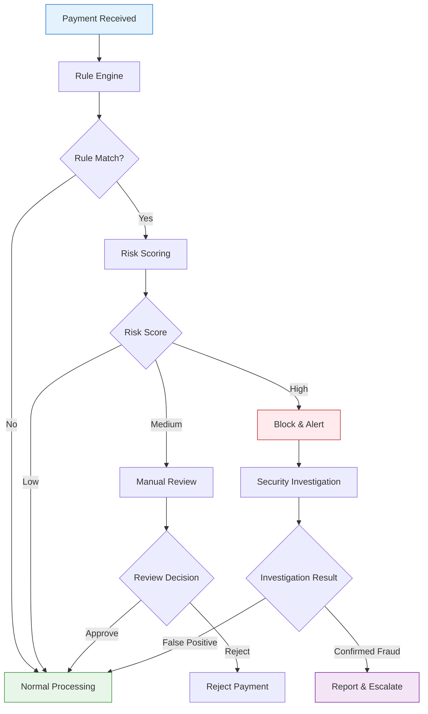

**Fraud Detection Rules:**

```java
// Conceptual fraud detection rules
interface FraudDetectionRule {
    
    // Amount-based rules
    boolean exceedsDailyLimit(String participantId, BigDecimal amount);
    boolean exceedsTransactionLimit(BigDecimal amount);
    boolean isUnusualAmount(String participantId, BigDecimal amount);
    
    // Pattern-based rules
    boolean isRapidSuccession(String participantId, int count, Duration duration);
    boolean isUnusualTiming(LocalDateTime timestamp);
    boolean matchesKnownFraudPattern(Payment payment);
    
    // Counterparty rules
    boolean isSanctionedCounterparty(String counterpartyId);
    boolean isHighRiskJurisdiction(String country);
    
    // Behavioral rules
    boolean deviatesFromNormalBehavior(String participantId, Payment payment);
}
```

## 5 Audit and Compliance

### 5.1 Audit Trail Requirements

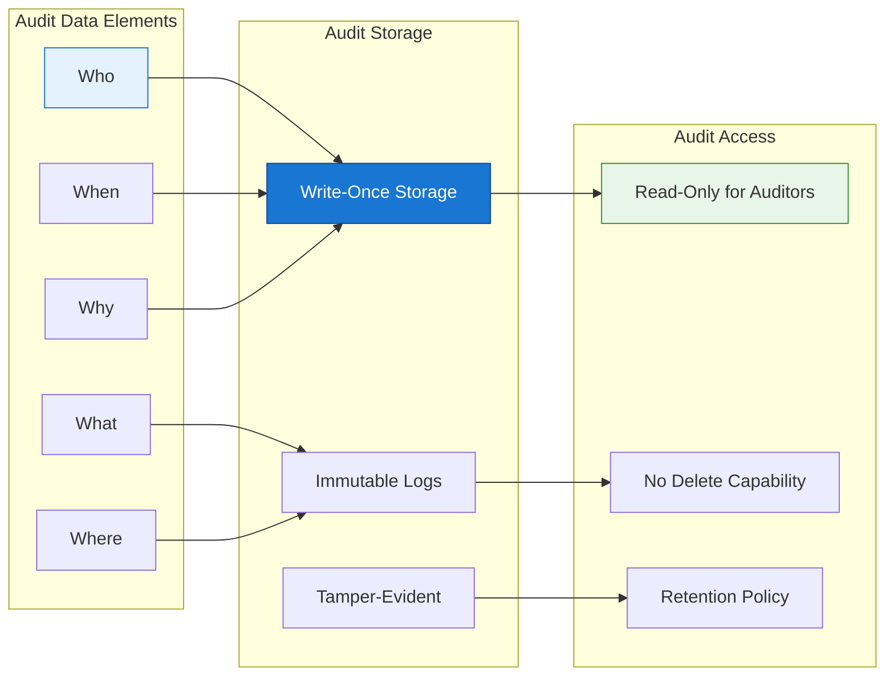

### 5.2 Audit Log Structure

```json
{
  "auditEvent": {
    "eventId": "AUD-2025-12-15-001234",
    "timestamp": "2025-12-15T10:30:00.000Z",
    "eventType": "PAYMENT_SUBMITTED",
    "severity": "INFO",
    
    "actor": {
      "userId": "USR001",
      "userName": "john.doe",
      "organization": "BANK001",
      "role": "OPERATOR"
    },
    
    "action": {
      "type": "SUBMIT_PAYMENT",
      "resource": "PAYMENT-12345",
      "details": {
        "amount": "1000000.00",
        "currency": "USD",
        "counterparty": "BANK002"
      }
    },
    
    "outcome": {
      "status": "SUCCESS",
      "transactionId": "TXN-12345"
    },
    
    "context": {
      "ipAddress": "192.168.1.100",
      "sessionId": "SES-ABC123",
      "location": "Primary DC"
    },
    
    "integrity": {
      "hash": "sha256:abc123...",
      "previousHash": "sha256:def456...",
      "signature": "RSA:xyz789..."
    }
  }
}
```

### 5.3 Regulatory Compliance

| Regulation | Region | Requirements |
|------------|--------|--------------|
| **PSD2** | EU | Strong customer authentication, Open banking |
| **SOX** | USA | Financial reporting controls, Audit trails |
| **GDPR** | EU | Data protection, Privacy rights |
| **PCI DSS** | Global | Card data security (if applicable) |
| **ISO 27001** | Global | Information security management |

## 6 Incident Response

### 6.1 Incident Classification

| Severity | Response Time | Examples |
|----------|---------------|----------|
| **Critical (P1)** | Immediate | System compromise, Active fraud |
| **High (P2)** | < 15 minutes | Security breach attempt, DDoS |
| **Medium (P3)** | < 1 hour | Policy violation, Suspicious activity |
| **Low (P4)** | < 24 hours | Minor policy deviation, Audit findings |

### 6.2 Incident Response Process

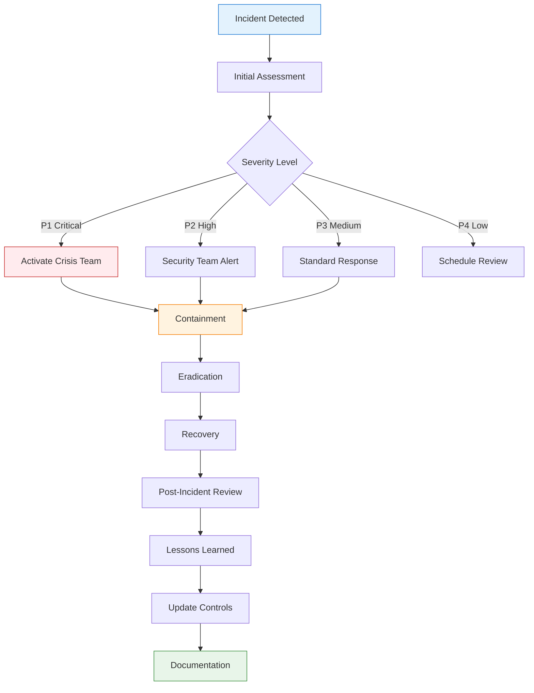

## 7 Business Continuity

### 7.1 Disaster Recovery Strategy

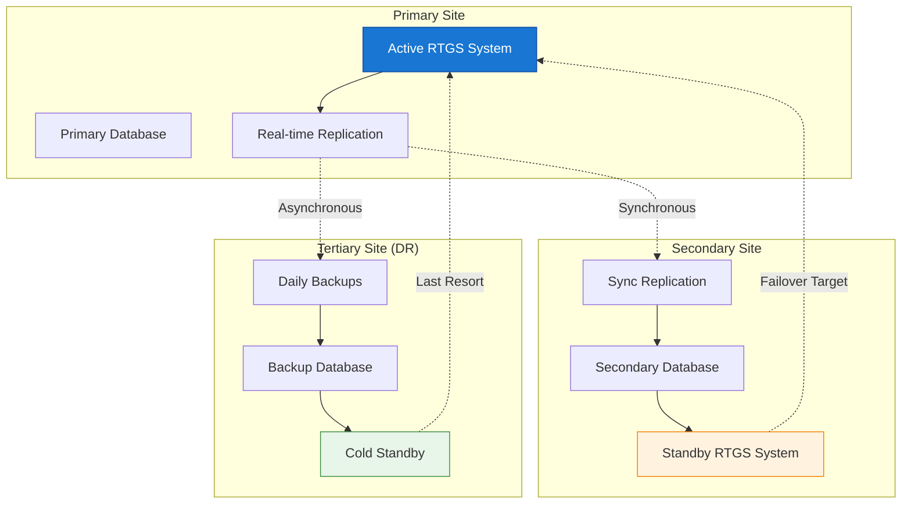

### 7.2 Recovery Objectives

| Metric | Target | Measurement |
|--------|--------|-------------|
| **RTO (Recovery Time Objective)** | < 2 hours | Time to restore service |
| **RPO (Recovery Point Objective)** | < 5 minutes | Maximum data loss |
| **WRT (Work Recovery Time)** | < 1 hour | Time to resume operations |
| **MTD (Maximum Tolerable Downtime)** | 4 hours | Business impact threshold |

## 8 Summary

!!!anote "📋 Key Takeaways"
    **Essential security and risk concepts:**

    ✅ **Defense in Depth**
    - Multiple security layers
    - No single point of failure
    - Comprehensive protection

    ✅ **Cryptographic Foundation**
    - HSM for key operations
    - Strong encryption standards
    - Digital signatures for non-repudiation

    ✅ **Risk Management**
    - Credit, liquidity, operational risks
    - Real-time fraud detection
    - Systemic risk mitigation

    ✅ **Audit and Compliance**
    - Complete audit trail
    - Regulatory compliance
    - Immutable logging

    ✅ **Incident Response**
    - Classified response levels
    - Clear procedures
    - Business continuity planning

---

**Footnotes for this article:**

[^1]: **HSM** - Hardware Security Module: Physical device for managing digital keys and cryptographic operations
[^2]: **PKI** - Public Key Infrastructure: Framework for managing digital certificates and encryption
[^3]: **TLS** - Transport Layer Security: Cryptographic protocol for secure communications
[^4]: **mTLS** - Mutual TLS: TLS where both parties authenticate each other
[^5]: **IPSec** - Internet Protocol Security: Suite of protocols for securing IP communications
[^6]: **VPN** - Virtual Private Network: Secure tunnel over public networks
[^7]: **DDoS** - Distributed Denial of Service: Attack that overwhelms systems with traffic
[^8]: **IDS** - Intrusion Detection System: Monitors for malicious activity
[^9]: **IPS** - Intrusion Prevention System: Blocks detected threats in real-time
[^10]: **VLAN** - Virtual Local Area Network: Logically segmented network
[^11]: **RBAC** - Role-Based Access Control: Access management based on user roles
[^12]: **LDAP** - Lightweight Directory Access Protocol: Protocol for accessing directory services
[^13]: **SIEM** - Security Information and Event Management: Real-time security monitoring
[^14]: **DR** - Disaster Recovery: Strategies for recovering from disasters
[^15]: **DC** - Data Center: Facility housing computer systems and network infrastructure
[^16]: **RTO** - Recovery Time Objective: Maximum acceptable downtime after a failure
[^17]: **RPO** - Recovery Point Objective: Maximum acceptable data loss measured in time

> **Note:** For a complete list of all acronyms used in the RTGS series, see the [RTGS Acronyms and Abbreviations Reference](/2025/12/RTGS-Acronyms-and-Abbreviations/).
