Building an RTGS system requires careful architectural design to meet the demanding requirements of financial settlement. This article explores the system architecture, core components, and design patterns used in modern RTGS implementations.

## 1 Architectural Principles

### 1.1 Design Goals

!!!anote "🎯 Core Architectural Goals"
    RTGS systems must satisfy these non-negotiable requirements:

    ✅ **Reliability**
    - Zero data loss
    - Transaction integrity guaranteed
    - Predictable behavior under all conditions

    ✅ **Availability**
    - 99.99%+ uptime during operating hours
    - Graceful degradation
    - Rapid recovery from failures

    ✅ **Performance**
    - Sub-second latency
    - High throughput capacity
    - Consistent response times

    ✅ **Security**
    - Defense in depth
    - Non-repudiation
    - Complete audit trail

### 1.2 Architectural Patterns

**Layered Architecture:**
*   **Note:** The diagram below illustrates a proposed layered architectural pattern. The specific layers, their responsibilities, and components can vary based on the system's design principles and requirements.
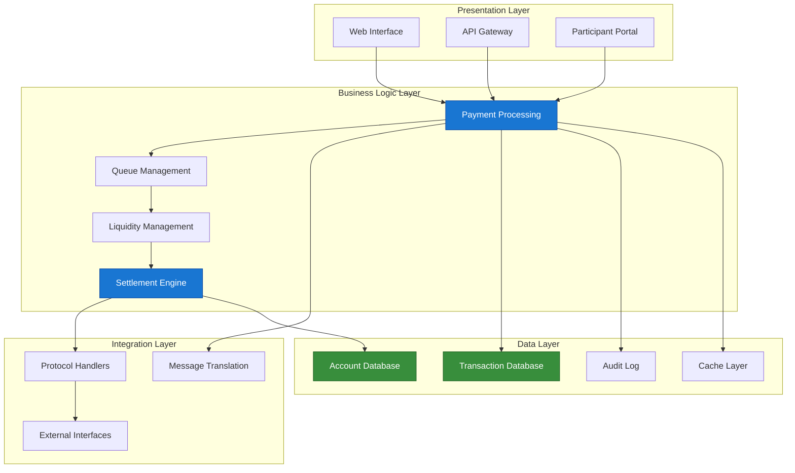

## 2 Core System Components

### 2.1 Component Overview

| Component | Responsibility | Criticality |
|-----------|---------------|-------------|
| **Payment Processor** | Transaction validation and routing | Critical |
| **Queue Manager** | Payment queue handling | Critical |
| **Liquidity Manager** | Account balance management | Critical |
| **Settlement Engine** | Final settlement execution | Critical |
| **Account Manager** | Participant account operations | Critical |
| **Message Handler** | Format translation and validation | High |
| **Audit Logger** | Transaction logging | High |
| **Monitoring System** | Health and performance tracking | High |

### 2.2 Payment Processor

The payment processor is the heart of the RTGS system:

*   **Note:** The flowchart below illustrates a proposed workflow for a payment processor. The specific steps, validation rules, and queuing logic can vary based on the RTGS system's design.

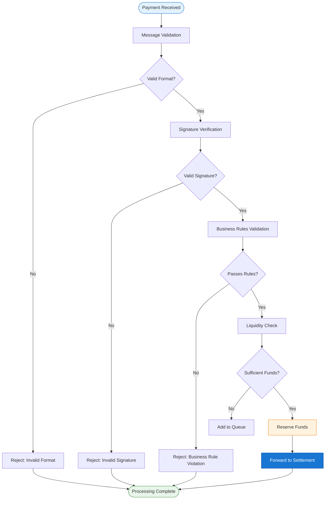

**Payment Processor Responsibilities:**
*   **Note:** The Java code snippet below provides a proposed conceptual interface for a payment processor. The actual implementation will involve concrete classes with detailed business logic for each method.
```java
// Conceptual payment processor interface
interface PaymentProcessor {
    
    /**
     * Validate incoming payment message
     */
    ValidationResult validate(PaymentMessage message);
    
    /**
     * Check business rules and compliance
     */
    ComplianceResult checkCompliance(Payment payment);
    
    /**
     * Verify liquidity availability
     */
    LiquidityResult checkLiquidity(String accountId, BigDecimal amount);
    
    /**
     * Process payment for settlement
     */
    ProcessingResult process(Payment payment);
    
    /**
     * Handle queued payments
     */
    QueueResult manageQueue(QueueContext context);
}
```

### 2.3 Queue Manager

**RTGS systems use queues to handle payments when liquidity is insufficient:**
*   **Note:** The diagram below illustrates a proposed queue structure and operations. The specific queue types and algorithms can vary based on the RTGS system's requirements for liquidity management and payment prioritization.
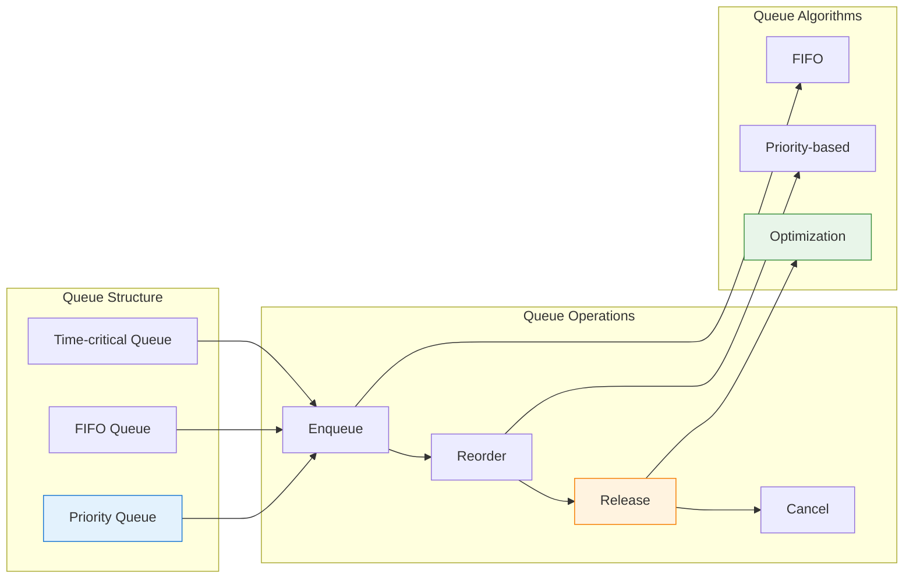

**Queue Management Strategies:**

| Strategy | Description | Use Case |
|----------|-------------|----------|
| **FIFO** | First In, First Out | Standard processing |
| **Priority** | Based on payment priority | Urgent payments |
| **Optimization** | Multilateral offsetting | Liquidity efficiency |
| **Time-critical** | Deadline-based ordering | Cut-off approaching |

### 2.4 Liquidity Manager

**Manages participant account balances and liquidity:**
*   **Note:** The flowchart below illustrates a proposed workflow for a liquidity manager. The specific steps and decision logic can vary based on the RTGS system's liquidity management policies.
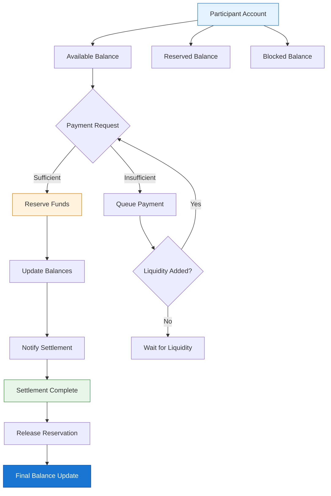

**Liquidity Operations:**
*   **Note:** The sequence diagram below illustrates a proposed sequence of operations for liquidity management. The specific interactions and messages can vary based on the RTGS system's design and external interfaces.
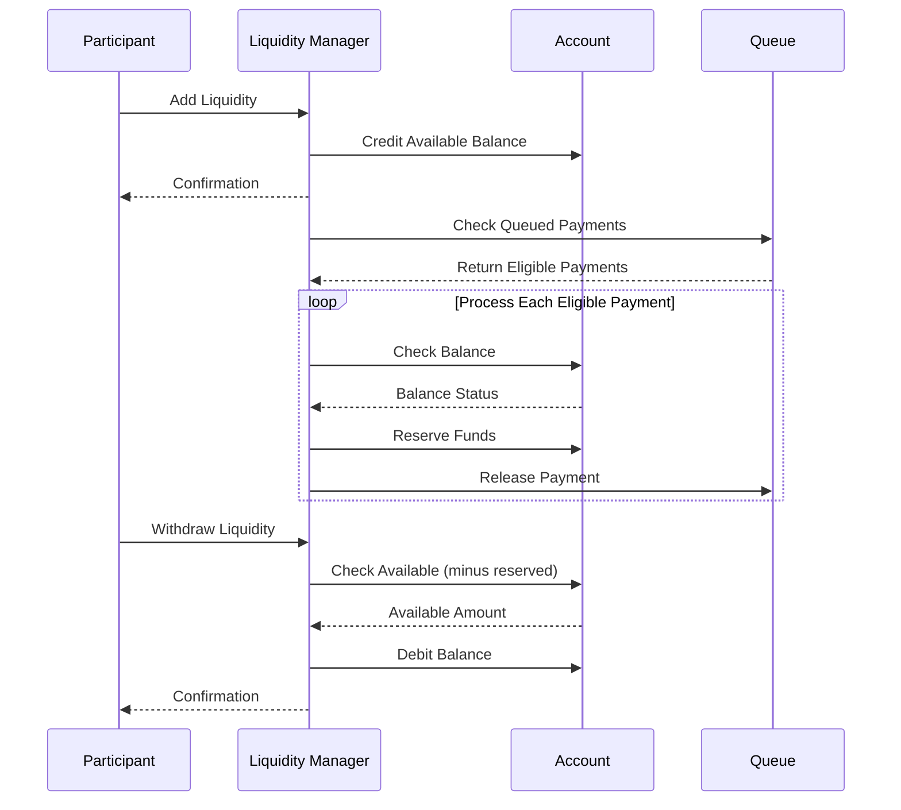

### 2.5 Settlement Engine

The settlement engine executes the final transfer:
*   **Note:** The flowchart below illustrates a proposed workflow for a settlement engine. The specific steps, validation checks, and rollback mechanisms can vary based on the RTGS system's design.

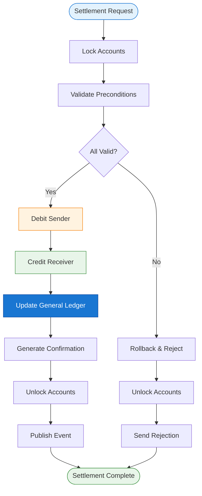

**Settlement Properties (ACID):**

| Property | RTGS Implementation |
|----------|---------------------|
| **Atomicity** | All-or-nothing settlement |
| **Consistency** | Balance constraints maintained |
| **Isolation** | Concurrent settlements don't interfere |
| **Durability** | Once settled, never reversed |

## 3 Data Architecture

### 3.1 Database Schema (Simplified)
*   **Note:** The ER diagram below presents a simplified, proposed database schema. The actual schema will be more complex and detailed, reflecting all data elements required by the RTGS system.
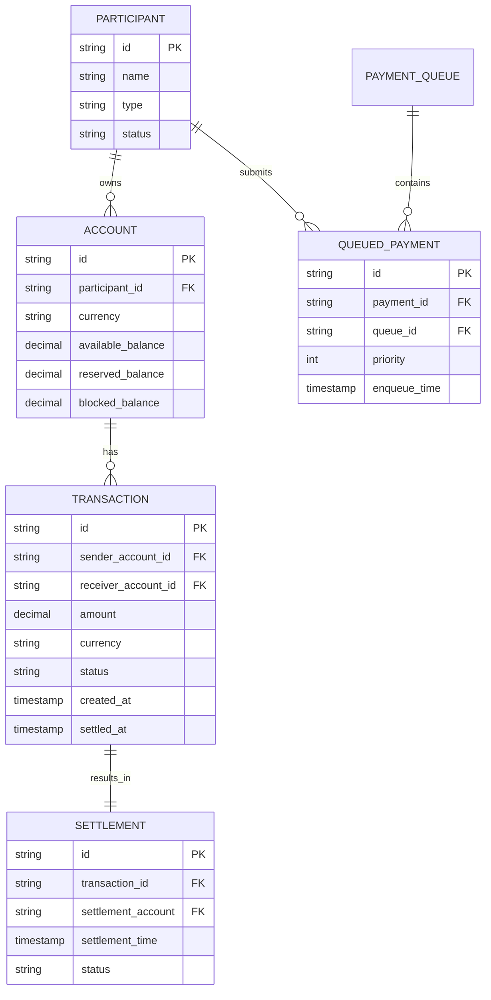

### 3.2 Data Flow
*   **Note:** The flowchart below illustrates a proposed data flow through the RTGS system. The specific stages, processing steps, and storage mechanisms can vary based on the system's architecture.
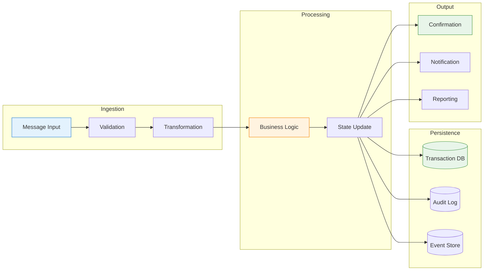

## 4 Integration Architecture

### 4.1 Participant Connectivity
*   **Note:** The diagram below illustrates a proposed architecture for participant connectivity. The specific connectivity options, protocols, and security layers can vary based on the RTGS system's design and market requirements.
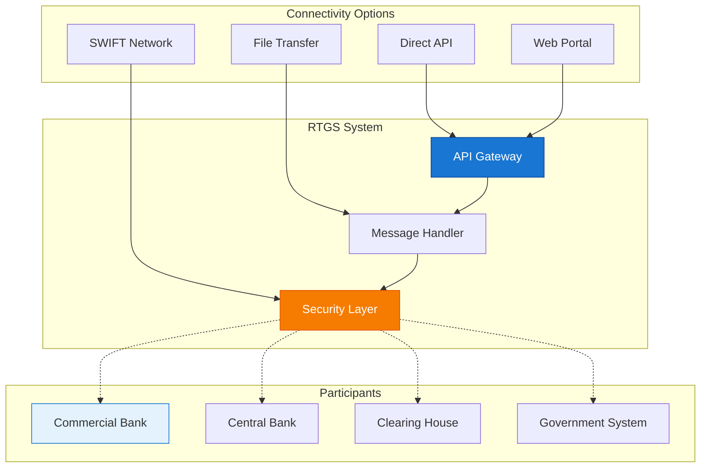

### 4.2 Message Flow
*   **Note:** The sequence diagram below illustrates a proposed message flow between components. The specific interactions, message types, and processing steps can vary based on the RTGS system's architecture.
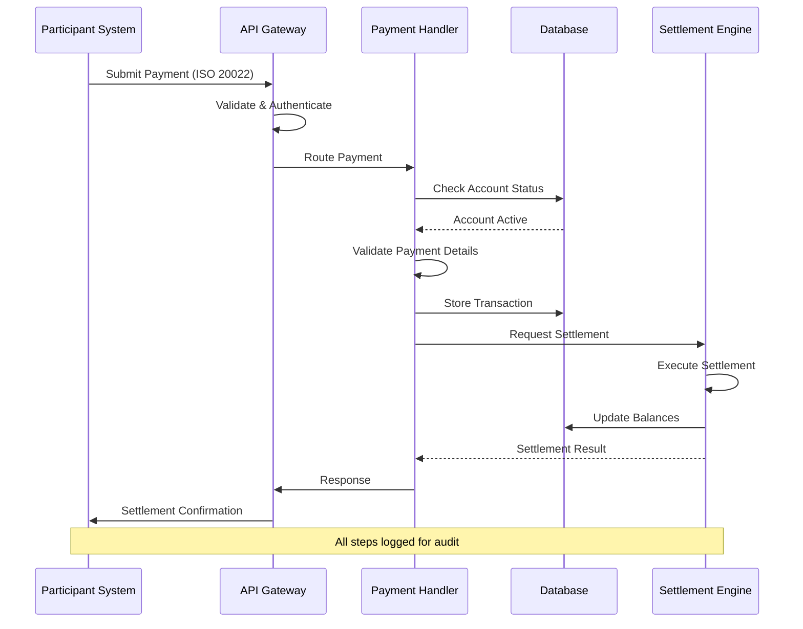

## 5 Security Architecture

### 5.1 Security Layers
*   **Note:** The diagram below illustrates a proposed layered security architecture. The specific layers, their controls, and technologies can vary based on the security requirements and threat model.
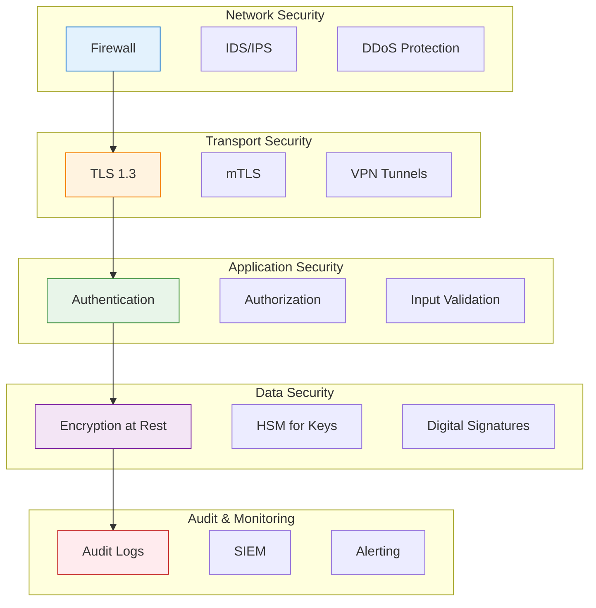

### 5.2 Authentication Flow
*   **Note:** The sequence diagram below illustrates a proposed authentication flow. The specific steps, protocols, and involved components will vary based on the authentication mechanisms implemented.
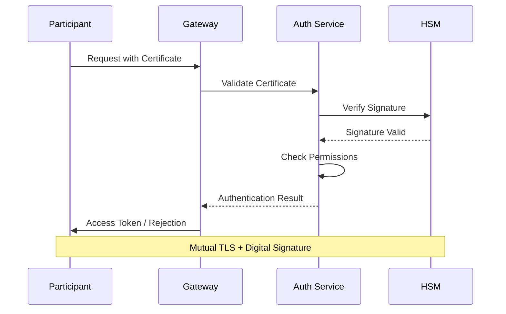

## 6 Deployment Architecture

### 6.1 High Availability Setup
*   **Note:** The diagram below illustrates a proposed high availability setup. The specific data center configurations, replication strategies, and failover mechanisms will depend on the RTO/RPO objectives and infrastructure choices.
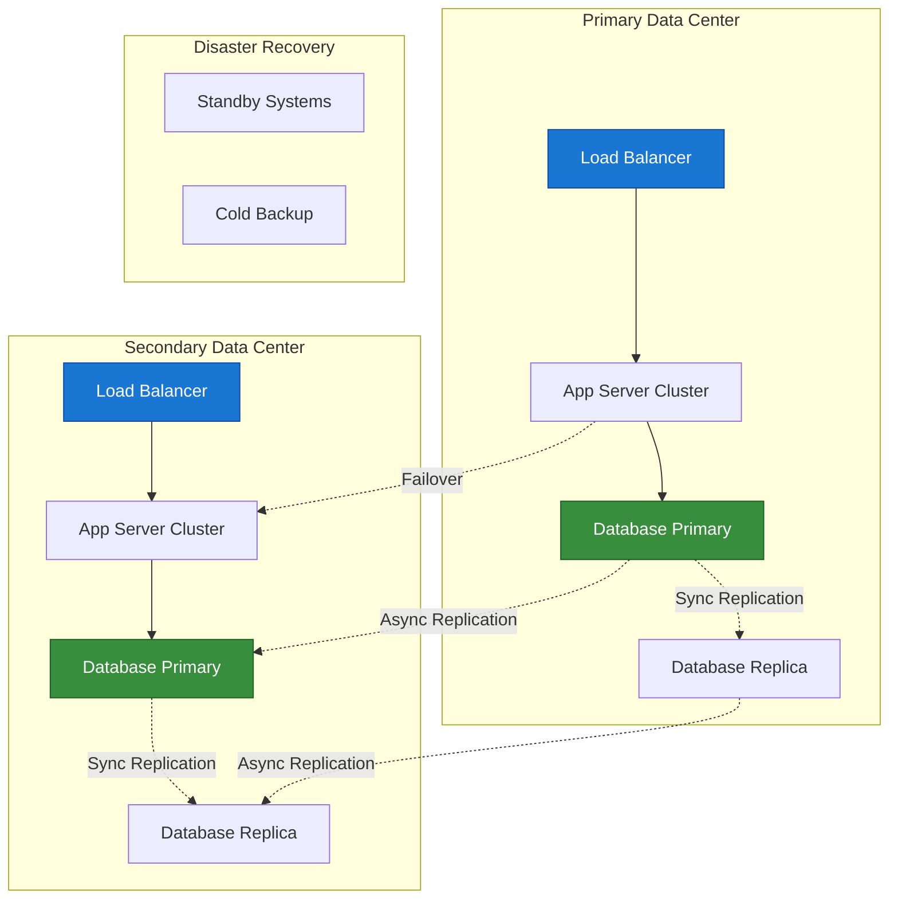

### 6.2 Component Redundancy
*   **Note:** The table below presents a proposed example of component redundancy strategies and failover times. The actual strategies and targets should be defined based on a thorough analysis of system components and their criticality.
| Component | Redundancy Strategy | Failover Time |
|-----------|---------------------|---------------|
| **Load Balancer** | Active-Passive | < 1 second |
| **Application Servers** | Active-Active | Immediate |
| **Database** | Primary-Replica | < 30 seconds |
| **Message Queue** | Clustered | < 5 seconds |
| **HSM** | Active-Passive | < 10 seconds |

## 7 Monitoring and Observability

### 7.1 Key Metrics
*   **Note:** The diagram below illustrates a proposed classification of key metrics for monitoring an RTGS system. The specific metrics, their categories, and collection methods will vary based on observability requirements.
```mermaid
graph LR
    subgraph "Performance Metrics"
        A1[Throughput (TPS)]
        A2[Latency (ms)]
        A3[Queue Depth]
    end
    
    subgraph "Availability Metrics"
        B1[Uptime %]
        B2[Error Rate]
        B3[Failover Events]
    end
    
    subgraph "Business Metrics"
        C1[Transaction Volume]
        C2[Settlement Value]
        C3[Queue Wait Time]
    end
    
    subgraph "Security Metrics"
        D1[Failed Auth Attempts]
        D2[Invalid Messages]
        D3[Security Events]
    end
    
    style A1 fill:#e3f2fd,stroke:#1976d2
    style B1 fill:#e8f5e9,stroke:#388e3c
    style C1 fill:#fff3e0,stroke:#f57c00
    style D1 fill:#ffebee,stroke:#c62828
```

### 7.2 Alerting Strategy
*   **Note:** The table below presents a proposed example of an alerting strategy. The specific alert levels, response times, and examples should be defined based on the incident management framework and system criticality.
| Alert Level | Response Time | Examples |
|-------------|---------------|----------|
| **Critical** | Immediate | System down, Settlement failure |
| **High** | < 15 minutes | High error rate, Queue buildup |
| **Medium** | < 1 hour | Performance degradation |
| **Low** | Next business day | Non-critical warnings |

## 8 Summary

!!!anote "📋 Key Takeaways"
    **Essential architecture concepts:**

    ✅ **Layered Architecture**
    - Presentation, Business Logic, Integration, Data layers
    - Clear separation of concerns
    - Independent scalability

    ✅ **Core Components**
    - Payment Processor, Queue Manager, Liquidity Manager
    - Settlement Engine, Account Manager
    - Each with specific responsibilities

    ✅ **Data Integrity**
    - ACID transactions
    - Complete audit trail
    - Event sourcing for recovery

    ✅ **Security by Design**
    - Multiple security layers
    - HSM for cryptographic operations
    - Mutual authentication

    ✅ **High Availability**
    - Redundant components
    - Fast failover
    - Geographic distribution

---

**Footnotes for this article:**

[^1]: **API** - Application Programming Interface: Interface for software components to communicate
[^2]: **HSM** - Hardware Security Module: Physical device for cryptographic operations
[^3]: **mTLS** - Mutual TLS: TLS where both parties authenticate each other
[^4]: **TLS** - Transport Layer Security: Cryptographic protocol for secure communications
[^5]: **HSM** - Hardware Security Module: Physical device for managing digital keys
[^6]: **ACID** - Atomicity, Consistency, Isolation, Durability: Database transaction properties
[^7]: **SWIFT** - Society for Worldwide Interbank Financial Telecommunication: Global messaging network for financial institutions

> **Note:** For a complete list of all acronyms used in the RTGS series, see the [RTGS Acronyms and Abbreviations Reference](/2025/12/RTGS-Acronyms-and-Abbreviations/).
