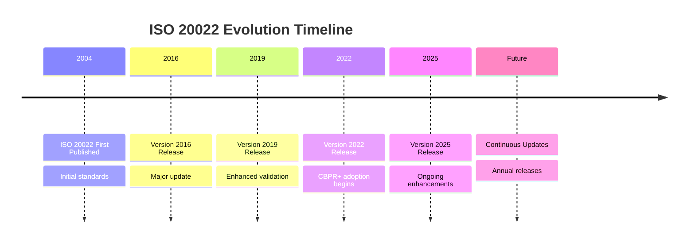
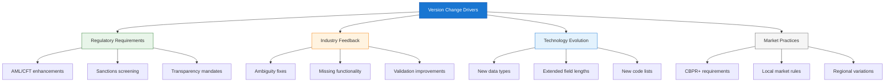
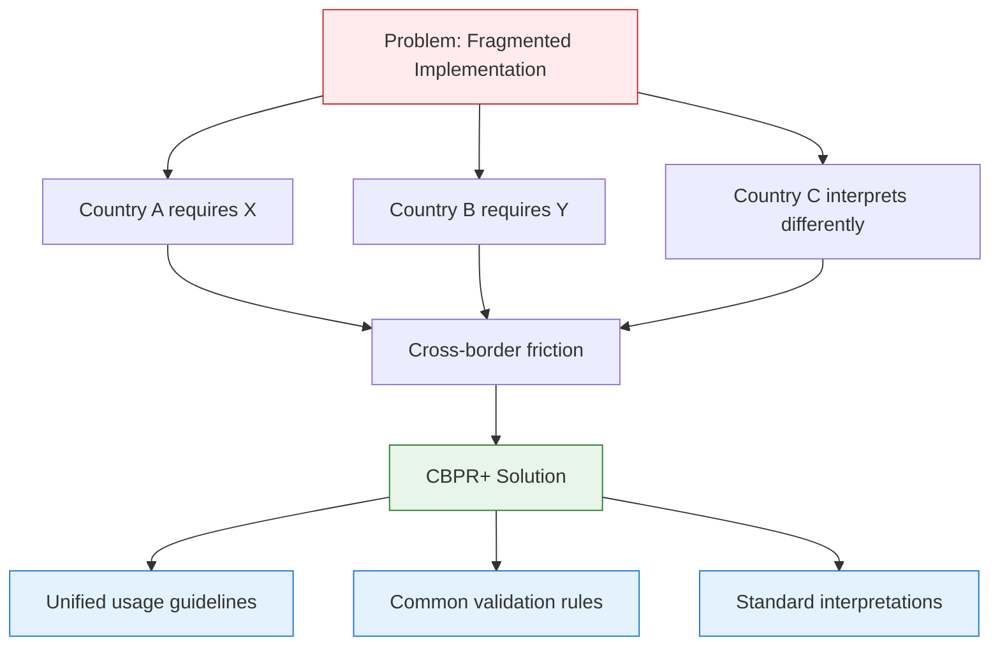
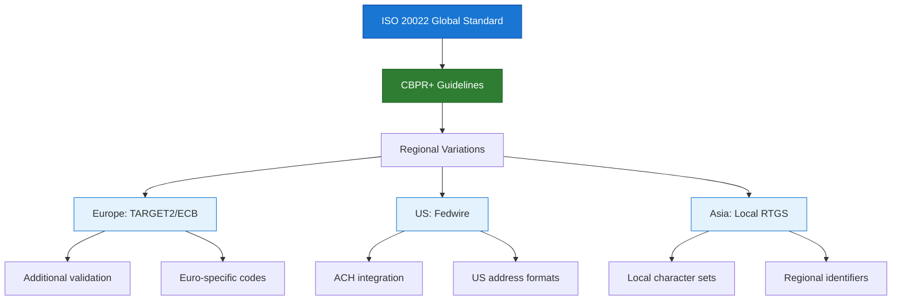
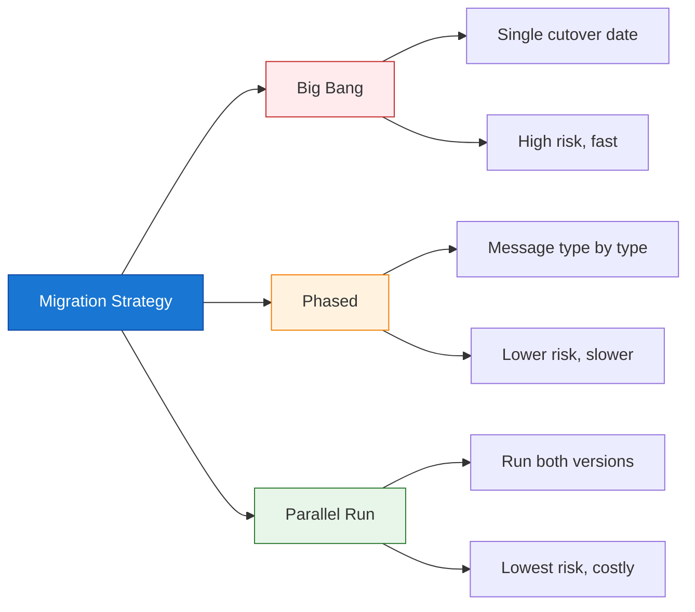
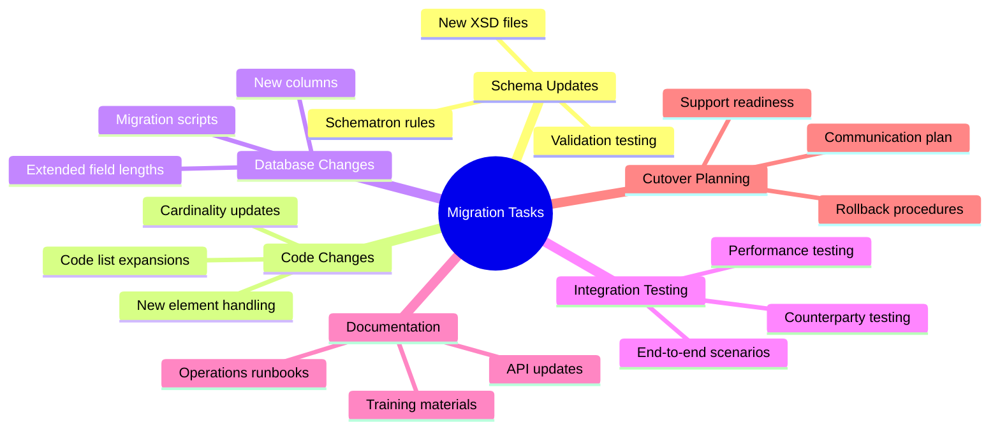
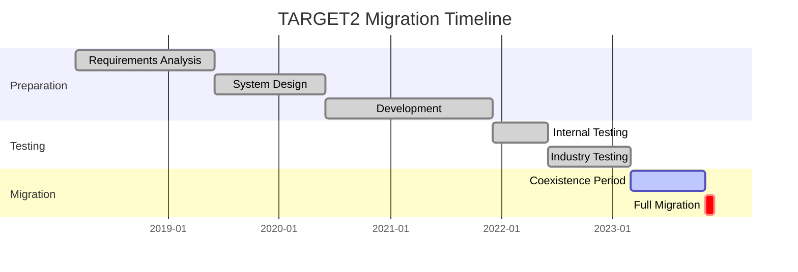
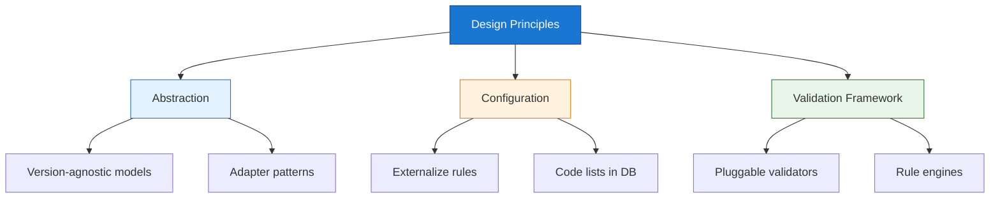

ISO 20022 is not static. RTGS systems must evolve with message versions, market practices, and regulatory mandates—without breaking settlement operations. This guide explains why version migration matters, what CBPR+ changes mean technically, and how to manage migrations successfully.

## 1 Why ISO 20022 Version Migration Matters

### 1.1 The Reality of Continuous Evolution



**The Challenge:**

| Factor | Impact on RTGS Systems |
|--------|----------------------|
| **Annual Message Updates** | New versions published yearly; systems must adapt |
| **Market Practice Variations** | Each jurisdiction adds local requirements |
| **Regulatory Mandates** | Central banks mandate adoption timelines |
| **Backward Compatibility** | Not guaranteed; breaking changes occur |
| **Coexistence Periods** | Multiple versions must be supported simultaneously |

### 1.2 What Drives Version Changes?



### 1.3 The Cost of Not Migrating

| Risk | Consequence |
|------|-------------|
| **Message Rejection** | Counterparties reject outdated versions |
| **Compliance Violations** | Regulatory penalties for non-compliance |
| **Operational Disruption** | Manual intervention for edge cases |
| **Data Quality Issues** | Missing enriched data fields |
| **Competitive Disadvantage** | Cannot support new payment types |

## 2 Understanding Message Versioning

### 2.1 ISO 20022 Version Notation

ISO 20022 message versions follow a standard pattern:

*   **Note:** The example notation below illustrates the ISO 20022 versioning pattern. The specific message type (`pacs.008.001.08`) is used as an illustrative example.

```
<BusinessArea>.<MessageNumber>.<Variant>.<Version>

Example: pacs.008.001.08
                          ↑
                          Version 08

Next version: pacs.008.001.09
                          ↑
                          Version 09
```

**Version Lifecycle:**


### 2.2 Types of Version Changes

| Change Type | Description | Impact Level | Example |
|-------------|-------------|--------------|---------|
| **Editorial** | Clarifications, no structural change | Low | Documentation updates |
| **Minor** | New optional elements, new codes | Low-Medium | New `ChrgsInf` element (optional) |
| **Major** | New mandatory elements, structure changes | High | `UltmtDbtr` becomes mandatory |
| **Breaking** | Removed elements, type changes | Critical | Field length reduction |

### 2.3 Version Compatibility Matrix
*   **Note:** The diagram below illustrates a proposed version compatibility model. Actual backward compatibility is not guaranteed by ISO 20022 and depends on each central bank's specific coexistence rules.
```mermaid
graph TB
    subgraph "v08 Systems"
        A1[Can read v08]
        A2[Cannot read v09]
    end

    subgraph "v09 Systems"
        B1[Can read v09]
        B2[Can read v08<br/>(backward compatible)]
    end

    subgraph "v10 Systems"
        C1[Can read v10]
        C2[Can read v09, v08<br/>(backward compatible)]
    end

    style A1 fill:#e8f5e9,stroke:#2e7d32
    style A2 fill:#ffebee,stroke:#c62828
    style B1 fill:#e8f5e9,stroke:#2e7d32
    style B2 fill:#e8f5e9,stroke:#2e7d32
    style C1 fill:#e8f5e9,stroke:#2e7d32
    style C2 fill:#e8f5e9,stroke:#2e7d32
```

**Important:** Backward compatibility is **not guaranteed** by ISO. Each central bank defines coexistence rules.

## 3 CBPR+: Cross-Border Payments and Reporting Plus

### 3.1 What is CBPR+?

!!!anote "📋 CBPR+ Overview"
    **CBPR+** (Cross-Border Payments and Reporting Plus) is a set of market practices developed by the ISO 20022 Payments Standards Group for cross-border payments.
    
    **Purpose:** Ensure consistent implementation of ISO 20022 across jurisdictions to enable seamless cross-border payments.
    
    **Scope:** Defines usage guidelines for pacs, camt, and admi messages in cross-border contexts.

**Why CBPR+ Exists:**



### 3.2 CBPR+ Impact on pacs Messages

**Key CBPR+ Requirements:**

| Requirement | Technical Change | Impact |
|-------------|-----------------|--------|
| **Enhanced Party Identification** | LEI (Legal Entity Identifier) usage clarified | Add LEI validation, storage |
| **Structured Addresses** | Preference for structured over unstructured | Update address handling logic |
| **Purpose Codes** | Extended code lists for payment purpose | Expand validation tables |
| **Ultimate Party Information** | Clearer rules on `UltmtDbtr`/`UltmtCdtr` | Update party resolution logic |
| **Charge Information** | Enhanced `ChrgsInf` structure | Add charge breakdown support |

### 3.3 Technical Changes: pacs.008 v08 to v09

Here's a concrete example of how CBPR+ influenced message evolution:

**Changed Elements:**
*   **Note:** The table below illustrates proposed element changes between `pacs.008` versions 08 and 09. These changes are specific examples to demonstrate the evolution of message structure and cardinality.
```diff
pacs.008.001.08 → pacs.008.001.09

┌─────────────────────────────────────────────────────────────┐
│ Element              │ v08        │ v09        │ Change Type │
├─────────────────────────────────────────────────────────────┤
│ ChrgsInf             │ 0..1       │ 0..n       │ Cardinality │
│                      │            │            │ (repeatable)│
├─────────────────────────────────────────────────────────────┤
│ ChrgsInf.ChrgBr      │ 0..1       │ 1..1       │ Mandatory   │
│                      │            │            │ (now required)│
├─────────────────────────────────────────────────────────────┤
│ UltmtDbtr            │ 0..1       │ 0..1       │ No change   │
│                      │            │            │ (but CBPR+  │
│                      │            │            │ clarifies   │
│                      │            │            │ usage)      │
├─────────────────────────────────────────────────────────────┤
│ PstlAdr.Ctry         │ 0..1       │ 1..1       │ Mandatory   │
│ (within UltmtDbtr)   │            │            │ (if address │
│                      │            │            │ present)    │
├─────────────────────────────────────────────────────────────┤
│ New: PstlAdr.Dept    │ —          │ 0..1       │ New element │
│                      │            │            │ (Department)│
└─────────────────────────────────────────────────────────────┘
```

**XML Comparison:**
*   **Note:** The XML snippets below are proposed examples to illustrate changes between `pacs.008` versions 08 and 09. These examples are simplified and do not represent complete `pacs.008` messages.
```xml
<!-- pacs.008.001.08 (Old) -->
<CdtTrfTxInf>
  <ChrgsInf>
    <Amt>
      <InstdAmt Ccy="USD">25.00</InstdAmt>
    </Amt>
    <!-- ChrgBr is optional -->
  </ChrgsInf>
</CdtTrfTxInf>

<!-- pacs.008.001.09 (New - CBPR+ compliant) -->
<CdtTrfTxInf>
  <ChrgsInf>
    <Amt>
      <InstdAmt Ccy="USD">25.00</InstdAmt>
    </Amt>
    <!-- ChrgBr is now MANDATORY -->
    <ChrgBr>SLEV</ChrgBr>
  </ChrgsInf>
  <!-- Multiple ChrgsInf allowed (0..n) -->
  <ChrgsInf>
    <Amt>
      <InstdAmt Ccy="USD">10.00</InstdAmt>
    </Amt>
    <ChrgBr>DEBT</ChrgBr>
  </ChrgsInf>
</CdtTrfTxInf>
```

### 3.4 CBPR+ Validation Rules

CBPR+ introduces additional validation beyond XSD:

*   **Note:** The XML snippet below is a proposed example of Schematron rules for CBPR+ validation. The specific rules implemented will depend on the business requirements and market practices.

```xml
<!-- Schematron Rule Example -->
<sch:rule context="UltmtDbtr">
  <!-- CBPR+ requires LEI for corporate entities -->
  <sch:assert test="LEI or not(contains(Nm, 'Corp'))">
    Corporate ultimate debtors must have LEI identifier
  </sch:assert>
</sch:rule>

<sch:rule context="PstlAdr">
  <!-- CBPR+ prefers structured addresses -->
  <sch:report test="AddrLine and (StrtNm or BldgNb)">
    Warning: Mixing structured and unstructured address elements
  </sch:report>
</sch:rule>
```
```

## 4 Local Market Practice Variations

### 4.1 Global Standard vs. Local Requirements



### 4.2 Common Local Variations

| Region | Variation | Technical Impact |
|--------|-----------|-----------------|
| **European Union** | TARGET2 migration rules | Additional validation, IBAN enforcement |
| **United States** | Fedwire ISO 20022 adoption | ACH integration, US address formats |
| **United Kingdom** | CHAPS migration | Faster Payments integration |
| **Asia-Pacific** | Local character set support | Unicode handling, transliteration rules |
| **Middle East** | Arabic script support | Bi-directional text handling |

### 4.3 Example: European vs. US Address Handling
*   **Note:** The XML snippets below are proposed examples illustrating different approaches to address handling. The actual fields and their usage may vary based on local market practices and ISO 20022 guidelines.
```xml
<!-- European Style (Structured, IBAN-focused) -->
<UltmtDbtr>
  <Nm>Acme GmbH</Nm>
  <PstlAdr>
    <StrtNm>Hauptstraße</StrtNm>
    <BldgNb>123</BldgNb>
    <PstCd>10115</PstCd>
    <TwnNm>Berlin</TwnNm>
    <Ctry>DE</Ctry>
  </PstlAdr>
  <CtryOfRes>DE</CtryOfRes>
</UltmtDbtr>

<!-- US Style (May use unstructured lines) -->
<UltmtDbtr>
  <Nm>Acme Corporation</Nm>
  <PstlAdr>
    <AddrLine>123 Main Street, Suite 456</AddrLine>
    <AddrLine>New York, NY 10001</AddrLine>
    <Ctry>US</Ctry>
  </PstlAdr>
  <CtryOfRes>US</CtryOfRes>
</UltmtDbtr>
```

**System Design Implication:** Support both structured and unstructured formats; don't assume one pattern.

## 5 Migration Strategies

### 5.1 Migration Approaches



**Comparison:**

| Approach | Pros | Cons | Best For |
|----------|------|------|----------|
| **Big Bang** | Clean cutover, single effort | High risk, all-or-nothing | Small systems, non-critical |
| **Phased** | Manageable chunks, lower risk | Extended timeline, complexity | Large systems, multiple message types |
| **Parallel Run** | Fallback available, test in production | Double infrastructure, costly | Mission-critical RTGS |

### 5.2 Technical Migration Checklist



### 5.3 Database Schema Evolution
Example: Handling pacs.008 v08 → v09 changes

*   **Note:** The SQL script below is a proposed example of database schema evolution to accommodate message version changes. The specific table and column modifications will depend on the existing database design and the nature of the message updates.

```sql
-- v08 Schema
CREATE TABLE payment_transaction_v08 (
    id              BIGSERIAL PRIMARY KEY,
    msg_id          VARCHAR(35) NOT NULL,
    tx_id           VARCHAR(35) NOT NULL,
    amount          NUMERIC NOT NULL,
    currency        CHAR(3) NOT NULL,
    charge_bearer   VARCHAR(4),              -- Optional in v08
    -- ... other fields
);

-- v09 Schema Changes
ALTER TABLE payment_transaction_v08 
    ALTER COLUMN charge_bearer SET NOT NULL;  -- Now mandatory

-- Add support for multiple charges (0..n instead of 0..1)
CREATE TABLE transaction_charges (
    transaction_id  BIGINT NOT NULL REFERENCES payment_transaction(id),
    charge_seq      INTEGER NOT NULL,         -- Sequence for ordering
    amount          NUMERIC NOT NULL,
    currency        CHAR(3) NOT NULL,
    charge_bearer   VARCHAR(4) NOT NULL,
    charge_type     VARCHAR(35),
    PRIMARY KEY (transaction_id, charge_seq)
);

-- Add new Department field for addresses
ALTER TABLE party_address 
    ADD COLUMN department VARCHAR(70);         -- New in v09
```

### 5.4 Code Evolution Strategy
**Version-Aware Processing:**
*   **Note:** The Java code snippet below is a proposed example of a version-aware processing strategy. The specific implementation using `switch` statements or adapter patterns may vary based on the programming language and architectural choices.
```java
public class PaymentProcessor {

    // Support multiple versions simultaneously
    public void processMessage(Document message) {
        String version = extractVersion(message);

        switch (version) {
            case "pacs.008.001.08":
                processV08(message);
                break;
            case "pacs.008.001.09":
                processV09(message);
                break;
            default:
                throw new UnsupportedVersionException(version);
        }
    }

    private void processV08(Document message) {
        // v08-specific handling
        // ChrgsInf is optional (0..1)
        ChrgsInf charges = transaction.getChrgsInf();
        if (charges != null) {
            // Process single charge
        }
    }

    private void processV09(Document message) {
        // v09-specific handling
        // ChrgsInf is repeatable (0..n) and ChrgBr is mandatory
        List<ChrgsInf> charges = transaction.getChrgsInf();
        for (ChrgsInf charge : charges) {
            // ChrgBr guaranteed to exist
            String bearer = charge.getChrgBr();  // Never null
            processCharge(charge);
        }
    }
}
```

## 6 Real-World Migration Example: TARGET2

### 6.1 TARGET2 ISO 20022 Migration

**Timeline:**



**Key Changes:**

| Aspect | Before (MT) | After (ISO 20022) |
|--------|-------------|-------------------|
| **Message Format** | SWIFT MT103/202 | pacs.008/009 |
| **Data Richness** | Limited, truncated | Full structured data |
| **Validation** | Basic field checks | XSD + Schematron + market practices |
| **Address Handling** | 4 lines unstructured | Structured + optional unstructured |
| **Party Identification** | BIC only | BIC + LEI + other identifiers |

### 6.2 Lessons Learned

| Lesson | Recommendation |
|--------|----------------|
| **Start early** | Begin migration 2-3 years before deadline |
| **Test extensively** | Industry testing reveals edge cases |
| **Plan for coexistence** | Support both old and new during transition |
| **Train teams** | Developers need ISO 20022 upskilling |
| **Monitor closely** | Enhanced logging during cutover period |

## 7 Version Management Best Practices

### 7.1 Design for Evolution
*   **Note:** The diagram below outlines proposed design principles for building evolvable systems in the context of ISO 20022 message versioning. The specific principles and their application can vary.


### 7.2 Implementation Patterns

**Pattern 1: Version Adapter**
*   **Note:** The Java code snippet below is a proposed example of a Version Adapter pattern. This pattern can be used to provide a consistent interface for different versions of messages.
```java
public interface PaymentMessage {
    String getTransactionId();
    Amount getAmount();
    Party getDebtor();
    Party getCreditor();
    // Common interface regardless of version
}

public class Pacs008V08Adapter implements PaymentMessage {
    private pacs008v08.Message internal;
    
    public String getTransactionId() {
        return internal.getPmtId().getTxId();
    }
    // Adapt v08 structure to common interface
}

public class Pacs008V09Adapter implements PaymentMessage {
    private pacs008v09.Message internal;
    
    public String getTransactionId() {
        return internal.getPmtId().getTxId();
    }
    // Adapt v09 structure to common interface
}
```

**Pattern 2: Externalized Validation**
*   **Note:** The XML snippet below is a proposed example of externalized validation rules. This approach allows rules to be updated without code changes but requires a separate rule engine.
```xml
<!-- validation-rules.xml -->
<validation-rules version="pacs.008.001.09">
    <rule element="ChrgsInf.ChrgBr" type="mandatory">
        Charge bearer is mandatory in v09+
    </rule>
    <rule element="PstlAdr.Ctry" type="mandatory" context="if-address-present">
        Country is mandatory when address is present
    </rule>
    <rule element="UltmtDbtr.LEI" type="recommended">
        LEI recommended for corporate entities (CBPR+)
    </rule>
</validation-rules>
```

### 7.3 Monitoring and Alerting
*   **Note:** The YAML snippet below is a proposed example of a monitoring configuration for version migration. The specific metrics, alert conditions, and labels will depend on the monitoring system and the migration strategy.
```yaml
# Monitoring configuration for version migration
metrics:
  - name: message_version_distribution
    type: histogram
    labels: [version, message_type]
    alert:
      condition: "v08_count > 0 AND migration_deadline_passed"
      severity: warning
      
  - name: validation_errors_by_version
    type: counter
    labels: [version, error_type]
    alert:
      condition: "error_rate > 5%"
      severity: critical
      
  - name: coexistence_duration
    type: gauge
    alert:
      condition: "days > 365"
      severity: warning  # Coexistence taking too long
```

## 8 Summary

!!!anote "📋 Key Takeaways"
    **Essential version migration knowledge:**

    ✅ **Why Migration Matters**
    - ISO 20022 evolves continuously (annual releases)
    - CBPR+ drives cross-border consistency
    - Local market practices add variations
    - Non-compliance means message rejection

    ✅ **CBPR+ Technical Impact**
    - Enhanced party identification (LEI requirements)
    - Structured address preferences
    - Expanded charge information (0..n cardinality)
    - Additional validation rules (Schematron)

    ✅ **Migration Strategies**
    - Big Bang: Fast but risky
    - Phased: Manageable but extended
    - Parallel Run: Safest but costly

    ✅ **Design for Evolution**
    - Version-agnostic data models
    - Externalized validation rules
    - Adapter patterns for version handling
    - Comprehensive monitoring

---

**Footnotes for this article:**

[^1]: **CBPR+** - Cross-Border Payments and Reporting Plus: Market practice guidelines for ISO 20022 cross-border payments
[^2]: **LEI** - Legal Entity Identifier: 20-character code for identifying legal entities in financial transactions
[^3]: **Schematron** - Rule-based XML validation language using XPath expressions
[^4]: **TARGET2** - Trans-European Automated Real-time Gross settlement Express Transfer system: Eurozone RTGS
[^5]: **PFMI** - Principles for Financial Market Infrastructures: CPSS-IOSCO standards for FMI governance
