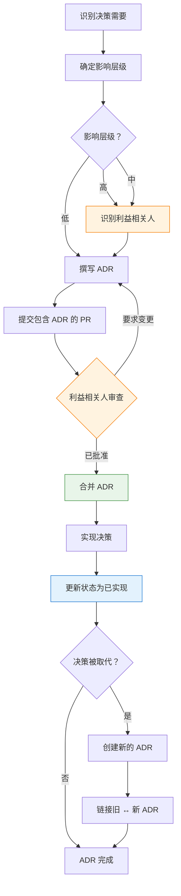

你已经写好了你的第一份 ADR。模板能用，团队也支持。接下来呢？

这篇文章涵盖当你将 ADR 扩展到单一团队之外时会发生什么——利益相关人管理、组织工作流程，以及向领导层证明价值。

**这是两部分系列文章的第二部分。**[第一部分](/2026/01/Architecture-Decision-Log-Guide-zh-CN) 涵盖基础知识——什么是 ADL、每个 ADR 必须回答的五个问题，以及真实范例。如果你是 ADR 新手，从那里开始。

---

## 1 利益相关人与职责

ADR 不是在真空中撰写的——它们影响团队、系统，有时是整个组织。提前识别利益相关人并厘清角色可以防止后续的惊喜。

### 谁应该参与？

| 决策范围 | 必要的利益相关人 | 可选/咨询 |
|----------|------------------|-----------|
| **服务层级**（团队内部） | 服务负责人、技术主管 | 相邻服务负责人 |
| **跨服务**（影响多个团队） | 所有受影响的团队主管、平台团队 | 安全、SRE |
| **平台/基础设施**（新技术、数据库） | 平台团队、SRE、安全 | 所有工程主管 |
| **业务关键**（支付、合规） | CTO、合规主管、法务 | 产品、风险管理 |

### 职责（RACI 模型）

| 角色 | 职责 | 典型担任者 |
|------|------|------------|
| **Responsible**（撰写 ADR） | 起草文件、收集数据、提出解决方案 | 提出变更的工程师 |
| **Accountable**（批准 ADR） | 最终决策权，对结果负责 | 技术主管、架构师或 CTO |
| **Consulted**（提供意见） | 审查、提供反馈、识别风险 | 受影响的团队、安全、SRE |
| **Informed**（被告知决策） | 工作需要知道，但不需要批准 | 其他工程师、产品经理 |

### 数据库选择 ADR 的 RACI 范例

| 利益相关人 | 角色 | 为什么 |
|------------|------|--------|
| Jane（提出的工程师） | **R**esponsible | 撰写 ADR、实现变更 |
| John（技术主管） | **A**ccountable | 最终批准，拥有架构方向 |
| Sarah（SRE 主管） | **C**onsulted | 将在生产环境中运维新数据库 |
| Mike（安全） | **C**onsulted | 必须验证加密、访问控制 |
| Lisa（相邻服务负责人） | **C**onsulted | 她的服务从这个数据库读取 |
| 工程团队 | **I**nformed | 需要知道待命、调试 |

### 如何在 ADR 中记录利益相关人

在背景章节后新增利益相关人章节：

```markdown
## 利益相关人

| 姓名 | 角色 | RACI | 团队 |
|------|------|------|------|
| Jane Doe | 作者 | Responsible | Platform |
| John Smith | 技术主管 | Accountable | Engineering |
| Sarah Lee | SRE 主管 | Consulted | Operations |
| Mike Brown | 安全 | Consulted | Security |

## 批准历史

| 角色 | 姓名 | 日期 | 状态 |
|------|------|------|------|
| 技术主管 | John Smith | 2025-11-03 | ✅ 已批准 |
| 安全 | Mike Brown | 2025-11-05 | ✅ 已批准 |
| SRE | Sarah Lee | 2025-11-06 | ✅ 已批准 |
```

### 何时升级

不是所有决策都能在团队层级做出。在以下情况升级：

| 触发因素 | 升级到 |
|----------|--------|
| 预算影响 > $50K/年 | CTO / VP Engineering |
| 影响 3+ 个团队 | 架构审查委员会 |
| 法规/合规影响 | 法务 + 合规主管 |
| 新技术采用（公司首次） | 首席工程师 + CTO |
| 推翻先前的高影响 ADR | 原始决策作者 + 架构师 |

### ADR 的人性面

记住：ADR 记录的是**人的决策**，不只是技术决策。一份精心制作的 ADR：

- **承认异议：** “团队成员 X 提出担忧 Y；我们通过 Z 缓解”
- **感谢贡献者：** “感谢 Sarah 识别出复制延迟问题”
- **保留背景：** “CTO 在 2025-11-03 审查负载测试结果后批准了这个方法”

这不是官僚主义——这是**组织记忆**。人员会离开。团队会重组。ADR 会保留下来。

---

## 2 完整工作流程：从决策到实现

这是在团队环境中管理 ADR 的完整端到端流程：



### 步骤 1：识别决策需要

有些事情触发了这个决策。明确说明是什么：

| 触发因素 | 范例 |
|----------|------|
| 需要架构变更的新功能 | “闪购功能需要库存重新设计” |
| 事故/事后复盘发现 | “黑色星期五停机暴露了锁竞争” |
| 技术债累积 | “数据库查询随时间变慢” |
| 团队反馈 | “待命工程师报告来自 X 的频繁警报” |

**输出：** 一句话的问题陈述。

---

### 步骤 2：确定影响层级

用这个决定谁需要参与：

| 问题 | 如果是 → 影响层级 |
|------|------------------|
| 推翻这个需要 > 1 个工程师月？ | **高** |
| 这会影响 3+ 个团队或服务？ | **高** |
| 这是法规/合规要求？ | **高** |
| 预算影响 > $50K/年？ | **高** |
| 新技术（公司首次）？ | **高** |
| 影响 2 个团队？ | **中** |
| 我们可以用配置变更撤销？ | **低** |
| 纯粹内部（没有客户端影响）？ | **低** |

**输出：** 影响层级（高 / 中 / 低）。

---

### 步骤 3：识别利益相关人

根据影响层级，识别谁需要参与：

| 影响层级 | 必要的利益相关人 |
|----------|------------------|
| **高** | 技术主管（Accountable）、安全、SRE、所有受影响的团队主管、CTO（如果预算/合规） |
| **中** | 技术主管（Accountable）、受影响的团队主管、SRE（如果有运维影响） |
| **低** | 技术主管（Accountable）、作者（Responsible） |

在 ADR 中记录利益相关人（模板见第 1 节）。

**输出：** 带有 RACI 分配的利益相关人列表。

---

### 步骤 4：撰写 ADR

填写所有章节。使用模板，但专注于质量而非形式主义：

| 章节 | 好的样子 | 危险信号 |
|------|----------|----------|
| **背景** | 具体问题、数据驱动（“高峰期间 3 秒延迟”） | 模糊（“系统很慢”） |
| **候选方案** | 2-3 个真正考虑的选项，诚实的权衡 | 稻草人、只有一个选项 |
| **决策** | 清晰、具体、可实现 | 埋在散文中、模糊 |
| **后果** | 至少列出 2-3 个负面 | 只有好处、没有权衡 |
| **相关** | 链接到影响/被影响的 ADR | 空的或“查看其他 ADR” |
| **利益相关人** | 具名的个人和 RACI | “团队决定的” |

**输出：** 准备好审查的 ADR 草稿。

---

### 步骤 5：提交包含 ADR 的 PR

创建一个包含以下内容的 pull request：

- 新的 ADR 文件
- 任何相关的代码变更（如果与决策一起实现）
- PR 描述链接到任何 RFC、设计文件或 prior 讨论

**PR 模板：**
```markdown
## ADR 摘要
- **决策：** [一句话]
- **影响层级：** [高/中/低]
- **咨询的利益相关人：** [列出姓名]

## 必要的审查者
- [ ] 技术主管（Accountable）
- [ ] 安全（如果适用）
- [ ] SRE（如果有运维影响）
- [ ] 受影响的团队主管

## 相关链接
- [链接到 RFC、设计文件或讨论]
```

**输出：** PR 开启，利益相关人已通知。

---

### 步骤 6：利益相关人审查

审查者应该验证：

| 角色 | 检查什么 |
|------|----------|
| **技术主管（Accountable）** | 决策符合架构愿景、权衡可接受 |
| **安全** | 没有安全漏洞、符合合规要求 |
| **SRE** | 理解运维负担、规划了监控/警报 |
| **受影响的团队** | 他们的担忧被解决、没有意外影响 |

**审查清单：**

在批准前，验证：

| # | 问题 | 通过？ |
|---|------|--------|
| 1 | 背景解释*为什么*需要这个决策 | ☐ |
| 2 | 至少 2-3 个真正考虑的替代方案 | ☐ |
| 3 | 决策清晰、具体、明确 | ☐ |
| 4 | 至少列出 2-3 个负面后果 | ☐ |
| 5 | 链接到影响和被影响的 ADR | ☐ |
| 6 | 识别出带有 RACI 的利益相关人 | ☐ |
| 7 | 咨询了适当的利益相关人 | ☐ |

**如果任何框未勾选：** 要求变更。还不要批准。

**输出：** 已批准的 ADR（或退回修改）。

---

### 步骤 7：合并 ADR

一旦所有必要的利益相关人批准：

1. 合并 PR（偏好 squash merge 以保持历史清晰）
2. ADR 编号现在是项目历史的一部分
3. 在团队频道（Slack、Teams 等）分享以提高可见性

**输出：** ADR 已合并，状态 = “已接受”。

---

### 步骤 8：实现决策

构建这个东西。在实现期间：

- 在 commit 消息中引用 ADR 编号（`git commit -m "feat: implement inventory reservation (ADR-0042)"`）
- 如果实现偏离 ADR，先更新 ADR
- 如果出现新的权衡，将它们记录为注解或在后续 ADR 中

**输出：** 实现完成，已部署到生产环境。

---

### 步骤 9：更新状态为已实现

在部署和验证后：

1. 更新 ADR 状态：`已接受` → `已实现`
2. 新增实现日期和任何经验教训
3. 如果相关，链接到 runbook、仪表板或运维文件

```markdown
## 状态
已实现（2026-02-15）

## 实现注解
- 于 2026-02-15 部署到生产环境
- 初始负载测试：成功处理 12K 并发用户
- 新增监控：队列深度警报在 1000 项目
- Runbook：/docs/runbooks/inventory-reservation.md
```

**输出：** ADR 反映实际状态。

---

### 步骤 10：维护（取代或弃用）

决策不会永远持续。当情况改变时：

**如果推翻决策：**
1. 创建新的 ADR（例如 ADR-0050）
2. 在背景章节中引用原始 ADR（ADR-0042）
3. 更新原始 ADR 状态：`已实现` → `被 ADR-0050 取代`
4. 双向链接（旧 ↔ 新）

**如果逐步淘汰：**
1. 更新原始 ADR 状态：`已实现` → `已弃用`
2. 新增弃用时间表和迁移计划
3. 为替换方法创建后续 ADR

**输出：** ADR 生命周期完成，架构历史保留。

---

## 3 深度探讨：列出候选方案应该是强制性的吗？

这是关于 ADR 最受争议的问题。让我们分析一下。

### 支持强制候选方案的理由

**论点 1：这证明你实际上考虑了替代方案**

没有候选方案章节，你无法区分：
- 经过充分研究、评估选项的决策
- 盲目跟风的决策（“我在上一家公司用 Redis”）
- 政治决策（“CTO 喜欢 MongoDB”）

候选方案表**强迫知识诚实**。如果你说不出至少一个替代方案，你思考得不够深入。

**论点 2：为未来推翻提供背景**

当后来有人问“为什么不用 PostgreSQL？”时，答案已经记录好了：

```markdown
## 候选方案

| 选项 | 为什么拒绝 |
|------|------------|
| PostgreSQL | 在 10K 并发用户时写入延迟 > 200ms（负载测试失败） |
| DynamoDB | 成本预估：12K/月 vs. Redis 在我们的访问模式下 3K |
```

这防止**循环辩论**——相同的论点在机构记忆消失后多年重新浮现。

**论点 3：揭示决策质量**

候选方案表暴露弱决策：

| 质量信号 | 看起来像 |
|----------|----------|
| **强决策** | 3-4 个候选方案、清晰的权衡、数据驱动的选择 |
| **弱决策** | 1 个候选方案（选择的那个）、没有列出替代方案 |
| **形式主义** | 5+ 个候选方案，但都明显较差（稻草人论点） |

如果你的 ADR 只有一个选项，问：*我们在隐藏什么吗？*

### 反对强制候选方案的理由

**论点 1：有时只有一个可行的选项**

法规要求、现有基础设施或硬性限制可以消除替代方案：

```
背景：必须存储持卡人数据
限制：需要 PCI-DSS 合规
候选方案：只有加密数据库符合条件
决策：使用带有静态加密的 AWS RDS（唯一符合 PCI + 现有基础设施的选项）
```

在这种情况下，列出“没有加密的 PostgreSQL”作为候选方案是**形式主义**——它从来不可行。

**论点 2：小决策不需要它**

不是每个 ADR 都是数据库选择。有些决策很狭窄：

```
ADR-0067：为 API Gateway 启用 HTTP/2
背景：性能改进，没有破坏性变更
决策：在 Envoy 配置中启用 HTTP/2
```

在这里要求候选方案表（“考虑了 HTTP/1.1、gRPC、HTTP/3”）增加了**没有价值的官僚主义**。

**论点 3：分析瘫痪**

团队可能会陷入记录每个可能的替代方案而不是交付：

```
工程师：“我们应该用 Redis 还是 Memcached？”
团队：“让我研究 12 个选项并写一个 3 页的比较...”
*两周后，还在辩论*
```

在某个点上，**足够好且已交付**胜过**完美且已记录**。

### 我们的建议：分层方法

| 决策影响 | 需要候选方案？ | 理由 |
|----------|----------------|------|
| **高**（数据库、一致性模型、服务边界） | ✅ 强制（≥2 个选项） | 推翻成本高；团队需要理解权衡 |
| **中**（函数库选择、集成模式） | ⚠️ 推荐（≥1 个替代方案） | 值得记录，但不要阻挡 PR |
| **低**（配置变更、小重构） | ❌ 可选 | ADR 本身可能过度设计；改用 PR 描述 |

**决策影响评估：**

问这些问题来确定层级：

| 问题 | 如果是 → |
|------|----------|
| 推翻这个需要 > 1 个工程师月？ | 高影响 |
| 这会影响多个服务/团队？ | 高影响 |
| 这是法规/合规要求？ | 高影响 |
| 这在 2 年后还重要吗？ | 高影响 |
| 我们可以用配置变更撤销？ | 低影响 |
| 纯粹内部（没有客户端影响）？ | 低影响 |

### 如果你真的只有一个候选方案怎么办？

有时限制条件消除了替代方案。在这种情况下，**记录限制条件**：

```markdown
## 候选方案

| 选项 | 状态 |
|------|------|
| **AWS KMS** | ✅ 已选择（唯一符合所有要求的服务） |
| HashiCorp Vault | ❌ 拒绝（需要自托管，违反“无新基础设施”限制） |
| Azure Key Vault | ❌ 拒绝（不支持多云，违反“仅 AWS”限制） |

**消除替代方案的限制条件：**
- 必须完全托管（无自托管解决方案）
- 必须是 AWS 原生（多云不在范围内）
- 必须支持 HSM 支持的密钥（法规要求）

鉴于这些限制条件，AWS KMS 是唯一可行的选项。
```

这不是形式主义——这是**明确的限制条件文档**。未来的读者理解为什么“决策”实际上不是决策。

---

## 4 常见陷阱（及如何避免）

**陷阱 1：事后撰写 ADR**

❌ *六个月后，试图记住为什么选择 MongoDB*

✅ **修复：** 将 ADR 创建纳入架构变更的 PR 清单。没有 ADR = 不合并。

**陷阱 2：稻草人候选方案**

❌ *列出明显较差的替代方案让选择的选项看起来更好*

```
| 选项 | 适合度 |
|------|--------|
| MongoDB | ✅ 强 |
| Microsoft Access | ❌ 差（哈哈，不） |
| Excel 试算表 | ❌ 差（显然） |
```

✅ **修复：** 只列出**真正考虑过**的替代方案。如果你没有认真考虑过，不要列出它。

**陷阱 3：太多细节**

❌ *40 页的会议纪要、UML 图和电子邮件往来*

✅ **修复：** 坚持模板。背景应该是 3-5 个要点。决策应该是一个清晰的段落。

**陷阱 4：没有所有者**

❌ *“团队决定的...”（谁？什么时候？）*

✅ **修复：** 在前言或标题中包含作者和日期。

**陷阱 5：从不更新**

❌ *决策说“PostgreSQL”但系统两年前迁移到 DynamoDB*

✅ **修复：** 当变更架构时，创建取代的 ADR。双向链接。

**陷阱 6：隐藏权衡**

❌ *只列出好处，假装没有缺点*

✅ **修复：** 强迫自己列出至少 3 个负面后果。如果你不能，你思考得不够深入。

---

## 5 衡量 ADL 效果

你怎么知道你的 ADL 是否有效？

| 指标 | 目标 | 如何衡量 |
|------|------|----------|
| **Onboarding 时间** | 减少 30% | 调查新员工：“你多快理解关键决策？” |
| **决策推翻** | 每年 < 10% | 追踪被取代的 ADR；高比率 = 匆忙的决策 |
| **事故 MTTR** | 减少 25% | 在事后复盘期间，衡量理解设计意图的时间 |
| **ADL 新鲜度** | > 90% 最新 | 季度审查：符合当前状态的 ADR 百分比 |
| **候选方案覆盖率** | 100% 有 ≥2 个选项 | 审核：每个 ADR 列出考虑的替代方案 |

**季度 ADL 审查清单：**

- [ ] 所有已接受的决策都有对应的已实现状态（如果已部署）
- [ ] 被取代的决策链接到替换
- [ ] 没有孤立的决策（没有被引用、没有引用任何东西）
- [ ] **候选方案考虑**表完整（≥2 个选项）
- [ ] 移除或归档不再相关的已弃用决策

---

## 6 回报：采用 ADL 前后的真实情境

让我们走过四个真实情境。这些不是假设的——这是我们在采用（或跳过）架构文档的团队中反复看到的模式。

---

### 情境 1：新工程师 Onboarding

**采用 ADL 前（第 2 週）：**

```
第 3 天：Marcus（新员工）加入 Platform 团队。
第 4 天：被分配修复库存预留系统中的 bug。
第 5 天：Marcus 阅读代码。很复杂——Redis Lua 脚本、TTL 处理、
       重试逻辑。他不理解*为什么*这样构建。

Marcus：“嘿，为什么库存使用最终一致性？为什么不
        直接用数据库事务？”

资深工程师（Priya）：*从屏幕前抬起头* “嗯，好问题。
                         我想是为了性能？闪购或
                         类似的东西？”

Marcus：“我应该重构它来使用事务吗？会简化代码。”

Priya：“呃...也许？让我想想。实际上，等等——Sarah
       在离开前不是做过这个吗？让我检查 git blame...”

*Priya 挖掘 18 个月前的提交历史*
*找到一条提交消息：“为闪购切换到最终一致性”*
*没有关于为什么、考虑了哪些替代方案，或解决了什么问题背景*

Priya：“好吧，看起来强一致性在高流量事件期间造成问题。
        但我不知道细节。也许先不要重构？问问别人？”

Marcus：*点头，困惑* “好吧...我就只修复 bug，不触及
         架构。”

*结果：*
- Marcus 花了 3 天试图理解设计
- Priya 损失 2 小时挖掘历史
- 真正的原因（2024 年黑色星期五期间的锁竞争）从未恢复
- Marcus 不愿再次处理这段代码
- 知识仍然是部落式的——Priya 现在“拥有”这个背景直到她也离开
```

**采用 ADL 後（第 2 週）：**

```
第 3 天：Marcus（新员工）加入 Platform 团队。
第 4 天：被分配修复库存预留系统中的 bug。
第 5 天：Marcus 阅读代码。很复杂——Redis Lua 脚本、TTL 处理、
       重试逻辑。他不理解*为什么*这样构建。

Marcus：“嘿，为什么库存使用最终一致性？”

资深工程师（Priya）：“查看 ADR-0042。Sarah 在调到
                         Infrastructure 团队前写的。它有完整的
                         细分——考虑的替代方案、负载测试
                         结果，全部都有。”

*Marcus 打开 docs/architecture/decisions/0042-eventual-consistency-for-inventory.md*

*10 分钟后：*

Marcus：“好吧，所以：
         - 强一致性在闪购期间造成 2-3 秒延迟
         - 他们测试了 3 个选项：强一致性、最终一致性 + 预留、
           和最终一致性 + 超卖缓冲
         - 选择最终一致性 + 预留是因为它扩展而不会超卖
         - 权衡：复杂的超时处理、边界情况是用户在支付超过
           10 分钟时失去购物车
         - 他们新增了队列深度监控和购物车恢复邮件
           流程来缓解

         现在有意义了。复杂性是故意的。”

Priya：“对。如果你看 ADR-0051，他们还分别记录了支付
       超时处理。如果你在处理那段代码，这是好的阅读材料。”

Marcus：“知道了。我正在修复的 bug——是否与后果章节中提到的
        TTL 过期逻辑相关？”

Priya：*瞥了一眼 ADR* “对，可能是。检查他们列出的
       缓解措施——他们提到一个每分钟运行的 cron 作业。那里有
       我们一直想修复的已知竞争条件。”

*结果：*
- Marcus 在 10 分钟内理解了设计
- Priya 没有损失上下文切换时间
- Marcus 将 ADR 链接到他的实际 bug（TTL 竞争条件）
- Marcus 现在知道要读哪些其他 ADR（0051、0038、0045）
- Sarah 的知识持续存在，即使她在不同的团队
```

**可测量的差异：**

| 指标 | 采用 ADL 前 | 采用 ADL 後 |
|------|------------|-----------|
| 理解系统的时间 | 3 天 | 10 分钟 |
| 资深工程师打断 | 2 小时 | 30 秒 |
| 知识恢复 | 不完整（遗失） | 完整（已记录） |
| 修改代码的信心 | 低 | 高 |

---

### 情境 2：生产环境事故事后复盘

**采用 ADL 前（事故回应）：**

```
凌晨 2:47：PagerDuty 警报——库存服务延迟尖峰。第 95 百分位数
         在 4.2 秒。结账转换率下降。

待命工程师（David）：*醒来，打开笔记本电脑* “好吧，发生什么事？”

*检查仪表板：*
- Redis CPU：89%
- 预留队列深度：12,000 项目（正常：~200）
- 超时作业落后

David：“为什么队列这么拥塞？有什么变更吗？”

*检查 Slack：*
- 最近没有部署
- 没有已知问题

David：*开始挖掘代码* “这个超时作业到底是做什么的？
       为什么每分钟运行一次？谁写了这个？”

*Git blame 显示：作者 "Sarah Chen"，18 个月前*
*Slack：Sarah 现在在不同的公司*

David：*在团队频道发消息* “有人知道为什么库存
       超时作业存在吗？如果我停用它会发生什么？”

*30 分钟过去。没有回应——电话上没人知道。*

David：“好吧，我就重启 Redis 集群来清空队列。
       不理想，但我们需要解锁结账。”

*重启 Redis。队列清空。延迟下降。*

早上 6:00：服务稳定。David 去睡觉。

早上 10:00：事后复盘会议。

经理：“什么原因导致事故？”

David：“队列拥塞。超时作业跟不上。我不知道为什么
        作业存在或正确的行为应该是什么。”

经理：“我们能防止这个吗？”

David：“不先理解设计就不能。我们需要找到做过这个的人。
        或者重写它。”

*结果：*
- MTTR：3+ 小时（大部分花在理解系统）
- 根本原因：未知（设计意图遗失）
- 预防：“重写系统”（昂贵、有风险）
- 团队信心：动摇
```

**采用 ADL 後（事故回应）：**

```
凌晨 2:47：PagerDuty 警报——库存服务延迟尖峰。第 95 百分位数
         在 4.2 秒。结账转换率下降。

待命工程师（David）：*醒来，打开笔记本电脑* “好吧，发生什么事？”

*检查仪表板：*
- Redis CPU：89%
- 预留队列深度：12,000 项目（正常：~200）
- 超时作业落后

David：“队列拥塞了。让我检查 ADR-0042——这是 Sarah 设计的
       预留系统。”

*打开 ADR-0042，滚动到后果 > 负面：*
“- 运维负担：监控预留队列深度”
“- 缓解：在队列深度 > 1000 时新增警报”

David：“好吧，所以队列深度是已知指标。还有一个超时作业
       每分钟运行...”

*滚动到决策章节：*
“超时将预留释放回可用池”

David：“超时作业释放过时的预留。如果落后，有效的
       项目被锁在过时的预留中。这就是为什么结账
       失败——项目显示‘缺货’，但实际上只是
       预留且过时了。”

*检查 ADR 中链接的 runbook：*
“/docs/runbooks/inventory-reservation.md”

*Runbook 说：*
“已知问题：超时作业在流量尖峰期间可能落后。
 安全手动触发：`redis-cli evalsha <SHA> 0 force-timeout`
 这会立即处理队列。”

David：*运行命令* “队列正在排空。延迟下降。”

凌晨 3:15：服务稳定。

早上 10:00：事后复盘会议。

经理：“什么原因导致事故？”

David：“超时作业在流量尖峰期间落后。ADR-0042 将这个记录为
        已知权衡。缓解措施是手动队列排空，
        这有效。但我们应该自动化它。”

经理：“我们能防止这个吗？”

David：“可以。ADR 说‘监控队列深度’——我们有警报，但
        我们应该在深度 > 5000 时自动触发超时作业。我会
        创建一个 ticket。”

*结果：*
- MTTR：28 分钟（设计意图已记录）
- 根本原因：已知权衡，18 个月前记录
- 预防：清晰的行动项目（自动触发超时作业）
- 团队信心：高（系统可理解）
```

**可测量的差异：**

| 指标 | 采用 ADL 前 | 采用 ADL 後 |
|------|------------|-----------|
| MTTR | 3+ 小时 | 28 分钟 |
| 识别根本原因 | 否 | 是（已知权衡） |
| 预防行动 | “重写系统” | “新增自动触发” |
| 待命压力等级 | 高 | 可管理 |

---

### 情境 3：推翻决策（6 个月后）

**采用 ADL 前（决策推翻）：**

```
6 个月后。流量增长了 10 倍。库存系统在挣扎。

工程师（Lisa）：“我想我们需要从 Redis 切换到专门的
                 带有分片的库存服务。Redis 达到内存
                 限制。”

技术主管（Marcus）：“等等，我们当初为什么选择 Redis？”

Lisa：*挖掘 Slack、旧 PR、提交消息* “我找不到
      任何东西。Sarah 不在这里了。Priya，你记得吗？”

Priya：“我想是为了速度？但老实说，我不知道我们是否
       考虑过其他选项。”

Marcus：“好吧，所以我们有三个选项：
         1. 坚持用 Redis 并分片（复杂，但熟悉）
         2. 切换到 PostgreSQL（较慢，但处理更大的数据集）
         3. 用 DynamoDB 构建自定义服务（灵活，但新技术）

         有人知道我们当初为什么没有做 #2 或 #3 吗？”

*沉默。没人知道。*

Lisa：“我们应该只测试所有三个吗？”

Marcus：“那像是 3 週的工作，只是重新学习 Sarah 已经
         弄清楚的东西。”

*结果：*
- 团队花 3 週重新评估选项
- 他们最终选择 PostgreSQL（Sarah 18 个月前因写入延迟拒绝）
- 两个月后，他们发现 Sarah 记录的延迟问题
- 他们切换回带分片的 Redis
- 总共浪费的时间：5 週
```

**采用 ADL 後（决策推翻）：**

```
6 个月后。流量增长了 10 倍。库存系统在挣扎。

工程师（Lisa）：“我想我们需要重新审视 ADR-0042。Redis 在
                 我们的规模下达到内存限制。”

技术主管（Marcus）：“好主意。让我检查 Sarah 记录了什么。”

*打开 ADR-0042，滚动到候选方案考虑：*

| 选项 | 为什么拒绝 |
|------|------------|
| PostgreSQL | 在 10K 并发用户时写入延迟 > 200ms（负载测试失败） |
| DynamoDB | 成本预估：12K/月 vs. Redis 在我们的访问模式下 3K |

Marcus：“好吧，所以 PostgreSQL 在 10K 并发用户时负载测试失败。
        我们现在的高峰是多少？”

Lisa：“闪购期间约 15K 并发用户。”

Marcus：“我们达到 Redis 内存限制在...”

Lisa：“约 5 千万预留记录。我们现在在 4 千 2 百万。”

Marcus：“所以原始决策在当时的规模下是正确的。但我们已经
        超过它了。让我检查迁移路径章节...”

*滚动到迁移路径：*
“如果我们超过单个 Redis 实例：
 1. 为报告查询新增读取副本（立即）
 2. 按日期分区（90 天前的订单归档到存档表）
 3. 如果写入量超过 50K/天，按 customer_id 分片（12-18 个月后）
 4. 分片的预估工作：2-3 个工程师月”

Marcus：“Sarah 预测到这个。她说在 50K/天时按 customer_id 分片。
        我们现在在 45K/天。我们在窗口内。”

Lisa：“所以我们分片 Redis 而不是切换数据库？”

Marcus：“对。如果分片不行，我们有 PostgreSQL 负载测
        试结果——我们知道它在我们的并发下会失败。不需要
        重新测试。”

Lisa：“DynamoDB 呢？成本是阻碍。让我检查那是否
        仍然正确...”

*检查 AWS 定价、当前使用量*

Lisa：“在我们的规模下，DynamoDB 现在会是 18K/月。Redis 分片
       仍然约 5K。经济学没有改变。”

Marcus：“创建一个 Redis 分片的 ticket。参考 ADR-0042 并链接
       到分片实现的新 ADR。”

*结果：*
- 团队在 2 小时内评估选项（不是 3 週）
- 他们选择正确的路径（Redis 分片）基于记录的数据
- 他们避免重新发现已知问题（PostgreSQL 延迟）
- 新 ADR（0089）链接回原始，保留决策链
```

**可测量的差异：**

| 指标 | 采用 ADL 前 | 采用 ADL 後 |
|------|------------|-----------|
| 评估选项的时间 | 3 週 | 2 小时 |
| 决策质量 | 差（选择被拒绝的选项） | 高（基于先前的分析） |
| 浪费的工程时间 | 5 週 | 0 |
| 决策信心 | 低 | 高 |

---

### 情境 4：合规审核

**采用 ADL 前（审核准备）：**

```
合规主管（Rachel）：“我们下个月有 SOC 2 审核。我需要
                             关于你如何处理财务交易数据完整性的
                             文档。”

CTO（James）：“呃...我们有测试？我们用带有 ACID 的数据库？”

Rachel：“审核员想看设计决策。为什么你选择
        库存的最终一致性？你如何防止超卖？”

James：*恐慌* “让我召集团队。”

*团队花 2 週：*
- 挖掘旧 PR
- 从 Slack 重构设计讨论
- 创建解释当前系统的图表
- 撰写一个 40 页的文档解释架构

Rachel：“这很好，但你能证明这是故意的设计
        而不只是...发生的吗？”

James：“嗯，Sarah 设计的。但她离开了。我们想这是
       意图？”

Rachel：“审核员想要当时决定的签名批准。”

James：*出汗* “我们...没有那个？”

Rachel：“好吧，我会儿诉审核员控制存在但文档
        不完整。预期会有发现。”

*结果：*
- 2 週的工程时间花在重构历史
- 审核发现：“架构控制的文档不足”
- 团队必须创建追溯文档（低质量、匆忙）
- 与审核员的信任受损
```

**采用 ADL 後（审核准备）：**

```
合規主管（Rachel）：「我們下個月有 SOC 2 審核。我需要
                             關於你如何處理財務交易資料完整性的
                             文件。」

CTO（James）：「查看 docs/architecture/decisions/。ADR-0042 涵蓋
             庫存設計，ADR-0037 涵蓋付款整合，
             ADR-0051 涵蓋超時處理。全部都有批准簽名
             和利害關係人簽署。」

Rachel：*打開 ADR-0042* 「好吧，這很完美。它顯示：
         - 問題（閃購期間的鎖競爭）
         - 考慮的選項（3 個替代方案）
         - 決策（帶有預訂的最終一致性）
         - 控制（監控、警報、runbook）
         - 利害關係人（安全、SRE、技術主管——全部批准）
         - 日期（決策：2025-11-03，實作：2026-02-15）

         誰簽署了這個？」

James：「Sarah（作者）、Priya（技術主管）、Mike（安全）和 David
       （SRE）。全部在批准歷史章節。」

Rachel：「權衡呢？」

James：「記錄了——複雜性、邊界情況、營運負擔。加上
       每個的緩解措施。」

Rachel：「這正是審核員想要的。清晰的決策軌跡、
        利害關係人問責、記錄的控制。」

*結果：*
- 0 週工程時間（文件已經存在）
- 審核發現：無（控制良好記錄）
- 與審核員的信任加強
- 團隊可以專注於實際工作，而不是追溯文件
```

**可測量的差異：**

| 指標 | 採用 ADL 前 | 採用 ADL 後 |
|------|------------|-----------|
| 審核的工程時間 | 2 週 | 0 |
| 審核發現 | 1（文件缺口） | 0 |
| 審核員信心 | 低 | 高 |
| 團隊壓力 | 高 | 低 |

---

## 真正的價值

ADR 不是關於官僚主義。它們是關於**尊重未來的自己**和你的隊友。

複雜系統有太多相互依賴而不能依賴部落知識。當決策被記錄時：

| 好處 | 看起來像 |
|------|----------|
| **導入加速** | 新員工閱讀 ADR，而不是挖掘 git blame |
| **事故解決更快** | 在事後復盤期間理解設計意圖 |
| **可逆轉性改善** | 知道如果改變方向會破壞什麼 |
| **知識持續** | 團隊成員離開，決策保留 |
| **審核順利** | 合規對應已經完成 |
| **辯論結束** | 決策堅持；沒有循環重新辯論 |
| **信任建立** | 利益相關人看到他們的擔憂被記錄 |

**替代方案：**

每次有人離開，知識就隨之流失。每個事故都變成謎團。每個決策都被重新辯論。每個審核都變成爭搶。

這就是*不*撰寫 ADR 的代價。

**從小處開始。記錄重要的決策。保持模板精簡。你未來的團隊會感謝你。**

---

## 系列導航

- **[第一部分：實用指南](/2026/01/Architecture-Decision-Log-Guide-zh-CN)** — 學習基礎知識：什麼是 ADR、每個 ADR 必須回答的五個問題、真實電商範例，以及可直接複製的模板。

---

**進一步閱讀：**

- Michael Nygard 的原始 [ADR 格式](https://cognitect.com/blog/2011/11/15/documenting-architecture-decisions)
- `adr-tools` [CLI 工具](https://github.com/npryce/adr-tools)
- "Software Architecture for Developers" — 關於決策記錄的章節
