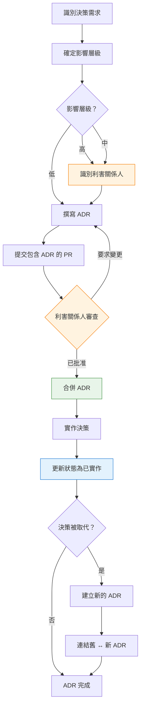

你已經寫好了你的第一份 ADR。模板能用，團隊也支持。接下來呢？

這篇文章涵蓋當你將 ADR 擴展到單一團隊之外時會發生什麼——利害關係人管理、組織工作流程，以及向領導層證明價值。

**這是兩部分系列文章的第二部分。**[第一部分](/2026/01/Architecture-Decision-Log-Guide-zh-TW) 涵蓋基礎知識——什麼是 ADL、每個 ADR 必須回答的五個問題，以及真實範例。如果你是 ADR 新手，從那裡開始。

---

## 1 利害關係人與職責

ADR 不是在真空中撰寫的——它們影響團隊、系統，有時是整個組織。提前識別利害關係人並釐清角色可以防止後續的驚喜。

### 誰應該參與？

| 決策範圍 | 必要的利害關係人 | 可選/諮詢 |
|----------|------------------|-----------|
| **服務層級**（團隊內部） | 服務負責人、技術主管 | 相鄰服務負責人 |
| **跨服務**（影響多個團隊） | 所有受影響的團隊主管、平台團隊 | 安全、SRE |
| **平台/基礎設施**（新技術、資料庫） | 平台團隊、SRE、安全 | 所有工程主管 |
| **業務關鍵**（付款、合規） | CTO、合規主管、法務 | 產品、風險管理 |

### 職責（RACI 模型）

| 角色 | 職責 | 典型擔任者 |
|------|------|------------|
| **Responsible**（撰寫 ADR） | 起草文件、收集資料、提出解決方案 | 提出變更的工程師 |
| **Accountable**（批准 ADR） | 最終決策權，對結果負責 | 技術主管、架構師或 CTO |
| **Consulted**（提供意見） | 審查、提供反饋、識別風險 | 受影響的團隊、安全、SRE |
| **Informed**（被告知決策） | 工作需要知道，但不需要批准 | 其他工程師、產品經理 |

### 資料庫選擇 ADR 的 RACI 範例

| 利害關係人 | 角色 | 為什麼 |
|------------|------|--------|
| Jane（提出的工程師） | **R**esponsible | 撰寫 ADR、實作變更 |
| John（技術主管） | **A**ccountable | 最終批准，擁有架構方向 |
| Sarah（SRE 主管） | **C**onsulted | 將在生產環境中營運新資料庫 |
| Mike（安全） | **C**onsulted | 必須驗證加密、訪問控制 |
| Lisa（相鄰服務負責人） | **C**onsulted | 她的服務從這個資料庫讀取 |
| 工程團隊 | **I**nformed | 需要知道待命、除錯 |

### 如何在 ADR 中記錄利害關係人

在背景章節後新增利害關係人章節：

```markdown
## 利害關係人

| 姓名 | 角色 | RACI | 團隊 |
|------|------|------|------|
| Jane Doe | 作者 | Responsible | Platform |
| John Smith | 技術主管 | Accountable | Engineering |
| Sarah Lee | SRE 主管 | Consulted | Operations |
| Mike Brown | 安全 | Consulted | Security |

## 批准歷史

| 角色 | 姓名 | 日期 | 狀態 |
|------|------|------|------|
| 技術主管 | John Smith | 2025-11-03 | ✅ 已批准 |
| 安全 | Mike Brown | 2025-11-05 | ✅ 已批准 |
| SRE | Sarah Lee | 2025-11-06 | ✅ 已批准 |
```

### 何時升級

不是所有決策都能在團隊層級做出。在以下情況升級：

| 觸發因素 | 升級到 |
|----------|--------|
| 預算影響 > $50K/年 | CTO / VP Engineering |
| 影響 3+ 個團隊 | 架構審查委員會 |
| 法規/合規影響 | 法務 + 合規主管 |
| 新技術採用（公司首次） | 首席工程師 + CTO |
| 推翻先前的高影響 ADR | 原始決策作者 + 架構師 |

### ADR 的人性面

記住：ADR 記錄的是**人的決策**，不只是技術決策。一份精心製作的 ADR：

- **承認異議：** 「團隊成員 X 提出擔憂 Y；我們通過 Z 緩解」
- **感謝貢獻者：** 「感謝 Sarah 識別出複製延遲問題」
- **保留背景：** 「CTO 在 2025-11-03 審查負載測試結果後批准了這個方法」

這不是官僚主義——這是**組織記憶**。人員會離開。團隊會重組。ADR 會保留下來。

---

## 2 完整工作流程：從決策到實作

这是在團隊環境中管理 ADR 的完整端到端流程：



### 步驟 1：識別決策需求

有些事情觸發了這個決策。明確說明是什麼：

| 觸發因素 | 範例 |
|----------|------|
| 需要架構變更的新功能 | 「閃購功能需要庫存重新設計」 |
| 事故/事後檢討發現 | 「黑色星期五停機暴露了鎖競爭」 |
| 技術債累積 | 「資料庫查詢隨時間變慢」 |
| 團隊反饋 | 「待命工程師報告來自 X 的頻繁警報」 |

**輸出：** 一句話的問題陳述。

---

### 步驟 2：確定影響層級

用這個決定誰需要參與：

| 問題 | 如果是 → 影響層級 |
|------|------------------|
| 推翻這個需要 > 1 個工程師月？ | **高** |
| 這會影響 3+ 個團隊或服務？ | **高** |
| 這是法規/合規要求？ | **高** |
| 預算影響 > $50K/年？ | **高** |
| 新技術（公司首次）？ | **高** |
| 影響 2 個團隊？ | **中** |
| 我們可以用設定變更撤銷？ | **低** |
| 純粹內部（沒有用戶端影響）？ | **低** |

**輸出：** 影響層級（高 / 中 / 低）。

---

### 步驟 3：識別利害關係人

根據影響層級，識別誰需要參與：

| 影響層級 | 必要的利害關係人 |
|----------|------------------|
| **高** | 技術主管（Accountable）、安全、SRE、所有受影響的團隊主管、CTO（如果預算/合規） |
| **中** | 技術主管（Accountable）、受影響的團隊主管、SRE（如果有營運影響） |
| **低** | 技術主管（Accountable）、作者（Responsible） |

在 ADR 中記錄利害關係人（模板見第 1 節）。

**輸出：** 帶有 RACI 分配的利害關係人清單。

---

### 步驟 4：撰寫 ADR

填寫所有章節。使用模板，但專注於質量而非形式主義：

| 章節 | 好的樣子 | 危險信號 |
|------|----------|----------|
| **背景** | 具體問題、數據驅動（「高峯期間 3 秒延遲」） | 模糊（「系統很慢」） |
| **候選方案** | 2-3 個真正考慮的選項，誠實的權衡 | 稻草人、只有一個選項 |
| **決策** | 清晰、具體、可實作 | 埋在散文中、模糊 |
| **後果** | 至少列出 2-3 個負面 | 只有好處、沒有權衡 |
| **相關** | 連結到影響/被影響的 ADR | 空的或「查看其他 ADR」 |
| **利害關係人** | 具名的個人和 RACI | 「團隊決定的」 |

**輸出：** 準備好審查的 ADR 草稿。

---

### 步驟 5：提交包含 ADR 的 PR

建立一個包含以下內容的 pull request：

- 新的 ADR 文件
- 任何相關的程式碼變更（如果與決策一起實作）
- PR 描述連結到任何 RFC、設計文件或 prior 討論

**PR 模板：**
```markdown
## ADR 摘要
- **決策：** [一句話]
- **影響層級：** [高/中/低]
- **諮詢的利害關係人：** [列出姓名]

## 必要的審查者
- [ ] 技術主管（Accountable）
- [ ] 安全（如果適用）
- [ ] SRE（如果有營運影響）
- [ ] 受影響的團隊主管

## 相關連結
- [連結到 RFC、設計文件或討論]
```

**輸出：** PR 開啟，利害關係人已通知。

---

### 步驟 6：利害關係人審查

審查者應該驗證：

| 角色 | 檢查什麼 |
|------|----------|
| **技術主管（Accountable）** | 決策符合架構願景、權衡可接受 |
| **安全** | 沒有安全漏洞、符合合規要求 |
| **SRE** | 理解營運負擔、規劃了監控/警報 |
| **受影響的團隊** | 他們的擔憂被解決、沒有意外影響 |

**審查清單：**

在批准前，驗證：

| # | 問題 | 通過？ |
|---|------|--------|
| 1 | 背景解釋*為什麼*需要這個決策 | ☐ |
| 2 | 至少 2-3 個真正考慮的替代方案 | ☐ |
| 3 | 決策清晰、具體、明確 | ☐ |
| 4 | 至少列出 2-3 個負面後果 | ☐ |
| 5 | 連結到影響和被影響的 ADR | ☐ |
| 6 | 識別出帶有 RACI 的利害關係人 | ☐ |
| 7 | 諮詢了適當的利害關係人 | ☐ |

**如果任何框未勾選：** 要求變更。還不要批准。

**輸出：** 已批准的 ADR（或退回修改）。

---

### 步驟 7：合併 ADR

一旦所有必要的利害關係人批准：

1. 合併 PR（偏好 squash merge 以保持歷史清晰）
2. ADR 編號現在是專案歷史的一部分
3. 在團隊頻道（Slack、Teams 等）分享以提高可見性

**輸出：** ADR 已合併，狀態 = 「已接受」。

---

### 步驟 8：實作決策

建構這個東西。在實作期間：

- 在 commit 訊息中引用 ADR 編號（`git commit -m "feat: implement inventory reservation (ADR-0042)"`）
- 如果實作偏離 ADR，先更新 ADR
- 如果出現新的權衡，將它們記錄為註解或在後續 ADR 中

**輸出：** 實作完成，已部署到生產環境。

---

### 步驟 9：更新狀態為已實作

在部署和驗證後：

1. 更新 ADR 狀態：`已接受` → `已實作`
2. 新增實作日期和任何經驗教訓
3. 如果相關，連結到 runbook、儀表板或營運文件

```markdown
## 狀態
已實作（2026-02-15）

## 實作註解
- 於 2026-02-15 部署到生產環境
- 初始負載測試：成功處理 12K 併發用戶
- 新增監控：佇列深度警報在 1000 項目
- Runbook：/docs/runbooks/inventory-reservation.md
```

**輸出：** ADR 反映實際狀態。

---

### 步驟 10：維護（取代或棄用）

決策不會永遠持續。當情況改變時：

**如果推翻決策：**
1. 建立新的 ADR（例如 ADR-0050）
2. 在背景章節中引用原始 ADR（ADR-0042）
3. 更新原始 ADR 狀態：`已實作` → `被 ADR-0050 取代`
4. 雙向連結（舊 ↔ 新）

**如果逐步淘汰：**
1. 更新原始 ADR 狀態：`已實作` → `已棄用`
2. 新增棄用時間表和遷移計劃
3. 為替換方法建立後續 ADR

**輸出：** ADR 生命週期完成，架構歷史保留。

---

## 3 深度探討：列出候選方案應該是強制性的嗎？

這是關於 ADR 最受爭議的問題。讓我們分析一下。

### 支持強制候選方案的理由

**論點 1：這證明你實際上考慮了替代方案**

沒有候選方案章節，你無法區分：
- 經過充分研究、評估選項的決策
- 盲目跟風的決策（「我在上一家公司用 Redis」）
- 政治決策（「CTO 喜歡 MongoDB」）

候選方案表**強迫知識誠實**。如果你說不出至少一個替代方案，你思考得不夠深入。

**論點 2：為未來推翻提供背景**

當後來有人問「為什麼不用 PostgreSQL？」時，答案已經記錄好了：

```markdown
## 候選方案

| 選項 | 為什麼拒絕 |
|------|------------|
| PostgreSQL | 在 10K 併發用戶時寫入延遲 > 200ms（負載測試失敗） |
| DynamoDB | 成本預估：12K/月 vs. Redis 在我們的訪問模式下 3K |
```

這防止**循環辯論**——相同的論點在機構記憶消失後多年重新浮現。

**論點 3：揭示決策質量**

候選方案表暴露弱決策：

| 質量信號 | 看起來像 |
|----------|----------|
| **強決策** | 3-4 個候選方案、清晰的權衡、數據驅動的選擇 |
| **弱決策** | 1 個候選方案（選擇的那個）、沒有列出替代方案 |
| **形式主義** | 5+ 個候選方案，但都明顯較差（稻草人論點） |

如果你的 ADR 只有一個選項，問：*我們在隱藏什麼嗎？*

### 反對強制候選方案的理由

**論點 1：有時只有一個可行的選項**

法規要求、現有基礎設施或硬性限制可以消除替代方案：

```
背景：必須儲存持卡人資料
限制：需要 PCI-DSS 合規
候選方案：只有加密資料庫符合條件
決策：使用帶有靜態加密的 AWS RDS（唯一符合 PCI + 現有基礎設施的選項）
```

在這種情況下，列出「沒有加密的 PostgreSQL」作為候選方案是**形式主義**——它從來不可行。

**論點 2：小決策不需要它**

不是每個 ADR 都是資料庫選擇。有些決策很狹窄：

```
ADR-0067：為 API Gateway 啟用 HTTP/2
背景：效能改進，沒有破壞性變更
決策：在 Envoy 設定中啟用 HTTP/2
```

在這裡要求候選方案表（「考慮了 HTTP/1.1、gRPC、HTTP/3」）增加了**沒有價值的官僚主義**。

**論點 3：分析癱瘓**

團隊可能會陷入記錄每個可能的替代方案而不是交付：

```
工程師：「我們應該用 Redis 還是 Memcached？」
團隊：「讓我研究 12 個選項並寫一個 3 頁的比較...」
*兩週後，還在辯論*
```

在某個點上，**足夠好且已交付**勝過**完美且已記錄**。

### 我們的建議：分層方法

| 決策影響 | 需要候選方案？ | 理由 |
|----------|----------------|------|
| **高**（資料庫、一致性模型、服務邊界） | ✅ 強制（≥2 個選項） | 推翻成本高；團隊需要理解權衡 |
| **中**（函式庫選擇、整合模式） | ⚠️ 推薦（≥1 個替代方案） | 值得記錄，但不要阻擋 PR |
| **低**（設定變更、小重構） | ❌ 可選 | ADR 本身可能過度設計；改用 PR 描述 |

**決策影響評估：**

問這些問題來確定層級：

| 問題 | 如果是 → |
|------|----------|
| 推翻這個需要 > 1 個工程師月？ | 高影響 |
| 這會影響多個服務/團隊？ | 高影響 |
| 這是法規/合規要求？ | 高影響 |
| 這在 2 年後還重要嗎？ | 高影響 |
| 我們可以用設定變更撤銷？ | 低影響 |
| 純粹內部（沒有用戶端影響）？ | 低影響 |

### 如果你真的只有一個候選方案怎麼辦？

有時限制條件消除了替代方案。在這種情況下，**記錄限制條件**：

```markdown
## 候選方案

| 選項 | 狀態 |
|------|------|
| **AWS KMS** | ✅ 已選擇（唯一符合所有要求的服務） |
| HashiCorp Vault | ❌ 拒絕（需要自託管，違反「無新基礎設施」限制） |
| Azure Key Vault | ❌ 拒絕（不支援多雲，違反「僅 AWS」限制） |

**消除替代方案的限制條件：**
- 必須完全託管（無自託管解決方案）
- 必須是 AWS 原生（多雲不在範圍內）
- 必須支援 HSM 支援的密鑰（法規要求）

鑑於這些限制條件，AWS KMS 是唯一可行的選項。
```

這不是形式主義——這是**明確的限制條件文件**。未來的讀者理解為什麼「決策」實際上不是決策。

---

## 4 常見陷阱（及如何避免）

**陷阱 1：事後撰寫 ADR**

❌ *六個月後，試圖記住為什麼選擇 MongoDB*

✅ **修復：** 將 ADR 建立納入架構變更的 PR 清單。沒有 ADR = 不合併。

**陷阱 2：稻草人候選方案**

❌ *列出明顯較差的替代方案讓選擇的選項看起來更好*

```
| 選項 | 適合度 |
|------|--------|
| MongoDB | ✅ 強 |
| Microsoft Access | ❌ 差（哈哈，不） |
| Excel 試算表 | ❌ 差（顯然） |
```

✅ **修復：** 只列出**真正考慮過**的替代方案。如果你沒有認真考慮過，不要列出它。

**陷阱 3：太多細節**

❌ *40 頁的會議記錄、UML 圖和電子郵件往來*

✅ **修復：** 堅持模板。背景應該是 3-5 個要點。決策應該是一個清晰的段落。

**陷阱 4：沒有所有者**

❌ *「團隊決定的...」（誰？什麼時候？）*

✅ **修復：** 在前言或標題中包含作者和日期。

**陷阱 5：從不更新**

❌ *決策說「PostgreSQL」但系統兩年前遷移到 DynamoDB*

✅ **修復：** 當變更架構時，建立取代的 ADR。雙向連結。

**陷阱 6：隱藏權衡**

❌ *只列出好處，假裝沒有缺點*

✅ **修復：** 強迫自己列出至少 3 個負面後果。如果你不能，你思考得不夠深入。

---

## 5 衡量 ADL 效果

你怎麼知道你的 ADL 是否有效？

| 指標 | 目標 | 如何衡量 |
|------|------|----------|
| **導入時間** | 減少 30% | 調查新進員工：「你多快理解關鍵決策？」 |
| **決策推翻** | 每年 < 10% | 追蹤被取代的 ADR；高比率 = 匆忙的決策 |
| **事故 MTTR** | 減少 25% | 在事後檢討期間，衡量理解設計意圖的時間 |
| **ADL 新鮮度** | > 90% 最新 | 季度審查：符合當前狀態的 ADR 百分比 |
| **候選方案覆蓋率** | 100% 有 ≥2 個選項 | 審核：每個 ADR 列出考慮的替代方案 |

**季度 ADL 審查清單：**

- [ ] 所有已接受的決策都有對應的已實作狀態（如果已部署）
- [ ] 被取代的決策連結到替換
- [ ] 沒有孤立的決策（沒有被引用、沒有引用任何東西）
- [ ] **候選方案考慮**表完整（≥2 個選項）
- [ ] 移除或歸檔不再相關的已棄用決策

---

## 6 回報：採用 ADL 前後的真實情境

讓我們走過四個真實情境。這些不是假設的——這是我們在採用（或跳過）架構文件的團隊中反覆看到的模式。

---

### 情境 1：新工程師導入

**採用 ADL 前（第 2 週）：**

```
第 3 天：Marcus（新進員工）加入 Platform 團隊。
第 4 天：被分配修復庫存預訂系統中的 bug。
第 5 天：Marcus 閱讀程式碼。很複雜——Redis Lua 腳本、TTL 處理、
       重試邏輯。他不理解*為什麼*這樣建構。

Marcus：「嘿，為什麼庫存使用最終一致性？為什麼不
        直接用資料庫事務？」

資深工程師（Priya）：*從螢幕前抬起頭* 「嗯，好問題。
                         我想是為了效能？閃購或
                         類似的東西？」

Marcus：「我應該重構它來使用事務嗎？會簡化程式碼。」

Priya：「呃...也許？讓我想想。實際上，等等——Sarah
       在離開前不是做過這個嗎？讓我檢查 git blame...」

*Priya 挖掘 18 個月前的提交歷史*
*找到一條提交訊息：「為閃購切換到最終一致性」*
*沒有關於為什麼、考慮了哪些替代方案，或解決了什麼問題的背景*

Priya：「好吧，看起來強一致性在高流量事件期間造成問題。
        但我不知道細節。也許先不要重構？問問別人？」

Marcus：*點頭，困惑* 「好吧...我就只修復 bug，不觸及
         架構。」

*結果：*
- Marcus 花了 3 天試圖理解設計
- Priya 損失 2 小時挖掘歷史
- 真正的原因（2024 年黑色星期五期間的鎖競爭）從未恢復
- Marcus 不願再次處理這段程式碼
- 知識仍然是部落式的——Priya 現在「擁有」這個背景直到她也離開
```

**採用 ADL 後（第 2 週）：**

```
第 3 天：Marcus（新進員工）加入 Platform 團隊。
第 4 天：被分配修復庫存預訂系統中的 bug。
第 5 天：Marcus 閱讀程式碼。很複雜——Redis Lua 腳本、TTL 處理、
       重試邏輯。他不理解*為什麼*這樣建構。

Marcus：「嘿，為什麼庫存使用最終一致性？」

資深工程師（Priya）：「查看 ADR-0042。Sarah 在調到
                         Infrastructure 團隊前寫的。它有完整的
                         細分——考慮的替代方案、負載測試
                         結果，全部都有。」

*Marcus 打開 docs/architecture/decisions/0042-eventual-consistency-for-inventory.md*

*10 分鐘後：*

Marcus：「好吧，所以：
         - 強一致性在閃購期間造成 2-3 秒延遲
         - 他們測試了 3 個選項：強一致性、最終一致性 + 預訂、
           和最終一致性 + 超賣緩衝
         - 選擇最終一致性 + 預訂是因為它擴展而不會超賣
         - 權衡：複雜的超時處理、邊界情況是用戶在付款超過
           10 分鐘時失去購物車
         - 他們新增了佇列深度監控和購物車恢復郵件
           流程來緩解

         現在有意義了。複雜性是故意的。」

Priya：「對。如果你看 ADR-0051，他們還分別記錄了付款
       超時處理。如果你在處理那段程式碼，這是好的閱讀材料。」

Marcus：「知道了。我正在修復的 bug——是否與後果章節中提到的
        TTL 過期邏輯相關？」

Priya：*瞥了一眼 ADR* 「對，可能是。檢查他們列出的
       緩解措施——他們提到一個每分鐘運行的 cron 作業。那裡有
       我們一直想修復的已知競爭條件。」

*結果：*
- Marcus 在 10 分鐘內理解了設計
- Priya 沒有損失上下文切換時間
- Marcus 將 ADR 連結到他的實際 bug（TTL 競爭條件）
- Marcus 現在知道要讀哪些其他 ADR（0051、0038、0045）
- Sarah 的知識持續存在，即使她在不同的團隊
```

**可測量的差異：**

| 指標 | 採用 ADL 前 | 採用 ADL 後 |
|------|------------|-----------|
| 理解系統的時間 | 3 天 | 10 分鐘 |
| 資深工程師打斷 | 2 小時 | 30 秒 |
| 知識恢復 | 不完整（遺失） | 完整（已記錄） |
| 修改程式碼的信心 | 低 | 高 |

---

### 情境 2：生產環境事故事後檢討

**採用 ADL 前（事故回應）：**

```
凌晨 2:47：PagerDuty 警報——庫存服務延遲尖峰。第 95 百分位數
         在 4.2 秒。結帳轉換率下降。

待命工程師（David）：*醒來，打開筆記型電腦* 「好吧，發生什麼事？」

*檢查儀表板：*
- Redis CPU：89%
- 預訂佇列深度：12,000 項目（正常：~200）
- 超時作業落後

David：「為什麼佇列這麼擁塞？有什麼變更嗎？」

*檢查 Slack：*
- 最近沒有部署
- 沒有已知問題

David：*開始挖掘程式碼* 「這個超時作業到底是做什麼的？
       為什麼每分鐘運行一次？誰寫的這個？」

*Git blame 顯示：作者 "Sarah Chen"，18 個月前*
*Slack：Sarah 現在在不同的公司*

David：*在團隊頻道發訊息* 「有人知道為什麼庫存
       超時作業存在嗎？如果我停用它會發生什麼？」

*30 分鐘過去。沒有回應——電話上沒人知道。*

David：「好吧，我就重啟 Redis 集群來清空佇列。
       不理想，但我們需要解鎖結帳。」

*重啟 Redis。佇列清空。延遲下降。*

早上 6:00：服務穩定。David 去睡覺。

早上 10:00：事後檢討會議。

經理：「什麼原因導致事故？」

David：「佇列擁塞。超時作業跟不上。我不知道為什麼
        作業存在或正確的行為應該是什麼。」

經理：「我們能防止這個嗎？」

David：「不先理解設計就不能。我們需要找到做過這個的人。
        或者重寫它。」

*結果：*
- MTTR：3+ 小時（大部分花在理解系統）
- 根本原因：未知（設計意圖遺失）
- 預防：「重寫系統」（昂貴、有風險）
- 團隊信心：動搖
```

**採用 ADL 後（事故回應）：**

```
凌晨 2:47：PagerDuty 警報——庫存服務延遲尖峰。第 95 百分位數
         在 4.2 秒。結帳轉換率下降。

待命工程師（David）：*醒來，打開筆記型電腦* 「好吧，發生什麼事？」

*檢查儀表板：*
- Redis CPU：89%
- 預訂佇列深度：12,000 項目（正常：~200）
- 超時作業落後

David：「佇列擁塞了。讓我檢查 ADR-0042——這是 Sarah 設計的
       預訂系統。」

*打開 ADR-0042，捲動到後果 > 負面：*
「- 營運負擔：監控預訂佇列深度」
「- 緩解：在佇列深度 > 1000 時新增警報」

David：「好吧，所以佇列深度是已知指標。還有一個超時作業
       每分鐘運行...」

*捲動到決策章節：*
「超時將預訂釋放回可用池」

David：「超時作業釋放過時的預訂。如果落後，有效的
       項目被鎖在過時的預訂中。這就是為什麼結帳
       失敗——項目顯示『缺貨』，但實際上只是
       預訂且過時了。」

*檢查 ADR 中連結的 runbook：*
「/docs/runbooks/inventory-reservation.md」

*Runbook 說：*
「已知問題：超時作業在流量尖峰期間可能落後。
 安全手動觸發：`redis-cli evalsha <SHA> 0 force-timeout`
 這會立即處理佇列。」

David：*運行命令* 「佇列正在排空。延遲下降。」

凌晨 3:15：服務穩定。

早上 10:00：事後檢討會議。

經理：「什麼原因導致事故？」

David：「超時作業在流量尖峰期間落後。ADR-0042 將這個記錄為
        已知權衡。緩解措施是手動佇列排空，
        這有效。但我們應該自動化它。」

經理：「我們能防止這個嗎？」

David：「可以。ADR 說『監控佇列深度』——我們有警報，但
        我們應該在深度 > 5000 時自動觸發超時作業。我會
        建立一個 ticket。」

*結果：*
- MTTR：28 分鐘（設計意圖已記錄）
- 根本原因：已知權衡，18 個月前記錄
- 預防：清晰的行動項目（自動觸發超時作業）
- 團隊信心：高（系統可理解）
```

**可測量的差異：**

| 指標 | 採用 ADL 前 | 採用 ADL 後 |
|------|------------|-----------|
| MTTR | 3+ 小時 | 28 分鐘 |
| 識別根本原因 | 否 | 是（已知權衡） |
| 預防行動 | 「重寫系統」 | 「新增自動觸發」 |
| 待命壓力等級 | 高 | 可管理 |

---

### 情境 3：推翻決策（6 個月後）

**採用 ADL 前（決策推翻）：**

```
6 個月後。流量增長了 10 倍。庫存系統在掙扎。

工程師（Lisa）：「我想我們需要從 Redis 切換到專門的
                 帶有分片的庫存服務。Redis 達到記憶體
                 限制。」

技術主管（Marcus）：「等等，我們當初為什麼選擇 Redis？」

Lisa：*挖掘 Slack、舊 PR、提交訊息* 「我找不到
      任何東西。Sarah 不在這裡了。Priya，你記得嗎？」

Priya：「我想是為了速度？但老實說，我不知道我們是否
       考慮過其他選項。」

Marcus：「好吧，所以我們有三個選項：
         1. 堅持用 Redis 並分片（複雜，但熟悉）
         2. 切換到 PostgreSQL（較慢，但處理更大的資料集）
         3. 用 DynamoDB 建構自訂服務（靈活，但新技術）

         有人知道我們當初為什麼沒有做 #2 或 #3 嗎？」

*沉默。沒人知道。*

Lisa：「我們應該只測試所有三個嗎？」

Marcus：「那像是 3 週的工作，只是重新學習 Sarah 已經
         弄清楚的東西。」

*結果：*
- 團隊花 3 週重新評估選項
- 他們最終選擇 PostgreSQL（Sarah 18 個月前因寫入延遲拒絕）
- 兩個月後，他們發現 Sarah 記錄的延遲問題
- 他們切換回帶分片的 Redis
- 總共浪費的時間：5 週
```

**採用 ADL 後（決策推翻）：**

```
6 個月後。流量增長了 10 倍。庫存系統在掙扎。

工程師（Lisa）：「我想我們需要重新審視 ADR-0042。Redis 在
                 我們的規模下達到記憶體限制。」

技術主管（Marcus）：「好主意。讓我檢查 Sarah 記錄了什麼。」

*打開 ADR-0042，捲動到候選方案考慮：*

| 選項 | 為什麼拒絕 |
|------|------------|
| PostgreSQL | 在 10K 併發用戶時寫入延遲 > 200ms（負載測試失敗） |
| DynamoDB | 成本預估：12K/月 vs. Redis 在我們的訪問模式下 3K |

Marcus：「好吧，所以 PostgreSQL 在 10K 併發用戶時負載測試失敗。
        我們現在的高峯是多少？」

Lisa：「閃購期間約 15K 併發用戶。」

Marcus：「我們達到 Redis 記憶體限制在...」

Lisa：「約 5 千萬預訂記錄。我們現在在 4 千 2 百萬。」

Marcus：「所以原始決策在當時的規模下是正確的。但我們已經
        超過它了。讓我檢查遷移路徑章節...」

*捲動到遷移路徑：*
「如果我們超過單個 Redis 實例：
 1. 為報告查詢新增讀取副本（立即）
 2. 按日期分區（90 天前的訂單歸檔到存檔表）
 3. 如果寫入量超過 50K/天，按 customer_id 分片（12-18 個月後）
 4. 分片的預估工作：2-3 個工程師月」

Marcus：「Sarah 預測到這個。她說在 50K/天時按 customer_id 分片。
        我們現在在 45K/天。我們在窗口內。」

Lisa：「所以我們分片 Redis 而不是切換資料庫？」

Marcus：「對。如果分片不行，我們有 PostgreSQL 負載測
        試結果——我們知道它在我們的併發下會失敗。不需要
        重新測試。」

Lisa：「DynamoDB 呢？成本是阻礙。讓我檢查那是否
        仍然正確...」

*檢查 AWS 定價、當前使用量*

Lisa：「在我們的規模下，DynamoDB 現在會是 18K/月。Redis 分片
       仍然約 5K。經濟學沒有改變。」

Marcus：「建立一個 Redis 分片的 ticket。參考 ADR-0042 並連結
       到分片實作的新 ADR。」

*結果：*
- 團隊在 2 小時內評估選項（不是 3 週）
- 他們選擇正確的路徑（Redis 分片）基於記錄的資料
- 他們避免重新發現已知問題（PostgreSQL 延遲）
- 新 ADR（0089）連結回原始，保留決策鏈
```

**可測量的差異：**

| 指標 | 採用 ADL 前 | 採用 ADL 後 |
|------|------------|-----------|
| 評估選項的時間 | 3 週 | 2 小時 |
| 決策質量 | 差（選擇被拒絕的選項） | 高（基於先前的分析） |
| 浪費的工程時間 | 5 週 | 0 |
| 決策信心 | 低 | 高 |

---

### 情境 4：合規審核

**採用 ADL 前（審核準備）：**

```
合規主管（Rachel）：「我們下個月有 SOC 2 審核。我需要
                             關於你如何處理財務交易資料完整性的
                             文件。」

CTO（James）：「呃...我們有測試？我們用帶有 ACID 的資料庫？」

Rachel：「審核員想看設計決策。為什麼你選擇
        庫存的最終一致性？你如何防止超賣？」

James：*恐慌* 「讓我召集團隊。」

*團隊花 2 週：*
- 挖掘舊 PR
- 從 Slack 重構設計討論
- 建立解釋當前系統的圖表
- 撰寫一個 40 頁的文件解釋架構

Rachel：「這很好，但你能證明這是故意的設計
        而不只是...發生的嗎？」

James：「嗯，Sarah 設計的。但她離開了。我們想這是
       意圖？」

Rachel：「審核員想要當時決定的簽名批准。」

James：*出汗* 「我們...沒有那個？」

Rachel：「好吧，我會告訴審核員控制存在但文件
        不完整。預期會有發現。」

*結果：*
- 2 週的工程時間花在重構歷史
- 審核發現：「架構控制的文件不足」
- 團隊必須建立追溯文件（低質量、匆忙）
- 與審核員的信任受損
```

**採用 ADL 後（審核準備）：**

```
合規主管（Rachel）：「我們下個月有 SOC 2 審核。我需要
                             關於你如何處理財務交易資料完整性的
                             文件。」

CTO（James）：「查看 docs/architecture/decisions/。ADR-0042 涵蓋
             庫存設計，ADR-0037 涵蓋付款整合，
             ADR-0051 涵蓋超時處理。全部都有批准簽名
             和利害關係人簽署。」

Rachel：*打開 ADR-0042* 「好吧，這很完美。它顯示：
         - 問題（閃購期間的鎖競爭）
         - 考慮的選項（3 個替代方案）
         - 決策（帶有預訂的最終一致性）
         - 控制（監控、警報、runbook）
         - 利害關係人（安全、SRE、技術主管——全部批准）
         - 日期（決策：2025-11-03，實作：2026-02-15）

         誰簽署了這個？」

James：「Sarah（作者）、Priya（技術主管）、Mike（安全）和 David
       （SRE）。全部在批准歷史章節。」

Rachel：「權衡呢？」

James：「記錄了——複雜性、邊界情況、營運負擔。加上
       每個的緩解措施。」

Rachel：「這正是審核員想要的。清晰的決策軌跡、
        利害關係人問責、記錄的控制。」

*結果：*
- 0 週工程時間（文件已經存在）
- 審核發現：無（控制良好記錄）
- 與審核員的信任加強
- 團隊可以專注於實際工作，而不是追溯文件
```

**可測量的差異：**

| 指標 | 採用 ADL 前 | 採用 ADL 後 |
|------|------------|-----------|
| 審核的工程時間 | 2 週 | 0 |
| 審核發現 | 1（文件缺口） | 0 |
| 審核員信心 | 低 | 高 |
| 團隊壓力 | 高 | 低 |

---

## 真正的價值

ADR 不是關於官僚主義。它們是關於**尊重未來的自己**和你的隊友。

複雜系統有太多相互依賴而不能依賴部落知識。當決策被記錄時：

| 好處 | 看起來像 |
|------|----------|
| **導入加速** | 新進員工閱讀 ADR，而不是挖掘 git blame |
| **事故解決更快** | 在事後檢討期間理解設計意圖 |
| **可逆轉性改善** | 知道如果改變方向會破壞什麼 |
| **知識持續** | 團隊成員離開，決策保留 |
| **審核順利** | 合規對應已經完成 |
| **辯論結束** | 決策堅持；沒有循環重新辯論 |
| **信任建立** | 利害關係人看到他們的擔憂被記錄 |

**替代方案：**

每次有人離開，知識就隨之流失。每個事故都變成謎團。每個決策都被重新辯論。每個審核都變成爭搶。

這就是*不*撰寫 ADR 的代價。

**從小處開始。記錄重要的決策。保持模板精簡。你未來的團隊會感謝你。**

---

## 系列導航

- **[第一部分：實用指南](/2026/01/Architecture-Decision-Log-Guide-zh-TW)** — 學習基礎知識：什麼是 ADR、每個 ADR 必須回答的五個問題、真實電商範例，以及可直接複製的模板。

---

**進一步閱讀：**

- Michael Nygard 的原始 [ADR 格式](https://cognitect.com/blog/2011/11/15/documenting-architecture-decisions)
- `adr-tools` [CLI 工具](https://github.com/npryce/adr-tools)
- "Software Architecture for Developers" — 關於決策記錄的章節
