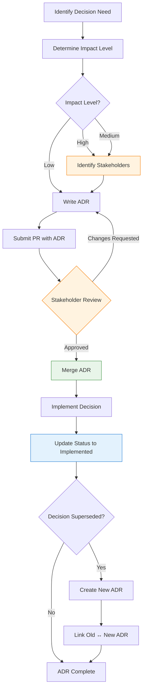

You've written your first ADRs. The template works. Your team is on board. Now what?

This article covers what happens when you scale ADRs beyond a single team—stakeholder management, organizational workflows, and proving the value to leadership.

**This is Part 2 of a 2-part series.** [Part 1](/2026/01/Architecture-Decision-Log-Guide-Part1) covers the essentials—what ADLs are, the five questions every ADR must answer, and real examples. Start there if you're new to ADRs.

---

## 1 Stakeholders and Roles & Responsibilities

ADRs aren't written in a vacuum—they affect teams, systems, and sometimes the entire organization. Identifying stakeholders and clarifying roles upfront prevents surprises later.

### Who Should Be Involved?

| Decision Scope | Required Stakeholders | Optional/Consulted |
|----------------|----------------------|-------------------|
| **Service-level** (internal to one team) | Service owner, tech lead | Adjacent service owners |
| **Cross-service** (affects multiple teams) | All affected team leads, platform team | Security, SRE |
| **Platform/Infrastructure** (new tech, databases) | Platform team, SRE, security | All engineering leads |
| **Business-critical** (payments, compliance) | CTO, compliance officer, legal | Product, risk management |

### Roles & Responsibilities (RACI Model)

| Role | Responsibility | Typical Holder |
|------|----------------|----------------|
| **Responsible** (writes the ADR) | Drafts the document, gathers data, proposes solution | Engineer proposing the change |
| **Accountable** (approves the ADR) | Final decision authority, owns the outcome | Tech lead, architect, or CTO |
| **Consulted** (provides input) | Reviews, provides feedback, identifies risks | Affected teams, security, SRE |
| **Informed** (notified of decision) | Needs to know for their work, but no approval needed | Other engineers, product managers |

### Example RACI for Database Selection ADR

| Stakeholder | Role | Why |
|-------------|------|-----|
| Jane (proposing engineer) | **R**esponsible | Writing the ADR, implementing the change |
| John (tech lead) | **A**ccountable | Final approval, owns architectural direction |
| Sarah (SRE lead) | **C**onsulted | Will operate the new database in production |
| Mike (security) | **C**onsulted | Must validate encryption, access controls |
| Lisa (adjacent service owner) | **C**onsulted | Her service reads from this database |
| Engineering team | **I**nformed | Need to know for on-call, debugging |

### How to Document Stakeholders in Your ADR

Add a stakeholders section after Context:

```markdown
## Stakeholders

| Name | Role | RACI | Team |
|------|------|------|------|
| Jane Doe | Author | Responsible | Platform |
| John Smith | Tech Lead | Accountable | Engineering |
| Sarah Lee | SRE Lead | Consulted | Operations |
| Mike Brown | Security | Consulted | Security |

## Approval History

| Role | Name | Date | Status |
|------|------|------|--------|
| Tech Lead | John Smith | 2025-11-03 | ✅ Approved |
| Security | Mike Brown | 2025-11-05 | ✅ Approved |
| SRE | Sarah Lee | 2025-11-06 | ✅ Approved |
```

### When to Escalate

Not all decisions can be made at the team level. Escalate when:

| Trigger | Escalate To |
|---------|-------------|
| Budget impact > $50K/year | CTO / VP Engineering |
| Affects 3+ teams | Architecture review board |
| Regulatory/compliance implications | Legal + compliance officer |
| New technology adoption (first time in company) | Principal engineer + CTO |
| Reverses a prior high-impact ADR | Original decision author + architect |

### The Human Side of ADRs

Remember: ADRs document **human decisions**, not just technical ones. A well-crafted ADR:

- **Acknowledges dissent:** "Team member X raised concern Y; we mitigated by Z"
- **Credits contributors:** "Thanks to Sarah for identifying the replication lag issue"
- **Preserves context:** "CTO approved this approach on 2025-11-03 after reviewing load test results"

This isn't bureaucracy—it's **organizational memory**. People leave. Teams reorganize. The ADR remains.

---

## 2 Complete Workflow: From Decision to Implementation

Here's the full end-to-end process for managing ADRs in a team environment:



### Step 1: Identify Decision Need

Something triggered this decision. Be explicit about what:

| Trigger | Example |
|---------|---------|
| New feature requiring architectural change | "Flash sale feature needs inventory redesign" |
| Incident/postmortem finding | "Black Friday outage revealed lock contention" |
| Technical debt accumulation | "Database queries slowing down over time" |
| Team feedback | "On-call engineers report frequent alerts from X" |

**Output:** A one-sentence problem statement.

---

### Step 2: Determine Impact Level

Use this to decide who needs to be involved:

| Question | If Yes → Impact Level |
|----------|----------------------|
| Would reversing this take > 1 engineer-month? | **High** |
| Does this affect 3+ teams or services? | **High** |
| Is this a regulatory/compliance requirement? | **High** |
| Budget impact > $50K/year? | **High** |
| New technology (first time in company)? | **High** |
| Affects 2 teams? | **Medium** |
| Can we undo this with a config change? | **Low** |
| Purely internal (no user-facing impact)? | **Low** |

**Output:** Impact level (High / Medium / Low).

---

### Step 3: Identify Stakeholders

Based on impact level, identify who needs to be involved:

| Impact Level | Required Stakeholders |
|--------------|----------------------|
| **High** | Tech lead (Accountable), Security, SRE, all affected team leads, CTO (if budget/compliance) |
| **Medium** | Tech lead (Accountable), affected team leads, SRE (if operational impact) |
| **Low** | Tech lead (Accountable), author (Responsible) |

Document stakeholders in the ADR (see Section 1 for template).

**Output:** Stakeholder list with RACI assignments.

---

### Step 4: Write ADR

Fill in all sections. Use the template, but focus on quality over completeness theater:

| Section | What Good Looks Like | Red Flags |
|---------|---------------------|-----------|
| **Context** | Specific problem, data-driven ("3s latency during peaks") | Vague ("system was slow") |
| **Candidates** | 2-3 genuinely considered options with honest trade-offs | Strawmen, only one option |
| **Decision** | Clear, specific, implementable | Buried in prose, ambiguous |
| **Consequences** | At least 2-3 negatives listed | Only benefits, no trade-offs |
| **Related** | Links to influencing/affected ADRs | Empty or "see other ADRs" |
| **Stakeholders** | Named individuals with RACI | "The team decided" |

**Output:** Draft ADR ready for review.

---

### Step 5: Submit PR with ADR

Create a pull request that includes:

- The new ADR file
- Any related code changes (if implementing alongside the decision)
- PR description linking to any RFCs, design docs, or prior discussions

**PR Template:**
```markdown
## ADR Summary
- **Decision:** [One sentence]
- **Impact Level:** [High/Medium/Low]
- **Stakeholders Consulted:** [List names]

## Reviewers Required
- [ ] Tech Lead (Accountable)
- [ ] Security (if applicable)
- [ ] SRE (if operational impact)
- [ ] Affected Team Leads

## Related Links
- [Link to RFC, design doc, or discussion]
```

**Output:** PR open, stakeholders notified.

---

### Step 6: Stakeholder Review

Reviewers should validate:

| Role | What to Check |
|------|---------------|
| **Tech Lead (Accountable)** | Decision aligns with architecture vision, trade-offs acceptable |
| **Security** | No security vulnerabilities, compliance requirements met |
| **SRE** | Operational burden understood, monitoring/alerting planned |
| **Affected Teams** | Their concerns addressed, no unexpected impact |

**Review Checklist:**

Before approving, verify:

| # | Question | Pass? |
|---|----------|-------|
| 1 | Context explains *why* this decision is needed | ☐ |
| 2 | At least 2-3 genuinely considered alternatives | ☐ |
| 3 | Decision is clear, specific, unambiguous | ☐ |
| 4 | At least 2-3 negative consequences listed | ☐ |
| 5 | Links to influencing and affected ADRs | ☐ |
| 6 | Stakeholders identified with RACI | ☐ |
| 7 | Appropriate stakeholders consulted | ☐ |

**If any box is unchecked:** Request changes. Don't approve yet.

**Output:** Approved ADR (or returned for revisions).

---

### Step 7: Merge ADR

Once all required stakeholders approve:

1. Merge the PR (squash merge preferred for cleaner history)
2. The ADR number is now part of project history
3. Share in team channel (Slack, Teams, etc.) for visibility

**Output:** ADR merged, status = "Accepted".

---

### Step 8: Implement Decision

Build the thing. During implementation:

- Reference the ADR number in commit messages (`git commit -m "feat: implement inventory reservation (ADR-0042)"`)
- If the implementation deviates from the ADR, update the ADR first
- If new trade-offs emerge, document them as comments or in a follow-up ADR

**Output:** Implementation complete, deployed to production.

---

### Step 9: Update Status to Implemented

After deployment and verification:

1. Update the ADR status: `Accepted` → `Implemented`
2. Add implementation date and any lessons learned
3. Link to runbooks, dashboards, or operational docs if relevant

```markdown
## Status
Implemented (2026-02-15)

## Implementation Notes
- Deployed to production on 2026-02-15
- Initial load test: 12K concurrent users handled successfully
- Added monitoring: queue depth alerting at 1000 items
- Runbook: /docs/runbooks/inventory-reservation.md
```

**Output:** ADR reflects actual state.

---

### Step 10: Maintain (Supersede or Deprecate)

Decisions don't last forever. When circumstances change:

**If reversing the decision:**
1. Create a new ADR (e.g., ADR-0050)
2. Reference the original (ADR-0042) in the Context section
3. Update original ADR status: `Implemented` → `Superseded by ADR-0050`
4. Link both directions (old ↔ new)

**If phasing out gradually:**
1. Update original ADR status: `Implemented` → `Deprecated`
2. Add deprecation timeline and migration plan
3. Create follow-up ADR for the replacement approach

**Output:** ADR lifecycle complete, architectural history preserved.

---

## 3 Deep Dive: Should Listing Candidates Be Mandatory?

This is the most debated question about ADRs. Let's break it down.

### The Case for Mandatory Candidates

**Argument 1: It Proves You Actually Considered Alternatives**

Without a candidates section, you can't distinguish between:
- A well-researched decision that evaluated options
- A cargo-cult decision ("we used Redis at my last company")
- A political decision ("the CTO likes MongoDB")

The candidates table **forces intellectual honesty**. If you can't name at least one alternative, you haven't thought hard enough.

**Argument 2: Future Context for Reversal**

When someone later asks "why not PostgreSQL?", the answer is already documented:

```markdown
## Candidates Considered

| Option | Why Rejected |
|--------|--------------|
| PostgreSQL | Write latency > 200ms at 10K concurrent users (load test failed) |
| DynamoDB | Cost projection: $12K/month vs. $3K for Redis at our access pattern |
```

This prevents **circular debates**—the same arguments resurfacing years later when institutional memory fades.

**Argument 3: Reveals Decision Quality**

A candidates table exposes weak decisions:

| Quality Signal | What It Looks Like |
|----------------|-------------------|
| **Strong decision** | 3-4 candidates, clear trade-offs, data-driven selection |
| **Weak decision** | 1 candidate (the chosen one), no alternatives listed |
| **Theater** | 5+ candidates, but all clearly inferior (strawman arguments) |

If your ADR has only one option, ask: *Are we hiding something?*

### The Case Against Mandatory Candidates

**Argument 1: Sometimes There's Only One Viable Option**

Regulatory requirements, existing infrastructure, or hard constraints can eliminate alternatives:

```
Context: Must store cardholder data
Constraint: PCI-DSS compliance required
Candidates: Only encrypted databases qualify
Decision: Use AWS RDS with encryption at rest (only option that meets PCI + existing infra)
```

In this case, listing "PostgreSQL without encryption" as a candidate is **theater**—it was never viable.

**Argument 2: Small Decisions Don't Need It**

Not every ADR is a database selection. Some decisions are narrow:

```
ADR-0067: Enable HTTP/2 for API Gateway
Context: Performance improvement, no breaking changes
Decision: Enable HTTP/2 in Envoy config
```

Requiring a candidates table here ("considered HTTP/1.1, gRPC, HTTP/3") adds **bureaucracy without value**.

**Argument 3: Analysis Paralysis**

Teams can get stuck documenting every possible alternative instead of shipping:

```
Engineer: "Should we use Redis or Memcached?"
Team: "Let me research 12 options and write a 3-page comparison..."
*Two weeks later, still debating*
```

At some point, **good enough and shipped** beats **perfect and documented**.

### Our Recommendation: Tiered Approach

| Decision Impact | Candidates Required? | Rationale |
|-----------------|---------------------|-----------|
| **High** (database, consistency model, service boundaries) | ✅ Mandatory (≥2 options) | Reversal cost is high; team needs to understand trade-offs |
| **Medium** (library selection, integration pattern) | ⚠️ Recommended (≥1 alternative) | Worth documenting, but don't block PRs |
| **Low** (config changes, minor refactors) | ❌ Optional | ADR itself might be overkill; use PR description instead |

**Decision Impact Assessment:**

Ask these questions to determine tier:

| Question | If Yes → |
|----------|----------|
| Would reversing this take > 1 engineer-month? | High impact |
| Does this affect multiple services/teams? | High impact |
| Is this a regulatory/compliance requirement? | High impact |
| Will this still matter in 2 years? | High impact |
| Can we undo this with a config change? | Low impact |
| Is this purely internal (no user-facing impact)? | Low impact |

### What If You Genuinely Only Have One Candidate?

Sometimes constraints eliminate alternatives. In this case, **document the constraints**:

```markdown
## Candidates Considered

| Option | Status |
|--------|--------|
| **AWS KMS** | ✅ Selected (only service meeting all requirements) |
| HashiCorp Vault | ❌ Rejected (requires self-hosting, violates "no new infra" constraint) |
| Azure Key Vault | ❌ Rejected (multi-cloud not supported, violates "AWS-only" constraint) |

**Constraints That Eliminated Alternatives:**
- Must be fully managed (no self-hosted solutions)
- Must be AWS-native (multi-cloud not in scope)
- Must support HSM-backed keys (regulatory requirement)

Given these constraints, AWS KMS is the only viable option.
```

This isn't theater—it's **explicit constraint documentation**. Future readers understand why the "decision" wasn't really a decision.

---

## 4 Common Pitfalls (And How to Avoid Them)

**Pitfall 1: Writing ADRs After the Fact**

❌ *Six months later, trying to remember why you chose MongoDB*

✅ **Fix:** Make ADR creation part of the PR checklist for architectural changes. No ADR = no merge.

**Pitfall 2: Strawman Candidates**

❌ *Listing obviously inferior alternatives to make the chosen option look better*

```
| Option | Fit |
|--------|-----|
| MongoDB | ✅ Strong |
| Microsoft Access | ❌ Poor (lol, no) |
| Excel spreadsheet | ❌ Poor (obviously) |
```

✅ **Fix:** Only list **genuinely considered** alternatives. If you didn't seriously consider it, don't list it.

**Pitfall 3: Too Much Detail**

❌ *40 pages of meeting transcripts, UML diagrams, and email threads*

✅ **Fix:** Stick to the template. Context should be 3-5 bullets. Decision should be one clear paragraph.

**Pitfall 4: No Ownership**

❌ *"The team decided..." (who? when?)*

✅ **Fix:** Include author and date in frontmatter or header.

**Pitfall 5: Never Updating**

❌ *Decision says "PostgreSQL" but system migrated to DynamoDB two years ago*

✅ **Fix:** When changing architecture, create a superseding ADR. Link both directions.

**Pitfall 6: Hiding Trade-Offs**

❌ *Listing only benefits, pretending no downsides exist*

✅ **Fix:** Force yourself to list at least 3 negative consequences. If you can't, you haven't thought hard enough.

---

## 5 Measuring ADL Effectiveness

How do you know if your ADL is working?

| Metric | Target | How to Measure |
|--------|--------|----------------|
| **Onboarding time** | Reduce by 30% | Survey new hires: "How quickly did you understand key decisions?" |
| **Decision reversals** | < 10% per year | Track superseded ADRs; high rate = rushed decisions |
| **Incident MTTR** | Reduce by 25% | During postmortems, measure time to understand design intent |
| **ADL freshness** | > 90% up-to-date | Quarterly review: % of ADRs matching current state |
| **Candidate coverage** | 100% have ≥2 options | Audit: every ADR lists alternatives considered |

**Quarterly ADL Review Checklist:**

- [ ] All Accepted decisions have corresponding Implemented status (if deployed)
- [ ] Superseded decisions link to replacements
- [ ] No orphaned decisions (referenced by nothing, referencing nothing)
- [ ] **Candidates Considered** tables are complete (≥2 options)
- [ ] Remove or archive deprecated decisions no longer relevant

---

## 6 The Payoff: Real Scenarios Before and After ADL

Let's walk through four realistic scenarios. These aren't hypothetical—they're patterns we've seen repeatedly in teams that adopt (or skip) architecture documentation.

---

### Scenario 1: New Engineer Onboarding

**Before ADL (Week 2):**

```
Day 3: Marcus (new hire) joins the Platform team.
Day 4: Assigned to fix a bug in the inventory reservation system.
Day 5: Marcus reads the code. It's complex—Redis Lua scripts, TTL handling,
       retry logic. He doesn't understand *why* it's built this way.

Marcus: "Hey, why do we use eventual consistency for inventory? Why not
        just use database transactions?"

Senior Engineer (Priya): *looks up from her screen* "Hmm, good question.
                         I think it was for performance? Flash sales or
                         something?"

Marcus: "Should I refactor it to use transactions? Would simplify the code."

Priya: "Uh... maybe? Let me think about it. Actually, wait—didn't Sarah
       work on this before she left? Let me check git blame..."

*Priya digs through commit history from 18 months ago*
*Finds a commit message: "Switch to eventual consistency for flash sales"*
*No context on why, what alternatives were considered, or what problems
  this solved*

Priya: "Okay, so it looks like strong consistency caused issues during
        high-traffic events. But I don't know the details. Maybe don't
        refactor yet? Ask around?"

Marcus: *nods, confused* "Okay... I'll just fix the bug and not touch
         the architecture."

*Outcome:*
- Marcus spent 3 days trying to understand the design
- Priya lost 2 hours digging through history
- The real reason (lock contention during Black Friday 2024) was never
  recovered
- Marcus is hesitant to work on this code again
- The knowledge is still tribal—Priya now "owns" this context until she
  leaves too
```

**After ADL (Week 2):**

```
Day 3: Marcus (new hire) joins the Platform team.
Day 4: Assigned to fix a bug in the inventory reservation system.
Day 5: Marcus reads the code. It's complex—Redis Lua scripts, TTL handling,
       retry logic. He doesn't understand *why* it's built this way.

Marcus: "Hey, why do we use eventual consistency for inventory?"

Senior Engineer (Priya): "Check ADR-0042. Sarah wrote it before she moved
                         to the Infrastructure team. It's got the full
                         breakdown—alternatives considered, load test
                         results, the whole thing."

*Marcus opens docs/architecture/decisions/0042-eventual-consistency-for-inventory.md*

*10 minutes later:*

Marcus: "Okay, so:
         - Strong consistency caused 2-3s latency during flash sales
         - They tested 3 options: strong consistency, eventual + reservation,
           and eventual + oversell buffer
         - Chose eventual + reservation because it scales without overselling
         - Trade-offs: complex timeout handling, edge case where users lose
           carts if payment takes > 10 minutes
         - They added monitoring for queue depth and a cart recovery email
           flow to mitigate

         Makes sense now. The complexity is intentional."

Priya: "Yep. And if you look at ADR-0051, they also documented the payment
       timeout handling separately. Good read if you're touching that code."

Marcus: "Got it. The bug I'm fixing—is it related to the TTL expiration
        logic mentioned in the Consequences section?"

Priya: *glances at the ADR* "Yeah, probably. Check the mitigation they
       listed—they mention a cron job that runs every minute. There's a
       known race condition there we've been meaning to fix."

*Outcome:*
- Marcus understood the design in 10 minutes
- Priya didn't lose context-switching time
- Marcus connected the ADR to his actual bug (TTL race condition)
- Marcus now knows which other ADRs to read (0051, 0038, 0045)
- Sarah's knowledge persists even though she's on a different team
```

**Measurable Difference:**

| Metric | Before ADL | After ADL |
|--------|------------|-----------|
| Time to understand system | 3 days | 10 minutes |
| Senior engineer interruption | 2 hours | 30 seconds |
| Knowledge recovery | Incomplete (lost) | Complete (documented) |
| Confidence to modify code | Low | High |

---

### Scenario 2: Production Incident Postmortem

**Before ADL (Incident Response):**

```
2:47 AM: PagerDuty alert—inventory service latency spike. 95th percentile
         at 4.2 seconds. Checkout conversion dropping.

On-call Engineer (David): *wakes up, opens laptop* "Okay, what's happening?"

*Checks dashboards:*
- Redis CPU: 89%
- Reservation queue depth: 12,000 items (normal: ~200)
- Timeout job running behind

David: "Why is the queue so backed up? Did something change?"

*Checks Slack:*
- No recent deploys
- No known issues

David: *starts digging through code* "What does this timeout job even do?
       Why does it run every minute? Who wrote this?"

*Git blame shows: author "Sarah Chen", 18 months ago*
*Slack: Sarah is at a different company now*

David: *messages the team channel* "Does anyone know why the inventory
       timeout job exists? What happens if I disable it?"

*30 minutes pass. No response—nobody on the call knows.*

David: "Okay, I'll just restart the Redis cluster to clear the queue.
       Not ideal, but we need to unblock checkout."

*Restarts Redis. Queue clears. Latency drops.*

6:00 AM: Service stabilized. David goes to sleep.

10:00 AM: Postmortem meeting.

Manager: "What caused the incident?"

David: "Queue backed up. Timeout job couldn't keep up. I don't know why
        the job exists or what the correct behavior should be."

Manager: "Can we prevent this?"

David: "Not without understanding the design. We need to find someone who
        worked on this. Or rewrite it."

*Outcome:*
- MTTR: 3+ hours (mostly understanding the system)
- Root cause: Unknown (design intent was lost)
- Prevention: "Rewrite the system" (expensive, risky)
- Team confidence: Shaken
```

**After ADL (Incident Response):**

```
2:47 AM: PagerDuty alert—inventory service latency spike. 95th percentile
         at 4.2 seconds. Checkout conversion dropping.

On-call Engineer (David): *wakes up, opens laptop* "Okay, what's happening?"

*Checks dashboards:*
- Redis CPU: 89%
- Reservation queue depth: 12,000 items (normal: ~200)
- Timeout job running behind

David: "Queue's backed up. Let me check ADR-0042—this is the reservation
       system Sarah designed."

*Opens ADR-0042, scrolls to Consequences > Negative:*
"- Operational burden: Monitor reservation queue depth"
"- Mitigation: Add alerting on queue depth > 1000"

David: "Okay, so queue depth is a known metric. And there's a timeout job
       that runs every minute..."

*Scrolls to Decision section:*
"Timeout releases reservation back to available pool"

David: "The timeout job releases stale reservations. If it's behind, valid
       items are locked in stale reservations. That's why checkout is
       failing—items show 'out of stock' but they're actually just
       reserved and timed out."

*Checks runbook linked in ADR:*
"/docs/runbooks/inventory-reservation.md"

*Runbook says:*
"Known issue: Timeout job can fall behind during traffic spikes.
 Safe to manually trigger: `redis-cli evalsha <SHA> 0 force-timeout`
 This will process the queue immediately."

David: *runs the command* "Queue's draining. Latency dropping."

3:15 AM: Service stabilized.

10:00 AM: Postmortem meeting.

Manager: "What caused the incident?"

David: "Timeout job fell behind during a traffic spike. ADR-0042 documents
        this as a known trade-off. The mitigation is manual queue flush,
        which worked. But we should automate it."

Manager: "Can we prevent this?"

David: "Yeah. The ADR says 'monitor queue depth'—we have the alert, but
        we should auto-trigger the timeout job when depth > 5000. I'll
        create a ticket."

*Outcome:*
- MTTR: 28 minutes (design intent was documented)
- Root cause: Known trade-off, documented 18 months ago
- Prevention: Clear action item (auto-trigger timeout job)
- Team confidence: High (system is understandable)
```

**Measurable Difference:**

| Metric | Before ADL | After ADL |
|--------|------------|-----------|
| MTTR | 3+ hours | 28 minutes |
| Root cause identified | No | Yes (known trade-off) |
| Prevention action | "Rewrite system" | "Add auto-trigger" |
| On-call stress level | High | Manageable |

---

### Scenario 3: Reversing a Decision (6 Months Later)

**Before ADL (Decision Reversal):**

```
6 months later. Traffic has grown 10x. The inventory system is struggling.

Engineer (Lisa): "I think we need to switch from Redis to a dedicated
                 inventory service with sharding. Redis is hitting memory
                 limits."

Tech Lead (Marcus): "Wait, why did we choose Redis in the first place?"

Lisa: *digs through Slack, old PRs, commit messages* "I can't find
      anything. Sarah's not here anymore. Priya, do you remember?"

Priya: "I think it was for speed? But honestly, I don't know if we
       considered other options."

Marcus: "Okay, so we have three options:
         1. Stick with Redis and shard it (complex, but familiar)
         2. Switch to PostgreSQL (slower, but handles larger datasets)
         3. Build a custom service with DynamoDB (flexible, but new tech)

         Does anyone know why we didn't do #2 or #3 originally?"

*Silence. Nobody knows.*

Lisa: "Should we just test all three?"

Marcus: "That's like 3 weeks of work just to relearn what Sarah already
         figured out."

*Outcome:*
- Team spends 3 weeks re-evaluating options
- They eventually choose PostgreSQL (which Sarah had rejected 18 months
  ago due to write latency)
- Two months later, they discover the latency issue Sarah documented
- They switch back to Redis with sharding
- Total time wasted: 5 weeks
```

**After ADL (Decision Reversal):**

```
6 months later. Traffic has grown 10x. The inventory system is struggling.

Engineer (Lisa): "I think we need to revisit ADR-0042. Redis is hitting
                 memory limits at our scale."

Tech Lead (Marcus): "Good call. Let me check what Sarah documented."

*Opens ADR-0042, scrolls to Candidates Considered:*

| Option | Why Rejected |
|--------|--------------|
| PostgreSQL | Write latency > 200ms at 10K concurrent users (load test failed) |
| DynamoDB | Cost projection: $12K/month vs. $3K for Redis at our access pattern |

Marcus: "Okay, so PostgreSQL failed load tests at 10K concurrent users.
        What's our peak now?"

Lisa: "About 15K concurrent users during flash sales."

Marcus: "And we're hitting Redis memory limits at..."

Lisa: "Around 50 million reservation records. We're at 42 million now."

Marcus: "So the original decision was right for our scale then. But we've
        outgrown it. Let me check the Migration Path section..."

*Scrolls to Migration Path:*
"If we outgrow single Redis instance:
 1. Add read replicas for reporting queries (immediate)
 2. Partition by date (orders older than 90 days to archive tables)
 3. Shard by customer_id if write volume exceeds 50K/day (12-18 months out)
 4. Estimated effort for sharding: 2-3 engineer-months"

Marcus: "Sarah anticipated this. She said shard by customer_id at 50K/day.
        We're at 45K/day now. We're in the window."

Lisa: "So we shard Redis instead of switching databases?"

Marcus: "Yeah. And if sharding doesn't work, we have the PostgreSQL load
        test results—we know it'll fail at our concurrency. No need to
        re-test."

Lisa: "What about DynamoDB? Cost was the blocker. Let me check if that's
        still true..."

*Checks AWS pricing, current usage*

Lisa: "At our scale, DynamoDB would be $18K/month now. Redis sharded is
       still around $5K. Economics haven't changed."

Marcus: "Create a ticket for Redis sharding. Reference ADR-0042 and link
       to a new ADR for the sharding implementation."

*Outcome:*
- Team evaluated options in 2 hours (not 3 weeks)
- They chose the right path (Redis sharding) based on documented data
- They avoided re-discovering known problems (PostgreSQL latency)
- New ADR (0089) links back to original, preserving the decision chain
```

**Measurable Difference:**

| Metric | Before ADL | After ADL |
|--------|------------|-----------|
| Time to evaluate options | 3 weeks | 2 hours |
| Decision quality | Poor (chose rejected option) | High (built on prior analysis) |
| Wasted engineering time | 5 weeks | 0 |
| Decision confidence | Low | High |

---

### Scenario 4: Compliance Audit

**Before ADL (Audit Preparation):**

```
Compliance Officer (Rachel): "We have a SOC 2 audit next month. I need
                             documentation on how you handle data integrity
                             for financial transactions."

CTO (James): "Uh... we have tests? And we use databases with ACID?"

Rachel: "The auditor wants to see design decisions. Why did you choose
        eventual consistency for inventory? How do you prevent overselling?"

James: *panics* "Let me gather the team."

*Team spends 2 weeks:*
- Digging through old PRs
- Reconstructing design discussions from Slack
- Creating diagrams that explain the current system
- Writing a 40-page document that explains the architecture

Rachel: "This is good, but can you prove this was the intentional design
        and not just... what happened?"

James: "Well, Sarah designed it. But she left. We think this was the
       intent?"

Rachel: "The auditor will want signed approval from when this was decided."

James: *sweating* "We... don't have that?"

Rachel: "Okay, I'll tell the auditor the controls exist but documentation
        is incomplete. Expect a finding."

*Outcome:*
- 2 weeks of engineering time spent reconstructing history
- Audit finding: "Insufficient documentation of architectural controls"
- Team has to create retroactive documentation (low quality, rushed)
- Trust with auditors damaged
```

**After ADL (Audit Preparation):**

```
Compliance Officer (Rachel): "We have a SOC 2 audit next month. I need
                             documentation on how you handle data integrity
                             for financial transactions."

CTO (James): "Check docs/architecture/decisions/. ADR-0042 covers the
             inventory design, ADR-0037 covers payment integration, and
             ADR-0051 covers timeout handling. All have approval signatures
             and stakeholder sign-off."

Rachel: *opens ADR-0042* "Okay, this is perfect. It shows:
         - The problem (lock contention during flash sales)
         - Options considered (3 alternatives)
         - Decision (eventual consistency with reservation)
         - Controls (monitoring, alerting, runbooks)
         - Stakeholders (Security, SRE, Tech Lead—all approved)
         - Dates (decision: 2025-11-03, implemented: 2026-02-15)

         Who signed off on this?"

James: "Sarah (author), Priya (tech lead), Mike (security), and David
       (SRE). All in the Approval History section."

Rachel: "And the trade-offs?"

James: "Documented—complexity, edge cases, operational burden. Plus
       mitigations for each."

Rachel: "This is exactly what the auditor wants. Clear decision trail,
        stakeholder accountability, documented controls."

*Outcome:*
- 0 weeks of engineering time (documentation already exists)
- Audit finding: None (controls well-documented)
- Trust with auditors strengthened
- Team can focus on actual work, not retroactive documentation
```

**Measurable Difference:**

| Metric | Before ADL | After ADL |
|--------|------------|-----------|
| Engineering time for audit | 2 weeks | 0 |
| Audit findings | 1 (documentation gap) | 0 |
| Auditor confidence | Low | High |
| Team stress | High | Low |

---

## The Real Value

ADLs aren't about bureaucracy. They're about **respecting your future self** and your teammates.

Complex systems have too many interdependencies to rely on tribal knowledge. When decisions are documented:

| Benefit | What It Looks Like |
|---------|-------------------|
| **Onboarding accelerates** | New hires read ADRs, not dig through git blame |
| **Incidents resolve faster** | Understand design intent during postmortems |
| **Reversibility improves** | Know what breaks if you change course |
| **Knowledge persists** | Team members leave, decisions remain |
| **Audits go smoothly** | Compliance mappings already done |
| **Debate closure** | Decisions stick; no circular re-litigation |
| **Trust builds** | Stakeholders see their concerns documented |

**The Alternative:**

Every time someone leaves, knowledge walks out. Every incident becomes a mystery. Every decision gets re-debated. Every audit becomes a scramble.

That's the cost of *not* writing ADRs.

**Start small. Document the big decisions. Keep the template lean. Your future team will thank you.**

---

## Series Navigation

- **[Part 1: A Practical Guide](/2026/01/Architecture-Decision-Log-Guide)** — Learn the essentials: what ADLs are, the five questions every ADR must answer, real e-commerce examples, and a copy-paste template.

---

**Further Reading:**

- Michael Nygard's original [ADR format](https://cognitect.com/blog/2011/11/15/documenting-architecture-decisions)
- "Software Architecture for Developers" — Chapter on decision records
