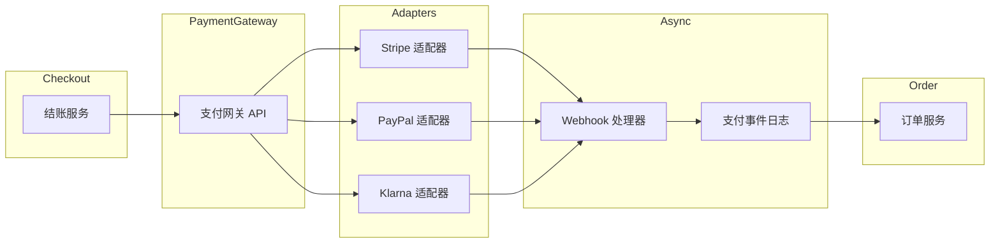
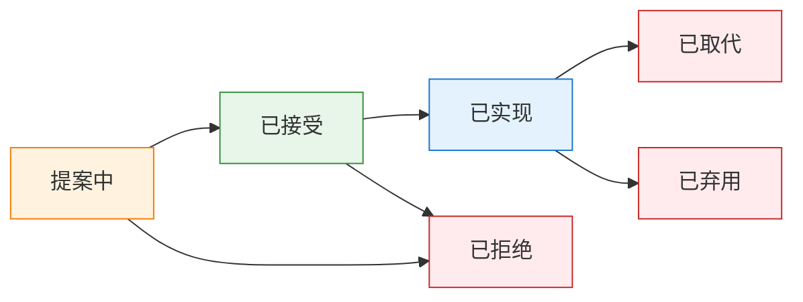

在重建电商平台的第三个月，我们遇到了一个问题：**没人记得为什么选择最终一致性来管理库存**。代码能运作，测试也通过了，但*为什么*这样做却没人知道。就在这时，我们实作了架构决策记录（ADL）。来看看如何正确实作。

**这是两部分系列文章的第一部分。** 本文涵盖基础知识——什么是 ADL、如何撰写，以及真实范例。[第二部分](/zh-CN/2026/01/Architecture-Decision-Log-Advanced-Topics) 涵盖跨团队扩展 ADR、利益相关人管理和效果评估。

---

## 1 什么是架构决策记录？

**架构决策记录**（Architecture Decision Log）是一系列带有时间戳、版本化的记录，用于捕捉系统设计过程中做出的**重要技术选择**，以及当时考虑的**背景、后果和权衡**。

把它想象成系统架构的**决策审计轨迹**。不是每个 commit 都需要记录，但当你在数据库引擎、一致性模型或服务边界之间做选择时？把它记下来。

**为什么复杂系统需要 ADL：**

| 特性 | 为什么文档化很重要 |
|------|-------------------|
| **生命周期长** | 系统演进数年；原始背景逐渐模糊 |
| **团队流动** | 架构师离开；知识随之流失 |
| **复杂权衡** | 一致性 vs. 延迟，耦合 vs. 内聚 |
| **事后复盘** | 理解设计意图可加速根本原因分析 |
| **新人 onboarding** | 新工程师先理解*为什么*，再理解*做什么* |

**ADL 不是什么：**

- ❌ 设计规格说明书（那是独立的文件）
- ❌ 会议纪要堆砌（保持结构化）
- ❌ 变更日志（追踪*什么*改变了；ADL 追踪*为什么*）
- ❌ 永久法律（决策可以被取代——也要记录下来）

---

## 2 良好决策记录的结构

每个扎实的记录都回答**五个问题**：

| # | 问题 | 章节 | 目的 |
|---|------|------|------|
| 1 | **我们要解决什么问题？** | 背景 | 框定决策、限制条件、利益相关人 |
| 2 | **我们考虑了哪些选项？** | 候选方案 | 展示解决方案空间和权衡 |
| 3 | **我们决定了什么？** | 决策 | 清晰具体地陈述选择 |
| 4 | **后果是什么？** | 后果 | 诚实记录好处和权衡 |
| 5 | **还有什么相关？** | 相关决策 | 链接到其他决策以提供背景 |

如果你的 ADR 没有回答所有五个问题，它就是不完整的。以下是每个问题为什么重要——以及跳过它会发生什么事。

---

### 问题 1：我们要解决什么问题？

**目的：** 在*做什么*之前先建立*为什么*。没有背景，未来的读者无法理解为什么当时的决策是合理的。

**包含内容：**
- 业务驱动因素（例如：“黑色星期五流量造成 3 秒延迟”）
- 技术限制（例如：“必须在现有 AWS 基础设施内运作”）
- 法规要求（例如：“GDPR 要求 30 天内删除数据”）
- 涉及的利益相关人（例如：“合规团队要求审计日志”）

**好范例：**
```markdown
## 背景
- **需求**：支持闪购期间 10K 并发用户
- **问题**：强一致性导致热门商品的锁竞争
- **限制**：必须防止超卖（不能卖没有的东西）
- **当前状态**：数据库行锁在高峰期间造成 2-3 秒延迟
```

**坏范例（太模糊）：**
```markdown
## 背景
我们需要更好的方式处理库存。旧系统很慢。
```

**跳过这个会发生什么事：**
未来的工程师看到决策却不理解它解决的问题。他们可能因为错误的原因推翻它：

```
工程师（2027）：“为什么库存使用最终一致性？”
*阅读 ADR，没有看到背景*
工程师：“看起来像是过度设计。我们用强一致性吧。”
*回滚到强一致性*
*闪购因为锁竞争导致系统崩溃*
```

**测试：** 不在现场的人能理解*为什么*这个决策是必要的吗？

---

### 问题 2：我们考虑了哪些选项？

**目的：** 证明你探索了解决方案空间。这能区分深思熟虑的决策和盲目跟风的工程。

**包含内容：**
- 至少 2-3 个真正考虑过的替代方案
- 每个方案的优缺点（诚实面对首选方案的缺点）
- 为什么每个被拒绝（具体、数据驱动的原因）

**好范例：**
```markdown
## 候选方案

| 选项 | 优点 | 缺点 | 适合度 |
|------|------|------|--------|
| **强一致性** | 简单，不会超卖 | 锁竞争，高峰期 2-3 秒延迟 | ❌ 差 |
| **最终一致性 + 预留** | 扩展性好，不会超卖 | 复杂的超时处理 | ✅ 强 |
| **最终一致性 + 超卖缓冲** | 最简单，最快 | 退款风险，客户投诉 | ⚠️ 有风险 |
```

**坏范例（稻草人）：**
```markdown
## 候选方案

| 选项 | 适合度 |
|------|--------|
| Redis | ✅ 已选择 |
| MySQL | ❌ 太慢 |
| MongoDB | ❌ 没有事务（错的—MongoDB 有事务） |
```

**跳过这个会发生什么事：**
你无法判断团队：
- 是否真的评估了选项
- 是否选择了第一个想到的东西
- 是否做了政治决策（“CTO 喜欢 Redis”）

后来，当有人问“为什么不用 DynamoDB？”时，没有答案。辩论从头开始。

**测试：** 如果有人挑战这个决策，你能指出文档化的原因说明为什么拒绝替代方案吗？

---

### 问题 3：我们决定了什么？

**目的：** 让实际选择明确无误。这看起来很明显，但许多 ADR 把决策埋在散文中。

**包含内容：**
- 清晰陈述选择了什么
- 具体的实现细节（不只是“我们用 Redis”，而是“6 节点的 Redis Cluster”）
- 明确提及*没有*选择什么（如果不在候选方案表中）

**好范例：**
```markdown
## 决策
我们将使用**带有库存预留的最终一致性**。

- 加入购物车时预留商品 10 分钟（基于 TTL）
- 付款确认将预留转换为扣减
- 超时将预留释放回可用池
- 使用 Redis 有序集合追踪预留（带过期的 ZSET）
```

**坏范例（埋藏的决策）：**
```markdown
## 决策
经过多次讨论并考虑各种因素，包括
团队专业知识、成本影响和长期可维护性，
我们决定采用一种利用
最终一致性模式的方法，类似于上面
候选方案章节中描述的内容。
```

**跳过这个会发生什么事：**
每个人都阅读 ADR，但带着不同的解释离开：

```
工程师 A：“所以我们用最终一致性，对吧？”
工程师 B：“我以为我们用带缓存的强一致性？”
工程师 C：“ADR 有说用哪个数据库吗？”
*三个不同的实现上线了*
```

**测试：** 两个工程师读了这个能实现出同样的东西吗？

---

### 问题 4：后果是什么？

**目的：** 诚实记录权衡。每个决策都有缺点——如果你说不出来，代表你思考得不够深入。

**包含内容：**
- 正面后果（你预期的好处）
- 负面后果（权衡、技术债、运维负担）
- 负面后果的缓解策略

**好范例：**
```markdown
## 后果

### 正面
- ✅ 扩展到 10K+ 并发用户（已负载测试）
- ✅ 不会超卖（预留保证库存）
- ✅ 延迟降到 < 100ms（没有行锁）

### 负面
- ⚠️ 复杂性：预留超时处理（cron + Lua 脚本）
- ⚠️ 边界情况：如果付款超过 10 分钟，用户失去购物车
- ⚠️ 运维负担：监控预留队列深度

### 缓解
- 在队列深度 > 1000 时发出警报
- 为超时情况实现购物车恢复邮件
```

**坏范例（只有好处）：**
```markdown
## 后果
这个决策将改善性能、可扩展性和可维护性。
团队对这个现代方法感到兴奋。
```

**跳过这个会发生什么事：**
- **惊喜变成事故：** “没人说我们需要监控预留队列！”
- **权衡被遗忘：** 未来的工程师认为选择的方案是完美的
- **事后复盘更困难：** 无法判断问题是已知风险还是新问题

**测试：** 是否列出了至少 2-3 个负面后果？如果没有，你在隐藏什么。

---

### 问题 5：还有什么相关？

**目的：** 将这个决策链接到更广泛的架构。决策不是孤立存在的。

**包含内容：**
- 影响这个决策的 ADR 链接
- 将被这个决策影响的 ADR 链接
- 外部资源链接（RFC、文档、博客文章）

**好范例：**
```markdown
## 相关决策
- ADR-0038：Redis 用于缓存层（基础设施选择）
- ADR-0045：购物车服务架构（上游服务）
- ADR-0051：付款超时处理（相关超时逻辑）

## 参考资料
- [Redis 有序集合文档](https://redis.io/commands/zset/)
- [Martin Fowler：最终一致性](https://martinfowler.com/articles/eventual.html)
```

**坏范例（没有链接）：**
```markdown
## 相关决策
查看其他 ADR 以了解更多背景。
```

**跳过这个会发生什么事：**
- **孤立的决策：** 无法追踪架构叙事
- **矛盾：** ADR-0042 说“用 Redis”但 ADR-0050 说“不要用新的 Redis”，没人注意到
- **新人 onboarding 受苦：** 新工程师无法跟随决策链

**测试：** 你能从这个 ADR 导航到所有相关决策而不需要搜索吗？

---

## 3 真实电商决策范例

让我们看看电商平台构建中的实际决策。

### 范例 1：订单服务的数据库选择

```markdown
# ADR-0023：订单服务数据库选择

## 状态
已接受（2025-09-15）

## 背景
需要为订单服务选择持久化存储（100K 订单/天，高峰 5K/小时）。

**需求：**
- ACID 事务（付款 + 库存 + 订单必须是原子的）
- 复杂查询（按状态、日期范围、客户、SKU 过滤）
- 读多写少：80% 读，20% 写（浏览 vs. 购买）
- 保留：7 年（税务/法律要求）
- 备份 RPO：< 5 分钟

## 候选方案

| 数据库 | 优点 | 缺点 | 适合度 |
|--------|------|------|--------|
| **PostgreSQL** | ACID、复杂查询、成熟、JSONB 支持 | 仅垂直扩展，写入瓶颈约 10K/秒 | ✅ 强 |
| **MongoDB** | 水平扩展、灵活 schema、易于分片 | 多文档事务复杂、默认最终一致性 | ⚠️ 有风险 |
| **DynamoDB** | 无限扩展、托管、低延迟 | 查询限制（单一分区键）、大规模时昂贵 | ❌ 不适合 |
| **CockroachDB** | ACID + 水平扩展、PostgreSQL 兼容 | 较新的技术、运维复杂性、较高延迟 | ⚠️ 过度设计 |

## 决策
我们将使用 **PostgreSQL**（RDS，多可用区部署）。

**理由：**
- 开箱即用的 ACID 合规（对订单状态转换至关重要）
- 复杂查询支持（用于报告的 JOIN、用于分析的窗口函数）
- 团队专业知识（已经将 PostgreSQL 用于其他服务）
- 在我们的规模下具成本效益（约 2K/月 vs. CockroachDB 的 8K+）

**拒绝的替代方案：**
- MongoDB：事务复杂性超过 schema 灵活性的好处
- DynamoDB：查询模式不符合单键访问模型
- CockroachDB：过早优化；PostgreSQL 轻松处理 100K/天

## 后果

### 正面
- ✅ ACID 保证（没有订单状态损坏）
- ✅ 丰富的查询能力（初期不需要独立的分析数据库）
- ✅ 团队生产力（熟悉的技术、现有工具）
- ✅ 成本效益（可预测的定价，没有意外的出口费用）

### 负面
- ⚠️ 垂直扩展上限（约 50K 写入/秒后需要分片）
- ⚠️ 读取副本增加复制延迟（报告可接受 1-2 秒）
- ⚠️ Schema 迁移需要协调（使用 Flyway 进行版本控制）
- ⚠️ 单区域部署（多区域增加复杂性，目前还不需要）

## 性能目标
| 指标 | 目标 | 测量方式 |
|------|------|----------|
| 订单创建延迟 | < 200ms (P99) | 应用程序指标 |
| 查询响应时间 | < 500ms (P95) | RDS Performance Insights |
| 备份 RPO | < 5 分钟 | RDS 自动备份 |
| 恢复 RTO | < 30 分钟 | 多可用区故障转移测试 |

## 迁移路径
如果我们超过单个 PostgreSQL 实例的容量：
1. 为报告查询新增读取副本（立即）
2. 按日期分区（90 天前的订单归档到存档表）
3. 如果写入量超过 50K/天，按 customer_id 分片（12-18 个月后）
4. 分片的预估工作：2-3 个工程师月

## 相关决策
- ADR-0012：服务边界（订单服务定义）
- ADR-0031：数据库迁移策略（Flyway）
- ADR-0045：库存的事件溯源（不同的一致性模型）
```

### 范例 2：支付网关集成模式

```markdown
# ADR-0037：支付网关集成策略

## 状态
已接受（2025-10-22）

## 背景
需要集成多个支付提供商（Stripe、PayPal、Klarna、本地银行）。

**需求：**
- 2026 年第二季前支持 4+ 个支付提供商
- 提供商故障转移（如果 Stripe 挂了，路由到 PayPal）
- 为结账服务提供统一 API（不要暴露提供商差异）
- PCI-DSS 合规（最小化范围）
- 支持退款、部分退款、扣款

## 候选方案

| 模式 | 优点 | 缺点 | 适合度 |
|------|------|------|--------|
| **直接集成** | 完全控制，没有抽象开销 | 紧耦合，难以切换提供商 | ❌ 差 |
| **适配器模式** | 统一接口，易于新增提供商 | 更多代码需要维护，抽象泄漏 | ✅ 强 |
| **支付协调层** | 内置故障转移、路由规则、分析 | 第三方依赖，成本（每笔交易 0.5-1%） | ⚠️ 可考虑 |
| **事件驱动（webhooks）** | 解耦、异步处理 | 复杂的状态管理、最终一致性 | ⚠️ 部分 |

## 决策
我们将使用**带有事件驱动 Webhooks 的适配器模式**。

**架构：**



**关键设计选择：**
- 网关暴露统一接口：`charge()`、`refund()`、`cancel()`
- 每个提供商有专门的适配器实现 `PaymentProvider` 接口
- Webhooks 异步处理（SQS → Lambda → 事件日志）
- 幂等键防止重复扣款（存储在 Redis，24 小时 TTL）

## 后果

### 正面
- ✅ 提供商切换对结账服务透明（变更配置，重新部署适配器）
- ✅ 故障转移支持（断路器检测故障，路由到备份）
- ✅ PCI 范围最小化（Stripe.js 处理卡片数据，我们获得令牌）
- ✅ 异步 webhook 处理（不阻塞，失败时重试）

### 负面
- ⚠️ 抽象泄漏（不是所有提供商都支持部分退款，Klarna 有不同的流程）
- ⚠️ 测试复杂性（必须模拟 4+ 个提供商、webhook 签名、错误情境）
- ⚠️ 运维负担（监控 webhook 送达率、提供商 SLA）
- ⚠️ 状态调解（如果 webhook 丢失了怎么办？需要每日调解作业）

## 合规
- PCI-DSS SAQ-A（最低范围）：我们处理令牌，不是卡片数据
- PSD2 SCA：适配器处理 3D Secure 2.0 流程
- GDPR：支付数据保留策略（7 年后删除）

## 测试策略
| 测试类型 | 覆盖范围 | 工具 |
|----------|----------|------|
| 单元测试 | 适配器逻辑 | Jest、模拟提供商 |
| 集成测试 | Webhook 签名 | 提供商沙盒 |
| E2E 测试 | 完整结账流程 | Cypress、测试卡 |
| 混沌测试 | 提供商停机 | AWS Fault Injection Simulator |

## 相关决策
- ADR-0012：服务边界（结账服务定义）
- ADR-0038：Redis 用于幂等键
- ADR-0041：支付状态的事件溯源
- ADR-0052：断路器模式（弹性）
```

---

## 4 在哪里存储决策记录

不同的团队有不同的工作流程。根据你组织的背景选择：

### 选项 1：代码仓库（推荐给工程团队）

如果你的团队生活在 Git 中并通过 PR 审查变更：

```
docs/
└── architecture/
    └── decisions/
        ├── 0001-record-architecture-decisions.md
        ├── 0002-choose-database-for-order-service.md
        ├── 0003-eventual-consistency-for-inventory.md
        └── 0004-payment-gateway-adapter-pattern.md
```

**为什么这对工程团队有效：**

| 好处 | 如何帮助 |
|------|----------|
| **Git 版本控制** | 追踪变更、blame 显示谁更新了什么、易于回滚 |
| **PR 工作流程** | ADR 经历与代码相同的审查流程 |
| **与代码共存** | ADR 与它们描述的实现放在一起 |
| **Markdown 渲染** | 在 GitHub/GitLab 中良好显示，不需要单独的查看器 |
| **可搜索** | 像 grep 代码一样 grep ADR |

**最适合：** 软件工程团队、开源项目、已经使用 Git 工作流程的团队。

---

### 选项 2：Wiki / Confluence

如果你的组织已经使用 wiki 进行文档管理：

**为什么这有效：**

| 好处 | 如何帮助 |
|------|----------|
| **易于浏览** | 非工程师可以在不需要 Git 知识的情况下导航 |
| **丰富的格式** | 嵌入图表、附件、评论 |
| **内置搜索** | 不需要学习 grep 或 Git 命令 |
| **访问控制** | 与现有组织权限集成 |

**权衡：**

| 担忧 | 缓解 |
|------|------|
| 版本历史笨拙 | 使用页面历史、导出快照 |
| 与代码库脱节 | 新增“最后验证”日期、链接到代码 |
| 没有 PR 工作流程 | 在发布前需要批准 |

**最适合：** 跨功能团队、大量使用 Confluence 的组织、非工程师需要访问的合规密集环境。

---

### 选项 3：专用 ADR 工具

像 `adr-tools`、`log4brains` 或 `nadr` 这样的工具提供 CLI 界面和静态网站生成：

```bash
# 安装 adr-tools
brew install adr-tools

# 创建新的 ADR（自动编号、应用模板）
adr new "Choose database for order service"

# 生成静态网站用于浏览
log4brains serve
```

**为什么这有效：**

| 好处 | 如何帮助 |
|------|----------|
| **CLI 便利** | 自动编号、模板化、链接命令 |
| **静态网站输出** | 在网页 UI 中浏览 ADR |
| **Git 兼容** | 将文件存储在仓库中，但新增工具层 |

**权衡：**

| 担忧 | 缓解 |
|------|------|
| 另一个工具需要学习 | 团队 onboarding、文档 |
| 工具可能被遗弃 | 文件是纯 markdown，可以迁移 |

**最适合：** 想要结构但不想要官僚主义的团队、喜欢 CLI 工具的团队。

---

### 选项 4：混合方法

一些团队按受众拆分 ADR：

| ADR 类型 | 在哪里存储 |
|----------|------------|
| **技术/工程** | 代码仓库（给工程师） |
| **业务/合规** | Wiki 或 Confluence（给审计师、管理层） |
| **跨功能** | 两者（定期同步） |

**最适合：** 有多样利益相关人的大型组织、受监管的行业。

---

### 我们的建议

**从你的团队已经工作的地方开始：**

| 如果你的团队... | 使用... |
|-----------------|---------|
| 生活在 GitHub/GitLab | 代码仓库 |
| 生活在 Confluence | Wiki |
| 想要代码 + 浏览 | 代码仓库 + 静态网站生成器 |
| 有非工程师利益相关人 | Wiki 或混合 |

最好的存储是你的团队**实际上会持续使用**的那一个。

---

### 命名惯例（无论存储在哪里）

```
NNNN-short-kebab-case-title.md
```

- `NNNN`：零填充的顺序号（0001、0002、...）
- `short-kebab-case-title`：描述性的、可搜索的（最多 5-7 个单词）

**基本工作流程：**

1. **创建**：`cp template.md docs/architecture/decisions/0024-new-feature.md`
2. **撰写**：填写所有章节（特别是**候选方案**）
3. **审查**：团队验证权衡是否被诚实记录
4. **存储**：提交到仓库或发布到 wiki
5. **更新**：在实现/取代时变更状态

---

## 5 何时撰写决策记录

**在以下情况撰写 ADR：**

| 触发因素 | 范例 |
|----------|------|
| **新技术采用** | 选择 PostgreSQL、Redis、Kafka |
| **架构模式** | CQRS、事件溯源、微服务边界 |
| **具有持久影响的权衡** | 一致性 vs. 可用性、延迟 vs. 耐用性 |
| **集成策略** | 支付网关、运输提供商、身份提供商 |
| **推翻先前的决策** | 用新方法取代 ADR-0017 |
| **导入复杂性** | “我们为什么要这样做？”反复出现 |

**不要为以下撰写 ADR：**

- ❌ 琐碎的选择（变量命名、文件夹结构）
- ❌ 几周内会变更的决策（实验性功能）
- ❌ 实现细节（那是代码注释 + PR 描述）
- ❌ 每个 bug 修复或重构

**经验法则：** 如果推翻决策需要**大量的重做**或**改变系统行为**，就记录它。

---

## 6 决策状态生命周期

追踪每个决策的状态：



| 状态 | 意义 | 何时使用 |
|------|------|----------|
| **提案中** | 讨论中，尚未提交 | RFC 阶段、团队审查 |
| **已接受** | 决策已定，准备实现 | PR 已合并，工作开始 |
| **已实现** | 已在生产环境运作 | 部署后验证 |
| **已取代** | 被更新的决策取代 | ADR-0050 取代 ADR-0023 |
| **已弃用** | 仍在使用，但正在逐步淘汰 | 迁移进行中 |
| **已拒绝** | 已考虑但未采用 | 记录原因以供未来参考 |

**始终链接取代的决策：**

```markdown
## 状态
被 ADR-0050 取代（2026-01-10）

## 取代原因
在生产负载测试后选择混合方法，显示
LSM 开销在当前交易量下超过好处。
请参阅 ADR-0050 以获取更新的分析。
```

---

## 附录：ADR 模板（可直接复制）

```markdown
# ADR-NNNN：[标题]

## 状态
[提案中 | 已接受 | 已实现 | 已取代 | 已弃用 | 已拒绝]

## 背景
[我们要解决什么问题？存在什么限制？列出需求、
业务驱动因素、技术限制。使用项目符号以提高清晰度。]

## 候选方案

| 选项 | 优点 | 缺点 | 适合度 |
|------|------|------|--------|
| **[选项 1]** | [好处 1]、[好处 2] | [权衡 1]、[权衡 2] | ✅ 强 / ⚠️ 可考虑 / ❌ 差 |
| **[选项 2]** | ... | ... | ... |
| **[选项 3]** | ... | ... | ... |

## 决策
[清晰陈述决策。具体说明我们要采用什么。
包含被拒绝的替代方案及其未被选择的简要理由。]

## 后果

### 正面
- ✅ [好处 1]
- ✅ [好处 2]
- ✅ [好处 3]

### 负面
- ⚠️ [权衡 1]
- ⚠️ [权衡 2]
- ⚠️ [权衡 3]

## 性能目标
[如果适用，列出带有验收标准的可测量目标。]

| 指标 | 目标 | 测量方式 |
|------|------|----------|
| [指标名称] | [目标值] | [如何测量] |

## 迁移路径
[如果推翻这个决策，需要做什么？预估工作。]

## 相关决策
- ADR-NNNN：[标题](链接)
- ADR-NNNN：[标题](链接)

## 参考资料
- [链接到 RFC、设计文件或外部资源]
```

---

## 接下来是什么？

你现在已经拥有了撰写第一份 ADR 所需的一切。但是，当需要跨多个团队扩展时会发生什么？你如何处理利益相关人审查、衡量效果，或应对组织政治？

**[第二部分：进阶主题](/zh-CN/2026/01/Architecture-Decision-Log-Advanced-Topics)** 涵盖：
- 利益相关人管理和 RACI 模型
- 包含审查清单的完整 10 步工作流程
- 深度探讨：列出候选方案是否应该是强制性的？
- 常见陷阱及如何避免
- 衡量 ADL 效果
- 真实情境：采用 ADR 前后的对比

---

**进一步阅读：**

- Michael Nygard 的原始 [ADR 格式](https://cognitect.com/blog/2011/11/15/documenting-architecture-decisions)
- `adr-tools` [CLI 工具](https://github.com/npryce/adr-tools)
- "Software Architecture for Developers" — 关于决策记录的章节
