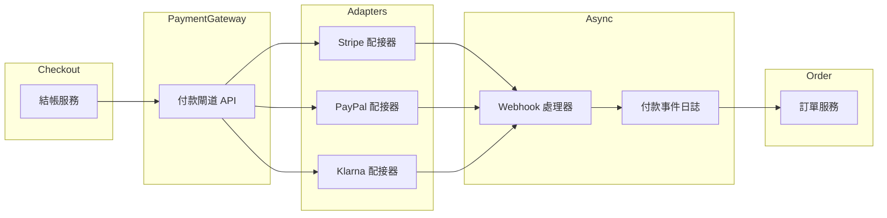
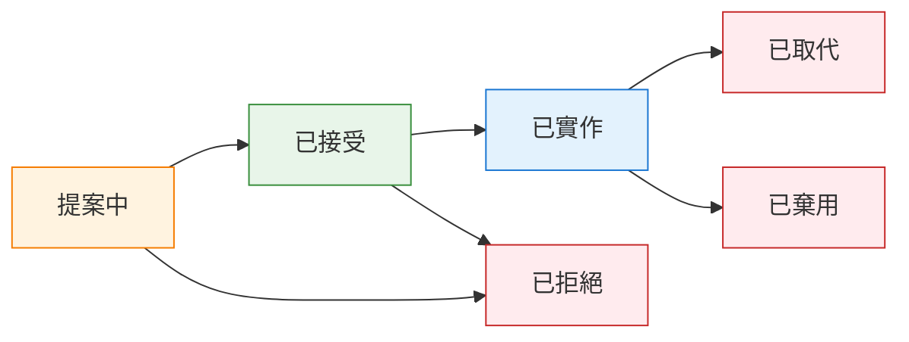

在重建電商平台的第三個月，我們遇到了一個問題：**沒人記得為什麼選擇最終一致性來管理庫存**。程式碼能運作，測試也通過了，但*為什麼*這樣做卻沒人知道。就在這時，我們實作了架構決策記錄（ADL）。來看看如何正確實作。

**這是兩部分系列文章的第一部分。** 本文涵蓋基礎知識——什麼是 ADL、如何撰寫，以及真實範例。[第二部分](/2026/01/Architecture-Decision-Log-Advanced-Topics-zh-TW) 涵蓋跨團隊擴展 ADR、利害關係人管理和效果評估。

---

## 1 什麼是架構決策記錄？

**架構決策記錄**（Architecture Decision Log）是一系列帶有時間戳記、版本化的記錄，用於捕捉系統設計過程中做出的**重要技術選擇**，以及當時考慮的**背景、後果和權衡**。

把它想像成系統架構的**決策審計軌跡**。不是每個 commit 都需要記錄，但當你在資料庫引擎、一致性模型或服務邊界之間做選擇時？把它記下來。

**為什麼複雜系統需要 ADL：**

| 特性 | 為什麼文件化很重要 |
|------|-------------------|
| **生命週期長** | 系統演進數年；原始背景逐漸模糊 |
| **團隊流動** | 架構師離開；知識隨之流失 |
| **複雜權衡** | 一致性 vs. 延遲，耦合 vs. 內聚 |
| **事故事後檢討** | 理解設計意圖可加速根本原因分析 |
| **新人導入** | 新工程師先理解*為什麼*，再理解*做什麼* |

**ADL 不是什麼：**

- ❌ 設計規格說明書（那是獨立的文件）
- ❌ 會議記錄堆砌（保持結構化）
- ❌ 變更日誌（追蹤*什麼*改變了；ADL 追蹤*為什麼*）
- ❌ 永久法律（決策可以被取代——也要記錄下來）

---

## 2 良好決策記錄的結構

每個扎實的記錄都回答**五個問題**：

| # | 問題 | 章節 | 目的 |
|---|------|------|------|
| 1 | **我們要解決什麼問題？** | 背景 | 框定決策、限制條件、利害關係人 |
| 2 | **我們考慮了哪些選項？** | 候選方案 | 展示解決方案空間和權衡 |
| 3 | **我們決定了什麼？** | 決策 | 清晰具體地陳述選擇 |
| 4 | **後果是什麼？** | 後果 | 誠實記錄好處和權衡 |
| 5 | **還有什麼相關？** | 相關決策 | 連結到其他決策以提供背景 |

如果你的 ADR 沒有回答所有五個問題，它就是不完整的。以下是每個問題為什麼重要——以及跳過它會發生什麼事。

---

### 問題 1：我們要解決什麼問題？

**目的：** 在*做什麼*之前先建立*為什麼*。沒有背景，未來的讀者無法理解為什麼當時的決策是合理的。

**包含內容：**
- 業務驅動因素（例如：「黑色星期五流量造成 3 秒延遲」）
- 技術限制（例如：「必須在現有 AWS 基礎設施內運作」）
- 法規要求（例如：「GDPR 要求 30 天內刪除資料」）
- 涉及的利害關係人（例如：「合規團隊要求審計日誌」）

**好範例：**
```markdown
## 背景
- **需求**：支援閃購期間 10K 併發用戶
- **問題**：強一致性導致熱門商品的鎖競爭
- **限制**：必須防止超賣（不能賣沒有的東西）
- **當前狀態**：資料庫列鎖在高峯期間造成 2-3 秒延遲
```

**壞範例（太模糊）：**
```markdown
## 背景
我們需要更好的方式處理庫存。舊系統很慢。
```

**跳過這個會發生什麼事：**
未來的工程師看到決策卻不理解它解決的問題。他們可能因為錯誤的原因推翻它：

```
工程師（2027）：「為什麼庫存使用最終一致性？」
*閱讀 ADR，沒有看到背景*
工程師：「看起來像是過度設計。我們用強一致性吧。」
*回滾到強一致性*
*閃購因為鎖競爭導致系統崩潰*
```

**測試：** 不在現場的人能理解*為什麼*這個決策是必要的嗎？

---

### 問題 2：我們考慮了哪些選項？

**目的：** 證明你探索了解決方案空間。這能區分深思熟慮的決策和盲目跟風的工程。

**包含內容：**
- 至少 2-3 個真正考慮過的替代方案
- 每個方案的優缺點（誠實面對首選方案的缺點）
- 為什麼每個被拒絕（具體、數據驅動的原因）

**好範例：**
```markdown
## 候選方案

| 選項 | 優點 | 缺點 | 適合度 |
|------|------|------|--------|
| **強一致性** | 簡單，不會超賣 | 鎖競爭，高峯期 2-3 秒延遲 | ❌ 差 |
| **最終一致性 + 預訂** | 擴展性好，不會超賣 | 複雜的超時處理 | ✅ 強 |
| **最終一致性 + 超賣緩衝** | 最簡單，最快 | 退款風險，客戶投訴 | ⚠️ 有风险 |
```

**壞範例（稻草人）：**
```markdown
## 候選方案

| 選項 | 適合度 |
|------|--------|
| Redis | ✅ 已選擇 |
| MySQL | ❌ 太慢 |
| MongoDB | ❌ 沒有事務（錯的—MongoDB 有事務） |
```

**跳過這個會發生什麼事：**
你無法判斷團隊：
- 是否真的評估了選項
- 是否選擇了第一個想到的東西
- 是否做了政治決策（「CTO 喜歡 Redis」）

後來，當有人問「為什麼不用 DynamoDB？」時，沒有答案。辯論從頭開始。

**測試：** 如果有人挑戰這個決策，你能指出文件化的原因說明為什麼拒絕替代方案嗎？

---

### 問題 3：我們決定了什麼？

**目的：** 讓實際選擇明確無誤。這看起來很明顯，但許多 ADR 把決策埋在散文裡。

**包含內容：**
- 清晰陳述選擇了什麼
- 具體的實作細節（不只是「我們用 Redis」，而是「6 節點的 Redis Cluster」）
- 明確提及*沒有*選擇什麼（如果不在候選方案表中）

**好範例：**
```markdown
## 決策
我們將使用**帶有庫存預訂的最終一致性**。

- 加入購物車時預訂商品 10 分鐘（基於 TTL）
- 付款確認將預訂轉換為扣減
- 超時將預訂釋放回可用池
- 使用 Redis 有序集合追蹤預訂（帶過期的 ZSET）
```

**壞範例（埋藏的決策）：**
```markdown
## 決策
經過多次討論並考慮各種因素，包括
團隊專業知識、成本影響和長期可維護性，
我們決定採用一種利用
最終一致性模式的方法，類似於上面
候選方案章節中描述的內容。
```

**跳過這個會發生什麼事：**
每個人都閱讀 ADR，但帶著不同的解釋離開：

```
工程師 A：「所以我們用最終一致性，對吧？」
工程師 B：「我以為我們用帶快取的強一致性？」
工程師 C：「ADR 有說用哪個資料庫嗎？」
*三個不同的實作上線了*
```

**測試：** 兩個工程師讀了這個能實作出同樣的東西嗎？

---

### 問題 4：後果是什麼？

**目的：** 誠實記錄權衡。每個決策都有缺點——如果你說不出來，代表你思考得不夠深入。

**包含內容：**
- 正面後果（你預期的好處）
- 負面後果（權衡、技術債、營運負擔）
- 負面後果的緩解策略

**好範例：**
```markdown
## 後果

### 正面
- ✅ 擴展到 10K+ 併發用戶（已負載測試）
- ✅ 不會超賣（預訂保證庫存）
- ✅ 延遲降到 < 100ms（沒有列鎖）

### 負面
- ⚠️ 複雜性：預訂超時處理（cron + Lua 腳本）
- ⚠️ 邊界情況：如果付款超過 10 分鐘，用戶失去購物車
- ⚠️ 營運負擔：監控預訂佇列深度

### 緩解
- 在佇列深度 > 1000 時發出警報
- 為超時情況實作購物車恢復郵件
```

**壞範例（只有好處）：**
```markdown
## 後果
這個決策將改善效能、可擴展性和可維護性。
團隊對這個現代方法感到興奮。
```

**跳過這個會發生什麼事：**
- **驚喜變成事故：** 「沒人說我們需要監控預訂佇列！」
- **權衡被遺忘：** 未來的工程師認為選擇的方案是完美的
- **事後檢討更困難：** 無法判斷問題是已知風險還是新問題

**測試：** 是否列出了至少 2-3 個負面後果？如果沒有，你在隱藏什麼。

---

### 問題 5：還有什麼相關？

**目的：** 將這個決策連結到更廣泛的架構。決策不是孤立存在的。

**包含內容：**
- 影響這個決策的 ADR 連結
- 將被這個決策影響的 ADR 連結
- 外部資源連結（RFC、文件、部落格文章）

**好範例：**
```markdown
## 相關決策
- ADR-0038：Redis 用於快取層（基礎設施選擇）
- ADR-0045：購物車服務架構（上游服務）
- ADR-0051：付款超時處理（相關超時邏輯）

## 參考資料
- [Redis 有序集合文件](https://redis.io/commands/zset/)
- [Martin Fowler：最終一致性](https://martinfowler.com/articles/eventual.html)
```

**壞範例（沒有連結）：**
```markdown
## 相關決策
查看其他 ADR 以了解更多背景。
```

**跳過這個會發生什麼事：**
- **孤立的決策：** 無法追蹤架構敘事
- **矛盾：** ADR-0042 說「用 Redis」但 ADR-0050 說「不要用新的 Redis」，沒人注意到
- **新人導入受苦：** 新工程師無法跟隨決策鏈

**測試：** 你能從這個 ADR 導航到所有相關決策而不需要搜尋嗎？

---

## 3 真實電商決策範例

讓我們看看電商平台建構中的實際決策。

### 範例 1：訂單服務的資料庫選擇

```markdown
# ADR-0023：訂單服務資料庫選擇

## 狀態
已接受（2025-09-15）

## 背景
需要為訂單服務選擇持久化儲存（100K 訂單/天，高峯 5K/小時）。

**需求：**
- ACID 事務（付款 + 庫存 + 訂單必須是原子的）
- 複雜查詢（按狀態、日期範圍、客戶、SKU 過濾）
- 讀多寫少：80% 讀，20% 寫（瀏覽 vs. 購買）
- 保留：7 年（稅務/法律要求）
- 備份 RPO：< 5 分鐘

## 候選方案

| 資料庫 | 優點 | 缺點 | 適合度 |
|--------|------|------|--------|
| **PostgreSQL** | ACID、複雜查詢、成熟、JSONB 支援 | 僅垂直擴展，寫入瓶頸約 10K/秒 | ✅ 強 |
| **MongoDB** | 水平擴展、靈活 schema、易於分片 | 多文件事務複雜、預設最終一致性 | ⚠️ 有風險 |
| **DynamoDB** | 無限擴展、託管、低延遲 | 查詢限制（單一分區鍵）、大規模時昂貴 | ❌ 不適合 |
| **CockroachDB** | ACID + 水平擴展、PostgreSQL 相容 | 較新的技術、營運複雜性、較高延遲 | ⚠️ 過度設計 |

## 決策
我們將使用 **PostgreSQL**（RDS，多可用區部署）。

**理由：**
- 開箱即用的 ACID 合規（對訂單狀態轉換至關重要）
- 複雜查詢支援（用於報告的 JOIN、用於分析的視窗函數）
- 團隊專業知識（已經將 PostgreSQL 用於其他服務）
- 在我們的規模下具成本效益（約 2K/月 vs. CockroachDB 的 8K+）

**拒絕的替代方案：**
- MongoDB：事務複雜性超過 schema 靈活性的好處
- DynamoDB：查詢模式不符合單鍵訪問模型
- CockroachDB：過早優化；PostgreSQL 輕鬆處理 100K/天

## 後果

### 正面
- ✅ ACID 保證（沒有訂單狀態損壞）
- ✅ 豐富的查詢能力（初期不需要獨立的分析資料庫）
- ✅ 團隊生產力（熟悉的技術、現有工具）
- ✅ 成本效益（可預測的定價，沒有意外的出口費用）

### 負面
- ⚠️ 垂直擴展上限（約 50K 寫入/秒後需要分片）
- ⚠️ 讀取副本增加複製延遲（報告可接受 1-2 秒）
- ⚠️ Schema 遷移需要協調（使用 Flyway 進行版本控制）
- ⚠️ 單區域部署（多區域增加複雜性，目前還不需要）

## 效能目標
| 指標 | 目標 | 測量方式 |
|------|------|----------|
| 訂單建立延遲 | < 200ms (P99) | 應用程式指標 |
| 查詢回應時間 | < 500ms (P95) | RDS Performance Insights |
| 備份 RPO | < 5 分鐘 | RDS 自動備份 |
| 恢復 RTO | < 30 分鐘 | 多可用區故障轉移測試 |

## 遷移路徑
如果我們超過單個 PostgreSQL 實例的容量：
1. 為報告查詢新增讀取副本（立即）
2. 按日期分區（90 天前的訂單歸檔到存檔表）
3. 如果寫入量超過 50K/天，按 customer_id 分片（12-18 個月後）
4. 分片的預估工作：2-3 個工程師月

## 相關決策
- ADR-0012：服務邊界（訂單服務定義）
- ADR-0031：資料庫遷移策略（Flyway）
- ADR-0045：庫存的事件來源（不同的一致性模型）
```

### 範例 2：付款閘道整合模式

```markdown
# ADR-0037：付款閘道整合策略

## 狀態
已接受（2025-10-22）

## 背景
需要整合多個付款提供者（Stripe、PayPal、Klarna、本地銀行）。

**需求：**
- 2026 年第二季前支援 4+ 個付款提供者
- 提供者故障轉移（如果 Stripe 掛了，路由到 PayPal）
- 為結帳服務提供統一 API（不要暴露提供者差異）
- PCI-DSS 合規（最小化範圍）
- 支援退款、部分退款、扣款

## 候選方案

| 模式 | 優點 | 缺點 | 適合度 |
|------|------|------|--------|
| **直接整合** | 完全控制，沒有抽象開銷 | 緊耦合，難以切換提供者 | ❌ 差 |
| **配接器模式** | 統一介面，易於新增提供者 | 更多程式碼需要維護，抽象洩漏 | ✅ 強 |
| **付款協調層** | 內建故障轉移、路由規則、分析 | 第三方依賴，成本（每筆交易 0.5-1%） | ⚠️ 可考慮 |
| **事件驅動（webhooks）** | 解耦、非同步處理 | 複雜的狀態管理、最終一致性 | ⚠️ 部分 |

## 決策
我們將使用**帶有事件驅動 Webhooks 的配接器模式**。

**架構：**



**關鍵設計選擇：**
- 閘道暴露統一介面：`charge()`、`refund()`、`cancel()`
- 每個提供者有專門的配接器實作 `PaymentProvider` 介面
- Webhooks 非同步處理（SQS → Lambda → 事件日誌）
- 冪等鍵防止重複扣款（儲存在 Redis，24 小時 TTL）

## 後果

### 正面
- ✅ 提供者切換對結帳服務透明（變更設定，重新部署配接器）
- ✅ 故障轉移支援（斷路器檢測故障，路由到備份）
- ✅ PCI 範圍最小化（Stripe.js 處理卡片資料，我們獲得權杖）
- ✅ 非同步 webhook 處理（不阻塞，失敗時重試）

### 負面
- ⚠️ 抽象洩漏（不是所有提供者都支援部分退款，Klarna 有不同的流程）
- ⚠️ 測試複雜性（必須模擬 4+ 個提供者、webhook 簽名、錯誤情境）
- ⚠️ 營運負擔（監控 webhook 送達率、提供者 SLA）
- ⚠️ 狀態調解（如果 webhook 丟失了怎麼辦？需要每日調解作業）

## 合規
- PCI-DSS SAQ-A（最低範圍）：我們處理權杖，不是卡片資料
- PSD2 SCA：配接器處理 3D Secure 2.0 流程
- GDPR：付款資料保留策略（7 年後刪除）

## 測試策略
| 測試類型 | 覆蓋範圍 | 工具 |
|----------|----------|------|
| 單元測試 | 配接器邏輯 | Jest、模擬提供者 |
| 整合測試 | Webhook 簽名 | 提供者沙盒 |
| E2E 測試 | 完整結帳流程 | Cypress、測試卡 |
| 混亂測試 | 提供者停機 | AWS Fault Injection Simulator |

## 相關決策
- ADR-0012：服務邊界（結帳服務定義）
- ADR-0038：Redis 用於冪等鍵
- ADR-0041：付款狀態的事件來源
- ADR-0052：斷路器模式（彈性）
```

---

## 4 在哪裡儲存決策記錄

不同的團隊有不同的工作流程。根據你組織的背景選擇：

### 選項 1：程式碼倉庫（推薦給工程團隊）

如果你的團隊生活在 Git 中並通過 PR 審查變更：

```
docs/
└── architecture/
    └── decisions/
        ├── 0001-record-architecture-decisions.md
        ├── 0002-choose-database-for-order-service.md
        ├── 0003-eventual-consistency-for-inventory.md
        └── 0004-payment-gateway-adapter-pattern.md
```

**為什麼這對工程團隊有效：**

| 好處 | 如何幫助 |
|------|----------|
| **Git 版本控制** | 追蹤變更、blame 顯示誰更新了什麼、易於回滾 |
| **PR 工作流程** | ADR 經歷與程式碼相同的審查流程 |
| **與程式碼共存** | ADR 與它們描述的實作放在一起 |
| **Markdown 渲染** | 在 GitHub/GitLab 中良好顯示，不需要單獨的檢視器 |
| **可搜尋** | 像 grep 程式碼一樣 grep ADR |

**最適合：** 軟體工程團隊、開源專案、已經使用 Git 工作流程的團隊。

---

### 選項 2：Wiki / Confluence

如果你的組織已經使用 wiki 進行文件管理：

**為什麼這有效：**

| 好處 | 如何幫助 |
|------|----------|
| **易於瀏覽** | 非工程師可以在不需要 Git 知識的情況下導航 |
| **豐富的格式** | 嵌入圖表、附件、評論 |
| **內建搜尋** | 不需要學習 grep 或 Git 命令 |
| **訪問控制** | 與現有組織權限整合 |

**權衡：**

| 擔憂 | 緩解 |
|------|------|
| 版本歷史笨拙 | 使用頁面歷史、匯出快照 |
| 與程式碼庫脫節 | 新增「最後驗證」日期、連結到程式碼 |
| 沒有 PR 工作流程 | 在發布前需要批准 |

**最適合：** 跨功能團隊、大量使用 Confluence 的組織、非工程師需要訪問的合規密集環境。

---

### 選項 3：專用 ADR 工具

像 `adr-tools`、`log4brains` 或 `nadr` 這樣的工具提供 CLI 介面和靜態網站生成：

```bash
# 安裝 adr-tools
brew install adr-tools

# 建立新的 ADR（自動編號、套用模板）
adr new "Choose database for order service"

# 生成靜態網站用於瀏覽
log4brains serve
```

**為什麼這有效：**

| 好處 | 如何幫助 |
|------|----------|
| **CLI 便利** | 自動編號、模板化、連結命令 |
| **靜態網站輸出** | 在網頁 UI 中瀏覽 ADR |
| **Git 相容** | 將文件儲存在倉庫中，但新增工具層 |

**權衡：**

| 擔憂 | 緩解 |
|------|------|
| 另一個工具需要學習 | 團隊導入、文件 |
| 工具可能被遺棄 | 文件是純 markdown，可以遷移 |

**最適合：** 想要結構但不想要官僚主義的團隊、喜歡 CLI 工具的團隊。

---

### 選項 4：混合方法

一些團隊按受眾拆分 ADR：

| ADR 類型 | 在哪裡儲存 |
|----------|------------|
| **技術/工程** | 程式碼倉庫（給工程師） |
| **業務/合規** | Wiki 或 Confluence（給審計師、管理層） |
| **跨功能** | 兩者（定期同步） |

**最適合：** 有多樣利害關係人的大型組織、受監管的產業。

---

### 我們的建議

**從你的團隊已經工作的地方開始：**

| 如果你的團隊... | 使用... |
|-----------------|---------|
| 生活在 GitHub/GitLab | 程式碼倉庫 |
| 生活在 Confluence | Wiki |
| 想要程式碼 + 瀏覽 | 程式碼倉庫 + 靜態網站生成器 |
| 有非工程師利害關係人 | Wiki 或混合 |

最好的儲存是你的團隊**實際上會持續使用**的那一個。

---

### 命名慣例（無論儲存在哪裡）

```
NNNN-short-kebab-case-title.md
```

- `NNNN`：零填充的順序號（0001、0002、...）
- `short-kebab-case-title`：描述性的、可搜尋的（最多 5-7 個單詞）

**基本工作流程：**

1. **建立**：`cp template.md docs/architecture/decisions/0024-new-feature.md`
2. **撰寫**：填寫所有章節（特別是**候選方案**）
3. **審查**：團隊驗證權衡是否被誠實記錄
4. **儲存**：提交到倉庫或發布到 wiki
5. **更新**：在實作/取代時變更狀態

---

## 5 何時撰寫決策記錄

**在以下情況撰寫 ADR：**

| 觸發因素 | 範例 |
|----------|------|
| **新技術採用** | 選擇 PostgreSQL、Redis、Kafka |
| **架構模式** | CQRS、事件來源、微服務邊界 |
| **具有持久影響的權衡** | 一致性 vs. 可用性、延遲 vs. 耐用性 |
| **整合策略** | 付款閘道、運輸提供者、身份提供者 |
| **推翻先前的決策** | 用新方法取代 ADR-0017 |
| **導入複雜性** | 「我們為什麼要這樣做？」反覆出現 |

**不要為以下撰寫 ADR：**

- ❌ 瑣碎的選擇（變數命名、資料夾結構）
- ❌ 幾週內會變更的決策（實驗性功能）
- ❌ 實作細節（那是程式碼註解 + PR 描述）
- ❌ 每個 bug 修復或重構

**經驗法則：** 如果推翻決策需要**大量的重做**或**改變系統行為**，就記錄它。

---

## 6 決策狀態生命週期

追蹤每個決策的狀態：



| 狀態 | 意義 | 何時使用 |
|------|------|----------|
| **提案中** | 討論中，尚未提交 | RFC 階段、團隊審查 |
| **已接受** | 決策已定，準備實作 | PR 已合併，工作開始 |
| **已實作** | 已在生產環境運作 | 部署後驗證 |
| **已取代** | 被更新的決策取代 | ADR-0050 取代 ADR-0023 |
| **已棄用** | 仍在使用，但正在逐步淘汰 | 遷移進行中 |
| **已拒絕** | 已考慮但未採用 | 記錄原因以供未來參考 |

**始終連結取代的決策：**

```markdown
## 狀態
被 ADR-0050 取代（2026-01-10）

## 取代原因
在生產負載測試後選擇混合方法，顯示
LSM 開銷在當前交易量下超過好處。
請參閱 ADR-0050 以獲取更新的分析。
```

---

## 附錄：ADR 模板（可直接複製）

```markdown
# ADR-NNNN：[標題]

## 狀態
[提案中 | 已接受 | 已實作 | 已取代 | 已棄用 | 已拒絕]

## 背景
[我們要解決什麼問題？存在什麼限制？列出需求、
業務驅動因素、技術限制。使用項目符號以提高清晰度。]

## 候選方案

| 選項 | 優點 | 缺點 | 適合度 |
|------|------|------|--------|
| **[選項 1]** | [好處 1]、[好處 2] | [權衡 1]、[權衡 2] | ✅ 強 / ⚠️ 可考慮 / ❌ 差 |
| **[選項 2]** | ... | ... | ... |
| **[選項 3]** | ... | ... | ... |

## 決策
[清晰陳述決策。具體說明我們要採用什麼。
包含被拒絕的替代方案及其未被選擇的簡要理由。]

## 後果

### 正面
- ✅ [好處 1]
- ✅ [好處 2]
- ✅ [好處 3]

### 負面
- ⚠️ [權衡 1]
- ⚠️ [權衡 2]
- ⚠️ [權衡 3]

## 效能目標
[如果適用，列出帶有驗收標準的可測量目標。]

| 指標 | 目標 | 測量方式 |
|------|------|----------|
| [指標名稱] | [目標值] | [如何測量] |

## 遷移路徑
[如果推翻這個決策，需要做什麼？預估工作。]

## 相關決策
- ADR-NNNN：[標題](連結)
- ADR-NNNN：[標題](連結)

## 參考資料
- [連結到 RFC、設計文件或外部資源]
```

---

## 接下來是什麼？

你現在已經擁有了撰寫第一份 ADR 所需的一切。但是，當你需要跨多個團隊擴展時會發生什麼？你如何處理利害關係人審查、衡量效果，或應對組織政治？

**[第二部分：進階主題](/2026/01/Architecture-Decision-Log-Advanced-Topics-zh-TW)** 涵蓋：
- 利害關係人管理和 RACI 模型
- 包含審查清單的完整 10 步工作流程
- 深度探討：列出候選方案是否應該是強制性的？
- 常見陷阱及如何避免
- 衡量 ADL 效果
- 真實情境：採用 ADR 前後的對比

---

**進一步閱讀：**

- Michael Nygard 的原始 [ADR 格式](https://cognitect.com/blog/2011/11/15/documenting-architecture-decisions)
- `adr-tools` [CLI 工具](https://github.com/npryce/adr-tools)
- "Software Architecture for Developers" — 關於決策記錄的章節
