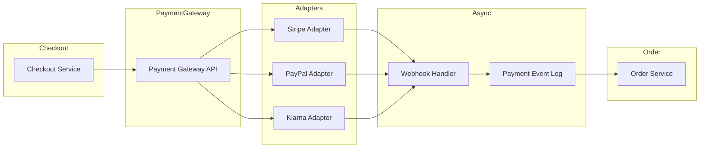
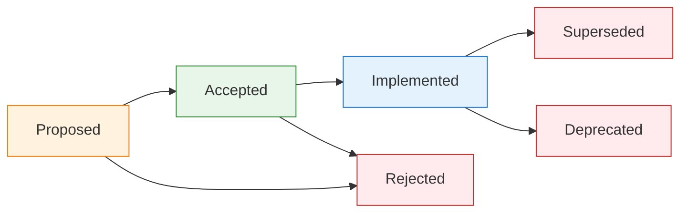

Three months into rebuilding our e-commerce platform, we faced a problem: **nobody remembered why we chose eventual consistency for inventory management**. The code worked. Tests passed. But the *why* was lost. That's when we implemented an Architecture Decision Log (ADL). Here's how to do it right.

**This is Part 1 of a 2-part series.** This article covers the essentials—what ADLs are, how to write them, and real examples. [Part 2](/2026/01/Architecture-Decision-Log-Advanced-Topics) covers scaling ADRs across teams, stakeholder management, and measuring effectiveness.

---

## 1 What Is an Architecture Decision Log?

An **Architecture Decision Log** is a collection of timestamped, versioned records that capture **significant technical choices** made during system design, along with the **context, consequences, and trade-offs** considered at the time.

Think of it as a **decision audit trail** for your system's architecture. Not every commit needs one. But when you choose between database engines, consistency models, or service boundaries? Document it.

**Why Complex Systems Need ADLs:**

| Characteristic | Why Documentation Matters |
|----------------|---------------------------|
| **Long lifecycle** | Systems evolve over years; original context fades |
| **Team turnover** | Architects leave; knowledge walks out with them |
| **Complex trade-offs** | Consistency vs. latency, coupling vs. cohesion |
| **Incident postmortems** | Understanding design intent speeds root-cause analysis |
| **Onboarding** | New engineers grasp *why* before *what* |

**What an ADL Is NOT:**

- ❌ A design specification (that's separate)
- ❌ A meeting minutes dump (keep it structured)
- ❌ A change log (that tracks *what* changed; ADL tracks *why*)
- ❌ Permanent law (decisions can be superseded—document that too)

---

## 2 The Anatomy of a Good Decision Record

Every solid record answers **five questions**:

| # | Question | Section | Purpose |
|---|----------|---------|---------|
| 1 | **What problem are we solving?** | Context | Frame the decision, constraints, stakeholders |
| 2 | **What options did we consider?** | Candidates Considered | Show the solution space and trade-offs |
| 3 | **What did we decide?** | Decision | State the choice clearly and specifically |
| 4 | **What are the consequences?** | Consequences | Document benefits and trade-offs honestly |
| 5 | **What else is related?** | Related Decisions | Link to other decisions for context |

If your ADR doesn't answer all five, it's incomplete. Here's why each question matters—and what happens when you skip it.

---

### Question 1: What Problem Are We Solving?

**Purpose:** Establish the *why* before the *what*. Without context, future readers can't understand why the decision made sense at the time.

**What to Include:**
- Business drivers (e.g., "Black Friday traffic caused 3s latency")
- Technical constraints (e.g., "Must work within existing AWS infrastructure")
- Regulatory requirements (e.g., "GDPR requires data deletion within 30 days")
- Stakeholders involved (e.g., "Compliance team mandated audit logging")

**Good Example:**
```markdown
## Context
- **Requirement**: Support 10K concurrent users during flash sales
- **Problem**: Strong consistency causes lock contention on popular items
- **Constraint**: Must prevent overselling (can't sell what we don't have)
- **Current state**: Database row locks cause 2-3s latency during peaks
```

**Bad Example (Too Vague):**
```markdown
## Context
We needed a better way to handle inventory. The old system was slow.
```

**What Happens If You Skip This:**
Future engineers see a decision without understanding the problem it solved. They might reverse it for the wrong reasons:

```
Engineer (2027): "Why does inventory use eventual consistency?"
*reads ADR, sees no context*
Engineer: "Seems like overengineering. Let's use strong consistency."
*Reverts to strong consistency*
*Flash sale crashes the system due to lock contention*
```

**The Test:** Can someone who wasn't in the room understand *why* this decision was necessary?

---

### Question 2: What Options Did We Consider?

**Purpose:** Prove you explored the solution space. This separates thoughtful decisions from cargo-cult engineering.

**What to Include:**
- At least 2-3 genuinely considered alternatives
- Pros and cons for each (be honest about downsides of your preferred choice)
- Why each was rejected (specific, data-driven reasons)

**Good Example:**
```markdown
## Candidates Considered

| Option | Pros | Cons | Fit |
|--------|------|------|-----|
| **Strong consistency** | Simple, no overselling | Lock contention, 2-3s latency at peak | ❌ Poor |
| **Eventual + reservation** | Scales well, no overselling | Complex timeout handling | ✅ Strong |
| **Eventual + oversell buffer** | Simplest, fastest | Risk of refunds, customer complaints | ⚠️ Risky |
```

**Bad Example (Strawman):**
```markdown
## Candidates Considered

| Option | Fit |
|--------|-----|
| Redis | ✅ Selected |
| MySQL | ❌ Too slow |
| MongoDB | ❌ No transactions (wrong—MongoDB has transactions) |
```

**What Happens If You Skip This:**
You can't tell if the team:
- Actually evaluated options
- Chose the first thing that came to mind
- Made a political decision ("CTO likes Redis")

Later, when someone asks "why not DynamoDB?", there's no answer. The debate restarts from scratch.

**The Test:** If someone challenges the decision, can you point to documented reasons why alternatives were rejected?

---

### Question 3: What Did We Decide?

**Purpose:** Make the actual choice unambiguous. This seems obvious, but many ADRs bury the decision in prose.

**What to Include:**
- Clear statement of what was chosen
- Specific implementation details (not just "we'll use Redis" but "Redis Cluster with 6 nodes")
- Explicit mention of what was *not* chosen (if not in candidates table)

**Good Example:**
```markdown
## Decision
We will use **eventual consistency with inventory reservation**.

- Cart addition reserves items for 10 minutes (TTL-based)
- Payment confirmation converts reservation to deduction
- Timeout releases reservation back to available pool
- Redis sorted sets for reservation tracking (ZSET with expiry)
```

**Bad Example (Buried Decision):**
```markdown
## Decision
After much discussion and consideration of various factors including
team expertise, cost implications, and long-term maintainability,
we have decided to move forward with an approach that leverages
eventual consistency patterns, similar to what was described in the
candidates section above.
```

**What Happens If You Skip This:**
Everyone reads the ADR and walks away with different interpretations:

```
Engineer A: "So we're using eventual consistency, right?"
Engineer B: "I thought we went with strong consistency with caching?"
Engineer C: "Does the ADR say which database?"
*Three different implementations ship*
```

**The Test:** Can two engineers read this and implement the same thing?

---

### Question 4: What Are the Consequences?

**Purpose:** Document the trade-offs honestly. Every decision has downsides—if you can't name them, you haven't thought hard enough.

**What to Include:**
- Positive consequences (benefits you expect)
- Negative consequences (trade-offs, technical debt, operational burden)
- Mitigation strategies for the negatives

**Good Example:**
```markdown
## Consequences

### Positive
- ✅ Scales to 10K+ concurrent users (load tested)
- ✅ No overselling (reservation guarantees stock)
- ✅ Latency drops to < 100ms (no row locks)

### Negative
- ⚠️ Complexity: Reservation timeout handling (cron + Lua scripts)
- ⚠️ Edge case: User loses cart if payment takes > 10 minutes
- ⚠️ Operational burden: Monitor reservation queue depth

### Mitigation
- Add alerting on queue depth > 1000
- Implement cart recovery email for timeout cases
```

**Bad Example (Only Benefits):**
```markdown
## Consequences
This decision will improve performance, scalability, and maintainability.
The team is excited about this modern approach.
```

**What Happens If You Skip This:**
- **Surprises become incidents:** "Nobody mentioned we'd need to monitor reservation queues!"
- **Trade-offs get forgotten:** Future engineers think the chosen solution is perfect
- **Postmortems are harder:** Can't tell if a problem was a known risk or a new issue

**The Test:** Are there at least 2-3 negative consequences listed? If not, you're hiding something.

---

### Question 5: What Else Is Related?

**Purpose:** Connect this decision to the broader architecture. Decisions don't exist in isolation.

**What to Include:**
- Links to ADRs that influenced this one
- Links to ADRs that will be affected by this one
- Links to external resources (RFCs, docs, blog posts)

**Good Example:**
```markdown
## Related Decisions
- ADR-0038: Redis for Caching Layer (infrastructure choice)
- ADR-0045: Cart Service Architecture (upstream service)
- ADR-0051: Payment Timeout Handling (related timeout logic)

## References
- [Redis Sorted Sets Documentation](https://redis.io/commands/zset/)
- [Martin Fowler: Eventual Consistency](https://martinfowler.com/articles/eventual.html)
```

**Bad Example (No Links):**
```markdown
## Related Decisions
See other ADRs for more context.
```

**What Happens If You Skip This:**
- **Orphaned decisions:** Can't trace the architectural narrative
- **Contradictions:** ADR-0042 says "use Redis" but ADR-0050 says "no new Redis usage" and nobody notices
- **Onboarding suffers:** New engineers can't follow the decision chain

**The Test:** Can you navigate from this ADR to all related decisions without searching?

---

## 3 Real E-Commerce Decision Examples

Let's walk through actual decisions from an e-commerce platform build.

### Example 1: Database Selection for Order Service

```markdown
# ADR-0023: Order Service Database Selection

## Status
Accepted (2025-09-15)

## Context
Need persistent storage for order service (100K orders/day, peak 5K/hour).

**Requirements:**
- ACID transactions (payment + inventory + order must be atomic)
- Complex queries (filter by status, date range, customer, SKU)
- Read-heavy: 80% reads, 20% writes (browsing vs. purchasing)
- Retention: 7 years (tax/legal requirements)
- Backup RPO: < 5 minutes

## Candidates Considered

| Database | Pros | Cons | Fit |
|----------|------|------|-----|
| **PostgreSQL** | ACID, complex queries, mature, JSONB support | Vertical scaling only, write bottleneck at ~10K/sec | ✅ Strong |
| **MongoDB** | Horizontal scaling, flexible schema, easy sharding | Multi-doc transactions complex, eventual consistency by default | ⚠️ Risky |
| **DynamoDB** | Infinite scale, managed, low latency | Query limitations (single partition key), expensive at scale | ❌ Poor fit |
| **CockroachDB** | ACID + horizontal scaling, PostgreSQL-compatible | Newer technology, operational complexity, higher latency | ⚠️ Overkill |

## Decision
We will use **PostgreSQL** (RDS, multi-AZ deployment).

**Rationale:**
- ACID compliance out-of-the-box (critical for order state transitions)
- Complex query support (JOINs for reporting, window functions for analytics)
- Team expertise (already using PostgreSQL for other services)
- Cost-effective at our scale (~$2K/month vs. $8K+ for CockroachDB)

**Rejected Alternatives:**
- MongoDB: Transaction complexity outweighs schema flexibility benefits
- DynamoDB: Query patterns don't fit single-key access model
- CockroachDB: Premature optimization; PostgreSQL handles 100K/day easily

## Consequences

### Positive
- ✅ ACID guarantees (no order state corruption)
- ✅ Rich query capabilities (no need for separate analytics DB initially)
- ✅ Team productivity (familiar technology, existing tooling)
- ✅ Cost efficiency (predictable pricing, no surprise egress fees)

### Negative
- ⚠️ Vertical scaling ceiling (~50K writes/sec before sharding needed)
- ⚠️ Read replicas add replication lag (1-2 seconds acceptable for reporting)
- ⚠️ Schema migrations require coordination (use Flyway for versioning)
- ⚠️ Single region deployment (multi-region adds complexity, not needed yet)

## Performance Targets
| Metric | Target | Measurement |
|--------|--------|-------------|
| Order creation latency | < 200ms (P99) | Application metrics |
| Query response time | < 500ms (P95) | RDS Performance Insights |
| Backup RPO | < 5 minutes | RDS automated backups |
| Recovery RTO | < 30 minutes | Multi-AZ failover testing |

## Migration Path
If we outgrow single PostgreSQL instance:
1. Add read replicas for reporting queries (immediate)
2. Partition by date (orders older than 90 days to archive tables)
3. Shard by customer_id if write volume exceeds 50K/day (12-18 months out)
4. Estimated effort for sharding: 2-3 engineer-months

## Related Decisions
- ADR-0012: Service Boundaries (Order Service Definition)
- ADR-0031: Database Migration Strategy (Flyway)
- ADR-0045: Event Sourcing for Inventory (different consistency model)
```

### Example 2: Payment Gateway Integration Pattern

```markdown
# ADR-0037: Payment Gateway Integration Strategy

## Status
Accepted (2025-10-22)

## Context
Need to integrate multiple payment providers (Stripe, PayPal, Klarna, local banks).

**Requirements:**
- Support 4+ payment providers by Q2 2026
- Provider failover (if Stripe down, route to PayPal)
- Unified API for checkout service (don't expose provider differences)
- PCI-DSS compliance (minimize scope)
- Support refunds, partial refunds, chargebacks

## Candidates Considered

| Pattern | Pros | Cons | Fit |
|---------|------|------|-----|
| **Direct integration** | Full control, no abstraction overhead | Tight coupling, hard to swap providers | ❌ Poor |
| **Adapter pattern** | Unified interface, easy to add providers | More code to maintain, abstraction leaks | ✅ Strong |
| **Payment orchestration layer** | Built-in failover, routing rules, analytics | Third-party dependency, cost (0.5-1% per transaction) | ⚠️ Consider |
| **Event-driven (webhooks)** | Decoupled, async processing | Complex state management, eventual consistency | ⚠️ Partial |

## Decision
We will use **Adapter Pattern with Event-Driven Webhooks**.

**Architecture:**



**Key Design Choices:**
- Gateway exposes unified interface: `charge()`, `refund()`, `cancel()`
- Each provider has dedicated adapter implementing `PaymentProvider` interface
- Webhooks processed asynchronously (SQS → Lambda → Event Log)
- Idempotency keys prevent duplicate charges (store in Redis, 24h TTL)

## Consequences

### Positive
- ✅ Provider swap transparent to checkout service (change config, redeploy adapter)
- ✅ Failover support (circuit breaker detects failures, routes to backup)
- ✅ PCI scope minimized (Stripe.js handles card data, we get tokens)
- ✅ Async webhook processing (no blocking, retry on failure)

### Negative
- ⚠️ Abstraction leaks (not all providers support partial refunds, Klarna has different flow)
- ⚠️ Testing complexity (must mock 4+ providers, webhook signatures, error scenarios)
- ⚠️ Operational burden (monitor webhook delivery rates, provider SLAs)
- ⚠️ State reconciliation (what if webhook lost? Need daily reconciliation job)

## Compliance
- PCI-DSS SAQ-A (lowest scope): We handle tokens, not card data
- PSD2 SCA: Adapters handle 3D Secure 2.0 flows
- GDPR: Payment data retention policy (delete after 7 years)

## Testing Strategy
| Test Type | Coverage | Tools |
|-----------|----------|-------|
| Unit tests | Adapter logic | Jest, mock providers |
| Integration | Webhook signatures | Provider sandboxes |
| E2E | Full checkout flow | Cypress, test cards |
| Chaos | Provider downtime | AWS Fault Injection Simulator |

## Related Decisions
- ADR-0012: Service Boundaries (Checkout Service Definition)
- ADR-0038: Redis for Idempotency Keys
- ADR-0041: Event Sourcing for Payment State
- ADR-0052: Circuit Breaker Pattern (Resilience)
```

---

## 4 Where to Store Decision Records

Different teams have different workflows. Choose based on your organization's context:

### Option 1: Code Repository (Recommended for Engineering Teams)

If your team lives in Git and reviews changes via PRs:

docs/
└── architecture/
    └── decisions/
        ├── 0001-record-architecture-decisions.md
        ├── 0002-choose-database-for-order-service.md
        ├── 0003-eventual-consistency-for-inventory.md
        └── 0004-payment-gateway-adapter-pattern.md

**Why This Works for Engineering Teams:**

| Benefit | How It Helps |
|---------|--------------|
| **Git versioned** | Changes tracked, blame shows who updated what, easy to revert |
| **PR workflow** | ADRs go through the same review process as code |
| **Co-located with code** | ADRs live alongside the implementations they describe |
| **Markdown renders** | Displays nicely in GitHub/GitLab, no separate viewer needed |
| **Searchable** | `grep` through ADRs like you grep through code |

**Best For:** Software engineering teams, open-source projects, teams already using Git workflows.

---

### Option 2: Wiki / Confluence

If your organization already uses a wiki for documentation:

**Why This Works:**

| Benefit | How It Helps |
|---------|--------------|
| **Easy to browse** | Non-engineers can navigate without Git knowledge |
| **Rich formatting** | Embed diagrams, attachments, comments |
| **Search built-in** | No need to learn grep or Git commands |
| **Access control** | Integrate with existing org permissions |

**Trade-offs:**

| Concern | Mitigation |
|---------|------------|
| Version history is clunky | Use page history, export snapshots |
| Drifts from codebase | Add "Last verified" dates, link to code |
| No PR workflow | Require approval before publishing |

**Best For:** Cross-functional teams, organizations with heavy Confluence usage, compliance-heavy environments where non-engineers need access.

---

### Option 3: Dedicated ADR Tools

Tools like `adr-tools`, `log4brains`, or `nadr` provide CLI interfaces and static site generation:

```bash
# Install adr-tools
brew install adr-tools

# Create new ADR (auto-numbers, applies template)
adr new "Choose database for order service"

# Generate static site for browsing
log4brains serve
```

**Why This Works:**

| Benefit | How It Helps |
|---------|--------------|
| **CLI convenience** | Auto-numbering, templating, linking commands |
| **Static site output** | Browse ADRs in a web UI |
| **Git-compatible** | Stores files in repo, but adds tooling layer |

**Trade-offs:**

| Concern | Mitigation |
|---------|------------|
| Another tool to learn | Team onboarding, documentation |
| Tool may be abandoned | Files are plain markdown, can migrate |

**Best For:** Teams that want structure without bureaucracy, teams that like CLI tools.

---

### Option 4: Hybrid Approach

Some teams split ADRs by audience:

| ADR Type | Where to Store |
|----------|----------------|
| **Technical/Engineering** | Code repository (for engineers) |
| **Business/Compliance** | Wiki or Confluence (for auditors, management) |
| **Cross-functional** | Both (sync periodically) |

**Best For:** Large organizations with diverse stakeholders, regulated industries.

---

### Our Recommendation

**Start with where your team already works:**

| If Your Team... | Use... |
|-----------------|--------|
| Lives in GitHub/GitLab | Code repository |
| Lives in Confluence | Wiki |
| Wants both code + browsing | Code repo + static site generator |
| Has non-engineer stakeholders | Wiki or hybrid |

The best storage is the one your team will **actually use consistently**.

---

### Naming Convention (Regardless of Storage)

```
NNNN-short-kebab-case-title.md
```

- `NNNN`: Zero-padded sequential number (0001, 0002, ...)
- `short-kebab-case-title`: Descriptive, searchable (5-7 words max)

**Basic Workflow:**

1. **Create**: `cp template.md docs/architecture/decisions/0024-new-feature.md`
2. **Write**: Fill in all sections (especially **Candidates Considered**)
3. **Review**: Team validates trade-offs are documented honestly
4. **Store**: Commit to repo or publish to wiki
5. **Update**: Change status when implemented/superseded

---

## 5 When to Write a Decision Record

**Write an ADR when:**

| Trigger | Example |
|---------|---------|
| **New technology adoption** | Choosing PostgreSQL, Redis, Kafka |
| **Architectural pattern** | CQRS, event sourcing, microservices boundaries |
| **Trade-off with lasting impact** | Consistency vs. availability, latency vs. durability |
| **Integration strategy** | Payment gateway, shipping provider, identity provider |
| **Reversing a prior decision** | Superseding ADR-0017 with new approach |
| **Onboarding complexity** | "Why did we do it this way?" comes up repeatedly |

**Don't write an ADR for:**

- ❌ Trivial choices (variable naming, folder structure)
- ❌ Decisions that will change in weeks (experimental features)
- ❌ Implementation details (that's code comments + PR descriptions)
- ❌ Every bug fix or refactor

**Rule of Thumb:** If reversing the decision would require **significant rework** or **change system behavior**, document it.

---

## 6 Decision Status Lifecycle

Track the state of each decision:



| Status | Meaning | When to Use |
|--------|---------|-------------|
| **Proposed** | Under discussion, not yet committed | RFC phase, team review |
| **Accepted** | Decision made, ready to implement | PR merged, work starting |
| **Implemented** | Live in production, working | Post-deployment verification |
| **Superseded** | Replaced by newer decision | ADR-0050 supersedes ADR-0023 |
| **Deprecated** | Still in use, but being phased out | Migration in progress |
| **Rejected** | Considered but not adopted | Document why for future reference |

**Always link superseding decisions:**

```markdown
## Status
Superseded by ADR-0050 (2026-01-10)

## Supersession Reason
Hybrid approach chosen after production load testing showed
LSM overhead exceeded benefits at current transaction volumes.
See ADR-0050 for updated analysis.
```

---

## Appendix: ADR Template (Copy-Paste Ready)

```markdown
# ADR-NNNN: [Title]

## Status
[Proposed | Accepted | Implemented | Superseded | Deprecated | Rejected]

## Context
[What problem are we solving? What constraints exist? List requirements,
business drivers, technical limitations. Use bullet points for clarity.]

## Candidates Considered

| Option | Pros | Cons | Fit |
|--------|------|------|-----|
| **[Option 1]** | [Benefit 1], [Benefit 2] | [Trade-off 1], [Trade-off 2] | ✅ Strong / ⚠️ Consider / ❌ Poor |
| **[Option 2]** | ... | ... | ... |
| **[Option 3]** | ... | ... | ... |

## Decision
[State the decision clearly. Be specific about what we're adopting.
Include rejected alternatives with brief rationale for why they weren't chosen.]

## Consequences

### Positive
- ✅ [Benefit 1]
- ✅ [Benefit 2]
- ✅ [Benefit 3]

### Negative
- ⚠️ [Trade-off 1]
- ⚠️ [Trade-off 2]
- ⚠️ [Trade-off 3]

## Performance Targets
[If applicable, list measurable targets with acceptance criteria.]

| Metric | Target | Measurement |
|--------|--------|-------------|
| [Metric name] | [Target value] | [How to measure] |

## Migration Path
[If reversing this decision, what would it take? Estimate effort.]

## Related Decisions
- ADR-NNNN: [Title](link)
- ADR-NNNN: [Title](link)

## References
- [Link to RFC, design doc, or external resource]
```

---

## What's Next?

You now have everything needed to write your first ADR. But what happens when you need to scale this across multiple teams? How do you handle stakeholder reviews, measure effectiveness, or deal with organizational politics?

**[Part 2: Advanced Topics](/2026/01/Architecture-Decision-Log-Advanced-Topics)** covers:
- Stakeholder management and RACI models
- Complete 10-step workflow with review checklists
- Deep dive: Should listing candidates be mandatory?
- Common pitfalls and how to avoid them
- Measuring ADL effectiveness
- Real scenarios: Before and after ADL adoption

